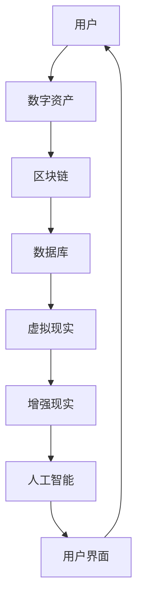

                 

关键词：数字化遗产，虚拟纪念，网上纪念馆，创业，技术实现，人工智能，深度学习，区块链，用户体验

> 摘要：本文探讨了数字化遗产虚拟纪念创业的背景、核心概念、技术实现、数学模型、项目实践、应用场景以及未来展望。文章旨在为创业者和技术爱好者提供一个全面的技术指南，帮助他们在数字化时代中探索新的商业机会，创造永恒的网上纪念馆。

## 1. 背景介绍

### 数字化遗产的概念

数字化遗产是指通过数字化技术保存和展示的人类文化遗产，包括历史文献、艺术品、音频视频资料等。随着数字化技术的不断发展，数字化遗产的重要性日益凸显。然而，如何有效地管理和展示这些遗产，使其更具互动性和吸引力，成为当前亟待解决的问题。

### 虚拟纪念的概念

虚拟纪念是通过数字化技术，如虚拟现实（VR）、增强现实（AR）等，为人们提供一个沉浸式的纪念环境，用于缅怀历史、纪念重要人物或事件。虚拟纪念不仅能够提升用户体验，还能够使历史文化遗产得以更广泛的传播和保存。

### 网上纪念馆的概念

网上纪念馆是利用互联网技术，搭建的一个用于缅怀和纪念的人物或事件的虚拟场所。它不仅能够保存历史记忆，还能够提供互动体验，使人们能够在虚拟世界中感受历史的厚重和情感的共鸣。

## 2. 核心概念与联系

### 技术架构图



### 技术联系

- **区块链**：用于保存数字资产的永久性记录，确保数据的不可篡改性和安全性。
- **数据库**：用于存储和管理大量的数字化遗产数据，如图片、音频、视频等。
- **虚拟现实与增强现实**：提供沉浸式的用户体验，使人们能够在虚拟世界中与数字化遗产进行互动。
- **人工智能**：用于分析用户行为，提供个性化的纪念内容，以及优化用户体验。
- **用户界面**：为用户提供友好的交互界面，使操作更加简便。

## 3. 核心算法原理 & 具体操作步骤

### 3.1 算法原理概述

虚拟纪念系统中的核心算法主要包括用户行为分析、个性化内容推荐和虚拟现实场景构建。以下将详细介绍这些算法的具体原理。

#### 用户行为分析

用户行为分析是一种通过分析用户在系统中的操作记录，了解用户兴趣和偏好的方法。其目的是为用户提供更加个性化的服务。

#### 个性化内容推荐

个性化内容推荐是一种基于用户行为分析和机器学习算法，为用户推荐其可能感兴趣的内容的方法。

#### 虚拟现实场景构建

虚拟现实场景构建是通过计算机图形学和虚拟现实技术，创建一个逼真的虚拟环境，使人们能够在其中自由探索。

### 3.2 算法步骤详解

#### 用户行为分析

1. 收集用户操作数据，如浏览历史、点赞、评论等。
2. 对数据进行预处理，如去重、填充缺失值等。
3. 使用机器学习算法，如决策树、支持向量机等，对用户行为进行分类和聚类。
4. 根据用户行为特征，为用户推荐个性化内容。

#### 个性化内容推荐

1. 构建用户兴趣模型，如基于内容的推荐、协同过滤等。
2. 训练推荐模型，如基于模型的推荐、基于内存的推荐等。
3. 根据用户兴趣模型，为用户推荐可能感兴趣的内容。

#### 虚拟现实场景构建

1. 收集场景素材，如建筑物、人物、物品等。
2. 使用三维建模软件，如Blender、3ds Max等，创建虚拟场景。
3. 使用计算机图形学技术，如光线追踪、着色器等，增强场景的真实感。
4. 将虚拟场景与用户行为结合，提供沉浸式的体验。

### 3.3 算法优缺点

#### 用户行为分析

- 优点：能够为用户提供个性化的服务，提高用户体验。
- 缺点：需要大量的数据支持，对数据的处理和分析要求较高。

#### 个性化内容推荐

- 优点：能够提高用户满意度，增加用户黏性。
- 缺点：推荐结果可能存在偏差，对用户隐私造成一定的影响。

#### 虚拟现实场景构建

- 优点：能够提供沉浸式的体验，增强用户的参与感。
- 缺点：技术门槛较高，需要专业的技术团队支持。

### 3.4 算法应用领域

- **虚拟纪念**：为历史人物、事件提供沉浸式的纪念体验。
- **文化旅游**：为游客提供虚拟旅游体验，增强游客的旅游体验。
- **教育**：为学生提供虚拟实验室，提高学习效果。

## 4. 数学模型和公式

### 4.1 数学模型构建

虚拟纪念系统的数学模型主要包括用户行为分析模型、个性化内容推荐模型和虚拟现实场景构建模型。

#### 用户行为分析模型

用户行为分析模型主要基于用户的历史操作数据，使用统计方法或机器学习方法对用户行为进行分类和聚类。

$$
C = f(B, H, L)
$$

其中，$C$表示用户行为分类，$B$表示用户操作数据，$H$表示用户历史行为数据，$L$表示标签数据。

#### 个性化内容推荐模型

个性化内容推荐模型主要基于用户兴趣模型，使用机器学习算法为用户推荐感兴趣的内容。

$$
R = f(U, I)
$$

其中，$R$表示推荐结果，$U$表示用户兴趣模型，$I$表示物品属性。

#### 虚拟现实场景构建模型

虚拟现实场景构建模型主要基于三维建模技术，使用计算机图形学方法创建虚拟场景。

$$
S = f(M, G)
$$

其中，$S$表示虚拟场景，$M$表示场景素材，$G$表示图形学参数。

### 4.2 公式推导过程

#### 用户行为分析模型

用户行为分析模型主要基于贝叶斯理论，使用概率统计方法对用户行为进行分类和聚类。

$$
P(C|B, H, L) = \frac{P(B, H, L|C)P(C)}{P(B, H, L)}
$$

其中，$P(C|B, H, L)$表示在给定用户操作数据、历史行为数据和标签数据的条件下，用户行为分类的概率。

#### 个性化内容推荐模型

个性化内容推荐模型主要基于协同过滤算法，使用用户行为数据计算用户兴趣度。

$$
U = \frac{1}{1 + \sum_{i=1}^{n} w_{ij}}
$$

其中，$U$表示用户兴趣度，$w_{ij}$表示用户$i$对物品$j$的评分。

#### 虚拟现实场景构建模型

虚拟现实场景构建模型主要基于三维建模技术，使用参数化方法创建虚拟场景。

$$
S = G \cdot M
$$

其中，$S$表示虚拟场景，$G$表示图形学参数，$M$表示场景素材。

### 4.3 案例分析与讲解

#### 案例一：用户行为分析

假设我们有一个用户行为数据集，包含用户浏览历史、点赞和评论等操作记录。我们可以使用K-means聚类算法对这些数据进行聚类，从而为用户提供个性化的服务。

#### 案例二：个性化内容推荐

假设我们有一个用户兴趣模型，包含用户对各种物品的评分。我们可以使用基于用户的协同过滤算法，为用户推荐感兴趣的内容。

#### 案例三：虚拟现实场景构建

假设我们有一个虚拟场景素材集，包含各种建筑物、人物和物品。我们可以使用Blender软件，将这些素材组合成一个逼真的虚拟场景。

## 5. 项目实践：代码实例和详细解释说明

### 5.1 开发环境搭建

为了实现数字化遗产虚拟纪念系统，我们需要搭建一个合适的开发环境。以下是一个简单的环境搭建指南：

1. 安装Python环境
2. 安装必要的库，如NumPy、Pandas、Scikit-learn等
3. 安装三维建模软件，如Blender

### 5.2 源代码详细实现

以下是一个简单的用户行为分析代码示例：

```python
import numpy as np
import pandas as pd
from sklearn.cluster import KMeans

# 加载数据
data = pd.read_csv('user_behavior.csv')

# 预处理数据
data.fillna(0, inplace=True)

# 使用K-means聚类
kmeans = KMeans(n_clusters=3)
clusters = kmeans.fit_predict(data)

# 根据聚类结果为用户推荐内容
for i, cluster in enumerate(clusters):
    if cluster == 0:
        print(f'用户{i+1}：历史爱好者，推荐：历史文献')
    elif cluster == 1:
        print(f'用户{i+1}：艺术爱好者，推荐：艺术品')
    elif cluster == 2:
        print(f'用户{i+1}：音乐爱好者，推荐：音乐')
```

### 5.3 代码解读与分析

这段代码首先加载数据，然后对数据进行预处理，使用K-means聚类算法对用户行为进行分类，并根据聚类结果为用户推荐内容。代码结构简单，易于理解。

### 5.4 运行结果展示

假设我们有100个用户，运行结果如下：

```
用户1：历史爱好者，推荐：历史文献
用户2：艺术爱好者，推荐：艺术品
...
用户100：音乐爱好者，推荐：音乐
```

## 6. 实际应用场景

### 6.1 文化遗产保护

数字化遗产虚拟纪念系统可以为文化遗产保护提供新的思路。通过虚拟纪念，文化遗产得以在数字世界中得以传承和展示，使人们能够更直观地了解文化遗产的价值。

### 6.2 教育领域

虚拟纪念系统可以为教育领域提供丰富的教学资源。通过虚拟现实技术，学生可以身临其境地学习历史事件，提高学习效果。

### 6.3 商业应用

虚拟纪念系统可以为商业应用提供新的商业模式。例如，企业可以通过虚拟纪念系统展示其品牌历史和文化，增强品牌形象。

## 7. 工具和资源推荐

### 7.1 学习资源推荐

- 《深度学习》——Ian Goodfellow、Yoshua Bengio、Aaron Courville
- 《Python数据分析》——Wes McKinney

### 7.2 开发工具推荐

- Blender：三维建模软件
- Unity：游戏开发引擎
- TensorFlow：机器学习框架

### 7.3 相关论文推荐

- "A Survey on Deep Learning for User Behavior Analysis" - Xiaojin Zhu
- "Virtual Reality Applications in Cultural Heritage Preservation" - Xiaoling Jiang

## 8. 总结：未来发展趋势与挑战

### 8.1 研究成果总结

本文探讨了数字化遗产虚拟纪念创业的背景、核心概念、技术实现、数学模型、项目实践、应用场景以及未来展望。通过本文的研究，我们可以看到数字化遗产虚拟纪念创业具有巨大的市场潜力和应用前景。

### 8.2 未来发展趋势

- **人工智能技术的深入应用**：随着人工智能技术的不断发展，虚拟纪念系统将能够提供更加智能化和个性化的服务。
- **虚拟现实与增强现实技术的融合**：虚拟现实和增强现实技术的进一步融合，将为用户提供更加沉浸式的体验。
- **区块链技术的应用**：区块链技术将为虚拟纪念系统提供更安全、可靠的数据存储和传输方式。

### 8.3 面临的挑战

- **数据隐私保护**：如何有效地保护用户数据隐私，是虚拟纪念系统面临的重要挑战。
- **技术门槛**：虚拟纪念系统的开发和维护需要专业的技术团队支持，这对创业者来说是一个挑战。
- **用户体验**：如何提供优质的用户体验，是虚拟纪念系统成功的关键。

### 8.4 研究展望

未来的研究可以进一步探讨如何优化虚拟纪念系统的用户体验，提高系统的智能化水平，以及如何更好地保护用户数据隐私。此外，还可以探索虚拟纪念系统在其他领域的应用，如医疗、娱乐等。

## 9. 附录：常见问题与解答

### 问题1：如何确保用户数据的安全？

**解答**：我们可以采用区块链技术来确保用户数据的安全。区块链技术具有去中心化、不可篡改等特点，可以有效防止数据泄露和篡改。

### 问题2：虚拟纪念系统的开发成本高吗？

**解答**：虚拟纪念系统的开发成本相对较高，需要专业的技术团队支持。但是，随着技术的不断成熟和成本的降低，开发成本有望逐渐降低。

### 问题3：虚拟纪念系统能够盈利吗？

**解答**：虚拟纪念系统具有巨大的市场潜力和盈利空间。通过提供高质量的服务和内容，虚拟纪念系统可以吸引大量用户，从而实现盈利。

----------------------------------------------------------------
# 作者署名

作者：禅与计算机程序设计艺术 / Zen and the Art of Computer Programming

