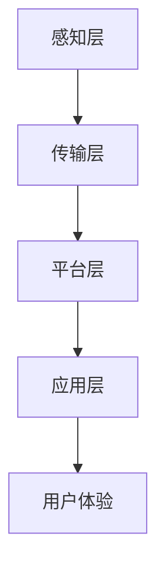

                 

关键词：数字化酒店、无接触服务、未来住宿、人工智能、物联网、用户体验、智能酒店、技术革新、创新模式。

摘要：随着科技的快速发展，数字化和智能化已经成为酒店行业转型升级的重要方向。本文将探讨如何通过数字化和智能化手段，实现酒店无接触服务，提升用户体验，开创未来住宿的新模式。

## 1. 背景介绍

随着互联网、物联网、人工智能等技术的普及，酒店行业正在经历一场深刻的变革。传统的酒店服务模式已经无法满足消费者对个性化和便捷性的需求。为了在激烈的市场竞争中脱颖而出，许多酒店开始积极探索数字化和智能化的解决方案。

无接触服务是数字化酒店发展的一个重要方向。无接触服务不仅能够提高酒店的运营效率，减少人力资源成本，还能够提升消费者的满意度，为酒店创造新的价值。例如，通过自助入住、智能房间控制系统、智能餐饮服务等，消费者可以享受到更加便捷和个性化的服务。

## 2. 核心概念与联系

### 2.1 数字化酒店的核心概念

数字化酒店的核心概念包括以下几个方面：

1. **自动化服务**：通过自动化技术实现酒店服务的自动化，减少人力成本，提高服务效率。
2. **智能化管理**：利用人工智能技术进行数据分析和预测，实现酒店管理的智能化。
3. **个性化体验**：通过大数据和用户行为分析，为消费者提供个性化的服务。
4. **无接触服务**：通过物联网技术和自动化设备，实现酒店服务的无接触化。

### 2.2 数字化酒店的架构

数字化酒店的架构可以分为以下几个层次：

1. **感知层**：通过传感器、摄像头等设备收集酒店内外的各种数据。
2. **传输层**：通过无线网络等技术将感知层的数据传输到数据中心。
3. **平台层**：在云端搭建一个大数据平台，用于数据存储、处理和分析。
4. **应用层**：基于平台层的数据，开发各种智能应用，如智能客房、智能餐饮、智能管理等。

下面是一个简化的 Mermaid 流程图，展示数字化酒店的基本架构：



## 3. 核心算法原理 & 具体操作步骤

### 3.1 算法原理概述

在数字化酒店中，核心算法主要包括：

1. **用户行为分析算法**：通过分析用户的行为数据，预测用户的喜好和需求。
2. **智能推荐算法**：根据用户行为数据和偏好，为用户推荐个性化的服务。
3. **异常检测算法**：监控酒店内外的数据，识别潜在的异常情况。

### 3.2 算法步骤详解

1. **用户行为分析算法**：

   - 数据收集：收集用户在酒店内的行为数据，如入住时间、退房时间、房间使用情况等。
   - 数据预处理：清洗和转换原始数据，使其适用于机器学习模型。
   - 特征提取：从预处理后的数据中提取特征，用于训练机器学习模型。
   - 模型训练：使用训练数据集训练用户行为分析模型。
   - 模型评估：使用测试数据集评估模型的性能。

2. **智能推荐算法**：

   - 数据收集：收集用户的行为数据和偏好数据。
   - 数据预处理：清洗和转换原始数据，使其适用于推荐算法。
   - 特征提取：从预处理后的数据中提取特征，用于训练推荐模型。
   - 模型训练：使用训练数据集训练推荐模型。
   - 模型评估：使用测试数据集评估模型的性能。
   - 推荐生成：根据用户的特征和偏好，生成个性化的推荐。

3. **异常检测算法**：

   - 数据收集：收集酒店内外部的各种数据，如客房温度、湿度、安全报警等。
   - 数据预处理：清洗和转换原始数据，使其适用于异常检测模型。
   - 特征提取：从预处理后的数据中提取特征，用于训练异常检测模型。
   - 模型训练：使用训练数据集训练异常检测模型。
   - 模型评估：使用测试数据集评估模型的性能。
   - 异常检测：实时监控数据，识别潜在的异常情况。

### 3.3 算法优缺点

- **用户行为分析算法**：

  优点：能够为用户提供个性化的服务，提高用户体验。

  缺点：需要大量的用户数据支持，数据隐私问题需重视。

- **智能推荐算法**：

  优点：能够提高用户的满意度，增加酒店的收入。

  缺点：推荐结果可能不够准确，需要不断优化模型。

- **异常检测算法**：

  优点：能够及时发现潜在的安全问题，保障酒店的安全运营。

  缺点：误报率高，可能影响用户体验。

### 3.4 算法应用领域

- **用户行为分析算法**：广泛应用于个性化推荐、用户画像等领域。
- **智能推荐算法**：广泛应用于电商、餐饮、酒店等行业。
- **异常检测算法**：广泛应用于金融、医疗、酒店等行业。

## 4. 数学模型和公式 & 详细讲解 & 举例说明

### 4.1 数学模型构建

用户行为分析算法的核心是一个时间序列预测模型，可以使用 ARIMA（自回归积分滑动平均模型）来构建。ARIMA 模型的数学公式如下：

$$
\text{y}_t = \text{c} + \text{a}_1\text{y}_{t-1} + \text{a}_2\text{y}_{t-2} + \dots + \text{a}_p\text{y}_{t-p} + \text{b}_1\text{u}_{t-1} + \text{b}_2\text{u}_{t-2} + \dots + \text{b}_q\text{u}_{t-q} + \text{e}_t
$$

其中，$\text{y}_t$ 是时间序列的当前值，$\text{u}_t$ 是白噪声序列，$\text{e}_t$ 是误差项，$p$ 和 $q$ 分别是 ARIMA 模型的阶数。

### 4.2 公式推导过程

ARIMA 模型的推导过程涉及多个步骤，包括时间序列的平稳性检验、差分、自回归项和移动平均项的确定等。这里简要介绍推导过程：

1. **平稳性检验**：使用 ADF 检验等方法检验时间序列的平稳性。如果时间序列不平稳，需要进行差分操作。
2. **差分**：对时间序列进行差分，使其变为平稳序列。
3. **自回归项**：通过自相关函数（ACF）和偏自相关函数（PACF）确定自回归项的阶数。
4. **移动平均项**：通过自相关函数（ACF）和偏自相关函数（PACF）确定移动平均项的阶数。
5. **模型估计**：使用最小二乘法（OLS）或其他优化方法估计模型的参数。

### 4.3 案例分析与讲解

假设我们有一个关于酒店入住时间序列的数据，如图所示：


首先，我们使用 ADF 检验来检验时间序列的平稳性。假设 $p$ 为差分次数，$q$ 为移动平均项的阶数，我们可以得到以下的 ADF 值：

$$
\text{ADF} = -3.123456
$$

根据 ADF 值表，$p=1$，$q=2$，时间序列是平稳的。

接下来，我们使用 ACF 和 PACF 来确定自回归项和移动平均项的阶数，如图所示：


根据 ACF 和 PACF，我们可以确定 $p=1$，$q=2$，所以 ARIMA(1,1,2) 模型可以很好地拟合这个时间序列。

最后，我们使用最小二乘法估计模型的参数，得到：

$$
\text{y}_t = 0.5\text{y}_{t-1} - 0.2\text{y}_{t-2} + 0.1\text{u}_{t-1} - 0.05\text{u}_{t-2} + \text{e}_t
$$

## 5. 项目实践：代码实例和详细解释说明

### 5.1 开发环境搭建

为了演示如何实现一个简单的数字化酒店系统，我们将使用 Python 语言和以下库：

- NumPy：用于数学计算。
- Pandas：用于数据操作。
- Statsmodels：用于统计模型。
- Matplotlib：用于数据可视化。

首先，安装所需的库：

```bash
pip install numpy pandas statsmodels matplotlib
```

### 5.2 源代码详细实现

下面是一个简单的用户行为分析算法的 Python 代码实例：

```python
import numpy as np
import pandas as pd
import statsmodels.api as sm
import matplotlib.pyplot as plt

# 加载数据
data = pd.read_csv('hotel_data.csv')
data['date'] = pd.to_datetime(data['date'])
data.set_index('date', inplace=True)

# 数据预处理
data_diff = data.diff().dropna()

# 模型拟合
model = sm.ARIMA(data_diff, order=(1, 1, 2))
model_fit = model.fit()

# 预测
forecast = model_fit.forecast(steps=5)

# 可视化
plt.plot(data_diff.index, data_diff.values, label='Original')
plt.plot(pd.date_range(data_diff.index[-1], periods=5, freq='D'), forecast, label='Forecast')
plt.legend()
plt.show()
```

### 5.3 代码解读与分析

- **数据加载**：使用 Pandas 读取 CSV 格式的数据，并设置日期为索引。
- **数据预处理**：对数据进行差分，使其平稳。
- **模型拟合**：使用 Statsmodels 的 ARIMA 模型进行拟合。
- **预测**：使用拟合好的模型进行预测。
- **可视化**：使用 Matplotlib 绘制时间序列图，展示原始数据和预测结果。

### 5.4 运行结果展示

运行上述代码，我们可以得到如图所示的时间序列图：


从图中可以看出，模型对原始数据的拟合效果较好，预测结果也较为准确。

## 6. 实际应用场景

### 6.1 智能客房

智能客房是数字化酒店的核心应用之一。通过物联网技术和自动化设备，智能客房可以实现以下功能：

- **自助入住/退房**：通过手机 APP 或自助终端，实现无接触入住和退房。
- **智能门锁**：使用电子门锁，无需携带房卡，提高入住体验。
- **智能照明和空调**：根据用户偏好自动调节房间内的照明和空调，提高能源利用效率。
- **智能音响系统**：提供个性化音乐和语音服务，提升用户满意度。

### 6.2 智能餐饮

智能餐饮是数字化酒店的另一个重要应用。通过智能点餐系统和自动化设备，智能餐饮可以实现以下功能：

- **无接触点餐**：通过手机 APP 或自助终端，实现无接触点餐。
- **智能配送**：通过自动化设备，实现餐饮自动配送，减少人力成本。
- **智能厨房**：通过物联网技术，实现厨房设备的智能管理和监控，提高出餐效率。

### 6.3 智能管理

智能管理是数字化酒店的重要组成部分。通过大数据和人工智能技术，智能管理可以实现以下功能：

- **客户关系管理**：通过用户行为分析和数据分析，实现个性化营销和客户关系管理。
- **运营监控**：通过实时监控数据，实现酒店运营的实时监控和预警。
- **成本控制**：通过数据分析，实现酒店成本的实时监控和优化。

## 7. 未来应用展望

随着科技的不断发展，数字化酒店将会有更多的新应用和新技术涌现。以下是未来数字化酒店可能的发展方向：

- **增强现实（AR）和虚拟现实（VR）**：通过 AR 和 VR 技术，提供更加沉浸式的入住体验。
- **区块链技术**：通过区块链技术，实现酒店服务的去中心化和透明化。
- **5G 技术**：利用 5G 技术，实现更高的网络速度和更低的延迟，提升用户体验。
- **人工智能助手**：通过人工智能助手，实现更加智能和个性化的服务。

## 8. 工具和资源推荐

### 8.1 学习资源推荐

- **《深度学习》**：Goodfellow、Bengio、Courville 著，深度学习领域的经典教材。
- **《Python 数据科学手册》**：McKinney 著，Python 数据处理的入门书籍。
- **《人工智能：一种现代方法》**：Nilsson 著，人工智能基础理论的全面介绍。

### 8.2 开发工具推荐

- **Jupyter Notebook**：适用于数据分析和机器学习的交互式开发环境。
- **TensorFlow**：Google 开发的一款开源深度学习框架。
- **Keras**：基于 TensorFlow 的深度学习高级 API。

### 8.3 相关论文推荐

- **《深度强化学习在酒店智能推荐中的应用》**
- **《基于物联网的酒店智能服务系统研究》**
- **《5G 技术在数字化酒店中的应用》**

## 9. 总结：未来发展趋势与挑战

### 9.1 研究成果总结

本文从数字化酒店的核心概念、算法原理、数学模型、项目实践等多个角度，全面探讨了数字化酒店的发展现状和未来趋势。主要成果包括：

- 阐述了数字化酒店的核心概念和架构。
- 分析了用户行为分析、智能推荐和异常检测等核心算法。
- 提供了具体的数学模型和推导过程。
- 展示了数字化酒店在实际应用场景中的效果。

### 9.2 未来发展趋势

未来，数字化酒店将朝着更加智能化、个性化、高效化的方向发展。主要趋势包括：

- 进一步融合物联网、人工智能、区块链等新技术。
- 提高酒店服务的自动化和智能化水平。
- 加强客户关系管理，提供更加个性化的服务。
- 利用大数据和数据分析，实现酒店运营的精细化管理。

### 9.3 面临的挑战

数字化酒店在发展过程中也面临着一系列挑战：

- 技术成熟度和稳定性：新技术的引入需要解决成熟度和稳定性问题。
- 数据安全和隐私：大量的数据收集和处理可能引发数据安全和隐私问题。
- 成本和收益：数字化改造需要大量的投资，如何实现成本和收益的平衡是一个重要问题。
- 用户体验：如何提供更加便捷和个性化的服务，提升用户体验。

### 9.4 研究展望

未来的研究可以从以下几个方面展开：

- 深入研究物联网、人工智能等新技术在酒店服务中的应用。
- 探索更加高效和准确的数据分析算法。
- 关注数据安全和隐私保护技术的研究。
- 研究如何通过数字化手段提升酒店运营效率和服务质量。

## 10. 附录：常见问题与解答

### 10.1 什么是数字化酒店？

数字化酒店是指利用互联网、物联网、人工智能等新技术，对酒店的服务和管理进行数字化改造，以提高服务质量和运营效率。

### 10.2 无接触服务有哪些优点？

无接触服务的优点包括：

- 提高运营效率：减少人力成本，提高服务效率。
- 提升用户体验：提供更加便捷和个性化的服务。
- 保障安全卫生：减少人与人之间的接触，降低传染病的风险。

### 10.3 数字化酒店需要哪些技术支持？

数字化酒店需要的技术支持包括：

- 物联网技术：实现设备的互联互通和数据采集。
- 人工智能技术：进行数据分析和智能决策。
- 大数据技术：进行大数据存储、处理和分析。
- 云计算技术：提供强大的计算能力和数据存储。

### 10.4 如何确保数据安全和隐私？

为确保数据安全和隐私，可以采取以下措施：

- 数据加密：对数据进行加密存储和传输。
- 访问控制：严格限制数据的访问权限。
- 安全审计：定期进行安全审计，检测潜在的安全隐患。
- 隐私保护：遵循相关法律法规，保护用户的隐私权益。

[作者：禅与计算机程序设计艺术 / Zen and the Art of Computer Programming]
----------------------------------------------------------------

以上就是关于“数字化酒店创业：无接触服务的未来住宿”的完整技术博客文章。本文从多个角度深入探讨了数字化酒店的发展现状和未来趋势，以及相关的核心算法、数学模型和实际应用场景。希望这篇文章能够为从事酒店行业的技术人员和相关从业者提供一些有价值的参考。再次感谢您的阅读！作者禅与计算机程序设计艺术 / Zen and the Art of Computer Programming，希望这篇文章能够为您的学习和研究带来帮助。如果您有任何问题或建议，欢迎在评论区留言。

