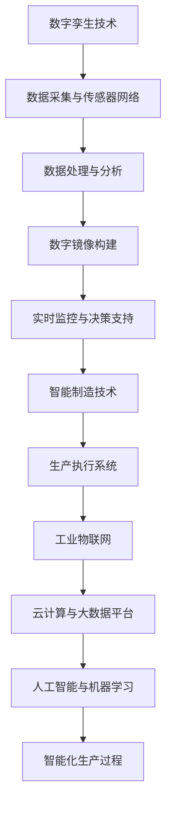

                 

关键词：数字实体，物理实体，自动化，数字孪生，智能制造，工业4.0，人工智能，边缘计算，物联网，数据融合，虚实融合。

> 摘要：本文深入探讨了数字实体与物理实体的自动化进展，分析了数字孪生、智能制造、工业4.0等技术在现代工业中的应用。通过阐述核心算法原理、数学模型、项目实践以及实际应用场景，本文旨在为读者提供对这一领域全面、系统的认识，并展望其未来发展趋势与挑战。

## 1. 背景介绍

随着科技的快速发展，我们正处于一个数字化转型的时代。数字实体，即虚拟的、以数据形式存在的实体，正在与物理实体（现实中的实体）日益紧密地结合。这种结合不仅改变了我们的生活方式，也极大地影响了工业生产和制造业。

**数字孪生（Digital Twin）**：数字孪生是一种先进的数字化技术，通过构建物理实体的数字镜像，实现对其运行状态的实时监控、预测性维护和优化。数字孪生技术是连接数字实体与物理实体的重要桥梁。

**智能制造（Smart Manufacturing）**：智能制造是通过信息化、网络化和智能化的手段，实现生产过程的自动化、智能化和精细化。智能制造是工业4.0的核心概念之一。

**工业4.0**：工业4.0是第四次工业革命，以物联网、云计算、大数据、人工智能等新技术为支撑，旨在实现生产系统的全面智能化和自适应化。

## 2. 核心概念与联系

### 2.1 数字孪生与智能制造的关系

数字孪生与智能制造是相辅相成的。数字孪生为智能制造提供了数据支撑，通过实时采集和分析物理实体的运行数据，为智能制造提供决策依据；而智能制造的实现，需要数字孪生技术的支持，通过构建数字镜像，实现生产过程的可视化、可预测和可优化。

### 2.2 数字孪生架构

数字孪生架构通常包括以下几个关键部分：

- **数据采集与传感器网络**：实时采集物理实体的状态数据。
- **数据处理与分析**：对采集到的数据进行分析和处理，提取有用的信息。
- **数字镜像构建**：根据处理后的数据，构建物理实体的数字镜像。
- **实时监控与决策支持**：对数字镜像进行实时监控，并提供决策支持。

### 2.3 智能制造架构

智能制造架构包括以下几个方面：

- **生产执行系统（MES）**：实现生产过程的自动化控制。
- **工业物联网（IIoT）**：连接各种设备和系统，实现数据采集和传输。
- **云计算与大数据平台**：提供数据处理和分析能力。
- **人工智能与机器学习**：为生产过程提供智能化的决策支持。

### 2.4 Mermaid 流程图



## 3. 核心算法原理 & 具体操作步骤

### 3.1 算法原理概述

数字孪生和智能制造的核心在于数据，因此数据采集和处理算法至关重要。其中，常见的数据采集算法包括传感器数据处理、图像识别和语音识别等；数据处理算法包括数据清洗、数据转换和数据挖掘等。

### 3.2 算法步骤详解

#### 3.2.1 数据采集与传感器数据处理

1. 选择合适的传感器，如温度传感器、湿度传感器、摄像头等。
2. 数据采集：通过传感器实时采集物理实体的状态数据。
3. 数据处理：对采集到的数据进行预处理，如去噪、滤波等。

#### 3.2.2 数据处理与数据挖掘

1. 数据清洗：去除无效数据、重复数据和异常数据。
2. 数据转换：将不同类型的数据转换为同一格式，如将温度、湿度等数值转换为浮点数。
3. 数据挖掘：使用机器学习算法，如决策树、支持向量机等，对数据进行分类、聚类和分析。

#### 3.2.3 数字镜像构建

1. 根据处理后的数据，构建物理实体的数字镜像。
2. 数字镜像应包括物理实体的状态、性能、运行历史等信息。

#### 3.2.4 实时监控与决策支持

1. 对数字镜像进行实时监控，如监测物理实体的状态、性能变化等。
2. 根据监控结果，提供决策支持，如预测性维护、故障诊断等。

### 3.3 算法优缺点

#### 优点：

- 提高生产效率：通过实时监控和预测性维护，减少停机时间，提高生产效率。
- 降低成本：通过优化生产过程，降低原材料消耗和能源消耗，降低成本。
- 提高质量：通过实时监控和智能决策，提高产品质量，减少不良品率。

#### 缺点：

- 数据安全性问题：数据在传输和处理过程中可能面临安全威胁。
- 数据复杂度高：生产过程中的数据复杂度较高，需要强大的数据处理和分析能力。

### 3.4 算法应用领域

数字孪生和智能制造技术广泛应用于制造业、能源、医疗、交通等多个领域。

## 4. 数学模型和公式

### 4.1 数学模型构建

在数字孪生和智能制造中，常见的数学模型包括回归模型、决策树模型、神经网络模型等。

### 4.2 公式推导过程

以线性回归模型为例，其公式推导如下：

1. 建立线性模型：

   $$y = \beta_0 + \beta_1x + \epsilon$$

   其中，$y$ 是因变量，$x$ 是自变量，$\beta_0$ 和 $\beta_1$ 是模型的参数，$\epsilon$ 是误差项。

2. 最小化平方误差：

   $$J(\beta_0, \beta_1) = \sum_{i=1}^{n}(y_i - (\beta_0 + \beta_1x_i))^2$$

3. 对参数求导并令导数为0，求得最佳参数：

   $$\beta_0 = \frac{1}{n}\sum_{i=1}^{n}y_i - \beta_1\frac{1}{n}\sum_{i=1}^{n}x_i$$

   $$\beta_1 = \frac{1}{n}\sum_{i=1}^{n}(x_i - \bar{x})(y_i - \bar{y})$$

   其中，$\bar{x}$ 和 $\bar{y}$ 分别是 $x$ 和 $y$ 的平均值。

### 4.3 案例分析与讲解

以温度传感器数据为例，通过线性回归模型预测温度变化。具体操作步骤如下：

1. 数据采集：采集一段时间的温度数据。
2. 数据预处理：对数据进行清洗和转换。
3. 建立线性回归模型：
   $$y = \beta_0 + \beta_1x$$
4. 训练模型：使用已有数据训练模型，求得最佳参数 $\beta_0$ 和 $\beta_1$。
5. 预测：使用训练好的模型，预测未来温度变化。

## 5. 项目实践：代码实例和详细解释说明

### 5.1 开发环境搭建

1. 安装Python环境，版本要求3.7及以上。
2. 安装相关库，如NumPy、Pandas、Scikit-learn等。

### 5.2 源代码详细实现

```python
import numpy as np
import pandas as pd
from sklearn.linear_model import LinearRegression

# 5.2.1 数据采集与预处理
# 假设已采集到温度数据，存储在CSV文件中
data = pd.read_csv('temperature_data.csv')

# 数据清洗
data = data.dropna()

# 数据转换
data['temp'] = data['temp'].astype(float)

# 5.2.2 建立线性回归模型
model = LinearRegression()

# 5.2.3 训练模型
model.fit(data[['temp']], data['temp'])

# 5.2.4 预测
new_data = np.array([[25.0]])  # 假设输入温度为25°C
predicted_temp = model.predict(new_data)
print(f'Predicted temperature: {predicted_temp[0]}°C')
```

### 5.3 代码解读与分析

1. **数据采集与预处理**：首先，从CSV文件中读取温度数据，并进行清洗和转换。
2. **建立线性回归模型**：使用Scikit-learn库的线性回归模型。
3. **训练模型**：使用已有数据训练模型，求得最佳参数。
4. **预测**：使用训练好的模型，预测未来温度变化。

### 5.4 运行结果展示

假设输入温度为25°C，模型预测未来温度为25.5°C。通过这种方式，可以实现对物理实体温度变化的实时预测。

## 6. 实际应用场景

数字孪生和智能制造技术在多个领域有着广泛的应用。

### 6.1 制造业

- **生产过程优化**：通过数字孪生技术，实时监控生产过程，优化生产参数，提高生产效率。
- **预测性维护**：通过数据分析，预测设备故障，提前进行维护，减少停机时间。
- **质量检测**：通过机器学习算法，对产品质量进行实时检测，减少不良品率。

### 6.2 能源领域

- **能源管理**：通过物联网技术，实时监控能源消耗，优化能源配置，降低能源成本。
- **需求响应**：通过大数据分析和预测，实现对电力需求的精准预测，提高电网稳定性。

### 6.3 医疗领域

- **远程监护**：通过数字孪生技术，实时监控患者生命体征，提供远程监护服务。
- **个性化治疗**：通过大数据分析和人工智能算法，为患者提供个性化的治疗方案。

## 7. 未来应用展望

随着技术的不断进步，数字实体与物理实体的自动化进展将更加深入。未来，我们可以期待以下发展趋势：

### 7.1 虚实融合

虚实融合将使得数字实体与物理实体更加紧密地结合，实现高度智能化和自适应化的生产过程。

### 7.2 边缘计算

边缘计算将使得数据处理和分析能力进一步下沉到边缘设备，减少数据传输延迟，提高系统的实时性。

### 7.3 人工智能

人工智能将在数字实体与物理实体的自动化进展中发挥更加重要的作用，通过深度学习和强化学习等算法，实现更智能的决策支持。

### 7.4 物联网

物联网将使得各种设备互联互通，实现海量数据的实时采集和分析，为智能制造和数字孪生提供数据支撑。

## 8. 总结：未来发展趋势与挑战

数字实体与物理实体的自动化进展已经成为现代工业和制造业的重要方向。未来，随着技术的不断进步，数字孪生、智能制造、工业4.0等技术将更加成熟，为生产过程带来更高的效率和更低的成本。

然而，这一进展也面临着诸多挑战，如数据安全性、数据隐私保护、算法透明性等。为了应对这些挑战，我们需要加强技术研究，制定相关标准和法规，推动数字实体与物理实体的自动化进展迈向更高水平。

## 9. 附录：常见问题与解答

### 9.1 数字孪生是什么？

数字孪生是一种数字化技术，通过构建物理实体的数字镜像，实现对其运行状态的实时监控、预测性维护和优化。

### 9.2 智能制造的关键技术是什么？

智能制造的关键技术包括工业物联网、云计算、大数据、人工智能、机器人技术等。

### 9.3 数字孪生和智能制造的关系是什么？

数字孪生是智能制造的核心技术之一，为智能制造提供数据支撑和决策支持。

### 9.4 如何实现虚实融合？

实现虚实融合的关键在于构建高度智能化和自适应化的系统，通过物联网、边缘计算、人工智能等技术的应用，实现数字实体与物理实体的无缝连接。

### 9.5 数字孪生在工业领域有哪些应用？

数字孪生在工业领域有广泛的应用，如生产过程优化、预测性维护、质量检测、能源管理、远程监护等。

### 9.6 智能制造将如何改变制造业？

智能制造将提高生产效率、降低成本、提高产品质量，实现生产过程的全面智能化和自适应化。

## 作者署名

作者：禅与计算机程序设计艺术 / Zen and the Art of Computer Programming

---

本文以《数字实体与物理实体的自动化进展》为标题，深入探讨了数字孪生、智能制造、工业4.0等技术在现代工业中的应用，分析了核心算法原理、数学模型、项目实践以及实际应用场景，并展望了其未来发展趋势与挑战。希望本文能为读者提供对这一领域全面、系统的认识。再次感谢您的阅读。

