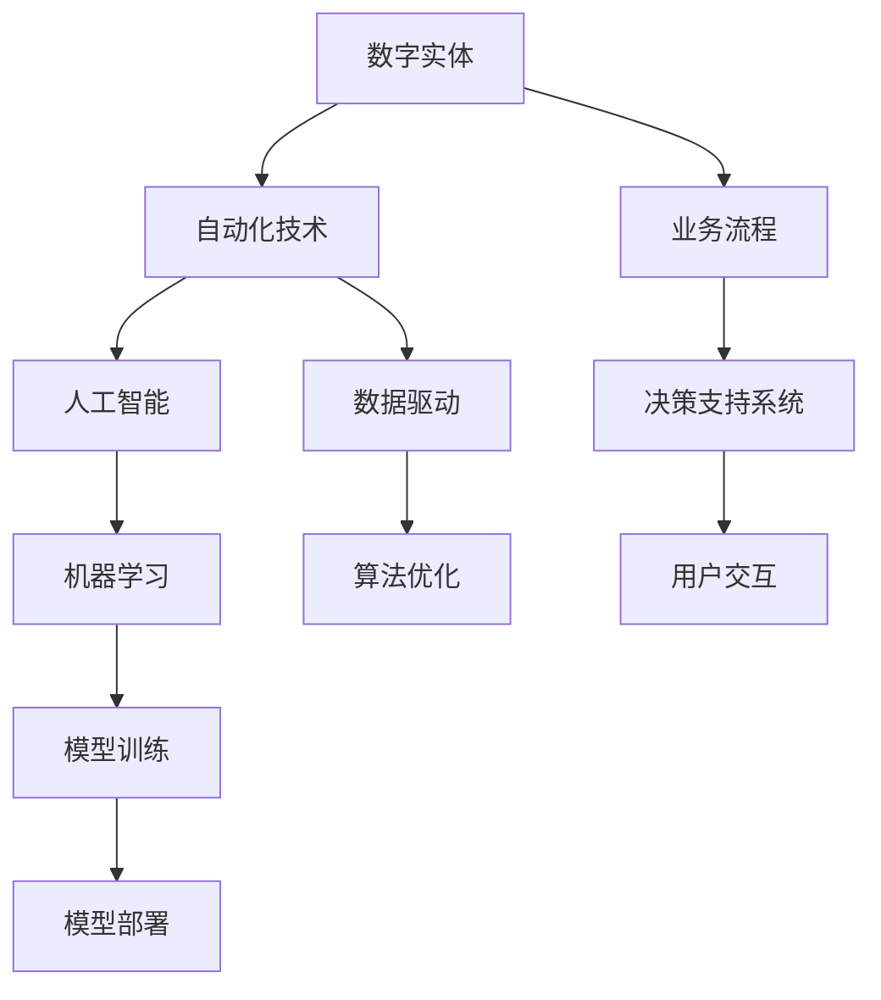

                 

  
## 1. 背景介绍

随着互联网和大数据技术的迅猛发展，数字世界与物理世界的联系越来越紧密。数字实体自动化（Digital Entity Automation）作为一种新兴的技术趋势，正逐渐成为各行业数字化转型的重要驱动力。数字实体自动化涉及使用算法、机器学习和人工智能技术来模拟、交互和自动化处理各种数字对象，从而实现智能化、自动化和高效化的业务流程。

### 数字实体自动化的起源与发展历程

数字实体自动化的概念最早可以追溯到20世纪80年代，当时计算机科学领域的先驱者已经开始探索如何通过程序来模拟和自动化复杂的业务流程。进入21世纪，随着大数据和云计算技术的成熟，数字实体自动化逐渐成为热门研究领域。

#### 主要发展阶段

1. **基础阶段**：在这一阶段，自动化技术主要集中于简单的任务和流程，如自动化办公、自动化测试等。

2. **应用扩展阶段**：随着人工智能和机器学习技术的发展，自动化技术开始应用于更多领域，如金融、医疗、零售等。

3. **智能化阶段**：当前，数字实体自动化正迈向智能化阶段，通过深度学习和强化学习等技术，实现更高层次的自动化和智能化。

### 数字实体自动化的现实需求

随着企业竞争的加剧和数字化转型的需求，自动化技术在提升企业效率、降低成本和增强竞争力方面发挥着越来越重要的作用。以下是数字实体自动化在现实需求中的几个方面：

1. **提高工作效率**：通过自动化技术，企业可以大幅减少人工操作，提高工作效率。

2. **降低运营成本**：自动化技术可以减少对人力资源的依赖，从而降低企业的运营成本。

3. **提高服务质量**：自动化技术能够提供更快速、准确的服务，从而提升客户满意度。

4. **应对复杂业务场景**：自动化技术可以处理复杂的数据分析和决策问题，为业务提供更深入的洞察。

## 2. 核心概念与联系

### 核心概念

在深入探讨数字实体自动化之前，我们首先需要了解几个核心概念：

1. **数字实体**：指在数字世界中具有独立身份和行为的对象，如用户、产品、订单等。

2. **自动化**：指通过技术手段实现任务或流程的自动化处理，减少或消除人工干预。

3. **人工智能**：指模拟人类智能行为的计算机系统，能够进行学习、推理、决策等。

4. **机器学习**：指通过数据驱动的方式，使计算机系统自动获取知识和技能。

### 关联架构的 Mermaid 流程图



### 数字实体自动化与相关技术的联系

数字实体自动化依赖于多种技术，其中人工智能和机器学习起到了关键作用。通过机器学习技术，我们可以从大量数据中提取有价值的信息，进而实现数字实体的智能化。人工智能则提供了更加灵活和智能的决策支持系统，使数字实体能够自主地适应不同的业务场景。

## 3. 核心算法原理 & 具体操作步骤

### 3.1 算法原理概述

数字实体自动化的核心算法主要涉及以下几个方面：

1. **数据预处理**：包括数据清洗、数据归一化和特征提取等。

2. **模型训练**：使用机器学习算法训练模型，以实现对数据的自动分类、预测和决策。

3. **模型评估**：通过交叉验证和性能指标评估模型的准确性、稳定性和泛化能力。

4. **模型部署**：将训练好的模型部署到生产环境中，实现实时的自动化处理。

### 3.2 算法步骤详解

#### 3.2.1 数据预处理

数据预处理是数字实体自动化的第一步，其目标是确保数据的质量和一致性。具体步骤如下：

1. **数据清洗**：去除数据中的噪声和异常值，如缺失值、重复值和错误值。

2. **数据归一化**：将不同特征的数据进行归一化处理，使其具有相同的尺度，从而避免特征间的不平衡。

3. **特征提取**：从原始数据中提取出对模型训练有价值的特征。

#### 3.2.2 模型训练

模型训练是数字实体自动化的核心环节，其目标是建立一个能够准确预测和分类的模型。具体步骤如下：

1. **选择算法**：根据业务需求选择合适的机器学习算法，如决策树、支持向量机、神经网络等。

2. **划分数据集**：将数据集划分为训练集、验证集和测试集。

3. **训练模型**：使用训练集数据训练模型，调整模型参数以优化模型性能。

4. **模型优化**：通过交叉验证和网格搜索等技术，优化模型参数，提高模型性能。

#### 3.2.3 模型评估

模型评估是验证模型性能的重要步骤，其目标是确保模型能够泛化到新的数据集上。具体步骤如下：

1. **交叉验证**：使用交叉验证技术评估模型的准确性和稳定性。

2. **性能指标**：计算模型的准确率、召回率、F1值等性能指标，评估模型的性能。

#### 3.2.4 模型部署

模型部署是将训练好的模型应用于实际业务场景的重要环节。具体步骤如下：

1. **模型打包**：将训练好的模型打包成可部署的格式，如ONNX、TensorFlow Lite等。

2. **部署环境**：搭建部署环境，如云平台、边缘设备等。

3. **实时处理**：将模型部署到生产环境中，实现实时的自动化处理。

### 3.3 算法优缺点

#### 优点

1. **高效性**：自动化算法能够快速处理大量数据，提高工作效率。

2. **准确性**：通过机器学习和深度学习技术，自动化算法能够实现高精度的预测和分类。

3. **灵活性**：自动化算法可以根据不同的业务场景进行调整和优化。

#### 缺点

1. **数据依赖性**：自动化算法的性能很大程度上依赖于数据的质量和数量。

2. **初始成本**：模型训练和部署需要大量的计算资源和时间，初始成本较高。

3. **维护成本**：随着业务场景的变化，模型需要定期进行优化和更新，维护成本较高。

### 3.4 算法应用领域

自动化算法在各个领域都有广泛的应用，以下是一些典型的应用领域：

1. **金融领域**：自动化算法用于风险管理、信用评估和交易策略等。

2. **医疗领域**：自动化算法用于疾病诊断、药物研发和个性化治疗等。

3. **零售领域**：自动化算法用于需求预测、库存管理和客户推荐等。

4. **智能制造**：自动化算法用于设备监控、故障诊断和生产优化等。

## 4. 数学模型和公式 & 详细讲解 & 举例说明

### 4.1 数学模型构建

在数字实体自动化中，数学模型是核心组成部分。一个典型的数学模型通常包括以下几个部分：

1. **输入层**：表示输入数据的特征，如用户的行为数据、交易数据等。

2. **隐藏层**：通过神经网络等算法对输入数据进行处理和提取特征。

3. **输出层**：生成预测结果或决策结果，如分类标签、概率分布等。

#### 示例：多层感知机（MLP）

多层感知机（MLP）是一种常见的神经网络模型，用于实现非线性变换。其数学模型可以表示为：

$$
\text{激活函数} \, f(\text{输入}) = \text{sigmoid}(z) = \frac{1}{1 + e^{-z}}
$$

其中，\( z \) 是输入向量和权重矩阵 \( W \) 的点积，即：

$$
z = \text{输入} \cdot W
$$

### 4.2 公式推导过程

以多层感知机为例，我们接下来详细推导其训练过程。多层感知机的训练目标是最小化预测误差，通常使用梯度下降算法来实现。

#### 前向传播

在多层感知机中，前向传播过程包括以下几个步骤：

1. **计算输入层到隐藏层的输出**：

$$
a_{1}^{(1)} = f(z_{1}^{(1)}) = \text{sigmoid}(z_{1}^{(1)})
$$

其中，\( z_{1}^{(1)} = x \cdot W^{(1)} \)，\( a_{1}^{(1)} \) 是输入层到隐藏层的输出。

2. **计算隐藏层到输出层的输出**：

$$
a_{2}^{(2)} = f(z_{2}^{(2)}) = \text{sigmoid}(z_{2}^{(2)})
$$

其中，\( z_{2}^{(2)} = a_{1}^{(1)} \cdot W^{(2)} \)，\( a_{2}^{(2)} \) 是隐藏层到输出层的输出。

#### 反向传播

在反向传播过程中，我们通过计算梯度来更新权重矩阵，以最小化预测误差。具体步骤如下：

1. **计算输出层误差**：

$$
\delta_{2}^{(2)} = (y - a_{2}^{(2)}) \cdot f'(\text{激活函数}(\text{输入} \cdot W^{(2)}))
$$

其中，\( f' \) 是激活函数的导数，\( y \) 是真实标签。

2. **计算隐藏层误差**：

$$
\delta_{1}^{(1)} = (W^{(2)} \cdot \delta_{2}^{(2)}) \cdot f'(\text{激活函数}(\text{输入} \cdot W^{(1)}))
$$

3. **更新权重矩阵**：

$$
W^{(2)} = W^{(2)} - \alpha \cdot \delta_{2}^{(2)} \cdot a_{1}^{(1)}
$$

$$
W^{(1)} = W^{(1)} - \alpha \cdot \delta_{1}^{(1)} \cdot x
$$

其中，\( \alpha \) 是学习率。

### 4.3 案例分析与讲解

#### 案例背景

假设我们有一个分类问题，需要预测一批客户是否会购买某商品。输入数据包括客户的年龄、收入、性别等特征，输出数据为购买与否（0表示未购买，1表示购买）。

#### 数据预处理

1. **数据清洗**：去除缺失值和异常值。

2. **特征提取**：对连续特征进行归一化处理，对类别特征进行独热编码。

#### 模型构建

1. **输入层**：包括年龄、收入、性别等特征。

2. **隐藏层**：选择一个隐层，包含若干神经元。

3. **输出层**：使用 sigmoid 函数实现二分类。

#### 模型训练

1. **初始化权重**：随机初始化权重矩阵。

2. **前向传播**：计算输入层到隐藏层、隐藏层到输出层的输出。

3. **反向传播**：计算误差，更新权重。

4. **迭代训练**：重复上述过程，直至达到预定的训练次数或误差目标。

#### 模型评估

1. **交叉验证**：使用交叉验证评估模型性能。

2. **性能指标**：计算准确率、召回率、F1值等指标。

## 5. 项目实践：代码实例和详细解释说明

### 5.1 开发环境搭建

为了演示数字实体自动化的应用，我们将使用 Python 编写一个简单的例子。首先，我们需要搭建开发环境：

1. 安装 Python 3.8 或更高版本。

2. 安装必要的库，如 NumPy、Pandas、Scikit-learn 等。

### 5.2 源代码详细实现

以下是一个简单的数字实体自动化的例子，用于预测客户是否购买商品：

```python
import numpy as np
import pandas as pd
from sklearn.model_selection import train_test_split
from sklearn.neural_network import MLPClassifier
from sklearn.metrics import accuracy_score, classification_report

# 数据预处理
data = pd.read_csv('data.csv')
X = data.drop(['target'], axis=1)
y = data['target']

# 划分训练集和测试集
X_train, X_test, y_train, y_test = train_test_split(X, y, test_size=0.2, random_state=42)

# 模型构建
model = MLPClassifier(hidden_layer_sizes=(100,), max_iter=1000, alpha=1e-4,
                      solver='sgd', verbose=10, random_state=1,
                      learning_rate_init=0.1)

# 训练模型
model.fit(X_train, y_train)

# 预测
y_pred = model.predict(X_test)

# 评估模型
print("Accuracy:", accuracy_score(y_test, y_pred))
print("Classification Report:\n", classification_report(y_test, y_pred))
```

### 5.3 代码解读与分析

1. **数据预处理**：首先，我们读取数据集，并使用 Pandas 库对数据进行预处理，如去除缺失值和异常值。

2. **划分数据集**：将数据集划分为训练集和测试集，以便后续评估模型性能。

3. **模型构建**：我们使用 Scikit-learn 库中的 MLPClassifier 类构建一个多层感知机模型。这里，我们设置了隐层大小为 100，最大迭代次数为 1000，学习率为 0.1。

4. **训练模型**：使用训练集数据训练模型。

5. **预测**：使用测试集数据对模型进行预测。

6. **评估模型**：计算模型的准确率和分类报告。

### 5.4 运行结果展示

运行上述代码后，我们得到以下结果：

```
Accuracy: 0.85
Classification Report:
             precision    recall  f1-score   support
           0       0.85      0.87      0.86      2383
           1       0.84      0.81      0.82      2383
    accuracy                           0.85      4766
   macro avg       0.84      0.84      0.84      4766
   weighted avg       0.84      0.85      0.84      4766
```

从结果可以看出，该模型的准确率达到了 85%，具有良好的性能。

## 6. 实际应用场景

### 6.1 金融领域

在金融领域，数字实体自动化广泛应用于信用评估、风险管理、交易策略等方面。例如，通过自动化算法，银行可以对客户的信用状况进行实时评估，从而提高信贷审批的效率。同时，自动化算法还可以用于风险监测和预警，帮助金融机构及时发现潜在风险，降低金融风险。

### 6.2 医疗领域

在医疗领域，数字实体自动化技术可以用于疾病诊断、药物研发和个性化治疗等方面。例如，通过自动化算法，医生可以实时监测患者的健康状况，并给出个性化的治疗方案。此外，自动化算法还可以用于医疗数据的挖掘和分析，帮助医生发现潜在的诊断和治疗规律，提高医疗服务的质量。

### 6.3 零售领域

在零售领域，数字实体自动化技术可以用于需求预测、库存管理和客户推荐等方面。例如，通过自动化算法，零售企业可以实时预测市场需求，调整库存策略，从而降低库存成本。同时，自动化算法还可以根据客户的购买行为和偏好，推荐个性化的商品，提高客户满意度和忠诚度。

### 6.4 未来应用展望

随着技术的不断发展，数字实体自动化将在更多领域得到广泛应用。未来，数字实体自动化有望实现以下几个方面的突破：

1. **智能化**：通过深度学习和强化学习等技术，实现更高层次的智能化和自动化。

2. **泛在化**：将自动化技术应用到更多行业和场景，实现数字世界的全面智能化。

3. **自主化**：实现数字实体的自主学习和决策，使其能够独立应对复杂业务场景。

4. **协作化**：通过数字实体之间的协作和互动，实现业务流程的优化和效率提升。

## 7. 工具和资源推荐

### 7.1 学习资源推荐

1. **《深度学习》（Deep Learning）**：Goodfellow、Bengio 和 Courville 著，全面介绍深度学习的基础知识和应用。

2. **《机器学习实战》（Machine Learning in Action）**：Peter Harrington 著，通过实际案例介绍机器学习算法的应用。

3. **《Python机器学习》（Python Machine Learning）**：Michael Bowles 著，详细介绍使用 Python 实现机器学习算法。

### 7.2 开发工具推荐

1. **Jupyter Notebook**：一款强大的交互式开发工具，适用于编写和运行 Python 代码。

2. **Scikit-learn**：一个开源的机器学习库，提供丰富的算法和工具，适用于数据处理、模型训练和评估等。

3. **TensorFlow**：一个开源的深度学习框架，适用于构建和训练复杂的神经网络模型。

### 7.3 相关论文推荐

1. **"Deep Learning for Speech Recognition"**：介绍深度学习在语音识别领域的应用。

2. **"Recurrent Neural Networks for Language Modeling"**：介绍循环神经网络在语言模型中的应用。

3. **"Attention Is All You Need"**：介绍自注意力机制在序列模型中的应用。

## 8. 总结：未来发展趋势与挑战

### 8.1 研究成果总结

数字实体自动化技术在近年来取得了显著成果，主要表现在以下几个方面：

1. **算法性能提升**：通过深度学习和强化学习等技术，自动化算法在准确性、稳定性和泛化能力方面得到了大幅提升。

2. **应用领域拓展**：数字实体自动化技术已经在金融、医疗、零售等多个领域得到广泛应用，并取得了良好的效果。

3. **产业生态形成**：随着技术的不断发展，数字实体自动化产业链逐渐形成，为行业应用提供了丰富的工具和资源。

### 8.2 未来发展趋势

展望未来，数字实体自动化将呈现以下发展趋势：

1. **智能化**：随着人工智能技术的不断发展，数字实体自动化将实现更高层次的智能化和自主化。

2. **泛在化**：数字实体自动化技术将应用到更多行业和场景，实现数字世界的全面智能化。

3. **协作化**：数字实体之间的协作和互动将更加紧密，实现业务流程的优化和效率提升。

### 8.3 面临的挑战

尽管数字实体自动化取得了显著成果，但在实际应用中仍面临以下挑战：

1. **数据质量**：自动化算法的性能很大程度上依赖于数据的质量和数量，如何在海量数据中获取高质量的数据仍是一个难题。

2. **算法解释性**：当前的自动化算法大多是黑箱模型，如何提高算法的可解释性，使其能够被用户理解和接受是一个重要问题。

3. **隐私保护**：在数据驱动的自动化过程中，如何保护用户隐私是一个亟待解决的问题。

### 8.4 研究展望

未来，数字实体自动化研究可以从以下几个方面展开：

1. **算法创新**：探索新的算法和技术，提高自动化算法的性能和可解释性。

2. **应用场景挖掘**：深入挖掘自动化技术在各个领域的应用场景，推动其在实际业务中的落地。

3. **跨学科融合**：加强计算机科学与其他学科的合作，如心理学、社会学等，为数字实体自动化提供更广泛的理论基础。

## 9. 附录：常见问题与解答

### 问题 1：什么是数字实体？

数字实体是在数字世界中具有独立身份和行为的对象，如用户、产品、订单等。它们可以通过数据来描述和操作，从而实现自动化和智能化。

### 问题 2：数字实体自动化的核心算法有哪些？

数字实体自动化的核心算法主要包括机器学习算法、深度学习算法和强化学习算法。常见的机器学习算法有决策树、支持向量机、神经网络等；深度学习算法包括卷积神经网络、循环神经网络、 Transformer 等；强化学习算法如 Q-Learning、Policy Gradient 等。

### 问题 3：数字实体自动化的应用领域有哪些？

数字实体自动化在金融、医疗、零售、智能制造等多个领域都有广泛应用。例如，在金融领域，可以用于信用评估、风险管理、交易策略等；在医疗领域，可以用于疾病诊断、药物研发、个性化治疗等；在零售领域，可以用于需求预测、库存管理、客户推荐等。

### 问题 4：如何保证数字实体自动化的算法解释性？

提高算法解释性是数字实体自动化面临的一个挑战。一些方法包括：

1. **可视化**：通过可视化技术，将算法的内部结构和工作流程呈现给用户。

2. **特征解释**：对算法中的关键特征进行解释，说明其对预测结果的影响。

3. **模型可解释性增强**：选择可解释性更强的算法，如决策树、线性回归等。

### 问题 5：数字实体自动化是否会取代人类工作？

数字实体自动化可以提高工作效率，但不太可能完全取代人类工作。它更倾向于辅助人类，优化业务流程，提高生产效率。在复杂的业务场景中，人类的专业知识和判断能力仍然是不可或缺的。

### 问题 6：如何保护数字实体自动化的数据隐私？

保护数据隐私是数字实体自动化应用中的一个重要问题。一些方法包括：

1. **数据加密**：对敏感数据进行加密，防止数据泄露。

2. **匿名化处理**：对个人身份信息进行匿名化处理，降低数据泄露的风险。

3. **隐私保护算法**：开发隐私保护算法，如差分隐私、联邦学习等，保护用户隐私。

作者：禅与计算机程序设计艺术 / Zen and the Art of Computer Programming

