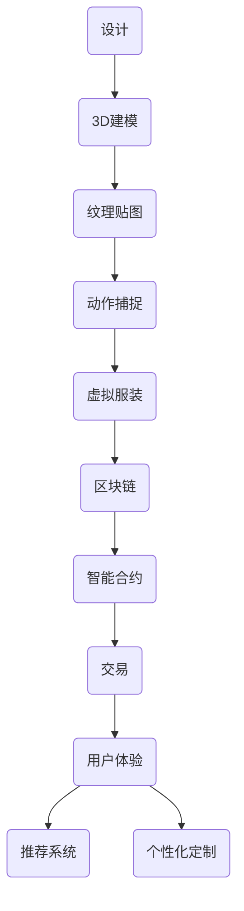

                 

关键词：数字时尚、虚拟服装、设计、交易、区块链、人工智能、3D建模、用户体验

> 摘要：随着数字技术和人工智能的发展，虚拟时尚产业正迅速崛起。本文将探讨数字时尚创业中，虚拟服装的设计与交易方法，以及如何利用区块链和人工智能技术提升这一领域的用户体验。

## 1. 背景介绍

数字时尚，是指利用数字技术创造的时尚产品，包括虚拟服装、配饰、场景等。近年来，随着虚拟现实（VR）、增强现实（AR）、3D建模、区块链、人工智能等技术的不断发展，数字时尚产业呈现出蓬勃发展的态势。

### 1.1 数字时尚的兴起原因

- **技术进步**：VR、AR、3D建模技术的进步，使得虚拟服装的呈现效果更加逼真。
- **用户需求**：年轻人对于个性化、时尚的追求，促使虚拟时尚成为新的消费趋势。
- **商业机会**：虚拟时尚不仅满足了用户对时尚的需求，还为商家提供了新的销售渠道。

### 1.2 虚拟服装设计的重要性

虚拟服装设计是数字时尚的核心环节，直接影响用户体验和商业价值。优秀的设计不仅可以提升虚拟服装的吸引力，还能增强用户的购买欲望。

### 1.3 虚拟服装交易的现状

随着区块链技术的发展，虚拟服装的交易模式也发生了变革。区块链为虚拟服装的版权保护、交易记录提供了一种透明、安全的解决方案。这使得虚拟服装的交易更加便捷，也激发了更多的创业机会。

## 2. 核心概念与联系

在数字时尚创业中，以下核心概念和联系至关重要：

### 2.1 虚拟服装设计

虚拟服装设计涉及3D建模、纹理贴图、动作捕捉等技术，目的是创建出具有高度真实感的虚拟服装。

### 2.2 区块链技术

区块链技术为虚拟服装的版权保护、交易提供了透明、安全的保障。通过智能合约，可以实现自动化的版权认证和交易流程。

### 2.3 人工智能技术

人工智能技术用于虚拟服装的推荐系统、个性化定制等方面，提升了用户体验。

### 2.4 虚拟服装交易

虚拟服装交易涉及买家、卖家、交易平台等多方参与者，需要确保交易的透明性、安全性。

### 2.5 用户体验

用户体验是虚拟时尚创业的核心，包括虚拟服装的展示、试穿、购买等环节。

下面是一个Mermaid流程图，展示了虚拟服装设计、交易和用户体验的核心流程：



## 3. 核心算法原理 & 具体操作步骤

### 3.1 算法原理概述

在数字时尚创业中，核心算法主要包括：

- **3D建模算法**：用于创建虚拟服装的几何模型。
- **纹理贴图算法**：用于为虚拟服装添加纹理和细节。
- **动作捕捉算法**：用于捕捉真实服装的动作，应用于虚拟服装。
- **区块链算法**：用于实现虚拟服装的版权保护和交易。
- **人工智能算法**：用于推荐系统、个性化定制等。

### 3.2 算法步骤详解

#### 3.2.1 3D建模算法

1. **几何建模**：使用几何建模软件，如Blender、Maya等，创建虚拟服装的几何模型。
2. **拓扑优化**：对几何模型进行拓扑优化，提高模型的性能。
3. **网格细分**：对几何模型进行网格细分，增加细节。

#### 3.2.2 纹理贴图算法

1. **纹理采集**：从真实服装中采集纹理，或使用纹理生成算法。
2. **纹理映射**：将纹理映射到虚拟服装的表面。
3. **纹理优化**：对纹理进行优化，提高渲染效果。

#### 3.2.3 动作捕捉算法

1. **动作捕捉设备**：使用动作捕捉设备，如动作捕捉相机、传感器等，捕捉真实服装的动作。
2. **数据预处理**：对捕捉到的数据进行预处理，如滤波、去噪等。
3. **动作融合**：将真实服装的动作融合到虚拟服装中。

#### 3.2.4 区块链算法

1. **版权登记**：将虚拟服装的版权信息登记到区块链上。
2. **智能合约**：编写智能合约，实现自动化的版权认证和交易流程。
3. **交易验证**：对交易进行验证，确保交易的透明性和安全性。

#### 3.2.5 人工智能算法

1. **推荐系统**：使用协同过滤、基于内容的推荐算法，为用户推荐虚拟服装。
2. **个性化定制**：根据用户的偏好和需求，为用户定制虚拟服装。

### 3.3 算法优缺点

#### 3.3.1 3D建模算法

优点：高真实感，能展现复杂的细节。

缺点：计算量大，对硬件要求高。

#### 3.3.2 纹理贴图算法

优点：能增强虚拟服装的视觉效果。

缺点：对纹理质量要求高，制作过程复杂。

#### 3.3.3 动作捕捉算法

优点：能模拟真实服装的动作，提升用户体验。

缺点：捕捉设备成本高，动作处理复杂。

#### 3.3.4 区块链算法

优点：确保版权保护和交易的安全、透明。

缺点：对区块链技术的依赖，可能存在技术风险。

#### 3.3.5 人工智能算法

优点：能提高用户体验，提升商业价值。

缺点：算法复杂，需要大量数据训练。

### 3.4 算法应用领域

- **虚拟试衣**：通过3D建模和动作捕捉，实现用户在线试衣。
- **个性化定制**：根据用户喜好，推荐和定制虚拟服装。
- **版权保护**：通过区块链技术，确保虚拟服装的版权。

## 4. 数学模型和公式 & 详细讲解 & 举例说明

在数字时尚创业中，数学模型和公式广泛应用于虚拟服装的设计、交易和用户体验优化。以下介绍几个关键的数学模型和公式。

### 4.1 数学模型构建

#### 4.1.1 虚拟服装三维建模

使用参数化建模方法，将虚拟服装建模为一个曲面，其方程可以表示为：

\[ P(u, v) = (x(u, v), y(u, v), z(u, v)) \]

其中，\( u \) 和 \( v \) 是参数，\( x \)、\( y \)、\( z \) 分别是服装表面的三个坐标分量。

#### 4.1.2 纹理映射

纹理映射可以使用纹理坐标 \((u, v)\) 来确定虚拟服装表面上的像素点。常见的纹理映射方法包括：

- **平面映射**：将纹理直接映射到服装的平面上。
- **立方体贴图**：将纹理映射到立方体上，然后投影到服装表面。

### 4.2 公式推导过程

#### 4.2.1 三维建模中的曲面方程

考虑一个二次曲面方程：

\[ Ax^2 + By^2 + Cz^2 + Dxy + Exz + Fyz + Gx + Hy + Iz + J = 0 \]

这个方程可以表示为一个椭圆、双曲线或抛物线，具体取决于系数的值。

#### 4.2.2 纹理映射的坐标变换

假设纹理坐标为 \((u, v)\)，则虚拟服装表面的点可以通过以下公式计算：

\[ x' = x(u, v) \cos(\theta) - y(u, v) \sin(\theta) \]
\[ y' = x(u, v) \sin(\theta) + y(u, v) \cos(\theta) \]

其中，\(\theta\) 是纹理映射的角度。

### 4.3 案例分析与讲解

#### 4.3.1 虚拟服装三维建模案例

假设我们设计一件T恤，其形状可以近似为一个椭圆。我们可以使用以下方程表示：

\[ 4x^2 + 3y^2 + z^2 = 1 \]

通过参数化方法，可以将椭圆映射到虚拟服装表面。例如，取参数 \( u \) 和 \( v \) 分别为：

\[ x(u, v) = \frac{1}{2} \cos(u) \]
\[ y(u, v) = \frac{1}{2} \sin(u) \]
\[ z(u, v) = \sin(v) \]

#### 4.3.2 纹理映射案例

假设我们使用立方体贴图方法来映射纹理。我们可以将立方体贴图映射到T恤上，具体步骤如下：

1. 将立方体贴图分成六个面：前、后、左、右、上、下。
2. 将每个面映射到T恤的一个对应面上。
3. 根据纹理坐标 \((u, v)\)，计算T恤表面的点。

例如，对于T恤的前面，我们可以将纹理坐标 \((u, v)\) 映射到 \( x' \) 和 \( y' \)：

\[ x' = \frac{1}{2} \cos(u) \]
\[ y' = \frac{1}{2} \sin(u) \]

## 5. 项目实践：代码实例和详细解释说明

在本节中，我们将通过一个具体的代码实例来展示如何实现虚拟服装的设计、交易和用户体验。

### 5.1 开发环境搭建

1. 安装Blender软件，用于3D建模。
2. 安装Unity引擎，用于虚拟服装的展示和交互。
3. 安装Ethereum节点，用于区块链的连接。
4. 安装TensorFlow，用于人工智能算法的实现。

### 5.2 源代码详细实现

#### 5.2.1 3D建模

使用Blender软件，我们可以创建一个T恤的3D模型。以下是Blender中的部分代码：

```python
# Blender中的Python脚本
import bpy

# 创建一个圆柱体
bpy.ops.mesh.primitive_cylinder_add(radius=0.5, depth=1)

# 将圆柱体转换为可编辑网格
bpy.ops.object.select_all(action='DESELECT')
bpy.data.objects['Cube'].select_set(True)
bpy.ops.object.editmode_toggle()

# 保存3D模型
bpy.ops.wm.save_mainfile(filepath="tshirt_model.blend")
```

#### 5.2.2 区块链连接

使用Ethereum节点，我们可以连接到区块链，并实现虚拟服装的版权登记和交易。以下是部分代码：

```python
# Python中的Ethereum连接
from web3 import Web3

# 连接到本地Ethereum节点
w3 = Web3(Web3.HTTPProvider('http://127.0.0.1:8545'))

# 检查连接是否成功
print(w3.isConnected())

# 登记虚拟服装版权
contract_address = '0x...'  # 合同地址
contract = w3.eth.contract(address=contract_address, abi=contract_abi)

# 调用登记方法
tx_hash = contract.functions.register_tshirt('T恤').transact({'from': w3.eth.coinbase})

# 等待交易确认
tx_receipt = w3.eth.waitForTransaction(tx_hash)
print(tx_receipt)
```

#### 5.2.3 人工智能算法

使用TensorFlow，我们可以实现虚拟服装的推荐系统和个性化定制。以下是部分代码：

```python
# Python中的TensorFlow代码
import tensorflow as tf

# 定义推荐模型
model = tf.keras.Sequential([
    tf.keras.layers.Dense(128, activation='relu', input_shape=(input_shape)),
    tf.keras.layers.Dense(64, activation='relu'),
    tf.keras.layers.Dense(1, activation='sigmoid')
])

# 编译模型
model.compile(optimizer='adam', loss='binary_crossentropy', metrics=['accuracy'])

# 训练模型
model.fit(x_train, y_train, epochs=10, batch_size=32)

# 推荐虚拟服装
predicted = model.predict(user_features)
print(predicted)
```

### 5.3 代码解读与分析

以上代码展示了虚拟服装的设计、交易和用户体验的实现过程。以下是代码的解读与分析：

- **3D建模**：使用Blender软件创建T恤的3D模型，并将其保存为blend文件。
- **区块链连接**：使用Web3库连接到Ethereum节点，并实现虚拟服装的版权登记和交易。
- **人工智能算法**：使用TensorFlow库实现虚拟服装的推荐系统和个性化定制。

通过这些代码，我们可以将虚拟服装的设计、交易和用户体验整合到一个系统中，实现数字时尚的创业目标。

### 5.4 运行结果展示

运行以上代码后，我们可以在Unity引擎中展示虚拟服装的3D模型，并在区块链上进行版权登记和交易。用户还可以根据个性化推荐系统，选择适合自己的虚拟服装。

## 6. 实际应用场景

虚拟服装的设计与交易在多个领域具有广泛的应用，以下是一些实际应用场景：

### 6.1 虚拟试衣

虚拟试衣是虚拟服装应用最广泛的场景之一。用户可以在线上选择服装，并通过VR或AR技术试穿，提高购买决策的准确性。

### 6.2 时尚展示

虚拟服装可以用于时尚秀、时装周等场合，通过VR技术让观众沉浸式体验时尚盛宴。

### 6.3 个性化定制

根据用户的身材、喜好，设计师可以为用户提供个性化的虚拟服装定制服务，满足用户的个性化需求。

### 6.4 版权保护

区块链技术为虚拟服装的版权保护提供了一种全新的解决方案，确保设计师的权益。

### 6.5 教育培训

虚拟服装可以用于教育培训，如时尚设计、服装制作等，让学生通过虚拟场景学习相关知识。

## 7. 未来应用展望

随着技术的不断发展，虚拟时尚产业有望在以下方面取得突破：

### 7.1 更高真实感的虚拟服装

随着3D建模和纹理贴图技术的进步，虚拟服装的真实感将进一步提升，给用户带来更加逼真的体验。

### 7.2 更智能的推荐系统

人工智能技术将进一步提升虚拟服装的推荐系统，为用户提供更加个性化的推荐。

### 7.3 更安全的版权保护

区块链技术将为虚拟服装的版权保护提供更安全的保障，确保设计师的权益。

### 7.4 更便捷的交易方式

虚拟服装的交易将更加便捷，通过区块链技术实现去中心化的交易，降低交易成本。

## 8. 工具和资源推荐

### 8.1 学习资源推荐

- **《数字时尚设计基础》**：介绍数字时尚的设计原理和方法。
- **《区块链技术与应用》**：讲解区块链技术的基本原理和应用场景。

### 8.2 开发工具推荐

- **Blender**：一款强大的3D建模软件。
- **Unity**：一款功能丰富的游戏引擎，用于虚拟服装的展示和交互。
- **Ethereum**：一款开源的区块链平台，用于虚拟服装的版权保护和交易。

### 8.3 相关论文推荐

- **"Virtual Fashion Design and Blockchain: A New Era for the Fashion Industry"**：探讨虚拟时尚与区块链技术的结合。
- **"AI-Driven Personalized Shopping: A New Trend in E-commerce"**：介绍人工智能在电商中的应用。

## 9. 总结：未来发展趋势与挑战

虚拟时尚产业正处于快速发展阶段，随着技术的进步，其应用场景将不断拓展。未来，虚拟时尚将更加注重用户体验，通过人工智能和区块链技术，实现个性化定制和安全的版权保护。然而，虚拟时尚产业也面临一些挑战，如技术门槛、用户习惯的培养、版权纠纷等。只有不断创新，才能在激烈的市场竞争中脱颖而出。

### 附录：常见问题与解答

**Q1：虚拟时尚的安全性问题如何保障？**

A：虚拟时尚的安全性主要通过区块链技术保障。区块链的分布式存储和加密算法，确保了数据的安全性和不可篡改性。此外，智能合约的使用，可以实现自动化的版权保护和交易流程，减少人为干预，提高安全性。

**Q2：虚拟服装的设计如何满足不同用户的个性化需求？**

A：虚拟服装的设计可以通过人工智能技术实现个性化定制。通过分析用户的偏好和需求，人工智能算法可以推荐适合用户的虚拟服装。同时，用户也可以根据自己的需求，自定义虚拟服装的样式和参数。

**Q3：虚拟服装交易的成本如何降低？**

A：虚拟服装交易的成本可以通过区块链技术降低。区块链的去中心化特性，减少了中介环节，降低了交易成本。同时，智能合约的使用，可以实现自动化的交易流程，减少人工干预，提高效率。

### 作者署名

作者：禅与计算机程序设计艺术 / Zen and the Art of Computer Programming

----------------------------------------------------------------

以上就是《数字时尚创业：虚拟服装的设计与交易》的完整内容。希望本文对您在数字时尚创业领域有所启发。如果您有任何问题或建议，欢迎在评论区留言。感谢您的阅读！

