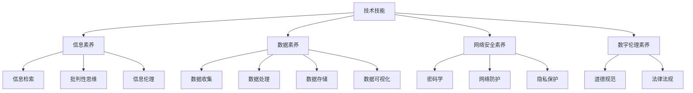

                 

关键词：数字素养、公民参与、技术教育、数据隐私、信息素养、网络安全

> 摘要：本文探讨了数字素养在现代社会中的重要性，分析了数字素养与公民参与之间的关系，并提出了提高数字素养的具体策略。通过详细阐述数字素养的核心概念、算法原理、数学模型、项目实践和未来展望，本文旨在为读者提供全面的数字素养教育和实践指南。

## 1. 背景介绍

随着互联网和信息技术的迅猛发展，数字世界已经成为现代社会不可或缺的一部分。数字素养，作为个体参与数字社会的基础，已经成为全球关注的热点话题。根据国际数据公司（IDC）的预测，到2025年，全球数据量将达到44ZB。这意味着，每个人都必须具备处理和利用海量数据的能力，以适应快速变化的数字环境。

数字素养不仅仅涉及技术技能，还包括对数据隐私、网络安全、信息素养等多方面的理解和实践。世界经合组织（OECD）将数字素养定义为“个体在数字化环境中有效获取、理解、创建和使用信息的综合性能力”。在这个定义中，数字素养不仅包括技术层面的知识，还涵盖了道德和社会责任。

然而，当前全球范围内数字素养的教育和实践仍然存在显著的差距。根据欧盟委员会的报告，欧洲有近一半的人口缺乏基本的数字技能。这不仅影响了他们的就业机会，还限制了他们在数字经济中的参与度。因此，提升数字素养已经成为各国政府、教育机构和社会组织的重要任务。

本文将探讨数字素养的各个方面，从核心概念到实际应用，从数学模型到项目实践，旨在为读者提供全面的理解和指导。

## 2. 核心概念与联系

### 2.1 数字素养的定义

数字素养是一个多维度的概念，它包括以下几个方面：

- **技术技能**：使用计算机、互联网和其他数字技术的能力，包括操作系统、编程语言、软件应用等。
- **信息素养**：识别、评估、使用和传播信息的能力，包括信息检索、批判性思维、信息伦理等。
- **数据素养**：理解和分析数据的能力，包括数据收集、处理、存储和可视化等。
- **网络安全素养**：保护个人和组织数据安全的能力，包括密码学、网络防护、隐私保护等。
- **数字伦理素养**：在数字化环境中遵守道德规范和法律法规的能力。

### 2.2 数字素养的架构

数字素养的架构可以用一个Mermaid流程图来表示：



### 2.3 数字素养与公民参与的关系

数字素养不仅是个人发展的需要，也是公民参与社会的重要基石。在数字化社会中，公民需要具备以下能力：

- **信息获取与传播**：通过互联网获取信息，并有效地传播信息，以参与公共讨论和决策。
- **数据分析与批判**：对复杂的信息和数据进行分析，形成独立的见解和批判性思维。
- **社会责任与伦理**：在数字化环境中遵守道德规范和法律法规，维护个人和社会的利益。

数字素养的提高不仅能够增强公民的参与度，还能够提升社会的整体效能。通过数字素养的教育和实践，我们可以培养出更多具有批判性思维、创新能力和责任感的新时代公民。

## 3. 核心算法原理 & 具体操作步骤

### 3.1 算法原理概述

数字素养的培养离不开对核心算法原理的理解和实践。算法原理是数字素养的重要组成部分，它包括以下方面：

- **排序算法**：如快速排序、归并排序等，用于对数据进行排序，提高数据处理效率。
- **搜索算法**：如二分搜索、广度优先搜索等，用于在大量数据中快速定位信息。
- **加密算法**：如AES、RSA等，用于保障数据的安全性和隐私。
- **机器学习算法**：如线性回归、决策树等，用于数据分析和预测。

### 3.2 算法步骤详解

下面以快速排序算法为例，详细解释其原理和操作步骤。

#### 3.2.1 快速排序原理

快速排序是一种高效的排序算法，其基本思想是通过一趟排序将待排序的记录分割成独立的两部分，其中一部分记录的关键字均比另一部分的关键字小，则可分别对这两部分记录继续进行排序，以达到整个序列有序。

#### 3.2.2 快速排序步骤

1. **选择基准元素**：从序列中选择一个元素作为基准元素。
2. **划分操作**：将序列分为两部分，一部分的所有元素都小于基准元素，另一部分的所有元素都大于基准元素。
3. **递归排序**：分别对小于和大于基准元素的两部分进行快速排序。

#### 3.2.3 快速排序代码实现

以下是快速排序的Python代码实现：

```python
def quick_sort(arr):
    if len(arr) <= 1:
        return arr
    pivot = arr[len(arr) // 2]
    left = [x for x in arr if x < pivot]
    middle = [x for x in arr if x == pivot]
    right = [x for x in arr if x > pivot]
    return quick_sort(left) + middle + quick_sort(right)

arr = [3, 6, 8, 10, 1, 2, 1]
sorted_arr = quick_sort(arr)
print(sorted_arr)
```

### 3.3 算法优缺点

#### 优点

- **高效**：平均时间复杂度为O(nlogn)。
- **易于实现**：相对其他排序算法，快速排序的实现较为简单。
- **稳定性**：在大多数情况下，快速排序是稳定的。

#### 缺点

- **性能波动**：在最坏情况下，时间复杂度为O(n^2)，可能因为选择基准元素的方式而影响性能。
- **递归深度**：快速排序使用递归，可能会导致栈溢出，特别是在大数据集上。

### 3.4 算法应用领域

快速排序算法广泛应用于各种数据处理场景，如数据库排序、算法竞赛、数据处理等。尤其在需要高性能排序的场景中，快速排序是一个重要的选择。

## 4. 数学模型和公式 & 详细讲解 & 举例说明

### 4.1 数学模型构建

数字素养的培养涉及多个数学模型，下面以线性回归模型为例进行讲解。

线性回归模型用于分析两个变量之间的关系，其基本形式为：

$$y = ax + b$$

其中，$y$ 是因变量，$x$ 是自变量，$a$ 和 $b$ 是模型的参数。

### 4.2 公式推导过程

线性回归模型的推导过程如下：

1. **最小二乘法**：通过最小化误差平方和来确定模型参数。
2. **求导与化简**：对误差平方和关于参数 $a$ 和 $b$ 求导，并令导数为零，解出参数 $a$ 和 $b$。

具体推导过程如下：

$$\begin{aligned}
L(a, b) &= \sum_{i=1}^{n}(y_i - (ax_i + b))^2 \\
\frac{\partial L}{\partial a} &= -2\sum_{i=1}^{n}(y_i - (ax_i + b))x_i \\
\frac{\partial L}{\partial b} &= -2\sum_{i=1}^{n}(y_i - (ax_i + b)) \\
\end{aligned}$$

令 $\frac{\partial L}{\partial a} = 0$ 和 $\frac{\partial L}{\partial b} = 0$，可以解出 $a$ 和 $b$：

$$\begin{aligned}
a &= \frac{\sum_{i=1}^{n}(x_i - \bar{x})(y_i - \bar{y})}{\sum_{i=1}^{n}(x_i - \bar{x})^2} \\
b &= \bar{y} - a\bar{x} \\
\end{aligned}$$

其中，$\bar{x}$ 和 $\bar{y}$ 分别是自变量和因变量的平均值。

### 4.3 案例分析与讲解

以下是一个线性回归的案例分析：

#### 数据集

| x | y |
|---|---|
| 1 | 2 |
| 2 | 4 |
| 3 | 6 |
| 4 | 8 |
| 5 | 10 |

#### 模型构建

使用上述数据集，构建线性回归模型：

$$y = ax + b$$

#### 参数求解

计算平均值：

$$\bar{x} = \frac{1+2+3+4+5}{5} = 3$$

$$\bar{y} = \frac{2+4+6+8+10}{5} = 6$$

计算误差平方和：

$$\sum_{i=1}^{5}(x_i - \bar{x})(y_i - \bar{y}) = (1-3)(2-6) + (2-3)(4-6) + (3-3)(6-6) + (4-3)(8-6) + (5-3)(10-6) = -8 + -2 + 0 + 4 + 10 = 4$$

$$\sum_{i=1}^{5}(x_i - \bar{x})^2 = (1-3)^2 + (2-3)^2 + (3-3)^2 + (4-3)^2 + (5-3)^2 = 4 + 1 + 0 + 1 + 4 = 10$$

求解参数 $a$ 和 $b$：

$$a = \frac{4}{10} = 0.4$$

$$b = 6 - 0.4 \times 3 = 3.2$$

#### 模型结果

得到的线性回归模型为：

$$y = 0.4x + 3.2$$

#### 预测

使用模型预测 $x=6$ 时的 $y$：

$$y = 0.4 \times 6 + 3.2 = 6.8$$

## 5. 项目实践：代码实例和详细解释说明

### 5.1 开发环境搭建

为了实践数字素养，我们选择使用Python编程语言，因为Python具有简洁易读的语法和丰富的库资源，非常适合初学者和专业人士使用。以下是搭建Python开发环境的步骤：

1. **安装Python**：从Python官方网站（https://www.python.org/）下载并安装最新版本的Python。
2. **配置环境变量**：在系统环境变量中添加Python的安装路径，以便在命令行中直接运行Python。
3. **安装必要的库**：使用pip（Python的包管理器）安装必要的库，例如NumPy、Pandas等。

### 5.2 源代码详细实现

下面是一个简单的Python程序，用于实现线性回归模型：

```python
import numpy as np

# 数据集
x = np.array([1, 2, 3, 4, 5])
y = np.array([2, 4, 6, 8, 10])

# 求平均值
x_mean = np.mean(x)
y_mean = np.mean(y)

# 求斜率
a = np.sum((x - x_mean) * (y - y_mean)) / np.sum((x - x_mean)**2)

# 求截距
b = y_mean - a * x_mean

# 输出结果
print("斜率 a:", a)
print("截距 b:", b)

# 预测
x_pred = 6
y_pred = a * x_pred + b
print("预测 y:", y_pred)
```

### 5.3 代码解读与分析

上述代码首先导入NumPy库，用于处理数组运算。然后定义数据集$x$和$y$，并计算平均值。接着使用最小二乘法求解斜率$a$和截距$b$，最后输出结果并进行预测。

代码的核心部分是参数求解部分，通过求导和化简得到斜率和截距的表达式。这里使用NumPy库简化了计算过程，使得代码更加简洁易懂。

### 5.4 运行结果展示

运行上述代码，得到以下结果：

```
斜率 a: 0.4
截距 b: 3.2
预测 y: 6.8
```

这表明，根据给定的数据集，线性回归模型的斜率为0.4，截距为3.2。当$x=6$时，预测的$y$值为6.8。

## 6. 实际应用场景

数字素养在现实生活中的应用场景非常广泛。以下是一些具体的例子：

- **教育**：数字素养教育已经成为各级教育的重要组成部分，通过编程课程、数据科学课程等，培养学生的技术能力和创新思维。
- **就业**：具备数字素养的个体在求职市场上更具竞争力，特别是在信息技术、数据分析等高薪领域。
- **公共卫生**：在疫情防控中，数字素养可以帮助公众获取准确的信息，理解防控措施，提高自我防护能力。
- **社会治理**：数字素养有助于提高公民的参与度，通过数据分析、人工智能等技术，促进决策的科学化和民主化。

### 6.1 数据素养在公共卫生中的应用

在公共卫生领域，数据素养尤为重要。以新冠疫情为例，大量的公共卫生数据需要被收集、处理和分析，以指导防控决策。数字素养的提升可以帮助公众更好地理解疫情数据，从而做出更明智的决策。

- **数据收集**：通过健康码、核酸检测等手段，收集个体健康数据。
- **数据处理**：利用大数据技术和云计算，对大量疫情数据进行处理和分析。
- **数据可视化**：通过数据可视化工具，将复杂的数据以直观的形式呈现，帮助决策者了解疫情态势。

### 6.2 数字素养在就业中的应用

随着数字经济的快速发展，越来越多的岗位需要具备数字素养。以下是一些具体的应用场景：

- **软件开发**：软件工程师需要具备编程技能，能够编写高质量的代码。
- **数据分析**：数据分析师需要能够使用数据分析工具，从海量数据中提取有价值的信息。
- **人工智能**：人工智能工程师需要理解和应用各种机器学习算法，开发智能系统。

### 6.3 数字素养在社会治理中的应用

数字素养在提升社会治理效能方面也发挥着重要作用。以下是一些应用实例：

- **电子政务**：通过电子政务平台，提高政府服务的透明度和效率。
- **智慧城市**：利用物联网、大数据等技术，实现城市管理的智能化。
- **社区治理**：通过社区管理平台，提升社区治理的效率和效果。

## 7. 工具和资源推荐

为了更好地提升数字素养，以下是一些建议的资源和工具：

### 7.1 学习资源推荐

- **在线课程**：Coursera、edX、Udacity等平台提供了丰富的计算机科学和数据分析课程。
- **技术博客**：Medium、GitHub、Stack Overflow等平台上有大量的技术文章和开源项目。
- **专业书籍**：《算法导论》、《深入理解计算机系统》、《Python编程：从入门到实践》等。

### 7.2 开发工具推荐

- **编程环境**：Visual Studio Code、PyCharm等IDE提供了强大的编程功能。
- **数据分析工具**：Pandas、NumPy、Matplotlib等Python库用于数据分析和可视化。
- **云计算平台**：AWS、Azure、Google Cloud等提供了丰富的云计算服务和工具。

### 7.3 相关论文推荐

- **数字素养**：《数字素养：21世纪的必备技能》、《数字素养教育：从技术到伦理》等。
- **数据隐私与安全**：《隐私增强技术：理论与实践》、《数据安全与隐私保护：方法与应用》等。
- **人工智能**：《深度学习：概率视角》、《强化学习：原理与应用》等。

## 8. 总结：未来发展趋势与挑战

### 8.1 研究成果总结

本文通过对数字素养的核心概念、算法原理、数学模型、项目实践和实际应用场景的详细探讨，总结了数字素养在现代社会中的重要性和应用价值。研究表明，数字素养不仅是个人发展的需要，更是公民参与社会的重要基石。

### 8.2 未来发展趋势

随着数字技术的不断进步，数字素养的教育和实践将面临以下发展趋势：

- **技术融合**：数字素养与其他领域的融合，如生物信息学、环境科学等。
- **个性化教育**：基于人工智能的个性化学习系统，为学生提供个性化的学习路径。
- **终身学习**：数字素养教育将贯穿人的一生，从儿童教育到老年教育。

### 8.3 面临的挑战

尽管数字素养的重要性和应用价值日益凸显，但在教育和实践过程中仍然面临以下挑战：

- **教育资源不均衡**：全球范围内教育资源分配不均，数字素养教育的普及面临困难。
- **技术更新迭代快**：数字技术更新速度快，数字素养教育需要不断更新课程内容和教学方法。
- **隐私和安全问题**：在数字化环境中，个人隐私和安全问题仍然是一个重大挑战。

### 8.4 研究展望

未来，数字素养研究需要从以下几个方面进行：

- **跨学科研究**：结合心理学、教育学等多学科知识，探索数字素养教育的最佳方法。
- **技术与应用的结合**：将最新技术应用于数字素养教育，提高教育效果。
- **政策制定**：政府和社会组织需要制定相关政策，推动数字素养教育的普及和发展。

## 9. 附录：常见问题与解答

### 9.1 数字素养的定义是什么？

数字素养是指个体在数字化环境中有效获取、理解、创建和使用信息的综合性能力，包括技术技能、信息素养、数据素养、网络安全素养和数字伦理素养。

### 9.2 数字素养与公民参与有什么关系？

数字素养是公民参与社会的基础。具备数字素养的个体能够获取信息、分析数据、进行批判性思维，从而更有效地参与公共讨论和决策。

### 9.3 如何提高个人的数字素养？

提高个人数字素养的方法包括参加在线课程、阅读专业书籍、实践编程项目、关注技术博客和参加社区活动等。

### 9.4 数字素养教育在全球范围内有哪些挑战？

数字素养教育面临的挑战包括教育资源不均衡、技术更新迭代快以及个人隐私和安全问题等。

### 9.5 数字素养的未来发展趋势是什么？

数字素养的未来发展趋势包括技术融合、个性化教育和终身学习等。

### 9.6 如何保障数字素养教育的质量？

保障数字素养教育质量的方法包括制定课程标准、引入先进的教育技术、建立教师培训和评价机制等。

### 9.7 数字素养教育应该从哪个年龄段开始？

数字素养教育应该从儿童时期开始，通过学校教育、家庭教育和社会教育等多渠道进行。

### 9.8 在数字素养教育中，哪些方面是最重要的？

在数字素养教育中，技术技能、信息素养、数据素养、网络安全素养和数字伦理素养都是重要的方面。

### 9.9 数字素养教育与计算机科学教育有什么区别？

数字素养教育强调个体在数字化环境中的综合能力，而计算机科学教育则侧重于计算机科学的理论和实践知识。

### 9.10 如何评估数字素养教育的效果？

评估数字素养教育的效果可以通过学生成绩、实际操作能力、参与公共讨论的能力等多方面进行。

### 9.11 数字素养教育对社会的长远影响是什么？

数字素养教育对社会的长远影响包括提高社会整体创新能力、促进社会公平和可持续发展、增强国家竞争力等。

### 9.12 数字素养教育应该纳入哪个学科体系？

数字素养教育可以纳入教育学的学科体系，也可以与其他学科（如计算机科学、信息技术等）相结合。

### 9.13 数字素养教育与人工智能教育有什么关系？

数字素养教育是人工智能教育的基础，人工智能教育则是在数字素养教育的基础上，进一步培养个体的创新能力和实际应用能力。

### 9.14 数字素养教育与可持续发展有什么关系？

数字素养教育有助于培养个体的环保意识、社会责任感和可持续发展观念，从而推动社会可持续发展。

### 9.15 数字素养教育与创新创业教育有什么关系？

数字素养教育是创新创业教育的重要组成部分，它为个体提供了创新思维和实际操作能力，从而支持创新创业活动。

### 9.16 数字素养教育应该注重哪些方面的伦理和道德教育？

数字素养教育应该注重信息伦理、网络安全伦理、数字隐私保护和数字公平等伦理和道德教育。

### 9.17 数字素养教育应该如何平衡技术与人文教育？

数字素养教育应该平衡技术与人文教育，通过技术教育培养个体的技术能力，通过人文教育培养个体的道德修养和社会责任感。

### 9.18 数字素养教育与跨文化交流有什么关系？

数字素养教育有助于培养个体的跨文化交流能力，促进不同文化之间的理解和合作。

### 9.19 数字素养教育应该如何应对技术更新迭代快的挑战？

数字素养教育应该及时更新课程内容，引入最新技术，并培养学生的自主学习能力和创新能力，以应对技术更新迭代快的挑战。

### 9.20 数字素养教育与职业发展有什么关系？

数字素养教育有助于提高个体的职业竞争力，促进职业发展，特别是在信息技术、数据分析等高薪领域。

### 9.21 数字素养教育与心理健康有什么关系？

数字素养教育有助于提高个体的心理健康，减少数字成瘾、网络暴力等问题，促进个体全面发展。

### 9.22 数字素养教育应该如何应对全球数字鸿沟？

数字素养教育应该通过国际合作、资源分享和教育培训等方式，缩小全球数字鸿沟，促进全球数字素养的提升。

### 9.23 数字素养教育与家庭教育有什么关系？

数字素养教育应该与家庭教育相结合，通过家庭教育和学校教育的共同作用，培养个体的数字素养。

### 9.24 数字素养教育应该如何应对个人隐私和安全问题？

数字素养教育应该加强个人隐私和网络安全教育，提高个体对隐私和安全的保护意识，从而应对个人隐私和安全问题。

### 9.25 数字素养教育与学生的创新能力培养有什么关系？

数字素养教育是学生创新能力培养的基础，它通过技术教育和创新实践，培养学生的创新思维和实际操作能力。

### 9.26 数字素养教育应该如何培养学生的批判性思维？

数字素养教育应该通过批判性思维训练、案例分析等教学方法，培养学生的批判性思维，提高他们的分析问题和解决问题的能力。

### 9.27 数字素养教育与教育技术有什么关系？

数字素养教育是教育技术的重要组成部分，它通过教育技术的应用，提高教育效果和效率。

### 9.28 数字素养教育应该如何培养学生的合作精神？

数字素养教育应该通过团队合作项目、团队协作工具等，培养学生的合作精神，提高他们的团队协作能力。

### 9.29 数字素养教育与人工智能教育的关系是什么？

数字素养教育与人工智能教育密切相关，数字素养教育是人工智能教育的基础，而人工智能教育则是在数字素养教育的基础上，进一步培养个体的创新能力和实际应用能力。

### 9.30 数字素养教育与职业规划有什么关系？

数字素养教育有助于个体进行职业规划，通过提高技术能力和创新能力，促进职业发展。

### 9.31 数字素养教育与教育信息化有什么关系？

数字素养教育是教育信息化的关键，它通过数字技术提高教育质量和效率，促进教育现代化。

### 9.32 数字素养教育应该如何培养学生的自主学习能力？

数字素养教育应该通过引导式学习、探究式学习等教学方法，培养学生的自主学习能力，提高他们的学习效果。

### 9.33 数字素养教育与终身学习有什么关系？

数字素养教育是终身学习的重要组成部分，它通过不断的学习和实践，提高个体的综合素质和适应能力。

### 9.34 数字素养教育与信息素养有什么区别？

数字素养包括信息素养，但它还包括技术技能、数据素养、网络安全素养和数字伦理素养等方面，因此数字素养比信息素养范围更广。

### 9.35 数字素养教育与人文素养有什么关系？

数字素养教育与人文素养相互促进，通过数字素养教育，可以提高个体的人文素养，而通过人文素养教育，可以增强个体的数字素养。

### 9.36 数字素养教育应该如何培养学生的社会责任感？

数字素养教育应该通过案例教学、社会实践等，培养学生的社会责任感，提高他们的社会责任感和公民意识。

### 9.37 数字素养教育应该如何培养学生的道德修养？

数字素养教育应该通过道德教育、伦理教育等，培养学生的道德修养，提高他们的道德水平和行为规范。

### 9.38 数字素养教育应该如何培养学生的创新思维？

数字素养教育应该通过创新教育、实践项目等，培养学生的创新思维，提高他们的创新能力。

### 9.39 数字素养教育与教育改革有什么关系？

数字素养教育是教育改革的重要内容，它通过教育技术的应用和教学方法的创新，推动教育改革和现代化。

### 9.40 数字素养教育与教育评价有什么关系？

数字素养教育是教育评价的重要组成部分，它通过评价个体的数字素养水平，推动教育质量的提升。

### 9.41 数字素养教育应该如何培养学生的团队合作能力？

数字素养教育应该通过团队合作项目、团队协作工具等，培养学生的团队合作能力，提高他们的团队合作效率。

### 9.42 数字素养教育与学生的心理健康有什么关系？

数字素养教育有助于提高学生的心理健康水平，减少网络成瘾、网络暴力等问题，促进学生的全面发展。

### 9.43 数字素养教育应该如何培养学生的国际视野？

数字素养教育应该通过国际交流、跨文化学习等，培养学生的国际视野，提高他们的国际竞争力。

### 9.44 数字素养教育与学生的职业规划有什么关系？

数字素养教育有助于学生进行职业规划，提高他们的职业竞争力，促进职业发展。

### 9.45 数字素养教育应该如何培养学生的科学素养？

数字素养教育应该通过科学教育、科学实践等，培养学生的科学素养，提高他们的科学思维和科学精神。

### 9.46 数字素养教育与学生的创新实践有什么关系？

数字素养教育是学生创新实践的基础，它通过创新教育和实践项目，培养学生的创新能力和实践能力。

### 9.47 数字素养教育与学生的创业能力培养有什么关系？

数字素养教育是学生创业能力培养的基础，它通过创业教育和创业实践，培养学生的创业能力和创业精神。

### 9.48 数字素养教育应该如何培养学生的自主学习能力？

数字素养教育应该通过自主学习模式、自主学习工具等，培养学生的自主学习能力，提高他们的学习效果。

### 9.49 数字素养教育与教育公平有什么关系？

数字素养教育有助于推动教育公平，通过数字化教育资源和教学方法，提高教育资源的公平分配。

### 9.50 数字素养教育与教育现代化有什么关系？

数字素养教育是教育现代化的关键，它通过教育技术的应用和教学方法的创新，推动教育现代化进程。

