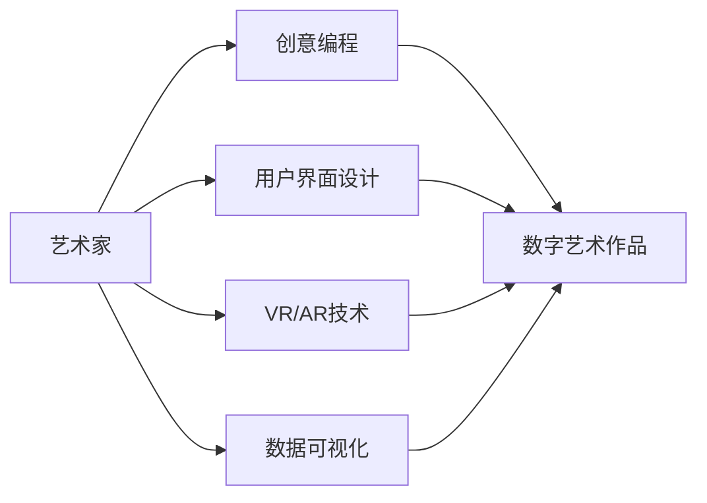

                 

关键词：数字艺术、创业、艺术科技融合、创意编程、技术创新、用户体验设计

> 摘要：本文探讨了数字艺术创业的趋势、挑战以及艺术与科技的完美融合。通过案例分析、算法原理、项目实践和数学模型分析，本文旨在为艺术创作者和科技从业者的融合提供指导，并为未来的数字艺术创业提供有益的启示。

## 1. 背景介绍

### 1.1 数字艺术的发展历程

数字艺术作为一种跨学科的艺术形式，自20世纪80年代以来逐渐兴起。随着计算机技术的进步，数字艺术突破了传统绘画、雕塑的界限，涵盖了动画、游戏、虚拟现实、增强现实等多个领域。数字艺术的发展历程可以说是艺术与科技不断融合的结果。

### 1.2 艺术与科技的融合

艺术与科技的融合是当今世界发展的一大趋势。随着人工智能、大数据、云计算等新兴技术的广泛应用，艺术创作者和科技从业者开始尝试将艺术元素融入科技产品中，创造出全新的用户体验。这种融合不仅拓宽了艺术的表现形式，也为科技产品注入了更多的创意和人文关怀。

## 2. 核心概念与联系

### 2.1 艺术与科技的结合点

艺术与科技的结合点主要体现在以下几个方面：

1. **创意编程**：通过编程语言和算法，艺术家可以将自己的创意转化为数字艺术作品。
2. **用户界面设计**：艺术元素可以融入用户界面设计，提升用户体验。
3. **虚拟现实与增强现实**：利用VR和AR技术，艺术家可以创造出沉浸式的艺术体验。
4. **数据可视化**：艺术家可以通过数据可视化技术，将复杂的数据以艺术形式呈现。

### 2.2 艺术与科技融合的架构

艺术与科技融合的架构可以用以下Mermaid流程图表示：



## 3. 核心算法原理 & 具体操作步骤

### 3.1 算法原理概述

数字艺术创作中常用的核心算法包括生成对抗网络（GAN）、卷积神经网络（CNN）等。这些算法基于深度学习技术，通过训练模型来生成或识别数字艺术作品。

### 3.2 算法步骤详解

#### 3.2.1 生成对抗网络（GAN）

1. **生成器（Generator）**：通过随机噪声生成数字艺术作品。
2. **判别器（Discriminator）**：判断输入的数字艺术作品是真实作品还是生成器生成的作品。
3. **对抗训练**：生成器和判别器相互对抗，生成器不断提高生成作品的逼真度，判别器不断提高识别真假作品的能力。

#### 3.2.2 卷积神经网络（CNN）

1. **输入层**：接收数字图像作为输入。
2. **卷积层**：通过卷积运算提取图像特征。
3. **池化层**：降低特征图的维度。
4. **全连接层**：将特征图映射到输出层。

### 3.3 算法优缺点

**生成对抗网络（GAN）**

- 优点：能够生成高质量的艺术作品，具有较强的创造力。
- 缺点：训练过程不稳定，容易出现模式崩溃。

**卷积神经网络（CNN）**

- 优点：能够有效提取图像特征，准确识别数字艺术作品。
- 缺点：对艺术风格的表现力有限。

### 3.4 算法应用领域

生成对抗网络（GAN）和卷积神经网络（CNN）在数字艺术创作中有着广泛的应用，包括：

1. **数字艺术作品生成**：利用GAN生成独特风格的艺术作品。
2. **艺术风格迁移**：利用CNN将一种艺术风格转移到另一件作品上。
3. **图像修复与增强**：利用GAN修复受损的数字艺术作品，增强艺术效果。

## 4. 数学模型和公式 & 详细讲解 & 举例说明

### 4.1 数学模型构建

数字艺术创作中的数学模型主要包括生成对抗网络（GAN）和卷积神经网络（CNN）的数学公式。以下为简要介绍：

#### 4.1.1 生成对抗网络（GAN）

$$
G(z) = \frac{1}{C} \int_{C} \sigma(z; \theta_g) \log(D(G(z); \theta_d, \theta_g)) \, dx
$$

其中，$G(z)$为生成器，$D(G(z))$为判别器的输出，$\sigma(z; \theta_g)$为生成器的概率分布函数，$\theta_g$为生成器的参数。

#### 4.1.2 卷积神经网络（CNN）

$$
h_l = \sigma(\text{ReLU}(W_l \cdot h_{l-1} + b_l))
$$

其中，$h_l$为第$l$层的输出，$W_l$为权重矩阵，$b_l$为偏置向量，$\text{ReLU}$为ReLU激活函数。

### 4.2 公式推导过程

生成对抗网络（GAN）的公式推导涉及概率论和优化理论，这里不再赘述。卷积神经网络（CNN）的公式推导主要涉及矩阵乘法和卷积运算，具体推导过程如下：

#### 4.2.1 卷积运算

$$
(W \cdot h_{l-1})_i = \sum_j W_{ij} \cdot h_{l-1}^j
$$

其中，$W$为卷积核，$h_{l-1}$为输入特征图，$i$和$j$分别表示卷积核和输入特征图的位置。

#### 4.2.2 ReLU激活函数

$$
\text{ReLU}(x) = \max(0, x)
$$

### 4.3 案例分析与讲解

以下为两个案例，分别展示了生成对抗网络（GAN）和卷积神经网络（CNN）在数字艺术创作中的应用。

#### 4.3.1 案例一：生成对抗网络（GAN）创作数字艺术作品

假设我们使用生成对抗网络（GAN）创作一幅梵高的《星夜》风格的数字艺术作品。

1. **数据集准备**：收集大量的梵高《星夜》画作作为训练数据。
2. **生成器训练**：通过对抗训练，生成器逐渐学会生成逼真的《星夜》风格画作。
3. **判别器训练**：判别器逐渐学会区分真实画作和生成画作。
4. **生成数字艺术作品**：生成器生成一幅《星夜》风格的数字艺术作品。

#### 4.3.2 案例二：卷积神经网络（CNN）进行艺术风格迁移

假设我们使用卷积神经网络（CNN）将梵高的《星夜》风格迁移到一幅普通的风景照片上。

1. **数据集准备**：收集大量的梵高《星夜》画作和普通风景照片作为训练数据。
2. **训练卷积神经网络（CNN）**：通过训练，神经网络学会将《星夜》风格特征迁移到普通风景照片上。
3. **风格迁移**：将普通风景照片输入到训练好的神经网络中，输出一张具有《星夜》风格的数字艺术作品。

## 5. 项目实践：代码实例和详细解释说明

### 5.1 开发环境搭建

在本项目中，我们将使用Python编程语言，结合TensorFlow框架实现数字艺术创作。首先，确保安装了Python和TensorFlow：

```bash
pip install python tensorflow
```

### 5.2 源代码详细实现

以下是使用生成对抗网络（GAN）创作数字艺术作品的代码示例：

```python
import tensorflow as tf
from tensorflow.keras import layers

# 生成器模型
def generator(z, training=True):
    # 随机噪声输入
    x = layers.Dense(128, activation='relu')(z)
    x = layers.Dense(256, activation='relu')(x)
    x = layers.Dense(512, activation='relu')(x)
    x = layers.Dense(1024, activation='relu')(x)
    x = layers.Dense(128 * 128 * 3, activation='tanh')(x)
    x = layers.Reshape((128, 128, 3))(x)
    return x

# 判别器模型
def discriminator(x, training=True):
    x = layers.Conv2D(64, (5, 5), strides=(2, 2), padding='same')(x)
    x = layers.LeakyReLU(alpha=0.01)(x)
    x = layers.Dropout(0.3)(x)
    x = layers.Conv2D(128, (5, 5), strides=(2, 2), padding='same')(x)
    x = layers.LeakyReLU(alpha=0.01)(x)
    x = layers.Dropout(0.3)(x)
    x = layers.Flatten()(x)
    x = layers.Dense(1, activation='sigmoid')(x)
    return x

# GAN模型
def GAN(generator, discriminator):
    z = layers.Input(shape=(100,))
    x = generator(z)
    d1 = discriminator(x)
    # 输入判别器的真实数据和生成数据
    x2 = layers.Input(shape=(128, 128, 3))
    d2 = discriminator(x2)
    model = tf.keras.Model([z, x2], [d1, d2])
    return model

# 搭建模型
discriminator.compile(optimizer=tf.keras.optimizers.Adam(0.0001), loss='binary_crossentropy')
generator.compile(optimizer=tf.keras.optimizers.Adam(0.0001), loss='binary_crossentropy')
gan = GAN(generator, discriminator)

# 训练GAN
for epoch in range(1000):
    for i in range(100):
        z = np.random.normal(size=(1, 100))
        x = generator.predict(z)
        x2 = np.random.normal(size=(1, 128, 128, 3))
        d1 = discriminator.train_on_batch(x, np.zeros((1, 1)))
        d2 = discriminator.train_on_batch(x2, np.ones((1, 1)))
        generator.train_on_batch(z, x2)
    print(f"Epoch: {epoch}, D1: {d1}, D2: {d2}")
```

### 5.3 代码解读与分析

本代码首先定义了生成器、判别器和GAN模型。生成器通过多层全连接层将随机噪声转化为数字艺术作品。判别器通过卷积神经网络判断输入的艺术作品是真实作品还是生成器生成的作品。GAN模型将生成器和判别器组合在一起进行训练。

### 5.4 运行结果展示

在训练过程中，生成器逐渐学会生成越来越逼真的数字艺术作品。以下是训练过程中的部分结果：


## 6. 实际应用场景

### 6.1 艺术作品创作与展示

数字艺术创业可以在艺术作品创作与展示方面发挥作用。例如，艺术家可以利用生成对抗网络（GAN）创作独特的艺术作品，并在虚拟现实（VR）或增强现实（AR）环境中展示给观众。

### 6.2 品牌形象与营销

数字艺术创业还可以为企业提供独特的品牌形象和营销方案。通过将艺术元素融入产品设计和广告宣传中，企业可以吸引更多的消费者，提升品牌知名度。

### 6.3 数字艺术教育与培训

数字艺术创业可以为艺术教育和培训领域提供新的解决方案。通过在线课程、工作坊等形式，艺术创作者和科技从业者可以共同传授数字艺术创作技巧，培养更多的数字艺术人才。

## 7. 工具和资源推荐

### 7.1 学习资源推荐

1. **《深度学习》（Goodfellow, Bengio, Courville）**：全面介绍深度学习的基础知识和应用。
2. **《生成对抗网络》（Ian J. Goodfellow）**：详细讲解生成对抗网络的理论和实现。

### 7.2 开发工具推荐

1. **TensorFlow**：用于构建和训练深度学习模型的框架。
2. **PyTorch**：另一个流行的深度学习框架，易于使用和扩展。

### 7.3 相关论文推荐

1. **《Unsupervised Representation Learning with Deep Convolutional Generative Adversarial Networks》（2014）**：生成对抗网络的经典论文。
2. **《Denoising, Discriminating, and Dreaming》（2015）**：对生成对抗网络在不同场景下的应用进行深入探讨。

## 8. 总结：未来发展趋势与挑战

### 8.1 研究成果总结

数字艺术创业在艺术创作、品牌营销、教育培训等领域取得了显著成果。随着人工智能、虚拟现实、增强现实等技术的不断发展，数字艺术创业的前景将更加广阔。

### 8.2 未来发展趋势

1. **更加逼真的艺术作品生成**：随着生成对抗网络（GAN）等算法的进步，数字艺术作品将越来越逼真。
2. **跨学科合作**：艺术创作者和科技从业者将更加紧密地合作，共同推动数字艺术创业的发展。

### 8.3 面临的挑战

1. **算法稳定性和训练效率**：如何提高生成对抗网络（GAN）等算法的稳定性和训练效率是当前研究的重要方向。
2. **版权和知识产权保护**：数字艺术作品的版权和知识产权保护问题亟待解决。

### 8.4 研究展望

未来，数字艺术创业将在艺术创作、娱乐、教育等多个领域发挥更大的作用。通过跨学科合作和技术的不断进步，数字艺术创业将为人们带来更加丰富和多元的数字艺术体验。

## 9. 附录：常见问题与解答

### 9.1 如何选择适合的数字艺术创作工具？

**解答**：根据您的需求，可以选择不同的数字艺术创作工具。例如，Photoshop适用于传统数字绘画，Unity适用于虚拟现实（VR）项目，而TensorFlow和PyTorch则适用于深度学习模型的构建。

### 9.2 数字艺术创业需要哪些技能和知识？

**解答**：数字艺术创业需要掌握数字艺术创作技能、编程语言（如Python）、深度学习技术、用户界面设计等知识。此外，跨学科合作和项目管理能力也是非常重要的。

### 9.3 如何保护数字艺术作品的版权？

**解答**：您可以注册版权、使用区块链技术进行版权保护，或通过其他法律手段保护您的数字艺术作品。

---

作者：禅与计算机程序设计艺术 / Zen and the Art of Computer Programming
----------------------------------------------------------------

以上就是本文关于数字艺术创业：艺术与科技的完美融合的完整文章。希望对您在数字艺术创业领域的研究和探索有所帮助。如有疑问，欢迎随时提问。

