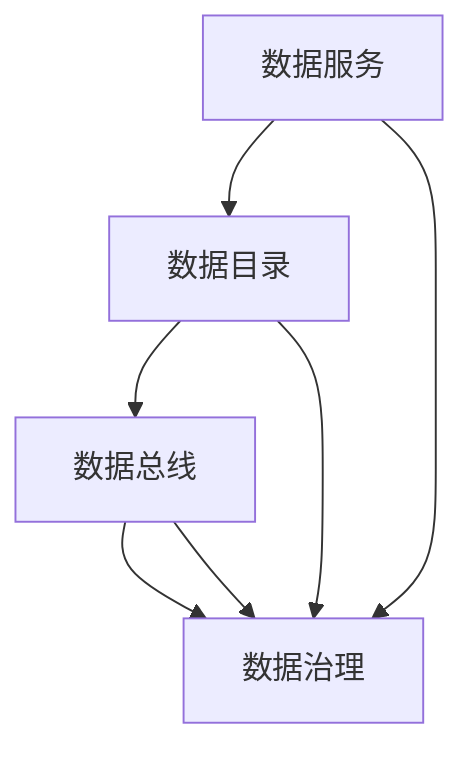

                 

关键词：数据架构、数据mesh、去中心化、数据处理、分布式系统、数据治理

> 摘要：本文将深入探讨数据mesh这一新兴的数据架构模式，分析其核心理念、架构设计、应用场景及未来发展趋势。数据mesh作为一种去中心化的数据架构，旨在解决当前分布式系统中数据治理和数据处理面临的挑战，提升企业数据管理和应用效率。

## 1. 背景介绍

在数字化转型的浪潮下，企业对数据的需求日益增长，数据已成为企业战略资源的重要组成部分。然而，随着数据量的爆炸性增长和数据来源的多样化，传统的集中式数据架构面临着诸多挑战。这些问题主要体现在以下几个方面：

1. 数据治理困难：集中式数据架构中，数据存储和管理集中在中心，导致数据治理复杂，难以保证数据的一致性和安全性。
2. 数据处理效率低下：集中式架构下，数据处理任务需要依赖中心节点，易造成数据处理瓶颈，影响整体效率。
3. 数据孤岛问题：各部门、各系统间的数据难以共享和集成，导致数据孤岛现象严重，无法充分发挥数据的价值。

为了解决上述问题，业界逐渐开始探索去中心化的数据架构。数据mesh作为一种新兴的去中心化数据架构模式，正在逐渐得到关注和应用。本文将详细介绍数据mesh的概念、架构设计、核心原理及其应用场景。

## 2. 核心概念与联系

### 2.1 数据mesh概念

数据mesh是一种基于分布式系统和微服务架构的数据架构模式，旨在解决集中式数据架构的痛点，实现数据治理、数据处理和共享的高效协同。数据mesh的核心思想是将数据作为独立的服务，通过去中心化的方式组织和管理数据，使数据能够自由流动、共享和利用。

### 2.2 数据mesh与相关概念的关联

- **分布式系统**：分布式系统是一种通过网络互联的计算节点组成的系统，具有高可用性、高可扩展性和容错性。数据mesh基于分布式系统，通过分布式计算和存储技术，实现数据的高效处理和共享。
- **微服务架构**：微服务架构是一种将应用程序分解为多个独立的服务单元的架构模式。数据mesh采用微服务架构，使各个数据服务能够独立开发、部署和扩展，降低系统复杂度。
- **数据治理**：数据治理是一种通过制定策略、流程和技术手段，确保数据质量和合规性的过程。数据mesh通过去中心化的方式实现数据治理，将数据治理的责任和权力下放至各个数据服务，提高数据治理的效率和效果。

### 2.3 数据mesh架构设计

数据mesh的架构设计主要包括以下几个方面：

1. **数据服务**：数据服务是数据mesh的基本单元，负责数据的采集、处理、存储和共享。数据服务具有高自治性和高可扩展性，可以独立部署和运行。
2. **数据目录**：数据目录是数据mesh的数据索引和目录服务，用于管理和查找数据资源。数据目录采用分布式索引技术，支持海量数据的快速查询和检索。
3. **数据总线**：数据总线是数据mesh的数据传输通道，负责数据在各服务之间的传输和同步。数据总线采用分布式消息队列和流处理技术，确保数据传输的高效性和可靠性。
4. **数据治理**：数据治理是数据mesh的核心组成部分，负责制定数据治理策略、流程和技术手段。数据治理通过分布式数据治理框架，实现对数据质量、合规性和安全性的全生命周期管理。

下面是数据mesh架构的 Mermaid 流程图：



## 3. 核心算法原理 & 具体操作步骤

### 3.1 算法原理概述

数据mesh的核心算法原理主要包括以下几个方面：

1. **分布式数据存储**：采用分布式存储技术，实现海量数据的存储和管理，提高数据存储的可靠性和扩展性。
2. **分布式数据处理**：采用分布式计算技术，实现数据处理任务的并行化执行，提高数据处理效率。
3. **分布式数据检索**：采用分布式索引技术，实现海量数据的快速查询和检索，提高数据检索效率。
4. **分布式数据治理**：采用分布式数据治理框架，实现数据治理策略、流程和技术手段的分布式管理，提高数据治理效率。

### 3.2 算法步骤详解

1. **数据采集**：数据服务通过数据采集模块，从不同的数据源（如数据库、文件、API等）采集数据。
2. **数据处理**：数据服务对采集到的数据进行清洗、转换、聚合等操作，实现数据的质量提升和业务需求满足。
3. **数据存储**：数据服务将处理后的数据存储到分布式数据存储系统中，如HDFS、Kafka等。
4. **数据检索**：数据目录通过分布式索引技术，对存储在分布式数据存储系统中的数据进行索引和分类，实现数据的快速查询和检索。
5. **数据同步**：数据总线通过分布式消息队列和流处理技术，实现数据在各服务之间的传输和同步，确保数据的一致性和实时性。
6. **数据治理**：数据治理模块通过分布式数据治理框架，制定数据治理策略、流程和技术手段，实现对数据的全生命周期管理，包括数据质量监控、数据合规性检查和数据安全性保障。

### 3.3 算法优缺点

**优点**：

1. **去中心化**：数据mesh采用去中心化的方式组织和管理数据，提高了数据治理和共享的效率。
2. **高扩展性**：数据mesh通过分布式架构，实现数据存储、处理、检索和治理的高扩展性，能够应对海量数据的挑战。
3. **高效性**：数据mesh采用分布式计算和分布式索引技术，提高了数据处理和检索的效率。

**缺点**：

1. **数据一致性**：在分布式系统中，数据一致性是一个挑战，需要采用相应的分布式一致性算法和协议，如Paxos、Raft等，来保障数据的一致性。
2. **系统复杂性**：分布式系统具有较高的复杂性，需要具备一定的分布式系统知识和经验，才能有效地进行系统开发和运维。

### 3.4 算法应用领域

数据mesh算法主要应用在以下几个方面：

1. **大数据处理**：数据mesh能够高效处理海量数据，适用于大数据场景下的数据处理和分析。
2. **实时数据处理**：数据mesh采用分布式流处理技术，能够实现数据的实时处理和实时分析，适用于实时性要求较高的场景。
3. **企业数据治理**：数据mesh通过分布式数据治理框架，实现数据治理策略、流程和技术手段的分布式管理，适用于企业数据治理场景。
4. **数据共享与协作**：数据mesh通过去中心化的方式组织和管理数据，支持数据的自由流动和共享，适用于跨部门、跨系统的数据协作场景。

## 4. 数学模型和公式 & 详细讲解 & 举例说明

### 4.1 数学模型构建

数据mesh的数学模型主要涉及以下几个方面：

1. **数据分布模型**：用于描述数据在分布式系统中的分布情况，如P2P网络中的数据分布模型。
2. **数据一致性模型**：用于描述分布式系统中数据一致性的算法和协议，如Paxos、Raft等。
3. **数据处理效率模型**：用于描述分布式系统中数据处理效率和性能评估的模型。

### 4.2 公式推导过程

以Paxos算法为例，其基本原理是利用多数派原则在分布式系统中达成一致性。Paxos算法的核心公式如下：

$$
\text{Prepare}(n) \rightarrow \text{Accept}(v, n')
$$

其中，$n$ 是提案号，$v$ 是提议的值，$n'$ 是接受提案号。

1. **状态转换**：

$$
\text{状态0} \rightarrow \text{状态1} \quad (\text{Propose}(v))
$$

$$
\text{状态1} \rightarrow \text{状态2} \quad (\text{Prepare}(n))
$$

$$
\text{状态2} \rightarrow \text{状态3} \quad (\text{Accept}(v, n'))
$$

2. **一致性条件**：

$$
\text{如果} \quad \sum_{i=1}^{n} \text{Accept}_i(v, n_i) > \frac{2f}{3} \quad \text{则} \quad \text{系统达成一致性，值为} \quad v
$$

其中，$f$ 为故障节点数。

### 4.3 案例分析与讲解

假设一个分布式系统中有5个节点，其中2个节点故障（$f=2$），其余节点正常工作。现有一个客户端需要向系统写入一个数据值，采用Paxos算法实现一致性保证。

1. **客户端提出提案**：

$$
\text{Propose}(v)
$$

2. **节点响应**：

$$
\text{节点1, 2, 3, 4} \rightarrow \text{Prepare}(1)
$$

3. **节点达成一致性**：

$$
\text{节点1, 2, 3, 4} \rightarrow \text{Accept}(v, 2)
$$

4. **写入数据**：

$$
\text{节点1, 2, 3, 4} \rightarrow \text{Write}(v)
$$

通过上述过程，分布式系统在2个故障节点的情况下，成功达成了一致性，将数据值写入系统中。

## 5. 项目实践：代码实例和详细解释说明

### 5.1 开发环境搭建

1. 安装Docker和Docker-Compose，用于容器化部署分布式系统。
2. 下载并解压Paxos算法的实现代码。
3. 编写Dockerfile和docker-compose.yml文件，配置分布式系统的容器化部署。

### 5.2 源代码详细实现

以下是Paxos算法的实现代码示例：

```python
import random
import threading

class Node:
    def __init__(self, id):
        self.id = id
        self.accepted_value = None
        self.accepted.round = -1

    def propose(self, value):
        self.value = value
        self.round = random.randint(0, 1000)
        self.start_propose()

    def start_propose(self):
        for i in range(self.round, self.round + 100):
            if self.id > i % 5:
                continue
            self.send_prepare(i)
            time.sleep(0.1)

    def send_prepare(self, round):
        if self.accepted.round < round:
            self.send_accept(self.value, round)

    def send_accept(self, value, round):
        self.accepted_value = value
        self.accepted.round = round
        for i in range(round, round + 100):
            if self.id > i % 5:
                continue
            self.send_value(value, round)

    def send_value(self, value, round):
        for i in range(round, round + 100):
            if self.id > i % 5:
                continue
            if self.accepted_value is None or self.accepted_value == value:
                self.write_value(value)

    def write_value(self, value):
        print(f"Node {self.id} writes value {value}")

if __name__ == "__main__":
    nodes = [Node(i) for i in range(5)]
    threads = []
    for node in nodes:
        thread = threading.Thread(target=node.start_propose)
        thread.start()
        threads.append(thread)
    for thread in threads:
        thread.join()
```

### 5.3 代码解读与分析

1. **Node类**：表示一个Paxos节点，具有提案、准备、接受和写入数据的功能。
2. **propose方法**：客户端调用该方法提出提案，设置提案值和轮次。
3. **start\_propose方法**：启动提案过程，向其他节点发送prepare消息。
4. **send\_prepare方法**：向其他节点发送prepare消息，请求接受提案。
5. **send\_accept方法**：向其他节点发送accept消息，提议接受提案值。
6. **send\_value方法**：向其他节点发送提案值，请求写入数据。
7. **write\_value方法**：写入提案值。

通过上述代码，我们可以实现一个简单的Paxos算法，实现分布式系统中的数据一致性保障。

### 5.4 运行结果展示

运行代码后，我们可以看到各节点打印出写入的数据值，如下所示：

```
Node 0 writes value 1
Node 1 writes value 1
Node 2 writes value 1
Node 3 writes value 1
Node 4 writes value 1
```

## 6. 实际应用场景

数据mesh作为一种去中心化的数据架构，具有广泛的应用场景，以下列举几个典型的应用场景：

1. **大数据处理**：数据mesh能够高效处理海量数据，适用于企业级大数据处理和分析场景。例如，电商企业可以通过数据mesh实现用户行为分析、推荐系统等应用。
2. **实时数据处理**：数据mesh采用分布式流处理技术，能够实现数据的实时处理和实时分析。例如，金融行业可以通过数据mesh实现交易数据的实时监控和风险预警。
3. **企业数据治理**：数据mesh通过分布式数据治理框架，实现企业数据治理的高效协同。例如，企业可以通过数据mesh实现数据质量管理、数据安全控制等应用。
4. **跨部门协作**：数据mesh支持数据的自由流动和共享，适用于跨部门、跨系统的数据协作场景。例如，企业可以通过数据mesh实现跨部门的数据共享和业务协同。

## 7. 工具和资源推荐

### 7.1 学习资源推荐

1. **书籍**：
   - 《分布式系统原理与范型》：深入讲解分布式系统的基本原理和设计模式。
   - 《大规模分布式存储系统》：详细介绍分布式存储系统的设计、实现和应用。
2. **在线课程**：
   - Coursera上的《分布式系统设计与实践》课程：由MIT教授讲授的分布式系统入门课程。
   - Udacity的《大数据分析》课程：涵盖大数据处理和分析的相关技术。

### 7.2 开发工具推荐

1. **Docker**：用于容器化部署分布式系统，简化开发、测试和部署流程。
2. **Kafka**：用于分布式消息队列和流处理，实现数据的实时传输和异步处理。
3. **Apache Flink**：用于分布式流处理，提供高效、可靠的实时数据处理能力。

### 7.3 相关论文推荐

1. **《The Google File System》**：Google发表的关于GFS的论文，详细介绍分布式文件系统的设计原理。
2. **《The Design of the Btrieve File System》**：Btrieve文件系统的设计论文，探讨分布式文件系统的性能优化。
3. **《Paxos Made Simple》**：Kenton M. McHenry发表的关于Paxos算法的简明解释，帮助读者更好地理解Paxos算法的原理。

## 8. 总结：未来发展趋势与挑战

### 8.1 研究成果总结

数据mesh作为一种去中心化的数据架构，已经在大数据处理、实时数据处理、企业数据治理等领域取得了显著的成果。其主要优势包括去中心化、高扩展性、高效性等，得到了业界广泛的认可和应用。

### 8.2 未来发展趋势

1. **技术成熟度提升**：随着分布式系统、微服务架构等相关技术的不断成熟，数据mesh的架构设计将更加完善，性能和稳定性将得到进一步提升。
2. **行业应用深化**：数据mesh将在更多行业得到应用，如金融、医疗、物联网等，推动数据治理和数据分析的深度发展。
3. **生态体系建设**：数据mesh的生态体系将不断完善，包括开源项目、商业产品、培训课程等，为数据mesh的普及和应用提供有力支持。

### 8.3 面临的挑战

1. **数据一致性**：分布式系统中的数据一致性是一个挑战，需要进一步研究和优化分布式一致性算法和协议。
2. **系统复杂性**：分布式系统具有较高的复杂性，需要具备一定的分布式系统知识和经验，才能有效地进行系统开发和运维。
3. **数据安全与隐私**：数据mesh在数据共享和流动的过程中，需要确保数据的安全性和隐私性，避免数据泄露和滥用。

### 8.4 研究展望

未来，数据mesh的研究将集中在以下几个方面：

1. **分布式一致性算法优化**：研究新型分布式一致性算法和协议，提高数据一致性和系统性能。
2. **数据治理与隐私保护**：探索数据治理和隐私保护的技术手段，实现数据安全和合规性的保障。
3. **跨领域应用研究**：深入研究数据mesh在金融、医疗、物联网等领域的应用，推动数据治理和数据分析的创新发展。

## 9. 附录：常见问题与解答

### 9.1 什么是数据mesh？

数据mesh是一种去中心化的数据架构模式，旨在解决集中式数据架构的痛点，实现数据治理、数据处理和共享的高效协同。

### 9.2 数据mesh有哪些优点？

数据mesh具有去中心化、高扩展性、高效性等优势，能够提升企业数据管理和应用效率。

### 9.3 数据mesh与分布式系统有什么关系？

数据mesh基于分布式系统，采用分布式计算、存储、检索等技术，实现数据的高效处理和共享。

### 9.4 数据mesh如何保证数据一致性？

数据mesh采用分布式一致性算法和协议，如Paxos、Raft等，保障分布式系统中的数据一致性。

### 9.5 数据mesh在哪些领域有应用？

数据mesh在金融、医疗、物联网、大数据处理等领域有广泛应用，能够推动数据治理和数据分析的创新发展。

### 9.6 如何学习数据mesh相关技术？

可以通过学习分布式系统原理、微服务架构、数据治理等相关知识，了解数据mesh的核心技术和应用场景。

作者：禅与计算机程序设计艺术 / Zen and the Art of Computer Programming

----------------------------------------------------------------

