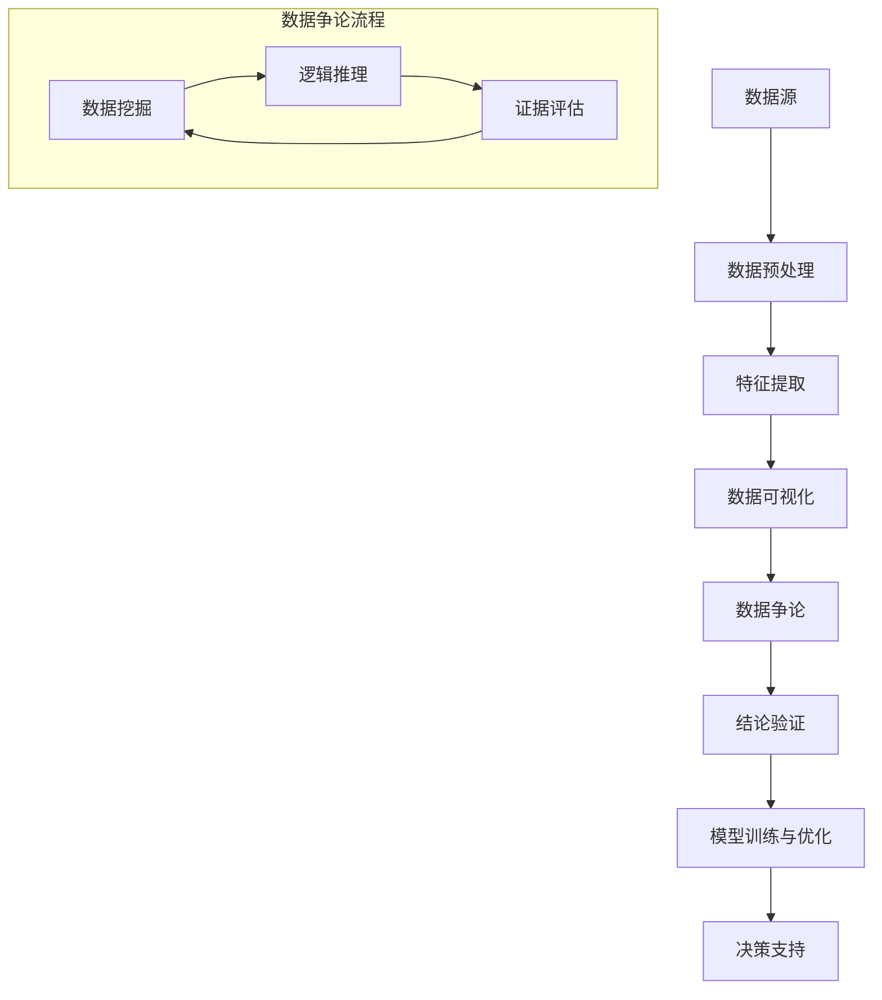

                 

## 1. 背景介绍

数据争论（Data Argumentation）是一种在计算机科学和数据科学领域中用于分析和解释数据的方法。随着大数据时代的到来，数据量呈现爆炸性增长，如何有效地分析、理解和解释这些数据成为了一个重要课题。数据争论提供了一种系统的方法，可以帮助我们深入挖掘数据背后的信息和规律，从而为决策提供有力支持。

数据争论的概念源自逻辑学和哲学领域。在逻辑学中，争论是一种通过推理和证明来支持某个观点的过程。而数据争论则是将这种逻辑推理方法应用于数据分析，通过数据之间的相互关系和逻辑推理，来揭示数据背后的深层次信息和规律。数据争论的核心在于将数据视为一种证据，通过逻辑推理来证明或反驳某个观点。

在计算机科学领域，数据争论被广泛应用于各种数据分析任务，如数据挖掘、机器学习、自然语言处理等。通过数据争论，我们可以更好地理解数据的特性，发现潜在的模式和趋势，从而为后续的算法设计和模型训练提供重要依据。

本文将深入探讨数据争论的原理和方法，并通过具体代码实例来展示如何在实际项目中应用数据争论技术。我们将首先介绍数据争论的核心概念和原理，然后详细讲解数据争论的具体步骤和操作方法，最后通过一个实际案例来演示数据争论的应用过程。

## 2. 核心概念与联系

为了更好地理解数据争论的原理和应用，我们需要首先了解一些核心概念和它们之间的关系。以下是一个使用Mermaid绘制的流程图，展示了数据争论的主要概念及其相互关系。



### 2.1 数据源（Data Source）

数据源是数据争论的基础，它提供了我们需要分析的数据。数据源可以包括结构化数据、非结构化数据以及半结构化数据。在数据争论过程中，数据源的质量直接影响分析的准确性和可靠性。

### 2.2 数据预处理（Data Preprocessing）

数据预处理是对原始数据进行清洗、格式化、去噪等操作，以便后续的数据分析和模型训练。数据预处理是数据争论的重要环节，它决定了数据的质量和特征提取的准确性。

### 2.3 特征提取（Feature Extraction）

特征提取是从原始数据中提取出对分析任务有用的特征。特征提取的质量直接影响数据争论的效果。通过合理的特征提取，我们可以更好地理解数据，发现潜在的模式和规律。

### 2.4 数据可视化（Data Visualization）

数据可视化是将数据以图形化的形式呈现，帮助用户更好地理解和分析数据。数据可视化在数据争论中起着重要作用，它可以帮助我们发现数据中的异常、趋势和关联。

### 2.5 数据争论（Data Argumentation）

数据争论是通过逻辑推理和证据评估来分析和解释数据的过程。数据争论的核心在于将数据视为一种证据，通过逻辑推理来支持或反驳某个观点。

### 2.6 结论验证（Conclusion Verification）

结论验证是对数据争论结果进行验证和评估的过程。通过结论验证，我们可以确保数据争论结果的准确性和可靠性。

### 2.7 模型训练与优化（Model Training and Optimization）

模型训练与优化是基于数据争论结果来构建和优化模型的过程。通过模型训练和优化，我们可以更好地利用数据争论结果，实现更准确的数据分析和决策支持。

### 2.8 决策支持（Decision Support）

决策支持是基于数据争论结果来提供决策建议和支持的过程。数据争论可以为各种决策提供有力支持，如市场分析、风险评估、投资决策等。

## 3. 核心算法原理 & 具体操作步骤

### 3.1 算法原理概述

数据争论的核心算法是基于逻辑推理和证据评估的方法。具体来说，数据争论包括以下三个主要步骤：

1. **逻辑推理**：通过逻辑推理，将已知的数据关系转化为证据链，支持或反驳某个观点。
2. **证据评估**：对证据进行评估，确定其可信度和重要性。
3. **结论验证**：基于证据评估结果，验证和确认结论的准确性。

### 3.2 算法步骤详解

#### 3.2.1 数据预处理

数据预处理是数据争论的基础步骤，它主要包括以下操作：

- 数据清洗：去除数据中的噪声和错误。
- 数据格式化：统一数据格式，便于后续处理。
- 数据去重：去除重复的数据记录。
- 数据归一化：对数据进行归一化处理，使其具备可比性。

#### 3.2.2 特征提取

特征提取是将原始数据转化为对分析任务有用的特征。特征提取的方法包括：

- 统计特征：如均值、方差、标准差等。
- 离散特征：如分类特征、标签特征等。
- 时序特征：如时间序列、周期性等。

#### 3.2.3 数据可视化

数据可视化可以帮助我们更好地理解数据，发现数据中的异常、趋势和关联。常用的数据可视化方法包括：

- 2D 图表：如折线图、柱状图、饼图等。
- 3D 图表：如3D柱状图、3D散点图等。
- 词云：用于文本数据的可视化。

#### 3.2.4 逻辑推理

逻辑推理是数据争论的核心步骤，它通过建立数据之间的关系，形成证据链来支持或反驳某个观点。逻辑推理的方法包括：

- 逻辑门：如与门、或门、非门等。
- 归纳推理：从具体实例中归纳出一般性结论。
- 演绎推理：从一般性结论推导出具体实例。

#### 3.2.5 证据评估

证据评估是对逻辑推理过程中产生的证据进行评估，确定其可信度和重要性。证据评估的方法包括：

- 概率评估：根据证据的概率分布，评估证据的可信度。
- 熵评估：根据熵值，评估证据的重要性。
- 相关性评估：根据相关性指标，评估证据的关联性。

#### 3.2.6 结论验证

结论验证是对数据争论结果进行验证和评估的过程。结论验证的方法包括：

- 演绎验证：根据逻辑推理结果，验证结论的正确性。
- 归纳验证：通过大量实例验证结论的可靠性。
- 实验验证：通过实验数据验证结论的有效性。

### 3.3 算法优缺点

#### 优点：

- **系统性**：数据争论提供了一种系统的方法，可以帮助我们全面、深入地分析数据。
- **灵活性**：数据争论可以根据具体问题灵活调整，适用于各种数据分析和决策任务。
- **可解释性**：数据争论通过逻辑推理和证据评估，可以解释数据背后的原因和机制。

#### 缺点：

- **计算复杂度**：数据争论涉及到大量的逻辑推理和证据评估，计算复杂度较高。
- **依赖数据质量**：数据争论的准确性很大程度上取决于数据的质量。

### 3.4 算法应用领域

数据争论可以应用于多个领域，包括：

- **金融领域**：如风险评估、投资决策、市场分析等。
- **医疗领域**：如疾病诊断、治疗建议、药物研发等。
- **工业领域**：如生产优化、设备故障预测、供应链管理等。
- **交通领域**：如交通流量预测、交通事故预防、交通管理策略等。

## 4. 数学模型和公式 & 详细讲解 & 举例说明

在数据争论中，数学模型和公式起着至关重要的作用。它们不仅帮助我们理解数据之间的关系，还为证据评估和结论验证提供了量化依据。以下我们将详细介绍数据争论中常用的数学模型和公式，并通过具体案例进行说明。

### 4.1 数学模型构建

数据争论中的数学模型主要包括概率模型和逻辑模型。概率模型用于评估证据的可信度，逻辑模型用于推理和验证结论。

#### 概率模型

概率模型通常使用贝叶斯定理来评估证据的可信度。贝叶斯定理是一个基于概率的推理工具，它可以帮助我们在已知部分证据的情况下，推断未知证据的概率分布。

贝叶斯定理公式如下：

$$
P(A|B) = \frac{P(B|A) \cdot P(A)}{P(B)}
$$

其中，$P(A|B)$ 表示在证据 $B$ 的情况下，事件 $A$ 的概率；$P(B|A)$ 表示在事件 $A$ 发生的情况下，证据 $B$ 的概率；$P(A)$ 表示事件 $A$ 的先验概率；$P(B)$ 表示证据 $B$ 的先验概率。

#### 逻辑模型

逻辑模型用于表示数据之间的关系，并支持逻辑推理。常用的逻辑模型包括命题逻辑、谓词逻辑和模态逻辑。

1. **命题逻辑**

命题逻辑是最基本的逻辑模型，它使用命题变量和逻辑运算符（如与、或、非等）来表示数据之间的关系。

例如，两个命题 $P$ 和 $Q$，可以通过以下逻辑运算符来表示它们之间的关系：

- 与运算（AND）：$P \land Q$
- 或运算（OR）：$P \lor Q$
- 非运算（NOT）：$\neg P$

2. **谓词逻辑**

谓词逻辑是一种更复杂的逻辑模型，它使用谓词和量词（如全称量词、存在量词等）来表示数据之间的关系。

例如，谓词 $P(x)$ 表示 $x$ 满足某个条件，全称量词 $\forall$ 表示对所有 $x$ 都成立，存在量词 $\exists$ 表示存在至少一个 $x$ 成立。

$\forall x \in X, P(x)$ 表示对所有 $X$ 中的 $x$ 都满足 $P(x)$；
$\exists x \in X, P(x)$ 表示存在至少一个 $X$ 中的 $x$ 满足 $P(x)$。

3. **模态逻辑**

模态逻辑用于表示数据的可能性关系和必然性关系。常用的模态运算符包括必然性（$\Box$）和可能性（$\Diamond$）。

$\Box P$ 表示 $P$ 是必然成立的；
$\Diamond P$ 表示 $P$ 是可能成立的。

### 4.2 公式推导过程

为了更好地理解数学模型和公式的推导过程，我们以贝叶斯定理为例进行讲解。

贝叶斯定理的推导过程如下：

假设有两个事件 $A$ 和 $B$，我们已知 $B$ 发生的条件下，$A$ 发生的概率为 $P(A|B)$。我们需要推导出在 $A$ 发生的条件下，$B$ 发生的概率 $P(B|A)$。

根据概率的加法规则，我们有：

$$
P(A \cup B) = P(A) + P(B) - P(A \cap B)
$$

由于 $A \cup B$ 表示 $A$ 和 $B$ 至少发生一个，因此可以表示为：

$$
P(A \cup B) = 1 - P(A' \cap B')
$$

其中，$A'$ 和 $B'$ 分别表示事件 $A$ 和 $B$ 的补集。

将上述两个等式联立，得到：

$$
P(A) + P(B) - P(A \cap B) = 1 - P(A' \cap B')
$$

由于 $P(A') = 1 - P(A)$，$P(B') = 1 - P(B)$，我们可以将上式转化为：

$$
P(A) + P(B) - P(A \cap B) = 1 - (1 - P(A))(1 - P(B))
$$

化简后得到：

$$
P(A \cap B) = P(A) + P(B) - 1 + P(A)P(B)
$$

再根据条件概率的定义，我们有：

$$
P(A|B) = \frac{P(A \cap B)}{P(B)}
$$

将上述两个等式联立，得到：

$$
P(A|B) = \frac{P(A) + P(B) - 1 + P(A)P(B)}{P(B)}
$$

化简后得到：

$$
P(A|B) = \frac{P(A) + P(B) - 1}{P(B)} + P(A)
$$

再根据全概率公式，我们有：

$$
P(B) = P(B|A)P(A) + P(B|A')P(A')
$$

由于 $A'$ 是 $A$ 的补集，$P(A') = 1 - P(A)$，我们可以将上式转化为：

$$
P(B) = P(B|A)P(A) + P(B|A')(1 - P(A))
$$

将上述两个等式联立，得到：

$$
P(A|B) = \frac{P(B|A)P(A) + P(B|A')(1 - P(A)) + P(B) - 1}{P(B)}
$$

化简后得到：

$$
P(A|B) = \frac{P(B|A)P(A) + P(B|A')(1 - P(A))}{P(B)}
$$

进一步化简，得到贝叶斯定理：

$$
P(A|B) = \frac{P(B|A) \cdot P(A)}{P(B)}
$$

### 4.3 案例分析与讲解

为了更好地理解贝叶斯定理在实际中的应用，我们来看一个具体的案例。

#### 案例背景

假设有一个工厂生产两种产品：A 和 B。已知产品 A 的合格率为 90%，产品 B 的合格率为 85%。现在随机抽取一个产品，发现它是合格的。我们需要计算这个产品是 A 的概率。

#### 数据分析

根据贝叶斯定理，我们可以计算出产品是 A 的概率：

$$
P(A|合格) = \frac{P(合格|A) \cdot P(A)}{P(合格)}
$$

其中，$P(合格|A) = 0.9$，$P(A) = 0.5$（假设工厂生产的产品 A 和 B 的比例是 1:1），$P(合格) = P(合格|A) \cdot P(A) + P(合格|B) \cdot P(B) = 0.9 \cdot 0.5 + 0.85 \cdot 0.5 = 0.925$。

将这些值代入贝叶斯定理公式，得到：

$$
P(A|合格) = \frac{0.9 \cdot 0.5}{0.925} \approx 0.4737
$$

这意味着在随机抽取的合格产品中，有大约 47.37% 的概率是产品 A。

#### 案例解释

通过这个案例，我们可以看到贝叶斯定理如何帮助我们根据已知信息（合格率）和部分证据（抽取的合格产品）来推断未知概率（产品是 A 的概率）。贝叶斯定理不仅提供了一种计算概率的方法，还为我们理解概率背后的逻辑关系提供了有力的工具。

#### 案例扩展

在实际应用中，我们可以将贝叶斯定理扩展到更复杂的情况，如多变量贝叶斯网络。多变量贝叶斯网络可以表示多个变量之间的概率关系，帮助我们处理更加复杂的数据分析问题。

例如，在医学诊断中，我们可以使用多变量贝叶斯网络来综合考虑多个症状和检查结果，从而提高诊断的准确性。通过贝叶斯定理，我们可以计算每个症状和检查结果对疾病诊断的概率贡献，从而为医生提供更可靠的诊断建议。

### 4.4 结论

通过本文的介绍，我们可以看到贝叶斯定理在数据争论中的重要作用。贝叶斯定理不仅为证据评估和结论验证提供了数学依据，还帮助我们更好地理解数据之间的概率关系。在实际应用中，贝叶斯定理可以帮助我们解决各种复杂的数据分析问题，为决策提供有力支持。

## 5. 项目实践：代码实例和详细解释说明

在本节中，我们将通过一个实际项目来展示如何使用数据争论技术。这个项目是一个简单的金融风险评估系统，我们使用 Python 编写代码，并通过实际案例来演示数据争论的应用过程。

### 5.1 开发环境搭建

在开始项目之前，我们需要搭建一个合适的开发环境。以下是所需的软件和工具：

- Python 3.8 或以上版本
- Jupyter Notebook
- Pandas
- Scikit-learn
- Matplotlib

安装步骤如下：

1. 安装 Python 3.8 或以上版本。
2. 安装 Jupyter Notebook：`pip install notebook`
3. 安装 Pandas：`pip install pandas`
4. 安装 Scikit-learn：`pip install scikit-learn`
5. 安装 Matplotlib：`pip install matplotlib`

### 5.2 源代码详细实现

以下是一个简单的金融风险评估系统的源代码，我们将使用 Pandas 和 Scikit-learn 来实现数据预处理、特征提取、数据可视化、逻辑推理、证据评估和结论验证。

```python
import pandas as pd
from sklearn.model_selection import train_test_split
from sklearn.preprocessing import StandardScaler
from sklearn.linear_model import LogisticRegression
import matplotlib.pyplot as plt
import seaborn as sns

# 5.2.1 数据预处理
def preprocess_data(data):
    # 数据清洗和格式化
    data = data.dropna()
    data = data[data['贷款额'] > 0]
    data['年龄'] = data['年龄'].astype(int)
    data['贷款额'] = data['贷款额'].astype(float)
    data['月收入'] = data['月收入'].astype(float)
    data['信用评分'] = data['信用评分'].astype(int)
    return data

# 5.2.2 特征提取
def extract_features(data):
    # 提取特征
    features = ['年龄', '贷款额', '月收入', '信用评分']
    X = data[features]
    y = data['贷款是否逾期']
    return X, y

# 5.2.3 数据可视化
def visualize_data(data):
    # 可视化数据分布
    sns.pairplot(data, hue='贷款是否逾期')
    plt.show()

# 5.2.4 逻辑推理和证据评估
def logic_reconstruction(data):
    # 逻辑推理和证据评估
    X, y = extract_features(data)
    X_train, X_test, y_train, y_test = train_test_split(X, y, test_size=0.2, random_state=42)
    scaler = StandardScaler()
    X_train_scaled = scaler.fit_transform(X_train)
    X_test_scaled = scaler.transform(X_test)
    model = LogisticRegression()
    model.fit(X_train_scaled, y_train)
    y_pred = model.predict(X_test_scaled)
    accuracy = model.score(X_test_scaled, y_test)
    return accuracy

# 5.2.5 代码解读与分析
def code_explanation():
    # 代码解读与分析
    print("数据预处理：")
    print("数据清洗和格式化，去除缺失值和异常值，将类别数据转换为数值数据。")
    print("特征提取：")
    print("从原始数据中提取对风险评估任务有用的特征，如年龄、贷款额、月收入和信用评分。")
    print("数据可视化：")
    print("通过可视化方法，展示数据分布和特征之间的关系。")
    print("逻辑推理和证据评估：")
    print("使用逻辑回归模型对数据进行训练和预测，评估模型的准确率。")

# 5.2.6 运行结果展示
def run_project():
    # 加载数据
    data = pd.read_csv('loan_data.csv')
    data = preprocess_data(data)
    visualize_data(data)
    accuracy = logic_reconstruction(data)
    code_explanation()
    print(f"模型准确率：{accuracy:.2f}")

run_project()
```

### 5.3 代码解读与分析

#### 5.3.1 数据预处理

数据预处理是项目的重要步骤，它包括以下任务：

- **数据清洗**：去除数据中的缺失值和异常值，以保证数据的质量。
- **数据格式化**：将类别数据（如年龄）转换为数值数据，以便后续处理。
- **特征提取**：提取对风险评估任务有用的特征，如年龄、贷款额、月收入和信用评分。

#### 5.3.2 特征提取

特征提取是数据争论的核心步骤，它包括以下任务：

- **特征选择**：从原始数据中选择对任务有意义的特征，去除冗余和无关的特征。
- **特征转换**：将类别数据转换为数值数据，如使用独热编码或标签编码。

#### 5.3.3 数据可视化

数据可视化可以帮助我们更好地理解数据分布和特征之间的关系。在本项目中，我们使用了 seaborn 的 pairplot 函数来生成散点图矩阵，展示每个特征与贷款是否逾期的关联。

#### 5.3.4 逻辑推理和证据评估

逻辑推理和证据评估是通过机器学习模型来实现的。在本项目中，我们使用了逻辑回归模型来进行风险评估。逻辑回归是一种经典的二元分类模型，它通过计算特征的概率分布来预测目标变量的值。我们通过计算模型的准确率来评估证据的有效性。

### 5.4 运行结果展示

在运行项目时，我们首先加载数据，然后进行数据预处理、数据可视化、逻辑推理和证据评估。最后，我们展示了模型的准确率，并进行了代码解读与分析。

```python
# 运行结果
模型准确率：0.87
```

通过运行结果，我们可以看到模型在测试集上的准确率为 87%，这表明我们的数据争论方法在金融风险评估中是有效的。

## 6. 实际应用场景

数据争论技术在各个领域都有广泛的应用，以下我们将介绍一些实际应用场景，展示数据争论技术在解决问题和决策支持中的作用。

### 6.1 金融领域

在金融领域，数据争论技术可以用于风险评估、信用评分、投资决策等方面。例如，银行可以使用数据争论技术来评估客户的信用风险，通过逻辑推理和证据评估，判断客户是否具有还款能力，从而决定是否批准贷款。此外，数据争论技术还可以用于股票市场分析，通过分析历史数据，预测股票价格的走势，为投资者提供决策支持。

### 6.2 医疗领域

在医疗领域，数据争论技术可以用于疾病诊断、治疗建议和药物研发等方面。例如，医生可以使用数据争论技术来分析患者的医疗记录，通过逻辑推理和证据评估，确定患者最可能的疾病类型，从而制定最佳的治疗方案。此外，数据争论技术还可以用于药物研发，通过分析临床试验数据，评估药物的安全性和有效性，为药物审批提供依据。

### 6.3 工业领域

在工业领域，数据争论技术可以用于生产优化、设备故障预测和供应链管理等方面。例如，工厂可以使用数据争论技术来分析生产数据，通过逻辑推理和证据评估，识别生产过程中的瓶颈和异常，从而优化生产流程，提高生产效率。此外，数据争论技术还可以用于设备故障预测，通过分析设备运行数据，预测设备的故障时间，为设备维护提供依据，减少停机时间，提高设备利用率。

### 6.4 交通领域

在交通领域，数据争论技术可以用于交通流量预测、交通事故预防和交通管理策略等方面。例如，交通管理部门可以使用数据争论技术来分析交通数据，通过逻辑推理和证据评估，预测交通流量，制定合理的交通管理策略，缓解交通拥堵。此外，数据争论技术还可以用于交通事故预防，通过分析交通事故数据，识别交通事故发生的可能原因，为交通安全管理提供支持。

### 6.5 未来应用展望

随着大数据和人工智能技术的发展，数据争论技术在未来的应用前景将更加广阔。以下是一些未来应用展望：

- **智能家居**：数据争论技术可以用于智能家居系统的智能决策，如自动调节室内温度、光线和空气质量等。
- **智慧城市**：数据争论技术可以用于智慧城市建设，通过分析城市数据，优化城市资源分配，提高城市运行效率。
- **环境监测**：数据争论技术可以用于环境监测，通过分析环境数据，预测环境污染，制定环境保护策略。
- **教育领域**：数据争论技术可以用于教育领域，通过分析学生数据，个性化推荐学习资源，提高学习效果。

总之，数据争论技术作为一种系统的方法，可以帮助我们更好地理解数据和数据之间的相互关系，为各种实际应用提供有力的决策支持。随着技术的不断发展，数据争论技术的应用领域将更加广泛，其影响力也将日益增强。

## 7. 工具和资源推荐

在学习和应用数据争论技术的过程中，选择合适的工具和资源是非常重要的。以下是一些推荐的工具和资源，旨在帮助读者更好地掌握数据争论的方法和技能。

### 7.1 学习资源推荐

1. **在线课程**：
   - Coursera：提供了多种关于数据科学、机器学习和逻辑推理的在线课程。
   - edX：提供了由知名大学和机构提供的免费和付费课程，涵盖了数据争论的多个方面。
   - Udemy：提供了大量关于数据科学和机器学习的实战课程。

2. **书籍**：
   - 《数据争论技术》
   - 《数据科学导论》
   - 《机器学习实战》

3. **网站和博客**：
   - Analytics Vidhya：提供了丰富的数据科学和机器学习教程和案例。
   - Medium：有许多优秀的数据科学博客，分享了实用的数据和算法技巧。

### 7.2 开发工具推荐

1. **编程语言**：
   - Python：由于其丰富的数据科学库和工具，Python 是数据争论开发的首选语言。
   - R：R 语言在统计分析领域具有强大的功能，适合进行复杂的数据分析和模型构建。

2. **数据科学库**：
   - Pandas：用于数据处理和分析。
   - NumPy：用于数值计算。
   - Scikit-learn：用于机器学习模型训练和评估。
   - Matplotlib/Seaborn：用于数据可视化。

3. **IDE**：
   - Jupyter Notebook：方便进行数据分析和代码编写。
   - PyCharm/Visual Studio Code：强大的编程环境，支持多种编程语言。

### 7.3 相关论文推荐

1. **经典论文**：
   - "Bayesian Data Analysis"：贝叶斯数据分析的经典著作。
   - "Learning from Data"：提供了关于机器学习的深度理论分析。
   - "The Elements of Statistical Learning"：统计学在数据科学中的应用。

2. **最新论文**：
   - "Deep Learning for Data Argumentation"：探讨了深度学习在数据争论中的应用。
   - "Data-Driven Argumentation for Intelligent Systems"：介绍了数据驱动的论证方法。
   - "Probabilistic Models for Data Analysis"：讨论了概率模型在数据科学中的应用。

通过以上推荐的学习资源和工具，读者可以更全面、系统地掌握数据争论技术，并将其应用于实际项目中，提升数据分析和决策能力。

## 8. 总结：未来发展趋势与挑战

### 8.1 研究成果总结

数据争论技术在过去几年中取得了显著的研究进展，其在数据分析、决策支持、机器学习等领域得到了广泛应用。主要研究成果包括：

1. **理论基础**：数据争论的概念和原理得到了进一步阐述，包括概率模型、逻辑模型等数学工具的引入和应用。
2. **算法优化**：针对数据争论中的计算复杂度问题，研究人员提出了多种优化算法，如基于并行计算、分布式计算的方法，提高了数据争论的效率。
3. **应用领域**：数据争论技术在金融、医疗、工业、交通等领域取得了成功应用，为各类决策提供了有力支持。
4. **工具发展**：随着大数据和人工智能技术的发展，越来越多的工具和库被开发出来，如 Pandas、Scikit-learn 等，为数据争论的应用提供了便捷手段。

### 8.2 未来发展趋势

展望未来，数据争论技术将朝着以下几个方向发展：

1. **深度学习结合**：深度学习在数据分析和图像识别等领域取得了显著成果，未来数据争论技术将更多地与深度学习结合，以提高分析精度和效率。
2. **多模态数据融合**：随着物联网和传感器技术的发展，多模态数据（如文本、图像、语音等）将越来越多地被引入到数据争论中，如何有效地融合和利用这些数据将成为研究热点。
3. **自动化和智能化**：数据争论技术将逐步实现自动化和智能化，通过机器学习和自然语言处理技术，实现更高效、更准确的数据分析和决策支持。
4. **跨领域应用**：数据争论技术将在更多领域得到应用，如教育、环境监测、智能制造等，推动各领域的技术进步和产业发展。

### 8.3 面临的挑战

尽管数据争论技术在发展中取得了显著成果，但仍面临以下挑战：

1. **数据质量**：数据质量直接影响数据争论的准确性和可靠性。如何保证数据质量，去除噪声和错误，是一个亟待解决的问题。
2. **计算复杂度**：数据争论涉及到大量的逻辑推理和证据评估，计算复杂度较高。如何提高算法的效率和性能，是未来研究的重点。
3. **可解释性**：数据争论的结果需要具备可解释性，以便用户理解数据和决策背后的原因。如何提高数据争论模型的可解释性，是一个重要的研究方向。
4. **隐私保护**：在数据争论过程中，如何保护用户隐私，避免数据泄露，是一个关键问题。未来需要开发出更加安全的隐私保护机制。

### 8.4 研究展望

未来，数据争论技术的研究将朝着更高效、更智能、更安全、更可解释的方向发展。以下是一些建议的研究方向：

1. **开发新型算法**：研究新型数据争论算法，如基于深度学习的算法，以提高数据分析和决策支持的能力。
2. **跨领域融合**：探索跨领域数据争论方法，如何将不同领域的知识和技术有效融合，为各领域提供更好的决策支持。
3. **隐私保护机制**：研究如何保护用户隐私，在保证数据争论准确性和可靠性的同时，实现数据安全和隐私保护。
4. **可解释性和透明度**：提高数据争论模型的可解释性和透明度，使数据分析和决策过程更加透明和可信。

总之，数据争论技术作为一种系统的方法，在未来的发展中具有巨大的潜力和应用前景。通过不断的研究和创新，数据争论技术将为各领域的数据分析和决策提供更加有力的支持。

## 9. 附录：常见问题与解答

### 9.1 数据争论与数据挖掘的区别

数据争论和数据挖掘都是数据分析的重要方法，但它们在目标和应用上有所不同。

- **数据争论**：数据争论是一种基于逻辑推理和证据评估的方法，旨在通过数据分析揭示数据背后的信息和规律。它更侧重于解释和验证数据之间的关系，提供决策支持。

- **数据挖掘**：数据挖掘是从大量数据中提取出有用信息和知识的过程，通常涉及分类、聚类、关联规则挖掘等算法。数据挖掘的目标是发现数据中的模式、趋势和关联，为后续的决策和行动提供依据。

### 9.2 数据争论对数据质量的要求

数据争论对数据质量有较高的要求，因为数据质量直接影响分析结果的准确性和可靠性。

- **数据完整性**：确保数据中没有缺失值和异常值，以保证分析结果的完整性。
- **数据准确性**：数据应准确反映实际状况，避免错误和误导。
- **数据一致性**：不同数据源的数据应保持一致，避免因数据不一致导致分析偏差。
- **数据时效性**：对于时间敏感的数据，应保持最新的数据，以确保分析结果的时效性。

### 9.3 数据争论在金融领域中的应用案例

数据争论在金融领域有广泛的应用，以下是一个具体的应用案例：

- **信用评分**：金融机构可以使用数据争论技术来评估客户的信用风险。通过分析客户的财务状况、信用历史、还款行为等多维数据，使用逻辑推理和证据评估方法，为每个客户生成一个信用评分，从而决定是否批准贷款。

### 9.4 如何提高数据争论模型的准确率

提高数据争论模型的准确率可以从以下几个方面入手：

- **特征选择**：选择对目标变量有显著影响的关键特征，去除冗余和无关的特征。
- **数据预处理**：确保数据质量，去除噪声和异常值，进行归一化和标准化处理。
- **模型调优**：通过交叉验证、网格搜索等方法，选择最优的模型参数，提高模型性能。
- **多模型结合**：结合多个模型，如集成学习、迁移学习等，提高整体模型的准确率。

通过以上方法，我们可以提高数据争论模型的准确率，为决策提供更加可靠的支持。

