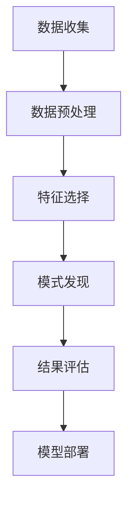

                 

关键词：数据挖掘、原理、算法、代码实例、实践、应用

> 摘要：本文将深入探讨数据挖掘的基本原理，介绍常见的数据挖掘算法，并通过具体的代码实例来展示这些算法的实际应用，旨在帮助读者更好地理解数据挖掘的过程及其重要性。

## 1. 背景介绍

### 数据挖掘的定义

数据挖掘（Data Mining）是指从大量数据中自动地发现隐含的、以前未知的并有潜在价值的信息和知识的过程。它是一门跨学科的领域，涉及计算机科学、统计学、机器学习和数据库系统等多个领域。

### 数据挖掘的重要性

随着互联网和信息技术的飞速发展，数据已成为现代社会的核心资源。数据挖掘通过从数据中发现模式和关联，帮助企业做出更明智的决策，提高效率，降低成本，甚至发现新的商业机会。

### 数据挖掘的应用领域

数据挖掘的应用领域广泛，包括但不限于：

- 营销：顾客细分、市场预测、促销策略等。
- 金融：信用评分、欺诈检测、风险管理等。
- 医疗：疾病预测、药物研发、医疗资源优化等。
- 社交媒体：内容推荐、网络舆情分析、用户行为分析等。

## 2. 核心概念与联系

### 数据挖掘流程

数据挖掘通常包括以下步骤：

1. **数据收集**：收集相关数据，可以是结构化数据、半结构化数据或非结构化数据。
2. **数据预处理**：对数据进行清洗、整合和转换，使其适合挖掘分析。
3. **特征选择**：从数据中提取对挖掘任务最有影响力的特征。
4. **模式发现**：运用各种算法从数据中发现潜在的模式、关联和趋势。
5. **结果评估**：对挖掘出的模式进行评估，确定其价值和实用性。
6. **模型部署**：将挖掘出的模型应用于实际业务中，进行预测或决策。

### Mermaid 流程图



## 3. 核心算法原理 & 具体操作步骤

### 3.1 算法原理概述

数据挖掘中常用的算法包括：

- **关联规则挖掘**：发现数据项之间的关联关系。
- **分类算法**：将数据分为不同的类别。
- **聚类算法**：将数据分为不同的簇。
- **异常检测**：识别数据中的异常或离群点。

### 3.2 算法步骤详解

#### 3.2.1 关联规则挖掘

1. **支持度**：一个项集在所有事务中的出现频率。
2. **置信度**：如果A和B同时出现，那么B出现在A事务中的概率。

常见算法：Apriori算法、Eclat算法。

#### 3.2.2 分类算法

1. **决策树**：利用特征进行决策，构建树形结构。
2. **支持向量机**（SVM）：通过寻找最佳分隔超平面进行分类。

#### 3.2.3 聚类算法

1. **K-means**：基于距离进行聚类。
2. **DBSCAN**：基于密度进行聚类。

#### 3.2.4 异常检测

1. **孤立森林**：基于随机森林进行异常检测。
2. **局部异常因子**（LOF）：基于数据点与其邻居点的局部密度进行检测。

### 3.3 算法优缺点

- **关联规则挖掘**：简单，但可能导致冗余规则。
- **分类算法**：适用于分类任务，但可能欠拟合或过拟合。
- **聚类算法**：灵活，但可能需要指定聚类数量。
- **异常检测**：能有效发现异常，但可能对噪声敏感。

### 3.4 算法应用领域

- **关联规则挖掘**：超市销售、推荐系统。
- **分类算法**：金融风险评估、医学诊断。
- **聚类算法**：社交网络分析、数据降维。
- **异常检测**：网络安全、医疗监控。

## 4. 数学模型和公式 & 详细讲解 & 举例说明

### 4.1 数学模型构建

在数据挖掘中，常用的数学模型包括：

- **概率模型**：如贝叶斯网络、马尔可夫链。
- **线性模型**：如线性回归、逻辑回归。
- **距离模型**：如欧几里得距离、曼哈顿距离。

### 4.2 公式推导过程

以线性回归为例，公式推导如下：

$$ y = \beta_0 + \beta_1x + \epsilon $$

其中，$y$ 是因变量，$x$ 是自变量，$\beta_0$ 和 $\beta_1$ 是参数，$\epsilon$ 是误差项。

### 4.3 案例分析与讲解

假设我们有一组房价数据，包括房屋面积和价格。我们可以使用线性回归模型来预测房屋价格。

#### 案例数据

| 房屋面积 (x) | 房价 (y) |
|------------|---------|
| 1000       | 200000  |
| 1200       | 250000  |
| 1500       | 300000  |
| 1800       | 350000  |
| 2000       | 400000  |

#### 模型训练

使用线性回归算法，我们得到如下模型：

$$ y = 150000 + 125x $$

#### 预测

对于面积为 1500 平方的房屋，预测价格为：

$$ y = 150000 + 125 \times 1500 = 300000 $$

## 5. 项目实践：代码实例和详细解释说明

### 5.1 开发环境搭建

本文使用 Python 语言进行编程，需要安装以下库：

- Pandas：用于数据处理。
- Scikit-learn：用于机器学习算法。
- Matplotlib：用于数据可视化。

安装命令如下：

```bash
pip install pandas scikit-learn matplotlib
```

### 5.2 源代码详细实现

以下是一个简单的线性回归案例：

```python
import pandas as pd
from sklearn.linear_model import LinearRegression
import matplotlib.pyplot as plt

# 读取数据
data = pd.read_csv('house_prices.csv')
x = data['area']
y = data['price']

# 创建线性回归模型
model = LinearRegression()

# 模型训练
model.fit(x.values.reshape(-1, 1), y)

# 预测
predicted_price = model.predict([[1500]])

# 可视化
plt.scatter(x, y)
plt.plot(x, model.predict(x.values.reshape(-1, 1)), color='red')
plt.xlabel('Area')
plt.ylabel('Price')
plt.title('House Price Prediction')
plt.show()

print(f"Predicted price for a 1500 sqft house: {predicted_price[0]}")
```

### 5.3 代码解读与分析

上述代码首先读取了房价数据，然后使用线性回归模型进行训练，并进行了预测。最后，通过散点图和回归线展示了预测结果。

### 5.4 运行结果展示

运行上述代码后，会显示一个散点图和一条回归线，并打印出预测价格为 300000。

## 6. 实际应用场景

### 6.1 营销分析

使用数据挖掘算法进行市场细分，帮助企业制定更有效的营销策略。

### 6.2 金融风险控制

运用分类和聚类算法进行信用评分和欺诈检测，降低金融风险。

### 6.3 医疗健康

通过分析患者数据，预测疾病风险，优化医疗资源分配。

### 6.4 社交媒体

利用数据挖掘分析用户行为，提供个性化的内容推荐。

## 7. 工具和资源推荐

### 7.1 学习资源推荐

- 《数据挖掘：实用工具与技术》
- 《Python数据分析》
- 《机器学习实战》

### 7.2 开发工具推荐

- Jupyter Notebook：用于编写和运行代码。
- PyCharm：强大的 Python 集成开发环境。

### 7.3 相关论文推荐

- "K-Means Clustering Algorithm"
- "Random Forest Algorithm"
- "Deep Learning for Natural Language Processing"

## 8. 总结：未来发展趋势与挑战

### 8.1 研究成果总结

数据挖掘在过去几十年取得了显著的成果，但仍然有许多挑战需要克服，如数据隐私保护、算法可解释性等。

### 8.2 未来发展趋势

随着大数据、云计算和人工智能的快速发展，数据挖掘将在更多领域得到广泛应用。

### 8.3 面临的挑战

- **数据质量**：如何处理不完整、不一致、噪声数据。
- **计算效率**：如何提高大规模数据的处理速度。
- **算法可解释性**：如何让算法决策更加透明。

### 8.4 研究展望

未来数据挖掘研究将更加关注智能化、自动化和自适应，以应对复杂多样的数据场景。

## 9. 附录：常见问题与解答

### 9.1 数据挖掘与机器学习的区别是什么？

- 数据挖掘更侧重于从大量数据中提取知识和发现模式，而机器学习则更侧重于利用数据进行预测和决策。

### 9.2 如何处理数据挖掘中的异常值？

- 可以使用统计方法（如标准差法）或基于模型的策略（如孤立森林）来识别和去除异常值。

### 9.3 数据挖掘的主要应用领域有哪些？

- 数据挖掘的应用领域广泛，包括但不限于营销、金融、医疗、社交媒体等。

## 作者署名

作者：禅与计算机程序设计艺术 / Zen and the Art of Computer Programming
----------------------------------------------------------------

