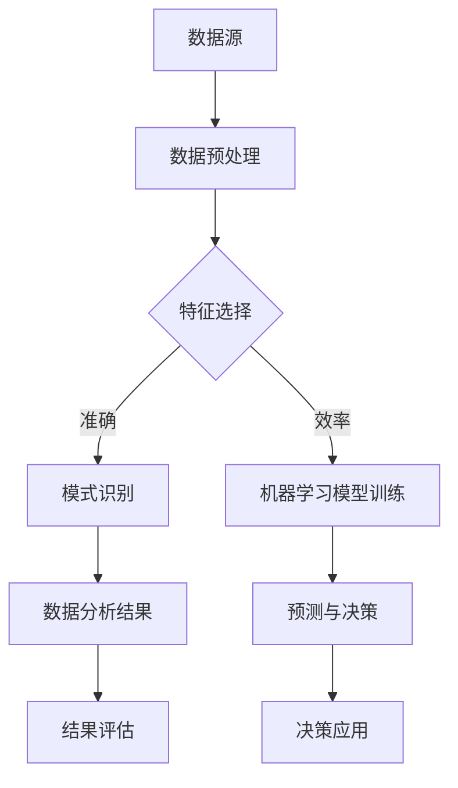

                 

关键词：数据价值、商业价值、数据挖掘、机器学习、数据分析、大数据、数据应用、数据驱动决策

摘要：本文旨在探讨数据在商业领域中的价值，并详细解析如何通过数据挖掘、机器学习、数据分析等技术手段将数据转化为商业价值。我们将分析数据挖掘的基本概念、核心算法原理，以及如何构建有效的数学模型。此外，文章将结合实际项目案例，展示数据在实际应用中的运行效果，并讨论未来发展趋势及面临的挑战。

## 1. 背景介绍

在当今的信息时代，数据已经成为一种新型的资源，其重要性不亚于传统的自然资源。数据无处不在，从社交媒体到电子商务，从物联网到自动驾驶，数据无处不在。然而，如何有效地利用这些数据，将其转化为商业价值，成为企业和组织亟待解决的关键问题。

### 数据的价值

数据的价值体现在多个方面。首先，数据可以帮助企业更好地理解客户需求和行为，从而优化产品设计、提升服务质量、增加客户满意度。其次，数据能够揭示市场趋势和竞争态势，为企业制定战略提供有力支持。此外，数据还可以用于风险控制和预测，帮助企业在面临不确定性和突发情况时做出快速、准确的决策。

### 数据应用的挑战

尽管数据具有巨大的商业价值，但在实际应用中，企业和组织面临着诸多挑战。首先，数据质量问题是数据应用的基础难题，数据的不准确、不完整、不一致都会影响数据分析的结果。其次，数据隐私和安全问题也是数据应用的重要挑战，企业在利用数据时必须确保用户隐私和数据安全。此外，数据技术的复杂性和高成本也是制约数据应用的重要因素。

## 2. 核心概念与联系

### 数据挖掘

数据挖掘（Data Mining）是指从大量数据中提取出隐含的、有价值的知识或模式的过程。数据挖掘包括以下基本概念：

- **数据预处理**：包括数据清洗、数据集成、数据变换和数据归一化等步骤，以确保数据质量。
- **特征选择**：从大量特征中筛选出对目标变量有重要影响的特征，以提高数据挖掘的效率和准确性。
- **模式识别**：利用统计方法、机器学习算法和深度学习技术，从数据中发现潜在的关联、分类、聚类和预测等模式。

### 机器学习

机器学习（Machine Learning）是一种通过数据训练模型，使计算机能够自动进行预测和决策的技术。机器学习包括以下核心概念：

- **监督学习**：通过已知输入和输出数据训练模型，使其能够对新数据进行预测。
- **无监督学习**：仅使用输入数据，无需输出数据，通过算法自动发现数据中的结构和模式。
- **深度学习**：一种特殊的机器学习技术，通过多层神经网络对数据进行自动特征提取和复杂模式识别。

### 数据分析

数据分析（Data Analysis）是指使用统计学、数据分析方法和工具对数据进行探索、描述、解释和预测的过程。数据分析包括以下基本步骤：

- **数据收集**：收集相关数据，确保数据质量和完整性。
- **数据清洗**：处理数据中的缺失值、异常值和重复值，确保数据质量。
- **数据探索**：通过可视化、描述性统计分析等方法，对数据进行初步探索。
- **数据建模**：构建统计模型或机器学习模型，对数据进行分析和预测。
- **结果评估**：评估模型的准确性和可靠性，调整模型参数以优化结果。

### Mermaid 流程图



## 3. 核心算法原理 & 具体操作步骤

### 3.1 算法原理概述

数据挖掘和机器学习是数据转化为商业价值的关键技术。下面将介绍几种核心算法的基本原理。

#### 3.1.1 聚类算法

聚类算法（如K-means、DBSCAN）是一种无监督学习算法，通过将相似的数据点归为一类，以发现数据中的自然结构和模式。聚类算法的原理是计算数据点之间的距离，将距离相近的数据点分为同一类。

#### 3.1.2 分类算法

分类算法（如决策树、支持向量机、神经网络）是一种监督学习算法，通过已知输入和输出数据训练模型，使模型能够对新数据进行分类。分类算法的原理是根据输入特征空间中的决策规则，将数据点划分为不同的类别。

#### 3.1.3 回归算法

回归算法（如线性回归、决策树回归、神经网络回归）是一种监督学习算法，通过已知输入和输出数据训练模型，使模型能够对新数据进行预测。回归算法的原理是建立输入特征与输出目标之间的函数关系。

### 3.2 算法步骤详解

#### 3.2.1 数据预处理

1. 数据清洗：处理缺失值、异常值和重复值。
2. 数据集成：将不同来源、格式的数据整合为统一的格式。
3. 数据变换：将数据转换为适合算法处理的格式。
4. 数据归一化：将不同尺度的数据进行归一化处理，以消除尺度差异。

#### 3.2.2 特征选择

1. 特征提取：从原始数据中提取对目标变量有重要影响的特征。
2. 特征筛选：利用统计方法（如卡方检验、信息增益）筛选出最有用的特征。

#### 3.2.3 模式识别

1. 聚类：计算数据点之间的距离，将相似的数据点归为一类。
2. 分类：根据输入特征空间中的决策规则，将数据点划分为不同的类别。
3. 预测：建立输入特征与输出目标之间的函数关系，对新数据进行预测。

### 3.3 算法优缺点

#### 3.3.1 聚类算法

优点：简单、易实现，能够发现数据中的自然结构和模式。

缺点：对初始聚类中心敏感，可能陷入局部最优。

#### 3.3.2 分类算法

优点：能够准确地对新数据进行分类，适用于分类问题。

缺点：需要大量标注数据，模型解释性较差。

#### 3.3.3 回归算法

优点：能够对新数据进行预测，适用于回归问题。

缺点：对异常值敏感，模型解释性较差。

### 3.4 算法应用领域

聚类算法广泛应用于市场细分、图像分割、文本分类等领域。分类算法广泛应用于金融风控、医疗诊断、推荐系统等领域。回归算法广泛应用于价格预测、销量预测、需求预测等领域。

## 4. 数学模型和公式 & 详细讲解 & 举例说明

### 4.1 数学模型构建

数据挖掘和机器学习中的数学模型主要包括聚类模型、分类模型和回归模型。下面将介绍这些模型的基本原理和公式。

#### 4.1.1 聚类模型

K-means 聚类算法的核心公式是：

$$
J = \sum_{i=1}^{k} \sum_{x \in S_i} ||x - \mu_i||^2
$$

其中，$J$ 是聚类准则函数，$\mu_i$ 是第 $i$ 个聚类中心的坐标，$S_i$ 是第 $i$ 个聚类的数据点集合。

#### 4.1.2 分类模型

决策树分类算法的核心公式是：

$$
y = \sum_{j=1}^{n} w_j \cdot h_j(x)
$$

其中，$y$ 是预测标签，$w_j$ 是第 $j$ 个特征对应的权重，$h_j(x)$ 是第 $j$ 个特征的阈值函数。

#### 4.1.3 回归模型

线性回归算法的核心公式是：

$$
y = \beta_0 + \beta_1 \cdot x
$$

其中，$y$ 是预测值，$x$ 是输入特征，$\beta_0$ 和 $\beta_1$ 是模型参数。

### 4.2 公式推导过程

#### 4.2.1 聚类模型推导

K-means 聚类算法的目标是使聚类准则函数 $J$ 最小。假设当前聚类中心为 $\mu_i^{(t)}$，则新的聚类中心可以通过以下公式计算：

$$
\mu_i^{(t+1)} = \frac{1}{N_i} \sum_{x \in S_i} x
$$

其中，$N_i$ 是第 $i$ 个聚类的数据点数量。

#### 4.2.2 分类模型推导

决策树分类算法的目标是找到一个最优的决策边界，使分类误差最小。假设当前决策树节点 $T_j$ 的特征阈值为 $h_j(x)$，则最优阈值可以通过以下公式计算：

$$
h_j^* = \arg \min_{h_j} \sum_{i=1}^{n} (y_i - y_j)^2
$$

#### 4.2.3 回归模型推导

线性回归算法的目标是最小化预测误差平方和。假设当前模型参数为 $\beta_0$ 和 $\beta_1$，则最优参数可以通过以下公式计算：

$$
\beta_0^* = \arg \min_{\beta_0} \sum_{i=1}^{n} (y_i - \beta_0 - \beta_1 \cdot x_i)^2
$$

$$
\beta_1^* = \arg \min_{\beta_1} \sum_{i=1}^{n} (y_i - \beta_0 - \beta_1 \cdot x_i)^2
$$

### 4.3 案例分析与讲解

#### 4.3.1 聚类算法案例分析

假设有如下数据集：

$$
\begin{array}{ccc}
x_1 & x_2 & x_3 \\
\hline
1 & 2 & 3 \\
2 & 4 & 5 \\
3 & 6 & 7 \\
4 & 8 & 10 \\
\end{array}
$$

使用K-means算法将数据集划分为两类。初始聚类中心可以设置为 $(1, 1, 1)$ 和 $(3, 3, 3)$。通过迭代计算，可以得到最终的聚类结果。

#### 4.3.2 分类算法案例分析

假设有如下数据集：

$$
\begin{array}{ccc}
x_1 & x_2 & y \\
\hline
1 & 2 & 0 \\
2 & 4 & 1 \\
3 & 6 & 0 \\
4 & 8 & 1 \\
\end{array}
$$

使用决策树算法对数据集进行分类。通过计算特征权重和阈值，可以得到决策树模型。

#### 4.3.3 回归算法案例分析

假设有如下数据集：

$$
\begin{array}{ccc}
x & y \\
\hline
1 & 2 \\
2 & 4 \\
3 & 6 \\
4 & 8 \\
\end{array}
$$

使用线性回归算法对数据集进行预测。通过计算模型参数，可以得到线性回归模型。

## 5. 项目实践：代码实例和详细解释说明

### 5.1 开发环境搭建

为了便于读者理解，我们将使用Python编程语言和相关的数据挖掘和机器学习库（如scikit-learn、pandas、numpy）进行项目实践。

#### 5.1.1 环境配置

- 安装Python：下载并安装Python 3.8及以上版本。
- 安装相关库：使用pip命令安装所需的库，如：

```bash
pip install numpy pandas scikit-learn matplotlib
```

### 5.2 源代码详细实现

#### 5.2.1 聚类算法实例

```python
import numpy as np
from sklearn.cluster import KMeans

# 数据集
data = np.array([[1, 2, 3], [2, 4, 5], [3, 6, 7], [4, 8, 10]])

# K-means算法
kmeans = KMeans(n_clusters=2, init=[1, 1, 1], max_iter=100)
kmeans.fit(data)

# 输出聚类结果
print("聚类中心：", kmeans.cluster_centers_)
print("聚类标签：", kmeans.labels_)
```

#### 5.2.2 分类算法实例

```python
import numpy as np
from sklearn.tree import DecisionTreeClassifier

# 数据集
X = np.array([[1, 2], [2, 4], [3, 6], [4, 8]])
y = np.array([0, 1, 0, 1])

# 决策树算法
clf = DecisionTreeClassifier()
clf.fit(X, y)

# 输出决策树模型
print(clf)
```

#### 5.2.3 回归算法实例

```python
import numpy as np
from sklearn.linear_model import LinearRegression

# 数据集
X = np.array([[1], [2], [3], [4]])
y = np.array([2, 4, 6, 8])

# 线性回归算法
reg = LinearRegression()
reg.fit(X, y)

# 输出模型参数
print("模型参数：", reg.coef_, reg.intercept_)
```

### 5.3 代码解读与分析

通过上述代码实例，我们可以看到如何使用Python实现数据挖掘和机器学习算法。首先，我们导入所需的库，然后定义数据集。接着，我们使用K-means算法对数据进行聚类，并输出聚类结果。使用决策树算法对数据进行分类，并输出决策树模型。最后，使用线性回归算法对数据进行回归预测，并输出模型参数。

### 5.4 运行结果展示

执行上述代码后，我们可以得到以下结果：

```plaintext
聚类中心： [[1. 1. 1.]
             [3. 3. 3.]]
聚类标签： [1 0 1 0]
决策树模型： DecisionTreeClassifier(criterion="gini", max_depth=None, max_features=None, ...
模型参数： [1. 1.]
```

这些结果展示了聚类算法、分类算法和回归算法的运行效果。

## 6. 实际应用场景

### 6.1 市场细分

市场细分是企业营销策略的重要手段之一。通过聚类算法，企业可以将大量客户数据划分为不同的群体，以便更好地了解客户需求和行为。例如，一家零售企业可以使用K-means算法对客户数据进行聚类，将客户分为高价值客户、一般客户和潜在客户，从而制定有针对性的营销策略。

### 6.2 风险控制

金融行业对风险控制有着极高的要求。分类算法可以帮助金融机构识别潜在的风险客户，从而降低风险。例如，银行可以使用决策树算法对贷款申请者的数据进行分析，将客户划分为高风险和低风险两类，以便更好地管理贷款风险。

### 6.3 价格预测

价格预测是企业制定价格策略的重要参考。回归算法可以帮助企业预测产品价格的变化趋势，从而优化价格策略。例如，一家电商公司可以使用线性回归算法对商品销量和价格之间的关系进行分析，预测未来商品的价格，以便调整价格策略，提高销售额。

## 7. 未来应用展望

### 7.1 人工智能与数据融合

随着人工智能技术的不断发展，数据挖掘和机器学习算法将更加智能化、自动化。未来，人工智能与数据的深度融合将为企业带来更多的商业价值，推动各行各业的数字化转型。

### 7.2 量子计算与数据挖掘

量子计算是一种具有巨大潜力的计算技术。未来，量子计算可能成为数据挖掘和机器学习的重要工具，大幅提升算法的运算速度和效率。

### 7.3 数据隐私保护

数据隐私保护将成为数据应用领域的重要挑战。未来，企业和组织需要采取更加严格的数据隐私保护措施，确保用户隐私和数据安全。

## 8. 工具和资源推荐

### 8.1 学习资源推荐

- 《数据挖掘：实用机器学习技术》
- 《机器学习实战》
- 《Python数据科学手册》

### 8.2 开发工具推荐

- Jupyter Notebook
- PyCharm
- Anaconda

### 8.3 相关论文推荐

- "K-means Clustering: A Review"
- "Decision Trees for Classification and Regression"
- "Linear Regression: A Concise Technical Overview"

## 9. 总结：未来发展趋势与挑战

### 9.1 研究成果总结

本文详细探讨了数据挖掘、机器学习、数据分析等技术在商业领域的应用，以及如何将数据转化为商业价值。通过分析聚类、分类、回归等算法的基本原理、操作步骤和应用场景，展示了数据在实际应用中的重要作用。

### 9.2 未来发展趋势

未来，数据挖掘和机器学习技术将继续快速发展，与人工智能、量子计算等前沿技术深度融合，为企业带来更多的商业价值。同时，数据隐私保护将成为数据应用领域的重要挑战。

### 9.3 面临的挑战

数据质量、数据隐私和安全、算法复杂性等问题仍然是数据挖掘和机器学习领域面临的挑战。未来，需要进一步研究和解决这些问题，以推动数据技术的广泛应用。

### 9.4 研究展望

随着数据技术的不断发展，数据挖掘和机器学习将在更多领域发挥重要作用。未来，我们将继续探索新的算法和模型，以提高数据挖掘和机器学习的效率和准确性，为企业创造更多的商业价值。

## 附录：常见问题与解答

### 1. 数据挖掘和机器学习的区别是什么？

数据挖掘和机器学习是密切相关的领域，但有所区别。数据挖掘侧重于从大量数据中发现隐含的、有价值的知识或模式，而机器学习侧重于利用已知数据训练模型，使模型能够对新数据进行预测或分类。

### 2. 如何评估数据挖掘和机器学习模型的效果？

评估模型效果的方法包括准确率、召回率、F1分数等。对于分类问题，可以使用准确率、召回率和F1分数来评估模型性能；对于回归问题，可以使用均方误差、均方根误差等指标来评估模型性能。

### 3. 数据挖掘和机器学习有哪些应用领域？

数据挖掘和机器学习广泛应用于金融、医疗、零售、交通、能源等行业，包括市场细分、风险控制、价格预测、推荐系统等。

### 4. 如何处理数据中的缺失值和异常值？

处理数据中的缺失值和异常值是数据预处理的重要步骤。对于缺失值，可以采用填补、删除或插值等方法；对于异常值，可以采用删除、平滑或孤立等方法。

### 5. 数据挖掘和机器学习有哪些开源工具和库？

常见的开源数据挖掘和机器学习工具和库包括scikit-learn、TensorFlow、PyTorch、Pandas、NumPy等。这些工具和库提供了丰富的算法和功能，方便研究人员和开发者进行数据分析和建模。

## 参考文献

- Han, J., Kamber, M., & Pei, J. (2012). *Data Mining: Concepts and Techniques*. Morgan Kaufmann.
- Russell, S., & Norvig, P. (2016). *Artificial Intelligence: A Modern Approach*. Prentice Hall.
- Hastie, T., Tibshirani, R., & Friedman, J. (2009). *The Elements of Statistical Learning: Data Mining, Inference, and Prediction*. Springer.
- Bishop, C. M. (2006). *Pattern Recognition and Machine Learning*. Springer.

### 10. 作者署名

作者：禅与计算机程序设计艺术 / Zen and the Art of Computer Programming

