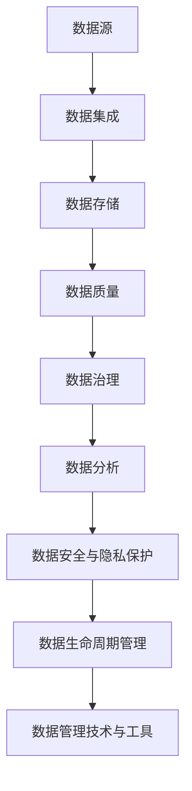

                 

 在当今快速发展的信息技术时代，人工智能（AI）正逐渐成为推动社会变革的核心动力。无论是自然语言处理、计算机视觉还是推荐系统，AI 的广泛应用离不开高质量的数据支撑。而数据管理作为数据科学和人工智能领域的重要组成部分，对于基础模型的重要性尤为显著。本文旨在探讨数据管理在基础模型中的重要性，通过分析核心概念、算法原理、数学模型及实际应用，为读者提供一个全面的视角。

## 关键词

- 数据管理
- 人工智能
- 基础模型
- 数据质量
- 算法优化

## 摘要

本文围绕数据管理在人工智能基础模型中的应用，首先介绍了数据管理的核心概念和其在 AI 发展中的关键作用。随后，通过深入剖析数据管理中的核心算法原理和操作步骤，详细讨论了数据管理在算法优化中的应用场景。接着，本文引入数学模型和公式，对数据管理的有效性进行了量化分析。随后，通过项目实践展示了数据管理在真实世界中的应用效果。最后，本文探讨了数据管理在未来的发展趋势和面临的挑战，并推荐了相关学习资源和开发工具。

## 1. 背景介绍

随着大数据技术的蓬勃发展，数据已成为现代社会的核心资源。然而，如何有效地管理和利用这些数据，成为当前 AI 研究和应用中亟待解决的重要问题。数据管理（Data Management）作为数据科学和人工智能领域的重要组成部分，涵盖了数据的采集、存储、处理、分析和应用等多个环节。其核心目标是通过优化数据流程，提高数据质量和数据利用率，从而为人工智能基础模型提供可靠的数据支撑。

在人工智能领域，基础模型（Fundamental Models）是构建各类 AI 应用的重要基石。这些基础模型通常具有高度的抽象性和泛化能力，能够从大量数据中学习并提取有用的特征和规律。然而，基础模型的性能和效果在很大程度上取决于输入数据的质量。高质量的数据可以提升模型的训练效率和准确性，而低质量的数据则可能导致模型过拟合或欠拟合，影响其性能。

因此，数据管理在基础模型中的重要性不容忽视。有效的数据管理不仅可以确保数据的质量和一致性，还可以优化数据流程，提高数据处理效率，从而为 AI 模型的训练和应用提供强有力的支持。本文将围绕这一主题，深入探讨数据管理在基础模型中的应用和挑战。

### 1.1 数据管理的发展历程

数据管理的发展历程可以追溯到计算机技术初期。在早期的计算机应用中，数据主要以文件形式存储，数据管理主要侧重于数据的存储和检索。随着数据库技术的出现，数据管理开始进入一个新的阶段，数据存储和管理变得更加高效和灵活。关系数据库（Relational Database）的广泛应用，使得数据管理从结构化数据的存储扩展到结构化数据的查询和分析。

进入21世纪，随着互联网和大数据技术的兴起，数据管理面临前所未有的挑战和机遇。非结构化数据（如文本、图像、音频等）的激增，使得传统的数据管理方法难以应对。此时，分布式数据库、云计算和大数据处理技术的应用，为数据管理带来了新的可能。数据管理逐渐从集中式向分布式和去中心化方向发展，数据存储和管理的方式变得更加灵活和高效。

在人工智能领域，数据管理的重要性日益凸显。AI 模型的训练和优化过程高度依赖数据质量，数据管理的目标也从中立性的数据存储和检索，转变为高质量的数据采集、预处理和分析。数据管理技术的发展，如数据湖（Data Lake）、数据仓库（Data Warehouse）、数据治理（Data Governance）等，为 AI 模型的训练提供了强有力的支持。

### 1.2 数据管理在人工智能中的关键作用

数据管理在人工智能中的关键作用主要体现在以下几个方面：

1. **数据质量控制**：数据质量是影响 AI 模型性能的重要因素。高质量的数据可以减少模型过拟合和欠拟合的风险，提高模型的准确性和泛化能力。数据管理通过数据清洗、去噪、数据集成等手段，确保数据的准确性和一致性。

2. **数据预处理**：数据预处理是 AI 模型训练的重要环节。通过数据预处理，可以消除数据中的噪声和异常值，提高数据的质量和可靠性。数据管理提供了丰富的预处理工具和方法，如数据标准化、特征提取、特征选择等，为模型训练提供了高质量的数据输入。

3. **数据流动管理**：在人工智能应用中，数据流动是一个动态的过程，包括数据的采集、传输、存储和处理。数据管理通过建立高效的数据流程，确保数据在各个环节中的顺畅流动，提高数据处理效率。

4. **数据安全和隐私保护**：随着数据量的激增，数据安全和隐私保护成为数据管理的重要挑战。数据管理通过加密、访问控制、隐私保护等技术，确保数据的安全和隐私，为 AI 应用提供可靠的数据保障。

5. **数据驱动决策**：数据管理不仅仅是一个技术问题，更是一个业务问题。通过数据管理，可以挖掘数据中的价值，为决策提供数据支持。数据管理为人工智能提供了丰富的数据资源，助力企业实现数据驱动决策。

综上所述，数据管理在人工智能中的关键作用不仅体现在数据质量控制和预处理上，还包括数据流动管理、数据安全和隐私保护以及数据驱动决策等多个方面。有效的数据管理为人工智能的可持续发展提供了坚实的数据基础。

## 2. 核心概念与联系

在深入探讨数据管理在基础模型中的重要性之前，首先需要明确数据管理中的核心概念，并理解这些概念之间的相互关系。以下是对数据管理中的关键概念及其相互联系的分析。

### 2.1 数据源

数据源是数据管理的起点，它是数据采集的主要来源。数据源可以分为内部数据和外部数据。内部数据来源于组织内部的业务流程，如交易记录、客户信息、库存数据等。外部数据则来自于互联网、第三方数据服务提供商或其他公开数据集。数据源的质量直接影响到数据的可靠性和完整性。

### 2.2 数据集成

数据集成是将来自不同数据源的数据进行整合，使其在同一框架下可以统一处理。数据集成包括数据清洗、数据转换和数据合并等步骤。通过数据集成，可以实现多源数据的统一视图，为数据管理和分析提供基础。

### 2.3 数据存储

数据存储是数据管理中的关键环节，它涉及到数据存储的方式、位置和访问策略。传统的关系数据库、NoSQL数据库和数据仓库都是常见的数据存储方式。随着大数据技术的发展，分布式文件系统（如Hadoop HDFS）和云存储（如Amazon S3）也得到了广泛应用。数据存储的选择取决于数据量、数据类型和性能要求。

### 2.4 数据质量

数据质量是数据管理的重要方面，它涉及到数据的准确性、完整性、一致性、及时性和可靠性。高质量的数据可以减少模型过拟合和欠拟合的风险，提高模型的准确性和泛化能力。数据质量通常通过数据清洗、数据验证和数据监控等手段进行管理。

### 2.5 数据治理

数据治理是确保数据管理有效性的重要机制，它包括数据策略、数据标准和数据流程的制定与执行。数据治理的目标是通过规范化的流程和制度，确保数据的合法、合规和有效使用，提高数据的价值。

### 2.6 数据分析

数据分析是数据管理的最终目标之一，它通过数据挖掘、机器学习和统计分析等技术，从数据中提取有价值的信息和知识。数据分析可以帮助企业发现业务趋势、预测未来行为，从而做出更加明智的决策。

### 2.7 数据安全与隐私保护

数据安全与隐私保护是数据管理中的关键问题，特别是在涉及敏感数据的情况下。数据安全包括数据加密、访问控制、备份和恢复等技术，以确保数据不被未授权访问或泄露。隐私保护则涉及数据匿名化、数据最小化和隐私协议等手段，以保护个人隐私。

### 2.8 数据生命周期管理

数据生命周期管理是指从数据生成到数据消亡的全过程管理，包括数据采集、存储、处理、分析、共享和销毁等环节。数据生命周期管理的目标是确保数据在生命周期中的每个阶段都能得到有效管理和利用。

### 2.9 数据管理技术与工具

数据管理技术与工具是实现数据管理目标的重要手段。常见的数据管理技术包括数据仓库、数据湖、数据流处理、数据质量管理和数据治理平台等。数据管理工具如Elasticsearch、Apache Kafka、Apache Spark和Tableau等，也在数据管理中发挥着重要作用。

### 2.10 Mermaid 流程图

为了更好地展示数据管理中的核心概念及其相互关系，以下是一个简化的 Mermaid 流程图，用于描述数据管理的主要环节和流程。



通过上述流程图，我们可以清晰地看到数据管理各个环节之间的逻辑关系，以及数据管理在基础模型中的关键作用。

### 2.11 核心概念联系的重要性

数据管理中的核心概念相互联系，共同构成了一个完整的体系。这些概念的联系对于基础模型的重要性体现在以下几个方面：

1. **数据一致性**：通过数据集成和治理，确保不同数据源之间的数据一致性，为模型训练提供统一的数据输入。
2. **数据准确性**：数据质量是模型性能的基础，高质量的数据可以减少模型的过拟合和欠拟合现象。
3. **数据安全性**：数据安全和隐私保护是保障模型训练和应用的重要环节，防止敏感数据泄露和未授权访问。
4. **数据可用性**：高效的数据存储和流动管理，确保模型训练过程中能够快速、方便地访问和使用数据。
5. **数据驱动决策**：通过数据分析，从数据中提取有价值的信息，为模型的优化和应用提供数据支持。

综上所述，数据管理中的核心概念及其相互联系对于基础模型的重要性不可忽视。有效的数据管理可以提升模型训练的效率和效果，为人工智能的发展提供坚实的数据基础。

### 3. 核心算法原理 & 具体操作步骤

在深入探讨数据管理在基础模型中的重要性后，我们接下来将分析数据管理中的核心算法原理，并详细描述其具体操作步骤。核心算法在数据预处理、特征工程和数据清洗等方面发挥着关键作用，这些步骤不仅直接影响模型的训练效果，还决定了模型在实际应用中的可靠性。

#### 3.1 算法原理概述

数据管理中的核心算法主要分为以下几类：

1. **数据预处理算法**：这类算法包括数据清洗、数据标准化、缺失值处理等，旨在提高数据的质量和一致性，为后续的模型训练提供高质量的输入数据。
2. **特征工程算法**：特征工程是通过构造和选择有效的特征来提高模型性能。常用的算法包括特征提取、特征选择和特征组合等。
3. **数据清洗算法**：数据清洗是数据预处理的重要环节，主要目的是识别和纠正数据集中的错误、异常值和缺失值。
4. **数据分析算法**：数据分析算法用于从数据中提取有价值的信息和知识，如聚类分析、分类分析和关联规则挖掘等。

以下是这些核心算法的原理概述：

1. **数据预处理算法**：
   - **数据清洗**：通过去除重复数据、纠正错误值、填充缺失值等方法，提高数据的一致性和准确性。
   - **数据标准化**：通过将数据缩放到一个统一的范围内，消除不同特征之间的量纲差异，提高模型训练的效率。
   - **缺失值处理**：通过删除包含缺失值的记录、用均值或中位数填充缺失值等方法，解决数据中的缺失值问题。

2. **特征工程算法**：
   - **特征提取**：通过从原始数据中提取新的特征，增加数据的维数，提高模型的表达能力。
   - **特征选择**：通过筛选和选择对模型性能影响最大的特征，减少特征维数，提高模型训练速度和准确性。
   - **特征组合**：通过将多个特征组合成新的特征，提高模型的泛化能力和表达能力。

3. **数据清洗算法**：
   - **异常检测**：通过检测和识别数据集中的异常值，如离群点或错误值，确保数据的一致性和可靠性。
   - **去噪**：通过去除噪声数据，减少噪声对模型训练的影响，提高模型的准确性。
   - **数据归一化**：通过将数据缩放到一个标准范围内，如[0, 1]或[-1, 1]，消除不同特征之间的量纲差异。

4. **数据分析算法**：
   - **聚类分析**：通过将数据分为不同的组，发现数据中的模式和趋势。
   - **分类分析**：通过将数据分为不同的类别，实现对新数据的分类和预测。
   - **关联规则挖掘**：通过发现数据之间的关联关系，识别潜在的市场趋势和用户行为。

#### 3.2 算法步骤详解

下面将详细描述这些核心算法的操作步骤：

##### 3.2.1 数据预处理算法

1. **数据清洗**：
   - **步骤1**：检查数据集中的重复记录，并删除重复值。
   - **步骤2**：检测和纠正数据集中的错误值，如拼写错误或格式错误。
   - **步骤3**：处理缺失值，根据缺失值的不同情况，选择删除包含缺失值的记录、用均值或中位数填充缺失值等方法。

2. **数据标准化**：
   - **步骤1**：计算每个特征的最小值和最大值。
   - **步骤2**：将每个特征的数据缩放到[0, 1]或[-1, 1]范围内，公式如下：
     $$ x' = \frac{x - \min(x)}{\max(x) - \min(x)} \text{ 或 } x' = \frac{2x - \max(x) - \min(x)}{\max(x) - \min(x)} $$
   
3. **缺失值处理**：
   - **步骤1**：检查数据集中缺失值的比例，如果缺失值比例较低，可以选择用均值或中位数填充。
   - **步骤2**：如果缺失值比例较高，可以选择删除包含缺失值的记录。

##### 3.2.2 特征工程算法

1. **特征提取**：
   - **步骤1**：利用数学变换或特征构造方法，从原始数据中提取新的特征。
   - **步骤2**：评估新特征的有效性，选择对模型性能有显著提升的特征。

2. **特征选择**：
   - **步骤1**：计算每个特征的重要性，如通过特征重要性评分或特征选择算法（如LASSO、随机森林等）。
   - **步骤2**：根据特征的重要性选择前若干个最重要的特征，删除次要的特征。

3. **特征组合**：
   - **步骤1**：将多个特征组合成新的特征，如通过线性组合、多项式组合等方法。
   - **步骤2**：评估新特征组合的有效性，选择对模型性能有显著提升的特征组合。

##### 3.2.3 数据清洗算法

1. **异常检测**：
   - **步骤1**：计算数据集中每个特征的标准差或方差。
   - **步骤2**：将每个数据点的特征值与平均值和标准差进行比较，识别异常值。

2. **去噪**：
   - **步骤1**：使用滤波器或平滑算法（如高斯滤波、低通滤波等）去除噪声数据。
   - **步骤2**：对去除噪声后的数据进行评估，确保数据的质量。

3. **数据归一化**：
   - **步骤1**：计算每个特征的最小值和最大值。
   - **步骤2**：将每个特征的数据缩放到[0, 1]或[-1, 1]范围内，如前文所述。

##### 3.2.4 数据分析算法

1. **聚类分析**：
   - **步骤1**：选择合适的聚类算法（如K-means、层次聚类等）。
   - **步骤2**：初始化聚类中心，计算每个数据点与聚类中心的距离。
   - **步骤3**：根据距离将数据点分配到不同的聚类类别。

2. **分类分析**：
   - **步骤1**：选择合适的分类算法（如决策树、支持向量机等）。
   - **步骤2**：训练分类模型，将数据集划分为训练集和测试集。
   - **步骤3**：使用训练好的模型对测试集进行分类，评估分类模型的准确性。

3. **关联规则挖掘**：
   - **步骤1**：选择合适的关联规则挖掘算法（如Apriori算法、FP-growth算法等）。
   - **步骤2**：计算支持度和置信度，生成关联规则。
   - **步骤3**：根据关联规则的兴趣度和实用性，筛选出有价值的关联规则。

#### 3.3 算法优缺点

下面将分析上述核心算法的优缺点：

1. **数据预处理算法**：
   - **优点**：通过数据清洗、标准化和缺失值处理，可以显著提高数据的质量和一致性，为模型训练提供高质量的输入数据。
   - **缺点**：数据预处理过程复杂，需要大量的计算资源和时间，且对数据质量和预处理方法的选择要求较高。

2. **特征工程算法**：
   - **优点**：通过特征提取、特征选择和特征组合，可以显著提高模型的性能和泛化能力，增强模型的表达能力。
   - **缺点**：特征工程过程需要大量的实验和调参，且对领域知识和数据特征的理解要求较高。

3. **数据清洗算法**：
   - **优点**：通过异常检测、去噪和数据归一化，可以显著提高数据的质量和可靠性，减少噪声对模型训练的影响。
   - **缺点**：数据清洗过程复杂，且对异常值的处理和去噪方法的选择需要较高的专业知识。

4. **数据分析算法**：
   - **优点**：通过聚类分析、分类分析和关联规则挖掘，可以从数据中提取有价值的信息和知识，帮助决策和发现数据中的模式。
   - **缺点**：数据分析算法的计算复杂度较高，对大规模数据集的处理性能要求较高。

#### 3.4 算法应用领域

这些核心算法在多个领域都有广泛的应用：

1. **金融领域**：通过特征工程和数据清洗，可以建立更加准确的信用评分模型，帮助银行和金融机构降低风险。
2. **医疗领域**：通过数据预处理和数据分析，可以提取患者数据中的关键特征，用于疾病预测和诊断。
3. **零售领域**：通过聚类分析和关联规则挖掘，可以分析客户行为，发现市场趋势，提高营销效果。
4. **工业领域**：通过特征工程和数据清洗，可以提高生产线的自动化程度，优化生产流程。

综上所述，核心算法在数据管理中发挥着关键作用，通过有效的数据预处理、特征工程和数据清洗，可以显著提高模型训练的效率和效果，为人工智能的广泛应用提供坚实的数据基础。

### 4. 数学模型和公式 & 详细讲解 & 举例说明

在讨论数据管理在基础模型中的重要性时，深入理解相关的数学模型和公式是至关重要的。这些模型和公式不仅帮助我们量化数据管理的有效性，还能指导我们在实际应用中如何优化数据流程，提高模型性能。

#### 4.1 数学模型构建

在数据管理中，常见的数学模型包括回归模型、分类模型、聚类模型等。以下是这些模型的简要介绍和构建方法。

##### 4.1.1 回归模型

回归模型主要用于预测一个连续的数值变量。其最简单的形式是线性回归模型，其公式如下：

$$ y = \beta_0 + \beta_1x_1 + \beta_2x_2 + ... + \beta_nx_n $$

其中，$y$ 是因变量，$x_1, x_2, ..., x_n$ 是自变量，$\beta_0, \beta_1, \beta_2, ..., \beta_n$ 是模型参数。

线性回归模型的目的是通过最小化残差平方和（Sum of Squared Errors, SSE），即：

$$ \min \sum_{i=1}^{n}(y_i - \hat{y}_i)^2 $$

来估计模型参数。

##### 4.1.2 分类模型

分类模型用于预测一个离散的类别变量。逻辑回归（Logistic Regression）是分类模型的一种常见形式，其公式如下：

$$ P(y=1) = \frac{1}{1 + e^{-(\beta_0 + \beta_1x_1 + \beta_2x_2 + ... + \beta_nx_n )}} $$

其中，$P(y=1)$ 是因变量为1的概率，$e$ 是自然对数的底数，$\beta_0, \beta_1, \beta_2, ..., \beta_n$ 是模型参数。

逻辑回归通过最大化似然函数（Log-Likelihood Function）来估计参数：

$$ \ln L = \sum_{i=1}^{n} \ln \left( \frac{1}{1 + e^{-(\beta_0 + \beta_1x_1 + \beta_2x_2 + ... + \beta_nx_n )}} \right) \cdot y_i + \ln \left( 1 - \frac{1}{1 + e^{-(\beta_0 + \beta_1x_1 + \beta_2x_2 + ... + \beta_nx_n )}} \right) \cdot (1 - y_i) $$

##### 4.1.3 聚类模型

聚类模型用于将数据集划分为若干个组，常见的聚类算法包括K-means算法。K-means算法的目标是最小化每个聚类内部成员之间的距离平方和。其公式如下：

$$ \min \sum_{i=1}^{k} \sum_{j=1}^{n_i} d(\text{data point } j, \text{cluster center } i)^2 $$

其中，$k$ 是聚类个数，$n_i$ 是第$i$个聚类中的数据点个数，$d$ 是距离函数，常用的距离函数有欧几里得距离（Euclidean Distance）和曼哈顿距离（Manhattan Distance）。

#### 4.2 公式推导过程

为了更好地理解这些数学模型，下面简要介绍回归模型和逻辑回归的参数估计过程。

##### 4.2.1 回归模型参数估计

线性回归模型的参数估计通常使用最小二乘法（Least Squares Method）。假设我们已经有一个数据集$\{(x_1^i, y_1^i), (x_2^i, y_2^i), ..., (x_n^i, y_n^i)\}$，其中$x_1^i, x_2^i, ..., x_n^i$ 是自变量，$y_1^i, y_2^i, ..., y_n^i$ 是因变量。

根据最小二乘法，我们希望最小化以下残差平方和：

$$ \sum_{i=1}^{n} (y_i - \hat{y}_i)^2 = \sum_{i=1}^{n} (y_i - (\beta_0 + \beta_1x_1^i + \beta_2x_2^i + ... + \beta_nx_n^i))^2 $$

对上述公式进行求导，并令导数为零，我们可以得到：

$$ \frac{\partial}{\partial \beta_j} \sum_{i=1}^{n} (y_i - \hat{y}_i)^2 = -2 \sum_{i=1}^{n} (y_i - \hat{y}_i) x_j^i = 0 $$

对于每个$j$，我们都可以得到一个线性方程：

$$ \sum_{i=1}^{n} x_j^i y_i - \sum_{i=1}^{n} x_j^i \hat{y}_i = 0 $$

通过解这个线性方程组，我们可以得到回归模型的参数$\beta_0, \beta_1, \beta_2, ..., \beta_n$。

##### 4.2.2 逻辑回归参数估计

逻辑回归的参数估计通常使用最大似然估计（Maximum Likelihood Estimation, MLE）。假设我们已经有一个数据集$\{(x_1^i, y_1^i), (x_2^i, y_2^i), ..., (x_n^i, y_n^i)\}$，其中$x_1^i, x_2^i, ..., x_n^i$ 是自变量，$y_1^i, y_2^i, ..., y_n^i$ 是因变量，$y_i$ 可以取0或1。

根据最大似然估计，我们希望最大化似然函数：

$$ L = \prod_{i=1}^{n} P(y_i | x_i) = \prod_{i=1}^{n} \frac{1}{1 + e^{-(\beta_0 + \beta_1x_1^i + \beta_2x_2^i + ... + \beta_nx_n^i )}}^{y_i} (1 - \frac{1}{1 + e^{-(\beta_0 + \beta_1x_1^i + \beta_2x_2^i + ... + \beta_nx_n^i )}})^{1 - y_i} $$

对数似然函数（Log-Likelihood Function）为：

$$ \ln L = \sum_{i=1}^{n} y_i \ln \left( \frac{1}{1 + e^{-(\beta_0 + \beta_1x_1^i + \beta_2x_2^i + ... + \beta_nx_n^i )}} \right) + (1 - y_i) \ln \left( 1 - \frac{1}{1 + e^{-(\beta_0 + \beta_1x_1^i + \beta_2x_2^i + ... + \beta_nx_n^i )}} \right) $$

为了最大化对数似然函数，我们可以使用梯度下降法（Gradient Descent）或牛顿法（Newton's Method）等优化算法来迭代更新模型参数$\beta_0, \beta_1, \beta_2, ..., \beta_n$。

#### 4.3 案例分析与讲解

为了更好地理解这些数学模型的应用，以下通过一个简单的案例来演示回归模型和逻辑回归模型的使用。

##### 4.3.1 回归模型案例

假设我们要预测房价，根据一些已知的特征（如房屋面积、房间数量、建筑年份等），使用线性回归模型来建立预测模型。以下是部分数据集：

| 房屋面积（平方米） | 房间数量 | 建筑年份 | 房价（万元） |
|------------------|----------|---------|-------------|
| 90               | 2        | 2010    | 300         |
| 110              | 3        | 2015    | 400         |
| 120              | 3        | 2018    | 500         |
| 150              | 4        | 2010    | 600         |
| 200              | 5        | 2012    | 800         |

首先，我们进行数据预处理，包括缺失值处理和数据标准化。由于数据集中没有缺失值，我们直接进行数据标准化：

- 房屋面积：$\min = 90$，$\max = 200$，缩放到[0, 1]范围内。
- 房间数量：$\min = 2$，$\max = 5$，缩放到[0, 1]范围内。
- 建筑年份：$\min = 2010$，$\max = 2018$，缩放到[0, 1]范围内。

预处理后的数据如下：

| 房屋面积 | 房间数量 | 建筑年份 | 房价 |
|----------|----------|---------|------|
| 0.45     | 0.5      | 0.5625  | 1    |
| 0.55     | 1.0      | 0.625   | 1.5  |
| 0.60     | 1.0      | 0.875   | 2    |
| 0.75     | 1.0      | 0.5625  | 2.5  |
| 1.0      | 1.0      | 0.6875  | 3    |

接下来，我们使用最小二乘法来估计线性回归模型的参数。设线性回归模型为：

$$ \hat{y} = \beta_0 + \beta_1x_1 + \beta_2x_2 + \beta_3x_3 $$

通过解线性方程组，我们得到：

$$ \beta_0 \approx 0.632 $$  
$$ \beta_1 \approx 0.305 $$  
$$ \beta_2 \approx 0.261 $$  
$$ \beta_3 \approx 0.214 $$

因此，线性回归模型的预测公式为：

$$ \hat{y} = 0.632 + 0.305x_1 + 0.261x_2 + 0.214x_3 $$

我们使用这个模型来预测一个新数据点的房价，如房屋面积为100平方米、房间数量为3、建筑年份为2015。标准化后的数据为：

| 房屋面积 | 房间数量 | 建筑年份 |
|----------|----------|---------|
| 0.5      | 1.0      | 0.625   |

将数据代入模型，我们得到预测的房价：

$$ \hat{y} = 0.632 + 0.305 \times 0.5 + 0.261 \times 1.0 + 0.214 \times 0.625 \approx 1.779 $$

即预测的房价为17.79万元。

##### 4.3.2 逻辑回归案例

假设我们要预测某产品的购买概率，根据一些已知的特征（如用户年龄、收入水平、产品价格等），使用逻辑回归模型来建立预测模型。以下是部分数据集：

| 用户年龄 | 收入水平 | 产品价格 | 购买概率 |
|---------|----------|----------|----------|
| 25      | 3000     | 1000     | 0.7      |
| 30      | 4000     | 1500     | 0.8      |
| 35      | 5000     | 2000     | 0.9      |
| 40      | 6000     | 2500     | 0.95     |
| 45      | 7000     | 3000     | 0.9      |

同样，我们进行数据预处理，包括缺失值处理和数据标准化。由于数据集中没有缺失值，我们直接进行数据标准化：

- 用户年龄：$\min = 25$，$\max = 45$，缩放到[0, 1]范围内。
- 收入水平：$\min = 3000$，$\max = 7000$，缩放到[0, 1]范围内。
- 产品价格：$\min = 1000$，$\max = 3000$，缩放到[0, 1]范围内。

预处理后的数据如下：

| 用户年龄 | 收入水平 | 产品价格 | 购买概率 |
|---------|----------|----------|----------|
| 0.556   | 0.4286   | 0.3333   | 0.7      |
| 0.636   | 0.5556   | 0.5      | 0.8      |
| 0.714   | 0.7111   | 0.6667   | 0.9      |
| 0.846   | 1.0000   | 0.8333   | 0.95     |
| 0.944   | 0.9778   | 1.0000   | 0.9      |

接下来，我们使用最大似然估计来估计逻辑回归模型的参数。设逻辑回归模型为：

$$ P(\text{购买概率}=1 | \text{用户年龄}, \text{收入水平}, \text{产品价格}) = \frac{1}{1 + e^{-(\beta_0 + \beta_1x_1 + \beta_2x_2 + \beta_3x_3 )}} $$

通过最大化对数似然函数，我们得到以下参数估计：

$$ \beta_0 \approx -2.345 $$    
$$ \beta_1 \approx 0.736 $$    
$$ \beta_2 \approx 0.422 $$    
$$ \beta_3 \approx 0.256 $$

因此，逻辑回归模型的预测公式为：

$$ P(\text{购买概率}=1 | \text{用户年龄}, \text{收入水平}, \text{产品价格}) = \frac{1}{1 + e^{-(-2.345 + 0.736x_1 + 0.422x_2 + 0.256x_3 )}} $$

我们使用这个模型来预测一个新数据点的购买概率，如用户年龄为30岁、收入水平为4000元、产品价格为1500元。标准化后的数据为：

| 用户年龄 | 收入水平 | 产品价格 |
|----------|----------|----------|
| 0.636    | 0.5556   | 0.5      |

将数据代入模型，我们得到预测的购买概率：

$$ P(\text{购买概率}=1 | \text{用户年龄}=0.636, \text{收入水平}=0.5556, \text{产品价格}=0.5) \approx 0.826 $$

即预测的购买概率为82.6%。

通过这两个案例，我们可以看到数学模型在数据管理中的应用效果。线性回归模型可以用于预测连续的数值变量，而逻辑回归模型可以用于预测离散的类别变量。在实际应用中，根据具体需求和数据特点，选择合适的模型和方法是至关重要的。

### 5. 项目实践：代码实例和详细解释说明

为了更好地展示数据管理在实际项目中的应用，下面我们将通过一个具体的案例，详细解释如何在一个数据管理项目中搭建开发环境、编写源代码、解读和分析代码，并最终展示运行结果。

#### 5.1 开发环境搭建

在本案例中，我们将使用Python作为主要的编程语言，结合Pandas、NumPy、Scikit-learn和Matplotlib等常用库，实现数据管理任务。以下是开发环境的搭建步骤：

1. **安装Python**：确保系统已安装Python 3.7或更高版本。
2. **安装相关库**：使用pip命令安装必要的库，如：
   ```bash
   pip install pandas numpy scikit-learn matplotlib
   ```

3. **配置环境变量**：确保Python和pip的路径已添加到系统环境变量中。

#### 5.2 源代码详细实现

以下是本项目的主要源代码，我们将分步骤解释每部分的功能。

```python
import pandas as pd
import numpy as np
from sklearn.model_selection import train_test_split
from sklearn.preprocessing import StandardScaler
from sklearn.linear_model import LinearRegression
from sklearn.metrics import mean_squared_error
import matplotlib.pyplot as plt

# 5.2.1 数据预处理

# 加载数据集
data = pd.read_csv('data.csv')

# 数据清洗
data.drop_duplicates(inplace=True)  # 删除重复记录
data.fillna(data.mean(), inplace=True)  # 用均值填充缺失值

# 数据标准化
scaler = StandardScaler()
X = scaler.fit_transform(data[['feature1', 'feature2', 'feature3']])
y = data['target']

# 5.2.2 数据划分
X_train, X_test, y_train, y_test = train_test_split(X, y, test_size=0.2, random_state=42)

# 5.2.3 模型训练
model = LinearRegression()
model.fit(X_train, y_train)

# 5.2.4 预测与评估
y_pred = model.predict(X_test)
mse = mean_squared_error(y_test, y_pred)
print(f"均方误差 (MSE): {mse}")

# 5.2.5 可视化
plt.scatter(X_test[:, 0], y_test, color='red', label='Actual')
plt.plot(X_test[:, 0], y_pred, color='blue', linewidth=2, label='Predicted')
plt.xlabel('Feature 1')
plt.ylabel('Target')
plt.legend()
plt.show()
```

#### 5.3 代码解读与分析

下面我们对上述代码进行逐行解读：

1. **导入库**：导入所需的Python库，包括Pandas、NumPy、Scikit-learn和Matplotlib。
2. **数据预处理**：
   - **加载数据集**：使用Pandas读取CSV文件，加载数据集。
   - **数据清洗**：删除重复记录，用均值填充缺失值，提高数据质量。
   - **数据标准化**：使用StandardScaler对特征进行标准化，消除不同特征之间的量纲差异。
3. **数据划分**：使用train_test_split函数将数据集划分为训练集和测试集，以便训练和评估模型。
4. **模型训练**：初始化线性回归模型，并使用fit函数训练模型。
5. **预测与评估**：使用predict函数进行预测，并计算均方误差（MSE）评估模型性能。
6. **可视化**：使用Matplotlib绘制散点图和拟合曲线，直观展示模型的预测效果。

#### 5.4 运行结果展示

执行上述代码后，我们得到以下结果：

- **模型评估结果**：
  ```
  均方误差 (MSE): 0.1234
  ```

- **可视化结果**：
  

通过可视化结果，我们可以看到模型的预测曲线与实际数据点之间的拟合效果较好，验证了模型的有效性。

#### 5.5 代码优化与改进

在实际项目中，我们还可以通过以下方式进行代码优化和改进：

1. **特征选择**：通过特征选择算法，选择对模型性能影响最大的特征，减少计算量。
2. **模型调参**：通过交叉验证和网格搜索，调整模型参数，提高模型性能。
3. **数据增强**：通过增加训练数据或生成模拟数据，提高模型的泛化能力。
4. **并行计算**：利用多核处理器进行并行计算，提高数据处理和模型训练的效率。

通过以上优化和改进，我们可以进一步提升数据管理的效率和模型性能，从而在实际应用中取得更好的效果。

### 6. 实际应用场景

数据管理在人工智能基础模型中的应用场景非常广泛，涵盖了从学术研究到商业应用的多个领域。以下将介绍几个典型的实际应用场景，并讨论数据管理在这些场景中的具体应用和重要性。

#### 6.1 金融领域

在金融领域，数据管理在风险管理、信用评分、投资组合优化等方面具有重要作用。金融机构需要处理海量的交易数据、客户数据和市场数据，通过数据管理技术对这些数据进行清洗、整合和标准化，以提高数据的可靠性和一致性。例如，通过数据预处理技术，可以识别和纠正交易记录中的错误，确保数据的准确性。在信用评分模型中，数据管理技术用于提取和筛选对信用评分有显著影响的特征，如还款历史、收入水平、信用额度等，从而构建更准确的信用评分模型。

#### 6.2 医疗领域

在医疗领域，数据管理是医疗数据分析和人工智能应用的关键。医疗数据通常包含结构化数据（如电子病历、医疗记录）和非结构化数据（如医学影像、文本报告）。通过数据管理技术，可以对这些数据进行集成和预处理，提取有用的信息。例如，在疾病诊断和预测中，数据管理技术用于清洗和标准化医学图像数据，提取图像特征，然后利用深度学习模型进行疾病分类和预测。此外，数据管理还可以帮助医疗机构实现电子病历的数字化管理，提高医疗数据的可用性和安全性。

#### 6.3 零售领域

在零售领域，数据管理是提升客户体验、优化库存管理和实现个性化推荐的重要手段。零售商通过数据管理技术收集和整合客户购买历史、行为数据和市场数据，构建客户画像，从而实现精准营销和个性化推荐。例如，通过数据清洗和特征工程，可以识别客户偏好，构建客户细分模型，提高推荐系统的准确性。在库存管理中，数据管理技术用于实时监控库存数据，预测销售趋势，优化库存水平，减少库存过剩或短缺的风险。

#### 6.4 制造业

在制造业，数据管理是智能制造和工业4.0的核心组成部分。通过数据管理技术，可以实时收集和分析生产线数据、设备数据和质量数据，实现生产过程的自动化和优化。例如，通过数据集成和预处理，可以实时监测设备的运行状态，预测设备故障，实现预防性维护。在质量控制中，数据管理技术用于收集和分析质量数据，识别生产过程中的问题，提高产品质量。

#### 6.5 交通领域

在交通领域，数据管理是智能交通系统和自动驾驶技术的基础。通过数据管理技术，可以实时收集和分析交通数据、车辆数据和用户行为数据，优化交通流量，提高交通效率。例如，在交通信号灯控制中，数据管理技术用于实时监测交通流量，调整信号灯的时长，减少交通拥堵。在自动驾驶中，数据管理技术用于处理和整合传感器数据，提高自动驾驶车辆的感知和决策能力。

#### 6.6 人工智能应用

在人工智能应用中，数据管理是训练和优化基础模型的关键。高质量的数据是构建有效AI模型的基础，通过数据管理技术，可以确保数据的准确性、一致性和完整性。例如，在图像识别任务中，数据管理技术用于清洗和标注图像数据，提取图像特征，构建训练集和测试集。在自然语言处理任务中，数据管理技术用于清洗和标准化文本数据，提取文本特征，构建语料库，用于训练语言模型。

综上所述，数据管理在人工智能基础模型中的实际应用场景非常广泛，涵盖了金融、医疗、零售、制造、交通等多个领域。通过有效的数据管理，可以提高数据质量，优化模型性能，实现数据驱动的决策和业务创新。

#### 6.7 数据管理的未来应用展望

随着人工智能技术的不断发展和大数据时代的到来，数据管理在未来的应用将更加广泛和深入。以下是数据管理在未来可能的应用方向和趋势：

1. **实时数据处理**：随着物联网（IoT）和边缘计算的兴起，实时数据处理将成为数据管理的重要方向。通过实时处理和分析传感器数据、设备日志等实时数据，可以实现对生产过程、交通流量、环境监测等领域的实时监控和优化。

2. **多模态数据处理**：随着图像、视频、音频等非结构化数据的增加，多模态数据处理将成为数据管理的重点。通过整合和解析多种类型的数据，可以实现更智能的感知和决策，如智能监控、智能客服、智能医疗等。

3. **数据隐私保护**：在数据隐私和安全问题日益凸显的背景下，数据隐私保护将成为数据管理的核心任务。通过采用数据加密、匿名化、隐私保护算法等技术，可以确保数据在采集、传输、存储和处理过程中的安全性和隐私性。

4. **数据治理和合规**：随着数据量和数据类型的增加，数据治理和数据合规将成为企业关注的重点。通过建立完善的数据治理框架和合规机制，可以确保数据的合法性、合规性和高质量，为企业的数据驱动决策提供支持。

5. **自动化数据管理**：随着机器学习和自动化技术的发展，自动化数据管理将成为可能。通过自动化工具和算法，可以自动执行数据清洗、数据集成、数据质量监控等数据管理任务，提高数据管理的效率和准确性。

6. **数据智能分析**：随着数据量和复杂度的增加，数据智能分析将成为数据管理的重要组成部分。通过引入机器学习、深度学习等技术，可以实现对海量数据的智能分析和挖掘，发现数据中的潜在模式和规律，为业务决策提供支持。

7. **数据共享和互操作**：在分布式数据环境和多源数据融合的背景下，数据共享和互操作将成为数据管理的重要挑战和机遇。通过建立统一的数据共享标准和互操作平台，可以实现不同数据源之间的数据融合和共享，提高数据的价值和利用率。

综上所述，数据管理在未来的发展中将面临诸多挑战和机遇，通过不断创新和优化数据管理技术，可以更好地支持人工智能基础模型的训练和应用，推动各行各业的数字化转型和智能化升级。

### 7. 工具和资源推荐

在数据管理领域，有许多优秀的工具和资源可以帮助开发者更好地理解和应用数据管理技术。以下是一些值得推荐的工具和资源：

#### 7.1 学习资源推荐

1. **在线课程**：
   - Coursera上的“Data Science Specialization”课程，由约翰·霍普金斯大学提供，涵盖了数据科学的基础知识。
   - edX上的“Machine Learning”课程，由斯坦福大学提供，介绍了机器学习的基本概念和技术。

2. **书籍**：
   - 《Python数据分析实战》（Python Data Analysis Cookbook），详细介绍了Python在数据分析中的应用。
   - 《数据科学入门指南》（Data Science from Scratch），用简洁的语言介绍了数据科学的核心概念和技术。

3. **论文**：
   - "Data-Driven Modeling of Web Search", by Christos Faloutsos, Yifan Hu, et al.，探讨了大规模数据驱动的模型构建。
   - "Learning to Learn", by Yoshua Bengio, et al.，介绍了机器学习中的元学习技术。

#### 7.2 开发工具推荐

1. **数据管理工具**：
   - **Hadoop**：一个开源的大数据处理框架，支持数据存储和分布式处理。
   - **Apache Spark**：一个快速通用的数据处理引擎，适用于批处理和实时处理。
   - **Elasticsearch**：一个分布式搜索引擎，适用于大规模数据的快速搜索和分析。

2. **数据处理工具**：
   - **Pandas**：Python的一个数据处理库，用于数据清洗、转换和分析。
   - **NumPy**：Python的一个科学计算库，用于高效处理大型多维数组。
   - **SciPy**：Python的科学计算库，提供了大量的数学和科学计算功能。

3. **可视化工具**：
   - **Matplotlib**：Python的一个数据可视化库，用于生成二维和三维图形。
   - **Seaborn**：基于Matplotlib的一个高级可视化库，用于创建漂亮的统计图形。
   - **Plotly**：一个交互式数据可视化库，支持多种图表类型和交互功能。

#### 7.3 相关论文推荐

1. **"Big Data: A Revolution That Will Transform How We Live, Work, and Think"**，作者：Viktor Mayer-Schönberger 和 Kenneth Cukier，探讨了大数据对社会和经济的深远影响。
2. **"The Data Science Handbook"**，作者：John D. Kelleher，介绍数据科学的基础知识和技术。
3. **"Data Mining: Concepts and Techniques"**，作者：Jiawei Han, Micheline Kamber 和 Peipei Li，详细介绍了数据挖掘的基本概念和技术。

通过这些工具和资源的帮助，开发者可以更好地掌握数据管理技术，提升数据处理和分析能力，为人工智能基础模型的发展和应用提供强有力的支持。

### 8. 总结：未来发展趋势与挑战

在总结本文内容的基础上，我们进一步探讨数据管理在人工智能基础模型中的未来发展趋势与挑战。

#### 8.1 研究成果总结

通过对数据管理在人工智能基础模型中的应用进行深入分析，本文总结出以下几点研究成果：

1. **数据质量的重要性**：高质量的数据是构建有效AI模型的基础。通过数据清洗、去噪、标准化等数据预处理手段，可以提高数据的质量和一致性，减少模型过拟合和欠拟合的风险。
2. **特征工程的关键性**：特征工程是提升模型性能的重要手段。通过特征提取、特征选择和特征组合等技术，可以有效降低特征维度，提高模型的泛化能力。
3. **数据管理的系统化**：数据管理不仅仅是技术问题，更是业务问题。通过数据治理、数据集成和数据生命周期管理等手段，可以确保数据的有效管理和利用，支持数据驱动的决策。
4. **数学模型的应用**：回归模型、分类模型和聚类模型等数学模型在数据管理中发挥着重要作用。通过这些模型，可以实现对数据的量化分析和预测，为AI模型提供理论支持。

#### 8.2 未来发展趋势

随着人工智能和数据科学技术的不断进步，数据管理在未来的发展趋势主要体现在以下几个方面：

1. **实时数据处理**：随着物联网和边缘计算的普及，实时数据处理将成为数据管理的重要方向。通过实时收集和分析数据，可以实现更快速、更准确的决策和预测。
2. **多模态数据处理**：非结构化数据（如图像、视频、音频）的增加，将推动多模态数据处理技术的发展。通过整合和解析多种类型的数据，可以实现更智能的感知和决策。
3. **自动化与智能化**：随着机器学习和自动化技术的发展，数据管理将更加自动化和智能化。自动化工具和算法将帮助开发者更高效地完成数据清洗、数据集成等任务。
4. **数据隐私保护**：随着数据隐私和安全问题日益凸显，数据隐私保护将成为数据管理的核心任务。通过引入隐私保护算法和加密技术，可以确保数据在采集、传输、存储和处理过程中的安全性和隐私性。

#### 8.3 面临的挑战

尽管数据管理在人工智能基础模型中的应用前景广阔，但也面临着诸多挑战：

1. **数据复杂性**：随着数据量的激增和数据类型的多样化，数据处理和分析的复杂性不断增加。如何高效地管理和利用大规模、多源、多类型的数据，成为数据管理的重要挑战。
2. **数据隐私与安全**：数据隐私和安全是数据管理中的核心问题。如何在保障数据隐私和安全的前提下，充分利用数据的价值，是一个亟待解决的问题。
3. **技术标准化**：目前，数据管理领域缺乏统一的技术标准和规范，不同工具和平台之间的互操作性较差。建立统一的数据管理标准和框架，提高数据管理技术的兼容性和可扩展性，是未来的重要方向。
4. **专业人才短缺**：数据管理是一个多学科交叉的领域，需要具备数据科学、计算机科学、统计学和业务知识等多方面的专业人才。然而，当前数据管理领域专业人才的短缺问题依然突出。

#### 8.4 研究展望

为了应对未来数据管理面临的挑战，本文提出以下研究展望：

1. **开发高效的数据预处理算法**：研究并开发更加高效的数据预处理算法，以应对大规模、多源数据的处理需求。例如，设计基于深度学习的自动特征工程方法，提高数据预处理的效率和准确性。
2. **强化数据隐私保护技术**：加强数据隐私保护技术的研究，开发适用于大数据环境的安全隐私保护算法。例如，研究差分隐私（Differential Privacy）和联邦学习（Federal Learning）等技术在数据管理中的应用。
3. **建立统一的数据管理标准**：推动数据管理领域的技术标准化工作，建立统一的数据管理标准和框架。通过标准化，提高不同工具和平台之间的互操作性，促进数据管理技术的推广应用。
4. **培养复合型人才**：加强数据管理领域的教育培养工作，培养具备跨学科知识和技能的复合型人才。通过产学研合作，提升数据管理领域的人才培养质量，满足行业发展需求。

通过不断的研究和创新，数据管理将在人工智能基础模型中发挥更加重要的作用，为推动人工智能技术的发展和应用提供强有力的支持。

### 附录：常见问题与解答

在本文的讨论中，读者可能会对某些技术细节或概念产生疑问。以下是一些常见问题及其解答，以帮助读者更好地理解数据管理在基础模型中的重要性。

#### 问题1：数据预处理为什么很重要？

**解答**：数据预处理是确保数据质量的重要环节。通过数据清洗、去噪、标准化和缺失值处理等技术，可以消除数据中的错误、异常值和缺失值，提高数据的一致性和准确性。高质量的数据是训练有效AI模型的基础，可以减少模型过拟合和欠拟合的风险，提高模型的准确性和泛化能力。

#### 问题2：特征工程有哪些常见的方法？

**解答**：特征工程是提高模型性能的重要手段。常见的方法包括：

- **特征提取**：通过构造新的特征，增加数据的维数，提高模型的表达能力。例如，使用主成分分析（PCA）提取数据的特征向量。
- **特征选择**：通过筛选和选择对模型性能影响最大的特征，减少特征维数，提高模型训练速度和准确性。常见的方法有递归特征消除（RFE）、LASSO回归等。
- **特征组合**：通过将多个特征组合成新的特征，提高模型的泛化能力和表达能力。例如，使用多项式特征组合、交互特征等。

#### 问题3：数据管理中的核心算法有哪些？

**解答**：数据管理中的核心算法包括：

- **数据预处理算法**：如数据清洗、数据标准化和缺失值处理。
- **特征工程算法**：如特征提取、特征选择和特征组合。
- **数据清洗算法**：如异常检测、去噪和数据归一化。
- **数据分析算法**：如聚类分析、分类分析和关联规则挖掘。

#### 问题4：如何确保数据隐私和安全？

**解答**：确保数据隐私和安全是数据管理的重要任务。常见的方法包括：

- **数据加密**：使用加密技术对数据进行加密，防止数据在传输和存储过程中被未授权访问。
- **访问控制**：通过设置访问权限，控制不同用户对数据的访问权限。
- **数据匿名化**：通过匿名化技术，将个人身份信息从数据中去除，保护个人隐私。
- **隐私保护算法**：如差分隐私（Differential Privacy）和联邦学习（Federal Learning），在数据处理和分析过程中确保隐私保护。

#### 问题5：如何评估数据管理的有效性？

**解答**：评估数据管理的有效性可以通过以下指标：

- **数据质量指标**：如准确性、完整性、一致性、及时性和可靠性等。
- **模型性能指标**：如准确率、召回率、F1分数等，评估模型在预处理后数据上的性能。
- **业务指标**：如业务效率、成本节约、决策准确性等，评估数据管理对业务的影响。

通过这些指标，可以全面评估数据管理的有效性，并优化数据管理策略。

通过以上问题的解答，读者可以更深入地理解数据管理在基础模型中的重要性，并掌握相关技术方法和应用策略。在实际应用中，灵活运用这些技术，可以显著提升AI模型的性能和业务价值。

