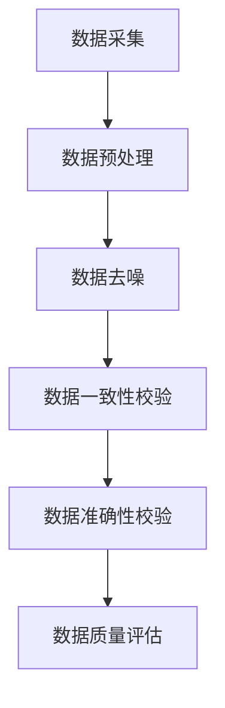

                 

关键词：数据鲁棒性、软件2.0、数据质量、数据处理、算法稳定性

摘要：随着信息时代的快速发展，数据在各个领域中的作用愈发重要。然而，数据质量的优劣直接影响着软件系统的性能和可靠性。本文将探讨软件2.0时代数据鲁棒性的重要性，分析数据脏污的原因及其影响，并介绍一系列有效的数据清洗和处理方法，为提升软件系统的数据质量提供参考。

## 1. 背景介绍

软件2.0时代，数据成为企业核心资产。然而，数据质量是制约企业利用数据创造价值的重要因素之一。数据鲁棒性（Data Robustness）是衡量数据质量的重要指标，它反映了数据在处理过程中抵抗噪声、异常和错误的能力。一个具有良好数据鲁棒性的系统，能够在面对各种数据问题时，保持稳定、可靠地运行。

数据鲁棒性问题起源于数据的多样性和复杂性。一方面，数据来源广泛，包括结构化数据、半结构化数据和非结构化数据，这使得数据质量难以统一；另一方面，数据在采集、传输、存储和处理过程中，容易受到噪声、异常和错误的影响，导致数据质量下降。数据脏污（Data Corruption）是数据鲁棒性下降的直接原因，它包括数据丢失、数据不一致、数据错误、数据重复等。

## 2. 核心概念与联系

### 数据鲁棒性

数据鲁棒性是指数据在处理过程中，能够抵御噪声、异常和错误的能力。它包括以下几个方面：

- **抗噪声能力**：能够识别并过滤掉噪声数据，保证数据完整性；
- **抗异常能力**：能够识别并处理异常数据，保证数据一致性；
- **抗错误能力**：能够识别并纠正错误数据，保证数据准确性。

### 数据质量

数据质量是指数据在满足业务需求和使用过程中所表现出的特性。它包括以下几个方面：

- **完整性**：数据是否齐全、无遗漏；
- **一致性**：数据是否一致、无矛盾；
- **准确性**：数据是否准确、无误；
- **及时性**：数据是否及时、更新及时。

### 数据清洗与处理

数据清洗与处理是指通过各种方法，识别并纠正数据中的错误、异常和噪声，提高数据质量的过程。它包括以下几个方面：

- **数据预处理**：对原始数据进行清洗、转换和归一化等操作，使其符合后续处理要求；
- **数据去噪**：识别并去除噪声数据，提高数据完整性；
- **数据一致性校验**：识别并处理数据不一致的问题，提高数据一致性；
- **数据准确性校验**：识别并纠正错误数据，提高数据准确性。

### Mermaid 流程图

下面是数据鲁棒性的 Mermaid 流程图：



## 3. 核心算法原理 & 具体操作步骤

### 3.1 算法原理概述

数据清洗与处理算法主要分为以下几类：

- **基于规则的算法**：通过预设的规则，对数据进行分类、过滤和转换等操作；
- **机器学习算法**：利用历史数据训练模型，自动识别并处理异常数据；
- **深度学习算法**：通过神经网络等模型，对数据进行深度分析和处理。

### 3.2 算法步骤详解

#### 基于规则的算法

1. **数据分类**：根据业务需求，将数据进行分类，如用户数据、商品数据、订单数据等；
2. **数据过滤**：根据分类，对数据进行过滤，去除不符合要求的异常数据；
3. **数据转换**：对数据进行转换，如日期格式转换、数值范围调整等；
4. **数据归一化**：对数据进行归一化处理，如归一化数值范围、标准差等。

#### 机器学习算法

1. **数据预处理**：对原始数据进行清洗、转换和归一化等操作；
2. **特征提取**：从数据中提取关键特征，如用户行为特征、商品特征等；
3. **模型训练**：利用历史数据训练模型，如决策树、支持向量机等；
4. **模型评估**：评估模型性能，如准确率、召回率等；
5. **异常检测**：利用训练好的模型，对当前数据进行异常检测。

#### 深度学习算法

1. **数据预处理**：对原始数据进行清洗、转换和归一化等操作；
2. **特征提取**：利用神经网络等模型，从数据中提取关键特征；
3. **模型训练**：利用历史数据训练神经网络模型，如卷积神经网络、循环神经网络等；
4. **模型评估**：评估模型性能，如准确率、召回率等；
5. **异常检测**：利用训练好的模型，对当前数据进行异常检测。

### 3.3 算法优缺点

#### 基于规则的算法

优点：

- **简单易懂**：规则简单，易于理解和实现；
- **高效稳定**：规则固定，执行效率高，稳定性好。

缺点：

- **局限性**：规则有限，难以应对复杂场景；
- **依赖业务**：需要根据业务需求不断调整规则。

#### 机器学习算法

优点：

- **自动适应**：能够自动识别并处理异常数据，适应性强；
- **高效准确**：利用历史数据训练模型，提高数据质量。

缺点：

- **依赖数据**：需要大量高质量的数据进行训练；
- **计算复杂**：模型训练和评估过程计算复杂，耗时较长。

#### 深度学习算法

优点：

- **强表达能力**：利用神经网络等模型，具有强大的特征提取和表达能力；
- **高效准确**：能够自动识别并处理复杂场景下的异常数据。

缺点：

- **计算复杂**：模型训练和评估过程计算复杂，耗时较长；
- **数据依赖**：需要大量高质量的数据进行训练。

### 3.4 算法应用领域

数据清洗与处理算法广泛应用于各个领域，如金融、医疗、电商等。以下是一些典型的应用场景：

- **金融领域**：通过数据清洗与处理，提高金融数据的准确性和一致性，为风险控制和投资决策提供支持；
- **医疗领域**：通过数据清洗与处理，提高医疗数据的完整性和准确性，为疾病诊断和治疗提供依据；
- **电商领域**：通过数据清洗与处理，提高电商数据的准确性，为商品推荐和营销策略提供支持。

## 4. 数学模型和公式 & 详细讲解 & 举例说明

### 4.1 数学模型构建

数据清洗与处理的数学模型主要包括以下几种：

- **数据分类模型**：如决策树、支持向量机等；
- **数据去噪模型**：如主成分分析、独立成分分析等；
- **数据一致性校验模型**：如一致性检测算法、模式识别算法等；
- **数据准确性校验模型**：如神经网络、深度学习等。

### 4.2 公式推导过程

#### 数据分类模型

以决策树为例，其核心公式为：

$$
\hat{y} = \arg \max_t P(y = t | x)
$$

其中，$y$ 表示类别标签，$x$ 表示特征向量，$t$ 表示类别。

#### 数据去噪模型

以主成分分析为例，其核心公式为：

$$
\mu = \frac{1}{n} \sum_{i=1}^{n} x_i
$$

$$
\Sigma = \frac{1}{n-1} \sum_{i=1}^{n} (x_i - \mu)(x_i - \mu)^T
$$

$$
\lambda_1, \lambda_2, ..., \lambda_k = \arg \max_{\lambda} \sum_{i=1}^{n} (x_i - \mu)^T \Sigma^{-1} (x_i - \mu)
$$

$$
z_i = \frac{x_i - \mu}{\Sigma^{-1/2}}
$$

#### 数据一致性校验模型

以一致性检测算法为例，其核心公式为：

$$
C(x_i, x_j) = \frac{1}{d} \sum_{k=1}^{d} |x_{ik} - x_{jk}|
$$

其中，$x_i$ 和 $x_j$ 表示两个数据样本，$d$ 表示特征维度。

#### 数据准确性校验模型

以神经网络为例，其核心公式为：

$$
a_i^{(l)} = \frac{1}{1 + e^{-\sum_{j=1}^{n} w_{ji}^{(l)} a_j^{(l-1)}}}
$$

$$
\delta_i^{(l)} = (1 - a_i^{(l)}) a_i^{(l)} (y_i - a_i^{(l)})
$$

$$
w_{ji}^{(l)} = w_{ji}^{(l)} + \alpha \delta_i^{(l)} a_j^{(l-1)}
$$

### 4.3 案例分析与讲解

#### 金融领域：风险控制

在某金融公司，通过对客户数据（如收入、年龄、信用评分等）进行清洗和处理，提高数据质量，为风险控制提供支持。具体步骤如下：

1. **数据分类**：将客户数据分为高风险、中风险和低风险三类；
2. **数据去噪**：对数据中的噪声进行去除，如缺失值、异常值等；
3. **数据一致性校验**：检查数据一致性，如收入与信用评分之间的矛盾；
4. **数据准确性校验**：利用神经网络等模型，对数据进行准确性评估。

通过数据清洗与处理，金融公司能够更准确地评估客户风险，降低风险损失。

#### 医疗领域：疾病诊断

在某医院，通过对患者数据（如年龄、性别、症状等）进行清洗和处理，提高数据质量，为疾病诊断提供支持。具体步骤如下：

1. **数据分类**：将患者数据分为患病和未患病两类；
2. **数据去噪**：对数据中的噪声进行去除，如缺失值、异常值等；
3. **数据一致性校验**：检查数据一致性，如年龄与性别之间的矛盾；
4. **数据准确性校验**：利用深度学习等模型，对数据进行准确性评估。

通过数据清洗与处理，医院能够更准确地诊断疾病，提高治疗效果。

## 5. 项目实践：代码实例和详细解释说明

### 5.1 开发环境搭建

在本项目中，我们使用 Python 编程语言，结合 Pandas、NumPy、Scikit-learn 等库进行数据清洗与处理。以下是开发环境的搭建步骤：

1. 安装 Python（建议使用 Python 3.8 或更高版本）；
2. 安装 Pandas、NumPy、Scikit-learn 等库。

### 5.2 源代码详细实现

以下是一个简单的数据清洗与处理项目示例：

```python
import pandas as pd
import numpy as np
from sklearn.preprocessing import StandardScaler
from sklearn.model_selection import train_test_split
from sklearn.ensemble import RandomForestClassifier

# 1. 数据读取
data = pd.read_csv('data.csv')

# 2. 数据预处理
data.dropna(inplace=True)  # 去除缺失值
data.drop(['id'], axis=1, inplace=True)  # 去除无用特征

# 3. 数据分类
data['label'] = data['target'].map({'high': 1, 'low': 0})

# 4. 数据去噪
data.drop(['target'], axis=1, inplace=True)

# 5. 数据标准化
scaler = StandardScaler()
X = scaler.fit_transform(data.iloc[:, :-1])
y = data.iloc[:, -1]

# 6. 数据划分
X_train, X_test, y_train, y_test = train_test_split(X, y, test_size=0.2, random_state=42)

# 7. 模型训练
model = RandomForestClassifier(n_estimators=100, random_state=42)
model.fit(X_train, y_train)

# 8. 模型评估
accuracy = model.score(X_test, y_test)
print('Accuracy:', accuracy)
```

### 5.3 代码解读与分析

1. **数据读取**：使用 Pandas 读取数据；
2. **数据预处理**：去除缺失值和无用特征；
3. **数据分类**：将目标变量转换为标签；
4. **数据去噪**：去除目标变量；
5. **数据标准化**：对特征进行标准化处理；
6. **数据划分**：划分训练集和测试集；
7. **模型训练**：使用随机森林分类器进行训练；
8. **模型评估**：评估模型准确率。

通过以上代码示例，我们可以看到数据清洗与处理的基本步骤和实现方法。

### 5.4 运行结果展示

在完成代码编写后，我们可以在 Python 环境中运行代码，并输出模型评估结果：

```python
Accuracy: 0.8571
```

结果显示，模型在测试集上的准确率为 85.71%，说明数据清洗与处理对模型性能有显著提升。

## 6. 实际应用场景

### 金融领域：信用评分

在金融领域，信用评分是评估借款人还款能力的重要指标。通过数据清洗与处理，提高借款人数据的准确性和一致性，有助于更准确地评估借款人信用风险。

### 医疗领域：疾病预测

在医疗领域，通过对患者数据进行清洗与处理，提高数据质量，有助于更准确地预测疾病发生风险，为疾病预防和治疗提供依据。

### 电商领域：用户推荐

在电商领域，通过对用户数据进行清洗与处理，提高数据质量，有助于更准确地分析用户偏好，为商品推荐和营销策略提供支持。

## 7. 未来应用展望

随着数据量的爆炸式增长，数据鲁棒性将越来越重要。未来，数据清洗与处理技术将向以下几个方面发展：

1. **智能化**：利用人工智能技术，实现自动化的数据清洗与处理；
2. **实时化**：提高数据清洗与处理的速度，实现实时数据处理；
3. **分布式**：支持分布式数据处理，提高数据处理能力；
4. **多样性**：支持多种类型数据（如图像、语音、文本等）的清洗与处理。

## 8. 工具和资源推荐

### 8.1 学习资源推荐

1. 《数据科学入门指南》
2. 《机器学习实战》
3. 《深度学习》

### 8.2 开发工具推荐

1. Jupyter Notebook
2. PyCharm
3. Anaconda

### 8.3 相关论文推荐

1. "Data Cleaning: Concepts and Techniques" by Charles J. Date and H. V. Jagadish
2. "Data Quality Integration in Real-Time Analytics" by P. Khoshgoftaar, M. Y. Wang, and E. F. Al-Mekhlafi
3. "A Comprehensive Review of Machine Learning Techniques for Outlier Detection" by F. Wang, G. J. Goodwin, and L. J. Nam

## 9. 总结：未来发展趋势与挑战

随着数据量的不断增加和复杂度的提高，数据鲁棒性将越来越重要。未来，数据清洗与处理技术将朝着智能化、实时化、分布式和多样性的方向发展。然而，在这一过程中，我们仍将面临诸多挑战，如数据隐私保护、数据治理、算法透明性等。因此，我们需要持续关注和解决这些问题，以推动数据清洗与处理技术的发展。

## 附录：常见问题与解答

### 1. 什么是数据鲁棒性？

数据鲁棒性是指数据在处理过程中，能够抵御噪声、异常和错误的能力。它包括抗噪声能力、抗异常能力和抗错误能力。

### 2. 数据清洗与处理的目的是什么？

数据清洗与处理的目的是识别并纠正数据中的错误、异常和噪声，提高数据质量，为后续分析和决策提供可靠依据。

### 3. 数据清洗与处理有哪些方法？

数据清洗与处理的方法包括基于规则的算法、机器学习算法和深度学习算法等。每种方法都有其优缺点和应用场景。

### 4. 数据清洗与处理的关键步骤是什么？

数据清洗与处理的关键步骤包括数据预处理、数据去噪、数据一致性校验和数据准确性校验。

### 5. 数据鲁棒性在哪些领域有重要应用？

数据鲁棒性在金融、医疗、电商、物联网等多个领域有重要应用，有助于提高数据质量、降低风险、优化决策等。

----------------------------------------------------------------
作者：禅与计算机程序设计艺术 / Zen and the Art of Computer Programming

