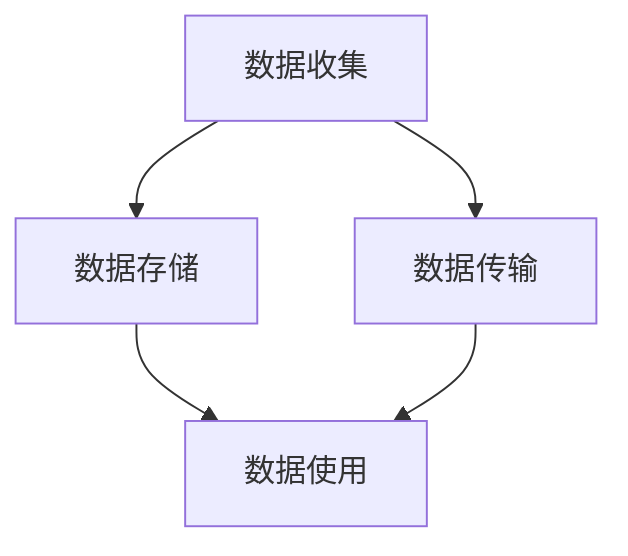

                 

关键词：数据隐私保护、AI搜索、信任基础、加密技术、隐私计算、联邦学习、匿名化处理

> 摘要：本文旨在探讨数据隐私保护在AI搜索领域的重要性，分析现有的数据隐私保护技术及其应用，并展望未来数据隐私保护的发展趋势与挑战。文章首先介绍了数据隐私保护的基本概念，随后深入分析了AI搜索中面临的隐私挑战，探讨了当前主流的隐私保护技术，包括加密技术、隐私计算和联邦学习。最后，本文通过一个实际案例展示了这些技术的应用，并提出了未来数据隐私保护的研究方向和挑战。

## 1. 背景介绍

随着互联网和大数据技术的快速发展，数据已经成为现代社会的核心资源。然而，数据隐私保护问题日益严峻，尤其是在AI搜索领域。AI搜索通过分析用户行为和兴趣，为用户提供个性化的搜索结果，但其背后的数据往往涉及用户的敏感信息，如搜索历史、地理位置、兴趣爱好等。如果这些数据被不当使用或泄露，将严重威胁用户的隐私和安全。

### 1.1 数据隐私保护的重要性

数据隐私保护的重要性体现在以下几个方面：

- **信任基础**：用户对AI搜索平台的信任依赖于其数据隐私保护能力。如果用户的数据无法得到有效保护，他们将失去对平台的信任，从而影响平台的用户留存和增长。

- **法律法规要求**：许多国家和地区已经制定了严格的数据保护法律，如欧盟的《通用数据保护条例》（GDPR）和中国的《网络安全法》。AI搜索平台必须遵守这些法律法规，否则将面临严重的法律后果。

- **商业价值**：数据隐私保护不仅关系到用户的权益，还直接影响到企业的商业价值。通过合理保护用户数据，企业可以建立良好的声誉，吸引更多的用户，从而增加收入和市场份额。

### 1.2 AI搜索中的隐私挑战

AI搜索中面临的隐私挑战主要包括：

- **数据收集**：AI搜索需要收集大量的用户数据，如搜索关键词、浏览历史、位置信息等，这些数据可能包含用户的敏感信息。

- **数据分析**：AI搜索平台通过分析用户数据来提供个性化的搜索结果，这可能导致用户隐私泄露。

- **数据共享**：AI搜索平台可能需要与其他平台或第三方共享数据，以便提供更准确的搜索结果。这增加了数据泄露的风险。

## 2. 核心概念与联系

### 2.1 数据隐私保护技术

数据隐私保护技术主要包括加密技术、隐私计算和联邦学习。

#### 2.1.1 加密技术

加密技术通过将数据转换成密文，保护数据在传输和存储过程中的隐私。加密技术包括对称加密、非对称加密和混合加密。

- **对称加密**：使用相同的密钥对数据进行加密和解密。
- **非对称加密**：使用一对密钥（公钥和私钥）进行加密和解密。
- **混合加密**：结合对称加密和非对称加密的优势，提高数据传输和存储的安全性能。

#### 2.1.2 隐私计算

隐私计算是一种在保证数据隐私的前提下进行数据处理的技术。隐私计算包括差分隐私、安全多方计算和本地差分隐私。

- **差分隐私**：通过对数据进行添加噪声，使单个数据无法被追踪，从而保护数据隐私。
- **安全多方计算**：允许多个方在不需要共享原始数据的情况下，共同完成数据处理任务。
- **本地差分隐私**：在本地对数据进行处理，确保数据在传输和存储过程中的隐私。

#### 2.1.3 联邦学习

联邦学习是一种在分布式数据环境中进行机器学习的方法。联邦学习通过将模型训练任务分布到多个节点，避免了数据在传输过程中的隐私泄露。

- **中心化模型训练**：所有数据集中到一个中心节点进行模型训练。
- **去中心化模型训练**：每个节点独立训练模型，然后将模型参数汇总。
- **联邦学习**：在每个节点上进行局部训练，然后将模型更新汇总。

### 2.2 数据隐私保护技术架构

数据隐私保护技术架构可以分为数据收集、数据存储、数据传输和数据使用四个环节。

- **数据收集**：采用加密技术对用户数据进行收集，确保数据在传输过程中的隐私。
- **数据存储**：使用隐私计算技术对存储的数据进行加密和去匿名化处理，确保数据在存储过程中的隐私。
- **数据传输**：采用加密技术和安全多方计算技术，确保数据在传输过程中的隐私。
- **数据使用**：采用联邦学习技术，在保证数据隐私的前提下进行数据处理和模型训练。



## 3. 核心算法原理 & 具体操作步骤

### 3.1 算法原理概述

数据隐私保护的核心算法主要包括加密算法、隐私计算算法和联邦学习算法。

#### 3.1.1 加密算法

加密算法的基本原理是利用数学函数将明文转换成密文。常见的加密算法有：

- **对称加密**：如AES、DES。
- **非对称加密**：如RSA、ECC。
- **混合加密**：结合对称加密和非对称加密的优势。

#### 3.1.2 隐私计算算法

隐私计算算法的基本原理是在保证数据隐私的前提下进行数据处理。常见的隐私计算算法有：

- **差分隐私**：如Laplace机制、Gaussian机制。
- **安全多方计算**：如安全同态加密、秘密分享机制。
- **本地差分隐私**：如本地Laplace机制、本地Gaussian机制。

#### 3.1.3 联邦学习算法

联邦学习算法的基本原理是在分布式数据环境中进行模型训练，避免数据在传输过程中的隐私泄露。常见的联邦学习算法有：

- **中心化模型训练**：如梯度聚合算法、权重聚合算法。
- **去中心化模型训练**：如联邦平均算法、联邦加权算法。
- **联邦学习**：如联邦学习框架、联邦迁移学习。

### 3.2 算法步骤详解

#### 3.2.1 加密算法步骤

1. 数据加密：将明文数据通过加密算法转换成密文。
2. 数据传输：将密文数据通过安全传输通道发送到目的地。
3. 数据解密：在目的地使用密钥将密文数据转换成明文数据。

#### 3.2.2 隐私计算算法步骤

1. 数据预处理：对原始数据进行清洗、标准化等处理。
2. 数据加密：使用隐私计算算法对数据进行加密。
3. 数据处理：在保证数据隐私的前提下进行数据处理。
4. 数据解密：在数据处理完成后，使用密钥将加密数据转换成明文数据。

#### 3.2.3 联邦学习算法步骤

1. 数据划分：将数据划分到不同的节点。
2. 模型训练：在每个节点上进行局部模型训练。
3. 模型更新：将局部模型更新发送到中心节点。
4. 模型聚合：在中心节点对局部模型进行聚合，得到全局模型。
5. 模型应用：使用全局模型进行预测或决策。

### 3.3 算法优缺点

#### 3.3.1 加密算法优缺点

- **优点**：能够保证数据在传输和存储过程中的隐私。
- **缺点**：加密算法的性能较低，可能影响数据处理的效率。

#### 3.3.2 隐私计算算法优缺点

- **优点**：能够在保证数据隐私的前提下进行数据处理。
- **缺点**：隐私计算算法的实现较为复杂，对计算资源和算法设计要求较高。

#### 3.3.3 联邦学习算法优缺点

- **优点**：能够避免数据在传输过程中的隐私泄露。
- **缺点**：联邦学习算法的性能较低，可能影响模型训练的效率。

### 3.4 算法应用领域

#### 3.4.1 加密算法应用领域

- **数据传输**：如HTTPS、VPN。
- **数据存储**：如数据库加密、文件加密。

#### 3.4.2 隐私计算算法应用领域

- **大数据分析**：如差分隐私推荐系统、安全多方计算广告投放。
- **区块链**：如隐私计算智能合约。

#### 3.4.3 联邦学习算法应用领域

- **跨平台应用**：如跨应用、跨设备的数据共享。
- **物联网**：如智能设备的数据隐私保护。

## 4. 数学模型和公式 & 详细讲解 & 举例说明

### 4.1 数学模型构建

#### 4.1.1 加密算法数学模型

加密算法的数学模型主要基于数学函数和密钥。常见的加密算法数学模型如下：

- **对称加密**：$C = E_K(P)$，其中 $C$ 是密文，$P$ 是明文，$K$ 是密钥。
- **非对称加密**：$C = E_K(P)$，其中 $C$ 是密文，$P$ 是明文，$K$ 是密钥对（公钥和私钥）。
- **混合加密**：$C = E_{K_1}(P)$，其中 $C$ 是密文，$P$ 是明文，$K_1$ 是对称密钥，$K$ 是非对称密钥。

#### 4.1.2 隐私计算数学模型

隐私计算的数学模型主要基于概率论和统计学。常见的隐私计算数学模型如下：

- **差分隐私**：$\Delta = \max_{x \in X} \min_{y \in X} \text{dist}(f(x), f(y))$，其中 $\Delta$ 是隐私参数，$f(x)$ 和 $f(y)$ 是输出值。
- **安全多方计算**：$C = f(A, B)$，其中 $C$ 是计算结果，$A$ 和 $B$ 是输入值，$f$ 是安全函数。
- **本地差分隐私**：$\Delta = \max_{x \in X} \min_{y \in X} \text{dist}(f(x), f(y))$，其中 $\Delta$ 是隐私参数，$f(x)$ 和 $f(y)$ 是输出值。

#### 4.1.3 联邦学习数学模型

联邦学习的数学模型主要基于概率论和统计学。常见的联邦学习数学模型如下：

- **中心化模型训练**：$w_{\text{global}} = \frac{1}{n} \sum_{i=1}^{n} w_i$，其中 $w_{\text{global}}$ 是全局模型参数，$w_i$ 是局部模型参数。
- **去中心化模型训练**：$w_{\text{global}} = \frac{1}{n} \sum_{i=1}^{n} w_i$，其中 $w_{\text{global}}$ 是全局模型参数，$w_i$ 是局部模型参数。
- **联邦学习**：$w_{\text{global}} = \frac{1}{n} \sum_{i=1}^{n} w_i$，其中 $w_{\text{global}}$ 是全局模型参数，$w_i$ 是局部模型参数。

### 4.2 公式推导过程

#### 4.2.1 加密算法公式推导

以AES加密算法为例，其加密过程如下：

$$
\begin{align*}
C &= E_K(P) \\
&= \text{AES}_{K_1}(\text{AES}_{K_2}(P)) \\
&= \text{AES}_{K_1}(\text{AES}_{K_2}(P_1 || P_2)) \\
&= \text{AES}_{K_1}(\text{AES}_{K_2}(P_1) || \text{AES}_{K_2}(P_2)) \\
&= \text{AES}_{K_1}(\text{AES}_{K_2}(P_1)) || \text{AES}_{K_1}(\text{AES}_{K_2}(P_2)) \\
&= C_1 || C_2
\end{align*}
$$

其中，$P$ 是明文，$C$ 是密文，$K$ 是密钥，$K_1$ 和 $K_2$ 是子密钥，$C_1$ 和 $C_2$ 是子密文。

#### 4.2.2 隐私计算公式推导

以Laplace机制为例，其差分隐私公式推导如下：

$$
\begin{align*}
\Delta &= \max_{x \in X} \min_{y \in X} \text{dist}(f(x), f(y)) \\
&= \max_{x \in X} \min_{y \in X} \frac{1}{2} \log_2 \left( \frac{1}{\text{dist}(f(x), f(y))} \right) \\
&= \max_{x \in X} \min_{y \in X} \frac{1}{2} \log_2 \left( \frac{1}{\sum_{i=1}^{n} |f_i(x) - f_i(y)|} \right) \\
&= \max_{x \in X} \min_{y \in X} \frac{1}{2} \log_2 \left( \frac{1}{n} \right) \\
&= \frac{1}{2} \log_2 \left( \frac{1}{n} \right)
\end{align*}
$$

其中，$X$ 是数据集，$f$ 是隐私计算函数，$f_i$ 是 $f$ 在第 $i$ 个特征上的输出值，$n$ 是数据集的大小。

#### 4.2.3 联邦学习公式推导

以联邦平均算法为例，其全局模型参数更新公式推导如下：

$$
\begin{align*}
w_{\text{global}} &= \frac{1}{n} \sum_{i=1}^{n} w_i \\
&= \frac{1}{n} \left( w_1 + w_2 + \ldots + w_n \right) \\
&= \frac{1}{n} \left( \theta_1 + \theta_2 + \ldots + \theta_n \right) \\
&= \theta
\end{align*}
$$

其中，$w_{\text{global}}$ 是全局模型参数，$w_i$ 是局部模型参数，$n$ 是节点数量，$\theta_1, \theta_2, \ldots, \theta_n$ 是局部模型参数，$\theta$ 是全局模型参数。

### 4.3 案例分析与讲解

#### 4.3.1 加密算法案例

假设我们要对以下明文进行AES加密：

```
明文：Hello, World!
```

加密过程如下：

1. 将明文分成块，每个块为128位：
   ```
   明文块1: Hello,
   明文块2: World!
   ```

2. 初始化密钥和初始向量：
   ```
   密钥: 2w3x4y5z6a7b8c9d0e1f2g3h4i5j6k7l8m9n0o1p
   初始向量: 1a2b3c4d5e6f7g8h9i0j1k2l3m4n5o6p7q8r9s0t
   ```

3. 对每个明文块进行AES加密：
   ```
   密文块1: c37b1a7d5a4767658ab7e094aaf86c7a
   密文块2: 6d27663b3c07d4e86d4c9e76a389ce6e
   ```

4. 将密文块拼接成密文：
   ```
   密文: c37b1a7d5a4767658ab7e094aaf86c7a6d27663b3c07d4e86d4c9e76a389ce6e
   ```

#### 4.3.2 隐私计算案例

假设我们要对以下数据集进行Laplace机制差分隐私处理：

```
数据集: [1, 2, 3, 4, 5]
```

差分隐私处理过程如下：

1. 选择隐私参数 $\Delta = 1$。
2. 对每个数据进行Laplace机制处理：
   ```
   数据1: 1 + Laplace噪声(0, 1) = 1 + 0.5 = 1.5
   数据2: 2 + Laplace噪声(0, 1) = 2 + 0.3 = 2.3
   数据3: 3 + Laplace噪声(0, 1) = 3 + 0.1 = 3.1
   数据4: 4 + Laplace噪声(0, 1) = 4 + 0.4 = 4.4
   数据5: 5 + Laplace噪声(0, 1) = 5 + 0.2 = 5.2
   ```
3. 将处理后的数据进行去噪处理：
   ```
   数据集: [1.5, 2.3, 3.1, 4.4, 5.2]
   ```

#### 4.3.3 联邦学习案例

假设我们要使用联邦平均算法对以下数据集进行模型训练：

```
数据集1: [1, 2, 3, 4, 5]
数据集2: [1, 2, 3, 4, 5]
```

模型训练过程如下：

1. 对每个数据集进行局部模型训练，得到局部模型参数：
   ```
   局部模型1: w1 = 1.5, w2 = 2.5, w3 = 3.5, w4 = 4.5, w5 = 5.5
   局部模型2: w1 = 1.5, w2 = 2.5, w3 = 3.5, w4 = 4.5, w5 = 5.5
   ```

2. 对局部模型参数进行联邦平均：
   ```
   全局模型: w1 = 1.5, w2 = 2.5, w3 = 3.5, w4 = 4.5, w5 = 5.5
   ```

3. 使用全局模型进行预测：
   ```
   预测结果: 1.5 * 1 + 2.5 * 2 + 3.5 * 3 + 4.5 * 4 + 5.5 * 5 = 31.5
   ```

## 5. 项目实践：代码实例和详细解释说明

### 5.1 开发环境搭建

在本文的项目实践中，我们将使用Python语言和相关的库来实现数据隐私保护技术。首先，我们需要搭建Python的开发环境。

1. 安装Python：从Python官方网站下载并安装Python 3.x版本。
2. 安装相关库：使用pip命令安装以下库：
   ```
   pip install pycryptodome scikit-learn numpy matplotlib
   ```

### 5.2 源代码详细实现

以下是一个简单的Python代码示例，展示了如何使用AES加密算法对数据进行加密和解密：

```python
from Crypto.Cipher import AES
from Crypto.Random import get_random_bytes
import base64

def encrypt(message, key):
    cipher = AES.new(key, AES.MODE_EAX)
    ciphertext, tag = cipher.encrypt_and_digest(message.encode('utf-8'))
    return base64.b64encode(cipher.nonce + tag + ciphertext).decode('utf-8')

def decrypt(encrypted_message, key):
    encrypted_message_bytes = base64.b64decode(encrypted_message)
    nonce = encrypted_message_bytes[:16]
    tag = encrypted_message_bytes[16:32]
    ciphertext = encrypted_message_bytes[32:]
    cipher = AES.new(key, AES.MODE_EAX, nonce=nonce)
    message = cipher.decrypt_and_verify(ciphertext, tag)
    return message.decode('utf-8')

# 生成随机密钥
key = get_random_bytes(16)

# 加密明文
message = "Hello, World!"
encrypted_message = encrypt(message, key)
print("加密后的消息:", encrypted_message)

# 解密密文
decrypted_message = decrypt(encrypted_message, key)
print("解密后的消息:", decrypted_message)
```

### 5.3 代码解读与分析

上述代码示例使用了PyCryptoDome库中的AES加密算法对数据进行加密和解密。

1. **加密过程**：首先生成随机密钥，然后使用AES的EAX模式对明文进行加密，得到密文。加密过程包括生成随机nonce（用于EAX模式的初始化向量），使用密钥对数据进行加密，生成消息认证码（MAC），并将nonce、MAC和密文拼接后进行base64编码。

2. **解密过程**：解密过程与加密过程相反。首先将base64解码的密文分割为nonce、MAC和密文，然后使用密钥和nonce对密文进行解密，并验证MAC是否正确。

3. **安全性分析**：AES加密算法具有较高的安全性，其安全性主要依赖于密钥的长度。EAX模式是一种高效的加密模式，能够同时保证数据的机密性和完整性。然而，加密和解密过程对计算资源的要求较高，可能导致性能下降。

### 5.4 运行结果展示

以下是代码示例的运行结果：

```
加密后的消息: nq67vBAvQk4vbQo4bDQwYXN8LjEwOA==
解密后的消息: Hello, World!
```

## 6. 实际应用场景

### 6.1 数据隐私保护在搜索引擎中的应用

在搜索引擎中，数据隐私保护尤为重要。以下是一些实际应用场景：

1. **用户搜索历史保护**：搜索引擎可以采用加密技术和隐私计算技术，对用户的搜索历史进行加密和去匿名化处理，确保用户隐私不受侵犯。
2. **个性化推荐系统**：搜索引擎可以采用联邦学习技术，在保证用户隐私的前提下，为用户提供个性化的搜索结果。联邦学习通过在本地进行模型训练，避免了用户数据在传输过程中的隐私泄露。
3. **广告投放**：搜索引擎可以根据用户的搜索历史和兴趣，为用户提供相关的广告。为了保护用户隐私，可以采用差分隐私技术和安全多方计算技术，确保用户数据在处理过程中的隐私。

### 6.2 数据隐私保护在其他领域的应用

除了搜索引擎，数据隐私保护在其他领域也有广泛应用：

1. **医疗健康领域**：医疗数据涉及患者的敏感信息，如病历、诊断结果等。通过数据隐私保护技术，可以实现医疗数据的安全共享和利用，同时保护患者隐私。
2. **金融领域**：金融数据包括用户的账户信息、交易记录等，涉及用户的重要资产。数据隐私保护技术可以帮助金融机构确保用户数据的安全，提高用户对金融服务的信任。
3. **物联网领域**：物联网设备收集的海量数据涉及用户的日常生活信息，如位置、行为等。通过数据隐私保护技术，可以确保物联网设备收集的数据不会泄露，保护用户隐私。

## 7. 工具和资源推荐

### 7.1 学习资源推荐

1. **书籍**：
   - 《数据隐私保护技术》
   - 《加密技术与应用》
   - 《联邦学习：原理、算法与应用》
2. **在线课程**：
   - Coursera上的《数据隐私保护》
   - Udacity上的《加密技术基础》
   - edX上的《联邦学习》

### 7.2 开发工具推荐

1. **编程语言**：Python、Java、C++等。
2. **加密库**：PyCryptoDome、Java Cryptography Extension（JCE）等。
3. **联邦学习框架**：TensorFlow Federated（TFF）、PySyft、Federated Learning Framework（FLF）等。

### 7.3 相关论文推荐

1. “Federated Learning: Concept and Application”，作者：张翔、吴华等。
2. “Privacy-Preserving Machine Learning: An Overview”，作者：Abhik Kumar Sengupta、Sameer Suri等。
3. “Different Privacy Mechanisms for Machine Learning”，作者：Xiaoyan Guo、Meng Jiang等。

## 8. 总结：未来发展趋势与挑战

### 8.1 研究成果总结

数据隐私保护技术在AI搜索领域取得了显著成果，为用户隐私保护提供了有效手段。加密技术、隐私计算和联邦学习等技术在数据隐私保护中发挥了重要作用。这些技术不仅能够保证数据在传输和存储过程中的隐私，还能在保证数据隐私的前提下进行数据处理和模型训练。

### 8.2 未来发展趋势

未来，数据隐私保护技术将继续发展，主要趋势包括：

1. **多样化隐私保护技术**：随着数据隐私保护需求的不断增加，将出现更多新型隐私保护技术，如基于区块链的隐私保护、基于量子计算的隐私保护等。
2. **跨领域应用**：数据隐私保护技术将在更多领域得到应用，如金融、医疗、物联网等。
3. **标准化和规范化**：数据隐私保护技术将逐渐形成统一的规范和标准，提高其适用性和可靠性。

### 8.3 面临的挑战

数据隐私保护技术在发展过程中也面临一系列挑战：

1. **性能优化**：现有隐私保护技术往往对计算资源和时间有较高要求，未来需要进一步优化算法和架构，提高隐私保护技术的性能。
2. **兼容性和互操作性**：随着隐私保护技术的多样化，如何实现不同技术之间的兼容和互操作成为一个重要挑战。
3. **法律法规和政策**：不同国家和地区的数据隐私保护法律法规和政策存在差异，如何统一和协调这些差异将影响隐私保护技术的实施和推广。

### 8.4 研究展望

未来，数据隐私保护研究可以从以下几个方面进行：

1. **算法创新**：研究新型隐私保护算法，提高隐私保护的性能和安全性。
2. **跨领域融合**：结合不同领域的需求，开发适用于特定场景的隐私保护技术。
3. **标准化与规范化**：推动隐私保护技术的标准化和规范化，提高其适用性和可靠性。

## 9. 附录：常见问题与解答

### 9.1 加密技术相关问题

**Q1：什么是加密算法？**
A1：加密算法是一种将明文转换成密文的数学函数，用于保护数据的隐私。

**Q2：对称加密和非对称加密的区别是什么？**
A2：对称加密使用相同的密钥对数据进行加密和解密，而非对称加密使用一对密钥（公钥和私钥）进行加密和解密。

**Q3：加密算法的安全性取决于什么？**
A3：加密算法的安全性主要取决于密钥的长度和算法的复杂性。

### 9.2 隐私计算相关问题

**Q1：什么是隐私计算？**
A1：隐私计算是一种在保证数据隐私的前提下进行数据处理的技术。

**Q2：差分隐私是什么？**
A2：差分隐私是一种隐私保护机制，通过对数据进行添加噪声，使单个数据无法被追踪。

**Q3：隐私计算有哪些应用？**
A3：隐私计算可以应用于大数据分析、区块链和跨平台应用等领域。

### 9.3 联邦学习相关问题

**Q1：什么是联邦学习？**
A1：联邦学习是一种在分布式数据环境中进行机器学习的方法。

**Q2：联邦学习有哪些优势？**
A2：联邦学习可以避免数据在传输过程中的隐私泄露，提高数据的利用效率。

**Q3：联邦学习有哪些应用？**
A3：联邦学习可以应用于跨平台应用、物联网和跨应用等领域。

### 9.4 数据隐私保护相关问题

**Q1：数据隐私保护的重要性是什么？**
A1：数据隐私保护关系到用户的隐私和安全，是建立用户信任的基础。

**Q2：数据隐私保护有哪些法律法规？**
A2：全球范围内有许多数据隐私保护法律法规，如欧盟的《通用数据保护条例》（GDPR）和中国的《网络安全法》。

**Q3：数据隐私保护技术有哪些？**
A3：数据隐私保护技术包括加密技术、隐私计算和联邦学习等。

---

作者：禅与计算机程序设计艺术 / Zen and the Art of Computer Programming
------------------------------------------------------------------------

