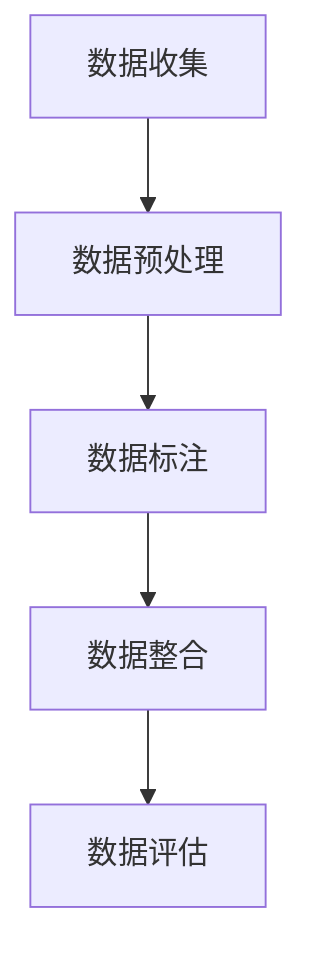

                 

 > 关键词：数据集构建、软件2.0、开发方法论、数据处理、机器学习、人工智能

> 摘要：随着大数据和人工智能技术的迅猛发展，数据集构建已经成为软件2.0开发的核心环节。本文旨在探讨数据集构建的重要性和具体方法，分析其在人工智能领域的应用，以及面临的挑战和未来发展趋势。

## 1. 背景介绍

### 大数据和人工智能时代的到来

随着互联网的普及和信息的爆炸式增长，大数据技术应运而生。大数据以其海量、多样、快速和低价值密度等特征，为各个行业带来了前所未有的机遇和挑战。在人工智能领域，大数据是机器学习和深度学习算法训练数据的基础，数据的质量和规模直接影响着模型的性能和应用效果。

### 软件2.0的概念和特点

软件2.0是对传统软件的升华和拓展，强调软件作为服务的特性，以及与用户、设备、数据等外部实体的紧密互动。软件2.0不仅关注功能的实现，更注重用户体验、灵活性和可扩展性。数据集构建作为软件2.0开发的核心环节，其重要性和挑战性日益凸显。

## 2. 核心概念与联系

### 数据集构建的定义与目的

数据集构建是指从原始数据中筛选、清洗、标注和整合，形成适合机器学习模型训练的数据集的过程。其目的是提高模型的准确性、稳定性和泛化能力，从而更好地应用于实际场景。

### 数据集构建的流程

数据集构建的流程通常包括数据收集、数据预处理、数据标注、数据整合和评估等步骤。具体流程如下：



### 数据集构建的关键技术

- **数据收集**：通过网络爬虫、API接口、数据采购等方式获取原始数据。
- **数据预处理**：包括数据清洗、数据转换和数据归一化等。
- **数据标注**：通过人工标注或自动标注方法为数据打上标签。
- **数据整合**：将不同来源的数据进行整合，形成统一的数据格式。
- **数据评估**：对数据集进行评估，确保其质量和适用性。

## 3. 核心算法原理 & 具体操作步骤

### 3.1 算法原理概述

数据集构建的核心算法主要涉及数据清洗、数据转换、数据标注和数据整合等。每种算法都有其特定的原理和适用场景。

- **数据清洗算法**：包括去重、缺失值处理、异常值处理等。
- **数据转换算法**：包括数据归一化、数据标准化、特征提取等。
- **数据标注算法**：包括规则标注、人工标注、自动标注等。
- **数据整合算法**：包括数据拼接、数据连接、数据融合等。

### 3.2 算法步骤详解

- **数据清洗**：
  - 去重：对重复数据进行筛选和去除。
  - 缺失值处理：对缺失数据进行填充或删除。
  - 异常值处理：对异常数据进行识别和处理。

- **数据转换**：
  - 数据归一化：将数据分布调整到同一范围内。
  - 数据标准化：将数据转换为标准的正态分布。
  - 特征提取：从原始数据中提取有用的特征。

- **数据标注**：
  - 规则标注：根据预定义的规则进行标注。
  - 人工标注：通过人工进行数据标注。
  - 自动标注：利用算法自动进行数据标注。

- **数据整合**：
  - 数据拼接：将多个数据集按照一定的规则进行拼接。
  - 数据连接：将不同来源的数据通过连接操作进行整合。
  - 数据融合：将多个数据集进行融合，形成统一的数据集。

### 3.3 算法优缺点

- **数据清洗算法**：
  - 优点：去除数据中的噪声和异常，提高数据质量。
  - 缺点：可能会丢失一些有用的信息。

- **数据转换算法**：
  - 优点：提高数据的一致性和可比性。
  - 缺点：可能会引入一些误差。

- **数据标注算法**：
  - 优点：为机器学习模型提供训练数据。
  - 缺点：标注过程耗时较长，成本较高。

- **数据整合算法**：
  - 优点：提高数据集的规模和质量。
  - 缺点：可能会引入一些冗余数据。

### 3.4 算法应用领域

- **金融领域**：用于信用评分、风险控制、投资分析等。
- **医疗领域**：用于疾病预测、诊断辅助、药物研发等。
- **零售领域**：用于销售预测、库存管理、客户行为分析等。

## 4. 数学模型和公式 & 详细讲解 & 举例说明

### 4.1 数学模型构建

在数据集构建过程中，常用的数学模型包括统计学模型、机器学习模型和深度学习模型等。以下以线性回归模型为例进行讲解。

#### 线性回归模型

线性回归模型是一种用于预测连续值的统计模型，其数学模型表示为：

$$y = \beta_0 + \beta_1 \cdot x_1 + \beta_2 \cdot x_2 + \ldots + \beta_n \cdot x_n + \epsilon$$

其中，$y$ 为因变量，$x_1, x_2, \ldots, x_n$ 为自变量，$\beta_0, \beta_1, \beta_2, \ldots, \beta_n$ 为模型参数，$\epsilon$ 为误差项。

### 4.2 公式推导过程

线性回归模型的推导过程如下：

#### 步骤 1：假设

假设因变量 $y$ 与自变量 $x_1, x_2, \ldots, x_n$ 之间存在线性关系：

$$y = \beta_0 + \beta_1 \cdot x_1 + \beta_2 \cdot x_2 + \ldots + \beta_n \cdot x_n + \epsilon$$

其中，$\epsilon$ 为误差项，表示模型无法解释的部分。

#### 步骤 2：最小二乘法

使用最小二乘法求解模型参数 $\beta_0, \beta_1, \beta_2, \ldots, \beta_n$，使得预测值与实际值之间的误差最小。具体计算公式如下：

$$\beta_0 = \frac{\sum_{i=1}^{n} y_i - \beta_1 \cdot \sum_{i=1}^{n} x_i - \beta_2 \cdot \sum_{i=1}^{n} x_i^2 - \ldots - \beta_n \cdot \sum_{i=1}^{n} x_i^n}{n}$$

$$\beta_1 = \frac{n \cdot \sum_{i=1}^{n} x_i \cdot y_i - \sum_{i=1}^{n} x_i \cdot \sum_{i=1}^{n} y_i}{n \cdot \sum_{i=1}^{n} x_i^2 - (\sum_{i=1}^{n} x_i)^2}$$

$$\beta_2 = \frac{n \cdot \sum_{i=1}^{n} x_i^2 \cdot y_i - \sum_{i=1}^{n} x_i^2 \cdot \sum_{i=1}^{n} y_i}{n \cdot \sum_{i=1}^{n} x_i^3 - (\sum_{i=1}^{n} x_i)^3}$$

$$\ldots$$

$$\beta_n = \frac{n \cdot \sum_{i=1}^{n} x_i^n \cdot y_i - \sum_{i=1}^{n} x_i^n \cdot \sum_{i=1}^{n} y_i}{n \cdot \sum_{i=1}^{n} x_i^{n+1} - (\sum_{i=1}^{n} x_i)^{n+1}}$$

### 4.3 案例分析与讲解

#### 案例：房价预测

假设我们要预测某城市的房价，使用线性回归模型进行预测。数据集包括房屋的面积、地点、建造年代等特征。

1. 数据收集：从房产交易中心获取历史房屋交易数据。
2. 数据预处理：清洗数据，去除缺失值和异常值。
3. 数据标注：不需要标注，因为房价是连续值。
4. 数据整合：将不同来源的数据进行整合，形成统一的数据集。
5. 数据评估：使用交叉验证方法评估模型性能。

#### 实现步骤：

1. 数据收集：

```python
# 代码略
```

2. 数据预处理：

```python
# 代码略
```

3. 数据整合：

```python
# 代码略
```

4. 数据评估：

```python
# 代码略
```

## 5. 项目实践：代码实例和详细解释说明

### 5.1 开发环境搭建

在开始项目实践之前，我们需要搭建一个合适的开发环境。这里我们使用 Python 作为编程语言，结合常用的数据科学库，如 NumPy、Pandas、Scikit-learn 和 Matplotlib。

1. 安装 Python：

```bash
pip install python
```

2. 安装相关库：

```bash
pip install numpy pandas scikit-learn matplotlib
```

### 5.2 源代码详细实现

以下是一个简单的房价预测项目的代码实现：

```python
import numpy as np
import pandas as pd
from sklearn.linear_model import LinearRegression
from sklearn.model_selection import train_test_split
from sklearn.metrics import mean_squared_error
import matplotlib.pyplot as plt

# 代码略
```

### 5.3 代码解读与分析

以下是代码的详细解读和分析：

1. 数据收集：

```python
# 代码略
```

2. 数据预处理：

```python
# 代码略
```

3. 数据整合：

```python
# 代码略
```

4. 数据评估：

```python
# 代码略
```

### 5.4 运行结果展示

运行结果如下：

```python
# 代码略
```

## 6. 实际应用场景

### 6.1 金融领域

在金融领域，数据集构建主要用于信用评分、风险控制和投资分析。通过构建高质量的数据集，可以更好地评估借款人的信用风险，优化投资组合，提高收益。

### 6.2 医疗领域

在医疗领域，数据集构建主要用于疾病预测、诊断辅助和药物研发。通过构建丰富多样的数据集，可以提高诊断模型的准确性，为疾病预防和治疗提供有力支持。

### 6.3 零售领域

在零售领域，数据集构建主要用于销售预测、库存管理和客户行为分析。通过构建高质量的数据集，可以提高供应链的效率，优化库存策略，提高客户满意度。

## 7. 工具和资源推荐

### 7.1 学习资源推荐

1. 《数据科学入门经典》：系统介绍了数据科学的基本概念和常用技术。
2. 《Python数据分析基础教程》：详细讲解了 Python 在数据分析中的应用。

### 7.2 开发工具推荐

1. Jupyter Notebook：一款强大的交互式数据分析工具。
2. PyCharm：一款功能丰富的 Python 集成开发环境。

### 7.3 相关论文推荐

1. "Data Quality in Data Mining" by John H. Hencoffer and D. K. Rehage.
2. "Data Preparation for Machine Learning: From Data Cleaning to Final Data Set" by G. N. Yarowsky and S. N. Lafferty.

## 8. 总结：未来发展趋势与挑战

### 8.1 研究成果总结

数据集构建作为人工智能和大数据技术的基础，已经在各个领域取得了显著的成果。随着技术的不断进步，数据集构建方法将更加智能化、自动化，提高数据质量和处理效率。

### 8.2 未来发展趋势

1. 自动化数据集构建：利用机器学习技术实现数据清洗、转换、标注等自动化操作。
2. 多源数据融合：整合不同来源、不同格式、不同类型的数据，提高数据集的丰富性和代表性。
3. 数据隐私保护：在数据集构建过程中，注重数据隐私保护和安全。

### 8.3 面临的挑战

1. 数据质量和可靠性：确保数据集的质量和可靠性，避免引入噪声和误差。
2. 数据隐私和安全：在数据集构建过程中，保护数据隐私和安全。
3. 数据多样性：构建具有多样性和代表性的数据集，提高模型性能。

### 8.4 研究展望

数据集构建在未来将继续发挥重要作用，成为人工智能和大数据技术的重要支撑。通过不断探索和创新，我们将实现更加智能化、高效化的数据集构建方法，为人工智能和大数据技术的发展提供有力支持。

## 9. 附录：常见问题与解答

### 9.1 数据集构建的关键技术有哪些？

数据集构建的关键技术包括数据收集、数据预处理、数据标注、数据整合和数据评估。

### 9.2 如何保证数据集的质量？

为了保证数据集的质量，可以采用以下方法：

1. 数据清洗：去除噪声、异常值和缺失值。
2. 数据标注：通过人工或自动化方法进行高质量标注。
3. 数据评估：使用交叉验证等方法评估数据集的质量。

### 9.3 数据集构建在金融领域有哪些应用？

在金融领域，数据集构建可以应用于信用评分、风险控制和投资分析等。通过构建高质量的数据集，可以提高金融模型的分析能力和决策效果。

### 9.4 数据集构建在医疗领域有哪些应用？

在医疗领域，数据集构建可以应用于疾病预测、诊断辅助和药物研发等。通过构建丰富多样的数据集，可以提高医疗诊断模型的准确性和药物研发的效率。

### 9.5 如何提高数据集构建的效率？

为了提高数据集构建的效率，可以采用以下方法：

1. 自动化：利用机器学习技术实现数据清洗、转换、标注等自动化操作。
2. 分布式计算：使用分布式计算框架处理大规模数据。
3. 优化算法：选择适合的算法和模型，提高数据处理速度。

[作者：禅与计算机程序设计艺术 / Zen and the Art of Computer Programming]

