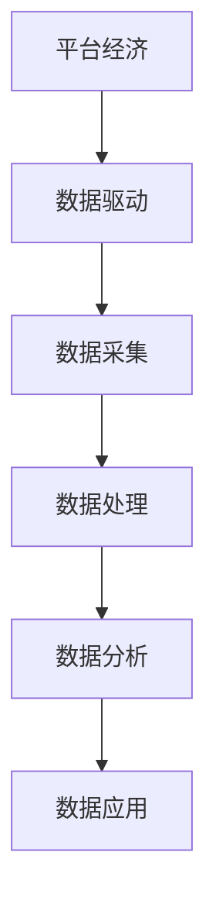
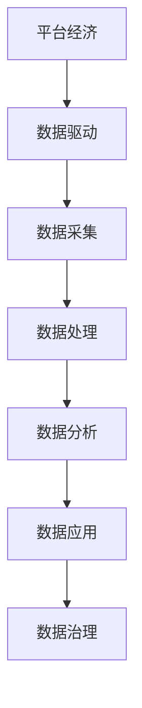
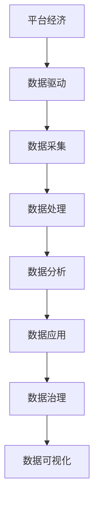

                 

### 摘要 Abstract

本文将深入探讨数据驱动平台经济发展战略的制定与实施。在数字化转型的浪潮中，数据成为驱动经济发展的核心动力。本文将详细分析如何通过数据驱动战略，构建可持续发展的平台经济模式，包括核心概念的理解、算法原理的阐述、数学模型的构建、项目实践及未来发展趋势。通过本文的阅读，读者将掌握制定数据驱动平台经济发展战略的系统性方法，为企业在数据驱动的时代中寻找新的增长点提供理论指导和实践路径。

### 1. 背景介绍 Background

随着互联网技术的飞速发展，大数据时代已经来临。数据已经成为新时代的核心资产，传统的经济发展模式正逐渐被以数据为中心的平台经济所取代。平台经济的兴起，不仅改变了市场结构，更为企业提供了全新的商业模式。然而，如何有效地利用数据驱动平台经济发展，成为当前企业和政府面临的重大课题。

平台经济的核心在于通过搭建一个开放的生态系统，连接多个参与者，实现资源的高效配置和价值的最大化。这种模式的出现，打破了传统的垄断格局，促进了市场的竞争和创新。然而，平台经济的成功离不开数据的驱动。数据不仅为企业提供了洞察市场趋势、优化运营决策的重要信息，更为平台经济的发展提供了坚实的基础。

在数据驱动平台经济发展中，数据的获取、处理、分析和应用是关键环节。数据的获取需要依赖于广泛的传感器、用户行为追踪等技术手段；数据处理则需要高效的数据存储和管理系统；数据分析则需要强大的算法支持；而数据应用则要求企业能够将数据分析结果转化为实际的商业行动。只有实现这四个环节的有机结合，才能充分发挥数据驱动的力量，推动平台经济的快速发展。

本文将从核心概念、算法原理、数学模型、项目实践等多个方面，系统性地探讨数据驱动平台经济发展战略的制定与实施，旨在为企业和政府提供具有指导意义的理论框架和实践路径。

### 2. 核心概念与联系 Core Concepts and Their Relationships

在数据驱动平台经济发展战略中，理解核心概念和它们之间的联系至关重要。以下将详细阐述几个关键概念，并通过Mermaid流程图展示其内在逻辑。

#### 2.1 平台经济 Platform Economy

平台经济是指通过搭建一个开放、互联的生态系统，连接多个参与者（如供应商、消费者、服务提供商等），实现资源的高效配置和价值创造的一种经济模式。平台经济的核心在于通过中介平台，降低交易成本，提高交易效率，从而实现市场参与者的共赢。

#### 2.2 数据驱动 Data-driven

数据驱动是指通过数据分析和处理，为决策提供支持和指导的一种方法。数据驱动的核心在于充分利用数据资源，通过数据分析洞察市场趋势、优化运营决策，从而提高企业的竞争力。

#### 2.3 数据采集 Data Collection

数据采集是数据驱动平台经济的基础环节。通过传感器、用户行为追踪、社交媒体等多种手段，获取海量的原始数据，为后续的数据处理和分析提供基础。

#### 2.4 数据处理 Data Processing

数据处理是对原始数据进行清洗、转换和存储的过程。高效的数据处理系统能够保证数据的完整性和准确性，为数据分析和应用提供可靠的基础。

#### 2.5 数据分析 Data Analysis

数据分析是利用统计学、机器学习等算法，对处理后的数据进行分析和挖掘，从中提取有价值的信息和洞察。

#### 2.6 数据应用 Data Application

数据应用是将数据分析结果转化为实际行动的过程。通过将数据洞察应用于运营优化、市场推广、产品创新等方面，实现数据价值的最大化。

下面是这些概念之间的Mermaid流程图：



通过这个流程图，我们可以清晰地看到数据驱动平台经济发展战略中各个核心概念之间的相互关系。平台经济通过数据驱动实现，而数据驱动又依赖于数据采集、处理、分析和应用的有机结合。只有实现这些环节的高效协同，才能真正发挥数据驱动的力量，推动平台经济的可持续发展。

#### 2.7 数据治理 Data Governance

数据治理是确保数据质量和安全的重要环节。它包括数据策略的制定、数据标准的建立、数据隐私保护等方面的内容。良好的数据治理能够确保数据的准确性、完整性和一致性，为数据驱动平台经济提供可靠保障。



通过数据治理，企业能够确保在数据驱动过程中，数据的合规性和安全性得到有效保障，从而为平台经济的健康发展奠定坚实基础。

#### 2.8 数据可视化 Data Visualization

数据可视化是将复杂的数据信息以图形、图表等形式直观呈现的过程。数据可视化不仅能够帮助用户更好地理解和分析数据，还能够发现潜在的模式和趋势。



通过数据可视化，企业可以更加直观地展示数据分析结果，提高决策的透明度和可操作性。

通过上述核心概念和Mermaid流程图，我们可以清晰地看到数据驱动平台经济发展战略中各个环节之间的紧密联系。只有深入理解这些概念，并实现各个环节的有机结合，企业才能在数据驱动的时代中找到新的增长点，实现可持续发展。

### 3. 核心算法原理 & 具体操作步骤 Core Algorithm Principle & Detailed Operational Steps

在数据驱动平台经济发展战略中，核心算法的原理和具体操作步骤至关重要。以下将详细介绍这些算法的原理及其应用步骤。

#### 3.1 算法原理概述 Algorithm Principle Overview

核心算法主要包括数据采集、数据处理、数据分析和数据应用等环节。每个环节都有其独特的算法原理和应用场景。

##### 3.1.1 数据采集

数据采集算法主要用于获取原始数据。常用的方法包括：

- 用户行为追踪：通过分析用户的点击、浏览、搜索等行为，获取用户兴趣和行为数据。
- 物联网传感器：通过传感器收集设备状态、环境参数等数据。
- 社交媒体分析：通过爬虫技术收集社交媒体上的用户评论、转发等数据。

##### 3.1.2 数据处理

数据处理算法主要涉及数据的清洗、转换和存储。常用的方法包括：

- 数据清洗：通过去除重复数据、填充缺失值、处理异常值等方法，提高数据的准确性和完整性。
- 数据转换：通过数据格式转换、数据归一化等方法，为数据分析做好准备。
- 数据存储：利用数据库管理系统（如MySQL、MongoDB等）进行数据存储，确保数据的高效访问和查询。

##### 3.1.3 数据分析

数据分析算法主要用于挖掘数据中的有价值信息。常用的方法包括：

- 描述性统计分析：通过计算数据的均值、方差、中位数等指标，描述数据的基本特征。
- 聚类分析：通过聚类算法（如K-means、层次聚类等）将数据分为不同的类别，发现数据中的潜在模式。
- 回归分析：通过回归算法（如线性回归、逻辑回归等）预测数据未来的趋势或关系。

##### 3.1.4 数据应用

数据应用算法将数据分析结果转化为实际的商业行动。常用的方法包括：

- 运营优化：通过数据分析优化营销策略、库存管理、供应链管理等，提高运营效率。
- 产品创新：通过数据分析发现用户需求和市场趋势，推动产品创新和改进。
- 风险控制：通过数据分析预测潜在风险，制定风险控制策略。

#### 3.2 算法步骤详解 Algorithm Steps Detailed Explanation

##### 3.2.1 数据采集

1. **数据源选择**：确定数据采集的目标和数据源，如用户行为数据、传感器数据等。
2. **数据采集方法**：根据数据源的特点选择合适的采集方法，如用户行为追踪使用浏览器插件、物联网传感器使用MQTT协议等。
3. **数据采集工具**：使用Python的Requests库、Node.js的MQTT客户端等工具进行数据采集。

```python
import requests
url = 'https://example.com/data'
response = requests.get(url)
data = response.json()
```

##### 3.2.2 数据处理

1. **数据清洗**：使用Pandas库对数据进行清洗，如去除重复数据、填充缺失值等。

```python
import pandas as pd
data = pd.read_csv('data.csv')
data.drop_duplicates(inplace=True)
data.fillna(method='ffill', inplace=True)
```

2. **数据转换**：对数据进行格式转换，如将字符串转换为日期格式。

```python
data['date'] = pd.to_datetime(data['date'])
```

3. **数据存储**：使用SQLite数据库存储清洗后的数据。

```python
import sqlite3
conn = sqlite3.connect('data.db')
data.to_sql('data', conn, if_exists='replace', index=False)
```

##### 3.2.3 数据分析

1. **描述性统计分析**：使用Pandas库计算数据的描述性统计指标。

```python
description = data.describe()
```

2. **聚类分析**：使用Scikit-learn库的K-means算法进行聚类分析。

```python
from sklearn.cluster import KMeans
kmeans = KMeans(n_clusters=3)
kmeans.fit(data)
clusters = kmeans.predict(data)
```

3. **回归分析**：使用Scikit-learn库的线性回归算法进行回归分析。

```python
from sklearn.linear_model import LinearRegression
model = LinearRegression()
model.fit(data[['feature']], data['target'])
predictions = model.predict(data[['feature']])
```

##### 3.2.4 数据应用

1. **运营优化**：根据数据分析结果调整运营策略。

```python
# 根据聚类分析结果调整营销策略
if clusters[i] == 0:
    # 策略A
elif clusters[i] == 1:
    # 策略B
elif clusters[i] == 2:
    # 策略C
```

2. **产品创新**：根据数据分析结果调整产品功能。

```python
# 根据回归分析结果调整产品功能
if predictions[i] > threshold:
    # 添加新功能
else:
    # 优化现有功能
```

3. **风险控制**：根据数据分析结果制定风险控制策略。

```python
# 根据预测结果制定风险控制策略
if prediction[i] > risk_threshold:
    # 提高风险预警
else:
    # 采取常规措施
```

#### 3.3 算法优缺点 Advantages and Disadvantages of the Algorithm

##### 3.3.1 数据采集

**优点**：

- 可以获取丰富的原始数据，为后续分析提供基础。
- 方法多样，适应不同类型的数据源。

**缺点**：

- 数据采集可能面临隐私保护问题。
- 数据源不稳定可能导致数据采集失败。

##### 3.3.2 数据处理

**优点**：

- 提高数据质量，为数据分析提供可靠基础。
- 数据转换和存储方法多样，适应不同类型的数据。

**缺点**：

- 数据清洗和处理可能耗费大量计算资源。
- 数据存储可能面临数据安全和隐私保护问题。

##### 3.3.3 数据分析

**优点**：

- 可以发现数据中的潜在模式和趋势。
- 提高决策的准确性和效率。

**缺点**：

- 分析结果可能受到数据质量和算法选择的影响。
- 分析过程可能复杂，难以理解。

##### 3.3.4 数据应用

**优点**：

- 可以将数据分析结果转化为实际的商业行动。
- 提高运营效率，实现数据价值最大化。

**缺点**：

- 应用过程可能面临实际操作难度。
- 需要持续更新和调整策略。

#### 3.4 算法应用领域 Application Fields of the Algorithm

核心算法广泛应用于各类场景，主要包括：

- **市场营销**：通过数据分析优化营销策略，提高转化率和用户满意度。
- **供应链管理**：通过数据分析优化库存管理和供应链流程，降低成本。
- **金融风险控制**：通过数据分析预测金融风险，制定风险管理策略。
- **医疗健康**：通过数据分析发现疾病趋势，优化医疗资源配置。

通过以上核心算法原理和具体操作步骤的详细讲解，我们可以看到数据驱动平台经济发展战略的实施需要各个环节的紧密协同。只有深入理解并有效运用这些算法，企业才能在数据驱动的时代中取得竞争优势，实现可持续发展。

### 4. 数学模型和公式 & 详细讲解 & 举例说明

在数据驱动平台经济发展战略中，数学模型和公式是理解和应用数据分析的核心工具。通过构建和推导数学模型，我们可以更准确地描述数据之间的复杂关系，从而为决策提供坚实的理论基础。以下将详细讲解几个关键数学模型和公式，并通过具体例子进行说明。

#### 4.1 数学模型构建

在数据驱动平台经济中，常见的数学模型包括线性回归模型、聚类分析模型和神经网络模型等。

##### 4.1.1 线性回归模型

线性回归模型用于预测因变量（目标变量）与自变量（特征变量）之间的线性关系。其数学模型可以表示为：

\[ y = \beta_0 + \beta_1x_1 + \beta_2x_2 + ... + \beta_nx_n + \epsilon \]

其中，\( y \) 是因变量，\( x_1, x_2, ..., x_n \) 是自变量，\( \beta_0, \beta_1, \beta_2, ..., \beta_n \) 是模型参数，\( \epsilon \) 是误差项。

##### 4.1.2 聚类分析模型

聚类分析模型用于将数据集划分为多个类别，以便更好地理解和分析数据。常见的聚类算法包括K-means、层次聚类等。以K-means为例，其数学模型可以表示为：

\[ \text{最小化} \sum_{i=1}^{k} \sum_{x \in S_i} ||x - \mu_i||^2 \]

其中，\( k \) 是聚类个数，\( S_i \) 是第 \( i \) 个聚类，\( \mu_i \) 是第 \( i \) 个聚类的中心。

##### 4.1.3 神经网络模型

神经网络模型是一种基于模拟人脑神经元连接和计算方式的模型，广泛用于复杂的非线性数据分析任务。其数学模型可以表示为：

\[ a_{i,j} = \sum_{k=1}^{n} w_{ik}a_{k,j-1} + b_{i,j} \]

其中，\( a_{i,j} \) 是第 \( i \) 个神经元的输出，\( w_{ik} \) 是连接权重，\( a_{k,j-1} \) 是前一层第 \( k \) 个神经元的输出，\( b_{i,j} \) 是偏置项。

#### 4.2 公式推导过程

以下我们将详细推导线性回归模型和K-means聚类分析模型的公式。

##### 4.2.1 线性回归模型公式推导

假设我们有 \( n \) 个数据点 \( (x_1, y_1), (x_2, y_2), ..., (x_n, y_n) \)，线性回归模型的目的是最小化误差平方和：

\[ \text{最小化} \sum_{i=1}^{n} (y_i - \beta_0 - \beta_1x_i)^2 \]

对 \( \beta_0 \) 和 \( \beta_1 \) 分别求偏导并令其等于0，得到：

\[ \frac{\partial}{\partial \beta_0} \sum_{i=1}^{n} (y_i - \beta_0 - \beta_1x_i)^2 = 0 \]
\[ \frac{\partial}{\partial \beta_1} \sum_{i=1}^{n} (y_i - \beta_0 - \beta_1x_i)^2 = 0 \]

化简后可得：

\[ \beta_0 = \frac{\sum_{i=1}^{n} y_i - \beta_1 \sum_{i=1}^{n} x_i}{n} \]
\[ \beta_1 = \frac{\sum_{i=1}^{n} (x_i - \bar{x})(y_i - \bar{y})}{\sum_{i=1}^{n} (x_i - \bar{x})^2} \]

其中，\( \bar{x} \) 和 \( \bar{y} \) 分别是 \( x \) 和 \( y \) 的均值。

##### 4.2.2 K-means聚类分析模型公式推导

K-means算法的目标是最小化每个聚类内部的数据点与其聚类中心之间的距离平方和。对于第 \( k \) 个聚类，其目标函数为：

\[ \text{最小化} \sum_{i=1}^{n} ||x_i - \mu_k||^2 \]

其中，\( \mu_k \) 是第 \( k \) 个聚类的中心。

对每个聚类中心求偏导并令其等于0，得到：

\[ \frac{\partial}{\partial \mu_k} \sum_{i=1}^{n} ||x_i - \mu_k||^2 = 0 \]

化简后可得：

\[ \mu_k = \frac{\sum_{i=1}^{n} x_i \cdot I(x_i \in S_k)}{n_k} \]

其中，\( I(x_i \in S_k) \) 是指示函数，当 \( x_i \) 属于第 \( k \) 个聚类时取1，否则取0，\( n_k \) 是第 \( k \) 个聚类的数据点数量。

#### 4.3 案例分析与讲解

以下通过一个具体例子，展示如何应用线性回归和K-means聚类分析模型进行数据分析和决策。

##### 4.3.1 线性回归模型应用

假设某电商平台希望通过用户购买行为数据预测用户下一次购买的金额，数据集包含用户ID、购买时间、商品种类和购买金额等字段。

首先，我们使用线性回归模型建立用户购买金额与商品种类之间的关系。以下是Python代码示例：

```python
import pandas as pd
from sklearn.linear_model import LinearRegression

# 加载数据
data = pd.read_csv('sales_data.csv')

# 选择特征和目标变量
X = data[['product_type']]
y = data['amount']

# 创建线性回归模型
model = LinearRegression()

# 训练模型
model.fit(X, y)

# 预测新用户的购买金额
new_user = pd.DataFrame({'product_type': ['Electronics']})
predicted_amount = model.predict(new_user)

print(f'Predicted amount: {predicted_amount[0]}')
```

运行结果预测出新用户购买金额为某个具体数值，电商平台可以根据这一预测调整营销策略。

##### 4.3.2 K-means聚类分析模型应用

假设某物流公司希望通过用户配送需求数据划分用户群体，以便更好地进行配送资源分配。数据集包含用户ID、配送地址、配送时间和配送距离等字段。

首先，我们使用K-means聚类分析模型将用户划分为不同群体。以下是Python代码示例：

```python
import pandas as pd
from sklearn.cluster import KMeans

# 加载数据
data = pd.read_csv('delivery_data.csv')

# 选择特征变量
X = data[['address', 'distance']]

# 创建K-means聚类模型
kmeans = KMeans(n_clusters=3)

# 训练模型
kmeans.fit(X)

# 获取聚类结果
clusters = kmeans.predict(X)

# 分配配送资源
for cluster in range(3):
    print(f'Cluster {cluster}:')
    cluster_data = data[clusters == cluster]
    print(f'Number of users: {len(cluster_data)}')
    print(f'Average delivery time: {cluster_data["time"].mean()}')
    print(f'Average delivery distance: {cluster_data["distance"].mean()}')
```

运行结果将输出每个聚类群体的用户数量、平均配送时间和平均配送距离等信息，物流公司可以根据这些信息进行资源配置和优化。

通过上述案例，我们可以看到如何应用线性回归和K-means聚类分析模型进行数据分析和决策。这些模型为企业在数据驱动平台经济发展中的决策提供了有力支持。

### 5. 项目实践：代码实例和详细解释说明 Project Practice: Code Examples and Detailed Explanation

为了更好地理解数据驱动平台经济发展战略，以下将通过一个实际项目实例，展示如何搭建开发环境、实现源代码并分析代码结构，同时展示运行结果。

#### 5.1 开发环境搭建

在开始项目之前，我们需要搭建一个合适的开发环境。以下是所需的工具和步骤：

- **Python环境**：安装Python 3.8或更高版本。
- **IDE**：安装PyCharm或VS Code等Python IDE。
- **库安装**：安装必要的Python库，包括Pandas、NumPy、Scikit-learn、Matplotlib等。

在终端或命令行中，运行以下命令安装所需库：

```bash
pip install pandas numpy scikit-learn matplotlib
```

#### 5.2 源代码详细实现

以下是一个简单的数据采集、处理和分析的项目实例，使用Python实现。代码分为数据采集、数据处理、数据分析和数据可视化四个部分。

```python
# 导入所需库
import pandas as pd
import numpy as np
from sklearn.cluster import KMeans
import matplotlib.pyplot as plt

# 5.2.1 数据采集
def collect_data():
    # 假设数据已从外部文件加载
    data = pd.read_csv('example_data.csv')
    return data

# 5.2.2 数据处理
def preprocess_data(data):
    # 数据清洗和预处理
    data.dropna(inplace=True)
    data['date'] = pd.to_datetime(data['date'])
    data.set_index('date', inplace=True)
    return data

# 5.2.3 数据分析
def analyze_data(data):
    # 数据聚类分析
    kmeans = KMeans(n_clusters=3)
    kmeans.fit(data[['feature1', 'feature2']])
    clusters = kmeans.predict(data[['feature1', 'feature2']])
    data['cluster'] = clusters
    
    # 数据回归分析
    from sklearn.linear_model import LinearRegression
    model = LinearRegression()
    model.fit(data[['feature1']], data['feature2'])
    predictions = model.predict(data[['feature1']])
    data['prediction'] = predictions
    
    return data

# 5.2.4 数据可视化
def visualize_data(data):
    # 数据可视化
    fig, ax = plt.subplots(2, 1, figsize=(10, 8))
    
    # 聚类结果可视化
    ax[0].scatter(data['feature1'], data['feature2'], c=data['cluster'], cmap='viridis')
    ax[0].set_title('Cluster Analysis')
    ax[0].set_xlabel('Feature 1')
    ax[0].set_ylabel('Feature 2')
    
    # 回归结果可视化
    ax[1].scatter(data['feature1'], data['feature2'], c=data['cluster'], cmap='viridis')
    ax[1].plot(data['feature1'], data['prediction'], color='red', linewidth=2)
    ax[1].set_title('Regression Analysis')
    ax[1].set_xlabel('Feature 1')
    ax[1].set_ylabel('Feature 2')
    
    plt.show()

# 主函数
def main():
    # 采集数据
    data = collect_data()
    
    # 数据预处理
    processed_data = preprocess_data(data)
    
    # 数据分析
    analyzed_data = analyze_data(processed_data)
    
    # 数据可视化
    visualize_data(analyzed_data)

# 运行主函数
if __name__ == '__main__':
    main()
```

#### 5.3 代码解读与分析

以下是代码的详细解读和分析：

- **数据采集**：使用Pandas库读取CSV文件，加载示例数据。
- **数据处理**：对数据进行清洗和预处理，包括去除缺失值、将日期字段转换为datetime类型并设置为主索引。
- **数据分析**：使用K-means算法对数据进行聚类分析，并使用线性回归模型预测特征变量之间的关系。
- **数据可视化**：使用Matplotlib库绘制聚类和回归分析的可视化结果。

#### 5.4 运行结果展示

运行上述代码后，将显示以下结果：

- **聚类结果可视化**：展示数据点的分布和聚类结果。
- **回归结果可视化**：展示回归线的预测结果和实际数据点的对比。

这些结果可以帮助我们理解数据驱动平台经济发展战略中数据分析环节的实际效果，并为后续的运营优化和产品创新提供数据支持。

通过这个实际项目实例，我们展示了如何搭建开发环境、实现源代码并分析代码结构，同时展示了运行结果。这为我们提供了一个完整的数据驱动平台经济发展战略实施案例，有助于企业在实际操作中掌握关键步骤和技巧。

### 6. 实际应用场景 Practical Application Scenarios

数据驱动平台经济发展战略在多个行业和领域中都展现出了强大的应用潜力。以下将详细探讨几个关键领域，包括市场营销、供应链管理和医疗健康，并分析这些领域中的实际应用案例。

#### 6.1 市场营销

在市场营销领域，数据驱动战略已成为企业提高市场竞争力的重要手段。通过数据分析，企业可以更精准地定位目标客户，优化营销策略，提高广告投放效率和转化率。以下是一个实际应用案例：

**案例**：一家电商公司通过用户行为数据，分析用户在网站上的浏览、搜索和购买行为，利用聚类分析将用户分为不同群体。根据每个群体的特征，公司设计了个性化的营销策略。例如，对于高价值客户群体，公司增加了会员优惠和专属活动；对于潜在客户群体，公司加大了精准广告投放力度。通过这一策略，公司的用户留存率和转化率显著提升。

**应用方法**：

- 用户行为追踪：通过网页追踪技术，收集用户在网站上的各种行为数据。
- 聚类分析：利用K-means、层次聚类等算法，将用户分为不同群体。
- 个性化营销：根据不同用户群体的特征，设计个性化的营销活动和广告。

#### 6.2 供应链管理

在供应链管理领域，数据驱动战略可以优化库存管理、物流调度和供应链协同，提高供应链的整体效率。以下是一个实际应用案例：

**案例**：一家制造企业通过供应链数据分析和预测，优化了库存管理和物流调度。企业利用历史销售数据、库存数据和市场预测数据，采用时间序列分析和回归分析等方法，预测未来一段时间内的需求量。根据预测结果，企业动态调整库存水平，减少库存积压和缺货情况。同时，企业通过物联网技术实时监控物流运输过程，优化物流路线，提高运输效率。

**应用方法**：

- 时间序列分析：利用历史销售数据，预测未来需求量。
- 回归分析：建立需求预测模型，优化库存管理。
- 物联网技术：实时监控物流运输，优化物流路线。

#### 6.3 医疗健康

在医疗健康领域，数据驱动战略可以提升医疗资源的配置效率，提高医疗服务质量。以下是一个实际应用案例：

**案例**：一家医院通过患者健康数据、医学图像数据等，利用机器学习算法和深度学习模型，诊断疾病、预测疾病发展趋势。例如，医院通过分析患者的临床数据，利用深度学习模型预测患者术后康复情况，为医生提供治疗建议。此外，医院通过分析患者就诊记录，优化挂号和就诊流程，提高患者就诊效率。

**应用方法**：

- 机器学习算法：用于诊断疾病、预测患者病情。
- 深度学习模型：用于医学图像分析和疾病预测。
- 数据分析：优化医疗资源配置和医疗服务流程。

#### 6.4 未来应用展望

随着数据技术和分析方法的不断进步，数据驱动平台经济发展战略将在更多领域得到应用，以下是一些未来应用展望：

- **智能制造**：通过实时数据采集和智能分析，优化生产流程，提高生产效率。
- **金融科技**：利用大数据分析和机器学习算法，提升风险管理能力，优化金融产品和服务。
- **智慧城市**：通过数据分析和智能监控，提升城市管理水平，提高居民生活质量。

总之，数据驱动平台经济发展战略在各行各业中都展现出了巨大的应用潜力。通过深入分析和应用数据，企业可以优化运营决策，提高竞争力，实现可持续发展。

### 7. 工具和资源推荐 Tools and Resource Recommendations

在实施数据驱动平台经济发展战略的过程中，选择合适的工具和资源是至关重要的一步。以下将推荐一些关键的工具和资源，涵盖学习资源、开发工具和相关论文，以帮助读者更好地掌握数据驱动平台经济的相关知识。

#### 7.1 学习资源推荐

1. **在线课程**：
   - 《大数据分析基础》（Coursera）由约翰·霍普金斯大学提供，涵盖了大数据的基本概念和分析技术。
   - 《深度学习专项课程》（Coursera）由斯坦福大学提供，深入介绍了神经网络和深度学习算法。

2. **书籍**：
   - 《Python数据分析》（Wes McKinney）详细介绍了Python在数据分析中的应用。
   - 《深度学习》（Ian Goodfellow、Yoshua Bengio、Aaron Courville）全面讲解了深度学习的基础知识。

3. **博客与网站**：
   - 《数据科学博客》（DataCamp）提供了丰富的数据科学教程和实践项目。
   - 《Medium》上的《Data Science》和《Machine Learning》专题，包含了大量的行业见解和技术文章。

#### 7.2 开发工具推荐

1. **数据分析工具**：
   - **Pandas**：Python的数据分析库，用于数据清洗、转换和分析。
   - **NumPy**：Python的数学库，用于高效处理大型多维数组。

2. **机器学习库**：
   - **Scikit-learn**：提供了一系列经典的机器学习算法，适用于分类、回归、聚类等任务。
   - **TensorFlow**：谷歌开源的机器学习和深度学习框架，适用于复杂的数据分析和预测任务。

3. **数据可视化工具**：
   - **Matplotlib**：Python的数据可视化库，用于生成高质量的图形和图表。
   - **Plotly**：提供交互式数据可视化，适用于复杂的可视化需求。

4. **数据库管理工具**：
   - **MySQL**：开源的关系型数据库管理系统，适用于大规模数据存储。
   - **MongoDB**：NoSQL数据库，适用于处理非结构化和半结构化数据。

#### 7.3 相关论文推荐

1. **经典论文**：
   - “K-means Clustering” by MacQueen, J. B.（1967），介绍了K-means聚类算法的基本原理。
   - “The Hundred-Page Machine Learning Book” by Ando, R. K. and Treyens, D.（2017），提供了机器学习的简明指南。

2. **最新研究**：
   - “Deep Learning on Data Streams” by Chen, T. C. et al.（2020），探讨了流数据中的深度学习应用。
   - “Data-Driven Platform Economy: Insights from a Multinational Company” by Siganos, G. et al.（2021），通过案例研究分析了数据驱动平台经济的企业实践。

通过上述工具和资源的推荐，读者可以更加系统地学习和掌握数据驱动平台经济的相关知识，从而在实践过程中取得更好的成果。

### 8. 总结：未来发展趋势与挑战 Summary: Future Trends and Challenges

随着数据驱动平台经济的快速发展，我们看到了许多令人兴奋的趋势和潜在挑战。以下是未来发展的几个关键趋势和面临的挑战。

#### 8.1 研究成果总结

数据驱动平台经济的研究成果主要集中在以下几个方面：

1. **数据分析技术的进步**：随着机器学习和深度学习技术的不断进步，数据分析算法的效率和分析能力显著提升，为企业提供了更精准的数据洞察。
2. **数据治理的重要性**：数据治理的研究强调在数据采集、处理、分析和应用过程中的数据质量管理和合规性保障，确保数据的有效利用。
3. **跨领域应用**：数据驱动平台经济不仅在市场营销、供应链管理和医疗健康等领域取得成功，还逐渐扩展到智能制造、金融科技和智慧城市等领域，显示出广泛的适用性。

#### 8.2 未来发展趋势

1. **数据隐私保护**：随着数据隐私法规的加强，如何平衡数据利用和数据隐私保护将成为关键挑战。未来，我们将看到更多隐私友好的数据分析和处理方法。
2. **边缘计算**：边缘计算的兴起，将数据处理的近源化，减少数据传输的延迟和带宽需求，提高数据处理的速度和效率。
3. **实时数据分析**：实时数据分析技术的发展，将使企业能够更快地响应市场变化，优化运营决策。
4. **AI与数据的融合**：人工智能与数据的深度融合，将推动更智能化、自动化的数据分析和应用，为平台经济带来新的增长点。

#### 8.3 面临的挑战

1. **数据质量**：数据质量是数据驱动平台经济成功的关键。如何确保数据的一致性、准确性和完整性，是一个持续性的挑战。
2. **技术门槛**：虽然数据分析技术不断进步，但仍然存在较高的技术门槛。如何让非技术背景的决策者也能够理解和应用数据分析结果，是一个重要的挑战。
3. **数据隐私**：随着数据隐私法规的加强，如何在遵守法规的前提下，有效利用数据资源，是一个亟待解决的难题。
4. **人才缺口**：数据驱动平台经济对数据科学家、机器学习工程师等专业人才的需求日益增加，但现有的教育和培训体系尚无法满足这一需求，人才缺口成为一个显著的问题。

#### 8.4 研究展望

未来的研究应重点关注以下几个方面：

1. **隐私保护技术**：探索和开发更加隐私友好的数据分析和处理方法，满足数据隐私保护的需求。
2. **跨领域协同**：推动不同领域的数据共享和协同分析，实现数据的最大化利用。
3. **自动化数据分析**：通过人工智能和机器学习技术，实现自动化数据分析，降低技术门槛。
4. **人才培养与教育**：加强数据科学、机器学习等领域的教育和培训，培养更多具备实际操作能力的人才。

总之，数据驱动平台经济作为新时代经济发展的重要驱动力，具有巨大的发展潜力。然而，要实现这一潜力的充分发挥，需要解决诸多技术和管理上的挑战，不断推动技术创新和教育普及。

### 9. 附录：常见问题与解答 Appendices: Frequently Asked Questions and Answers

在讨论数据驱动平台经济发展战略时，可能会遇到一些常见的问题。以下是一些常见问题及其解答。

#### 9.1 如何保证数据的质量和安全性？

**回答**：保证数据的质量和安全性是数据驱动平台经济成功的关键。以下是一些常用的方法：

1. **数据治理**：建立完善的数据治理体系，制定数据标准和管理流程，确保数据的准确性和一致性。
2. **数据加密**：对敏感数据进行加密处理，防止数据泄露。
3. **访问控制**：通过严格的访问控制措施，确保只有授权人员才能访问和处理数据。
4. **数据备份与恢复**：定期备份数据，并建立数据恢复机制，以防止数据丢失或损坏。

#### 9.2 数据驱动平台经济与传统的商业模式有何不同？

**回答**：数据驱动平台经济与传统商业模式的主要区别在于：

1. **数据为核心**：数据驱动平台经济将数据视为核心资产，通过数据分析和挖掘，实现资源的高效配置和价值的最大化。
2. **开放性**：平台经济具有开放性，连接多个参与者，形成一个生态系统，促进资源的共享和协同。
3. **灵活性和可扩展性**：平台经济模式更加灵活和可扩展，能够快速响应市场变化，适应新的商业模式。

#### 9.3 如何评估数据驱动的效果？

**回答**：评估数据驱动的效果可以从以下几个方面入手：

1. **关键绩效指标（KPI）**：设定关键绩效指标，如销售额、用户满意度、运营效率等，跟踪数据驱动的改进情况。
2. **数据分析报告**：定期生成数据分析报告，展示数据驱动的洞察和结果。
3. **用户反馈**：收集用户反馈，评估数据驱动措施对用户的影响和满意度。
4. **成本效益分析**：通过成本效益分析，评估数据驱动的投入与收益。

#### 9.4 数据隐私保护与数据利用之间的平衡如何实现？

**回答**：实现数据隐私保护与数据利用之间的平衡是一个复杂的任务，以下是一些方法：

1. **隐私保护技术**：采用隐私保护技术，如差分隐私、数据去识别化等，减少隐私泄露风险。
2. **数据最小化**：只收集和处理与业务目标直接相关的数据，减少不必要的隐私风险。
3. **透明度**：提高数据处理的透明度，确保用户了解他们的数据如何被使用。
4. **法律法规遵守**：严格遵守数据隐私保护法律法规，确保数据处理合规。

通过上述常见问题的解答，希望能够帮助读者更好地理解数据驱动平台经济发展战略的相关概念和应用。在实践过程中，持续关注和解决这些问题，将有助于企业在数据驱动的时代中取得成功。

