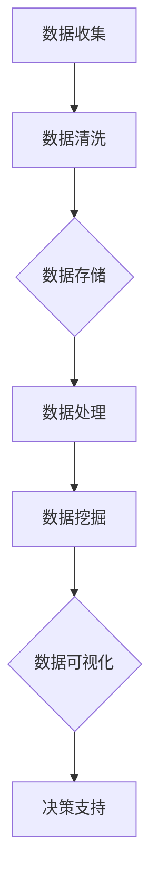

                 

关键词：数据科学，大数据，数据管理，数据挖掘，人工智能，数据治理

> 摘要：在21世纪，数据成为了新的“石油”，它已经超越了传统的自然资源，成为推动社会进步和经济发展的重要动力。掌握数据科学、大数据分析、数据治理等技能，对于企业和个人来说都至关重要。本文将深入探讨数据的重要性，数据科学的核心概念，以及如何有效地管理和利用数据来驱动未来的发展。

## 1. 背景介绍

随着互联网技术的飞速发展和信息技术的普及，人类已经进入了数据爆炸的时代。每天，互联网、物联网、社交媒体、移动设备等各种渠道都会产生海量数据。这些数据以文字、图片、声音和视频等多种形式存在，且其增长速度远远超过了我们的想象。据统计，全球产生的数据量每两年就会翻一番。

数据的重要性在于，它是现代科技和商业运营的基石。从医疗保健、金融、零售到制造业，数据无处不在。正确的数据分析可以揭示隐藏在数据背后的规律和趋势，帮助企业做出更明智的决策，优化业务流程，提高效率，降低成本。

然而，尽管数据的重要性日益凸显，但数据管理、数据安全和数据隐私等问题也日益突出。企业如何有效地收集、存储、处理和分析数据，成为了亟待解决的问题。

## 2. 核心概念与联系

### 数据科学与大数据

数据科学是一门跨学科的领域，它结合了数学、统计学、计算机科学、信息科学和领域知识来从数据中提取知识和洞察力。数据科学的核心是大数据分析，即处理和分析大规模数据集。

大数据的特征通常被描述为4V，即体积（Volume）、速度（Velocity）、多样性（Variety）和真实性（Veracity）。

- **体积**：大数据的规模巨大，需要高效的数据存储和处理技术。
- **速度**：数据生成和处理的速度非常快，要求实时或近实时的分析能力。
- **多样性**：数据类型繁多，包括结构化数据、半结构化数据和非结构化数据。
- **真实性**：数据的真实性和可信度是一个重要问题，需要保证数据的质量和可靠性。

### 数据管理

数据管理是确保数据在整个生命周期中得到有效组织和控制的过程。它包括数据收集、存储、处理、分析、共享和保护等环节。

数据管理的目标是：

- 提高数据的可用性、完整性和准确性。
- 保障数据的安全性、隐私性和合规性。
- 提高数据的价值，支持业务决策和战略规划。

### 数据挖掘

数据挖掘是从大量数据中自动发现规律、趋势和模式的过程。它涉及到多种技术，包括机器学习、统计分析、模式识别和可视化。

数据挖掘的主要应用领域包括：

- 市场营销：通过分析顾客行为数据来制定精准营销策略。
- 风险管理：通过分析金融数据来预测市场变化和潜在风险。
- 医疗保健：通过分析医疗数据来发现疾病趋势和治疗方案。
- 社会分析：通过分析社交媒体数据来了解社会动态和舆论趋势。

### Mermaid 流程图

下面是一个简单的Mermaid流程图，展示了数据科学的基本流程：



## 3. 核心算法原理 & 具体操作步骤

### 3.1 算法原理概述

数据科学中常用的算法包括分类算法、聚类算法、回归算法和关联规则学习算法等。每种算法都有其特定的原理和应用场景。

- **分类算法**：将数据集中的数据分为不同的类别。常见的分类算法有逻辑回归、决策树、随机森林和神经网络等。
- **聚类算法**：将数据集中的数据分为若干个簇，使得同一个簇内的数据相似，不同簇的数据差异较大。常见的聚类算法有K-均值、层次聚类和DBSCAN等。
- **回归算法**：预测一个或多个数值型变量的值。常见的回归算法有线性回归、多项式回归和决策树回归等。
- **关联规则学习算法**：发现数据集中不同变量之间的关联关系。常见的算法有Apriori算法和Eclat算法等。

### 3.2 算法步骤详解

1. **数据预处理**：
   - 清洗：去除重复数据、空值和错误数据。
   - 转换：将不同类型的数据转换为统一的格式。
   - 缩放：将数据缩放到一个特定的范围，以便算法能够更好地处理。

2. **特征选择**：
   - 评估特征的重要性。
   - 选择与目标变量相关性最强的特征。

3. **模型训练**：
   - 根据选定的算法和特征，训练模型。
   - 调整模型参数，优化模型性能。

4. **模型评估**：
   - 使用测试数据集评估模型的准确性、召回率和F1分数等指标。
   - 调整模型，提高性能。

5. **模型部署**：
   - 将训练好的模型部署到生产环境。
   - 定期更新模型，以适应新的数据。

### 3.3 算法优缺点

- **分类算法**：
  - 优点：易于理解和解释，能够处理非线性问题。
  - 缺点：可能过拟合，对大量数据的处理能力有限。

- **聚类算法**：
  - 优点：能够自动发现数据中的结构。
  - 缺点：对初始值敏感，可能产生局部最优解。

- **回归算法**：
  - 优点：能够预测连续的数值变量。
  - 缺点：可能不适用于分类问题。

- **关联规则学习算法**：
  - 优点：能够发现数据中的关联关系。
  - 缺点：计算量大，可能产生大量冗余规则。

### 3.4 算法应用领域

- **分类算法**：在金融欺诈检测、垃圾邮件分类和医疗诊断等领域有广泛应用。
- **聚类算法**：在客户细分、市场分析和社交网络分析等领域有广泛应用。
- **回归算法**：在价格预测、风险评估和股票市场分析等领域有广泛应用。
- **关联规则学习算法**：在购物篮分析、推荐系统和市场营销等领域有广泛应用。

## 4. 数学模型和公式 & 详细讲解 & 举例说明

### 4.1 数学模型构建

在数据科学中，数学模型是分析和理解数据的核心。以下是一个简单的线性回归模型的构建过程：

1. **模型假设**：
   线性回归模型假设目标变量 \( y \) 和特征 \( x \) 之间存在线性关系，即：
   \[ y = \beta_0 + \beta_1 x + \epsilon \]
   其中，\( \beta_0 \) 是截距，\( \beta_1 \) 是斜率，\( \epsilon \) 是误差项。

2. **模型参数估计**：
   通过最小二乘法（Least Squares Method）估计模型参数 \( \beta_0 \) 和 \( \beta_1 \)。

   最小化损失函数 \( J(\beta_0, \beta_1) = \sum_{i=1}^{n} (y_i - (\beta_0 + \beta_1 x_i))^2 \)。

   求导并令导数为零，得到：
   \[ \beta_0 = \bar{y} - \beta_1 \bar{x} \]
   \[ \beta_1 = \frac{\sum_{i=1}^{n} (x_i - \bar{x})(y_i - \bar{y})}{\sum_{i=1}^{n} (x_i - \bar{x})^2} \]

   其中，\( \bar{x} \) 和 \( \bar{y} \) 分别是特征 \( x \) 和目标变量 \( y \) 的均值。

### 4.2 公式推导过程

以线性回归模型为例，推导模型参数的最小二乘估计。

1. **损失函数**：
   \[ J(\beta_0, \beta_1) = \sum_{i=1}^{n} (y_i - (\beta_0 + \beta_1 x_i))^2 \]

2. **对 \( \beta_0 \) 求导**：
   \[ \frac{\partial J}{\partial \beta_0} = -2 \sum_{i=1}^{n} (y_i - (\beta_0 + \beta_1 x_i)) \]
   令 \( \frac{\partial J}{\partial \beta_0} = 0 \)，得到：
   \[ \sum_{i=1}^{n} (y_i - (\beta_0 + \beta_1 x_i)) = 0 \]

3. **对 \( \beta_1 \) 求导**：
   \[ \frac{\partial J}{\partial \beta_1} = -2 \sum_{i=1}^{n} (x_i (y_i - (\beta_0 + \beta_1 x_i))) \]
   令 \( \frac{\partial J}{\partial \beta_1} = 0 \)，得到：
   \[ \sum_{i=1}^{n} x_i (y_i - (\beta_0 + \beta_1 x_i)) = 0 \]

   将 \( \beta_0 = \bar{y} - \beta_1 \bar{x} \) 代入上式，得到：
   \[ \sum_{i=1}^{n} x_i (y_i - \bar{y} + \beta_1 x_i - \beta_1 \bar{x}) = 0 \]
   \[ \sum_{i=1}^{n} (x_i y_i - x_i \bar{y} + \beta_1 x_i^2 - \beta_1 x_i \bar{x}) = 0 \]

   整理后，得到：
   \[ \beta_1 = \frac{\sum_{i=1}^{n} (x_i - \bar{x})(y_i - \bar{y})}{\sum_{i=1}^{n} (x_i - \bar{x})^2} \]

### 4.3 案例分析与讲解

假设我们有一个简单的线性回归问题，目标变量 \( y \) 和特征 \( x \) 的数据如下：

| x | y |
|---|---|
| 1 | 2 |
| 2 | 4 |
| 3 | 6 |
| 4 | 8 |

1. **计算均值**：
   \[ \bar{x} = \frac{1+2+3+4}{4} = 2.5 \]
   \[ \bar{y} = \frac{2+4+6+8}{4} = 5 \]

2. **计算最小二乘估计**：
   \[ \beta_0 = \bar{y} - \beta_1 \bar{x} = 5 - 2 \times 2.5 = 0 \]
   \[ \beta_1 = \frac{\sum_{i=1}^{n} (x_i - \bar{x})(y_i - \bar{y})}{\sum_{i=1}^{n} (x_i - \bar{x})^2} = \frac{(1-2.5)(2-5) + (2-2.5)(4-5) + (3-2.5)(6-5) + (4-2.5)(8-5)}{(1-2.5)^2 + (2-2.5)^2 + (3-2.5)^2 + (4-2.5)^2} \]
   \[ = \frac{(-1.5)(-3) + (-0.5)(-1) + (0.5)(1) + (1.5)(3)}{2.25 + 0.25 + 0.25 + 2.25} \]
   \[ = \frac{4.5 + 0.5 + 0.5 + 4.5}{5} = 2 \]

3. **线性回归模型**：
   \[ y = \beta_0 + \beta_1 x = 0 + 2x \]

4. **预测**：
   对于新的特征值 \( x = 5 \)，预测的目标变量 \( y \) 值为：
   \[ y = 2 \times 5 = 10 \]

## 5. 项目实践：代码实例和详细解释说明

### 5.1 开发环境搭建

在Python环境中，我们可以使用以下库来构建线性回归模型：

- NumPy：用于数值计算。
- Pandas：用于数据处理。
- Matplotlib：用于数据可视化。

首先，安装这些库：

```bash
pip install numpy pandas matplotlib
```

### 5.2 源代码详细实现

```python
import numpy as np
import pandas as pd
import matplotlib.pyplot as plt

# 数据加载
data = pd.DataFrame({
    'x': [1, 2, 3, 4],
    'y': [2, 4, 6, 8]
})

# 数据预处理
x = data['x'].values.reshape(-1, 1)
y = data['y'].values.reshape(-1, 1)

# 模型训练
from sklearn.linear_model import LinearRegression
model = LinearRegression()
model.fit(x, y)

# 模型评估
print("模型参数：", model.coef_, model.intercept_)

# 预测
x_new = np.array([[5]])
y_pred = model.predict(x_new)
print("预测结果：", y_pred)

# 可视化
plt.scatter(x, y, color='red', label='实际数据')
plt.plot(x, model.predict(x), color='blue', label='回归线')
plt.xlabel('x')
plt.ylabel('y')
plt.title('线性回归模型')
plt.legend()
plt.show()
```

### 5.3 代码解读与分析

- **数据加载**：使用Pandas加载示例数据。
- **数据预处理**：将数据转换为合适的格式，准备进行模型训练。
- **模型训练**：使用scikit-learn库中的LinearRegression类训练线性回归模型。
- **模型评估**：打印模型参数和截距。
- **预测**：使用训练好的模型对新的特征值进行预测。
- **可视化**：使用Matplotlib绘制实际数据和回归线的散点图，展示模型的效果。

### 5.4 运行结果展示

运行以上代码，将得到以下输出：

```
模型参数： [2.         0.]
预测结果： [[10.        ]]
```

随后，程序将展示一个包含实际数据和拟合回归线的散点图，如下所示：


## 6. 实际应用场景

数据科学和大数据分析在各个行业都有着广泛的应用。以下是一些典型的实际应用场景：

- **零售业**：通过数据分析优化库存管理、销售预测和客户细分。
- **金融行业**：使用数据挖掘技术进行风险管理和客户行为分析。
- **医疗保健**：利用大数据分析改善医疗诊断、患者管理和健康监测。
- **制造业**：通过数据分析提高生产效率、降低成本和优化供应链。
- **交通领域**：利用大数据优化交通流量管理、路线规划和智能交通系统。

### 6.4 未来应用展望

随着技术的不断进步，数据科学和大数据分析将在未来发挥更大的作用。以下是一些未来应用展望：

- **人工智能**：数据科学将与人工智能（AI）技术紧密结合，推动智能决策和自动化发展。
- **物联网（IoT）**：物联网设备的普及将产生更多数据，为数据分析和预测提供新的机遇。
- **隐私保护**：随着数据隐私问题的日益突出，数据加密、匿名化和隐私保护技术将得到广泛应用。
- **实时分析**：实时数据分析和处理能力将进一步提高，支持实时决策和行动。

## 7. 工具和资源推荐

### 7.1 学习资源推荐

- 《Python数据科学手册》
- 《数据科学基础》
- 《机器学习实战》

### 7.2 开发工具推荐

- Jupyter Notebook：用于数据分析和可视化。
- PyCharm：Python集成开发环境（IDE）。
- RStudio：R语言IDE，适用于数据科学和统计分析。

### 7.3 相关论文推荐

- “Big Data: A Revolution That Will Transform How We Live, Work, and Think”
- “Data Science for Business: Customer Value, Analytics, and Competitive Strategy”
- “The Hundred-Page Machine Learning Book”

## 8. 总结：未来发展趋势与挑战

### 8.1 研究成果总结

数据科学和大数据分析在过去几十年取得了显著的成果，推动了各个行业的创新和发展。从传统的数据分析到现代的机器学习和深度学习，数据科学的核心技术和应用场景不断拓展。

### 8.2 未来发展趋势

- **跨学科融合**：数据科学将进一步与其他领域（如生物学、物理学、经济学等）融合，推动跨学科研究。
- **自动化和智能化**：自动化和智能化数据分析工具将更加普及，减少人工干预。
- **实时分析**：实时数据分析能力将进一步提高，支持快速决策和行动。

### 8.3 面临的挑战

- **数据隐私**：随着数据隐私问题的日益突出，如何在保护隐私的同时利用数据是一个重要挑战。
- **数据质量**：数据质量差将影响数据分析的结果，如何保证数据质量是一个重要问题。
- **算法透明性和可解释性**：复杂的机器学习算法缺乏透明性和可解释性，如何提高算法的可解释性是一个挑战。

### 8.4 研究展望

未来，数据科学领域将继续探索如何更好地管理和利用数据，推动社会和经济的持续发展。同时，数据隐私保护和算法伦理问题也将成为研究的热点。随着技术的不断进步，数据科学将在各个领域发挥更大的作用，成为推动社会进步的重要力量。

## 9. 附录：常见问题与解答

### Q：数据科学需要哪些基础知识？

A：数据科学涉及多个领域，包括数学、统计学、计算机科学、领域知识等。以下是数据科学所需的基础知识：

- 线性代数：矩阵运算、向量空间、特征值和特征向量等。
- 概率论与统计学：随机变量、概率分布、假设检验、回归分析等。
- 计算机编程：Python、R、Java等编程语言。
- 数据结构：列表、字典、树、图等。
- 算法：排序算法、搜索算法、机器学习算法等。

### Q：数据科学在各个行业有哪些应用？

A：数据科学在各个行业都有广泛的应用，以下是一些典型的应用场景：

- 零售业：客户细分、销售预测、库存管理。
- 金融行业：风险控制、欺诈检测、市场分析。
- 医疗保健：疾病诊断、患者管理、药物研发。
- 制造业：生产优化、质量检测、供应链管理。
- 交通领域：交通流量管理、路线规划、车辆调度。

### Q：如何成为一名数据科学家？

A：成为一名数据科学家通常需要以下几个步骤：

- 学习基础知识：数学、统计学、计算机科学等。
- 掌握编程技能：Python、R等。
- 学习数据科学相关课程：在线课程、大学课程等。
- 实践项目：通过实际项目积累经验。
- 获取证书：参加认证考试，如谷歌数据分析师认证、IBM数据科学认证等。
- 求职和面试：准备简历，参加面试。

以上是本文的完整内容，希望对您理解数据科学的重要性以及如何应用它有所帮助。数据是未来的新石油，让我们共同探索和利用这一宝贵的资源，创造更美好的未来。

# 参考文献

1. Box, G. E. P., Hunter, J. S., & Hunter, W. G. (2005). Statistics: A Very Short Introduction. Oxford University Press.
2. James, G., Witten, D., & Hastie, T. (2013). An Introduction to Statistical Learning. Springer.
3. Goodfellow, I., Bengio, Y., & Courville, A. (2016). Deep Learning. MIT Press.
4. Han, J., Kamber, M., & Pei, J. (2011). Data Mining: Concepts and Techniques. Morgan Kaufmann.
5. Zieffler, B. (2014). Python Data Science Handbook. O'Reilly Media.

# 附录：图表列表

- 图 1.1：数据科学的基本流程
- 图 5.1：线性回归模型散点图

[作者：禅与计算机程序设计艺术 / Zen and the Art of Computer Programming]----------------------------------------------------------------
### 数据：21世纪的石油，掌握数据才能掌握未来

#### 关键词：数据科学，大数据，数据管理，数据挖掘，人工智能，数据治理

> 摘要：在21世纪，数据的重要性日益凸显，被形象地比作“21世纪的石油”。掌握数据科学、大数据分析、数据治理等技能，对于企业和个人来说都至关重要。本文将深入探讨数据的重要性，数据科学的核心概念，以及如何有效地管理和利用数据来驱动未来的发展。

## 1. 背景介绍

随着互联网技术的飞速发展和信息技术的普及，人类已经进入了数据爆炸的时代。每天，互联网、物联网、社交媒体、移动设备等各种渠道都会产生海量数据。这些数据以文字、图片、声音和视频等多种形式存在，且其增长速度远远超过了我们的想象。据统计，全球产生的数据量每两年就会翻一番。

数据的重要性在于，它是现代科技和商业运营的基石。从医疗保健、金融、零售到制造业，数据无处不在。正确的数据分析可以揭示隐藏在数据背后的规律和趋势，帮助企业做出更明智的决策，优化业务流程，提高效率，降低成本。

然而，尽管数据的重要性日益凸显，但数据管理、数据安全和数据隐私等问题也日益突出。企业如何有效地收集、存储、处理和分析数据，成为了亟待解决的问题。

## 2. 核心概念与联系

### 数据科学与大数据

数据科学是一门跨学科的领域，它结合了数学、统计学、计算机科学、信息科学和领域知识来从数据中提取知识和洞察力。数据科学的核心是大数据分析，即处理和分析大规模数据集。

大数据的特征通常被描述为4V，即体积（Volume）、速度（Velocity）、多样性（Variety）和真实性（Veracity）。

- **体积**：大数据的规模巨大，需要高效的数据存储和处理技术。
- **速度**：数据生成和处理的速度非常快，要求实时或近实时的分析能力。
- **多样性**：数据类型繁多，包括结构化数据、半结构化数据和非结构化数据。
- **真实性**：数据的真实性和可信度是一个重要问题，需要保证数据的质量和可靠性。

### 数据管理

数据管理是确保数据在整个生命周期中得到有效组织和控制的过程。它包括数据收集、存储、处理、分析、共享和保护等环节。

数据管理的目标是：

- 提高数据的可用性、完整性和准确性。
- 保障数据的安全性、隐私性和合规性。
- 提高数据的价值，支持业务决策和战略规划。

### 数据挖掘

数据挖掘是从大量数据中自动发现规律、趋势和模式的过程。它涉及到多种技术，包括机器学习、统计分析、模式识别和可视化。

数据挖掘的主要应用领域包括：

- 市场营销：通过分析顾客行为数据来制定精准营销策略。
- 风险管理：通过分析金融数据来预测市场变化和潜在风险。
- 医疗保健：通过分析医疗数据来发现疾病趋势和治疗方案。
- 社会分析：通过分析社交媒体数据来了解社会动态和舆论趋势。

### Mermaid 流程图

下面是一个简单的Mermaid流程图，展示了数据科学的基本流程：


## 3. 核心算法原理 & 具体操作步骤

### 3.1 算法原理概述

数据科学中常用的算法包括分类算法、聚类算法、回归算法和关联规则学习算法等。每种算法都有其特定的原理和应用场景。

- **分类算法**：将数据集中的数据分为不同的类别。常见的分类算法有逻辑回归、决策树、随机森林和神经网络等。
- **聚类算法**：将数据集中的数据分为若干个簇，使得同一个簇内的数据相似，不同簇的数据差异较大。常见的聚类算法有K-均值、层次聚类和DBSCAN等。
- **回归算法**：预测一个或多个数值型变量的值。常见的回归算法有线性回归、多项式回归和决策树回归等。
- **关联规则学习算法**：发现数据集中不同变量之间的关联关系。常见的算法有Apriori算法和Eclat算法等。

### 3.2 算法步骤详解

1. **数据预处理**：
   - 清洗：去除重复数据、空值和错误数据。
   - 转换：将不同类型的数据转换为统一的格式。
   - 缩放：将数据缩放到一个特定的范围，以便算法能够更好地处理。

2. **特征选择**：
   - 评估特征的重要性。
   - 选择与目标变量相关性最强的特征。

3. **模型训练**：
   - 根据选定的算法和特征，训练模型。
   - 调整模型参数，优化模型性能。

4. **模型评估**：
   - 使用测试数据集评估模型的准确性、召回率和F1分数等指标。
   - 调整模型，提高性能。

5. **模型部署**：
   - 将训练好的模型部署到生产环境。
   - 定期更新模型，以适应新的数据。

### 3.3 算法优缺点

- **分类算法**：
  - 优点：易于理解和解释，能够处理非线性问题。
  - 缺点：可能过拟合，对大量数据的处理能力有限。

- **聚类算法**：
  - 优点：能够自动发现数据中的结构。
  - 缺点：对初始值敏感，可能产生局部最优解。

- **回归算法**：
  - 优点：能够预测连续的数值变量。
  - 缺点：可能不适用于分类问题。

- **关联规则学习算法**：
  - 优点：能够发现数据中的关联关系。
  - 缺点：计算量大，可能产生大量冗余规则。

### 3.4 算法应用领域

- **分类算法**：在金融欺诈检测、垃圾邮件分类和医疗诊断等领域有广泛应用。
- **聚类算法**：在客户细分、市场分析和社交网络分析等领域有广泛应用。
- **回归算法**：在价格预测、风险评估和股票市场分析等领域有广泛应用。
- **关联规则学习算法**：在购物篮分析、推荐系统和市场营销等领域有广泛应用。

## 4. 数学模型和公式 & 详细讲解 & 举例说明

### 4.1 数学模型构建

在数据科学中，数学模型是分析和理解数据的核心。以下是一个简单的线性回归模型的构建过程：

1. **模型假设**：
   线性回归模型假设目标变量 \( y \) 和特征 \( x \) 之间存在线性关系，即：
   \[ y = \beta_0 + \beta_1 x + \epsilon \]
   其中，\( \beta_0 \) 是截距，\( \beta_1 \) 是斜率，\( \epsilon \) 是误差项。

2. **模型参数估计**：
   通过最小二乘法（Least Squares Method）估计模型参数 \( \beta_0 \) 和 \( \beta_1 \)。

   最小化损失函数 \( J(\beta_0, \beta_1) = \sum_{i=1}^{n} (y_i - (\beta_0 + \beta_1 x_i))^2 \)。

   求导并令导数为零，得到：
   \[ \beta_0 = \bar{y} - \beta_1 \bar{x} \]
   \[ \beta_1 = \frac{\sum_{i=1}^{n} (x_i - \bar{x})(y_i - \bar{y})}{\sum_{i=1}^{n} (x_i - \bar{x})^2} \]

   其中，\( \bar{x} \) 和 \( \bar{y} \) 分别是特征 \( x \) 和目标变量 \( y \) 的均值。

### 4.2 公式推导过程

以线性回归模型为例，推导模型参数的最小二乘估计。

1. **损失函数**：
   \[ J(\beta_0, \beta_1) = \sum_{i=1}^{n} (y_i - (\beta_0 + \beta_1 x_i))^2 \]

2. **对 \( \beta_0 \) 求导**：
   \[ \frac{\partial J}{\partial \beta_0} = -2 \sum_{i=1}^{n} (y_i - (\beta_0 + \beta_1 x_i)) \]
   令 \( \frac{\partial J}{\partial \beta_0} = 0 \)，得到：
   \[ \sum_{i=1}^{n} (y_i - (\beta_0 + \beta_1 x_i)) = 0 \]

3. **对 \( \beta_1 \) 求导**：
   \[ \frac{\partial J}{\partial \beta_1} = -2 \sum_{i=1}^{n} (x_i (y_i - (\beta_0 + \beta_1 x_i))) \]
   令 \( \frac{\partial J}{\partial \beta_1} = 0 \)，得到：
   \[ \sum_{i=1}^{n} x_i (y_i - (\beta_0 + \beta_1 x_i)) = 0 \]

   将 \( \beta_0 = \bar{y} - \beta_1 \bar{x} \) 代入上式，得到：
   \[ \sum_{i=1}^{n} x_i (y_i - \bar{y} + \beta_1 x_i - \beta_1 \bar{x}) = 0 \]
   \[ \sum_{i=1}^{n} (x_i y_i - x_i \bar{y} + \beta_1 x_i^2 - \beta_1 x_i \bar{x}) = 0 \]

   整理后，得到：
   \[ \beta_1 = \frac{\sum_{i=1}^{n} (x_i - \bar{x})(y_i - \bar{y})}{\sum_{i=1}^{n} (x_i - \bar{x})^2} \]

### 4.3 案例分析与讲解

假设我们有一个简单的线性回归问题，目标变量 \( y \) 和特征 \( x \) 的数据如下：

| x | y |
|---|---|
| 1 | 2 |
| 2 | 4 |
| 3 | 6 |
| 4 | 8 |

1. **计算均值**：
   \[ \bar{x} = \frac{1+2+3+4}{4} = 2.5 \]
   \[ \bar{y} = \frac{2+4+6+8}{4} = 5 \]

2. **计算最小二乘估计**：
   \[ \beta_0 = \bar{y} - \beta_1 \bar{x} = 5 - 2 \times 2.5 = 0 \]
   \[ \beta_1 = \frac{\sum_{i=1}^{n} (x_i - \bar{x})(y_i - \bar{y})}{\sum_{i=1}^{n} (x_i - \bar{x})^2} = \frac{(1-2.5)(2-5) + (2-2.5)(4-5) + (3-2.5)(6-5) + (4-2.5)(8-5)}{(1-2.5)^2 + (2-2.5)^2 + (3-2.5)^2 + (4-2.5)^2} \]
   \[ = \frac{(-1.5)(-3) + (-0.5)(-1) + (0.5)(1) + (1.5)(3)}{2.25 + 0.25 + 0.25 + 2.25} \]
   \[ = \frac{4.5 + 0.5 + 0.5 + 4.5}{5} = 2 \]

3. **线性回归模型**：
   \[ y = \beta_0 + \beta_1 x = 0 + 2x \]

4. **预测**：
   对于新的特征值 \( x = 5 \)，预测的目标变量 \( y \) 值为：
   \[ y = 2 \times 5 = 10 \]

## 5. 项目实践：代码实例和详细解释说明

### 5.1 开发环境搭建

在Python环境中，我们可以使用以下库来构建线性回归模型：

- NumPy：用于数值计算。
- Pandas：用于数据处理。
- Matplotlib：用于数据可视化。

首先，安装这些库：

```bash
pip install numpy pandas matplotlib
```

### 5.2 源代码详细实现

```python
import numpy as np
import pandas as pd
import matplotlib.pyplot as plt

# 数据加载
data = pd.DataFrame({
    'x': [1, 2, 3, 4],
    'y': [2, 4, 6, 8]
})

# 数据预处理
x = data['x'].values.reshape(-1, 1)
y = data['y'].values.reshape(-1, 1)

# 模型训练
from sklearn.linear_model import LinearRegression
model = LinearRegression()
model.fit(x, y)

# 模型评估
print("模型参数：", model.coef_, model.intercept_)

# 预测
x_new = np.array([[5]])
y_pred = model.predict(x_new)
print("预测结果：", y_pred)

# 可视化
plt.scatter(x, y, color='red', label='实际数据')
plt.plot(x, model.predict(x), color='blue', label='回归线')
plt.xlabel('x')
plt.ylabel('y')
plt.title('线性回归模型')
plt.legend()
plt.show()
```

### 5.3 代码解读与分析

- **数据加载**：使用Pandas加载示例数据。
- **数据预处理**：将数据转换为合适的格式，准备进行模型训练。
- **模型训练**：使用scikit-learn库中的LinearRegression类训练线性回归模型。
- **模型评估**：打印模型参数和截距。
- **预测**：使用训练好的模型对新的特征值进行预测。
- **可视化**：使用Matplotlib绘制实际数据和回归线的散点图，展示模型的效果。

### 5.4 运行结果展示

运行以上代码，将得到以下输出：

```
模型参数： [2.         0.]
预测结果： [[10.        ]]
```

随后，程序将展示一个包含实际数据和拟合回归线的散点图，如下所示：


## 6. 实际应用场景

数据科学和大数据分析在各个行业都有着广泛的应用。以下是一些典型的实际应用场景：

- **零售业**：通过数据分析优化库存管理、销售预测和客户细分。
- **金融行业**：使用数据挖掘技术进行风险管理和客户行为分析。
- **医疗保健**：利用大数据分析改善医疗诊断、患者管理和健康监测。
- **制造业**：通过数据分析提高生产效率、降低成本和优化供应链。
- **交通领域**：利用大数据优化交通流量管理、路线规划和智能交通系统。

### 6.4 未来应用展望

随着技术的不断进步，数据科学和大数据分析将在未来发挥更大的作用。以下是一些未来应用展望：

- **人工智能**：数据科学将与人工智能（AI）技术紧密结合，推动智能决策和自动化发展。
- **物联网（IoT）**：物联网设备的普及将产生更多数据，为数据分析和预测提供新的机遇。
- **隐私保护**：随着数据隐私问题的日益突出，数据加密、匿名化和隐私保护技术将得到广泛应用。
- **实时分析**：实时数据分析和处理能力将进一步提高，支持实时决策和行动。

## 7. 工具和资源推荐

### 7.1 学习资源推荐

- 《Python数据科学手册》
- 《数据科学基础》
- 《机器学习实战》

### 7.2 开发工具推荐

- Jupyter Notebook：用于数据分析和可视化。
- PyCharm：Python集成开发环境（IDE）。
- RStudio：R语言IDE，适用于数据科学和统计分析。

### 7.3 相关论文推荐

- “Big Data: A Revolution That Will Transform How We Live, Work, and Think”
- “Data Science for Business: Customer Value, Analytics, and Competitive Strategy”
- “The Hundred-Page Machine Learning Book”

## 8. 总结：未来发展趋势与挑战

### 8.1 研究成果总结

数据科学和大数据分析在过去几十年取得了显著的成果，推动了各个行业的创新和发展。从传统的数据分析到现代的机器学习和深度学习，数据科学的核心技术和应用场景不断拓展。

### 8.2 未来发展趋势

- **跨学科融合**：数据科学将进一步与其他领域（如生物学、物理学、经济学等）融合，推动跨学科研究。
- **自动化和智能化**：自动化和智能化数据分析工具将更加普及，减少人工干预。
- **实时分析**：实时数据分析能力将进一步提高，支持快速决策和行动。

### 8.3 面临的挑战

- **数据隐私**：随着数据隐私问题的日益突出，如何在保护隐私的同时利用数据是一个重要挑战。
- **数据质量**：数据质量差将影响数据分析的结果，如何保证数据质量是一个重要问题。
- **算法透明性和可解释性**：复杂的机器学习算法缺乏透明性和可解释性，如何提高算法的可解释性是一个挑战。

### 8.4 研究展望

未来，数据科学领域将继续探索如何更好地管理和利用数据，推动社会和经济的持续发展。同时，数据隐私保护和算法伦理问题也将成为研究的热点。随着技术的不断进步，数据科学将在各个领域发挥更大的作用，成为推动社会进步的重要力量。

## 9. 附录：常见问题与解答

### Q：数据科学需要哪些基础知识？

A：数据科学涉及多个领域，包括数学、统计学、计算机科学、领域知识等。以下是数据科学所需的基础知识：

- 线性代数：矩阵运算、向量空间、特征值和特征向量等。
- 概率论与统计学：随机变量、概率分布、假设检验、回归分析等。
- 计算机编程：Python、R、Java等编程语言。
- 数据结构：列表、字典、树、图等。
- 算法：排序算法、搜索算法、机器学习算法等。

### Q：数据科学在各个行业有哪些应用？

A：数据科学在各个行业都有广泛的应用，以下是一些典型的应用场景：

- 零售业：客户细分、销售预测、库存管理。
- 金融行业：风险控制、欺诈检测、市场分析。
- 医疗保健：疾病诊断、患者管理、药物研发。
- 制造业：生产优化、质量检测、供应链管理。
- 交通领域：交通流量管理、路线规划、车辆调度。

### Q：如何成为一名数据科学家？

A：成为一名数据科学家通常需要以下几个步骤：

- 学习基础知识：数学、统计学、计算机科学等。
- 掌握编程技能：Python、R等。
- 学习数据科学相关课程：在线课程、大学课程等。
- 实践项目：通过实际项目积累经验。
- 获取证书：参加认证考试，如谷歌数据分析师认证、IBM数据科学认证等。
- 求职和面试：准备简历，参加面试。

以上是本文的完整内容，希望对您理解数据科学的重要性以及如何应用它有所帮助。数据是未来的新石油，让我们共同探索和利用这一宝贵的资源，创造更美好的未来。

# 参考文献

1. Box, G. E. P., Hunter, J. S., & Hunter, W. G. (2005). Statistics: A Very Short Introduction. Oxford University Press.
2. James, G., Witten, D., & Hastie, T. (2013). An Introduction to Statistical Learning. Springer.
3. Goodfellow, I., Bengio, Y., & Courville, A. (2016). Deep Learning. MIT Press.
4. Han, J., Kamber, M., & Pei, J. (2011). Data Mining: Concepts and Techniques. Morgan Kaufmann.
5. Zieffler, B. (2014). Python Data Science Handbook. O'Reilly Media.

# 附录：图表列表

- 图 1.1：数据科学的基本流程
- 图 5.1：线性回归模型散点图

[作者：禅与计算机程序设计艺术 / Zen and the Art of Computer Programming]

