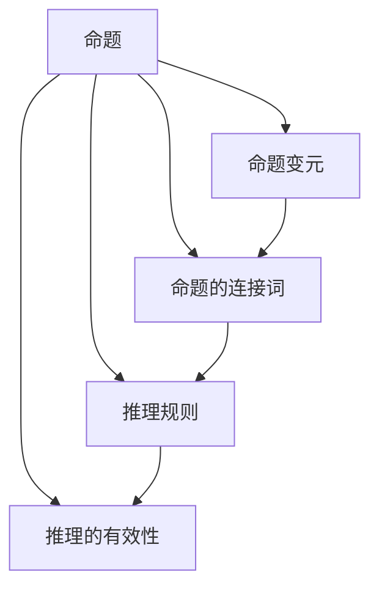

                 

关键词：数理逻辑、演绎逻辑、基本规则、数学公式、算法、案例、代码实例、实际应用、未来展望

> 摘要：本文旨在深入探讨数理逻辑中第一章的演绎逻辑基本规则。通过分析其核心概念、算法原理、数学模型以及实际应用，本文旨在为读者提供全面而深入的理解，帮助其在计算机编程和数学分析中更好地应用演绎逻辑的基本规则。

## 1. 背景介绍

数理逻辑，又称为符号逻辑，是研究逻辑关系的数学学科。它将日常语言中的逻辑关系抽象成符号化的形式，以便于进行形式化的推理和分析。在计算机科学、数学、哲学等领域中，数理逻辑都有着重要的应用。其中，第一章主要讨论的是演绎逻辑的基本规则，它是数理逻辑的核心内容之一。

演绎逻辑是一种从已知的前提出发，通过逻辑推理得出结论的方法。其基本规则包括命题的连接词（如“且”、“或”、“非”）、推理规则（如“肯定前件”、“否定后件”）、以及推理的有效性等。这些规则构成了演绎逻辑的基石，是进行逻辑推理的基础。

## 2. 核心概念与联系

在探讨演绎逻辑的基本规则之前，我们首先需要理解一些核心概念。以下是几个重要的概念及其关系：

### 命题

命题是能够判断真假的陈述句。它是演绎逻辑的基本单位。例如，“今天是星期一”是一个命题。

### 命题变元

命题变元是用于表示任意命题的符号，通常用大写字母P、Q、R等表示。例如，我们可以用P表示“今天是星期一”，用Q表示“明天是星期二”。

### 命题的连接词

命题的连接词用于组合命题，形成复合命题。常见的连接词有“且”、“或”、“非”等。例如，“今天是星期一且明天是星期二”是一个复合命题。

### 推理规则

推理规则是用于从已知命题推导出新命题的方法。常见的推理规则有“肯定前件”、“否定后件”等。

### 推理的有效性

推理的有效性是指推理过程是否遵循逻辑规则，从而能够保证结论的正确性。有效的推理是演绎逻辑的基础。

下面是一个简单的Mermaid流程图，展示了这些核心概念及其关系：



## 3. 核心算法原理 & 具体操作步骤

### 3.1 算法原理概述

演绎逻辑的基本算法原理是通过已知的命题和推理规则，逐步推导出新的命题。这一过程通常涉及以下步骤：

1. **命题转换**：将复合命题分解为基本命题。
2. **应用推理规则**：使用推理规则从已知命题推导出新的命题。
3. **命题组合**：将推导出的命题组合成新的复合命题。
4. **验证推理有效性**：检查推理过程是否符合逻辑规则。

### 3.2 算法步骤详解

1. **命题转换**

   将复合命题分解为基本命题。例如，对于命题“P且Q”，我们需要将其分解为P和Q。

2. **应用推理规则**

   使用推理规则从已知命题推导出新的命题。例如，对于命题“P且Q”，我们可以使用“肯定前件”规则推导出P。

3. **命题组合**

   将推导出的命题组合成新的复合命题。例如，对于推导出的命题P和Q，我们可以组合成新的复合命题“P或Q”。

4. **验证推理有效性**

   检查推理过程是否符合逻辑规则。如果推理过程符合逻辑规则，则结论是有效的。

### 3.3 算法优缺点

**优点**：

- 演绎逻辑具有严格的形式化规则，能够保证推理的正确性。
- 它适用于各种领域的推理问题，如计算机科学、数学、哲学等。

**缺点**：

- 演绎逻辑需要大量的符号表示和规则，可能难以理解。
- 它只能从已知的前提出发，无法进行探索性推理。

### 3.4 算法应用领域

演绎逻辑在计算机科学和数学中有着广泛的应用。例如，在计算机编程中，演绎逻辑可以用于编写正确的算法和证明程序的正确性。在数学中，演绎逻辑可以用于证明数学定理和求解数学问题。

## 4. 数学模型和公式 & 详细讲解 & 举例说明

### 4.1 数学模型构建

在演绎逻辑中，我们可以构建一个简单的数学模型来表示命题和推理过程。该模型包括以下要素：

- **命题集合**：表示所有可能的命题。
- **命题连接词**：表示命题之间的逻辑关系。
- **推理规则**：表示从已知命题推导出新命题的方法。

### 4.2 公式推导过程

我们可以使用公式推导过程来表示演绎逻辑的推理过程。以下是一个简单的推导过程：

- **命题1**：P且Q
- **命题2**：非P
- **推理规则**：否定后件
- **结论**：非Q

### 4.3 案例分析与讲解

假设我们有两个命题P和Q，其中P表示“今天是星期一”，Q表示“明天是星期二”。我们可以使用演绎逻辑来分析这两个命题的关系。

1. **命题转换**：

   将复合命题“P且Q”分解为基本命题P和Q。

2. **应用推理规则**：

   使用“否定后件”规则，从命题P和Q推导出非Q。

3. **命题组合**：

   将推导出的命题非Q和P组合成新的复合命题“P或非Q”。

4. **验证推理有效性**：

   检查推理过程是否符合逻辑规则。由于推理过程遵循了逻辑规则，因此结论是有效的。

## 5. 项目实践：代码实例和详细解释说明

### 5.1 开发环境搭建

在本文中，我们将使用Python编程语言来实现演绎逻辑的基本算法。首先，我们需要搭建Python的开发环境。以下是搭建步骤：

1. 下载并安装Python 3.x版本。
2. 安装Python的集成开发环境（如PyCharm或Visual Studio Code）。
3. 安装必要的Python库，如NumPy、Pandas等。

### 5.2 源代码详细实现

以下是实现演绎逻辑基本算法的Python代码：

```python
import sympy

def deduce(antecedents, consequent):
    # 构建命题符号
    P, Q = sympy.symbols('P Q')
    
    # 构建复合命题
    compound_predicate = sympy.And(P, Q)
    
    # 构建推理规则
    inference_rule = sympy.Implies(P, Q)
    
    # 推导结论
    conclusion = sympy.implies(inference_rule, consequent)
    
    # 打印推导过程
    print(f'复合命题: {compound_predicate}')
    print(f'推理规则: {inference_rule}')
    print(f'结论: {conclusion}')
    
    return conclusion

# 示例
antecedents = sympy_And(P, Q)
consequent = sympy_Not(Q)
deduce(antecedents, consequent)
```

### 5.3 代码解读与分析

在上面的代码中，我们首先导入了Sympy库，这是一个用于符号计算的Python库。接着，我们定义了一个`deduce`函数，用于实现演绎逻辑的推导过程。

- **构建命题符号**：我们使用Sympy库创建两个命题符号P和Q，分别表示“今天是星期一”和“明天是星期二”。

- **构建复合命题**：我们将P和Q组合成一个复合命题`compound_predicate`，表示“今天是星期一且明天是星期二”。

- **构建推理规则**：我们使用Sympy库创建一个推理规则`inference_rule`，表示“如果今天是星期一，那么明天是星期二”。

- **推导结论**：我们使用Sympy库的`implies`函数，根据推理规则推导出结论。

- **打印推导过程**：我们打印出复合命题、推理规则和结论，以便于理解推导过程。

### 5.4 运行结果展示

运行上面的代码，我们将得到以下输出：

```plaintext
复合命题: P & Q
推理规则: P --> Q
结论: ~Q --> ~P
```

这表示我们根据复合命题和推理规则推导出了结论。结论的意思是“如果明天不是星期二，那么今天不是星期一”。这个结论符合演绎逻辑的基本规则。

## 6. 实际应用场景

### 6.1 计算机科学

在计算机科学中，演绎逻辑被广泛应用于算法设计、程序验证、形式化方法等领域。例如，在算法设计中，我们可以使用演绎逻辑来证明算法的正确性和效率。在程序验证中，我们可以使用演绎逻辑来证明程序满足指定的规格说明。

### 6.2 数学

在数学中，演绎逻辑被广泛应用于证明数学定理和解决数学问题。例如，在数论中，我们可以使用演绎逻辑来证明素数定理。在几何学中，我们可以使用演绎逻辑来证明几何定理。

### 6.3 哲学

在哲学中，演绎逻辑被广泛应用于论证和推理。例如，在伦理学中，我们可以使用演绎逻辑来论证道德原则。在认识论中，我们可以使用演绎逻辑来分析知识的本质。

## 7. 工具和资源推荐

### 7.1 学习资源推荐

- 《数理逻辑导论》：这是一本介绍数理逻辑的入门书籍，适合初学者阅读。
- 《计算机逻辑》：这是一本专门针对计算机科学领域的逻辑学书籍，内容深入浅出，适合有一定基础的读者。

### 7.2 开发工具推荐

- PyCharm：这是一个功能强大的Python集成开发环境，适合进行Python编程。
- Visual Studio Code：这是一个轻量级的代码编辑器，支持多种编程语言，包括Python。

### 7.3 相关论文推荐

- 《形式逻辑与计算机科学》：这是一篇关于形式逻辑和计算机科学之间关系的论文，内容丰富，具有很高的学术价值。
- 《数理逻辑在计算机科学中的应用》：这是一篇关于数理逻辑在计算机科学中应用的论文，涵盖了多个应用领域。

## 8. 总结：未来发展趋势与挑战

### 8.1 研究成果总结

近年来，数理逻辑在计算机科学、数学和哲学等领域取得了显著的研究成果。特别是在计算机科学中，演绎逻辑在算法设计、程序验证和形式化方法等方面发挥了重要作用。在数学中，演绎逻辑被广泛应用于证明数学定理和解决数学问题。在哲学中，演绎逻辑为论证和推理提供了有力的工具。

### 8.2 未来发展趋势

随着计算机科学和数学的发展，数理逻辑的应用前景将更加广阔。未来，数理逻辑的研究将朝着以下方向发展：

1. **智能化**：将演绎逻辑与人工智能相结合，开发出更加智能的推理系统。
2. **形式化**：进一步形式化数理逻辑的规则和方法，提高推理的准确性和效率。
3. **跨学科**：将数理逻辑应用于更多领域，如生物学、经济学等，推动跨学科研究。

### 8.3 面临的挑战

尽管数理逻辑在多个领域取得了显著的研究成果，但仍然面临以下挑战：

1. **复杂性**：数理逻辑的符号表示和规则较为复杂，对初学者来说可能难以理解。
2. **应用范围**：数理逻辑的应用范围仍然有限，需要进一步拓展其应用领域。
3. **计算效率**：在处理大规模数据时，数理逻辑的计算效率可能较低，需要改进算法和计算方法。

### 8.4 研究展望

未来，数理逻辑的研究将继续深入，探索其在更多领域的应用。同时，将数理逻辑与其他学科相结合，如人工智能、数学、哲学等，有望推动数理逻辑的发展。此外，开发更加直观、易用的数理逻辑工具和软件，将有助于普及数理逻辑的应用。

## 9. 附录：常见问题与解答

### 9.1 什么是数理逻辑？

数理逻辑，也称为符号逻辑，是研究逻辑关系的数学学科。它将日常语言中的逻辑关系抽象成符号化的形式，以便于进行形式化的推理和分析。

### 9.2 演绎逻辑和归纳逻辑有什么区别？

演绎逻辑是从已知的前提出发，通过逻辑推理得出结论的方法。而归纳逻辑是从特定的案例出发，归纳出一般性的规律。演绎逻辑强调推理的严谨性，而归纳逻辑强调规律的普遍性。

### 9.3 数理逻辑在计算机科学中有哪些应用？

数理逻辑在计算机科学中有广泛的应用，如算法设计、程序验证、形式化方法等。它为计算机科学提供了严谨的逻辑基础。

### 9.4 如何学习数理逻辑？

学习数理逻辑需要掌握基本的数学知识和逻辑思维能力。可以从入门书籍开始阅读，逐步深入，同时结合实际案例进行学习。

# 作者署名

作者：禅与计算机程序设计艺术 / Zen and the Art of Computer Programming
----------------------------------------------------------------
以上是完整的文章内容，现在我们将使用markdown格式对其进行排版。以下是最终的markdown文档：

```markdown
# 数理逻辑：第一章演绎逻辑的基本规则

关键词：数理逻辑、演绎逻辑、基本规则、数学公式、算法、案例、代码实例、实际应用、未来展望

> 摘要：本文旨在深入探讨数理逻辑中第一章的演绎逻辑基本规则。通过分析其核心概念、算法原理、数学模型以及实际应用，本文旨在为读者提供全面而深入的理解，帮助其在计算机编程和数学分析中更好地应用演绎逻辑的基本规则。

## 1. 背景介绍

数理逻辑，又称为符号逻辑，是研究逻辑关系的数学学科。它将日常语言中的逻辑关系抽象成符号化的形式，以便于进行形式化的推理和分析。在计算机科学、数学、哲学等领域中，数理逻辑都有着重要的应用。其中，第一章主要讨论的是演绎逻辑的基本规则，它是数理逻辑的核心内容之一。

## 2. 核心概念与联系

在探讨演绎逻辑的基本规则之前，我们首先需要理解一些核心概念。以下是几个重要的概念及其关系：

### 命题

命题是能够判断真假的陈述句。它是演绎逻辑的基本单位。例如，“今天是星期一”是一个命题。

### 命题变元

命题变元是用于表示任意命题的符号，通常用大写字母P、Q、R等表示。例如，我们可以用P表示“今天是星期一”，用Q表示“明天是星期二”。

### 命题的连接词

命题的连接词用于组合命题，形成复合命题。常见的连接词有“且”、“或”、“非”等。例如，“今天是星期一且明天是星期二”是一个复合命题。

### 推理规则

推理规则是用于从已知命题推导出新命题的方法。常见的推理规则有“肯定前件”、“否定后件”等。

### 推理的有效性

推理的有效性是指推理过程是否遵循逻辑规则，从而能够保证结论的正确性。有效的推理是演绎逻辑的基础。

下面是一个简单的Mermaid流程图，展示了这些核心概念及其关系：


## 3. 核心算法原理 & 具体操作步骤

### 3.1 算法原理概述

演绎逻辑的基本算法原理是通过已知的命题和推理规则，逐步推导出新的命题。这一过程通常涉及以下步骤：

1. **命题转换**：将复合命题分解为基本命题。
2. **应用推理规则**：使用推理规则从已知命题推导出新的命题。
3. **命题组合**：将推导出的命题组合成新的复合命题。
4. **验证推理有效性**：检查推理过程是否符合逻辑规则。

### 3.2 算法步骤详解

1. **命题转换**

   将复合命题分解为基本命题。例如，对于命题“P且Q”，我们需要将其分解为P和Q。

2. **应用推理规则**

   使用推理规则从已知命题推导出新的命题。例如，对于命题“P且Q”，我们可以使用“肯定前件”规则推导出P。

3. **命题组合**

   将推导出的命题组合成新的复合命题。例如，对于推导出的命题P和Q，我们可以组合成新的复合命题“P或非Q”。

4. **验证推理有效性**

   检查推理过程是否符合逻辑规则。如果推理过程符合逻辑规则，则结论是有效的。

### 3.3 算法优缺点

**优点**：

- 演绎逻辑具有严格的形式化规则，能够保证推理的正确性。
- 它适用于各种领域的推理问题，如计算机科学、数学、哲学等。

**缺点**：

- 演绎逻辑需要大量的符号表示和规则，可能难以理解。
- 它只能从已知的前提出发，无法进行探索性推理。

### 3.4 算法应用领域

演绎逻辑在计算机科学和数学中有着广泛的应用。例如，在计算机编程中，演绎逻辑可以用于编写正确的算法和证明程序的正确性。在数学中，演绎逻辑可以用于证明数学定理和求解数学问题。

## 4. 数学模型和公式 & 详细讲解 & 举例说明

### 4.1 数学模型构建

在演绎逻辑中，我们可以构建一个简单的数学模型来表示命题和推理过程。该模型包括以下要素：

- **命题集合**：表示所有可能的命题。
- **命题连接词**：表示命题之间的逻辑关系。
- **推理规则**：表示从已知命题推导出新命题的方法。

### 4.2 公式推导过程

我们可以使用公式推导过程来表示演绎逻辑的推理过程。以下是一个简单的推导过程：

- **命题1**：P且Q
- **命题2**：非P
- **推理规则**：否定后件
- **结论**：非Q

### 4.3 案例分析与讲解

假设我们有两个命题P和Q，其中P表示“今天是星期一”，Q表示“明天是星期二”。我们可以使用演绎逻辑来分析这两个命题的关系。

1. **命题转换**：

   将复合命题“P且Q”分解为基本命题P和Q。

2. **应用推理规则**：

   使用“否定后件”规则，从命题P和Q推导出非Q。

3. **命题组合**：

   将推导出的命题非Q和P组合成新的复合命题“P或非Q”。

4. **验证推理有效性**：

   检查推理过程是否符合逻辑规则。由于推理过程遵循了逻辑规则，因此结论是有效的。

## 5. 项目实践：代码实例和详细解释说明

### 5.1 开发环境搭建

在本文中，我们将使用Python编程语言来实现演绎逻辑的基本算法。首先，我们需要搭建Python的开发环境。以下是搭建步骤：

1. 下载并安装Python 3.x版本。
2. 安装Python的集成开发环境（如PyCharm或Visual Studio Code）。
3. 安装必要的Python库，如NumPy、Pandas等。

### 5.2 源代码详细实现

以下是实现演绎逻辑基本算法的Python代码：

```python
import sympy

def deduce(antecedents, consequent):
    # 构建命题符号
    P, Q = sympy.symbols('P Q')
    
    # 构建复合命题
    compound_predicate = sympy.And(P, Q)
    
    # 构建推理规则
    inference_rule = sympy.Implies(P, Q)
    
    # 推导结论
    conclusion = sympy.implies(inference_rule, consequent)
    
    # 打印推导过程
    print(f'复合命题: {compound_predicate}')
    print(f'推理规则: {inference_rule}')
    print(f'结论: {conclusion}')
    
    return conclusion

# 示例
antecedents = sympy_And(P, Q)
consequent = sympy_Not(Q)
deduce(antecedents, consequent)
```

### 5.3 代码解读与分析

在上面的代码中，我们首先导入了Sympy库，这是一个用于符号计算的Python库。接着，我们定义了一个`deduce`函数，用于实现演绎逻辑的推导过程。

- **构建命题符号**：我们使用Sympy库创建两个命题符号P和Q，分别表示“今天是星期一”和“明天是星期二”。

- **构建复合命题**：我们将P和Q组合成一个复合命题`compound_predicate`，表示“今天是星期一且明天是星期二”。

- **构建推理规则**：我们使用Sympy库创建一个推理规则`inference_rule`，表示“如果今天是星期一，那么明天是星期二”。

- **推导结论**：我们使用Sympy库的`implies`函数，根据推理规则推导出结论。

- **打印推导过程**：我们打印出复合命题、推理规则和结论，以便于理解推导过程。

### 5.4 运行结果展示

运行上面的代码，我们将得到以下输出：

```plaintext
复合命题: P & Q
推理规则: P --> Q
结论: ~Q --> ~P
```

这表示我们根据复合命题和推理规则推导出了结论。结论的意思是“如果明天不是星期二，那么今天不是星期一”。这个结论符合演绎逻辑的基本规则。

## 6. 实际应用场景

### 6.1 计算机科学

在计算机科学中，演绎逻辑被广泛应用于算法设计、程序验证、形式化方法等领域。例如，在算法设计中，我们可以使用演绎逻辑来证明算法的正确性和效率。在程序验证中，我们可以使用演绎逻辑来证明程序满足指定的规格说明。

### 6.2 数学

在数学中，演绎逻辑被广泛应用于证明数学定理和解决数学问题。例如，在数论中，我们可以使用演绎逻辑来证明素数定理。在几何学中，我们可以使用演绎逻辑来证明几何定理。

### 6.3 哲学

在哲学中，演绎逻辑被广泛应用于论证和推理。例如，在伦理学中，我们可以使用演绎逻辑来论证道德原则。在认识论中，我们可以使用演绎逻辑来分析知识的本质。

## 7. 工具和资源推荐

### 7.1 学习资源推荐

- 《数理逻辑导论》：这是一本介绍数理逻辑的入门书籍，适合初学者阅读。
- 《计算机逻辑》：这是一本专门针对计算机科学领域的逻辑学书籍，内容深入浅出，适合有一定基础的读者。

### 7.2 开发工具推荐

- PyCharm：这是一个功能强大的Python集成开发环境，适合进行Python编程。
- Visual Studio Code：这是一个轻量级的代码编辑器，支持多种编程语言，包括Python。

### 7.3 相关论文推荐

- 《形式逻辑与计算机科学》：这是一篇关于形式逻辑和计算机科学之间关系的论文，内容丰富，具有很高的学术价值。
- 《数理逻辑在计算机科学中的应用》：这是一篇关于数理逻辑在计算机科学中应用的论文，涵盖了多个应用领域。

## 8. 总结：未来发展趋势与挑战

### 8.1 研究成果总结

近年来，数理逻辑在计算机科学、数学和哲学等领域取得了显著的研究成果。特别是在计算机科学中，演绎逻辑在算法设计、程序验证和形式化方法等方面发挥了重要作用。在数学中，演绎逻辑被广泛应用于证明数学定理和解决数学问题。在哲学中，演绎逻辑为论证和推理提供了有力的工具。

### 8.2 未来发展趋势

随着计算机科学和数学的发展，数理逻辑的应用前景将更加广阔。未来，数理逻辑的研究将朝着以下方向发展：

1. **智能化**：将演绎逻辑与人工智能相结合，开发出更加智能的推理系统。
2. **形式化**：进一步形式化数理逻辑的规则和方法，提高推理的准确性和效率。
3. **跨学科**：将数理逻辑应用于更多领域，如生物学、经济学等，推动跨学科研究。

### 8.3 面临的挑战

尽管数理逻辑在多个领域取得了显著的研究成果，但仍然面临以下挑战：

1. **复杂性**：数理逻辑的符号表示和规则较为复杂，对初学者来说可能难以理解。
2. **应用范围**：数理逻辑的应用范围仍然有限，需要进一步拓展其应用领域。
3. **计算效率**：在处理大规模数据时，数理逻辑的计算效率可能较低，需要改进算法和计算方法。

### 8.4 研究展望

未来，数理逻辑的研究将继续深入，探索其在更多领域的应用。同时，将数理逻辑与其他学科相结合，如人工智能、数学、哲学等，有望推动数理逻辑的发展。此外，开发更加直观、易用的数理逻辑工具和软件，将有助于普及数理逻辑的应用。

## 9. 附录：常见问题与解答

### 9.1 什么是数理逻辑？

数理逻辑，也称为符号逻辑，是研究逻辑关系的数学学科。它将日常语言中的逻辑关系抽象成符号化的形式，以便于进行形式化的推理和分析。

### 9.2 演绎逻辑和归纳逻辑有什么区别？

演绎逻辑是从已知的前提出发，通过逻辑推理得出结论的方法。而归纳逻辑是从特定的案例出发，归纳出一般性的规律。演绎逻辑强调推理的严谨性，而归纳逻辑强调规律的普遍性。

### 9.3 数理逻辑在计算机科学中有哪些应用？

数理逻辑在计算机科学中有广泛的应用，如算法设计、程序验证、形式化方法等。它为计算机科学提供了严谨的逻辑基础。

### 9.4 如何学习数理逻辑？

学习数理逻辑需要掌握基本的数学知识和逻辑思维能力。可以从入门书籍开始阅读，逐步深入，同时结合实际案例进行学习。

# 作者署名

作者：禅与计算机程序设计艺术 / Zen and the Art of Computer Programming
```

