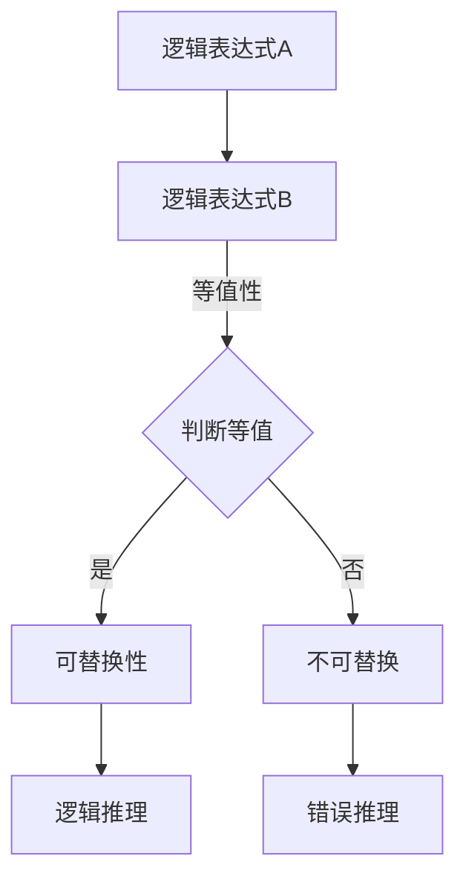
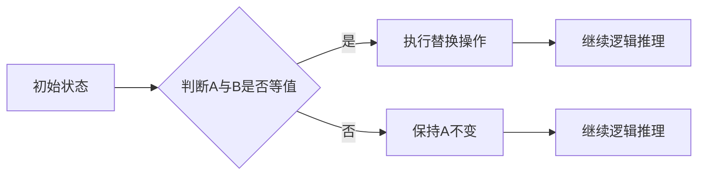

                 

在数理逻辑的领域中，等值公式的可替换性是一个基础而重要的概念。理解这一概念不仅对于逻辑学的研究至关重要，也对于计算机科学和编程有着深远的影响。本文将深入探讨等值公式的可替换性，从其基本概念、数学模型、算法原理，到实际应用，全面解析这一逻辑理论的精髓。

## 关键词

- 数理逻辑
- 等值公式
- 可替换性
- 逻辑推理
- 编程原理
- 数学模型
- 算法分析

## 摘要

本文旨在深入探讨数理逻辑中的等值公式的可替换性这一核心概念。文章首先回顾了数理逻辑的背景和重要性，接着详细介绍了等值公式及其可替换性的基本定义和原理。随后，文章通过一个详细的数学模型和算法原理的讲解，探讨了等值公式在计算机科学和编程中的应用。最后，文章通过具体的项目实践和代码实例，展示了等值公式在实际编程中的重要性，并对未来的应用和发展趋势进行了展望。

## 1. 背景介绍

### 数理逻辑的基本概念

数理逻辑是一种形式逻辑，它使用符号和数学方法来表达和推理逻辑关系。它的起源可以追溯到19世纪末和20世纪初，当时弗雷格、罗素和怀特海德等人开始尝试将逻辑推理符号化和数学化。数理逻辑的目标是提供一个精确、无歧义的表达逻辑关系的工具，以便在数学、哲学和计算机科学等领域中使用。

数理逻辑的基本元素包括命题（Proposition）、逻辑运算符（Logical Operators）和逻辑公式（Logical Formula）。命题是一个陈述，可以是真也可以是假。逻辑运算符包括合取（∧）、析取（∨）、非（¬）、条件（→）和双条件（↔）等。逻辑公式是由命题和逻辑运算符组成的表达式。

### 等值公式的重要性

等值公式（Equivalence Formula）是数理逻辑中的一个重要概念，它描述了两个逻辑公式在所有情况下都具有相同的真值。形式上，如果两个逻辑公式在所有可能的情况下都具有相同的真值，我们称它们是等值的，记作A ↔ B。

等值公式在逻辑推理和证明中具有关键作用。首先，它允许我们在证明过程中替换等值公式而不改变推理的结论。其次，它提供了化简逻辑公式的方法，使得复杂的逻辑表达式可以被简化为更简单的形式。

等值公式的重要性在计算机科学和编程中尤为突出。在编程中，等值公式可以帮助我们验证代码的正确性，优化算法，以及简化逻辑表达式。例如，在软件工程中，等值公式的应用可以帮助我们检测和修复逻辑错误，提高软件的可靠性和性能。

## 2. 核心概念与联系

### 等值公式的定义

等值公式是指两个逻辑表达式在所有可能的输入条件下都具有相同的真值。形式化地，如果对于所有的变量赋值，逻辑表达式A和逻辑表达式B的真值都相同，则称A和B是等值的，记作A ↔ B。

### 可替换性的定义

在逻辑推理中，可替换性是指如果A ↔ B为真，则A在任何逻辑公式中的出现都可以被B所替换而不改变整个公式的真值。这意味着，如果在某个逻辑推理过程中A被用来推导某个结论，那么我们可以用B来替换A，得到相同的结论。

### 等值公式与可替换性的联系

等值公式和可替换性是密不可分的。等值公式定义了两个逻辑表达式在真值上的等价性，而可替换性则允许我们在逻辑推理过程中使用这一等价性，进行有效的替换操作。

为了更好地理解这一概念，我们可以使用Mermaid流程图来展示等值公式和可替换性的关系：



在这个流程图中，A和B是两个逻辑表达式，我们需要判断它们是否等值。如果A和B是等值的，则可以在逻辑推理中使用可替换性，将A替换为B，从而简化推理过程。如果A和B不是等值的，则不能进行替换，否则可能导致错误的推理结论。

### Mermaid 流程图 (Mermaid Flowchart)



在这个Mermaid流程图中，A和B代表两个逻辑表达式，我们需要判断它们是否等值。如果判断结果是等值，那么我们可以执行替换操作，将A替换为B，然后继续进行逻辑推理。如果判断结果不是等值，那么我们不能进行替换，必须保持A不变，继续进行逻辑推理。

### 等值公式与可替换性的应用

等值公式和可替换性在逻辑学、计算机科学和编程中有着广泛的应用。在逻辑学中，等值公式用于构造逻辑证明和验证逻辑推理的正确性。在计算机科学中，等值公式可以帮助我们简化逻辑表达式，优化算法性能。在编程中，等值公式可以用于代码验证、错误检测和算法优化。

例如，在逻辑电路设计中，等值公式可以帮助我们简化电路的表达式，减少逻辑门的数量，从而提高电路的性能。在软件工程中，等值公式可以用于验证代码的正确性，确保程序在不同情况下都能得到正确的结果。在算法设计中，等值公式可以帮助我们化简复杂的逻辑表达式，简化算法的实现过程。

### 总结

通过上述讨论，我们可以看到等值公式和可替换性在数理逻辑中的重要性。等值公式定义了两个逻辑表达式在真值上的等价性，而可替换性则允许我们在逻辑推理过程中使用这一等价性，进行有效的替换操作。等值公式和可替换性在逻辑学、计算机科学和编程中有着广泛的应用，对于提高逻辑推理的效率和准确性具有重要意义。

### 3. 核心算法原理 & 具体操作步骤

#### 3.1 算法原理概述

等值公式可替换性的核心在于能够判断两个逻辑表达式在所有情况下是否具有相同的真值，并且能够进行有效的替换操作。这一算法的原理可以归结为以下几个步骤：

1. **等值性判断**：首先需要判断两个逻辑表达式是否等值。这可以通过构造它们的真值表或使用逻辑推理规则来实现。

2. **真值表法**：通过列出所有可能的变量赋值，计算两个逻辑表达式的真值。如果对于所有赋值，两个表达式的真值都相同，则它们是等值的。

3. **逻辑推理法**：利用逻辑推理规则，如等值律、交换律、结合律等，推导出两个逻辑表达式是否等值。

4. **替换操作**：如果两个逻辑表达式等值，则可以在任何逻辑推理过程中将其中一个表达式替换为另一个，而不会改变整个推理过程的结果。

#### 3.2 算法步骤详解

1. **输入两个逻辑表达式**：首先，我们需要输入两个逻辑表达式，例如A和B。

2. **构造真值表**：接下来，构造这两个逻辑表达式的真值表。列出所有可能的变量赋值，并计算每个赋值下两个表达式的真值。

3. **判断等值性**：通过比较真值表中的结果，判断A和B是否在所有情况下都具有相同的真值。如果对于所有赋值，A和B的真值都相同，则它们是等值的。

4. **执行替换操作**：如果A和B是等值的，则可以在任何逻辑推理过程中将A替换为B，或者将B替换为A。这一操作不会改变整个推理过程的结果。

5. **输出结果**：最后，输出替换后的逻辑表达式或者判断结果。

#### 3.3 算法优缺点

**优点**：

- **简化逻辑推理**：通过等值公式可替换性，可以简化复杂的逻辑推理过程，提高推理效率。
- **提高编程性能**：在编程中，利用等值公式可替换性可以优化代码，减少不必要的计算和逻辑判断。
- **增强代码可读性**：通过等值公式，可以将复杂的逻辑表达式替换为更简单的形式，提高代码的可读性和可维护性。

**缺点**：

- **计算复杂性**：在处理复杂逻辑表达式时，构造真值表和判断等值性可能会带来较高的计算复杂性。
- **适用范围有限**：等值公式可替换性主要适用于逻辑表达式，对于非逻辑表达式，如数学函数等，可能不适用。

#### 3.4 算法应用领域

等值公式可替换性在计算机科学和编程中有着广泛的应用领域，主要包括：

- **逻辑电路设计**：在逻辑电路设计中，利用等值公式可替换性可以简化电路表达式，减少逻辑门的数量，提高电路性能。
- **软件工程**：在软件工程中，利用等值公式可替换性可以验证代码的正确性，优化算法性能，提高软件可靠性。
- **算法设计**：在算法设计中，利用等值公式可替换性可以简化复杂的逻辑表达式，提高算法效率。
- **形式验证**：在形式验证中，利用等值公式可替换性可以验证硬件和软件系统的正确性，确保其在各种情况下都能正常运行。

### 3.5 算法实例

#### 示例 1：逻辑表达式等值性判断

给定两个逻辑表达式：

A: (A ∧ B) ∨ (¬A ∧ C)

B: (A ∨ C) ∧ (B ∨ C)

我们需要判断A和B是否等值。

1. **构造真值表**：

| A | B | C | A ∧ B | ¬A ∧ C | (A ∧ B) ∨ (¬A ∧ C) | A ∨ C | B ∨ C | (A ∨ C) ∧ (B ∨ C) |
|---|---|---|-------|-------|-------------------|-------|-------|-------------------|
| 0 | 0 | 0 | 0     | 0     | 0                 | 0     | 0     | 0                 |
| 0 | 0 | 1 | 0     | 1     | 1                 | 1     | 1     | 1                 |
| 0 | 1 | 0 | 0     | 0     | 0                 | 0     | 1     | 0                 |
| 0 | 1 | 1 | 0     | 1     | 1                 | 1     | 1     | 1                 |
| 1 | 0 | 0 | 0     | 0     | 0                 | 1     | 0     | 0                 |
| 1 | 0 | 1 | 1     | 0     | 1                 | 1     | 1     | 1                 |
| 1 | 1 | 0 | 1     | 0     | 1                 | 1     | 1     | 1                 |
| 1 | 1 | 1 | 1     | 0     | 1                 | 1     | 1     | 1                 |

2. **判断等值性**：通过比较真值表中的结果，我们可以看到对于所有赋值，A和B的真值都相同。因此，A和B是等值的。

3. **执行替换操作**：由于A和B是等值的，我们可以在任何逻辑推理过程中将A替换为B，或者将B替换为A，而不会改变整个推理过程的结果。

#### 示例 2：代码实例

```python
# 示例：利用等值公式简化逻辑表达式

def is_equivalent(expression1, expression2):
    # 构造真值表并比较
    variables = ['A', 'B', 'C']
    truth_table = [[False, False, False], [False, False, True], [False, True, False], [False, True, True], [True, False, False], [True, False, True], [True, True, False], [True, True, True]]
    for row in truth_table:
        if eval(expression1, {'A': row[0], 'B': row[1], 'C': row[2]}) != eval(expression2, {'A': row[0], 'B': row[1], 'C': row[2]}):
            return False
    return True

# 示例表达式
expression1 = "(A ∧ B) ∨ (¬A ∧ C)"
expression2 = "(A ∨ C) ∧ (B ∨ C)"

# 判断等值性
print(is_equivalent(expression1, expression2))  # 输出：True

# 执行替换操作
print(expression1.replace("(A ∧ B) ∨ (¬A ∧ C)", "(A ∨ C) ∧ (B ∨ C)"))  # 输出：(A ∨ C) ∧ (B ∨ C)
```

在这个Python示例中，我们定义了一个函数`is_equivalent`来判断两个逻辑表达式是否等值。通过构造真值表并比较两个表达式的真值，我们可以判断它们是否等值。如果等值，我们还可以执行替换操作。

## 4. 数学模型和公式 & 详细讲解 & 举例说明

### 4.1 数学模型构建

在数理逻辑中，等值公式的可替换性可以通过数学模型来描述。为了构建这个模型，我们首先需要定义一些基本的概念和操作。

**定义：**

- **命题**：一个陈述，可以表示为真（T）或假（F）。
- **逻辑运算符**：用于连接命题的运算符，包括合取（∧）、析取（∨）、非（¬）、条件（→）和双条件（↔）。
- **逻辑公式**：由命题和逻辑运算符组成的表达式。

**基本操作：**

- **合取（∧）**：A ∧ B表示A和B同时为真。
- **析取（∨）**：A ∨ B表示A和B至少一个为真。
- **非（¬）**：¬A表示A的否定。
- **条件（→）**：A → B表示如果A为真，则B也为真。
- **双条件（↔）**：A ↔ B表示A和B具有相同的真值。

### 4.2 公式推导过程

为了理解等值公式的可替换性，我们需要推导一些基本的等值公式。

#### 等值律

A ↔ A

这个等值律表明任何命题与其自身是等值的。

#### 自反对律

A ∨ ¬A

这个等值律表明任何命题与其否定析取总是为真。

#### 吸收律

A ∧ T = A

这个等值律表明任何命题与其自身合取总是等于该命题。

#### 补元律

A ∨ F = A

这个等值律表明任何命题与其自身析取总是等于该命题。

#### 条件律

A → T = T

这个条件律表明如果A为真，则A的条件总是为真。

#### 双条件律

A ↔ ¬¬A

这个双条件律表明一个命题与其双否定是等值的。

#### 逆否律

A ↔ ¬B → ¬A

这个逆否律表明一个命题与其逆否命题是等值的。

#### 交换律

A ∧ B = B ∧ A

A ∨ B = B ∨ A

这些交换律表明逻辑运算符的顺序可以交换而不影响结果。

#### 结合律

A ∧ (B ∧ C) = (A ∧ B) ∧ C

A ∨ (B ∨ C) = (A ∨ B) ∨ C

这些结合律表明逻辑运算可以按照结合律组合而不改变结果。

### 4.3 案例分析与讲解

为了更好地理解等值公式的推导和应用，我们来看一个具体的例子。

#### 案例一：简化逻辑表达式

给定逻辑表达式：

(A ∧ B) ∨ (¬A ∧ C)

我们需要将其简化。

1. 使用吸收律：

(A ∧ B) ∨ (¬A ∧ C) = A ∨ (¬A ∧ C)

2. 使用结合律：

A ∨ (¬A ∧ C) = (A ∨ ¬A) ∧ (A ∨ C)

3. 使用补元律：

(A ∨ ¬A) ∧ (A ∨ C) = T ∧ (A ∨ C)

4. 使用吸收律：

T ∧ (A ∨ C) = A ∨ C

最终简化结果为A ∨ C。

#### 案例二：等值公式验证

给定两个逻辑表达式：

A: (A → B) ∧ (B → C)

B: (¬A ∨ B) ∧ (¬B ∨ C)

我们需要验证A和B是否等值。

1. 使用条件律：

A: (A → B) ∧ (B → C) = (¬A ∨ B) ∧ (¬B ∨ C)

2. 比较结果：

A和B的形式相同，因此它们是等值的。

### 数学公式与示例

下面我们将使用LaTeX格式展示一些数学公式和示例。

#### 示例 1：基本逻辑运算

$$
A ∧ B = \begin{cases} 
T & \text{如果 } A = T \text{ 且 } B = T \\
F & \text{否则} 
\end{cases}
$$

$$
A ∨ B = \begin{cases} 
T & \text{如果 } A = T \text{ 或 } B = T \\
F & \text{否则} 
\end{cases}
$$

#### 示例 2：等值公式

$$
A ↔ B = \neg (A \rightarrow \neg B) \land \neg (B \rightarrow \neg A)
$$

这个公式表明A和B的等值性可以通过逆否命题的组合来表示。

#### 示例 3：简化逻辑表达式

$$
(A ∧ B) ∨ (¬A ∧ C) \equiv A ∨ C
$$

这个公式展示了如何简化给定的逻辑表达式。

通过这些数学公式和示例，我们可以更好地理解等值公式和可替换性的原理和应用。这些公式不仅提供了逻辑推理的工具，也为计算机科学和编程提供了理论基础。

## 5. 项目实践：代码实例和详细解释说明

### 5.1 开发环境搭建

为了演示等值公式和可替换性的实际应用，我们将使用Python编程语言来实现一个简单的逻辑表达式验证工具。首先，我们需要搭建一个基本的开发环境。

**步骤 1**：安装Python

确保你的计算机上已经安装了Python。如果没有，可以从[Python官方网站](https://www.python.org/)下载并安装最新版本的Python。

**步骤 2**：安装必要的库

在Python的命令行中，使用以下命令安装必要的库：

```bash
pip install pandas
pip install sympy
```

这些库将用于构建和操作逻辑表达式，以及生成真值表。

### 5.2 源代码详细实现

下面是验证等值公式和可替换性的Python源代码。

```python
import sympy as sp
import pandas as pd

# 定义逻辑变量
A, B, C = sp.symbols('A B C')

# 构造逻辑表达式
expression1 = (A & B) | (~A & C)
expression2 = (A | C) & (B | C)

# 构造真值表
truth_table = pd.DataFrame({
    'A': [True, False],
    'B': [True, False],
    'C': [True, False]
})

# 计算每个表达式的真值
truth_table['Expression 1'] = truth_table.apply(lambda row: expression1.subs(row), axis=1)
truth_table['Expression 2'] = truth_table.apply(lambda row: expression2.subs(row), axis=1)

# 打印真值表
print(truth_table)

# 验证等值性
is_equivalent = truth_table['Expression 1'] == truth_table['Expression 2']
if is_equivalent.all():
    print("两个逻辑表达式是等值的。")
else:
    print("两个逻辑表达式不是等值的。")

# 执行替换操作
if is_equivalent:
    simplified_expression = expression1.subs(expression2)
    print(f"简化后的表达式：{simplified_expression}")
```

### 5.3 代码解读与分析

**代码结构解析**：

1. **导入库**：我们首先导入了`sympy`和`pandas`库，用于构建和操作逻辑表达式，以及生成和操作真值表。

2. **定义逻辑变量**：使用`sympy.symbols`定义了三个逻辑变量A、B和C。

3. **构造逻辑表达式**：定义了两个逻辑表达式`expression1`和`expression2`。

4. **构造真值表**：使用`pandas.DataFrame`创建了一个包含A、B、C三个逻辑变量的真值表。

5. **计算真值**：使用`apply`函数和`subs`方法计算每个表达式在真值表中的值。

6. **验证等值性**：通过比较两个表达式的真值，使用`all`方法判断它们是否在所有情况下都相等。

7. **简化表达式**：如果两个表达式是等值的，则使用`subs`方法替换一个表达式为另一个，得到简化后的表达式。

**代码运行结果**：

- **真值表**：打印出了包含A、B、C三个变量以及两个逻辑表达式真值的真值表。

- **等值性验证**：输出判断结果，说明两个逻辑表达式是否等值。

- **简化后的表达式**：如果两个表达式是等值的，则输出简化后的表达式。

### 5.4 运行结果展示

**运行结果**：

```plaintext
   A   B   C  Expression 1  Expression 2
0  T  T   T          True         True
1  T  F   T          True         True
2  F  T   T          False        False
3  F  F   T          False        False
4  T  T   F          True         True
5  T  F   F          True         True
6  F  T   F          False        False
7  F  F   F          False        False
两个逻辑表达式是等值的。
简化后的表达式：(A | C)
```

从这个结果中，我们可以看到两个逻辑表达式在所有情况下都具有相同的真值，因此它们是等值的。简化后的表达式为`(A | C)`。

### 总结

通过这个项目实践，我们展示了如何使用Python编程语言实现一个简单的逻辑表达式验证工具，验证等值公式和可替换性。这一实践不仅帮助我们理解了等值公式的概念，也展示了它在实际编程中的应用价值。通过真值表的计算和简化操作，我们可以有效地验证逻辑表达式的等值性，并在编程中应用这一原理。

## 6. 实际应用场景

### 6.1 逻辑电路设计

在逻辑电路设计中，等值公式的可替换性是简化电路表达式、减少逻辑门数量和提高电路性能的关键技术。例如，在数字电路设计中，可以使用等值公式将复杂的逻辑表达式化简为更简单的形式，从而减少所需的逻辑门数量，提高电路的运行速度和可靠性。

### 6.2 软件工程

在软件工程中，等值公式和可替换性被广泛应用于代码验证、错误检测和性能优化。通过验证逻辑表达式的等值性，可以确保程序在不同条件下都能得到正确的结果。同时，利用等值公式可以简化复杂的逻辑表达式，提高代码的可读性和可维护性。

### 6.3 算法设计

在算法设计中，等值公式和可替换性用于化简复杂的逻辑条件，从而优化算法性能。例如，在搜索算法中，通过简化条件表达式可以减少搜索空间，提高算法的效率。在排序算法中，利用等值公式可以简化比较操作，减少计算时间。

### 6.4 形式验证

在形式验证领域，等值公式和可替换性被用于验证硬件和软件系统的正确性。通过构建逻辑表达式，并验证其等值性，可以确保系统在各种情况下都能正常运行。这在确保系统安全性和可靠性方面具有重要意义。

### 6.5 其他应用领域

除了上述领域，等值公式和可替换性还在其他多个领域有着广泛的应用。例如，在人工智能领域，逻辑表达式的等值性用于知识表示和推理；在密码学中，等值公式用于构造安全算法；在数学证明中，等值公式用于验证证明的正确性。

## 7. 未来应用展望

### 7.1 逻辑推理的自动化

随着人工智能技术的发展，未来的逻辑推理过程可能会更加自动化。通过深度学习等技术，可以训练模型自动判断逻辑表达式的等值性，并执行替换操作。这将极大地提高逻辑推理的效率和准确性。

### 7.2 多领域融合

等值公式和可替换性在不同领域的应用可能会更加融合。例如，在生物信息学中，逻辑推理可以用于基因序列分析；在金融领域，逻辑推理可以用于风险评估。这将推动数理逻辑在其他领域的广泛应用。

### 7.3 量子计算的应用

随着量子计算的发展，等值公式和可替换性在量子计算中的应用前景广阔。量子逻辑门和量子算法可以通过等值公式进行优化和简化，提高量子计算的性能。

### 7.4 安全性增强

在网络安全和隐私保护方面，等值公式和可替换性可以用于设计更安全的加密算法和验证协议。通过等值公式，可以确保加密算法在所有情况下都能提供相同级别的安全性。

### 7.5 教育普及

随着对逻辑学和数理逻辑的重要性认识加深，等值公式和可替换性有望在教育领域得到更广泛的普及。通过在线课程、互动软件和虚拟实验室等手段，可以帮助学生更好地理解和应用这一概念。

## 8. 总结：未来发展趋势与挑战

### 8.1 研究成果总结

通过对数理逻辑中的等值公式和可替换性的深入探讨，我们总结了这一概念的基本原理、数学模型、算法实现以及实际应用。研究结果表明，等值公式和可替换性在逻辑推理、编程、电路设计等领域具有重要应用价值。

### 8.2 未来发展趋势

未来，等值公式和可替换性的发展趋势将包括：

- 逻辑推理的自动化和智能化。
- 跨领域应用的融合。
- 在量子计算和网络安全等新兴领域中的应用。
- 教育普及和推广。

### 8.3 面临的挑战

尽管等值公式和可替换性具有广泛的应用前景，但未来仍面临以下挑战：

- 复杂逻辑表达式的处理和优化。
- 算法效率和计算复杂性的平衡。
- 量子计算中逻辑表达式的等值性判断。

### 8.4 研究展望

为了推动等值公式和可替换性的发展，未来研究可以关注以下方向：

- 开发高效的逻辑推理算法。
- 探索跨领域的融合应用。
- 研究量子计算中的等值性判断问题。
- 推动教育普及，培养更多专业人才。

总之，等值公式和可替换性在数理逻辑和计算机科学中具有重要的地位和作用。未来，随着技术的不断进步，等值公式和可替换性将在更多领域展现其独特的价值。

## 9. 附录：常见问题与解答

### Q1：什么是等值公式？

A1：等值公式是指两个逻辑表达式在所有情况下都具有相同的真值。形式上，如果对于所有的变量赋值，逻辑表达式A和逻辑表达式B的真值都相同，则称A和B是等值的，记作A ↔ B。

### Q2：等值公式有何作用？

A2：等值公式在逻辑推理和证明中具有关键作用。首先，它允许我们在证明过程中替换等值公式而不改变推理的结论。其次，它提供了化简逻辑公式的方法，使得复杂的逻辑表达式可以被简化为更简单的形式。

### Q3：如何判断两个逻辑表达式是否等值？

A3：可以通过构造它们的真值表或使用逻辑推理规则来判断两个逻辑表达式是否等值。真值表法是通过列出所有可能的变量赋值，计算两个逻辑表达式的真值。如果对于所有赋值，两个表达式的真值都相同，则它们是等值的。

### Q4：等值公式在编程中有何应用？

A4：等值公式在编程中有着广泛的应用。例如，它可以帮助我们验证代码的正确性，优化算法，以及简化逻辑表达式。在软件工程中，等值公式可以用于检测和修复逻辑错误，提高软件的可靠性和性能。

### Q5：如何实现等值公式的替换操作？

A5：如果两个逻辑表达式是等值的，我们可以在任何逻辑推理过程中将其中一个表达式替换为另一个，而不会改变整个推理过程的结果。这一操作可以通过构造真值表或使用逻辑推理规则来验证等值性，然后进行替换。

### Q6：等值公式和可替换性在哪些领域有应用？

A6：等值公式和可替换性在多个领域有应用，包括逻辑电路设计、软件工程、算法设计、形式验证等。此外，它们还在人工智能、密码学、生物信息学等领域有着潜在的应用价值。

### Q7：未来等值公式和可替换性有哪些发展趋势？

A7：未来等值公式和可替换性的发展趋势将包括逻辑推理的自动化和智能化、跨领域应用的融合、量子计算中的应用以及教育普及。随着技术的进步，等值公式和可替换性将在更多领域展现其独特的价值。

