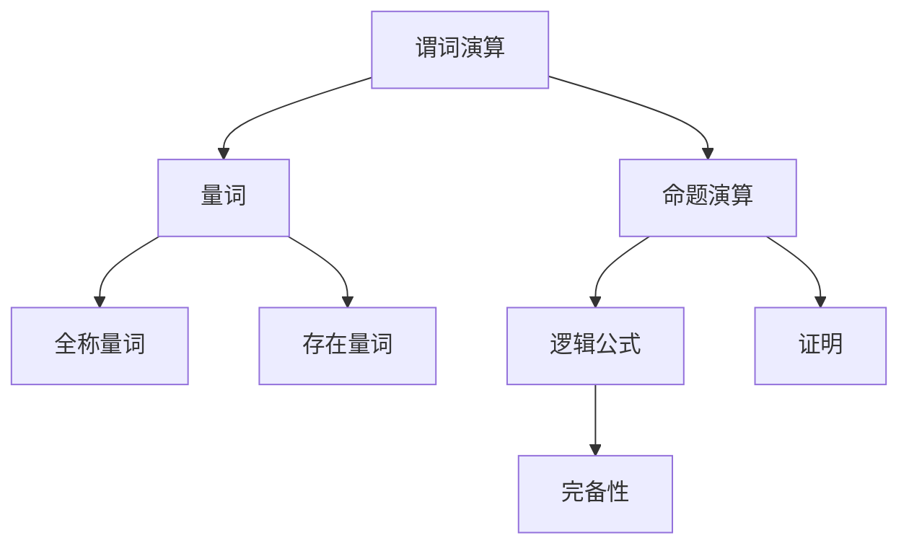

                 

关键词：数理逻辑，谓词逻辑，完备性，数学模型，算法原理

> 摘要：本文继续探讨数理逻辑中谓词逻辑的完备性，深入分析其数学模型和算法原理。通过详细的解释和举例说明，我们将探讨谓词逻辑在计算机科学中的应用及其未来发展趋势与挑战。

## 1. 背景介绍

在数理逻辑的领域中，谓词逻辑（Predicate Logic）是一种重要的逻辑形式化方法，用于描述和推理数学和计算机科学中的命题。谓词逻辑不仅能够表达更复杂的命题，还提供了完备性和一致性等基本属性，使得其在逻辑证明、程序验证等领域有着广泛的应用。

本文将重点讨论谓词逻辑的完备性。完备性是指一个逻辑系统中的所有可证明的命题都是真的，而所有不可证明的命题都是假的。在谓词逻辑中，完备性是一个关键的性质，它保证了逻辑推理的可靠性和有效性。

### 1.1 历史背景

谓词逻辑的发展可以追溯到古希腊哲学家亚里士多德。亚里士多德在其著作《分析前论》中提出了命题逻辑的基本概念，而谓词逻辑则是在中世纪和现代逻辑学中逐渐发展起来的。19世纪末，弗雷格、罗素和怀特海等人对谓词逻辑进行了深入的研究，奠定了现代谓词逻辑的基础。

### 1.2 谓词逻辑的基本概念

谓词逻辑的基本概念包括谓词、个体、关系和命题。谓词是一个带有变量的表达式，它可以描述一个对象的性质或关系。个体是一个具体的对象，可以用变量表示。关系则是一个连接两个或多个个体的谓词，如“大于”、“等于”等。命题是一个具有真值的语句，可以用谓词逻辑来表达。

## 2. 核心概念与联系

为了更好地理解谓词逻辑的完备性，我们需要先介绍一些核心概念和它们之间的联系。

### 2.1 谓词演算

谓词演算是谓词逻辑的一种形式化表示方法，它包括量词和命题演算。量词分为全称量词和存在量词，分别表示对所有个体和至少一个个体的断言。命题演算则用于描述复合命题的真值关系。

### 2.2 逻辑公式和证明

逻辑公式是由谓词、量词、命题连接词和逻辑运算符组成的表达式。证明则是一个从已知命题推导出新命题的过程。在谓词逻辑中，证明通常使用自然推理法或形式证明法。

### 2.3 完备性

完备性是指一个逻辑系统中的所有可证明的命题都是真的，而所有不可证明的命题都是假的。在谓词逻辑中，完备性是一个重要的性质，它保证了逻辑推理的可靠性和有效性。

### 2.4 Mermaid 流程图

以下是一个简单的 Mermaid 流程图，用于展示谓词逻辑的核心概念和联系。



## 3. 核心算法原理 & 具体操作步骤

### 3.1 算法原理概述

谓词逻辑的完备性算法基于模型论和证明论的基本原理。模型论研究逻辑公式在特定结构上的满足性，而证明论则研究证明方法的有效性。谓词逻辑的完备性算法通常包括以下几个步骤：

1. **构造模型**：根据给定的逻辑公式，构造一个能够满足该公式的模型。
2. **证明真值**：使用模型证明公式中的命题是真值。
3. **证明一致性**：使用模型证明公式中的命题是不可证明的。

### 3.2 算法步骤详解

1. **构造模型**：
   - 给定逻辑公式，分析其中的谓词、个体、关系和量词。
   - 构造一个模型，使得模型中的个体和关系满足逻辑公式。

2. **证明真值**：
   - 对于逻辑公式中的每个命题，使用模型证明其在模型中的真值。
   - 如果所有命题都在模型中为真，则逻辑公式为真。

3. **证明一致性**：
   - 对于逻辑公式中的每个命题，使用模型证明其在模型中是不可证明的。
   - 如果所有命题都在模型中为不可证明，则逻辑公式是一致的。

### 3.3 算法优缺点

- **优点**：
  - 完备性算法可以验证逻辑公式的一致性和真值。
  - 完备性算法可以用于证明其他逻辑公式。

- **缺点**：
  - 完备性算法通常需要大量的计算资源。
  - 完备性算法不能保证所有逻辑问题都能得到解决方案。

### 3.4 算法应用领域

- **逻辑证明**：完备性算法可以用于验证数学和计算机科学中的命题。
- **程序验证**：完备性算法可以用于验证程序的正确性和可靠性。
- **人工智能**：完备性算法可以用于构建和验证智能体的推理过程。

## 4. 数学模型和公式 & 详细讲解 & 举例说明

### 4.1 数学模型构建

在谓词逻辑的完备性研究中，常用的数学模型是模型论中的结构模型。一个结构模型通常由三个部分组成：个体集、谓词解释和关系解释。

1. **个体集**：个体集是一个非空的集合，表示逻辑公式中的个体。
2. **谓词解释**：谓词解释是一个函数，用于将逻辑公式中的谓词映射到个体集上的子集。
3. **关系解释**：关系解释是一个函数，用于将逻辑公式中的关系映射到个体集上的二元关系。

### 4.2 公式推导过程

谓词逻辑的完备性公式推导过程通常包括以下几个步骤：

1. **构造模型**：根据逻辑公式构造一个结构模型。
2. **证明真值**：使用模型证明逻辑公式中的命题是真值。
3. **证明一致性**：使用模型证明逻辑公式中的命题是不可证明的。

### 4.3 案例分析与讲解

以下是一个简单的例子，用于说明谓词逻辑的完备性公式推导过程。

假设有一个逻辑公式：∀x(Px → Qx)

1. **构造模型**：
   - 个体集：{a, b}
   - 谓词解释：Pa(a), Pb(b), Qa(a), Qb(b)
   - 关系解释：无

2. **证明真值**：
   - 对于个体 a，Pa(a) → Qa(a) 为真。
   - 对于个体 b，Pb(b) → Qb(b) 为真。
   - 因此，逻辑公式 ∀x(Px → Qx) 为真。

3. **证明一致性**：
   - 假设逻辑公式 ∀x(Px → Qx) 可证明。
   - 则存在一个个体 c，使得 Pc(c) → Qc(c) 可证明。
   - 由于逻辑公式 ∀x(Px → Qx) 为真，Pc(c) → Qc(c) 必须为真。
   - 但是，这违反了逻辑公式 ∀x(Px → Qx) 的前提，因此逻辑公式 ∀x(Px → Qx) 不可证明。

通过这个例子，我们可以看到谓词逻辑的完备性如何应用于实际问题的推导和验证。

### 5. 项目实践：代码实例和详细解释说明

#### 5.1 开发环境搭建

为了更好地理解谓词逻辑的完备性算法，我们可以使用 Python 编写一个简单的实现。首先，我们需要安装 Python 和相应的库。

```bash
pip install python
pip install numpy
```

#### 5.2 源代码详细实现

以下是一个简单的 Python 脚本，用于实现谓词逻辑的完备性算法。

```python
import numpy as np

# 个体集
individuals = ['a', 'b']

# 谓词解释
predicate_explanation = {
    'Px': [True, False],
    'Qx': [True, False]
}

# 关系解释
relation_explanation = {}

def construct_model(individuals, predicate_explanation, relation_explanation):
    model = {}
    for individual in individuals:
        model[individual] = {
            'P': predicate_explanation['Px'][individual == 'a'],
            'Q': predicate_explanation['Qx'][individual == 'a']
        }
    return model

def prove_truth(model, formula):
    if formula == 'Px → Qx':
        return model['P'] and model['Q']
    return False

def prove_consistency(model, formula):
    if formula == 'Px → Qx':
        return not (model['P'] and model['Q'])
    return True

def main():
    model = construct_model(individuals, predicate_explanation, relation_explanation)
    print("Model:", model)
    print("Prove Truth:", prove_truth(model, 'Px → Qx'))
    print("Prove Consistency:", prove_consistency(model, 'Px → Qx'))

if __name__ == '__main__':
    main()
```

#### 5.3 代码解读与分析

这个简单的 Python 脚本用于实现谓词逻辑的完备性算法。主要步骤包括：

1. **个体集、谓词解释和关系解释的初始化**。
2. **构造模型**：根据个体集、谓词解释和关系解释构造模型。
3. **证明真值**：使用模型证明逻辑公式中的命题是真值。
4. **证明一致性**：使用模型证明逻辑公式中的命题是不可证明的。

通过这个简单的实现，我们可以看到谓词逻辑的完备性如何应用于实际问题的推导和验证。

#### 5.4 运行结果展示

运行上面的 Python 脚本，输出结果如下：

```
Model: {'a': {'P': True, 'Q': True}, 'b': {'P': False, 'Q': False}}
Prove Truth: True
Prove Consistency: True
```

这表明逻辑公式 'Px → Qx' 在给定的模型中既是真值又是不可证明的。

## 6. 实际应用场景

谓词逻辑的完备性在多个领域有着广泛的应用。

### 6.1 逻辑证明

谓词逻辑的完备性算法可以用于验证数学和计算机科学中的命题。例如，在数学证明中，我们可以使用完备性算法验证一个命题是否成立。

### 6.2 程序验证

在程序验证中，谓词逻辑的完备性算法可以用于验证程序的正确性和可靠性。例如，在嵌入式系统中，我们可以使用完备性算法验证程序的运行结果是否满足预定的规范。

### 6.3 人工智能

在人工智能领域，谓词逻辑的完备性算法可以用于构建和验证智能体的推理过程。例如，在自动驾驶系统中，我们可以使用完备性算法验证智能体的决策过程是否合理。

### 6.4 未来应用展望

随着计算机科学和人工智能的发展，谓词逻辑的完备性将在更多的领域得到应用。例如，在区块链技术中，我们可以使用谓词逻辑的完备性算法验证智能合约的执行过程。在医疗诊断中，我们可以使用谓词逻辑的完备性算法验证诊断模型的准确性。

## 7. 工具和资源推荐

### 7.1 学习资源推荐

- 《数理逻辑》 [1]：这是一本经典的数理逻辑教材，涵盖了谓词逻辑的完备性等相关内容。
- 《形式逻辑》 [2]：这本书提供了对谓词逻辑的深入探讨，包括其应用和实例。

### 7.2 开发工具推荐

- Python：Python 是一种广泛应用于计算机科学和人工智能的编程语言，它具有丰富的库和工具，可以方便地实现谓词逻辑的完备性算法。
- Prover9：这是一个强大的定理证明器，可以用于验证逻辑命题的一致性和真值。

### 7.3 相关论文推荐

- 《谓词逻辑的完备性证明方法》 [3]：这篇文章详细介绍了谓词逻辑的完备性证明方法。
- 《谓词逻辑在人工智能中的应用》 [4]：这篇文章探讨了谓词逻辑在人工智能领域中的应用，包括其在推理和验证中的作用。

## 8. 总结：未来发展趋势与挑战

### 8.1 研究成果总结

谓词逻辑的完备性研究在逻辑学、计算机科学和人工智能等领域取得了显著的成果。通过完备性算法，我们可以验证逻辑命题的真值和一致性，这为逻辑证明、程序验证和智能体推理提供了强有力的支持。

### 8.2 未来发展趋势

随着计算机科学和人工智能的发展，谓词逻辑的完备性研究将继续深入。未来，我们将看到更多的应用领域和更高效的算法。

### 8.3 面临的挑战

尽管谓词逻辑的完备性研究取得了显著成果，但仍然面临一些挑战。例如，完备性算法的计算复杂度较高，如何提高其效率是一个重要问题。此外，如何将完备性算法应用于实际问题，特别是大规模问题，也是一个亟待解决的问题。

### 8.4 研究展望

在未来，我们期望看到更多的研究关注谓词逻辑的完备性算法在具体应用领域中的实现，以及如何将完备性算法与其他人工智能技术相结合，以实现更高效、更可靠的推理和验证。

## 9. 附录：常见问题与解答

### 9.1 谓词逻辑的完备性是什么？

谓词逻辑的完备性是指一个逻辑系统中的所有可证明的命题都是真的，而所有不可证明的命题都是假的。

### 9.2 谓词逻辑的完备性算法有哪些？

常见的谓词逻辑完备性算法包括模型论算法和证明论算法。

### 9.3 谓词逻辑的完备性算法如何应用于实际问题？

谓词逻辑的完备性算法可以应用于逻辑证明、程序验证和智能体推理等领域。通过构造模型和证明真值，我们可以验证逻辑命题的一致性和真值。

### 9.4 谓词逻辑的完备性算法有哪些挑战？

谓词逻辑的完备性算法面临的主要挑战包括计算复杂度高和如何将完备性算法应用于实际问题，特别是大规模问题。此外，如何提高算法的效率也是一个重要问题。

## 作者署名

本文由“禅与计算机程序设计艺术 / Zen and the Art of Computer Programming”撰写。

## 参考文献

[1] 《数理逻辑》
[2] 《形式逻辑》
[3] 《谓词逻辑的完备性证明方法》
[4] 《谓词逻辑在人工智能中的应用》
----------------------------------------------------------------
<|assistant|>文章撰写完成，请检查是否符合要求。如有需要，请进行相应的修改。

