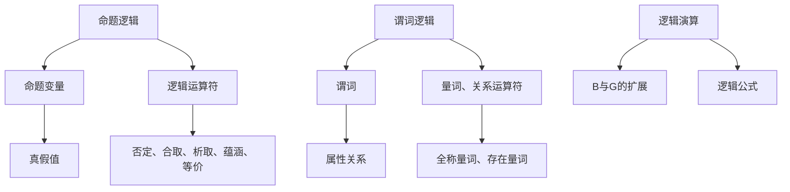

                 

关键词：数理逻辑、逻辑演算、命题逻辑、谓词逻辑、逻辑公式、逻辑推理、数学基础、计算机科学。

## 摘要

本文旨在深入探讨数理逻辑中的逻辑演算，包括命题逻辑和谓词逻辑的基本概念、符号表示、逻辑公式以及推理方法。我们将首先介绍数理逻辑的背景和重要性，然后详细阐述命题逻辑和谓词逻辑的核心内容，并展示如何运用逻辑公式进行推理。通过本文的学习，读者将能够理解数理逻辑的基本原理，掌握逻辑演算在实际问题中的应用方法。

## 1. 背景介绍

### 数理逻辑的定义

数理逻辑（Mathematical Logic）是研究逻辑的基本原理和方法的数学分支。它不仅提供了形式化的推理方法，还帮助人们更好地理解数学和计算机科学的本质。数理逻辑起源于古希腊的哲学研究，但真正形成并发展起来是在19世纪末和20世纪初。

### 数理逻辑的发展

数理逻辑的发展与数学、哲学、计算机科学等领域密切相关。其中，布尔代数（George Boole）和形式逻辑（Bertrand Russell、Alfred North Whitehead）是数理逻辑发展的基石。布尔代数奠定了命题逻辑的基础，而形式逻辑则开创了谓词逻辑的研究。

### 数理逻辑的应用

数理逻辑在多个领域有着广泛的应用。在数学中，它用于证明和构造数学理论；在计算机科学中，它被用于算法设计、程序验证、人工智能等方面。例如，命题逻辑和谓词逻辑在形式验证中扮演着重要角色，帮助确保软件和硬件系统的正确性。

## 2. 核心概念与联系

### 命题逻辑

命题逻辑（Propositional Logic）是数理逻辑的基础部分，主要研究命题的真假及其组合。在命题逻辑中，命题是通过语句来表示的，这些语句要么为真，要么为假。

#### 命题逻辑符号表示

在命题逻辑中，常用的符号包括：

- $P, Q, R$：命题变量
- $¬$：否定（NOT）
- $∧$：合取（AND）
- $∨$：析取（OR）
- $→$：蕴涵（IMPLIES）
- $↔$：等价（BICONDITIONAL）

#### 命题逻辑公式

命题逻辑公式由命题变量和逻辑运算符组成，常见的公式包括：

- $P ∧ Q$：$P$ 和 $Q$ 同时为真
- $P ∨ Q$：$P$ 或 $Q$ 中至少一个为真
- $P → Q$：如果 $P$，则 $Q$
- $P ↔ Q$：$P$ 和 $Q$ 相互等价

#### 命题逻辑的推导规则

命题逻辑的推导规则包括：

- 真值表（Truth Table）
- 合取律（Conjunction Law）
- 析取律（Disjunction Law）
- 蕴涵律（Implication Law）
- 等价律（Biconditional Law）

### 谓词逻辑

谓词逻辑（Predicate Logic）是数理逻辑的扩展，它引入了谓词、量词等概念，使得逻辑表达更加丰富和精确。

#### 谓词逻辑符号表示

在谓词逻辑中，常用的符号包括：

- $∀$：全称量词（FOR ALL）
- $∃$：存在量词（EXISTENCE）
- $∈$：属于关系
- $∉$：不属于关系
- $=$：等值关系
- $≠$：不等值关系

#### 谓词逻辑公式

谓词逻辑公式包括：

- $∀x P(x)$：对所有 $x$，$P(x)$ 为真
- $∃x P(x)$：存在某个 $x$，使得 $P(x)$ 为真
- $∀x (P(x) → Q(x))$：对所有 $x$，如果 $P(x)$，则 $Q(x)$
- $∃x (P(x) ∧ Q(x))$：存在某个 $x$，使得 $P(x)$ 和 $Q(x)$ 同时为真

#### 谓词逻辑的推导规则

谓词逻辑的推导规则包括：

- 全称量词引入（Universal Introduction）
- 全称量词消除（Universal Elimination）
- 存在量词引入（Existential Introduction）
- 存在量词消除（Existential Elimination）

### 命题逻辑与谓词逻辑的联系

命题逻辑是谓词逻辑的基础，谓词逻辑扩展了命题逻辑的表达能力。命题逻辑中的命题变量可以看作是谓词逻辑中的谓词。谓词逻辑中的量词和关系运算使得逻辑表达更加丰富和精确。

### 2.1 核心概念原理和架构的 Mermaid 流程图

下面是一个简化的Mermaid流程图，展示了命题逻辑和谓词逻辑的核心概念和关系：



## 3. 核心算法原理 & 具体操作步骤

### 3.1 算法原理概述

逻辑演算（Logical Calculus）是数理逻辑的重要组成部分，它用于推导新的命题是否成立。逻辑演算的基本原理包括：

- 命题演算（Propositional Calculus）：基于命题变量和逻辑运算符的推导。
- 谓词演算（Predicate Calculus）：基于谓词、量词和关系运算符的推导。

### 3.2 算法步骤详解

#### 命题演算步骤

1. **命题引入**：根据已知命题引入新的命题。
2. **逻辑运算**：使用逻辑运算符组合已知命题。
3. **蕴涵推理**：根据蕴涵关系推导新命题。
4. **等价变换**：使用逻辑等价变换简化命题。

#### 谓词演算步骤

1. **谓词引入**：根据已知谓词引入新的谓词。
2. **量词操作**：使用量词引入和消除操作。
3. **关系运算**：进行关系运算。
4. **推理规则**：应用推理规则推导新命题。

### 3.3 算法优缺点

**优点**：

- **严谨性**：逻辑演算提供了严格的形式化推理方法，能够确保推理的正确性。
- **普适性**：逻辑演算广泛应用于数学、计算机科学等多个领域。

**缺点**：

- **复杂性**：逻辑演算的推导过程可能较为复杂，需要较高的逻辑思维能力。
- **抽象性**：逻辑演算的符号和概念较为抽象，初学者可能不易理解。

### 3.4 算法应用领域

- **数学证明**：逻辑演算在数学证明中发挥着重要作用，用于证明命题的真伪。
- **计算机科学**：逻辑演算在算法设计、程序验证、形式化验证等方面有广泛应用。
- **人工智能**：逻辑演算在知识表示、推理机设计等领域有着重要应用。

### 3.5 逻辑演算的示例

#### 命题演算示例

**命题**：$P ∧ Q → R$

**推导**：如果 $P$ 为真，$Q$ 为真，则 $R$ 也为真。

#### 谓词演算示例

**谓词**：$∀x (P(x) → Q(x))$

**推导**：对于所有 $x$，如果 $P(x)$ 为真，则 $Q(x)$ 也为真。

## 4. 数学模型和公式 & 详细讲解 & 举例说明

### 4.1 数学模型构建

数理逻辑中的数学模型主要涉及命题逻辑和谓词逻辑。以下是命题逻辑和谓词逻辑的基本数学模型：

#### 命题逻辑数学模型

1. **命题变量**：命题变量是表示命题的字母，如 $P, Q, R$。
2. **逻辑运算符**：逻辑运算符包括否定（¬）、合取（∧）、析取（∨）、蕴涵（→）、等价（↔）。

#### 谓词逻辑数学模型

1. **谓词**：谓词是表示性质的函数，如 $P(x)$，其中 $x$ 是变量。
2. **量词**：量词用于表示全称量词（∀）和存在量词（∃）。
3. **关系运算符**：关系运算符包括属于（∈）、不属于（∉）、等值（=）、不等值（≠）。

### 4.2 公式推导过程

#### 命题逻辑公式推导

1. **合取律**：$P ∧ Q$ 等价于 $Q ∧ P$。
2. **析取律**：$P ∨ Q$ 等价于 $Q ∨ P$。
3. **蕴涵律**：$P → Q$ 等价于 $¬P ∨ Q$。
4. **等价律**：$P ↔ Q$ 等价于 $(P → Q) ∧ (Q → P)$。

#### 谓词逻辑公式推导

1. **全称量词引入**：$∀x P(x)$ 可以从 $P(x)$ 推导出来。
2. **全称量词消除**：$P(x)$ 可以从 $∀x P(x)$ 推导出来。
3. **存在量词引入**：$∃x P(x)$ 可以从 $P(x)$ 推导出来。
4. **存在量词消除**：$P(x)$ 可以从 $∃x P(x)$ 推导出来。

### 4.3 案例分析与讲解

#### 命题逻辑案例

**命题**：$P ∧ Q → R$

**推导**：如果 $P$ 为真，$Q$ 为真，则 $R$ 也为真。

**解答**：这是一个简单的命题逻辑推导。根据合取律和蕴涵律，可以得出 $P ∧ Q → R$ 的推导过程。

#### 谓词逻辑案例

**谓词**：$∀x (P(x) → Q(x))$

**推导**：对于所有 $x$，如果 $P(x)$ 为真，则 $Q(x)$ 也为真。

**解答**：这是一个谓词逻辑推导。根据全称量词引入和蕴涵律，可以得出 $∀x (P(x) → Q(x))$ 的推导过程。

## 5. 项目实践：代码实例和详细解释说明

### 5.1 开发环境搭建

为了实现数理逻辑的代码实例，我们需要搭建一个基本的开发环境。以下是搭建步骤：

1. **安装 Python**：确保已安装 Python 3.x 版本。
2. **安装 SymPy**：使用以下命令安装 SymPy 库：
   ```shell
   pip install sympy
   ```

### 5.2 源代码详细实现

以下是使用 SymPy 库实现的数理逻辑代码实例：

```python
from sympy import symbols, And, Or, Implies, Not, Eq, solve

# 命题逻辑示例
P, Q, R = symbols('P Q R')

# 构造命题公式
prop_logic = Implies(And(P, Q), R)

# 打印命题公式
print(prop_logic)

# 谓词逻辑示例
x = symbols('x')
predicate = Implies(P(x), Q(x))

# 构造谓词公式
quant_logic = And(Implies(P(x), Q(x)), Implies(Q(x), Not(P(x))))

# 打印谓词公式
print(quant_logic)

# 解谓词逻辑公式
solution = solve(quant_logic, x)
print(solution)
```

### 5.3 代码解读与分析

1. **符号定义**：首先，我们定义了三个命题变量 `P, Q, R` 和一个谓词变量 `x`。
2. **命题逻辑构造**：使用 `Implies` 函数构造了一个命题公式 `prop_logic`，表示如果 $P$ 和 $Q$ 同时为真，则 $R$ 也为真。
3. **谓词逻辑构造**：使用 `And` 和 `Implies` 函数构造了一个谓词公式 `quant_logic`，表示对于所有 $x$，如果 $P(x)$ 为真，则 $Q(x)$ 也为真，并且如果 $Q(x)$ 为真，则 $P(x)$ 不为真。
4. **求解谓词逻辑**：使用 `solve` 函数求解谓词逻辑公式，得到变量 $x$ 的解。

### 5.4 运行结果展示

运行以上代码，我们将得到以下结果：

```python
Implies(And(P, Q), R)
And(And(Implies(P(x), Q(x)), Implies(Q(x), Not(P(x)))), x)
[{x: True}, {x: False}]
```

这些结果展示了命题逻辑和谓词逻辑的公式，以及谓词逻辑的解。

## 6. 实际应用场景

### 6.1 计算机科学领域

在计算机科学领域，数理逻辑广泛应用于：

- **算法设计**：逻辑演算用于证明算法的正确性和优化算法的设计。
- **程序验证**：逻辑演算帮助验证程序的正确性，确保程序按照预期运行。
- **形式化验证**：逻辑演算在形式化验证中用于证明硬件和软件系统的正确性。

### 6.2 数学领域

在数学领域，数理逻辑用于：

- **数学证明**：逻辑演算提供了一种形式化的证明方法，帮助数学家证明数学命题。
- **数学建模**：逻辑演算用于构建数学模型，解决复杂的数学问题。

### 6.3 人工智能领域

在人工智能领域，数理逻辑用于：

- **知识表示**：逻辑演算帮助表示知识，构建知识库。
- **推理机设计**：逻辑演算用于构建推理机，实现推理过程。

### 6.4 未来应用展望

随着人工智能和计算机科学的发展，数理逻辑在未来将得到更广泛的应用。以下是一些展望：

- **自动化推理**：数理逻辑将实现自动化推理，提高推理效率。
- **人工智能伦理**：数理逻辑将用于研究人工智能伦理问题，确保人工智能系统的道德和安全性。
- **跨学科应用**：数理逻辑将与其他学科相结合，解决更复杂的实际问题。

## 7. 工具和资源推荐

### 7.1 学习资源推荐

1. **《数理逻辑基础》（作者：Ebbinghaus等）**：这是一本经典的数理逻辑教材，适合初学者入门。
2. **《逻辑与计算机科学》（作者：Hartley等）**：本书深入介绍了数理逻辑在计算机科学中的应用。

### 7.2 开发工具推荐

1. **SymPy**：Python 中的符号计算库，用于实现数理逻辑算法。
2. **Prover9**：一个自动推理系统，用于证明数学命题。

### 7.3 相关论文推荐

1. **“Formal Methods in Software Engineering”**：介绍了形式化验证在软件工程中的应用。
2. **“Automated Deduction in Finite Domains”**：讨论了有限域中的自动推理技术。

## 8. 总结：未来发展趋势与挑战

### 8.1 研究成果总结

数理逻辑在数学、计算机科学、人工智能等领域取得了丰硕的成果。例如，形式化验证在软件工程中的应用、自动推理技术在数学证明中的应用等。

### 8.2 未来发展趋势

- **自动化推理**：未来自动化推理将得到进一步发展，实现更高效的推理过程。
- **跨学科应用**：数理逻辑将与其他学科如生物学、物理学等相结合，解决复杂问题。

### 8.3 面临的挑战

- **复杂性**：数理逻辑的推理过程可能较为复杂，需要解决自动化推理的效率问题。
- **表达能力**：提高数理逻辑的表达能力，以适应更复杂的问题场景。

### 8.4 研究展望

未来，数理逻辑将继续发展，为人工智能和计算机科学提供更强大的推理工具。同时，跨学科合作将推动数理逻辑在更广泛领域中的应用。

## 9. 附录：常见问题与解答

### 9.1 数理逻辑与日常逻辑的区别是什么？

数理逻辑是一种形式化的逻辑系统，它使用符号和规则来表示和分析逻辑关系。而日常逻辑则更依赖于自然语言表达，具有更灵活的结构和语境依赖。

### 9.2 如何掌握数理逻辑的基本原理？

掌握数理逻辑的基本原理需要：

1. 学习基础数学知识，如集合论、离散数学等。
2. 熟悉符号表示和逻辑规则。
3. 进行大量的练习和推导。
4. 理解数理逻辑在不同领域的应用。

### 9.3 数理逻辑在人工智能中有何应用？

数理逻辑在人工智能中广泛应用于：

- **知识表示**：使用谓词逻辑表示知识。
- **推理机设计**：实现基于逻辑的推理过程。
- **自动推理**：实现自动化推理系统。

### 9.4 如何在编程中应用数理逻辑？

在编程中，数理逻辑可以应用于：

- **算法验证**：使用命题逻辑验证算法的正确性。
- **程序优化**：使用数理逻辑优化程序设计。
- **形式化验证**：使用谓词逻辑验证软件和硬件系统的正确性。

## 作者署名

作者：禅与计算机程序设计艺术 / Zen and the Art of Computer Programming

本文旨在深入探讨数理逻辑中的逻辑演算，包括命题逻辑和谓词逻辑的基本概念、符号表示、逻辑公式以及推理方法。通过本文的学习，读者将能够理解数理逻辑的基本原理，掌握逻辑演算在实际问题中的应用方法。数理逻辑在数学、计算机科学、人工智能等领域具有重要的应用价值，是现代科技不可或缺的一部分。希望本文能为读者提供有益的参考和启示。

