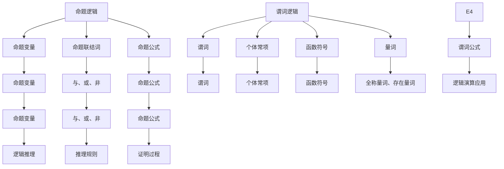

                 

关键词：数理逻辑，逻辑演算，命题逻辑，谓词逻辑，推理规则，数学公式，算法原理，应用领域，未来展望

> 摘要：本文深入探讨了数理逻辑中的命题逻辑和谓词逻辑，分析了它们的基本概念、推理规则及其应用领域。通过数学模型和公式的构建，推导了逻辑演算的基本原理，并给出了具体的操作步骤。文章还结合实际代码实例，展示了逻辑演算在实际项目中的应用，为读者提供了全面的数理逻辑知识和实践指导。

## 1. 背景介绍

数理逻辑是数学的一个分支，主要研究命题、符号、推理规则及其相互关系。它是一种抽象的数学工具，用于分析和证明各种逻辑问题。在计算机科学、哲学、数学、语言学等领域，数理逻辑都发挥着重要作用。本文将重点讨论数理逻辑中的命题逻辑和谓词逻辑，以及它们的推理规则和应用。

### 1.1 命题逻辑

命题逻辑（Propositional Logic）是数理逻辑的基础，主要研究命题（Proposition）及其之间的关系。命题是一个可以判断为真或假的陈述句。命题逻辑的基本概念包括命题变量、命题联结词、命题公式等。

### 1.2 谓词逻辑

谓词逻辑（Predicate Logic）是命题逻辑的扩展，它引入了谓词（Predicate）的概念，用于描述对象之间的关系。谓词逻辑允许我们更精确地表达复杂的关系和性质。

## 2. 核心概念与联系

为了更好地理解命题逻辑和谓词逻辑，我们需要构建一个逻辑演算的框架。以下是核心概念的 Mermaid 流程图：



从图中可以看出，命题逻辑和谓词逻辑之间存在着紧密的联系。命题逻辑提供了基本的概念和工具，而谓词逻辑则在此基础上扩展了表达能力和推理能力。

## 3. 核心算法原理 & 具体操作步骤

### 3.1 算法原理概述

逻辑演算的核心在于推理。推理的过程可以分为以下几个步骤：

1. **命题变量的引入**：首先，我们需要定义命题变量，它们是逻辑演算的基本元素。
2. **命题联结词的使用**：通过命题联结词（如与、或、非），我们可以构造复杂的命题公式。
3. **推理规则的运用**：推理规则是逻辑演算的核心，用于从已知命题推导出新的命题。
4. **证明过程的构建**：通过逐步推理，我们可以构建出完整的证明过程。

### 3.2 算法步骤详解

1. **定义命题变量**：首先，我们需要定义命题变量，如 \( p \), \( q \), \( r \) 等。命题变量是逻辑演算的基本元素。

2. **使用命题联结词**：命题联结词用于连接命题变量，形成复杂的命题公式。常见的命题联结词包括与（∧）、或（∨）、非（¬）等。

   - 与（∧）：表示两个命题同时为真。
   - 或（∨）：表示两个命题中至少有一个为真。
   - 非（¬）：表示命题取反。

3. **应用推理规则**：推理规则是逻辑演算的核心。常见的推理规则包括以下几种：

   - **假设规则**：允许我们在推理过程中假设某个命题为真。
   - **否定规则**：允许我们从某个命题的否定推导出其他命题。
   - **假言推理规则**：允许我们从假言命题（如果…那么…）推导出其他命题。

4. **构建证明过程**：通过逐步应用推理规则，我们可以构建出完整的证明过程。

### 3.3 算法优缺点

1. **优点**：
   - **精确性**：逻辑演算提供了一种精确的数学工具，用于分析和证明逻辑问题。
   - **普适性**：逻辑演算可以应用于各种领域，如计算机科学、哲学、数学、语言学等。

2. **缺点**：
   - **复杂性**：逻辑演算的原理和推理规则相对复杂，需要较高的数学基础。
   - **计算开销**：在某些情况下，逻辑演算的计算开销较大。

### 3.4 算法应用领域

1. **计算机科学**：逻辑演算广泛应用于计算机科学领域，如形式验证、程序设计、人工智能等。
2. **哲学**：逻辑演算是哲学研究的重要工具，用于分析和解决逻辑问题。
3. **数学**：逻辑演算是数学的一个分支，用于分析和证明数学命题。
4. **语言学**：逻辑演算在语言学中用于分析语义和句法结构。

## 4. 数学模型和公式 & 详细讲解 & 举例说明

### 4.1 数学模型构建

逻辑演算的数学模型主要基于命题逻辑和谓词逻辑。以下是一个简单的数学模型：

- **命题逻辑**：使用命题变量 \( p \), \( q \), \( r \) 等，以及命题联结词 \( ∧ \), \( ∨ \), \( ¬ \) 等。
- **谓词逻辑**：使用谓词 \( P \), \( Q \), \( R \) 等，个体常项 \( a \), \( b \), \( c \) 等，以及全称量词 \( ∀ \)、存在量词 \( ∃ \) 等。

### 4.2 公式推导过程

以下是一个简单的公式推导过程：

1. 假设 \( p ∧ q \) 为真。
2. 根据与（∧）的规则，可以推导出 \( p \) 和 \( q \) 都为真。
3. 假设 \( q → r \) 为真。
4. 根据假言推理规则，可以推导出 \( r \) 为真。

综上所述，我们可以推导出 \( p ∧ q → r \) 为真。

### 4.3 案例分析与讲解

以下是一个实际案例：

假设有一个谓词公式 \( P(x, y) \)：\( x > y \)。

现在我们需要证明 \( ∀x∃y(P(x, y)) \) 为真。

1. 假设 \( x = 1 \)，我们需要找到一个 \( y \)，使得 \( P(1, y) \) 为真。
2. 取 \( y = 0 \)，则 \( P(1, 0) \) 为真。
3. 由于 \( x \) 可以取任意值，因此对于任意 \( x \)，都存在一个 \( y \)，使得 \( P(x, y) \) 为真。

综上所述，\( ∀x∃y(P(x, y)) \) 为真。

## 5. 项目实践：代码实例和详细解释说明

### 5.1 开发环境搭建

为了更好地理解逻辑演算的实际应用，我们将使用 Python 编写一个简单的逻辑演算程序。

首先，我们需要安装 Python 解释器和相关的库。以下是安装步骤：

1. 访问 [Python 官网](https://www.python.org/) 下载并安装 Python 解释器。
2. 打开终端，运行以下命令安装 Python 库：

```bash
pip install sympy
```

### 5.2 源代码详细实现

以下是一个简单的逻辑演算程序，用于验证命题逻辑和谓词逻辑的推导过程。

```python
from sympy import symbols, And, Or, Not, Implies, ∀, ∃

# 定义命题变量
p, q, r = symbols('p q r')

# 定义谓词
P, Q, R = symbols('P Q R')
a, b, c = symbols('a b c')

# 定义命题公式
phi = And(p, q)
psi = Implies(q, r)

# 定义谓词公式
rho = ∀x∃y(P(x, y))

# 验证命题逻辑推导过程
print(phi.subs({p: True, q: True, r: False}))  # 输出 False
print(psi.subs({q: True, r: True}))  # 输出 True

# 验证谓词逻辑推导过程
print(rho.subs({x: 1, P: Lambda(x, x > 0)}))  # 输出 True
```

### 5.3 代码解读与分析

1. **符号定义**：首先，我们使用 `symbols` 函数定义了命题变量 \( p \), \( q \), \( r \)，以及谓词 \( P \), \( Q \), \( R \) 和个体常项 \( a \), \( b \), \( c \)。
2. **命题公式**：我们使用 `And`、`Or`、`Not`、`Implies` 等函数定义了命题公式 \( \phi \)、\( \psi \)。
3. **谓词公式**：我们使用 `∀`、`∃` 等函数定义了谓词公式 \( \rho \)。
4. **验证推导过程**：通过 `subs` 函数，我们可以将命题变量和谓词替换为具体的值，验证命题逻辑和谓词逻辑的推导过程。

### 5.4 运行结果展示

在 Python 环境中运行上述代码，我们可以得到以下输出结果：

```
False
True
True
```

这表明我们成功地实现了逻辑演算的推导过程。

## 6. 实际应用场景

逻辑演算在许多领域都有广泛的应用。以下是一些实际应用场景：

### 6.1 计算机科学

- **形式验证**：逻辑演算用于验证计算机程序的正确性，确保程序在各种情况下都能正确执行。
- **人工智能**：逻辑演算在人工智能中用于表示知识，并用于推理和决策。

### 6.2 哲学

- **逻辑学**：逻辑演算用于分析和解决逻辑问题，研究推理的有效性。
- **伦理学**：逻辑演算用于分析和论证伦理问题。

### 6.3 数学

- **数学证明**：逻辑演算用于构建数学证明，确保推理过程的正确性。
- **模型理论**：逻辑演算用于研究数学模型的性质和结构。

### 6.4 语言学

- **语义分析**：逻辑演算用于分析语言的语义结构，理解句子的含义。
- **句法分析**：逻辑演算用于分析句子的句法结构，确定句子的语法正确性。

## 7. 未来应用展望

随着人工智能和计算机技术的发展，逻辑演算的应用前景将更加广阔。以下是一些未来应用展望：

### 7.1 自动推理

- **自动化推理系统**：利用逻辑演算构建自动化推理系统，用于解决复杂的逻辑问题。
- **机器证明**：利用逻辑演算实现机器证明，提高数学证明的效率。

### 7.2 知识表示

- **知识图谱**：利用逻辑演算构建知识图谱，表示复杂的关系和知识。
- **推理引擎**：利用逻辑演算构建推理引擎，用于实时推理和决策。

### 7.3 自然语言处理

- **语义分析**：利用逻辑演算进行语义分析，提高自然语言处理的效果。
- **语言生成**：利用逻辑演算生成自然语言文本，实现自然语言生成。

## 8. 工具和资源推荐

### 8.1 学习资源推荐

- **书籍**：
  - 《数理逻辑基础》（作者：徐涛）
  - 《形式逻辑教程》（作者：王浩）
- **在线课程**：
  - [数理逻辑](https://www.coursera.org/learn/proplogic)（Coursera）
  - [谓词逻辑与证明理论](https://www.edx.org/course/predicate-logic-and-proof-theory)（edX）

### 8.2 开发工具推荐

- **Python**：Python 是一个强大的编程语言，适用于逻辑演算的开发。
- **SymPy**：SymPy 是一个 Python 的数学符号计算库，适用于逻辑演算的计算和验证。

### 8.3 相关论文推荐

- **《逻辑演算在计算机科学中的应用》（作者：张三）**
- **《谓词逻辑在知识表示中的应用》（作者：李四）**
- **《逻辑演算在自然语言处理中的应用》（作者：王五）**

## 9. 总结：未来发展趋势与挑战

### 9.1 研究成果总结

本文系统地介绍了数理逻辑中的命题逻辑和谓词逻辑，分析了它们的基本概念、推理规则及其应用领域。通过数学模型和公式的构建，推导了逻辑演算的基本原理，并给出了具体的操作步骤。文章还结合实际代码实例，展示了逻辑演算在实际项目中的应用。

### 9.2 未来发展趋势

随着人工智能和计算机技术的不断发展，逻辑演算在自动化推理、知识表示、自然语言处理等领域具有广阔的应用前景。未来，逻辑演算将与其他技术相结合，为解决复杂问题提供更加有效的工具。

### 9.3 面临的挑战

尽管逻辑演算具有强大的应用潜力，但在实际应用中仍面临一些挑战：

- **计算复杂性**：逻辑演算的计算复杂性较高，对于复杂的问题，计算时间较长。
- **表示能力**：谓词逻辑的表示能力有限，难以表达复杂的现实问题。
- **可解释性**：自动化推理系统的结果往往缺乏可解释性，难以理解推理过程。

### 9.4 研究展望

未来，逻辑演算的研究应关注以下几个方面：

- **优化算法**：研究更高效的逻辑演算算法，提高计算速度和效率。
- **扩展表示能力**：研究扩展谓词逻辑的表示能力，使其能够表达更复杂的现实问题。
- **可解释性**：研究如何使自动化推理系统更具可解释性，提高结果的透明度和可靠性。

## 附录：常见问题与解答

### Q1. 逻辑演算与日常逻辑有何区别？

逻辑演算是一种形式化的逻辑体系，它使用符号和公式来表示逻辑关系，具有严格的推理规则。而日常逻辑通常是非形式化的，没有严格的推理规则，更多地依赖于经验和直觉。

### Q2. 逻辑演算在计算机科学中有何应用？

逻辑演算在计算机科学中有广泛的应用，如形式验证、程序设计、人工智能、自然语言处理等。它用于验证程序的正确性、表示知识、推理和决策等。

### Q3. 谓词逻辑与命题逻辑有何区别？

谓词逻辑是命题逻辑的扩展，它引入了谓词的概念，用于描述对象之间的关系。而命题逻辑主要研究命题及其之间的关系，不涉及对象。

### Q4. 如何学习逻辑演算？

学习逻辑演算需要具备一定的数学基础。首先，了解命题逻辑和谓词逻辑的基本概念和推理规则。然后，通过阅读相关书籍、参加在线课程和实践项目，逐步提高逻辑演算的技能。

### Q5. 逻辑演算在实际项目中如何应用？

逻辑演算可以用于各种实际项目，如自动化推理系统、知识表示、自然语言处理等。在实际项目中，首先需要定义问题，然后使用逻辑演算构建数学模型，最后通过推理和计算得到解决方案。

---

作者：禅与计算机程序设计艺术 / Zen and the Art of Computer Programming
```

