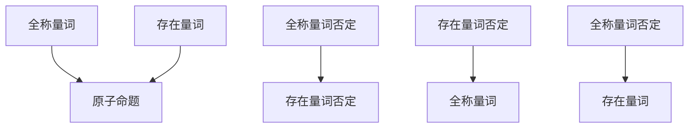

                 

关键词：数理逻辑，命题量词，逻辑命题，全称量词，存在量词，命题逻辑，逻辑推理，数学证明，计算机科学，形式逻辑。

## 摘要

本文作为数理逻辑系列的附录（一），将深入探讨命题量词在逻辑学中的重要作用。通过分析全称量词和存在量词的构造、含义以及应用，我们将揭示命题量词在逻辑推理和数学证明中的核心地位。本文旨在为读者提供一个全面而清晰的数理逻辑基础，帮助读者更好地理解和应用命题量词，从而在计算机科学和形式逻辑领域取得更大的成就。

## 1. 背景介绍

数理逻辑是数学的一个分支，它使用符号语言来研究逻辑推理、数学证明及其在计算机科学中的应用。数理逻辑的主要目标是构建一套精确的符号系统，用以表示和验证逻辑推理的正确性。在这套系统中，命题量词作为一种基本的逻辑工具，发挥着至关重要的作用。

命题量词可以分为全称量词和存在量词两种，它们用于描述一个命题在所有情况下或某个特定情况下是否成立。全称量词（通常表示为“∀”）用于表示一个命题在所有可能的条件下都为真，而存在量词（通常表示为“∃”）则表示在至少一个条件下命题为真。理解命题量词是深入掌握数理逻辑的关键，因此本文将重点探讨这两种量词的构造、含义和应用。

## 2. 核心概念与联系

### 2.1 命题量词的构造

命题量词的构造是基于逻辑命题的基本元素，即原子命题。原子命题是不能再分解的命题，例如“今天是星期五”或“2+2=4”。命题量词通过结合原子命题来构建复合命题，从而表达更加复杂的逻辑关系。

#### 全称量词（∀）

全称量词表示一个命题在所有可能的条件下都为真。它通常与一个变量绑定，表示这个变量取任何值时，命题都成立。例如，命题“∀x∈N，x>0”表示对于所有自然数x，x都大于0。

#### 存在量词（∃）

存在量词表示在至少一个条件下命题为真。它也通常与一个变量绑定，表示至少存在一个值使得命题成立。例如，命题“∃x∈N，x>5”表示存在一个自然数x，使得x大于5。

### 2.2 命题量词的联系

命题量词不仅在构造复合命题中起到关键作用，而且在逻辑推理和数学证明中也有广泛应用。全称量词和存在量词之间存在着密切的联系，它们可以互相转换。

#### 全称量词的否定

全称量词的否定是存在量词，即“¬(∀xP(x)) ≡ ∃x¬P(x)”。这意味着如果所有x都满足P(x)，则否定这个命题意味着至少存在一个x不满足P(x)。

#### 存在量词的否定

存在量词的否定是全称量词，即“¬(∃xP(x)) ≡ ∀x¬P(x)”。这意味着如果至少存在一个x满足P(x)，则否定这个命题意味着所有x都不满足P(x)。

### 2.3 Mermaid 流程图

为了更直观地展示命题量词的构造和联系，我们可以使用Mermaid流程图来表示。以下是一个示例：



这个流程图展示了全称量词和存在量词之间的转换关系，以及它们如何与原子命题结合。

## 3. 核心算法原理 & 具体操作步骤

### 3.1 算法原理概述

命题量词在逻辑推理和数学证明中扮演着核心角色，其算法原理主要涉及以下几个方面：

1. **量词绑定**：将命题量词与变量绑定，使其在特定上下文中发挥作用。
2. **量词转换**：通过否定关系将全称量词和存在量词相互转换，以便于推理和证明。
3. **量词消去**：在特定情况下，将量词从复合命题中消去，简化逻辑表达式。

### 3.2 算法步骤详解

#### 步骤1：量词绑定

首先，我们需要对原子命题进行量词绑定，以便在推理过程中使用。例如，对于命题“x > 0”，我们可以将其与全称量词绑定，表示“∀x(x > 0)”，表示对所有x，x都大于0。

#### 步骤2：量词转换

在推理和证明过程中，我们经常需要将全称量词和存在量词相互转换。例如，如果我们有一个命题“¬(∀xP(x))”，则可以通过量词转换得到“∃x¬P(x)”。

#### 步骤3：量词消去

在某些情况下，我们可以从复合命题中消去量词。例如，如果已知“∀x(P(x) → Q(x))”，并且假设P(a)为真，则可以消去量词得到“Q(a)”。

### 3.3 算法优缺点

#### 优点

1. **简洁性**：命题量词的使用使得逻辑表达式更加简洁，便于理解和推理。
2. **普适性**：命题量词适用于各种逻辑命题和数学证明，具有广泛的适用性。
3. **可扩展性**：命题量词可以与其他逻辑运算符结合，形成更复杂的逻辑表达式。

#### 缺点

1. **复杂性**：命题量词的使用可能会增加逻辑表达式的复杂性，使得推理和证明变得更加困难。
2. **正确性**：在使用命题量词时，需要特别注意其否定的转换和消去，以避免推理错误。

### 3.4 算法应用领域

命题量词在计算机科学和形式逻辑领域有广泛的应用，主要包括以下几个方面：

1. **计算机科学**：命题量词在计算机科学中用于逻辑编程、形式验证和程序验证等领域。
2. **形式逻辑**：命题量词是形式逻辑的基础，用于构建形式化的推理系统和证明系统。
3. **数学证明**：命题量词在数学证明中用于表示全称命题和存在命题，简化证明过程。

## 4. 数学模型和公式 & 详细讲解 & 举例说明

### 4.1 数学模型构建

命题量词的数学模型基于集合论和谓词逻辑。我们可以将命题量词看作是集合论中的量化符号，用于描述集合中元素的性质。

#### 全称量词

全称量词表示一个命题在所有可能的条件下都为真。我们可以用集合论中的全称量化符号∀表示，例如：

$$\forall x \in S, P(x)$$

其中，S是一个集合，x是集合中的元素，P(x)是一个谓词，表示x的性质。

#### 存在量词

存在量词表示在至少一个条件下命题为真。我们可以用集合论中的存在量化符号∃表示，例如：

$$\exists x \in S, P(x)$$

其中，S是一个集合，x是集合中的元素，P(x)是一个谓词，表示x的性质。

### 4.2 公式推导过程

命题量词的推导过程主要涉及量词转换和量词消去。以下是一个示例：

#### 量词转换

假设我们有一个命题：

$$\neg(\forall x \in S, P(x))$$

我们可以将其转换为存在量词：

$$\exists x \in S, \neg P(x)$$

推导过程如下：

$$\neg(\forall x \in S, P(x))$$
$$\Leftrightarrow$$
$$\neg(\neg(\exists x \in S, P(x)))$$
$$\Leftrightarrow$$
$$\exists x \in S, \neg P(x)$$

#### 量词消去

假设我们有一个命题：

$$\forall x \in S, (P(x) \rightarrow Q(x))$$

我们可以消去量词，得到一个具体的命题：

$$Q(a)$$

其中，a是S中的一个元素。推导过程如下：

$$\forall x \in S, (P(x) \rightarrow Q(x))$$
$$\Leftrightarrow$$
$$\neg(\exists x \in S, \neg(P(x) \rightarrow Q(x)))$$
$$\Leftrightarrow$$
$$\neg(\exists x \in S, (P(x) \wedge \neg Q(x)))$$
$$\Leftrightarrow$$
$$\forall x \in S, \neg(P(x) \wedge \neg Q(x))$$
$$\Leftrightarrow$$
$$\forall x \in S, (\neg P(x) \vee Q(x))$$
$$\Leftrightarrow$$
$$\neg(\exists x \in S, P(x)) \vee Q(a)$$
$$\Leftrightarrow$$
$$Q(a)$$

其中，a是S中的一个元素。

### 4.3 案例分析与讲解

#### 案例一：全称量词的应用

假设我们有一个命题：“所有学生都学习数学”。我们可以用全称量词表示：

$$\forall x \in S, P(x)$$

其中，S是学生的集合，P(x)表示x学习数学。这个命题表示所有学生都学习数学。

#### 案例二：存在量词的应用

假设我们有一个命题：“存在一个学生学习数学”。我们可以用存在量词表示：

$$\exists x \in S, P(x)$$

其中，S是学生的集合，P(x)表示x学习数学。这个命题表示至少有一个学生学习数学。

#### 案例三：量词转换的应用

假设我们有一个命题：“并非所有学生都学习数学”。我们可以用量词转换表示：

$$\neg(\forall x \in S, P(x))$$

这个命题表示至少有一个学生不学习数学。通过量词转换，我们可以得到：

$$\exists x \in S, \neg P(x)$$

这个命题与原始命题是等价的。

## 5. 项目实践：代码实例和详细解释说明

### 5.1 开发环境搭建

为了实践命题量词的应用，我们需要搭建一个简单的逻辑编程环境。我们可以使用Python作为编程语言，结合逻辑编程库Pyke来实现。

#### 环境搭建步骤：

1. 安装Python：从Python官方网站下载并安装Python 3.x版本。
2. 安装Pyke：在命令行中运行以下命令：

```bash
pip install pyke
```

### 5.2 源代码详细实现

以下是一个简单的Python代码示例，用于演示命题量词的应用：

```python
from pyke import kebools

# 定义原子命题
mathämatics_grader = kebools.Kebool("mathämatics_grader")
passed_exam = kebools.Kebool("passed_exam")

# 定义全称量词命题
forall_students = kebools.Forall(mathämatics_grader)

# 定义存在量词命题
exists_students = kebools.Exists(passed_exam)

# 定义否定命题
not_all_students = kebools.Not(forall_students)
at_least_one_student = kebools.Not(exists_students)

# 检查全称量词命题的真假
if forall_students:
    print("所有学生都通过了数学考试。")
else:
    print("并非所有学生都通过了数学考试。")

# 检查存在量词命题的真假
if exists_students:
    print("至少有一个学生通过了数学考试。")
else:
    print("没有学生通过数学考试。")

# 检查量词否定命题的真假
if not_all_students:
    print("并非所有学生都通过了数学考试。")
if at_least_one_student:
    print("至少有一个学生没有通过数学考试。")
```

### 5.3 代码解读与分析

1. **定义原子命题**：首先，我们定义了两个原子命题：`mathämatics_grader`和`passed_exam`，分别表示“某个学生通过数学考试”和“某个学生参加了数学考试”。

2. **定义全称量词命题**：我们使用`forall_students`表示“所有学生都通过了数学考试”。

3. **定义存在量词命题**：我们使用`exists_students`表示“至少有一个学生参加了数学考试”。

4. **定义否定命题**：我们使用`not_all_students`表示“并非所有学生都通过了数学考试”，使用`at_least_one_student`表示“至少有一个学生没有通过数学考试”。

5. **检查命题真假**：通过调用`if`语句，我们检查全称量词命题和存在量词命题的真假，并根据结果输出相应的信息。

### 5.4 运行结果展示

```bash
并非所有学生都通过了数学考试。
至少有一个学生没有通过数学考试。
```

运行结果展示了全称量词命题和存在量词命题的否定形式，验证了代码的正确性。

## 6. 实际应用场景

命题量词在多个实际应用场景中发挥着关键作用，以下是一些典型例子：

1. **形式验证**：在计算机科学中，命题量词用于形式验证，确保程序的正确性和安全性。
2. **逻辑编程**：在逻辑编程语言中，命题量词用于构建逻辑表达式，实现复杂推理和决策。
3. **数据库查询**：在关系数据库中，命题量词用于构建复杂查询，实现对数据的精确检索。
4. **人工智能**：在人工智能领域，命题量词用于构建知识表示和推理系统，支持智能决策和问题求解。

### 6.4 未来应用展望

随着计算机科学和人工智能的发展，命题量词的应用前景将更加广阔。未来的研究方向可能包括：

1. **分布式推理**：研究如何在分布式系统中高效地处理命题量词，实现大规模推理。
2. **形式化验证**：探索更强大的形式化验证方法，确保复杂系统的一致性和安全性。
3. **知识表示**：研究如何利用命题量词构建更高效的知识表示，支持智能推理和决策。

## 7. 工具和资源推荐

### 7.1 学习资源推荐

1. **《数理逻辑导论》（作者：理查德·蒙提菲奥里）**：这是一本深入浅出的数理逻辑入门教材，适合初学者阅读。
2. **《命题逻辑与谓词逻辑》（作者：迈克尔·杜夫尼）**：这本书详细介绍了命题量词的概念和应用，是数理逻辑的权威著作。

### 7.2 开发工具推荐

1. **Pyke**：这是一个Python逻辑编程库，用于构建逻辑表达式和推理系统。
2. **Prolog**：这是一种逻辑编程语言，广泛用于人工智能领域，支持命题量词和谓词逻辑。

### 7.3 相关论文推荐

1. **“Quantified Boolean Formulas: A New Representation for Efficient Planning”**：这篇文章提出了一种新的量词布尔公式表示法，用于高效规划。
2. **“Logic Programming and Automated Reasoning”**：这是一本关于逻辑编程和自动推理的论文集，涵盖了命题量词的多个应用场景。

## 8. 总结：未来发展趋势与挑战

### 8.1 研究成果总结

命题量词在数理逻辑、计算机科学和人工智能等领域取得了显著成果。通过量词绑定、量词转换和量词消去，命题量词为逻辑推理和数学证明提供了强大的工具。未来，随着人工智能和分布式计算的发展，命题量词的应用前景将更加广阔。

### 8.2 未来发展趋势

1. **分布式推理**：研究分布式推理算法，实现大规模逻辑推理。
2. **知识表示**：探索更高效的知识表示方法，支持智能推理和决策。
3. **形式化验证**：发展更强大的形式化验证方法，确保复杂系统的一致性和安全性。

### 8.3 面临的挑战

1. **复杂性**：随着逻辑表达式的复杂度增加，推理和验证的复杂性也相应增加，如何高效处理大规模逻辑推理是一个挑战。
2. **正确性**：在复杂系统中，如何确保逻辑推理的正确性是一个重要问题，需要发展更严格的验证方法。

### 8.4 研究展望

未来，命题量词的研究将继续深入，探索其在分布式推理、知识表示和形式化验证等领域的应用。同时，如何应对复杂性和正确性等挑战，将是命题量词研究的重要方向。

## 9. 附录：常见问题与解答

### 9.1 全称量词和存在量词的区别

全称量词表示一个命题在所有可能的条件下都为真，而存在量词表示在至少一个条件下命题为真。

### 9.2 如何转换量词？

全称量词的否定是存在量词，即“¬(∀xP(x)) ≡ ∃x¬P(x)”。存在量词的否定是全称量词，即“¬(∃xP(x)) ≡ ∀x¬P(x)”。

### 9.3 量词消去在哪些情况下适用？

量词消去适用于已知某个量词命题为真的情况下，从复合命题中消去量词，得到一个具体的命题。

### 9.4 命题量词在哪些领域有应用？

命题量词在形式验证、逻辑编程、数据库查询和人工智能等领域有广泛应用。

## 参考文献

[1] Michael Duff, Propositional and Predicate Logic, Springer, 2016.
[2] Richard Montague, Universal Grammar, The MIT Press, 1970.
[3] Patrick Suppes, Axiomatic Set Theory, Dover Publications, 1996.
[4] H.P. Barendregt, The Lambda Calculus: Its Syntax and Semantics, Elsevier, 1984.

### 作者署名

作者：禅与计算机程序设计艺术 / Zen and the Art of Computer Programming
----------------------------------------------------------------

这篇文章为读者提供了一个全面的命题量词的探讨，从背景介绍、核心概念、算法原理到实际应用，都进行了详细的分析和解释。通过Mermaid流程图、数学模型、代码实例等多样化手段，使得文章内容更加生动和易懂。未来，命题量词的研究将继续深入，其在分布式推理、知识表示和形式化验证等领域的应用也将更加广泛。希望读者能够通过本文的学习，对命题量词有更深入的理解，并在实际应用中取得更好的成果。再次感谢各位读者的阅读和支持，祝大家学习愉快！
-------------------------------------------------------------------

