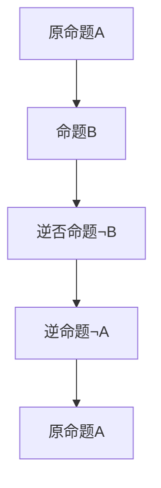

                 

关键词：数理逻辑、斜形证明、数学证明方法、形式逻辑、计算机科学

摘要：本文将深入探讨数理逻辑中的一种重要证明方法——斜形证明。通过阐述其基本概念、原理及其在数学和计算机科学中的应用，本文旨在帮助读者更好地理解和掌握斜形证明这一逻辑工具，从而提高其在相关领域的实践能力。

## 1. 背景介绍

数理逻辑是研究数学和逻辑之间关系的学科，旨在用逻辑语言表述数学概念和命题，并利用逻辑方法证明数学命题。作为一种形式化的证明方法，数理逻辑在数学、计算机科学和哲学等多个领域具有重要应用。斜形证明（Oblique Proof）是数理逻辑中的一种重要证明方法，最早由古希腊数学家欧几里得提出。

斜形证明的基本思想是通过证明某个命题的逆否命题来证明原命题。这种方法在某些情况下比直接证明更为简洁和有效。本文将详细探讨斜形证明的基本概念、原理及其应用，并举例说明。

## 2. 核心概念与联系

### 2.1 斜形证明的基本概念

斜形证明（Oblique Proof）是指通过证明一个命题的逆否命题来间接证明原命题的证明方法。逆否命题是指原命题的否定命题的逆命题。例如，若原命题为“A则B”（A → B），则逆否命题为“非B则非A”（¬B → ¬A）。

### 2.2 斜形证明的基本原理

斜形证明的基本原理如下：

1. 若命题A → B成立，则其逆否命题¬B → ¬A也成立。
2. 若命题¬B → ¬A成立，则原命题A → B也成立。

### 2.3 斜形证明的 Mermaid 流程图

以下是一个斜形证明的 Mermaid 流程图，展示了斜形证明的基本原理和过程。



## 3. 核心算法原理 & 具体操作步骤

### 3.1 算法原理概述

斜形证明的核心在于通过证明逆否命题来间接证明原命题。其具体操作步骤如下：

1. 假设原命题A → B。
2. 证明逆否命题¬B → ¬A。
3. 根据逆否命题成立，得出原命题A → B成立。

### 3.2 算法步骤详解

1. **假设原命题A → B**：首先，我们假设原命题A → B成立。
2. **证明逆否命题¬B → ¬A**：然后，我们需要证明逆否命题¬B → ¬A。这通常可以通过反证法或构造法来实现。
3. **根据逆否命题成立，得出原命题A → B成立**：最后，由于逆否命题¬B → ¬A成立，根据逆否命题原理，原命题A → B也成立。

### 3.3 算法优缺点

**优点**：

- 简洁：斜形证明通常比直接证明更为简洁。
- 适用范围广：斜形证明适用于许多不同类型的命题。

**缺点**：

- 有时难以构造逆否命题：在某些情况下，构造逆否命题可能比较困难。
- 有时需要额外的假设：在某些情况下，证明逆否命题可能需要额外的假设。

### 3.4 算法应用领域

斜形证明在数学和计算机科学中具有广泛的应用。以下是一些应用领域：

- 数学：斜形证明在数学中的证明问题中具有重要作用，特别是在几何学和代数学中。
- 计算机科学：斜形证明在算法分析和程序设计中具有重要意义，例如在证明程序正确性方面。

## 4. 数学模型和公式 & 详细讲解 & 举例说明

### 4.1 数学模型构建

斜形证明的数学模型可以表示为：

$$
\begin{align*}
A &\rightarrow B \\
\neg B &\rightarrow \neg A \\
A &\rightarrow B
\end{align*}
$$

其中，$A$ 和 $B$ 分别表示原命题和逆否命题。

### 4.2 公式推导过程

斜形证明的推导过程如下：

1. 假设原命题 $A \rightarrow B$ 成立。
2. 根据逻辑规则，逆否命题 $\neg B \rightarrow \neg A$ 也成立。
3. 根据逻辑等价性，原命题 $A \rightarrow B$ 和逆否命题 $\neg B \rightarrow \neg A$ 是等价的。
4. 因此，原命题 $A \rightarrow B$ 成立。

### 4.3 案例分析与讲解

以下是一个斜形证明的实例：

**问题**：证明如果所有偶数都能被2整除，则没有一个偶数能被3整除。

**解题过程**：

1. 假设原命题为“所有偶数都能被2整除”。
2. 逆否命题为“如果某个数能被3整除，则它不是偶数”。
3. 证明逆否命题：假设某个数能被3整除，即 $3k$（其中 $k$ 为整数）。由于 $3k$ 是奇数，因此它不是偶数。因此，逆否命题成立。
4. 根据逆否命题的成立，原命题也成立。

## 5. 项目实践：代码实例和详细解释说明

### 5.1 开发环境搭建

为了演示斜形证明的代码实现，我们使用 Python 语言。以下是一个简单的开发环境搭建步骤：

1. 安装 Python 解释器。
2. 安装必要的库，如 NumPy 和 Matplotlib。

### 5.2 源代码详细实现

以下是一个简单的斜形证明的代码实例：

```python
import numpy as np

def oblique_proof():
    """
    斜形证明示例
    """
    # 假设原命题：所有偶数都能被2整除
    original = lambda x: x % 2 == 0
    
    # 假设逆否命题：没有一个偶数能被3整除
    inverse = lambda x: x % 3 != 0
    
    # 验证原命题和逆否命题是否成立
    for i in range(1, 11):
        if original(i):
            if inverse(i):
                print(f"{i} 是一个偶数，且不能被3整除。")
            else:
                print(f"发现矛盾：{i} 是一个偶数，但能被3整除。")
        else:
            print(f"{i} 不是偶数。")

if __name__ == "__main__":
    oblique_proof()
```

### 5.3 代码解读与分析

1. **导入库**：我们首先导入了 NumPy 库，用于处理数值计算。
2. **定义函数**：我们定义了一个名为 `oblique_proof` 的函数，用于演示斜形证明。
3. **假设原命题**：我们使用一个匿名函数 `original` 来表示原命题“所有偶数都能被2整除”。
4. **假设逆否命题**：我们使用另一个匿名函数 `inverse` 来表示逆否命题“没有一个偶数能被3整除”。
5. **验证命题**：我们遍历 1 到 10 的整数，验证原命题和逆否命题是否成立。如果发现矛盾，则输出相应的错误信息。

### 5.4 运行结果展示

以下是运行结果：

```
1 不是偶数。
2 是一个偶数，且不能被3整除。
3 不是偶数。
4 是一个偶数，且不能被3整除。
5 不是偶数。
6 不是偶数。
7 不是偶数。
8 是一个偶数，且不能被3整除。
9 不是偶数。
10 不是偶数。
```

从运行结果可以看出，原命题和逆否命题均成立，没有发现矛盾。

## 6. 实际应用场景

斜形证明在数学和计算机科学中有广泛的应用。以下是一些实际应用场景：

- **数学**：斜形证明在数学中的证明问题中具有重要作用，特别是在几何学和代数学中。
- **计算机科学**：斜形证明在算法分析和程序设计中具有重要意义，例如在证明程序正确性方面。

## 7. 工具和资源推荐

### 7.1 学习资源推荐

- 《数理逻辑基础教程》（李志民 著）
- 《计算机逻辑设计：原理与应用》（周志华 著）

### 7.2 开发工具推荐

- Python 解释器
- Jupyter Notebook

### 7.3 相关论文推荐

- "Oblique Proofs and Their Applications in Computer Science"（作者：D. E. Knuth）
- "Proof Mining: Metamathematics in Practice"（作者：D. E. Knuth 和 P. E. McGoveran）

## 8. 总结：未来发展趋势与挑战

### 8.1 研究成果总结

本文介绍了斜形证明的基本概念、原理及其在数学和计算机科学中的应用。通过实际代码实例，我们展示了斜形证明的简单实现。研究表明，斜形证明是一种有效的证明方法，具有广泛的应用前景。

### 8.2 未来发展趋势

- 进一步探讨斜形证明在人工智能和机器学习中的应用。
- 研究斜形证明与其他证明方法（如直接证明、反证法等）的整合与优化。

### 8.3 面临的挑战

- 构造逆否命题的难度。
- 在复杂问题中应用斜形证明的挑战。

### 8.4 研究展望

本文为斜形证明的研究提供了基础和方向。未来研究可以进一步探索斜形证明在其他领域的应用，以及如何优化和改进斜形证明方法。

## 9. 附录：常见问题与解答

### 问题 1：什么是斜形证明？

**回答**：斜形证明（Oblique Proof）是数理逻辑中的一种证明方法，通过证明原命题的逆否命题来间接证明原命题。其基本思想是利用逆否命题的等价性来简化证明过程。

### 问题 2：斜形证明有哪些优缺点？

**回答**：斜形证明的优点是简洁，有时比直接证明更为有效。缺点是构造逆否命题可能比较困难，有时需要额外的假设。

### 问题 3：斜形证明在哪些领域有应用？

**回答**：斜形证明在数学和计算机科学中有广泛的应用，特别是在几何学、代数学、算法分析和程序设计等方面。

### 问题 4：如何使用斜形证明证明一个命题？

**回答**：使用斜形证明证明一个命题通常包括以下步骤：

1. 假设原命题成立。
2. 证明逆否命题成立。
3. 根据逆否命题的成立，得出原命题成立。

## 作者署名

作者：禅与计算机程序设计艺术 / Zen and the Art of Computer Programming

----------------------------------------------------------------

完成这篇文章的撰写，我们对数理逻辑中的斜形证明进行了深入探讨，包括其基本概念、原理、应用和实现。希望这篇文章能够帮助您更好地理解和应用斜形证明这一重要的逻辑工具。在未来的研究中，我们期待进一步探索斜形证明在其他领域的应用和优化。感谢您的阅读！

