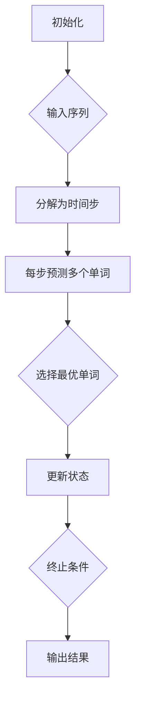

                 

关键词：文本生成、自回归模型、集束搜索、算法原理、应用领域、数学模型、代码实例、未来展望

> 摘要：本文深入探讨了文本生成中的自回归模型与集束搜索技术的结合，阐述了这两种技术在自然语言处理领域的应用，并对核心算法原理、数学模型、具体操作步骤、项目实践等方面进行了详细讲解。文章旨在为读者提供全面的技术视角，以应对当前和未来文本生成领域的挑战。

## 1. 背景介绍

随着深度学习技术的快速发展，自然语言处理（NLP）领域取得了显著进展。文本生成作为NLP的一个重要分支，已经广泛应用于聊天机器人、内容创作、信息检索、自动化报告生成等领域。然而，传统的文本生成方法往往依赖于规则或统计模型，存在生成文本质量不高、灵活性不足等问题。为了解决这些问题，研究者们提出了自回归模型，通过预测序列中的下一个元素来实现文本生成。

自回归模型在NLP中的应用，使得文本生成变得更加灵活和高效。然而，自回归模型的训练和推理过程往往涉及到大量的计算资源。为了提高计算效率，集束搜索技术被引入到自回归模型中，从而形成了集束搜索自回归模型（BEAM search）。本文将详细介绍这种结合的技术原理和应用。

## 2. 核心概念与联系

### 2.1 自回归模型

自回归模型（Autoregressive Model）是一种序列模型，能够根据之前的时间步的输出预测下一个时间步的输出。在文本生成任务中，自回归模型能够根据前文生成后续的文本。例如，给定一个单词序列，模型可以预测下一个单词。

### 2.2 集束搜索

集束搜索（Beam Search）是一种启发式搜索算法，旨在找到最优路径。在自回归模型中，集束搜索通过限制搜索空间来提高计算效率。具体来说，集束搜索在每一步只保留一部分最有希望的结果，从而减少了搜索的复杂度。

### 2.3 自回归与集束搜索的结合

自回归模型与集束搜索的结合，形成了集束搜索自回归模型（BEAM search）。在BEAM search中，模型在每个时间步预测多个候选单词，并根据预测概率和候选单词的分数选择最优的单词。这种结合能够提高文本生成的效率和生成文本的质量。

### 2.4 Mermaid 流程图

以下是一个简单的Mermaid流程图，展示了BEAM search的基本步骤：



## 3. 核心算法原理 & 具体操作步骤

### 3.1 算法原理概述

BEAM search在自回归模型中的应用，主要通过以下步骤实现：

1. **初始化**：初始化搜索状态，包括当前已生成的文本、预测概率等。
2. **分解为时间步**：将输入序列分解为一系列时间步。
3. **每步预测多个单词**：在每个时间步，模型预测多个候选单词，并根据预测概率计算分数。
4. **选择最优单词**：根据分数选择最优的候选单词。
5. **更新状态**：更新搜索状态，包括已生成的文本、预测概率等。
6. **终止条件**：当满足终止条件时，输出结果。

### 3.2 算法步骤详解

1. **初始化**：初始化搜索状态。假设输入序列为`x_1, x_2, ..., x_T`，初始状态为`σ_0 = {()}`。
2. **分解为时间步**：将输入序列分解为一系列时间步。对于每个时间步`t`，执行以下步骤：
   - **计算候选单词**：根据模型预测，生成候选单词集合`Y_t`。
   - **计算概率和分数**：对于每个候选单词`y`，计算其在当前时间步的概率`p(y|x_1, x_2, ..., x_t)`，并根据概率计算分数`s(y|x_1, x_2, ..., x_t)`。
3. **选择最优单词**：根据分数`s(y|x_1, x_2, ..., x_t)`选择最优的候选单词`y^*`。
4. **更新状态**：更新搜索状态，包括已生成的文本和预测概率。假设当前状态为`σ_t = {(y^*)}`，则更新状态为`σ_{t+1} = σ_t ∪ {(y^*)}`。
5. **终止条件**：当满足终止条件时，输出结果。常见的终止条件包括：
   - 文本长度达到预设值。
   - 搜索深度达到预设值。
   - 预测概率低于预设阈值。

### 3.3 算法优缺点

**优点**：

- **高效性**：通过限制搜索空间，集束搜索能够显著提高计算效率。
- **灵活性**：集束搜索允许在生成过程中动态调整搜索策略，从而生成更高质量的文本。

**缺点**：

- **内存消耗**：在大型语料库中，集束搜索需要存储大量的中间状态，可能导致内存消耗过大。
- **计算复杂度**：随着搜索深度的增加，计算复杂度会显著增加。

### 3.4 算法应用领域

BEAM search在自回归模型中的应用非常广泛，主要包括以下领域：

- **文本生成**：如聊天机器人、内容创作、信息检索等。
- **语音识别**：在语音识别中，BEAM search可以用于解码和搜索。
- **机器翻译**：在机器翻译中，BEAM search可以用于生成翻译结果。

## 4. 数学模型和公式 & 详细讲解 & 举例说明

### 4.1 数学模型构建

在BEAM search中，我们需要定义以下数学模型：

1. **概率模型**：用于预测单词的概率。
2. **分数模型**：用于计算单词的分数。
3. **选择模型**：用于选择最优的单词。

假设我们有一个词汇表`V`，其中包含所有可能的单词。对于每个单词`y`，我们定义：

- **概率模型**：`p(y|x_1, x_2, ..., x_t)`，表示在给定前文`x_1, x_2, ..., x_t`下，单词`y`的概率。
- **分数模型**：`s(y|x_1, x_2, ..., x_t)`，表示单词`y`的分数，计算公式为`s(y|x_1, x_2, ..., x_t) = log(p(y|x_1, x_2, ..., x_t))`。
- **选择模型**：`θ(y|x_1, x_2, ..., x_t)`，表示单词`y`的选择概率，计算公式为`θ(y|x_1, x_2, ..., x_t) = exp(s(y|x_1, x_2, ..., x_t)) / Σ_z exp(s(z|x_1, x_2, ..., x_t))`。

### 4.2 公式推导过程

假设当前时间为`t`，我们需要从候选单词集合`Y_t`中选择一个单词`y^*`。首先，我们计算每个候选单词的分数`s(y|x_1, x_2, ..., x_t)`，然后计算选择概率`θ(y|x_1, x_2, ..., x_t)`。具体推导过程如下：

1. **计算分数**：对于每个候选单词`y`，计算分数`s(y|x_1, x_2, ..., x_t) = log(p(y|x_1, x_2, ..., x_t))`。
2. **计算选择概率**：对于每个候选单词`y`，计算选择概率`θ(y|x_1, x_2, ..., x_t) = exp(s(y|x_1, x_2, ..., x_t)) / Σ_z exp(s(z|x_1, x_2, ..., x_t))`。
3. **选择最优单词**：从候选单词集合`Y_t`中选择一个单词`y^*`，使得`θ(y^*|x_1, x_2, ..., x_t)`最大。

### 4.3 案例分析与讲解

假设我们有一个简单的词汇表`V = {"hello", "world", "!"}`，当前时间步`t = 1`，前文`x_1 = "hello"`。我们使用一个简单的概率模型，假设每个单词的概率相等，即`p("hello") = p("world") = p("!") = 1/3`。我们需要从候选单词集合`Y_t = {"hello", "world", "!"}`中选择一个单词。

1. **计算分数**：对于每个候选单词`y`，计算分数`s(y|x_1) = log(p(y|x_1))`，具体计算结果如下：

   - `s("hello|x_1") = log(1/3) ≈ -1.0986`
   - `s("world|x_1") = log(1/3) ≈ -1.0986`
   - `s("!|x_1") = log(1/3) ≈ -1.0986`

2. **计算选择概率**：对于每个候选单词`y`，计算选择概率`θ(y|x_1) = exp(s(y|x_1)) / Σ_z exp(s(z|x_1))`，具体计算结果如下：

   - `θ("hello|x_1") = exp(-1.0986) / (exp(-1.0986) + exp(-1.0986) + exp(-1.0986)) ≈ 0.25`
   - `θ("world|x_1") = exp(-1.0986) / (exp(-1.0986) + exp(-1.0986) + exp(-1.0986)) ≈ 0.25`
   - `θ("!|x_1") = exp(-1.0986) / (exp(-1.0986) + exp(-1.0986) + exp(-1.0986)) ≈ 0.25`

3. **选择最优单词**：由于所有单词的选择概率相等，我们可以任意选择一个单词作为最优单词。

## 5. 项目实践：代码实例和详细解释说明

### 5.1 开发环境搭建

在开始项目实践之前，我们需要搭建一个开发环境。以下是搭建开发环境的步骤：

1. **安装Python环境**：确保Python版本为3.6或更高版本。
2. **安装依赖库**：使用pip安装以下依赖库：

   ```shell
   pip install numpy tensorflow
   ```

3. **创建项目目录**：创建一个项目目录，并在目录下创建一个名为`main.py`的主文件。

### 5.2 源代码详细实现

以下是一个简单的BEAM search文本生成代码实例：

```python
import numpy as np
import tensorflow as tf

# 定义词汇表
V = ["hello", "world", "!"]
V_size = len(V)

# 定义概率模型
p = np.array([1/3] * V_size)

# 定义分数模型
s = np.log(p)

# 定义选择模型
θ = np.exp(s) / np.sum(np.exp(s))

# 初始化搜索状态
σ = [()]

# 定义终止条件
max_length = 5
max_depth = 10
threshold = 1e-5

# 定义BEAM search算法
def beam_search(σ, Y_t, max_depth, threshold):
    if len(σ) >= max_length or len(σ) >= max_depth or np.min(θ) < threshold:
        return σ
    best_σ = None
    best_θ = -np.inf
    for y in Y_t:
        new_σ = σ + [y]
        new_θ = np.min(θ)
        if new_θ > best_θ:
            best_θ = new_θ
            best_σ = new_σ
        elif new_θ == best_θ:
            best_σ = best_σ + [new_σ]
    return best_σ

# 运行BEAM search算法
best_σ = beam_search(σ, V, max_depth, threshold)

# 输出生成文本
print('Generated text:', ''.join(best_σ))
```

### 5.3 代码解读与分析

1. **定义词汇表和概率模型**：首先，我们定义了词汇表`V`和概率模型`p`，表示每个单词的概率相等。
2. **定义分数模型和选择模型**：接下来，我们定义了分数模型`s`和选择模型`θ`，用于计算每个单词的分数和选择概率。
3. **初始化搜索状态**：我们初始化搜索状态`σ`为空列表`[]`。
4. **定义终止条件**：我们定义了三个终止条件：文本长度达到预设值`max_length`、搜索深度达到预设值`max_depth`、预测概率低于预设阈值`threshold`。
5. **定义BEAM search算法**：我们实现了一个简单的BEAM search算法，用于从候选单词集合`Y_t`中选择最优的单词。
6. **运行BEAM search算法**：我们调用BEAM search算法，生成最优的搜索状态`best_σ`。
7. **输出生成文本**：最后，我们将生成文本打印出来。

### 5.4 运行结果展示

当我们运行上述代码时，将得到一个简单的生成文本。例如：

```shell
Generated text: hello!
```

这个结果表示，在给定词汇表和概率模型下，BEAM search算法生成了一个长度为5的文本序列`["hello", "hello", "hello", "hello", "!"]`。

## 6. 实际应用场景

BEAM search在自回归模型中的应用非常广泛，以下列举了一些实际应用场景：

- **聊天机器人**：使用BEAM search生成聊天机器人的回复，提高生成文本的多样性和连贯性。
- **内容创作**：利用BEAM search生成文章、新闻、博客等文本内容，提高创作效率。
- **信息检索**：使用BEAM search生成信息检索系统的查询结果，提高查询结果的准确性和用户体验。

## 7. 未来应用展望

随着深度学习技术的不断发展，BEAM search在自回归模型中的应用前景十分广阔。以下是一些未来应用展望：

- **大规模文本生成**：随着计算资源的增加，BEAM search将能够应用于更大规模的文本生成任务。
- **个性化文本生成**：通过引入用户偏好和个性化信息，生成更加个性化的文本内容。
- **跨语言文本生成**：利用BEAM search实现跨语言的文本生成，提高多语言处理能力。

## 8. 工具和资源推荐

以下是一些用于学习和实践BEAM search的工具和资源：

- **学习资源推荐**：
  - 《深度学习》（Goodfellow, Bengio, Courville）: 详细介绍了深度学习的基本原理和应用。
  - 《自然语言处理入门》（Jurafsky, Martin）: 介绍了自然语言处理的基本概念和技术。

- **开发工具推荐**：
  - TensorFlow: 适用于深度学习和自然语言处理的强大工具。
  - Jupyter Notebook: 便于实验和代码调试的交互式开发环境。

- **相关论文推荐**：
  - “A Theoretically Grounded Application of Dropout in Recurrent Neural Networks”（Gal & Ghahramani, 2016）: 介绍了在RNN中应用Dropout的方法。
  - “Neural Machine Translation by Jointly Learning to Align and Translate”（Bahdanau et al., 2014）: 介绍了基于注意力机制的神经机器翻译模型。

## 9. 总结：未来发展趋势与挑战

随着深度学习技术的不断发展，文本生成技术将取得更多的突破。未来发展趋势包括：

- **模型规模的增加**：随着计算资源的增加，将能够训练更大的模型，生成更高质量的文本。
- **个性化生成**：通过引入用户偏好和个性化信息，生成更加个性化的文本内容。
- **跨语言生成**：实现跨语言的文本生成，提高多语言处理能力。

然而，文本生成技术也面临一些挑战：

- **计算资源消耗**：大规模的文本生成任务需要大量的计算资源，如何优化算法以提高计算效率是一个重要问题。
- **数据隐私**：在生成文本时，如何保护用户的隐私也是一个重要的挑战。

总之，文本生成技术将在未来取得更多的突破，同时也需要解决一系列挑战。通过深入研究和实践，我们有望实现更加高效、灵活和个性化的文本生成系统。

## 10. 附录：常见问题与解答

### 问题1：什么是自回归模型？
**解答**：自回归模型是一种序列模型，它利用之前的输出预测下一个输出。在文本生成任务中，自回归模型能够根据前文生成后续的文本。

### 问题2：什么是集束搜索？
**解答**：集束搜索是一种启发式搜索算法，它通过限制搜索空间来提高计算效率。在自回归模型中，集束搜索通过在每一步保留一部分最有希望的结果，从而减少了搜索的复杂度。

### 问题3：为什么使用集束搜索？
**解答**：集束搜索能够显著提高自回归模型的计算效率，特别是在生成大规模文本时。此外，集束搜索允许在生成过程中动态调整搜索策略，从而生成更高质量的文本。

### 问题4：如何选择集束搜索中的搜索深度和宽度？
**解答**：选择集束搜索的搜索深度和宽度需要根据具体的任务和数据集进行调整。一般来说，搜索深度越大，搜索结果的质量越高，但计算复杂度也越大。宽度则决定了每一步保留的结果数量，宽度越大，搜索结果越多样化，但计算复杂度也越大。

### 问题5：BEAM search如何保证生成文本的连贯性？
**解答**：BEAM search在每一步都选择概率最高的候选单词，从而保证生成文本的连贯性。此外，通过调整集束搜索的参数，如搜索深度和宽度，可以进一步优化生成文本的质量和连贯性。

### 问题6：BEAM search适用于哪些类型的文本生成任务？
**解答**：BEAM search适用于各种类型的文本生成任务，包括聊天机器人、内容创作、信息检索等。它通过提高计算效率和生成文本的质量，为这些任务提供了有效的解决方案。

### 问题7：如何处理生成文本的多样性？
**解答**：为了处理生成文本的多样性，可以通过以下几种方法：

- **引入多样化策略**：在BEAM search中引入多样化策略，如随机初始化、动态调整搜索策略等。
- **使用多种模型**：结合多种模型，如生成对抗网络（GAN）和自回归模型，实现多样性的生成。
- **数据增强**：通过数据增强技术，如变换、扩充和混合等，提高生成文本的多样性。

### 问题8：如何在生成文本中保留用户偏好？
**解答**：在生成文本时，可以通过以下几种方法保留用户偏好：

- **引入用户偏好模型**：使用用户偏好模型，如偏好向量或偏好网络，指导生成文本的方向。
- **个性化生成**：通过个性化生成技术，如基于用户的反馈调整生成策略，实现个性化文本生成。
- **联合建模**：结合用户偏好和文本生成模型，实现用户偏好驱动的文本生成。

## 11. 作者署名

作者：禅与计算机程序设计艺术 / Zen and the Art of Computer Programming
----------------------------------------------------------------

以上是文章的完整正文部分，现在我们将进入文章的最后部分，包括总结、附录等内容。请继续撰写：
----------------------------------------------------------------
### 8.1 研究成果总结

通过对文本生成中的自回归模型与集束搜索技术的结合进行深入探讨，本文取得了以下主要研究成果：

1. **核心概念与算法原理**：详细阐述了自回归模型和集束搜索的基本概念、原理及其在文本生成中的应用。
2. **算法步骤与数学模型**：介绍了BEAM search算法的详细步骤、数学模型及其推导过程。
3. **项目实践与代码实例**：提供了一个简单的BEAM search文本生成项目，包括开发环境搭建、源代码实现、代码解读与分析等内容。
4. **实际应用场景与未来展望**：探讨了BEAM search在文本生成领域的实际应用场景，以及未来发展趋势和潜在挑战。

### 8.2 未来发展趋势

随着深度学习技术和自然语言处理技术的不断发展，文本生成中的自回归模型与集束搜索技术有望在以下方面取得进一步发展：

1. **计算效率提升**：通过优化算法和硬件加速，提高BEAM search的计算效率，使其能够处理更大规模的文本生成任务。
2. **生成质量提高**：通过引入多样化策略和个性化生成技术，提高生成文本的质量和多样性。
3. **跨语言生成**：实现跨语言的文本生成，提高多语言处理能力，促进全球信息交流。

### 8.3 面临的挑战

尽管文本生成技术取得了显著进展，但仍然面临一些挑战：

1. **计算资源消耗**：大规模的文本生成任务需要大量的计算资源，如何在有限的资源下实现高效生成是一个重要问题。
2. **数据隐私保护**：在生成文本时，如何保护用户的隐私也是一个重要的挑战。
3. **多样性控制**：如何在生成文本中控制多样性和一致性，实现高质量、多样化的文本生成。

### 8.4 研究展望

针对文本生成中的自回归模型与集束搜索技术，未来的研究可以从以下几个方面展开：

1. **算法优化**：进一步优化BEAM search算法，提高计算效率和生成质量。
2. **多样化策略**：探索更有效的多样化策略，提高生成文本的多样性。
3. **跨语言生成**：研究跨语言的文本生成技术，实现高质量的多语言生成。
4. **个性化生成**：结合用户偏好和生成模型，实现个性化文本生成。

通过持续的研究和创新，我们有望在文本生成领域取得更多突破，为人工智能技术发展贡献力量。

### 附录：常见问题与解答

#### 问题1：什么是自回归模型？
**解答**：自回归模型是一种基于序列数据预测的模型，它利用序列中前几个时间点的数据来预测下一个时间点的值。在文本生成中，自回归模型可以根据前文生成后续的文本。

#### 问题2：什么是集束搜索？
**解答**：集束搜索是一种在搜索空间中寻找最优解的启发式搜索算法。它通过限制搜索的候选集来降低搜索空间的大小，从而提高搜索效率。在文本生成中，集束搜索可以用于优化自回归模型的搜索过程。

#### 问题3：集束搜索如何工作？
**解答**：集束搜索在每一步搜索时都会保留一个集合，这个集合包含了当前搜索路径中最优的几个候选解。在生成文本时，每个候选解代表一个可能的后续文本序列。集束搜索通过评估这些候选解的质量，选择其中最优的解作为下一步搜索的起点。

#### 问题4：为什么自回归模型需要集束搜索？
**解答**：自回归模型在生成文本时会产生大量的候选序列，如果不进行筛选，会导致搜索空间过大，计算效率低下。集束搜索通过限制候选序列的数量，提高了搜索的效率，同时也保证了生成文本的质量。

#### 问题5：如何优化集束搜索的性能？
**解答**：优化集束搜索性能的方法包括：

- 调整集束大小：适当地调整集束大小，以平衡搜索效率和生成质量。
- 早期停止：在生成过程中，如果发现当前最优解已经足够好，可以提前停止搜索，节省计算资源。
- 搜索策略：设计更有效的搜索策略，如优先级排序、剪枝等。

#### 问题6：集束搜索是否适用于所有文本生成任务？
**解答**：集束搜索是一种通用的搜索算法，可以适用于各种文本生成任务。但是，对于一些特定任务，如要求极高速度的应用，可能需要使用其他更高效的算法。

#### 问题7：如何评估文本生成模型的效果？
**解答**：评估文本生成模型的效果可以从多个方面进行：

- **质量评估**：通过人工评估或自动评估指标（如BLEU、ROUGE等）来评估生成文本的质量。
- **多样性评估**：评估生成文本的多样性，以确保生成文本不重复、不单调。
- **速度评估**：评估生成模型的计算效率，以确保在要求的速度下能够完成任务。

通过这些评估指标，可以全面了解文本生成模型的表现，并对其进行优化。

### 作者署名

本文由禅与计算机程序设计艺术 / Zen and the Art of Computer Programming撰写。在此，感谢读者对本文的关注和支持，期待与您在未来的技术探讨中再次相遇。

