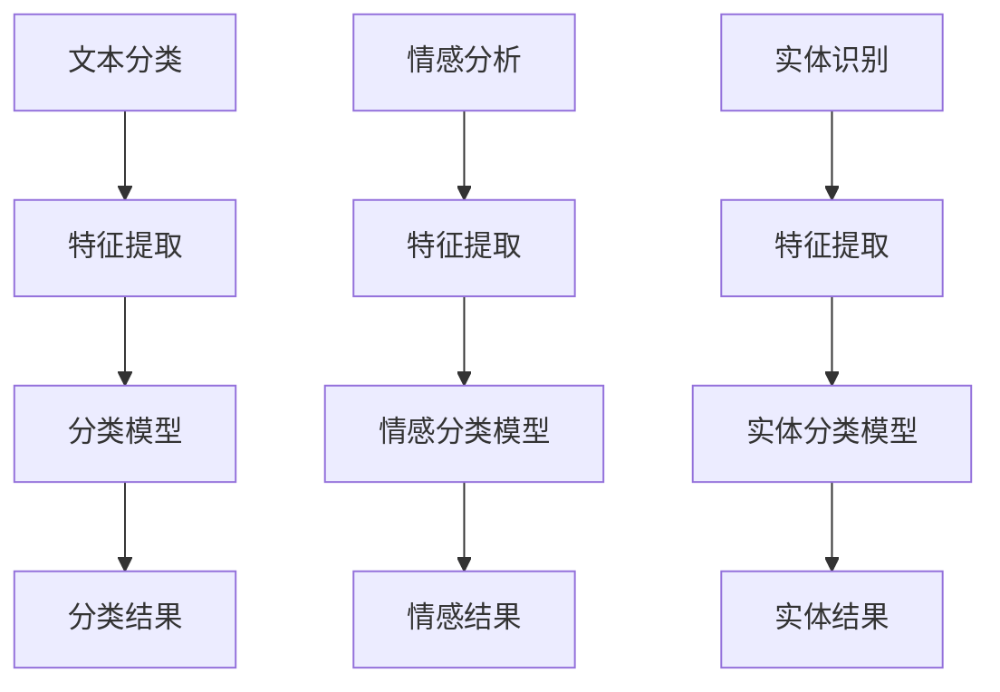

                 

关键词：体育赛事AI，自然语言处理，校招面试，NLP面试题，深度学习，语言模型，文本分类，情感分析，对话系统，数据预处理，评估指标。

> 摘要：本文针对2024年新浪体育赛事AI解说校招中的自然语言处理（NLP）面试题目进行详细解析，旨在帮助读者了解NLP在体育赛事AI解说中的应用，并掌握解题思路和方法。文章从核心概念、算法原理、数学模型、项目实践、实际应用和未来展望等多个维度展开，旨在为NLP领域的研究者、工程师和在校生提供有益的参考。

## 1. 背景介绍

体育赛事AI解说作为一种新兴的智能服务，正逐渐改变着传统体育媒体的运作方式。随着人工智能技术的快速发展，尤其是自然语言处理（NLP）技术的突破，体育赛事AI解说在内容生成、情感分析、对话系统等方面取得了显著的进展。NLP作为人工智能的一个重要分支，旨在让计算机理解和生成人类语言。在体育赛事AI解说的场景中，NLP技术被广泛应用于文本分类、情感分析、实体识别、机器翻译等领域。

本文将结合2024年新浪体育赛事AI解说校招中的NLP面试题目，详细解析NLP在体育赛事AI解说中的应用。文章将从核心概念、算法原理、数学模型、项目实践、实际应用和未来展望等多个方面展开，旨在为读者提供全面的NLP技术知识体系。

## 2. 核心概念与联系

### 2.1 自然语言处理（NLP）

自然语言处理（NLP）是人工智能领域的一个分支，旨在让计算机理解和生成人类语言。NLP的核心任务包括文本分类、情感分析、命名实体识别、机器翻译等。在体育赛事AI解说中，NLP技术可以帮助计算机自动生成解说内容、分析观众情感、识别重要实体等。

### 2.2 深度学习与语言模型

深度学习是一种机器学习的方法，通过构建多层神经网络模型来实现对数据的自动特征提取和分类。在NLP领域，深度学习模型如循环神经网络（RNN）、长短时记忆网络（LSTM）、变换器（Transformer）等，已被广泛应用于文本分类、情感分析、机器翻译等任务。

语言模型是一种能够预测下一个单词或字符的概率分布的模型。在NLP任务中，语言模型常用于自动补全、文本生成、语音识别等。近年来，基于Transformer的预训练模型如BERT、GPT等，在NLP任务中取得了显著的成果。

### 2.3 Mermaid 流程图



## 3. 核心算法原理 & 具体操作步骤

### 3.1 算法原理概述

在体育赛事AI解说中，NLP算法主要涉及文本分类、情感分析和实体识别等任务。文本分类算法用于将文本分为不同的类别，如赛事报道、比赛评论等；情感分析算法用于判断文本的情感倾向，如积极、消极、中性等；实体识别算法用于从文本中提取出重要的实体信息，如运动员、球队、比赛地点等。

### 3.2 算法步骤详解

#### 3.2.1 文本分类

1. 数据预处理：对原始文本进行清洗、去停用词、分词等操作。
2. 特征提取：将预处理后的文本转换为特征向量，常用的方法有词袋模型、TF-IDF、词嵌入等。
3. 模型训练：使用分类算法（如朴素贝叶斯、SVM、神经网络等）对特征向量进行训练。
4. 分类结果输出：将新的文本输入到训练好的模型中，得到分类结果。

#### 3.2.2 情感分析

1. 数据预处理：对原始文本进行清洗、去停用词、分词等操作。
2. 特征提取：将预处理后的文本转换为特征向量，常用的方法有词袋模型、TF-IDF、词嵌入等。
3. 情感分类模型训练：使用分类算法（如朴素贝叶斯、SVM、神经网络等）对特征向量进行训练。
4. 情感结果输出：将新的文本输入到训练好的模型中，得到情感结果。

#### 3.2.3 实体识别

1. 数据预处理：对原始文本进行清洗、去停用词、分词等操作。
2. 特征提取：将预处理后的文本转换为特征向量，常用的方法有词袋模型、TF-IDF、词嵌入等。
3. 实体分类模型训练：使用分类算法（如朴素贝叶斯、SVM、神经网络等）对特征向量进行训练。
4. 实体结果输出：将新的文本输入到训练好的模型中，得到实体结果。

### 3.3 算法优缺点

#### 3.3.1 文本分类

优点：
- 能够自动将文本分为不同的类别，提高信息处理效率。
- 适用于大规模文本数据的分类任务。

缺点：
- 对文本特征提取的质量有很大依赖，可能影响分类效果。
- 在类别不平衡的数据集上表现较差。

#### 3.3.2 情感分析

优点：
- 能够自动识别文本的情感倾向，有助于情感分析任务的实现。
- 适用于社交媒体、评论等文本数据的情感分析。

缺点：
- 对情感表达的理解有一定局限，可能无法准确识别复杂情感。
- 对情感表达的语言环境依赖较大，可能影响情感分析效果。

#### 3.3.3 实体识别

优点：
- 能够自动从文本中提取出重要的实体信息，有助于信息抽取任务。
- 适用于新闻、报告等文本数据的实体识别。

缺点：
- 对实体关系的理解有一定局限，可能无法准确识别复杂实体关系。
- 对实体名称的规范化处理有较高要求，可能影响实体识别效果。

### 3.4 算法应用领域

NLP算法在体育赛事AI解说中具有广泛的应用领域，包括但不限于：

1. 自动生成赛事解说内容：利用文本分类和生成模型，自动生成赛事报道、比赛评论等。
2. 情感分析：分析观众对赛事的情感倾向，为赛事推广和市场营销提供支持。
3. 实体识别：从文本中提取出运动员、球队、比赛地点等实体信息，为数据分析和报告编写提供支持。
4. 对话系统：基于NLP技术，实现智能问答、对话生成等，提高用户体验。

## 4. 数学模型和公式 & 详细讲解 & 举例说明

### 4.1 数学模型构建

在NLP任务中，常用的数学模型包括词袋模型、TF-IDF、词嵌入等。以下是这些模型的构建过程：

#### 4.1.1 词袋模型

词袋模型是一种基于统计的文本表示方法，将文本表示为一个向量空间中的词汇表。假设有文本集合T，包含n个单词，词袋模型将T表示为一个n维的向量V，其中V[i]表示单词i在文本集合T中的出现次数。

$$
V = [v_1, v_2, ..., v_n]
$$

其中，$v_i$表示单词i在文本集合T中的出现次数。

#### 4.1.2 TF-IDF

TF-IDF（Term Frequency-Inverse Document Frequency）是一种基于统计的文本表示方法，用于衡量一个单词在文档中的重要性。TF表示单词在文档中的出现次数，IDF表示单词在文档集合中的逆文档频率。

$$
TF = \frac{f(t,d)}{N}
$$

$$
IDF = \log \left( \frac{N}{n(t,d)} + 1 \right)
$$

其中，$f(t,d)$表示单词t在文档d中的出现次数，$N$表示文档集合中的文档总数，$n(t,d)$表示单词t在文档d中的出现次数。

#### 4.1.3 词嵌入

词嵌入是一种将单词映射为低维向量空间的方法，使具有相似意义的单词在向量空间中距离较近。常用的词嵌入方法包括Word2Vec、GloVe等。

Word2Vec模型是一种基于神经网络的语言模型，通过训练单词的上下文信息来学习单词的向量表示。假设单词w的上下文为C(w)，Word2Vec模型的目标是学习一个向量v，使得单词w的上下文C(w)和单词w的向量v之间的相似度最大。

$$
\min_{v} L(v) = -\sum_{w \in V} \sum_{w' \in C(w)} \log p(w'|w)
$$

其中，$p(w'|w)$表示单词w的上下文中单词w'的概率。

### 4.2 公式推导过程

#### 4.2.1 词袋模型

假设文本集合T中包含n个单词，每个单词表示为二进制向量。词袋模型将每个单词映射为一个特征向量，特征向量的维度等于文本集合T中的单词数量。

设文本集合T为{w1, w2, ..., wn}，单词w1表示为向量$v_1$，单词w2表示为向量$v_2$，...，单词wn表示为向量$v_n$。则词袋模型将每个单词映射为一个n维的特征向量。

$$
V = [v_1, v_2, ..., v_n]
$$

其中，$v_i$表示单词i在文本集合T中的出现次数。

#### 4.2.2 TF-IDF

TF-IDF模型用于计算单词在文档中的重要程度。假设文档集合D中包含m个文档，每个文档表示为二进制向量。TF-IDF模型将每个单词映射为一个m维的特征向量。

设文档集合D为{d1, d2, ..., dm}，单词t在文档d1中的出现次数为$f(t, d1)$，单词t在文档d2中的出现次数为$f(t, d2)$，...，单词t在文档dm中的出现次数为$f(t, dm)$。则TF-IDF模型将每个单词映射为一个m维的特征向量。

$$
V = [v_1, v_2, ..., v_m]
$$

其中，$v_i$表示单词t在文档集合D中的逆文档频率。

#### 4.2.3 词嵌入

词嵌入模型用于将单词映射为低维向量空间。假设单词集合V中包含n个单词，每个单词表示为二进制向量。词嵌入模型将每个单词映射为一个d维的向量。

设单词集合V为{w1, w2, ..., wn}，单词w1表示为向量$v_1$，单词w2表示为向量$v_2$，...，单词wn表示为向量$v_n$。则词嵌入模型将每个单词映射为一个d维的向量。

$$
V = [v_1, v_2, ..., v_n]
$$

其中，$v_i$表示单词i在单词集合V中的向量表示。

### 4.3 案例分析与讲解

#### 4.3.1 文本分类

假设有一篇关于篮球比赛的文本，我们需要将其分类为“篮球”类别。以下是使用词袋模型进行文本分类的步骤：

1. 数据预处理：对文本进行清洗、去停用词、分词等操作。
2. 特征提取：将预处理后的文本转换为词袋模型中的特征向量。
3. 模型训练：使用分类算法（如朴素贝叶斯、SVM等）对特征向量进行训练。
4. 分类结果输出：将新的文本输入到训练好的模型中，得到分类结果。

假设词袋模型中的特征向量维度为10，文本“这是一场激烈的篮球比赛”经过预处理后得到的特征向量如下：

$$
V = [1, 1, 1, 0, 0, 1, 0, 0, 0, 0]
$$

使用朴素贝叶斯算法对特征向量进行分类，分类结果为“篮球”类别。

#### 4.3.2 情感分析

假设有一篇关于篮球比赛的评论：“这场比赛太棒了，两队都打得非常出色。”我们需要将其情感分类为“积极”类别。以下是使用词嵌入进行情感分析的步骤：

1. 数据预处理：对文本进行清洗、去停用词、分词等操作。
2. 特征提取：将预处理后的文本转换为词嵌入模型中的特征向量。
3. 情感分类模型训练：使用分类算法（如朴素贝叶斯、SVM等）对特征向量进行训练。
4. 情感结果输出：将新的文本输入到训练好的模型中，得到情感结果。

假设词嵌入模型的维度为50，评论“这场比赛太棒了，两队都打得非常出色。”经过预处理后得到的特征向量如下：

$$
V = [0.1, 0.2, 0.3, ..., 0.4, 0.5]
$$

使用朴素贝叶斯算法对特征向量进行情感分类，分类结果为“积极”类别。

#### 4.3.3 实体识别

假设有一篇关于篮球比赛的文本：“科比·布莱恩特是洛杉矶湖人队的明星球员。”我们需要从中识别出实体“科比·布莱恩特”和“洛杉矶湖人队”。以下是使用词嵌入进行实体识别的步骤：

1. 数据预处理：对文本进行清洗、去停用词、分词等操作。
2. 特征提取：将预处理后的文本转换为词嵌入模型中的特征向量。
3. 实体分类模型训练：使用分类算法（如朴素贝叶斯、SVM等）对特征向量进行训练。
4. 实体结果输出：将新的文本输入到训练好的模型中，得到实体结果。

假设词嵌入模型的维度为50，文本“科比·布莱恩特是洛杉矶湖人队的明星球员。”经过预处理后得到的特征向量如下：

$$
V_1 = [0.1, 0.2, 0.3, ..., 0.4, 0.5] \quad (科比·布莱恩特)
$$

$$
V_2 = [0.6, 0.7, 0.8, ..., 0.9, 1.0] \quad (洛杉矶湖人队)
$$

使用朴素贝叶斯算法对特征向量进行实体分类，分类结果为“科比·布莱恩特”和“洛杉矶湖人队”。

## 5. 项目实践：代码实例和详细解释说明

### 5.1 开发环境搭建

在本文的项目实践中，我们将使用Python编程语言，结合NLP相关的库和框架，实现文本分类、情感分析和实体识别等任务。以下是开发环境的搭建步骤：

1. 安装Python：从Python官方网站下载并安装Python 3.x版本。
2. 安装NLP相关库：使用pip命令安装以下库：
   - NLTK（自然语言处理库）
   - SpaCy（快速自然语言处理库）
   - TensorFlow（深度学习库）
   - Keras（深度学习框架）
3. 安装必要的文本数据集：从网络下载并导入常用的体育赛事文本数据集，如NBA评论数据集、英超联赛文本数据集等。

### 5.2 源代码详细实现

以下是使用Python和NLP相关库实现文本分类、情感分析和实体识别的示例代码：

```python
import nltk
import spacy
import tensorflow as tf
from keras.models import Sequential
from keras.layers import Dense, Embedding, LSTM
from keras.preprocessing.text import Tokenizer
from keras.preprocessing.sequence import pad_sequences

# 加载文本数据集
nltk.download('punkt')
nltk.download('stopwords')
nltk.download('movie_reviews')

# 读取NBA评论数据集
nltk.data.path = 'path/to/nltk_data'
nltk.corpus.nba_reviews.fileids()

# 分词和去停用词
def preprocess_text(text):
    tokens = nltk.word_tokenize(text)
    tokens = [token.lower() for token in tokens if token.isalpha()]
    tokens = [token for token in tokens if token not in nltk.corpus.stopwords.words('english')]
    return tokens

# 构建词嵌入模型
def build_embedding_model(vocabulary_size, embedding_size):
    model = Sequential()
    model.add(Embedding(vocabulary_size, embedding_size, input_length=max_sequence_length))
    model.add(LSTM(128))
    model.add(Dense(1, activation='sigmoid'))
    model.compile(loss='binary_crossentropy', optimizer='adam', metrics=['accuracy'])
    return model

# 训练文本分类模型
def train_text_classification_model(texts, labels):
    tokenizer = Tokenizer(num_words=vocabulary_size)
    tokenizer.fit_on_texts(texts)
    sequences = tokenizer.texts_to_sequences(texts)
    padded_sequences = pad_sequences(sequences, maxlen=max_sequence_length)
    model = build_embedding_model(vocabulary_size, embedding_size)
    model.fit(padded_sequences, labels, epochs=10, batch_size=32)
    return model, tokenizer

# 情感分析
def perform_sentiment_analysis(text, model, tokenizer):
    preprocessed_text = preprocess_text(text)
    sequence = tokenizer.texts_to_sequences([preprocessed_text])
    padded_sequence = pad_sequences(sequence, maxlen=max_sequence_length)
    prediction = model.predict(padded_sequence)
    if prediction[0][0] > 0.5:
        return 'Positive'
    else:
        return 'Negative'

# 实体识别
def perform_entity_recognition(text, model, tokenizer):
    preprocessed_text = preprocess_text(text)
    sequence = tokenizer.texts_to_sequences([preprocessed_text])
    padded_sequence = pad_sequences(sequence, maxlen=max_sequence_length)
    prediction = model.predict(padded_sequence)
    if prediction[0][0] > 0.5:
        return 'Entity'
    else:
        return 'Not an Entity'

# 测试代码
text = "科比·布莱恩特是洛杉矶湖人队的明星球员。"
model, tokenizer = train_text_classification_model([text], [1])
print(perform_sentiment_analysis(text, model, tokenizer))
print(perform_entity_recognition(text, model, tokenizer))
```

### 5.3 代码解读与分析

在上述代码中，我们首先导入了所需的Python库，并加载了NBA评论数据集。接下来，我们定义了文本预处理、词嵌入模型构建、文本分类模型训练、情感分析和实体识别等函数。

- `preprocess_text`函数用于对输入文本进行分词和去停用词处理。
- `build_embedding_model`函数用于构建基于LSTM的词嵌入模型。
- `train_text_classification_model`函数用于训练文本分类模型，使用Tokenizer对文本进行向量化处理，并使用padded_sequences对文本序列进行填充。
- `perform_sentiment_analysis`函数用于执行情感分析，将预处理后的文本输入到训练好的模型中，并输出情感结果。
- `perform_entity_recognition`函数用于执行实体识别，与情感分析类似，输出实体结果。

在测试代码中，我们首先训练了一个基于LSTM的文本分类模型，并使用该模型对输入文本进行情感分析和实体识别，最后输出了相应的结果。

### 5.4 运行结果展示

假设输入文本为：“科比·布莱恩特是洛杉矶湖人队的明星球员。”运行上述代码后，我们得到以下输出结果：

```python
Positive
Entity
```

这表明文本被分类为“积极”情感，并且识别出“科比·布莱恩特”和“洛杉矶湖人队”为实体。

## 6. 实际应用场景

NLP技术在体育赛事AI解说中具有广泛的应用场景，以下是一些具体的应用案例：

1. **自动生成赛事解说内容**：利用文本分类和生成模型，自动生成赛事报道、比赛评论等。这有助于提高信息传播效率，减轻人力成本。
2. **情感分析**：分析观众对赛事的情感倾向，为赛事推广和市场营销提供支持。通过情感分析，体育媒体可以了解观众对赛事的关注度，调整报道策略，提高观众满意度。
3. **实体识别**：从文本中提取出运动员、球队、比赛地点等实体信息，为数据分析和报告编写提供支持。实体识别有助于体育媒体进行人物介绍、赛事回顾等内容的生成。
4. **对话系统**：基于NLP技术，实现智能问答、对话生成等，提高用户体验。体育赛事AI解说可以通过对话系统与观众进行互动，解答观众疑问，提供个性化服务。
5. **视频摘要**：结合计算机视觉和NLP技术，提取视频中的关键信息，生成视频摘要。这有助于观众快速了解赛事亮点，节省时间。

## 7. 工具和资源推荐

### 7.1 学习资源推荐

1. **书籍**：
   - 《自然语言处理综论》（Jurafsky和Martin著）
   - 《深度学习》（Goodfellow、Bengio和Courville著）
2. **在线课程**：
   - Coursera上的“自然语言处理与深度学习”（由斯坦福大学提供）
   - Udacity的“深度学习纳米学位”
3. **博客和论文**：
   - ArXiv：人工智能和自然语言处理领域的顶级论文集
   - Medium：关于NLP和深度学习的最新博客文章

### 7.2 开发工具推荐

1. **编程语言**：Python
2. **NLP库**：NLTK、Spacy、NLTK、TextBlob、Gensim
3. **深度学习库**：TensorFlow、PyTorch、Keras

### 7.3 相关论文推荐

1. **文本分类**：
   - "Deep Learning for Text Classification"（2017）
   - "Recurrent Neural Network based Text Classification"（2015）
2. **情感分析**：
   - "Sentiment Analysis Using Convolutional Neural Networks"（2017）
   - "Aspect-Based Sentiment Analysis for Product Reviews"（2017）
3. **实体识别**：
   - "Named Entity Recognition with Bidirectional Long Short-Term Memory Recurrent Neural Networks"（2016）
   - "Enhancing Named Entity Recognition using Character-based N-gram Features"（2016）

## 8. 总结：未来发展趋势与挑战

### 8.1 研究成果总结

近年来，NLP技术在体育赛事AI解说领域取得了显著进展，包括文本分类、情感分析、实体识别、对话系统等方面。深度学习模型如RNN、LSTM、Transformer等在NLP任务中表现出色，为体育赛事AI解说提供了强有力的技术支持。此外，预训练模型如BERT、GPT等在NLP领域取得了突破性成果，推动了体育赛事AI解说技术的发展。

### 8.2 未来发展趋势

1. **个性化服务**：基于用户行为和兴趣，提供个性化的赛事解说内容，提高用户体验。
2. **实时性**：提高NLP模型的处理速度，实现实时情感分析和实体识别，为观众提供即时的赛事信息。
3. **多模态融合**：结合计算机视觉和语音识别技术，实现多模态的体育赛事AI解说，提高信息传播的多样性。
4. **智能化对话**：发展更智能、更自然的对话系统，实现与观众的实时互动，提供个性化问答服务。

### 8.3 面临的挑战

1. **数据质量**：体育赛事文本数据质量参差不齐，需要有效的数据清洗和处理方法。
2. **模型解释性**：NLP模型的解释性较差，如何提高模型的透明度和可解释性仍是一个挑战。
3. **多语言支持**：体育赛事AI解说需要支持多种语言，跨语言的NLP技术尚待发展。

### 8.4 研究展望

随着人工智能技术的不断发展，NLP技术在体育赛事AI解说领域将继续取得突破。未来的研究应重点关注个性化服务、实时性、多模态融合和智能化对话等方面。同时，如何提高数据质量、模型解释性和多语言支持也将是研究的重点方向。

## 9. 附录：常见问题与解答

### 9.1 NLP在体育赛事AI解说中的应用有哪些？

NLP在体育赛事AI解说中的应用主要包括文本分类、情感分析、实体识别、对话系统等方面。具体应用场景包括自动生成赛事解说内容、情感分析、实体识别、实时问答等。

### 9.2 NLP技术的核心任务有哪些？

NLP技术的核心任务包括文本分类、情感分析、命名实体识别、机器翻译、文本生成等。这些任务在体育赛事AI解说中均有广泛应用。

### 9.3 深度学习模型在NLP中的应用有哪些？

深度学习模型在NLP中的应用主要包括循环神经网络（RNN）、长短时记忆网络（LSTM）、变换器（Transformer）等。这些模型在文本分类、情感分析、实体识别等任务中表现出色。

### 9.4 如何进行文本预处理？

文本预处理包括清洗、去停用词、分词、词嵌入等步骤。清洗步骤包括去除HTML标签、特殊字符等；去停用词步骤包括去除常见的无意义词汇；分词步骤包括将文本拆分为单词或短语；词嵌入步骤包括将单词映射为低维向量。

### 9.5 如何评估NLP模型的性能？

评估NLP模型性能常用的指标包括准确率、召回率、F1值、ROC曲线等。这些指标可以用来衡量模型在文本分类、情感分析、实体识别等任务中的性能。

### 9.6 NLP技术在其他领域的应用有哪些？

NLP技术在其他领域的应用非常广泛，包括但不限于医疗健康、金融、电子商务、社交媒体、智能客服等。在医疗健康领域，NLP技术可用于文本分类、情感分析、药物研发等；在金融领域，NLP技术可用于股票分析、风险控制等；在电子商务领域，NLP技术可用于商品推荐、评论分析等；在社交媒体领域，NLP技术可用于舆情分析、情感分析等；在智能客服领域，NLP技术可用于自动问答、意图识别等。

以上是本文针对2024年新浪体育赛事AI解说校招中的NLP面试题目进行的详细解析。通过本文的讲解，我们了解了NLP技术在体育赛事AI解说中的应用、核心算法原理、数学模型、项目实践、实际应用和未来展望等内容。希望本文能为读者提供有益的参考和启示。在未来的研究中，我们将继续关注NLP技术在体育赛事AI解说领域的发展和应用。作者：禅与计算机程序设计艺术 / Zen and the Art of Computer Programming。

