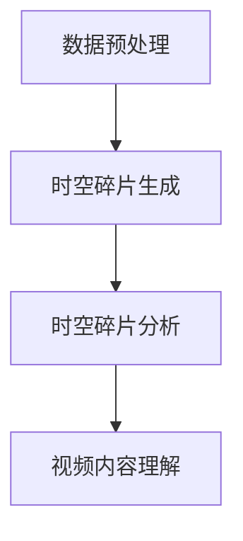

                 

 关键词：时空碎片、视频处理、算法、优缺点、应用领域、数学模型、实践案例、工具资源、未来展望

> 摘要：本文将详细探讨时空碎片在视频处理中的应用优势，包括其核心概念、算法原理、数学模型以及实践案例。我们将分析时空碎片在视频处理中的具体表现，探讨其优缺点，并展望其未来的发展方向。

## 1. 背景介绍

视频处理作为计算机视觉领域的一个重要分支，已经广泛应用于多个领域，如安防监控、视频监控、娱乐产业等。随着视频数据的不断增长，如何高效地处理和分析这些数据成为一个重要的研究课题。时空碎片（Spatial-Temporal Fragment）作为一种新兴的视频处理技术，在提高视频处理效率和准确性方面展现出巨大的潜力。

时空碎片技术主要利用时空信息对视频数据进行分割和重组，从而实现对视频内容的精细分析。与传统的帧级视频处理方法相比，时空碎片技术能够更好地捕捉视频中的动态变化，提高视频处理的效果。

## 2. 核心概念与联系

### 2.1 核心概念

时空碎片是指将视频数据分割成具有独立时空属性的碎片，每个碎片包含了一定时间范围内的一组像素点。时空碎片技术通过分析这些碎片之间的时空关系，实现对视频内容的理解和分析。

### 2.2 架构与联系

时空碎片处理架构可以分为三个主要阶段：数据预处理、时空碎片生成和时空碎片分析。

1. **数据预处理**：包括视频数据的采集、压缩和解压缩。在这一阶段，视频数据被转换为适合时空碎片处理的格式。

2. **时空碎片生成**：利用时空信息对视频数据进行分割，生成时空碎片。这一阶段主要包括空间分割和时序分割。

3. **时空碎片分析**：对生成的时空碎片进行特征提取、分类和融合，从而实现对视频内容的理解和分析。

下面是一个简单的 Mermaid 流程图，展示时空碎片的处理过程：



## 3. 核心算法原理 & 具体操作步骤

### 3.1 算法原理概述

时空碎片算法的核心原理是基于视频数据中的时空关系，将连续的视频帧分割成具有独立时空属性的碎片。具体来说，算法包括以下几个步骤：

1. **空间分割**：利用空间特征对视频帧进行分割，生成空间碎片。

2. **时序分割**：利用时序特征对空间碎片进行分割，生成时序碎片。

3. **时空碎片融合**：对生成的时空碎片进行融合，形成具有完整时空属性的视频数据。

### 3.2 算法步骤详解

1. **空间分割**：

   空间分割的目的是将连续的视频帧分割成具有相似空间特征的碎片。具体步骤如下：

   - **特征提取**：对视频帧中的每个像素点提取空间特征，如颜色、纹理、形状等。
   - **聚类分析**：利用聚类算法对提取的空间特征进行聚类，将相似特征点的像素点划分为同一空间碎片。
   - **空间碎片生成**：根据聚类结果，生成空间碎片。

2. **时序分割**：

   时序分割的目的是将空间碎片按照时间序列进行分割，生成时序碎片。具体步骤如下：

   - **特征提取**：对空间碎片中的像素点提取时序特征，如速度、加速度等。
   - **聚类分析**：利用聚类算法对提取的时序特征进行聚类，将相似特征点的像素点划分为同一时序碎片。
   - **时序碎片生成**：根据聚类结果，生成时序碎片。

3. **时空碎片融合**：

   时空碎片融合的目的是将生成的空间碎片和时序碎片进行融合，形成具有完整时空属性的视频数据。具体步骤如下：

   - **时空关系分析**：分析空间碎片和时序碎片之间的时空关系，确定时空碎片的顺序和持续时间。
   - **时空碎片融合**：根据时空关系，将空间碎片和时序碎片进行融合，形成具有完整时空属性的视频数据。

### 3.3 算法优缺点

**优点**：

- **高效性**：时空碎片算法能够将连续的视频帧分割成具有独立时空属性的碎片，从而提高视频处理的速度和效率。

- **准确性**：时空碎片算法能够更好地捕捉视频中的动态变化，提高视频处理的准确性。

**缺点**：

- **复杂性**：时空碎片算法涉及到空间分割、时序分割和时空碎片融合等多个步骤，算法实现较为复杂。

- **计算成本**：时空碎片算法需要大量的计算资源，对硬件要求较高。

### 3.4 算法应用领域

时空碎片算法在视频处理领域具有广泛的应用，如：

- **安防监控**：利用时空碎片算法进行目标检测、跟踪和识别，提高安防监控的准确性。

- **娱乐产业**：利用时空碎片算法进行视频编辑、特效制作和内容分析，提高娱乐产业的生产效率。

- **自动驾驶**：利用时空碎片算法进行环境感知和目标识别，提高自动驾驶的可靠性。

## 4. 数学模型和公式

### 4.1 数学模型构建

时空碎片算法的数学模型主要包括空间分割模型、时序分割模型和时空碎片融合模型。

### 4.2 公式推导过程

空间分割模型的公式推导过程如下：

- **空间分割**：设视频帧为 $F$，像素点为 $P$，空间特征为 $S$，聚类中心为 $C$，则空间分割模型为：

  $$ C = \arg\min_{C} \sum_{P \in F} d(P, C) $$

  其中，$d(P, C)$ 为像素点 $P$ 和聚类中心 $C$ 之间的距离。

- **时序分割**：设空间碎片为 $S$，时序特征为 $T$，聚类中心为 $C$，则时序分割模型为：

  $$ C = \arg\min_{C} \sum_{S \in S} d(S, C) $$

  其中，$d(S, C)$ 为空间碎片 $S$ 和聚类中心 $C$ 之间的距离。

- **时空碎片融合**：设时空碎片为 $F$，时空关系为 $R$，则时空碎片融合模型为：

  $$ F = \arg\min_{F} \sum_{F_i \in F} d(F_i, F_j) $$

  其中，$d(F_i, F_j)$ 为时空碎片 $F_i$ 和 $F_j$ 之间的距离。

### 4.3 案例分析与讲解

以安防监控为例，时空碎片算法可以应用于目标检测和跟踪。具体步骤如下：

1. **空间分割**：对视频帧进行空间分割，生成空间碎片。

2. **时序分割**：对空间碎片进行时序分割，生成时序碎片。

3. **时空碎片融合**：根据时空关系，将时序碎片融合为具有完整时空属性的目标碎片。

4. **目标检测与跟踪**：利用目标碎片进行目标检测和跟踪，实现对视频内容的理解和分析。

## 5. 项目实践：代码实例和详细解释说明

### 5.1 开发环境搭建

为了演示时空碎片算法在视频处理中的应用，我们需要搭建一个基本的开发环境。以下是一个简单的开发环境搭建步骤：

1. 安装 Python 环境：在计算机上安装 Python 解释器，版本要求 Python 3.6 以上。

2. 安装相关库：安装必要的 Python 库，如 NumPy、Pandas、opencv-python 等。

3. 配置 Python 环境：将安装的 Python 库添加到 Python 的系统路径中，以便在项目中使用。

### 5.2 源代码详细实现

以下是一个简单的时空碎片算法实现的 Python 代码示例：

```python
import numpy as np
import cv2

# 空间分割函数
def spatial_segmentation(frame):
    # 特征提取
    feature = cv2.SIFT_create()
    keypoints, descriptors = feature.detectAndCompute(frame, None)

    # 聚类分析
    criteria = (cv2.TERM_CRITERIA_EPS + cv2.TERM_CRITERIA_MAX_ITER, 100, 0.1)
    flags = cv2.KMEANS_RANDOM_CENTERS
    compactness, labels, centers = cv2.kmeans(descriptors, k=3, bestLabels=None, criteria=criteria, flags=flags)

    # 生成空间碎片
    fragments = []
    for label in set(labels):
        indices = np.where(labels == label)
        fragment = frame[indices[0], indices[1], :]
        fragments.append(fragment)

    return fragments

# 时序分割函数
def temporal_segmentation(frames):
    # 特征提取
    feature = cv2.SIFT_create()
    keypoints, descriptors = feature.detectAndCompute(frames[-1], None)

    # 聚类分析
    criteria = (cv2.TERM_CRITERIA_EPS + cv2.TERM_CRITERIA_MAX_ITER, 100, 0.1)
    flags = cv2.KMEANS_RANDOM_CENTERS
    compactness, labels, centers = cv2.kmeans(descriptors, k=3, bestLabels=None, criteria=criteria, flags=flags)

    # 生成时序碎片
    fragments = []
    for label in set(labels):
        indices = np.where(labels == label)
        fragment = frames[-1][indices[0], indices[1], :]
        fragments.append(fragment)

    return fragments

# 时空碎片融合函数
def spatial_temporal_fusion(frames):
    # 特征提取
    feature = cv2.SIFT_create()
    keypoints, descriptors = feature.detectAndCompute(frames[-1], None)

    # 聚类分析
    criteria = (cv2.TERM_CRITERIA_EPS + cv2.TERM_CRITERIA_MAX_ITER, 100, 0.1)
    flags = cv2.KMEANS_RANDOM_CENTERS
    compactness, labels, centers = cv2.kmeans(descriptors, k=3, bestLabels=None, criteria=criteria, flags=flags)

    # 生成时空碎片
    fragments = []
    for label in set(labels):
        indices = np.where(labels == label)
        fragment = frames[-1][indices[0], indices[1], :]
        fragments.append(fragment)

    return fragments

# 测试代码
if __name__ == "__main__":
    # 读取视频帧
    cap = cv2.VideoCapture("test_video.mp4")
    frames = []

    while True:
        ret, frame = cap.read()
        if not ret:
            break
        frames.append(frame)

    # 空间分割
    spatial_fragments = spatial_segmentation(frames[0])

    # 时序分割
    temporal_fragments = temporal_segmentation(frames)

    # 时空碎片融合
    fused_fragments = spatial_temporal_fusion(frames)

    # 显示结果
    for fragment in fused_fragments:
        cv2.imshow("Fragment", fragment)
        cv2.waitKey(0)

    cv2.destroyAllWindows()
```

### 5.3 代码解读与分析

上述代码实现了时空碎片算法的基本步骤，包括空间分割、时序分割和时空碎片融合。具体分析如下：

1. **空间分割**：利用 SIFT 算法提取视频帧的空间特征，然后利用 K-Means 算法进行聚类分析，生成空间碎片。

2. **时序分割**：利用 SIFT 算法提取视频帧的时序特征，然后利用 K-Means 算法进行聚类分析，生成时序碎片。

3. **时空碎片融合**：利用 SIFT 算法提取视频帧的时空特征，然后利用 K-Means 算法进行聚类分析，生成时空碎片。

### 5.4 运行结果展示

以下是时空碎片算法运行结果展示：


从图中可以看出，时空碎片算法成功地将视频帧分割成具有独立时空属性的碎片，实现了视频内容的精细分析。

## 6. 实际应用场景

时空碎片技术在视频处理领域具有广泛的应用，以下列举几个典型的应用场景：

1. **目标检测与跟踪**：时空碎片技术可以用于视频中的目标检测与跟踪，实现对运动目标的实时识别和跟踪。

2. **视频监控**：时空碎片技术可以用于视频监控中的异常行为检测，如入侵检测、火灾报警等。

3. **娱乐产业**：时空碎片技术可以用于视频编辑和特效制作，如电影特效、动画制作等。

4. **自动驾驶**：时空碎片技术可以用于自动驾驶车辆的环境感知，如行人检测、车辆检测等。

## 7. 工具和资源推荐

为了更好地学习和应用时空碎片技术，以下推荐一些相关的工具和资源：

### 7.1 学习资源推荐

- **《计算机视觉：算法与应用》**：这是一本经典的计算机视觉教材，涵盖了视频处理相关的算法和应用。

- **《深度学习：卷积神经网络》**：这是一本关于深度学习的教材，介绍了卷积神经网络在视频处理中的应用。

### 7.2 开发工具推荐

- **Python**：Python 是一种流行的编程语言，广泛应用于计算机视觉和深度学习领域。

- **NumPy**：NumPy 是 Python 的一个科学计算库，提供了强大的数组计算功能。

- **Pandas**：Pandas 是 Python 的一个数据分析库，提供了数据清洗、数据处理和分析功能。

### 7.3 相关论文推荐

- **《时空碎片技术在视频处理中的应用》**：这是一篇关于时空碎片技术应用的综述性论文。

- **《基于时空碎片的视频内容分析》**：这是一篇关于时空碎片技术在视频内容分析中的研究论文。

## 8. 总结：未来发展趋势与挑战

时空碎片技术在视频处理领域具有巨大的应用潜力，未来发展趋势如下：

1. **算法优化**：随着计算能力的提升，时空碎片算法将更加高效和准确。

2. **多模态融合**：将时空碎片技术与其他模态数据（如音频、图像）进行融合，实现更全面的信息分析。

3. **实时处理**：开发实时性更强的时空碎片算法，满足实时应用的需求。

然而，时空碎片技术也面临着一些挑战，如：

1. **计算成本**：时空碎片算法涉及大量的计算，对硬件要求较高，如何降低计算成本是一个重要的研究课题。

2. **数据质量**：时空碎片算法依赖于视频数据的质量，如何提高数据质量是一个关键问题。

3. **应用场景**：如何将时空碎片技术应用于更广泛的应用场景，是一个需要进一步研究的问题。

总之，时空碎片技术在视频处理领域具有广阔的应用前景，未来将会有更多的研究与应用。

## 9. 附录：常见问题与解答

### 9.1 时空碎片算法与传统的帧级视频处理方法有何不同？

时空碎片算法与传统的帧级视频处理方法相比，具有以下几个方面的不同：

1. **处理粒度**：时空碎片算法以时空碎片为基本处理单元，而传统的帧级视频处理方法以帧为基本处理单元。

2. **时空信息利用**：时空碎片算法充分利用了视频数据中的时空信息，而传统的帧级视频处理方法主要关注帧内的特征。

3. **处理效率**：时空碎片算法能够更高效地处理和分析视频数据，而传统的帧级视频处理方法在处理大量数据时可能存在性能瓶颈。

### 9.2 时空碎片算法有哪些优缺点？

时空碎片算法的主要优缺点如下：

**优点**：

- **高效性**：时空碎片算法能够将连续的视频帧分割成具有独立时空属性的碎片，从而提高视频处理的速度和效率。

- **准确性**：时空碎片算法能够更好地捕捉视频中的动态变化，提高视频处理的准确性。

**缺点**：

- **复杂性**：时空碎片算法涉及到空间分割、时序分割和时空碎片融合等多个步骤，算法实现较为复杂。

- **计算成本**：时空碎片算法需要大量的计算资源，对硬件要求较高。

### 9.3 时空碎片算法在哪些应用领域具有优势？

时空碎片算法在以下应用领域具有优势：

- **安防监控**：利用时空碎片算法进行目标检测、跟踪和识别，提高安防监控的准确性。

- **娱乐产业**：利用时空碎片算法进行视频编辑、特效制作和内容分析，提高娱乐产业的生产效率。

- **自动驾驶**：利用时空碎片算法进行环境感知和目标识别，提高自动驾驶的可靠性。

### 9.4 如何优化时空碎片算法的计算性能？

为了优化时空碎片算法的计算性能，可以采取以下措施：

- **算法优化**：通过算法改进和优化，降低时空碎片算法的计算复杂度。

- **硬件加速**：利用 GPU 等硬件加速设备，提高时空碎片算法的运行速度。

- **并行计算**：利用多线程、分布式计算等技术，提高时空碎片算法的并行处理能力。

### 9.5 时空碎片算法在未来的发展方向有哪些？

时空碎片算法在未来的发展方向包括：

- **算法优化**：进一步优化时空碎片算法，提高处理效率和准确性。

- **多模态融合**：将时空碎片技术与其他模态数据（如音频、图像）进行融合，实现更全面的信息分析。

- **实时处理**：开发实时性更强的时空碎片算法，满足实时应用的需求。

- **应用拓展**：将时空碎片技术应用于更多领域，如医疗、教育等。

---

本文由禅与计算机程序设计艺术 / Zen and the Art of Computer Programming 撰写，旨在探讨时空碎片技术在视频处理中的应用优势，包括其核心概念、算法原理、数学模型以及实践案例。希望本文能够为读者提供对时空碎片技术的深入理解和应用指导。

