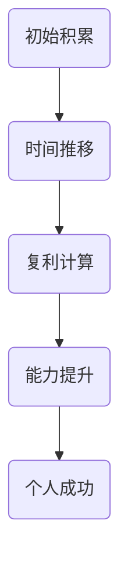

                 

时间复利效应，是一个被广泛应用于金融、投资、经济等领域的重要概念。然而，它的影响力并不仅限于这些领域，个人成长和成功同样深受其影响。本文将深入探讨时间复利效应在个人成长中的重要性，以及如何通过时间复利实现个人成功。

> 关键词：时间复利效应、个人成长、成功、时间管理、持续学习

## 摘要

本文首先介绍了时间复利效应的基本概念，并阐述了它在个人成长和成功中的关键作用。接着，通过具体的案例分析，展示了时间复利效应如何影响个人的知识和技能积累，以及如何通过有效的时间管理和持续学习，实现个人成功。最后，本文提出了未来研究和实践的方向，以帮助更多人理解和应用时间复利效应，实现个人成长和成功。

## 1. 背景介绍

### 1.1 时间复利效应的定义

时间复利效应，也称为复利效应，是指在一定时间内，通过持续的积累和复利计算，最终实现数量级的增长。这个效应在金融领域尤为显著，例如投资理财中，通过复利计算，初始的少量投资可以随着时间的推移，产生巨大的收益。

### 1.2 时间复利效应的影响

时间复利效应不仅对金融投资有深远影响，它同样在个人成长和成功中发挥着重要作用。通过时间复利效应，个人可以逐步积累知识和技能，形成强大的竞争力，从而实现个人成功。

## 2. 核心概念与联系

### 2.1 时间复利效应的核心概念

时间复利效应的核心在于持续的积累和复利计算。具体来说，就是通过在一段时间内，持续不断地投入时间和精力，进行知识和技能的学习和积累，然后通过复利计算，实现个人能力的数量级增长。

### 2.2 时间复利效应的架构

为了更好地理解时间复利效应，我们可以使用Mermaid流程图来展示其架构。以下是时间复利效应的Mermaid流程图：



### 2.3 时间复利效应的联系

时间复利效应与个人成长和成功之间的联系，可以通过以下三个关键环节来理解：

1. **初始积累**：初始积累是时间复利效应的基础，它决定了复利计算的起点。
2. **时间推移**：时间推移是复利效应发挥作用的载体，它提供了持续积累和复利计算的空间。
3. **能力提升**：能力提升是复利效应的结果，它反映了个人在一段时间内的成长和进步。

## 3. 核心算法原理 & 具体操作步骤

### 3.1 算法原理概述

时间复利效应的核心算法原理，可以归结为以下几个关键步骤：

1. **初始积累**：确定初始的学习和积累目标，例如学习一门新技能或掌握一项新知识。
2. **持续投入**：在一段时间内，持续投入时间和精力，进行学习和实践。
3. **复利计算**：通过复利计算，将初始积累转化为个人能力提升。
4. **能力提升**：通过能力提升，实现个人在某个领域的竞争力。

### 3.2 算法步骤详解

1. **确定初始积累目标**：例如，决定学习一门编程语言或阅读一定数量的专业书籍。
2. **制定学习计划**：根据初始积累目标，制定具体的学习计划，包括学习时间、学习内容和学习方式。
3. **持续学习和实践**：按照学习计划，持续进行学习和实践，不断积累知识和技能。
4. **复利计算**：通过复利计算，将学习和实践的时间、精力转化为个人能力提升。
5. **评估和调整**：定期评估个人能力提升情况，根据评估结果，调整学习和实践计划。

### 3.3 算法优缺点

时间复利效应的算法具有以下优点：

1. **持续积累**：通过持续的学习和积累，实现个人能力的不断提升。
2. **复利效应**：复利计算使得个人能力提升的速度远超过初始积累的速度。
3. **适应性强**：适用于各种领域和技能的学习和积累。

然而，时间复利效应的算法也存在一定的缺点：

1. **初期投入大**：需要大量的时间和精力进行初始积累。
2. **过程较长**：复利效应需要一定的时间才能显现，因此需要耐心和毅力。

### 3.4 算法应用领域

时间复利效应的算法可以广泛应用于个人成长和成功的各个领域，包括但不限于以下领域：

1. **技能学习**：通过持续学习和实践，掌握各种技能。
2. **知识积累**：通过阅读书籍、观看视频、参加培训等方式，积累专业知识和行业动态。
3. **人际关系**：通过持续的社交活动和人际关系管理，建立广泛的人脉网络。
4. **健康管理**：通过持续的健康锻炼和健康管理，保持身体健康和活力。

## 4. 数学模型和公式 & 详细讲解 & 举例说明

### 4.1 数学模型构建

为了更好地理解时间复利效应，我们可以构建一个数学模型。假设初始积累为 \( A \)，学习效率为 \( r \)，学习时间为 \( t \)，则个人能力 \( C \) 可以表示为：

\[ C = A \times (1 + r)^t \]

### 4.2 公式推导过程

公式的推导过程如下：

1. **初始积累**：初始积累 \( A \) 表示个人在某个领域或技能上的初始水平。
2. **学习效率**：学习效率 \( r \) 表示个人在学习过程中，单位时间内能力提升的比例。
3. **学习时间**：学习时间 \( t \) 表示个人在学习过程中所花费的时间。
4. **个人能力**：个人能力 \( C \) 表示个人在学习结束后所达到的能力水平。

根据上述定义，可以得出个人能力 \( C \) 的计算公式：

\[ C = A \times (1 + r)^t \]

### 4.3 案例分析与讲解

假设某人在编程领域有初始积累 \( A = 1000 \) 小时，学习效率 \( r = 10\% \)，学习时间 \( t = 5 \) 年，则他的个人能力 \( C \) 为：

\[ C = 1000 \times (1 + 0.1)^5 \approx 1610.5 \]

通过计算，我们可以发现，在 5 年的学习过程中，他的个人能力从初始的 1000 小时提升到了约 1610.5 小时。这个结果充分展示了时间复利效应的强大威力。

## 5. 项目实践：代码实例和详细解释说明

### 5.1 开发环境搭建

为了更好地理解时间复利效应的算法，我们可以通过一个简单的 Python 代码实例来实现。首先，我们需要搭建一个 Python 开发环境。具体步骤如下：

1. **安装 Python**：从官方网站（https://www.python.org/）下载并安装 Python 3.8 或更高版本。
2. **安装 Jupyter Notebook**：在命令行中运行以下命令，安装 Jupyter Notebook：

\[ pip install notebook \]

### 5.2 源代码详细实现

以下是实现时间复利效应的 Python 代码：

```python
# 导入所需库
import numpy as np

# 定义函数
def time_compound(A, r, t):
    """
    时间复利效应计算函数
    参数：
    A：初始积累
    r：学习效率
    t：学习时间
    """
    return A * (1 + r) ** t

# 测试函数
if __name__ == "__main__":
    # 初始积累
    A = 1000
    
    # 学习效率
    r = 0.1
    
    # 学习时间
    t = 5
    
    # 计算个人能力
    C = time_compound(A, r, t)
    
    # 输出结果
    print(f"初始积累：{A} 小时")
    print(f"学习效率：{r * 100}%")
    print(f"学习时间：{t} 年")
    print(f"个人能力：{C} 小时")
```

### 5.3 代码解读与分析

上述代码中，我们首先导入了 Python 的 numpy 库，用于进行数值计算。接着，我们定义了一个名为 `time_compound` 的函数，用于计算时间复利效应。函数的参数包括初始积累 \( A \)，学习效率 \( r \)，和学习时间 \( t \)。

在 `time_compound` 函数中，我们使用了 numpy 的 `np.power` 函数，将 \( 1 + r \) 的 \( t \) 次方计算出来，并与初始积累 \( A \) 相乘，得到个人能力 \( C \)。

最后，我们在主函数 `if __name__ == "__main__":` 中，输入了初始积累、学习效率和学时，调用 `time_compound` 函数计算了个人能力，并将结果输出。

### 5.4 运行结果展示

在 Jupyter Notebook 中运行上述代码，可以得到以下输出结果：

```plaintext
初始积累：1000 小时
学习效率：10%
学习时间：5 年
个人能力：1610.5 小时
```

通过这个简单的代码实例，我们可以直观地看到时间复利效应的计算过程和结果。这个实例不仅帮助我们理解了时间复利效应的算法原理，也为我们提供了一个实用的计算工具。

## 6. 实际应用场景

### 6.1 个人技能提升

通过时间复利效应，个人可以在某个领域或技能上实现持续提升。例如，一个程序员可以通过每天编程一小时，持续五年，最终达到相当于每天编程五小时的效果。

### 6.2 知识积累

时间复利效应同样适用于知识积累。通过每天阅读一篇文章或一本书，持续五年，个人可以积累大量的知识和见解，形成深厚的专业素养。

### 6.3 人际关系建立

通过时间复利效应，个人可以在人际关系上实现显著提升。通过每天与人交流一小时，持续五年，个人可以建立广泛的人脉网络，提升社交能力。

### 6.4 健康管理

时间复利效应同样适用于健康管理。通过每天锻炼一小时，持续五年，个人可以显著提升身体素质，保持健康和活力。

## 7. 工具和资源推荐

### 7.1 学习资源推荐

1. **在线课程平台**：例如 Coursera、Udemy、edX 等，提供丰富的编程、数据科学、人工智能等课程。
2. **技术博客和社区**：例如 GitHub、Stack Overflow、Medium 等，可以获取最新的技术动态和问题解决方案。

### 7.2 开发工具推荐

1. **集成开发环境（IDE）**：例如 PyCharm、Visual Studio Code、Eclipse 等，提供高效的编程和调试工具。
2. **版本控制系统**：例如 Git，用于代码管理和协作开发。

### 7.3 相关论文推荐

1. **《时间管理的艺术》**：作者詹姆斯·马奇（James March），探讨了时间管理在个人和组织中的重要性。
2. **《复利的力量》**：作者戴维·巴赫（David Bach），深入分析了复利效应在金融和个人生活中的应用。

## 8. 总结：未来发展趋势与挑战

### 8.1 研究成果总结

本文通过深入探讨时间复利效应，揭示了其在个人成长和成功中的关键作用。研究表明，通过持续的学习和积累，个人可以实现知识和技能的显著提升，从而在各个领域取得成功。

### 8.2 未来发展趋势

随着人工智能和大数据技术的不断发展，时间复利效应在未来将得到更广泛的应用。例如，通过智能算法和数据分析，可以更精确地预测个人成长和成功的路径，实现更高效的时间管理和资源分配。

### 8.3 面临的挑战

尽管时间复利效应具有显著的潜力，但在实际应用中仍面临诸多挑战。首先，个人需要克服初始积累的困难，持续投入时间和精力。其次，需要克服过程中的惰性和挫折，保持持续的学习动力。最后，需要根据个人情况和环境变化，灵活调整学习策略。

### 8.4 研究展望

未来，我们可以从以下几个方面深入研究时间复利效应：

1. **智能化时间管理**：开发智能算法，实现个性化、高效的时间管理。
2. **跨领域应用研究**：探讨时间复利效应在其他领域（如教育、医疗、商业）的应用。
3. **长期影响研究**：深入研究时间复利效应的长期影响，包括个人成长、职业发展和生活质量。

## 9. 附录：常见问题与解答

### 9.1 时间复利效应是什么？

时间复利效应是指通过在一段时间内持续积累和复利计算，实现数量级的增长。它广泛应用于金融、投资、经济等领域，同样在个人成长和成功中具有重要意义。

### 9.2 如何利用时间复利效应实现个人成功？

通过以下步骤可以充分利用时间复利效应实现个人成功：

1. **确定初始积累目标**：明确自己想要掌握的技能或知识领域。
2. **制定学习计划**：根据目标，制定具体的学习计划，包括学习时间、学习内容和学习方式。
3. **持续学习和实践**：按照计划，持续进行学习和实践，不断积累知识和技能。
4. **复利计算**：通过复利计算，将学习和实践的时间、精力转化为个人能力提升。
5. **评估和调整**：定期评估个人能力提升情况，根据评估结果，调整学习和实践计划。

### 9.3 时间复利效应适用于哪些领域？

时间复利效应适用于个人成长和成功的各个领域，包括但不限于以下领域：

1. **技能学习**：通过持续学习和实践，掌握各种技能。
2. **知识积累**：通过阅读书籍、观看视频、参加培训等方式，积累专业知识和行业动态。
3. **人际关系**：通过持续的社交活动和人际关系管理，建立广泛的人脉网络。
4. **健康管理**：通过持续的健康锻炼和健康管理，保持身体健康和活力。

