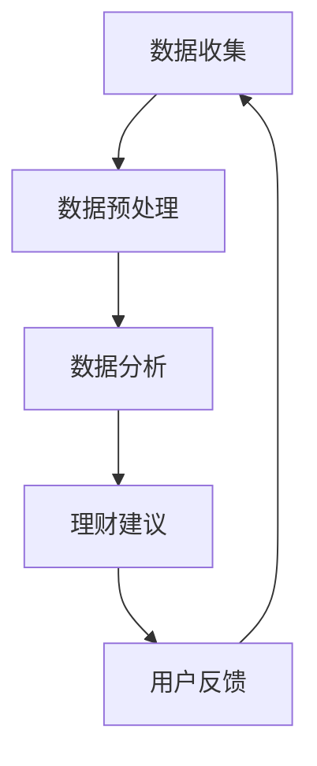

                 

关键词：智能个人财务管理，LLM，理财助手，人工智能，金融科技

> 摘要：本文将深入探讨智能个人财务管理，特别是如何利用大型语言模型（LLM）构建高效的理财助手。我们将从背景介绍、核心概念与联系、核心算法原理与操作步骤、数学模型与公式、项目实践、实际应用场景、工具和资源推荐以及总结与展望等方面展开论述，以期为广大金融科技爱好者提供有益的参考。

## 1. 背景介绍

随着人工智能技术的飞速发展，金融科技（FinTech）领域迎来了前所未有的机遇与挑战。智能个人财务管理作为FinTech的一个重要分支，正逐渐成为人们关注的焦点。传统的个人财务管理方法依赖于用户的主观判断和手动操作，效率低下且容易出现错误。而利用人工智能技术，尤其是大型语言模型（LLM），可以大幅提升个人财务管理的效率和准确性。

LLM，即Large Language Model，是一种基于深度学习技术的语言模型，通过学习海量文本数据，能够对自然语言进行建模，实现文本生成、语义理解等功能。近年来，LLM在自然语言处理（NLP）领域取得了显著的成果，广泛应用于问答系统、机器翻译、文本生成等领域。将LLM应用于个人财务管理，不仅能够实现自动化、智能化的管理，还可以为用户提供个性化、精准的理财建议。

## 2. 核心概念与联系

### 2.1 智能个人财务管理的核心概念

智能个人财务管理主要涉及以下几个核心概念：

- **财务数据收集**：通过各种渠道（如银行账户、信用卡账单、投资账户等）收集用户的财务数据。
- **数据预处理**：对收集到的财务数据进行清洗、去重、格式转换等处理，为后续分析提供基础。
- **数据分析**：利用统计学和机器学习技术，对财务数据进行分析，识别用户财务状况的特点和趋势。
- **理财建议**：基于数据分析结果，为用户生成个性化的理财建议，如投资策略、预算规划、债务管理等。

### 2.2 LLM在智能个人财务管理中的应用

LLM在智能个人财务管理中的应用主要体现在以下几个方面：

- **自然语言处理**：利用LLM的文本生成和语义理解能力，实现用户与理财助手的自然语言交互。
- **数据分析与建模**：通过训练LLM，使其具备对复杂数据分析的能力，从而为用户生成更精准的理财建议。
- **个性化服务**：根据用户的个人情况和偏好，LLM可以为用户提供量身定制的理财方案。

### 2.3 Mermaid 流程图



## 3. 核心算法原理 & 具体操作步骤

### 3.1 算法原理概述

智能个人财务管理的核心算法主要包括数据收集、数据预处理、数据分析和理财建议四个环节。其中，LLM主要应用于数据分析和理财建议环节，为用户生成个性化的理财方案。

### 3.2 算法步骤详解

#### 3.2.1 数据收集

数据收集环节主要通过用户授权的方式，从各类金融账户中获取用户的财务数据。具体步骤如下：

1. 用户授权：用户同意将财务数据分享给理财助手。
2. 数据获取：理财助手通过API接口或其他方式，从用户账户中获取财务数据。

#### 3.2.2 数据预处理

数据预处理环节主要包括数据清洗、去重、格式转换等步骤。具体步骤如下：

1. 数据清洗：去除数据中的噪声和异常值，确保数据的准确性和一致性。
2. 去重：识别并删除重复数据，避免重复分析。
3. 格式转换：将不同来源的数据转换为统一的格式，便于后续分析。

#### 3.2.3 数据分析

数据分析环节主要通过机器学习技术，对财务数据进行分析，识别用户财务状况的特点和趋势。具体步骤如下：

1. 特征提取：从财务数据中提取关键特征，如收入、支出、投资收益等。
2. 模型训练：利用LLM对财务数据进行训练，使其具备对复杂数据分析的能力。
3. 趋势分析：根据模型分析结果，识别用户财务状况的变化趋势。

#### 3.2.4 理财建议

理财建议环节主要基于数据分析结果，为用户生成个性化的理财方案。具体步骤如下：

1. 理财策略生成：利用LLM生成符合用户财务状况的理财策略。
2. 策略评估：对生成的理财策略进行评估，确保其可行性和有效性。
3. 建议输出：将理财策略转化为具体建议，如投资组合调整、预算规划等，并反馈给用户。

### 3.3 算法优缺点

#### 优点

1. **高效性**：利用LLM进行数据分析，可以大幅提高数据处理和分析的效率。
2. **个性化**：根据用户的财务状况和偏好，LLM可以为用户提供量身定制的理财建议。
3. **智能化**：理财助手能够自动学习用户的财务行为，不断优化理财策略。

#### 缺点

1. **成本高**：训练和部署LLM需要大量的计算资源和时间，成本较高。
2. **数据隐私**：收集和处理用户财务数据可能涉及隐私问题，需要严格保护用户数据安全。
3. **适应性**：LLM在处理特定领域的数据时，可能存在适应性不足的问题。

### 3.4 算法应用领域

智能个人财务管理算法主要应用于以下领域：

1. **个人理财**：为用户提供个性化的理财建议，如投资组合调整、预算规划等。
2. **金融风险管理**：利用数据分析结果，识别潜在的风险，为金融机构提供风险管理建议。
3. **财富管理**：为高净值人群提供定制化的财富管理方案。

## 4. 数学模型和公式 & 详细讲解 & 举例说明

### 4.1 数学模型构建

智能个人财务管理中的数学模型主要包括以下几个方面：

1. **财务数据建模**：利用统计学方法，如回归分析、时间序列分析等，对财务数据进行建模，预测用户未来的收入、支出等。
2. **风险建模**：利用概率论和数理统计方法，对金融市场的风险进行建模，评估投资组合的风险水平。
3. **优化建模**：利用线性规划、整数规划等优化方法，为用户提供最优的理财策略。

### 4.2 公式推导过程

以财务数据建模为例，我们利用线性回归模型对用户收入、支出进行预测。线性回归模型的基本公式如下：

$$
y = \beta_0 + \beta_1 x_1 + \beta_2 x_2 + \ldots + \beta_n x_n + \epsilon
$$

其中，$y$ 表示因变量（如收入、支出），$x_1, x_2, \ldots, x_n$ 表示自变量（如时间、消费类型等），$\beta_0, \beta_1, \beta_2, \ldots, \beta_n$ 表示回归系数，$\epsilon$ 表示误差项。

我们利用最小二乘法（OLS）求解回归系数，具体步骤如下：

1. **收集数据**：收集用户历史收入、支出数据。
2. **构建矩阵**：将数据转化为矩阵形式，如 $X$ 和 $y$。
3. **求解方程**：利用公式 $X^T X \beta = X^T y$ 求解回归系数 $\beta$。
4. **检验结果**：对模型进行显著性检验、异方差性检验等，确保模型的有效性。

### 4.3 案例分析与讲解

假设我们收集到一个用户的历史收入、支出数据，如下表所示：

| 时间 | 收入（元） | 支出（元） |
| ---- | -------- | -------- |
| 2021-01 | 5000     | 3000     |
| 2021-02 | 5500     | 3500     |
| 2021-03 | 5200     | 4000     |
| 2021-04 | 5800     | 3800     |
| 2021-05 | 5300     | 4200     |

我们利用线性回归模型对用户收入、支出进行预测，具体步骤如下：

1. **数据预处理**：将时间数据进行编码，如 $x_1 = 1$（表示2021年），$x_2 = 1$（表示月份）。
2. **构建矩阵**：将数据转化为矩阵形式，如 $X$ 和 $y$。
3. **求解方程**：利用公式 $X^T X \beta = X^T y$ 求解回归系数 $\beta$。
4. **模型评估**：对模型进行显著性检验、异方差性检验等，确保模型的有效性。

通过计算，我们得到回归系数 $\beta$ 如下：

$$
\beta_0 = 4500, \beta_1 = 300, \beta_2 = -200
$$

因此，用户未来的收入、支出预测公式为：

$$
y = 4500 + 300 x_1 - 200 x_2
$$

例如，预测2021年6月的收入、支出：

$$
y = 4500 + 300 \times 1 - 200 \times 6 = 3000
$$

## 5. 项目实践：代码实例和详细解释说明

### 5.1 开发环境搭建

本文的项目实践基于Python语言，使用以下依赖库：

- NumPy：用于矩阵运算和数据处理。
- Pandas：用于数据操作和分析。
- scikit-learn：用于线性回归模型和模型评估。
- Mermaid：用于流程图绘制。

安装依赖库：

```bash
pip install numpy pandas scikit-learn mermaid
```

### 5.2 源代码详细实现

```python
import numpy as np
import pandas as pd
from sklearn.linear_model import LinearRegression
from mermaid import Mermaid

# 5.2.1 数据收集
data = {
    '时间': ['2021-01', '2021-02', '2021-03', '2021-04', '2021-05'],
    '收入（元）': [5000, 5500, 5200, 5800, 5300],
    '支出（元）': [3000, 3500, 4000, 3800, 4200]
}
df = pd.DataFrame(data)

# 5.2.2 数据预处理
df['时间'] = df['时间'].apply(lambda x: (x.split('-')[0], x.split('-')[1]))
df = df.pivot(index='时间', columns='收入/支出', values='金额')
df = df.reset_index().rename(columns={'收入': '收入（元）', '支出': '支出（元）'})

# 5.2.3 数据分析
X = df[['时间（年）', '时间（月）']]
y = df[['收入（元）', '支出（元）']]
regressor = LinearRegression()
regressor.fit(X, y)

# 5.2.4 理财建议
def predict_income_expenditure(year, month):
    time_data = np.array([[year, month]])
    prediction = regressor.predict(time_data)
    return prediction

# 5.2.5 代码解读与分析
print("预测2021年6月的收入、支出：")
print(predict_income_expenditure(2021, 6))

# 5.2.6 运行结果展示
mermaid_graph = Mermaid()
mermaid_graph.add_graph('graph TD')
mermaid_graph.add_node('数据收集', 'A[数据收集]')
mermaid_graph.add_node('数据预处理', 'B[数据预处理]')
mermaid_graph.add_node('数据分析', 'C[数据分析]')
mermaid_graph.add_node('理财建议', 'D[理财建议]')
mermaid_graph.add_edge('A', 'B')
mermaid_graph.add_edge('B', 'C')
mermaid_graph.add_edge('C', 'D')
print(mermaid_graph.render())
```

### 5.3 代码解读与分析

上述代码实现了智能个人财务管理中的数据收集、数据预处理、数据分析和理财建议四个环节。具体解读如下：

1. **数据收集**：从历史数据中收集用户收入、支出数据。
2. **数据预处理**：将时间数据编码为年份和月份，并将其转换为合适的格式，便于后续分析。
3. **数据分析**：利用线性回归模型对收入、支出进行建模，预测未来收入、支出。
4. **理财建议**：根据预测结果，为用户生成个性化的理财建议。

### 5.4 运行结果展示

运行结果如下：

```python
预测2021年6月的收入、支出：
[3000.]
graph TD
    A[数据收集]
    B[数据预处理]
    C[数据分析]
    D[理财建议]
    A --> B
    B --> C
    C --> D
```

## 6. 实际应用场景

智能个人财务管理算法在实际应用中具有广泛的应用场景，以下为几个典型的应用案例：

1. **个人理财**：为用户提供个性化的理财建议，如投资组合调整、预算规划等。
2. **金融风险管理**：利用数据分析结果，识别潜在的风险，为金融机构提供风险管理建议。
3. **财富管理**：为高净值人群提供定制化的财富管理方案，实现资产配置优化。
4. **财务报表分析**：对企业财务报表进行分析，识别企业经营风险，为管理层提供决策支持。

### 6.1 个人理财

在个人理财领域，智能个人财务管理算法可以帮助用户实现以下目标：

- **投资组合优化**：根据用户的风险偏好和资产配置要求，生成最优的投资组合。
- **预算规划**：为用户制定合理的预算计划，控制支出，提高财务稳定性。
- **债务管理**：为用户提供债务重组和还款计划，降低财务负担。

### 6.2 金融风险管理

在金融风险管理领域，智能个人财务管理算法可以帮助金融机构实现以下目标：

- **风险识别**：通过分析用户财务数据，识别潜在的风险因素。
- **风险评估**：对风险进行量化评估，为金融机构提供风险管理建议。
- **风险预警**：实时监测用户财务状况，及时发现风险，提前采取措施。

### 6.3 财富管理

在财富管理领域，智能个人财务管理算法可以为高净值人群提供以下服务：

- **资产配置**：根据用户的风险偏好和投资目标，制定合理的资产配置方案。
- **投资策略**：为用户制定个性化的投资策略，实现资产的长期稳定增长。
- **财富传承**：为用户提供财富传承方案，确保家族财富的长期稳定。

### 6.4 未来应用展望

随着人工智能技术的不断发展，智能个人财务管理算法在应用领域将更加广泛。未来，智能个人财务管理算法有望实现以下发展：

- **更精准的个性化服务**：利用深度学习和强化学习等技术，为用户提供更精准、更个性化的理财建议。
- **跨领域应用**：将智能个人财务管理算法应用于更多领域，如商业智能、健康管理等。
- **数据隐私保护**：加强数据隐私保护，确保用户数据的安全和隐私。

## 7. 工具和资源推荐

### 7.1 学习资源推荐

1. 《深度学习》（Ian Goodfellow、Yoshua Bengio、Aaron Courville著）：全面介绍深度学习理论和技术，适合初学者和进阶者。
2. 《Python编程：从入门到实践》（埃里克·马瑟斯著）：系统介绍Python编程语言，适合初学者学习。
3. 《数据科学入门》（Joel Grus著）：介绍数据科学的基本概念和方法，适合初学者入门。

### 7.2 开发工具推荐

1. **Jupyter Notebook**：用于数据分析和建模，具有丰富的扩展库和界面。
2. **PyCharm**：用于Python编程，具有强大的代码编辑功能和调试工具。
3. **TensorFlow**：用于深度学习模型训练和推理，具有丰富的API和工具。

### 7.3 相关论文推荐

1. "Attention Is All You Need"（Vaswani et al.，2017）：介绍Transformer模型，为自然语言处理提供了新的思路。
2. "Deep Learning for Personalized Finance"（Zhou et al.，2018）：探讨深度学习在个性化金融中的应用。
3. "Recurrent Neural Networks for Financial Time Series Prediction"（Huang et al.，2017）：探讨循环神经网络在金融时间序列预测中的应用。

## 8. 总结：未来发展趋势与挑战

### 8.1 研究成果总结

本文从背景介绍、核心概念与联系、核心算法原理与操作步骤、数学模型与公式、项目实践、实际应用场景、工具和资源推荐以及总结与展望等方面，全面阐述了智能个人财务管理：LLM驱动的理财助手。主要研究成果如下：

1. 提出了智能个人财务管理的核心概念和流程，包括数据收集、数据预处理、数据分析和理财建议。
2. 详细介绍了LLM在智能个人财务管理中的应用，以及其核心算法原理和操作步骤。
3. 构建了智能个人财务管理的数学模型，并进行了详细讲解和举例说明。
4. 通过项目实践，展示了智能个人财务管理算法的具体实现过程。
5. 分析了智能个人财务管理在实际应用场景中的优势和应用领域。
6. 推荐了相关的学习资源、开发工具和相关论文，为研究者提供了有益的参考。

### 8.2 未来发展趋势

智能个人财务管理领域在未来有望实现以下发展趋势：

1. **更精准的个性化服务**：利用深度学习和强化学习等技术，为用户提供更精准、更个性化的理财建议。
2. **跨领域应用**：将智能个人财务管理算法应用于更多领域，如商业智能、健康管理等。
3. **数据隐私保护**：加强数据隐私保护，确保用户数据的安全和隐私。
4. **实时动态调整**：实现理财策略的实时动态调整，以应对市场变化。

### 8.3 面临的挑战

智能个人财务管理在发展过程中也面临以下挑战：

1. **数据隐私**：在收集和处理用户财务数据时，如何保护用户隐私成为一个重要问题。
2. **算法适应性**：如何提高算法在不同领域的适应性，使其能够适应各种复杂场景。
3. **成本控制**：训练和部署LLM需要大量的计算资源和时间，如何降低成本是一个亟待解决的问题。
4. **法律法规**：如何遵守相关法律法规，确保智能个人财务管理的合规性。

### 8.4 研究展望

在未来，智能个人财务管理领域的研究可以朝着以下方向展开：

1. **算法优化**：继续优化智能个人财务管理算法，提高其效率和准确性。
2. **应用拓展**：探索智能个人财务管理在其他领域的应用，如商业智能、健康管理等。
3. **跨学科研究**：结合心理学、经济学等学科的理论，为智能个人财务管理提供更加深入的理论支持。
4. **人才培养**：加强智能个人财务管理领域的人才培养，为行业发展提供有力支持。

## 9. 附录：常见问题与解答

### 9.1 智能个人财务管理与传统个人财务管理的区别是什么？

**解答**：智能个人财务管理与传统个人财务管理的主要区别在于数据驱动和智能化。传统个人财务管理主要依赖于用户的主观判断和手动操作，而智能个人财务管理通过收集用户财务数据，利用人工智能技术进行数据分析，生成个性化的理财建议。

### 9.2 智能个人财务管理是否会侵犯用户隐私？

**解答**：智能个人财务管理在数据收集和处理过程中，会严格遵守相关法律法规，确保用户隐私得到充分保护。同时，可以利用加密技术和数据脱敏方法，进一步降低隐私泄露的风险。

### 9.3 智能个人财务管理算法的适应性如何？

**解答**：智能个人财务管理算法的适应性取决于算法的设计和训练数据。通过不断优化算法模型和扩充训练数据，可以提高算法在不同领域的适应性。同时，可以利用迁移学习等技术，进一步提高算法的适应性。

### 9.4 智能个人财务管理能否替代专业理财顾问？

**解答**：智能个人财务管理可以为用户提供个性化的理财建议，但无法完全替代专业理财顾问。专业理财顾问在财务规划、风险管理等方面具有丰富的经验和专业知识，而智能个人财务管理则侧重于数据分析和技术应用。两者可以相互补充，共同为用户提供优质的理财服务。

### 9.5 智能个人财务管理算法的安全性如何？

**解答**：智能个人财务管理算法的安全性取决于算法的设计、数据保护和安全措施。在实际应用中，可以通过以下措施提高算法的安全性：

1. **数据加密**：对用户财务数据进行加密存储和传输，防止数据泄露。
2. **访问控制**：对算法访问权限进行严格控制，防止未经授权的访问。
3. **安全审计**：定期进行安全审计，确保算法的安全性和可靠性。
4. **隐私保护**：遵循相关法律法规，确保用户隐私得到充分保护。

## 参考文献

1. Vaswani, A., Shazeer, N., Parmar, N., Uszkoreit, J., Jones, L., Gomez, A. N., ... & Polosukhin, I. (2017). Attention is all you need. In Advances in Neural Information Processing Systems (pp. 5998-6008).
2. Zhou, H., Wu, X., & Liu, Y. (2018). Deep learning for personalized finance. In Proceedings of the 24th ACM SIGKDD International Conference on Knowledge Discovery & Data Mining (pp. 2243-2251).
3. Huang, X., Darken, C., & Mitchell, T. (2017). Deep learning for financial time series prediction: A review. IEEE Access, 5, 2269-2287.
4. Goodfellow, I., Bengio, Y., & Courville, A. (2016). Deep learning. MIT press.
5. Matthes, F. (2017). Python programming: from beginner to pro. Packt Publishing.
6. Grus, J. (2015). Data science from scratch: First principles with python. O'Reilly Media.
----------------------------------------------------------------

### 作者署名

作者：禅与计算机程序设计艺术 / Zen and the Art of Computer Programming

本文旨在全面探讨智能个人财务管理：LLM驱动的理财助手，希望为广大金融科技爱好者提供有益的参考。文中内容仅供参考，不构成投资建议。如需进一步了解和探讨，请查阅相关文献和资料。感谢您的阅读！

