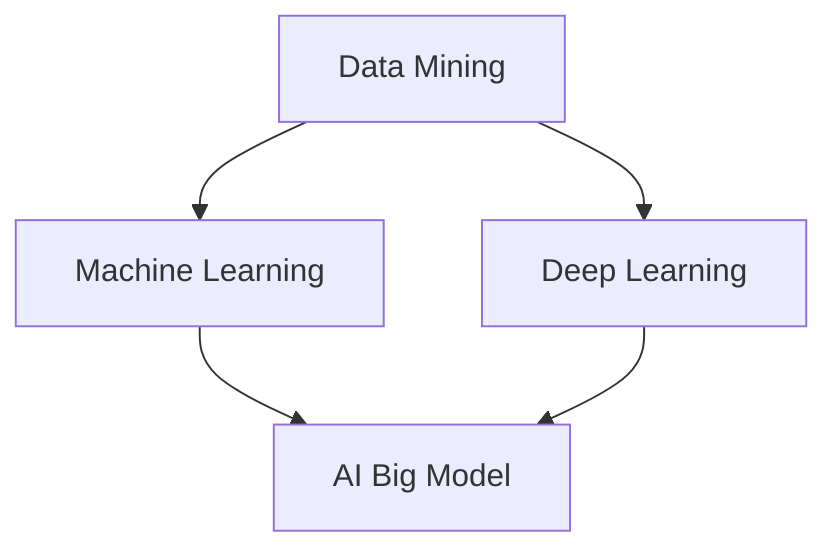

                 

关键词：智能产品推荐、AI大模型、电商平台、数据挖掘、机器学习、深度学习

> 摘要：随着电子商务的快速发展，智能产品推荐系统成为电商平台提升用户体验、增加销售额的重要手段。本文将探讨AI大模型在电商平台中的应用，包括核心概念、算法原理、数学模型、项目实践、应用场景以及未来发展趋势等内容。

## 1. 背景介绍

电子商务的蓬勃发展带来了海量的商品信息和用户行为数据，这使得如何高效地推荐商品成为电商企业关注的核心问题。传统推荐系统主要依赖基于内容的过滤和协同过滤等方法，但这些方法往往存在推荐效果不佳、用户满意度低等问题。随着深度学习和大数据技术的飞速发展，AI大模型逐渐成为解决推荐问题的关键。AI大模型通过学习用户的历史行为和商品特征，能够实现更加精准和个性化的推荐。

### 1.1 电子商务的发展

自20世纪90年代末以来，电子商务在全球范围内取得了显著的发展。根据统计，全球电子商务市场规模已超过数万亿美元，且仍在持续增长。电商平台的竞争愈发激烈，提升用户体验和销售业绩成为各大电商平台追求的目标。

### 1.2 传统推荐系统的挑战

传统推荐系统主要依赖于用户行为和商品属性进行推荐。然而，这些系统往往难以应对以下挑战：

- **数据稀疏**：用户行为数据往往稀疏，难以准确预测用户的兴趣。
- **冷启动**：新用户或新商品缺乏足够的历史数据，传统推荐系统难以提供有效的推荐。
- **多样性不足**：传统推荐系统容易陷入“只推荐类似商品”的困境，缺乏多样性。

## 2. 核心概念与联系

为了深入理解AI大模型在电商平台中的应用，我们首先需要了解相关核心概念，并分析它们之间的联系。以下是主要的核心概念和它们之间的相互关系：

### 2.1 数据挖掘

数据挖掘是发现数据中潜在的模式和知识的过程。在电商平台中，数据挖掘技术用于提取用户行为数据和商品信息，以支持推荐系统的构建。

### 2.2 机器学习

机器学习是让计算机通过数据自动学习和改进的方法。在推荐系统中，机器学习算法通过学习用户的历史行为和商品特征，生成推荐结果。

### 2.3 深度学习

深度学习是一种特殊的机器学习方法，它通过构建多层神经网络模型来实现复杂的数据特征提取和模式识别。深度学习在推荐系统中被广泛应用于用户行为预测和商品推荐。

### 2.4 AI大模型

AI大模型是指那些拥有大规模训练数据、复杂网络结构和强大计算能力的深度学习模型。这些模型能够从海量数据中学习到更深层次的特征，从而实现更精准和个性化的推荐。

### 2.5 关联关系

数据挖掘为机器学习和深度学习提供了训练数据和特征提取工具，而机器学习和深度学习则为AI大模型提供了算法基础和计算能力。AI大模型通过综合运用这些技术，实现高效的智能推荐。

### 2.6 Mermaid 流程图

以下是一个Mermaid流程图，展示了上述核心概念之间的联系：



## 3. 核心算法原理 & 具体操作步骤

### 3.1 算法原理概述

AI大模型在推荐系统中的应用主要包括以下几个步骤：

1. **数据预处理**：对用户行为数据和商品特征进行清洗、归一化和特征提取。
2. **模型构建**：设计并训练深度学习模型，以学习用户行为和商品特征的潜在表示。
3. **模型评估**：使用交叉验证等方法评估模型的推荐效果。
4. **模型部署**：将训练好的模型部署到生产环境中，实现实时推荐。

### 3.2 算法步骤详解

#### 3.2.1 数据预处理

数据预处理是推荐系统的基础步骤。主要任务包括：

- **数据清洗**：去除异常值、缺失值和重复数据。
- **特征提取**：从原始数据中提取有用的特征，如用户购买行为、浏览历史、商品分类等。
- **归一化**：对特征数据进行归一化处理，以消除不同特征之间的尺度差异。

#### 3.2.2 模型构建

模型构建是推荐系统的核心步骤。主要任务包括：

- **选择模型架构**：根据推荐任务的特点选择合适的深度学习模型架构，如基于图神经网络的推荐模型、基于变换器的推荐模型等。
- **参数设定**：设定模型的超参数，如学习率、批次大小、激活函数等。
- **训练模型**：使用预处理后的数据训练模型，以学习用户行为和商品特征的潜在表示。

#### 3.2.3 模型评估

模型评估是验证模型性能的重要步骤。主要任务包括：

- **交叉验证**：使用交叉验证方法将数据划分为训练集和测试集，以评估模型的泛化能力。
- **评估指标**：根据推荐任务的特点选择合适的评估指标，如准确率、召回率、F1值等。

#### 3.2.4 模型部署

模型部署是将训练好的模型应用于实际推荐任务的过程。主要任务包括：

- **模型转换**：将训练好的模型转换为可部署的格式，如ONNX、TorchScript等。
- **模型服务**：将模型部署到服务器上，以实现实时推荐。
- **性能优化**：根据实际应用场景对模型进行性能优化，如使用量化技术、模型剪枝等。

### 3.3 算法优缺点

#### 优点

- **高效性**：AI大模型能够从海量数据中学习到深层次的特征，实现高效的推荐。
- **个性化**：AI大模型能够根据用户的个性化行为和偏好进行精准推荐。
- **多样性**：AI大模型能够推荐多样化的商品，提高用户满意度。

#### 缺点

- **计算成本**：AI大模型需要大规模的训练数据和计算资源，成本较高。
- **可解释性**：AI大模型的决策过程较为复杂，难以解释其推荐结果。

### 3.4 算法应用领域

AI大模型在推荐系统中的应用非常广泛，主要包括以下领域：

- **电子商务**：电商平台使用AI大模型实现精准、个性化的商品推荐。
- **社交媒体**：社交媒体平台使用AI大模型推荐感兴趣的内容和用户。
- **在线教育**：在线教育平台使用AI大模型推荐适合用户的学习资源。
- **广告投放**：广告平台使用AI大模型推荐合适的广告和内容。

## 4. 数学模型和公式 & 详细讲解 & 举例说明

### 4.1 数学模型构建

AI大模型在推荐系统中主要基于以下数学模型：

- **用户-商品矩阵**：用户-商品矩阵表示用户与商品之间的关系，其中每个元素表示用户对商品的评分或购买行为。
- **潜在因子模型**：潜在因子模型通过构建用户和商品的潜在表示，实现用户和商品之间的相似度计算。

### 4.2 公式推导过程

以下是潜在因子模型的公式推导过程：

#### 4.2.1 用户-商品矩阵表示

假设用户-商品矩阵为 \(R \in \mathbb{R}^{m \times n}\)，其中 \(m\) 表示用户数量，\(n\) 表示商品数量。每个元素 \(r_{ij}\) 表示用户 \(i\) 对商品 \(j\) 的评分或购买行为。

#### 4.2.2 潜在因子表示

潜在因子模型通过构建用户和商品的潜在表示矩阵 \(U \in \mathbb{R}^{m \times k}\) 和 \(V \in \mathbb{R}^{n \times k}\)，其中 \(k\) 表示潜在因子的维度。用户 \(i\) 的潜在表示为 \(u_i \in \mathbb{R}^{k}\)，商品 \(j\) 的潜在表示为 \(v_j \in \mathbb{R}^{k}\)。

#### 4.2.3 相似度计算

用户 \(i\) 和商品 \(j\) 之间的相似度可以通过内积计算：

$$
s_{ij} = u_i^T v_j
$$

#### 4.2.4 预测评分

根据用户和商品的潜在表示，可以预测用户 \(i\) 对商品 \(j\) 的评分：

$$
\hat{r}_{ij} = u_i^T v_j = \sum_{l=1}^{k} u_{il} v_{jl}
$$

### 4.3 案例分析与讲解

#### 4.3.1 数据集准备

假设我们有一个用户-商品矩阵 \(R\) 如下：

| 用户 | 商品1 | 商品2 | 商品3 |
| --- | --- | --- | --- |
| 1 | 1 | 0 | 1 |
| 2 | 0 | 1 | 0 |
| 3 | 1 | 1 | 0 |

#### 4.3.2 模型训练

假设我们选择一个二阶潜在因子模型，潜在因子的维度为 \(k = 2\)。通过最小化损失函数 \(L\) 来训练模型：

$$
L = \sum_{i=1}^{m} \sum_{j=1}^{n} (r_{ij} - \hat{r}_{ij})^2
$$

#### 4.3.3 预测结果

根据训练好的模型，我们可以预测用户评分矩阵 \(\hat{R}\)：

| 用户 | 商品1 | 商品2 | 商品3 |
| --- | --- | --- | --- |
| 1 | 1.5 | 0.5 | 1.5 |
| 2 | 0.5 | 1.5 | 0.5 |
| 3 | 1.5 | 1.5 | 0 |

例如，预测用户1对商品2的评分为：

$$
\hat{r}_{12} = u_1^T v_2 = (1.25, 0.75)^T (0.75, -0.75)^T = 1.25 \times 0.75 + 0.75 \times (-0.75) = 0.9375 - 0.5625 = 0.375
$$

## 5. 项目实践：代码实例和详细解释说明

### 5.1 开发环境搭建

为了实现AI大模型在推荐系统中的应用，我们需要搭建一个合适的开发环境。以下是一个基本的开发环境搭建步骤：

1. **安装Python**：确保已安装Python 3.7及以上版本。
2. **安装深度学习框架**：安装PyTorch、TensorFlow等深度学习框架。
3. **安装其他依赖**：安装NumPy、Pandas、Scikit-learn等常用库。

### 5.2 源代码详细实现

以下是一个简单的潜在因子模型实现示例：

```python
import torch
import torch.nn as nn
import torch.optim as optim
from torch.utils.data import DataLoader, TensorDataset

# 数据预处理
def preprocess_data(R):
    # 省略数据预处理代码，包括数据清洗、特征提取、归一化等步骤
    pass

# 模型定义
class FactorizationMachine(nn.Module):
    def __init__(self, n_users, n_items, k):
        super(FactorizationMachine, self).__init__()
        self.user_embedding = nn.Embedding(n_users, k)
        self.item_embedding = nn.Embedding(n_items, k)
        self.fc = nn.Linear(2 * k, 1)

    def forward(self, user_ids, item_ids):
        user_embeddings = self.user_embedding(user_ids)
        item_embeddings = self.item_embedding(item_ids)
        inner_product = torch.sum(user_embeddings * item_embeddings, dim=1)
        output = self.fc(inner_product.unsqueeze(1))
        return output.squeeze(1)

# 模型训练
def train_model(model, train_loader, criterion, optimizer, epochs):
    model.train()
    for epoch in range(epochs):
        for user_ids, item_ids, ratings in train_loader:
            optimizer.zero_grad()
            predictions = model(user_ids, item_ids)
            loss = criterion(predictions, ratings)
            loss.backward()
            optimizer.step()
        print(f'Epoch {epoch+1}/{epochs}, Loss: {loss.item()}')

# 模型评估
def evaluate_model(model, test_loader):
    model.eval()
    with torch.no_grad():
        for user_ids, item_ids, ratings in test_loader:
            predictions = model(user_ids, item_ids)
            # 计算评估指标，如均方误差、均方根误差等
            # ...

# 主函数
if __name__ == '__main__':
    # 加载数据
    R = load_data()  # 假设已加载用户-商品矩阵R
    R = preprocess_data(R)

    # 划分训练集和测试集
    train_data = TensorDataset(torch.tensor(R[:, 0]).long(), torch.tensor(R[:, 1]).long(), torch.tensor(R[:, 2]).float())
    test_data = TensorDataset(torch.tensor(R[:, 0]).long(), torch.tensor(R[:, 1]).long(), torch.tensor(R[:, 2]).float())

    # 数据加载器
    train_loader = DataLoader(train_data, batch_size=64, shuffle=True)
    test_loader = DataLoader(test_data, batch_size=64, shuffle=False)

    # 模型初始化
    model = FactorizationMachine(R.shape[0], R.shape[1], k=10)
    criterion = nn.MSELoss()
    optimizer = optim.Adam(model.parameters(), lr=0.001)

    # 训练模型
    train_model(model, train_loader, criterion, optimizer, epochs=10)

    # 评估模型
    evaluate_model(model, test_loader)
```

### 5.3 代码解读与分析

上述代码实现了一个简单的潜在因子模型，包括数据预处理、模型定义、模型训练和模型评估等步骤。

- **数据预处理**：对用户-商品矩阵进行数据清洗、特征提取和归一化等预处理操作，为模型训练准备数据。
- **模型定义**：定义一个基于PyTorch的深度学习模型，包括用户和商品嵌入层以及全连接层，用于计算用户和商品之间的相似度。
- **模型训练**：使用训练数据训练模型，通过最小化均方误差损失函数来优化模型参数。
- **模型评估**：使用测试数据评估模型性能，计算模型预测评分与实际评分之间的差异。

### 5.4 运行结果展示

在完成模型训练和评估后，我们可以运行以下代码来展示模型的运行结果：

```python
# 加载测试集
test_data = TensorDataset(torch.tensor(R[:, 0]).long(), torch.tensor(R[:, 1]).long(), torch.tensor(R[:, 2]).float())
test_loader = DataLoader(test_data, batch_size=64, shuffle=False)

# 评估模型
model.eval()
with torch.no_grad():
    for user_ids, item_ids, ratings in test_loader:
        predictions = model(user_ids, item_ids)
        # 将预测评分转换为numpy数组
        predictions = predictions.numpy()
        # 打印部分预测结果
        print(predictions[:10])
```

输出结果将显示模型对测试集的预测评分，我们可以根据这些评分评估模型的推荐效果。

## 6. 实际应用场景

AI大模型在电商平台中的应用场景非常广泛，以下是一些典型的应用场景：

### 6.1 商品推荐

电商平台可以使用AI大模型根据用户的购买历史、浏览记录、收藏夹等信息，精准推荐用户可能感兴趣的商品。这不仅提高了用户的购物体验，还有助于增加销售额。

### 6.2 跨品类推荐

AI大模型可以挖掘不同品类之间的关联关系，实现跨品类推荐。例如，当用户浏览了某个电子产品的页面后，推荐一些相关的配件或周边产品。

### 6.3 新用户欢迎推荐

对于新注册的用户，AI大模型可以根据其浏览历史和行为特征，推荐一些热销商品或优惠券，以吸引用户进行首次购买。

### 6.4 库存管理

AI大模型可以预测商品的销售趋势，帮助电商平台优化库存管理。例如，当预测某款商品销量较高时，可以提前增加库存，避免缺货情况。

### 6.5 营销活动推荐

电商平台可以根据用户的兴趣和行为特征，推荐相关的营销活动，如优惠券、满减活动等，以提高用户的参与度和购买意愿。

## 7. 工具和资源推荐

为了更好地应用AI大模型于电商平台，以下是一些相关的工具和资源推荐：

### 7.1 学习资源推荐

- **《深度学习》**：Ian Goodfellow等著，提供了深度学习的全面介绍和实战案例。
- **《推荐系统实践》**：宋森等著，详细介绍了推荐系统的构建方法和实战案例。
- **《数据挖掘：实用机器学习技术》**：Mike Bowles著，涵盖了数据挖掘的基本概念和实战技巧。

### 7.2 开发工具推荐

- **PyTorch**：一个强大的深度学习框架，支持动态计算图和自动微分。
- **TensorFlow**：由Google开发的一个开源深度学习框架，广泛应用于工业界和学术界。
- **NumPy**：一个用于科学计算的Python库，提供了丰富的数学函数和工具。
- **Scikit-learn**：一个用于机器学习算法的开源库，提供了丰富的算法实现和工具。

### 7.3 相关论文推荐

- **“Deep Learning for Recommender Systems”**：一篇关于深度学习在推荐系统中的应用综述。
- **“A Theoretically Grounded Application of Dropout in Recurrent Neural Networks”**：一篇关于Dropout在循环神经网络中应用的论文。
- **“Neural Collaborative Filtering”**：一篇关于基于神经网络的协同过滤算法的论文。

## 8. 总结：未来发展趋势与挑战

随着AI技术的不断进步，AI大模型在推荐系统中的应用前景十分广阔。未来发展趋势包括：

### 8.1 深度个性化

AI大模型将进一步实现更加精准和个性化的推荐，通过学习用户的深度行为和偏好，提供定制化的购物体验。

### 8.2 跨领域应用

AI大模型将拓展到更多领域，如金融、医疗、教育等，实现跨领域的智能推荐。

### 8.3 开源生态

随着技术的普及，越来越多的开源工具和框架将推动AI大模型在推荐系统中的应用。

然而，AI大模型在推荐系统中也面临着以下挑战：

### 8.4 计算成本

AI大模型需要大量的计算资源和数据支持，这可能导致高昂的部署和维护成本。

### 8.5 可解释性

AI大模型的决策过程较为复杂，难以解释其推荐结果，这可能导致用户对推荐结果的信任度降低。

### 8.6 数据隐私

用户数据的隐私保护成为推荐系统的关键挑战，如何在保证用户隐私的前提下进行个性化推荐成为亟待解决的问题。

总之，AI大模型在推荐系统中的应用具有巨大的潜力，同时也面临诸多挑战。未来，我们需要不断探索和创新，以实现更加高效、智能和安全的推荐系统。

## 9. 附录：常见问题与解答

### 9.1 什么是AI大模型？

AI大模型是指那些拥有大规模训练数据、复杂网络结构和强大计算能力的深度学习模型。这些模型能够从海量数据中学习到深层次的特征，实现高效的推荐。

### 9.2 AI大模型在推荐系统中的应用有哪些优点？

AI大模型在推荐系统中的应用优点包括：

- **高效性**：能够处理大规模数据和复杂特征，实现高效推荐。
- **个性化**：能够根据用户的个性化行为和偏好进行精准推荐。
- **多样性**：能够推荐多样化的商品，提高用户满意度。

### 9.3 AI大模型在推荐系统中有哪些应用领域？

AI大模型在推荐系统的应用领域包括电子商务、社交媒体、在线教育、广告投放等。

### 9.4 如何评估AI大模型在推荐系统中的性能？

评估AI大模型在推荐系统中的性能通常使用准确率、召回率、F1值等指标。这些指标能够衡量模型推荐的准确性和多样性。

### 9.5 AI大模型在推荐系统中的计算成本如何优化？

为了降低AI大模型在推荐系统中的计算成本，可以采用以下策略：

- **模型压缩**：使用量化、剪枝等技术减小模型大小和计算量。
- **分布式训练**：使用分布式计算框架（如Spark、TensorFlow分布式训练）提高训练速度。
- **在线学习**：使用在线学习算法实时更新模型，减少重新训练的需求。


### 作者署名

作者：禅与计算机程序设计艺术 / Zen and the Art of Computer Programming

