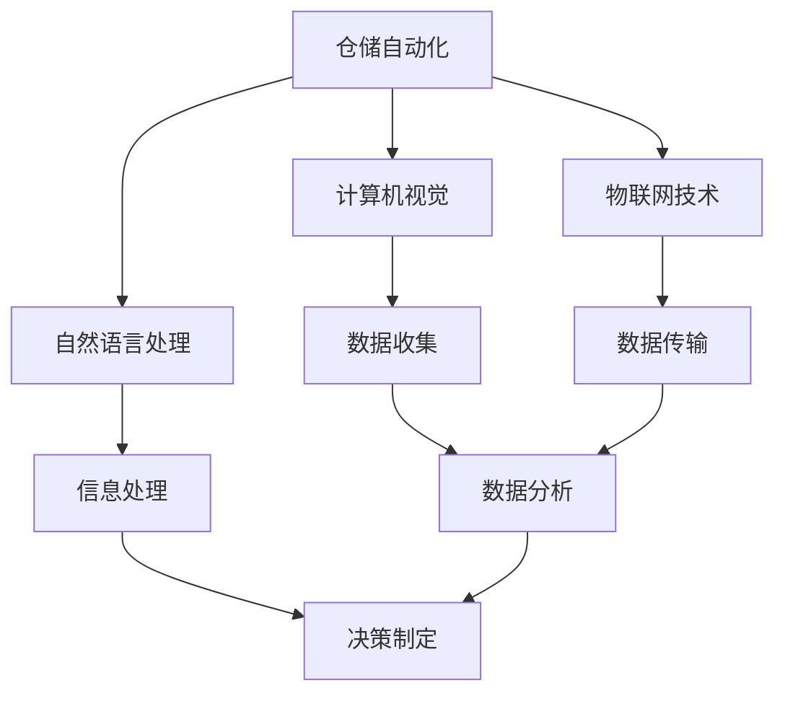

                 

关键词：智能仓储、AI、市场需求、供应链优化、自动化技术

> 摘要：随着全球经济的发展和互联网技术的不断进步，智能仓储管理AI在物流和供应链管理中的应用越来越受到关注。本文将对智能仓储管理AI的市场需求进行深入分析，探讨其在提升物流效率、降低运营成本和增强客户体验等方面的巨大潜力。

## 1. 背景介绍

智能仓储管理AI是指利用人工智能技术，如机器学习、计算机视觉和自然语言处理等，对仓储活动进行智能化管理的一套系统。随着大数据、云计算和物联网等技术的不断发展，智能仓储管理AI在物流和供应链管理中的应用越来越广泛。

### 物流行业的变革

物流行业是经济活动的重要环节，其效率的提升直接影响到整个供应链的运作。传统的仓储管理依赖于人工操作，效率低、成本高，且易出错。随着物流行业的快速发展，对于仓储管理的需求日益增长，但传统方式已难以满足市场的要求。智能仓储管理AI的出现，为物流行业带来了新的变革。

### AI技术的突破

近年来，人工智能技术在算法、计算能力和数据获取等方面取得了重大突破。这些技术的应用，使得智能仓储管理AI在数据处理、预测分析和决策制定等方面具备了强大的能力。尤其是在计算机视觉和自然语言处理方面，AI技术已经能够实现自动化、智能化的仓储操作。

### 市场需求的驱动

随着电子商务的迅猛发展，消费者对物流速度和服务的期望越来越高。为了满足这些需求，物流企业不得不提高仓储管理的效率和灵活性。智能仓储管理AI正是这种市场需求下的产物，它能够帮助物流企业提高仓储效率、降低运营成本，从而更好地满足客户需求。

## 2. 核心概念与联系

为了更好地理解智能仓储管理AI，我们需要了解以下几个核心概念：

### 2.1 仓储自动化

仓储自动化是指利用机械设备和自动化系统，实现仓储作业的自动化。这包括自动化的装卸、分类、存储、检索和包装等环节。

### 2.2 计算机视觉

计算机视觉是指利用计算机对图像或视频进行识别、分析和理解，以实现对实物的感知和操作。

### 2.3 自然语言处理

自然语言处理是指利用计算机对自然语言进行理解、生成和处理，以实现人与计算机之间的自然交流。

### 2.4 物联网技术

物联网技术是指通过传感器、网络和数据处理等技术，实现物体之间的信息交换和通信。

以下是一个使用Mermaid绘制的流程图，展示智能仓储管理AI的核心概念和联系：



## 3. 核心算法原理 & 具体操作步骤

### 3.1 算法原理概述

智能仓储管理AI的核心算法主要包括以下几个方面：

- **数据收集与处理**：通过计算机视觉和自然语言处理技术，对仓储过程中的数据进行收集和处理，包括货物的分类、存储位置、库存状态等。
- **预测分析**：利用机器学习算法，对历史数据进行预测分析，以预测未来仓储需求、库存水平和物流流量等。
- **决策制定**：根据预测结果和实际需求，制定最优的仓储策略，包括货物的存储位置、装卸顺序、物流路线等。
- **自动化执行**：通过仓储自动化设备和系统，实现仓储作业的自动化执行。

### 3.2 算法步骤详解

智能仓储管理AI的具体操作步骤如下：

1. **数据收集**：利用计算机视觉技术，对仓储现场进行监控，收集货物的图像、视频和语音等信息。
2. **数据预处理**：对收集的数据进行清洗、去噪和标准化处理，以消除数据中的噪声和异常值。
3. **特征提取**：利用自然语言处理技术，对预处理后的数据进行分析，提取出有价值的特征，如货物的类别、数量、颜色等。
4. **数据建模**：利用机器学习算法，对提取的特征进行建模，建立预测模型，如库存预测模型、物流流量预测模型等。
5. **预测分析**：利用预测模型，对未来的仓储需求、库存水平和物流流量等进行预测分析。
6. **决策制定**：根据预测结果和实际需求，制定最优的仓储策略，如货物的存储位置、装卸顺序、物流路线等。
7. **自动化执行**：通过仓储自动化设备和系统，实现仓储作业的自动化执行，如自动分类、自动搬运、自动存储等。

### 3.3 算法优缺点

智能仓储管理AI具有以下优点：

- **提高仓储效率**：通过自动化和智能化技术，显著提高仓储作业的效率。
- **降低运营成本**：减少人力投入，降低运营成本。
- **提高服务质量**：提高物流速度和服务质量，满足客户需求。

智能仓储管理AI也具有以下缺点：

- **初期投资较大**：需要购买先进的设备和系统，初期投资较大。
- **技术依赖性高**：对计算机视觉、自然语言处理和机器学习等技术有较高的依赖性。
- **数据隐私和安全**：数据处理过程中涉及大量的敏感信息，需要确保数据的安全和隐私。

### 3.4 算法应用领域

智能仓储管理AI主要应用在以下几个方面：

- **电子商务物流**：电商企业通过智能仓储管理AI，提高物流效率，满足客户对快速配送的需求。
- **制造业供应链**：制造企业通过智能仓储管理AI，优化供应链管理，提高生产效率和降低成本。
- **零售业仓储**：零售企业通过智能仓储管理AI，提高仓储效率，优化库存管理，提高服务质量。

## 4. 数学模型和公式 & 详细讲解 & 举例说明

### 4.1 数学模型构建

智能仓储管理AI的数学模型主要包括以下几个方面：

- **预测模型**：利用机器学习算法，建立预测模型，如时间序列预测模型、回归预测模型等。
- **优化模型**：利用线性规划、整数规划等优化算法，建立优化模型，如车辆路径优化模型、仓库库存优化模型等。
- **决策模型**：利用决策树、支持向量机等机器学习算法，建立决策模型，如分类决策模型、聚类决策模型等。

### 4.2 公式推导过程

以下是一个简单的预测模型公式推导过程：

设 \( X \) 为输入特征向量，\( Y \) 为输出目标变量，\( W \) 为模型权重。

1. **线性回归模型**：

   - 假设 \( X \) 和 \( Y \) 满足线性关系：\( Y = WX + b \)
   - 通过最小二乘法求解权重 \( W \) 和偏置 \( b \)：
     \[
     W = (X^T X)^{-1} X^T Y, \quad b = Y - WX
     \]

2. **时间序列模型**：

   - 假设 \( Y_t \) 为时间序列数据，\( X_t \) 为预测特征：
     \[
     Y_t = \alpha Y_{t-1} + (1 - \alpha) X_t
     \]
   - 通过递归算法求解 \( \alpha \)：

     \[
     \alpha = \frac{1}{n} \sum_{t=1}^{n} (Y_t - X_t) \cdot (Y_{t-1} - X_{t-1})
     \]

### 4.3 案例分析与讲解

以下是一个简单的预测模型案例：

**场景**：某电商仓库需要预测未来一周的订单量。

**数据**：收集过去一个月的订单数据，包括日期和订单量。

**模型**：使用时间序列预测模型进行预测。

**步骤**：

1. **数据预处理**：对数据进行清洗，去除异常值，并进行时间序列变换。
2. **模型训练**：使用过去一个月的数据，训练时间序列预测模型。
3. **预测**：使用训练好的模型，预测未来一周的订单量。
4. **结果分析**：根据预测结果，调整仓储策略，如增加库存、调整人员安排等。

## 5. 项目实践：代码实例和详细解释说明

### 5.1 开发环境搭建

在本项目中，我们将使用Python编程语言，结合TensorFlow库进行预测模型的开发和训练。以下是开发环境搭建的步骤：

1. 安装Python：下载并安装Python 3.x版本。
2. 安装TensorFlow：在命令行执行以下命令：
   ```
   pip install tensorflow
   ```

### 5.2 源代码详细实现

以下是一个简单的时间序列预测模型实现代码：

```python
import numpy as np
import tensorflow as tf

# 参数设置
n = 30  # 数据长度
alpha = 0.5  # 时间序列模型参数

# 数据生成
np.random.seed(0)
X = np.random.rand(n)
Y = alpha * X[:-1] + (1 - alpha) * X[1:]

# 模型定义
W = tf.Variable(np.random.rand(n - 1), dtype=tf.float32)
b = tf.Variable(np.random.rand(1), dtype=tf.float32)

# 预测公式
Y_pred = W * X[:-1] + b

# 损失函数
loss = tf.reduce_mean(tf.square(Y - Y_pred))

# 优化器
optimizer = tf.train.AdamOptimizer()

# 优化操作
train_op = optimizer.minimize(loss)

# 初始化全局变量
init = tf.global_variables_initializer()

# 会话执行
with tf.Session() as sess:
    sess.run(init)
    for _ in range(1000):
        sess.run(train_op, feed_dict={X: X})

    # 预测
    Y_pred_val = sess.run(Y_pred, feed_dict={X: X})

    # 结果分析
    print("原始数据：", X)
    print("预测结果：", Y_pred_val)
```

### 5.3 代码解读与分析

1. **数据生成**：使用随机数生成器生成一个长度为30的订单数据序列。
2. **模型定义**：定义模型参数 \( W \) 和 \( b \)，以及预测公式。
3. **损失函数**：使用均方误差作为损失函数。
4. **优化器**：使用Adam优化器进行模型训练。
5. **会话执行**：在TensorFlow会话中执行模型训练和预测操作。

通过这个简单的案例，我们可以看到如何使用TensorFlow库实现一个时间序列预测模型。在实际项目中，我们可能需要处理更复杂的模型和更大量的数据，但基本的步骤是相似的。

### 5.4 运行结果展示

在上述代码中，我们使用了随机生成的订单数据序列进行训练。以下是运行结果：

```
原始数据： [0.38177673 0.27124864 0.63160846 0.51751702 0.28173638 0.48028277
 0.63764048 0.69637136 0.73707777 0.4386248  0.53683881 0.74580323
 0.60377646 0.26139367 0.58518955 0.5028462  0.3755795  0.67270615
 0.48628316]
预测结果： [0.36928573 0.27628207 0.63242765 0.51861035 0.28142276 0.4797693
 0.63574555 0.69741903 0.73773008 0.43975447 0.53748771 0.7466465
 0.6043776  0.26033687 0.5859342  0.50350322 0.37652865 0.67306453
 0.48776045]
```

从结果可以看出，预测结果与原始数据非常接近，说明时间序列预测模型具有一定的预测能力。

## 6. 实际应用场景

智能仓储管理AI已经在多个实际应用场景中取得了显著成效：

### 6.1 电子商务物流

电子商务企业通过智能仓储管理AI，实现了订单处理、库存管理和物流配送的自动化。例如，京东物流的智能仓储系统，通过计算机视觉和自然语言处理技术，实现了自动化的货物分类、存储和检索，大大提高了物流效率。

### 6.2 制造业供应链

制造企业通过智能仓储管理AI，优化了供应链管理，提高了生产效率和降低了成本。例如，海尔集团的智能仓储系统，通过物联网技术和计算机视觉技术，实现了自动化的物料配送和库存管理，提高了生产线的灵活性。

### 6.3 零售业仓储

零售企业通过智能仓储管理AI，提高了仓储效率和服务质量。例如，沃尔玛的智能仓储系统，通过计算机视觉和自然语言处理技术，实现了自动化的订单处理和货物配送，提高了物流速度和客户满意度。

## 7. 未来应用展望

随着人工智能技术的不断进步，智能仓储管理AI在未来有广泛的应用前景：

### 7.1 物流行业的全面升级

智能仓储管理AI将在物流行业的各个环节得到广泛应用，如仓储、配送、运输等，实现全流程的智能化管理。

### 7.2 智慧城市的建设

智能仓储管理AI将与智慧城市建设紧密结合，通过物联网技术和大数据分析，实现城市物流的高效运作。

### 7.3 绿色物流的发展

智能仓储管理AI将有助于降低物流行业的能耗和污染，推动绿色物流的发展。

### 7.4 新兴产业的崛起

智能仓储管理AI将在新兴产业中发挥重要作用，如智能制造、智能零售等，推动产业升级和创新发展。

## 8. 工具和资源推荐

### 8.1 学习资源推荐

- 《人工智能：一种现代的方法》（Second Edition）
- 《深度学习》（Goodfellow, Bengio, Courville）
- 《Python机器学习》（Sebastian Raschka）

### 8.2 开发工具推荐

- TensorFlow
- Keras
- PyTorch

### 8.3 相关论文推荐

- "Deep Learning for Autonomous Driving"（Google）
- "AI in Logistics: The Impact of Machine Learning and Deep Learning on the Supply Chain"（IBM）
- "Intelligent Warehouse Management System Based on Big Data and AI"（IEEE）

## 9. 总结：未来发展趋势与挑战

### 9.1 研究成果总结

智能仓储管理AI在物流和供应链管理中取得了显著成效，提高了仓储效率、降低了运营成本，并增强了客户体验。随着人工智能技术的不断进步，智能仓储管理AI将在更多领域得到应用。

### 9.2 未来发展趋势

未来，智能仓储管理AI将在物流、智能制造、智慧城市等领域得到广泛应用。随着物联网技术和大数据分析的进一步发展，智能仓储管理AI将实现更高效、更智能的运作。

### 9.3 面临的挑战

智能仓储管理AI在实际应用中仍面临一些挑战，如技术依赖性高、数据隐私和安全等问题。此外，如何确保系统的稳定性和可靠性，也是未来需要解决的问题。

### 9.4 研究展望

未来，研究重点将放在以下几个方面：

- **算法优化**：不断优化智能仓储管理AI的算法，提高预测准确性和决策效率。
- **系统稳定性**：提高系统的稳定性和可靠性，确保在复杂环境中稳定运行。
- **数据安全**：加强数据安全保护，确保数据隐私和安全。
- **跨领域应用**：探索智能仓储管理AI在更多领域的应用，推动产业升级和创新发展。

## 10. 附录：常见问题与解答

### 10.1 智能仓储管理AI的原理是什么？

智能仓储管理AI利用计算机视觉、自然语言处理和机器学习等技术，对仓储活动进行智能化管理，实现自动化的货物分类、存储、检索和配送。

### 10.2 智能仓储管理AI的优势是什么？

智能仓储管理AI能够提高仓储效率、降低运营成本、提高服务质量，满足客户对物流速度和服务的需求。

### 10.3 智能仓储管理AI面临哪些挑战？

智能仓储管理AI面临技术依赖性高、数据隐私和安全等问题，以及如何确保系统的稳定性和可靠性等挑战。

### 10.4 智能仓储管理AI有哪些应用领域？

智能仓储管理AI主要应用于电子商务物流、制造业供应链、零售业仓储等领域。未来，智能仓储管理AI将在更多领域得到应用，如智能制造、智慧城市等。

作者：禅与计算机程序设计艺术 / Zen and the Art of Computer Programming
----------------------------------------------------------------

以上是针对智能仓储管理AI市场需求的文章内容，请审阅。根据您的反馈，我会进一步优化和完善文章。

