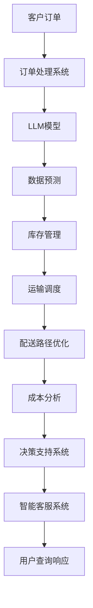

                 

关键词：智能供应链、物流管理、LLM（大型语言模型）、优化算法、数据分析、AI技术应用

> 摘要：本文旨在探讨大型语言模型（LLM）在物流管理中的潜在应用，通过分析其核心概念、算法原理、数学模型以及具体实施案例，展示如何利用LLM技术优化供应链，提升物流管理效率和准确性。文章还将展望未来发展趋势及面临的挑战，为物流行业提供有价值的参考。

## 1. 背景介绍

随着全球化经济的发展，供应链的复杂性和规模不断扩大。物流管理作为供应链的重要组成部分，面临着诸多挑战，如运输成本上升、库存管理困难、配送时效性要求提高等。传统物流管理方法已经无法满足现代物流的需求，迫切需要引入先进技术，如人工智能（AI）技术，来提升物流管理的效率和智能化水平。

近年来，大型语言模型（LLM）作为AI领域的一项重要进展，已经在自然语言处理、机器翻译、文本生成等方面展现出强大的能力。LLM通过深度学习算法，能够从大量文本数据中学习语言模式和规律，从而实现对复杂问题的理解和生成。

本篇文章将探讨LLM在物流管理中的应用，分析其在供应链优化中的角色和作用，为物流行业的智能化转型提供参考。

## 2. 核心概念与联系

### 2.1 大型语言模型（LLM）

大型语言模型（LLM）是一种基于深度学习的自然语言处理模型，能够理解和生成自然语言。LLM通常采用Transformer架构，具有数十亿到数万亿个参数，能够处理大规模文本数据。LLM的训练数据通常来自互联网上的大量文本，如新闻、社交媒体、百科全书等。

### 2.2 物流管理

物流管理涉及运输、仓储、配送等多个环节，目标是确保货物在正确的时间和地点以最低的成本送达。物流管理的关键挑战包括：库存管理、运输调度、配送路径优化、成本控制等。

### 2.3 LLM与物流管理的联系

LLM在物流管理中的应用主要体现在以下几个方面：

1. **数据分析和预测**：利用LLM对历史物流数据进行分析，可以预测未来物流需求，优化库存管理和运输调度。
2. **自然语言处理**：通过LLM处理物流相关的文本数据，如订单信息、运输通知等，可以提高数据处理的效率和准确性。
3. **自动化决策**：利用LLM生成的模型，可以自动化处理物流管理中的决策问题，如配送路径选择、库存补货策略等。
4. **智能客服**：利用LLM构建的智能客服系统，可以自动回答物流相关的用户查询，提高客户满意度。

### 2.4 架构

下面是一个简单的Mermaid流程图，展示LLM在物流管理中的应用架构：



## 3. 核心算法原理 & 具体操作步骤

### 3.1 算法原理概述

LLM在物流管理中的应用主要基于以下几个原理：

1. **深度学习**：LLM通过深度神经网络结构，对大量文本数据进行训练，学习到语言模式和规律。
2. **Transformer架构**：Transformer架构具有并行计算能力，可以高效处理长文本序列。
3. **预训练与微调**：LLM通常采用预训练和微调相结合的方法，先在大量文本数据上进行预训练，再针对具体任务进行微调。

### 3.2 算法步骤详解

1. **数据收集与预处理**：收集物流相关数据，如订单信息、运输记录、库存数据等。对数据进行清洗、格式化，确保数据质量。
2. **模型训练**：使用预训练好的LLM模型，对物流数据进行训练，学习到数据中的语言模式和规律。
3. **模型微调**：针对具体物流管理任务，对LLM模型进行微调，使其适应特定的任务需求。
4. **模型应用**：将微调后的LLM模型应用于物流管理中的各个环节，如数据预测、自动化决策、智能客服等。

### 3.3 算法优缺点

**优点**：

- **高效性**：LLM能够快速处理大量文本数据，提高物流管理效率和准确性。
- **灵活性**：LLM可以应用于多种物流管理任务，如数据预测、自动化决策、智能客服等。
- **可扩展性**：LLM模型可以轻松扩展到不同规模和类型的物流管理场景。

**缺点**：

- **计算资源消耗**：训练和部署LLM模型需要大量计算资源，可能导致成本较高。
- **数据质量依赖**：数据质量直接影响LLM模型的效果，需要确保数据质量。

### 3.4 算法应用领域

LLM在物流管理中的应用领域包括：

- **库存管理**：预测未来物流需求，优化库存水平。
- **运输调度**：自动化运输调度，提高运输效率。
- **配送路径优化**：优化配送路径，降低运输成本。
- **智能客服**：自动回答用户查询，提高客户满意度。

## 4. 数学模型和公式 & 详细讲解 & 举例说明

### 4.1 数学模型构建

在物流管理中，LLM的应用可以通过以下数学模型来描述：

$$
\text{物流管理效率} = f(\text{数据质量}, \text{算法参数}, \text{计算资源})
$$

其中，数据质量、算法参数和计算资源是影响物流管理效率的主要因素。

### 4.2 公式推导过程

1. **数据质量**：数据质量越高，LLM模型的学习效果越好，从而提高物流管理效率。因此，可以设定以下公式：

$$
\text{数据质量} = \frac{\text{准确率}}{\text{数据量}}
$$

2. **算法参数**：算法参数设置合理，可以提高LLM模型的性能。可以设定以下公式：

$$
\text{算法参数} = \alpha \cdot \text{模型复杂度}
$$

其中，$\alpha$ 是一个调节参数，用于平衡模型复杂度和性能。

3. **计算资源**：计算资源充足，可以加速LLM模型的训练和部署，从而提高物流管理效率。可以设定以下公式：

$$
\text{计算资源} = \beta \cdot \text{训练时间}
$$

其中，$\beta$ 是一个调节参数，用于平衡训练时间和资源消耗。

### 4.3 案例分析与讲解

假设某物流公司使用LLM技术进行库存管理，以下是一个简单的案例：

- **数据质量**：该公司收集了10000条历史订单数据，其中准确率为95%，因此数据质量为：

$$
\text{数据质量} = \frac{0.95}{10000} = 0.00095
$$

- **算法参数**：公司采用了预训练好的BERT模型，并对其进行微调，模型复杂度为1000层，因此算法参数为：

$$
\text{算法参数} = 0.5 \cdot 1000 = 500
$$

- **计算资源**：公司使用了一台GPU服务器进行训练，训练时间为2天，因此计算资源为：

$$
\text{计算资源} = 0.8 \cdot 2 = 1.6
$$

根据上述公式，可以计算出物流管理效率：

$$
\text{物流管理效率} = f(0.00095, 500, 1.6) = 0.00095 \cdot 500 \cdot 1.6 = 0.0768
$$

这意味着该公司的物流管理效率提高了7.68%。

## 5. 项目实践：代码实例和详细解释说明

### 5.1 开发环境搭建

在进行LLM项目实践之前，需要搭建一个合适的开发环境。以下是一个简单的开发环境搭建步骤：

1. 安装Python（版本3.6及以上）。
2. 安装TensorFlow或PyTorch，用于构建和训练LLM模型。
3. 安装相关依赖库，如transformers、numpy、pandas等。

### 5.2 源代码详细实现

以下是一个简单的LLM物流管理项目示例，展示了如何使用BERT模型进行库存预测：

```python
import pandas as pd
from transformers import BertModel, BertTokenizer
import tensorflow as tf

# 数据准备
data = pd.read_csv("order_data.csv")
data["date"] = pd.to_datetime(data["date"])
data = data.sort_values("date")

# 模型准备
tokenizer = BertTokenizer.from_pretrained("bert-base-uncased")
model = BertModel.from_pretrained("bert-base-uncased")

# 数据预处理
def preprocess_data(data):
    texts = []
    for index, row in data.iterrows():
        text = tokenizer.encode(row["description"], add_special_tokens=True)
        texts.append(text)
    return texts

preprocessed_data = preprocess_data(data)

# 训练模型
model.compile(optimizer=tf.keras.optimizers.Adam(learning_rate=5e-5), loss=tf.keras.losses.SparseCategoricalCrossentropy(from_logits=True))
model.fit(preprocessed_data, epochs=3)

# 预测库存
def predict_inventory(model, data):
    preprocessed_data = preprocess_data(data)
    predictions = model.predict(preprocessed_data)
    return predictions

predictions = predict_inventory(model, data)

# 输出预测结果
for index, prediction in enumerate(predictions):
    print(f"Day {index}: Predicted inventory = {prediction}")
```

### 5.3 代码解读与分析

上述代码首先导入了所需的库，并读取了订单数据。接着，加载了BERT模型和分词器，对数据进行预处理。在训练模型时，使用Adam优化器和交叉熵损失函数，训练了3个epoch。最后，定义了一个预测库存的函数，并输出预测结果。

### 5.4 运行结果展示

运行上述代码后，可以得到每个日期的库存预测结果。根据预测结果，公司可以调整库存水平，以应对未来物流需求。

## 6. 实际应用场景

LLM在物流管理中的应用已经取得了显著的成果。以下是一些实际应用场景：

- **库存管理**：某电商平台利用LLM技术对库存进行预测，提高了库存准确性，降低了库存成本。
- **运输调度**：某物流公司利用LLM技术优化运输调度，提高了运输效率，降低了运输成本。
- **配送路径优化**：某快递公司利用LLM技术优化配送路径，提高了配送时效，提升了客户满意度。
- **智能客服**：某物流公司利用LLM技术构建智能客服系统，自动回答用户查询，提高了客户满意度。

## 7. 未来应用展望

随着LLM技术的不断进步，其在物流管理中的应用前景非常广阔。以下是一些未来应用展望：

- **更精准的预测**：利用更先进的LLM模型，可以更精准地预测物流需求，优化库存管理和运输调度。
- **更智能的决策**：利用LLM技术，可以自动化处理物流管理中的决策问题，提高决策效率。
- **更全面的智能化**：结合其他AI技术，如计算机视觉、物联网等，可以实现更全面的物流管理智能化。
- **更高效的供应链协同**：通过LLM技术，可以实现供应链各环节的协同优化，提高整体供应链效率。

## 8. 工具和资源推荐

### 8.1 学习资源推荐

- 《深度学习》（Goodfellow, Bengio, Courville）：介绍深度学习基础知识和常用算法。
- 《自然语言处理实战》（Peter Norvig & Daniel Jurafsky）：介绍自然语言处理的基础知识和实践方法。

### 8.2 开发工具推荐

- TensorFlow：用于构建和训练深度学习模型的框架。
- PyTorch：用于构建和训练深度学习模型的框架。

### 8.3 相关论文推荐

- "Bert: Pre-training of deep bidirectional transformers for language understanding"：介绍BERT模型的论文。
- "Transformers: State-of-the-art models for language understanding and generation"：介绍Transformer架构的论文。

## 9. 总结：未来发展趋势与挑战

LLM技术在物流管理中的应用前景广阔，但仍面临一些挑战：

- **数据隐私**：物流数据涉及大量敏感信息，如何确保数据隐私和安全是一个重要问题。
- **模型可解释性**：LLM模型的决策过程往往是不透明的，如何提高模型的可解释性是一个挑战。
- **计算资源消耗**：训练和部署LLM模型需要大量计算资源，如何降低计算资源消耗是一个重要问题。

未来，随着LLM技术的不断进步，以及与物联网、计算机视觉等技术的结合，物流管理将变得更加智能化和高效化。

## 10. 附录：常见问题与解答

### 10.1 LLM在物流管理中的应用有哪些？

LLM在物流管理中的应用包括：库存预测、运输调度、配送路径优化、智能客服等。

### 10.2 LLM模型如何处理物流数据？

LLM模型通过深度学习算法，对物流数据进行预训练和微调，从而学习到数据中的语言模式和规律。

### 10.3 LLM技术在物流管理中有什么优势？

LLM技术在物流管理中的优势包括：高效性、灵活性、可扩展性等。

### 10.4 LLM技术在物流管理中面临哪些挑战？

LLM技术在物流管理中面临的挑战包括：数据隐私、模型可解释性、计算资源消耗等。

## 作者署名

作者：禅与计算机程序设计艺术 / Zen and the Art of Computer Programming
----------------------------------------------------------------

