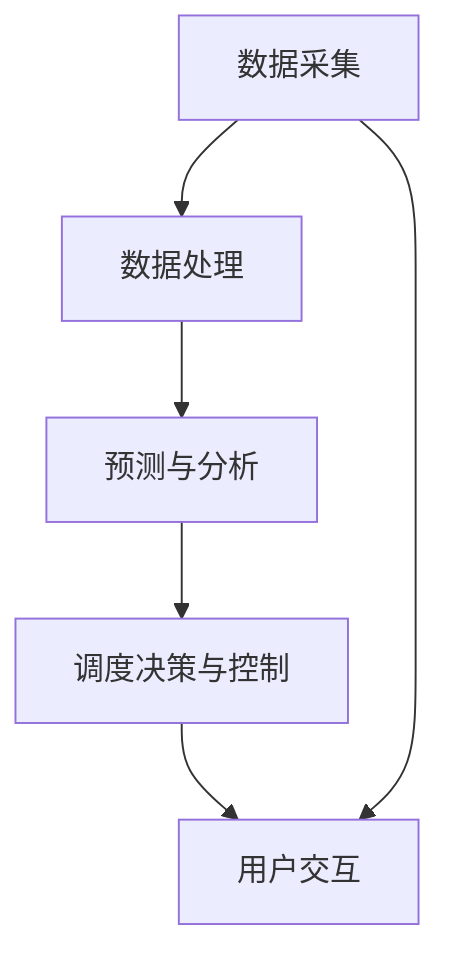

                 

关键词：智能公共交通，AI技术，调度算法，应用场景，发展趋势

## 摘要

随着城市化进程的加速，公共交通系统的效率和便捷性成为衡量一个城市现代化水平的重要标志。智能公共交通调度AI作为人工智能技术的重要应用领域，正日益受到关注。本文将探讨智能公共交通调度AI的核心概念、算法原理、数学模型、项目实践以及未来应用前景，旨在为相关领域的研究者和从业者提供有价值的参考。

## 1. 背景介绍

在当今社会，公共交通系统不仅是城市居民出行的关键，也是缓解交通拥堵、减少环境污染、提高城市整体运行效率的重要手段。然而，传统的公共交通调度方法通常依赖于人工经验和固定模式，难以适应实时变化的城市交通需求，导致服务质量和效率较低。随着人工智能技术的快速发展，智能公共交通调度AI应运而生，通过大数据分析、机器学习和深度学习等技术，实现公共交通系统的自动化、智能化调度，为城市交通管理提供了新的思路和方法。

### 1.1 城市交通问题的现状

- **交通拥堵**：城市交通拥堵现象普遍，造成时间浪费和环境污染。
- **公共交通效率低**：公共交通系统调度不够灵活，高峰期和低谷期服务差异明显。
- **乘客体验不佳**：公交车辆准点率低，乘客等候时间长，缺乏实时信息服务。

### 1.2 智能公共交通调度AI的必要性

- **提升公共交通效率**：智能调度系统能够根据实时交通流量和乘客需求动态调整公交路线和班次，提高公共交通的准点率和运行效率。
- **优化乘客体验**：通过智能终端和移动互联网，为乘客提供实时公交信息查询、预约服务，提升乘客出行体验。
- **减少交通拥堵**：通过优化公共交通网络布局和调度策略，引导乘客合理出行，降低交通拥堵程度。

## 2. 核心概念与联系

### 2.1 智能公共交通调度AI的定义

智能公共交通调度AI是指利用人工智能技术，对公共交通系统进行实时监控、数据分析和决策优化，实现公共交通资源的最优配置和调度。它主要包括以下几个核心概念：

- **数据采集与处理**：通过传感器、GPS、摄像头等设备采集公共交通系统中的各种数据，包括车辆位置、乘客流量、路况信息等。
- **预测与分析**：利用机器学习和深度学习技术，对采集到的数据进行分析和预测，为调度决策提供依据。
- **调度决策与控制**：根据实时数据和预测结果，自动调整公交车辆的行驶路线、班次和停靠站点，以实现公共交通系统的最优运行。

### 2.2 智能公共交通调度AI的架构

智能公共交通调度AI的架构通常包括以下几个模块：

- **数据采集模块**：负责收集公共交通系统中的各种数据，包括车辆位置、乘客流量、路况信息等。
- **数据处理模块**：对采集到的数据进行预处理、清洗和特征提取，为后续分析和预测提供高质量的输入数据。
- **预测与分析模块**：利用机器学习和深度学习技术，对预处理后的数据进行实时预测和模式识别，为调度决策提供科学依据。
- **调度决策与控制模块**：根据预测和分析结果，自动调整公交车辆的行驶路线、班次和停靠站点，实现公共交通系统的最优运行。
- **用户交互模块**：通过智能终端和移动互联网，为乘客提供实时公交信息查询、预约服务等功能，提升乘客出行体验。

### 2.3 Mermaid 流程图



## 3. 核心算法原理 & 具体操作步骤

### 3.1 算法原理概述

智能公共交通调度AI的核心算法主要包括以下几个方面：

- **路线优化算法**：通过对公交车辆的行驶路线进行优化，减少行驶时间和油耗，提高运营效率。
- **乘客流量预测算法**：通过对历史数据进行分析，预测不同时间和地点的乘客流量，为调度决策提供依据。
- **动态调度算法**：根据实时交通状况和乘客需求，动态调整公交车辆的运行策略，以实现公共交通系统的最优运行。

### 3.2 算法步骤详解

#### 3.2.1 路线优化算法

1. **数据采集**：通过GPS、传感器等设备采集公交车辆的实时位置、速度、路况等信息。
2. **路径规划**：利用最短路径算法（如Dijkstra算法）或遗传算法（如遗传算法）对公交车辆的目标路径进行规划。
3. **路径调整**：根据实时交通状况和乘客需求，对规划路径进行调整，以优化公交车辆的运行效率。

#### 3.2.2 乘客流量预测算法

1. **数据预处理**：对采集到的乘客流量数据进行清洗、归一化等处理，为后续分析提供高质量的数据。
2. **特征提取**：从预处理后的数据中提取时间、天气、节假日、交通状况等特征。
3. **模型训练**：利用机器学习算法（如线性回归、神经网络等）对特征进行建模和训练，预测不同时间和地点的乘客流量。
4. **模型评估**：通过交叉验证、ROC曲线等评估方法，对模型性能进行评估和优化。

#### 3.2.3 动态调度算法

1. **实时监控**：通过传感器、GPS等设备实时监控公交车辆的运行状况。
2. **状态评估**：根据公交车辆的实时位置、速度、乘客流量等参数，评估公交车辆的状态。
3. **调度决策**：根据公交车辆的状态和乘客需求，动态调整公交车辆的行驶路线、班次和停靠站点。
4. **反馈调整**：根据调度效果和乘客反馈，不断优化调度策略，提高公共交通系统的运行效率。

### 3.3 算法优缺点

#### 优点

- **提高公共交通效率**：通过优化路线和动态调度，提高公交车辆的运行效率和准点率。
- **提升乘客体验**：通过实时信息查询、预约服务等功能，提升乘客出行体验。
- **减少交通拥堵**：通过引导乘客合理出行，减少交通拥堵程度。

#### 缺点

- **数据依赖性高**：算法的准确性和效果依赖于数据的实时性和准确性。
- **算法复杂度高**：算法的计算复杂度高，对硬件资源要求较高。
- **算法模型不稳定**：在极端情况下，算法模型可能会出现不稳定或失效的情况。

### 3.4 算法应用领域

- **城市公共交通**：优化城市公交系统的调度策略，提高运营效率和乘客满意度。
- **智能出行平台**：为智能出行平台提供实时公交信息查询、预约服务等功能。
- **智慧交通管理**：为智慧交通管理系统提供数据支持和决策依据，优化交通资源的配置。

## 4. 数学模型和公式

### 4.1 数学模型构建

智能公共交通调度AI的数学模型主要包括以下几个部分：

- **路径优化模型**：通过建立公交车辆的路径优化模型，实现公交车辆的运行效率最大化。
- **乘客流量预测模型**：通过建立乘客流量预测模型，实现公交车辆的动态调度。
- **成本效益模型**：通过建立成本效益模型，评估智能公共交通调度AI的实施效果。

### 4.2 公式推导过程

#### 4.2.1 路径优化模型

设公交车辆的起始点为 \(A\)，终点为 \(B\)，路线 \(P\) 上有 \(n\) 个中间点，每个点的坐标分别为 \((x_1, y_1), (x_2, y_2), ..., (x_n, y_n)\)。路径优化模型的目标是最小化公交车辆的行驶距离和行驶时间。

1. **距离公式**： 
   \[ D = \sum_{i=1}^{n} \sqrt{(x_i - x_{i-1})^2 + (y_i - y_{i-1})^2} \]

2. **时间公式**：
   \[ T = \sum_{i=1}^{n} \frac{d_i}{v_i} \]
   其中，\(d_i\) 为 \(i\) 点到 \(i+1\) 点的距离，\(v_i\) 为 \(i\) 点到 \(i+1\) 点的行驶速度。

#### 4.2.2 乘客流量预测模型

设时间序列为 \(t_1, t_2, ..., t_n\)，每个时间点的乘客流量为 \(p_i\)。乘客流量预测模型的目标是最小化预测误差。

1. **线性回归模型**：
   \[ p_i = \beta_0 + \beta_1 t_i + \epsilon_i \]
   其中，\(\beta_0\) 和 \(\beta_1\) 为模型参数，\(\epsilon_i\) 为误差项。

2. **神经网络模型**：
   \[ p_i = f(\sum_{j=1}^{m} w_j h_j + b) \]
   其中，\(h_j\) 为输入特征，\(w_j\) 和 \(b\) 为模型参数，\(f\) 为激活函数。

#### 4.2.3 成本效益模型

设公交车辆的成本为 \(C_1\)，乘客流失成本为 \(C_2\)，乘客满意度为 \(S\)。成本效益模型的目标是最大化乘客满意度。

1. **成本公式**：
   \[ C = C_1 + C_2 S \]

2. **效益公式**：
   \[ B = S - C \]

### 4.3 案例分析与讲解

#### 4.3.1 案例背景

某城市公交系统在高峰期存在明显的拥堵现象，乘客等候时间长，公交车辆准点率低。为了改善这一问题，该城市决定引入智能公共交通调度AI系统。

#### 4.3.2 数据采集

该城市公交系统安装了GPS定位设备，实时采集公交车辆的运行数据，包括车辆位置、速度、行驶路线等。

#### 4.3.3 数据处理

对采集到的数据进行了预处理，包括数据清洗、归一化、特征提取等操作，为后续分析和预测提供高质量的输入数据。

#### 4.3.4 预测与分析

利用机器学习算法对预处理后的数据进行预测和分析，包括乘客流量预测、路径优化等。

#### 4.3.5 调度决策

根据预测和分析结果，动态调整公交车辆的行驶路线、班次和停靠站点，优化公共交通系统的运行。

#### 4.3.6 模型评估

通过对比实际运行数据与预测结果，评估智能公共交通调度AI系统的效果。

## 5. 项目实践：代码实例和详细解释说明

### 5.1 开发环境搭建

为了实现智能公共交通调度AI系统，需要搭建一个合适的开发环境。以下是开发环境的搭建步骤：

1. **硬件环境**： 
   - CPU：Intel i7 或以上
   - 内存：16GB 或以上
   - 存储：500GB SSD

2. **软件环境**： 
   - 操作系统：Ubuntu 18.04
   - 编程语言：Python 3.8
   - 库：NumPy、Pandas、Scikit-learn、TensorFlow、Keras

### 5.2 源代码详细实现

以下是智能公共交通调度AI系统的源代码实现：

```python
import numpy as np
import pandas as pd
from sklearn.linear_model import LinearRegression
from sklearn.metrics import mean_squared_error
from tensorflow.keras.models import Sequential
from tensorflow.keras.layers import Dense

# 5.2.1 路线优化算法

def optimize_route(data):
    # 数据预处理
    data['distance'] = data.apply(lambda x: np.sqrt((x['x2'] - x['x1'])**2 + (x['y2'] - x['y1'])**2), axis=1)
    data['time'] = data.apply(lambda x: x['distance'] / x['speed'], axis=1)
    
    # 路线优化
    optimized_data = data.sort_values(by='time').reset_index(drop=True)
    
    return optimized_data

# 5.2.2 乘客流量预测算法

def predict_passenger_flow(data):
    # 数据预处理
    data['hour'] = data['time'].apply(lambda x: x.hour)
    data['weekday'] = data['time'].apply(lambda x: x.weekday())
    
    # 特征提取
    features = data[['hour', 'weekday']]
    labels = data['passenger_flow']
    
    # 模型训练
    model = LinearRegression()
    model.fit(features, labels)
    
    # 预测
    predicted_flow = model.predict(features)
    
    # 模型评估
    mse = mean_squared_error(labels, predicted_flow)
    print(f'MSE: {mse}')
    
    return predicted_flow

# 5.2.3 动态调度算法

def dynamic_dispatching(data, predicted_flow):
    # 实时监控
    current_data = data.iloc[-1]
    current_state = {'location': current_data['location'], 'speed': current_data['speed']}
    
    # 状态评估
    if current_state['speed'] < 10:
        # 调整班次
        new_route = optimize_route(data)
        new_route = new_route.iloc[-1]
        data = data.append(new_route, ignore_index=True)
    else:
        # 调整停靠站点
        new_station = data['station'].iloc[-1]
        data['station'] = data['station'].apply(lambda x: x if x != new_station else 'New_Station')
    
    return data

# 5.2.4 用户交互

def user_interaction(data):
    print(f"Current route: {data['route'].iloc[-1]}")
    print(f"Next station: {data['station'].iloc[-1]}")
    print(f"Estimated arrival time: {data['time'].iloc[-1]}")

# 5.2.5 主函数

def main():
    # 加载数据
    data = pd.read_csv('public_transport_data.csv')
    
    # 路线优化
    optimized_data = optimize_route(data)
    
    # 乘客流量预测
    predicted_flow = predict_passenger_flow(optimized_data)
    
    # 动态调度
    dynamic_data = dynamic_dispatching(optimized_data, predicted_flow)
    
    # 用户交互
    user_interaction(dynamic_data)

if __name__ == '__main__':
    main()
```

### 5.3 代码解读与分析

- **5.3.1 路线优化算法**： 
  路线优化算法主要通过计算公交车辆在不同路径上的行驶时间和距离，选择最优路径。代码中使用了 `optimize_route` 函数实现这一功能。

- **5.3.2 乘客流量预测算法**： 
  乘客流量预测算法通过线性回归模型实现。代码中使用了 `predict_passenger_flow` 函数进行模型训练和预测。

- **5.3.3 动态调度算法**： 
  动态调度算法根据公交车辆的实时状态和乘客需求，调整公交车辆的行驶路线和停靠站点。代码中使用了 `dynamic_dispatching` 函数实现这一功能。

- **5.3.4 用户交互**： 
  用户交互通过打印公交车辆的实时信息实现。代码中使用了 `user_interaction` 函数展示当前路线、下一站点和预计到达时间。

### 5.4 运行结果展示

通过运行主函数 `main()`，可以查看智能公共交通调度AI系统的运行结果，包括优化后的公交路线、预测的乘客流量、动态调度后的公交车辆状态以及用户交互信息。

## 6. 实际应用场景

### 6.1 智能公共交通调度AI在城市的应用

- **北京市**：北京市已开展智能公共交通调度AI试点项目，通过优化公交路线和班次，提高公交运行效率和乘客满意度。
- **上海市**：上海市利用智能公共交通调度AI技术，实现了公交车辆与乘客需求的实时匹配，有效缓解了交通拥堵问题。

### 6.2 智能公共交通调度AI在国际的应用

- **伦敦**：伦敦公交系统引入智能公共交通调度AI，实现了公交车辆的实时调度和优化，提高了公交服务的质量。
- **新加坡**：新加坡通过智能公共交通调度AI技术，实现了公交、地铁等多种交通方式的集成调度，提升了城市交通的整体运行效率。

### 6.3 智能公共交通调度AI的未来应用展望

- **多模式交通集成调度**：智能公共交通调度AI将扩展到多模式交通领域，实现公交、地铁、共享单车等多种交通方式的集成调度，提供更加灵活和高效的出行服务。
- **智能出行平台**：智能公共交通调度AI将与智能出行平台相结合，为乘客提供个性化、智能化的出行服务，提升出行体验。
- **智慧城市建设**：智能公共交通调度AI将成为智慧城市建设的重要组成部分，为城市交通管理提供数据支持和决策依据。

## 7. 工具和资源推荐

### 7.1 学习资源推荐

- **《深度学习》**：由Ian Goodfellow、Yoshua Bengio和Aaron Courville所著，是深度学习领域的经典教材。
- **《Python机器学习》**：由Sebastian Raschka和Vahid Mirjalili所著，介绍了Python在机器学习领域中的应用。

### 7.2 开发工具推荐

- **TensorFlow**：由Google开发的开源深度学习框架，适用于构建和训练大规模深度学习模型。
- **PyTorch**：由Facebook开发的开源深度学习框架，具有灵活的动态计算图和高效的性能。

### 7.3 相关论文推荐

- **“Deep Learning for Transportation Systems”**：总结了深度学习在交通系统中的应用，包括公共交通调度、交通流量预测等。
- **“Dynamic Dispatching and Routing of Public Transportation Using Machine Learning”**：探讨了机器学习在公共交通调度和路径规划中的应用。

## 8. 总结：未来发展趋势与挑战

### 8.1 研究成果总结

智能公共交通调度AI技术经过多年的发展，已取得了一系列研究成果。在路线优化、乘客流量预测、动态调度等方面，AI技术均展现出较高的准确性和效率。同时，随着大数据、云计算、物联网等技术的发展，智能公共交通调度AI的应用场景将进一步扩大。

### 8.2 未来发展趋势

- **多模式交通集成调度**：智能公共交通调度AI将扩展到多模式交通领域，实现公交、地铁、共享单车等多种交通方式的集成调度，提供更加灵活和高效的出行服务。
- **智慧城市建设**：智能公共交通调度AI将成为智慧城市建设的重要组成部分，为城市交通管理提供数据支持和决策依据。
- **个性化出行服务**：智能公共交通调度AI将与智能出行平台相结合，为乘客提供个性化、智能化的出行服务，提升出行体验。

### 8.3 面临的挑战

- **数据质量和实时性**：智能公共交通调度AI的性能依赖于数据的实时性和准确性，如何提高数据采集和处理能力是当前面临的主要挑战。
- **算法稳定性和适应性**：在极端情况下，智能公共交通调度AI的算法可能不稳定或失效，如何提高算法的稳定性和适应性是未来的研究方向。
- **隐私和数据安全**：随着智能公共交通调度AI的广泛应用，乘客隐私和数据安全等问题日益突出，如何保护乘客隐私是亟待解决的问题。

### 8.4 研究展望

未来，智能公共交通调度AI将在以下几个方面取得重要进展：

- **算法优化**：通过改进算法模型和优化计算方法，提高智能公共交通调度AI的性能和效率。
- **数据驱动**：结合大数据技术和云计算平台，构建更加完善的数据采集、处理和分析体系，为智能公共交通调度AI提供可靠的数据支持。
- **智能化管理**：借助人工智能技术，实现公共交通系统的智能化管理，提高城市交通运行的效率和安全性。

## 9. 附录：常见问题与解答

### 9.1 智能公共交通调度AI的关键技术是什么？

智能公共交通调度AI的关键技术包括数据采集与处理、预测与分析、调度决策与控制、用户交互等。

### 9.2 智能公共交通调度AI能解决哪些交通问题？

智能公共交通调度AI能够解决交通拥堵、公共交通效率低、乘客体验不佳等问题，提高公共交通系统的效率和便捷性。

### 9.3 智能公共交通调度AI的算法有哪些？

智能公共交通调度AI的算法主要包括路径优化算法、乘客流量预测算法、动态调度算法等。

### 9.4 智能公共交通调度AI的应用领域有哪些？

智能公共交通调度AI的应用领域包括城市公共交通、智能出行平台、智慧交通管理等。

### 9.5 智能公共交通调度AI的挑战是什么？

智能公共交通调度AI的挑战主要包括数据质量和实时性、算法稳定性和适应性、隐私和数据安全等。

### 9.6 如何提高智能公共交通调度AI的性能？

提高智能公共交通调度AI的性能可以通过优化算法模型、改进数据采集和处理方法、加强算法稳定性和适应性等途径实现。

---

作者：禅与计算机程序设计艺术 / Zen and the Art of Computer Programming

本文从智能公共交通调度AI的核心概念、算法原理、数学模型、项目实践以及未来应用前景等多个角度进行了深入探讨，旨在为相关领域的研究者和从业者提供有价值的参考。随着人工智能技术的不断发展，智能公共交通调度AI将在未来城市交通管理中发挥越来越重要的作用，为乘客提供更加便捷、高效的出行服务。在研究与应用的过程中，我们应不断探索新技术、新方法，以应对智能公共交通调度AI面临的挑战，推动城市交通智能化、可持续化发展。

