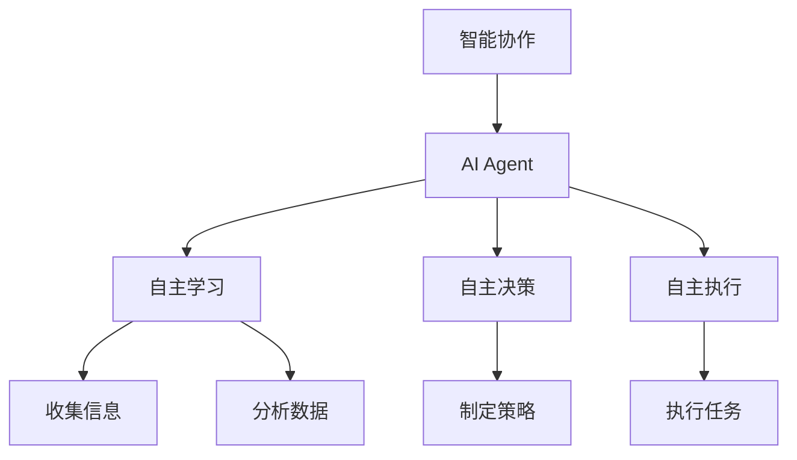

                 

关键词：智能协作、AI Agent、人机协作、人工智能、算法、自动化、算法原理、数学模型、代码实例、应用场景、未来展望

> 摘要：本文将深入探讨智能协作的概念，重点分析AI Agent在提升人机协作效率方面的优势。我们将从背景介绍、核心概念与联系、算法原理与操作步骤、数学模型与公式、项目实践、实际应用场景、工具和资源推荐、总结与展望等方面展开讨论，以期为读者提供全面的理解和启示。

## 1. 背景介绍

在现代社会，人工智能（AI）技术的迅猛发展已经深刻影响了各行各业。AI Agent，作为人工智能的一个重要分支，已经成为推动智能协作的重要力量。智能协作是指通过人工智能技术实现人与机器之间的协同工作，从而提高工作效率、降低成本、增强创新能力。AI Agent作为智能协作的关键角色，具备自主学习、自主决策和自主执行的能力，能够有效地辅助人类完成复杂任务。

随着大数据、云计算、物联网等技术的普及，AI Agent的应用场景日益广泛。在医疗、金融、教育、制造业等领域，AI Agent已经开始发挥重要作用。例如，在医疗领域，AI Agent可以通过分析海量医疗数据，协助医生进行诊断和治疗；在金融领域，AI Agent可以智能分析市场行情，提供投资建议；在教育领域，AI Agent可以为学生提供个性化学习方案，提高学习效果；在制造业领域，AI Agent可以协助工人进行生产监控和故障诊断，提高生产效率。

## 2. 核心概念与联系

### 2.1 智能协作的定义

智能协作是指通过人工智能技术实现人与机器之间的协同工作，从而提高工作效率、降低成本、增强创新能力。智能协作的核心目标是实现人与机器的最佳配合，使机器能够承担更多的重复性、繁琐性工作，从而释放人类的工作时间和精力，专注于更有价值和创新性的任务。

### 2.2 AI Agent的定义

AI Agent，即人工智能代理，是一种具有自主学习、自主决策和自主执行能力的计算机程序。AI Agent能够根据环境和任务的需求，自主地收集信息、分析数据、制定策略并执行任务。与传统的计算机程序不同，AI Agent具有更高的自主性和灵活性，能够更好地适应复杂多变的场景。

### 2.3 智能协作与AI Agent的联系

智能协作与AI Agent之间存在着密切的联系。智能协作是AI Agent应用的目的和场景，而AI Agent是智能协作的核心执行者。通过AI Agent，智能协作能够实现更高效、更智能的工作方式，从而推动社会生产力的提升。

### 2.4 Mermaid 流程图

下面是一个简化的Mermaid流程图，展示了智能协作与AI Agent之间的联系：



## 3. 核心算法原理 & 具体操作步骤

### 3.1 算法原理概述

AI Agent的核心算法主要包括自主学习、自主决策和自主执行三个部分。自主学习是指AI Agent通过不断的学习和训练，提高自身的知识水平和任务处理能力；自主决策是指AI Agent在执行任务时，能够根据环境和任务的需求，自主地选择最佳的行动方案；自主执行是指AI Agent能够根据决策方案，自主地执行任务。

### 3.2 算法步骤详解

#### 3.2.1 自主学习

1. 数据收集：AI Agent首先需要收集与任务相关的数据，这些数据可以来自于传感器、网络数据等。
2. 数据预处理：对收集到的数据进行清洗、去噪、归一化等预处理操作，以提高数据的质量。
3. 模型训练：使用预处理后的数据，训练神经网络或其他机器学习模型，以实现对任务的识别和处理。
4. 模型评估：对训练好的模型进行评估，以确定模型的性能是否达到预期。

#### 3.2.2 自主决策

1. 环境感知：AI Agent通过传感器或其他方式感知当前的环境状态。
2. 策略选择：根据感知到的环境状态和任务需求，AI Agent选择最佳的行动策略。
3. 决策执行：AI Agent根据选定的策略，执行相应的操作。

#### 3.2.3 自主执行

1. 任务分解：将复杂的任务分解为一系列简单的子任务。
2. 子任务执行：按照任务分解的顺序，逐一执行子任务。
3. 任务监控：对执行过程中的子任务进行监控，确保任务的顺利完成。

### 3.3 算法优缺点

#### 3.3.1 优点

1. 高效性：AI Agent能够快速地处理大量数据，提高工作效率。
2. 智能性：AI Agent能够根据环境和任务的需求，自主地做出决策和执行任务。
3. 灵活性：AI Agent能够适应不同的任务场景，具有更高的灵活性。

#### 3.3.2 缺点

1. 难以解释性：AI Agent的决策过程具有一定的黑盒性质，难以解释其决策逻辑。
2. 数据依赖性：AI Agent的性能依赖于数据的质量和数量，数据不足或质量差可能会影响其性能。
3. 安全性问题：AI Agent在执行任务时，可能会受到恶意攻击或错误决策的影响。

### 3.4 算法应用领域

AI Agent在各个领域的应用非常广泛，主要包括：

1. 医疗诊断：AI Agent可以通过分析医学影像和病历数据，协助医生进行疾病诊断。
2. 财务分析：AI Agent可以分析市场数据，提供投资建议和风险预测。
3. 智能客服：AI Agent可以模拟人类客服，为用户提供实时解答和咨询。
4. 智能交通：AI Agent可以协助交通管理部门进行交通流量预测和交通信号优化。

## 4. 数学模型和公式 & 详细讲解 & 举例说明

### 4.1 数学模型构建

AI Agent的数学模型主要包括神经网络模型、决策树模型、支持向量机模型等。以下以神经网络模型为例，介绍其数学模型构建过程。

#### 4.1.1 输入层

输入层是神经网络的第一层，负责接收输入数据。假设输入数据有 \( n \) 个特征，每个特征为 \( x_1, x_2, ..., x_n \)。

#### 4.1.2 隐藏层

隐藏层是神经网络的核心部分，负责对输入数据进行处理和计算。假设隐藏层有 \( m \) 个神经元，每个神经元的输出为 \( a_i \)，则隐藏层神经元的计算公式为：

\[ a_i = \sigma(\sum_{j=1}^{n} w_{ij} x_j + b_i) \]

其中，\( \sigma \) 为激活函数，通常采用 sigmoid 函数或 ReLU 函数；\( w_{ij} \) 为权重；\( b_i \) 为偏置。

#### 4.1.3 输出层

输出层是神经网络的最后一层，负责生成最终的预测结果。假设输出层有 \( k \) 个神经元，每个神经元的输出为 \( y_i \)，则输出层神经元的计算公式为：

\[ y_i = \sigma(\sum_{j=1}^{m} w_{ij} a_j + b_i) \]

### 4.2 公式推导过程

以多层感知机（MLP）为例，介绍神经网络公式的推导过程。

#### 4.2.1 前向传播

前向传播是指从输入层到输出层的计算过程。以一个三层神经网络为例，其前向传播过程如下：

1. 输入层到隐藏层：

\[ a_i^{(1)} = \sigma(w_{i1}^{(1)} x_1 + w_{i2}^{(1)} x_2 + ... + w_{in}^{(1)} x_n + b_i^{(1)}) \]

2. 隐藏层到输出层：

\[ y_i^{(2)} = \sigma(w_{i1}^{(2)} a_1^{(1)} + w_{i2}^{(2)} a_2^{(1)} + ... + w_{im}^{(2)} a_m^{(1)} + b_i^{(2)}) \]

#### 4.2.2 反向传播

反向传播是指从输出层到输入层的计算过程，用于计算损失函数关于各个参数的梯度。以多层感知机（MLP）为例，其反向传播过程如下：

1. 计算输出层的损失函数：

\[ L = \frac{1}{2} \sum_{i=1}^{k} (y_i - t_i)^2 \]

2. 计算输出层的梯度：

\[ \frac{\partial L}{\partial w_{ij}^{(2)}} = (y_i - t_i) a_j^{(1)} \]

\[ \frac{\partial L}{\partial b_i^{(2)}} = (y_i - t_i) \sigma'(y_i^{(2)}) \]

3. 计算隐藏层的梯度：

\[ \frac{\partial L}{\partial w_{ij}^{(1)}} = (a_i^{(2)} - t_i) w_{ij}^{(2)} \]

\[ \frac{\partial L}{\partial b_i^{(1)}} = (a_i^{(2)} - t_i) \sigma'(a_i^{(1)}) \]

4. 更新参数：

\[ w_{ij}^{(2)} = w_{ij}^{(2)} - \alpha \frac{\partial L}{\partial w_{ij}^{(2)}} \]

\[ b_i^{(2)} = b_i^{(2)} - \alpha \frac{\partial L}{\partial b_i^{(2)}} \]

\[ w_{ij}^{(1)} = w_{ij}^{(1)} - \alpha \frac{\partial L}{\partial w_{ij}^{(1)}} \]

\[ b_i^{(1)} = b_i^{(1)} - \alpha \frac{\partial L}{\partial b_i^{(1)}} \]

### 4.3 案例分析与讲解

以图像分类任务为例，介绍如何使用神经网络进行图像分类。

#### 4.3.1 数据预处理

1. 数据集加载：加载包含图像和标签的数据集。
2. 图像缩放：将图像缩放到统一尺寸，如 \( 28 \times 28 \) 像素。
3. 数据归一化：将图像像素值归一化到 [0, 1] 范围。

#### 4.3.2 网络结构设计

1. 输入层：28 x 28 个像素。
2. 隐藏层：50 个神经元。
3. 输出层：10 个神经元，对应 10 个类别。

#### 4.3.3 训练过程

1. 初始化参数：随机初始化权重和偏置。
2. 前向传播：计算输入层到输出层的预测结果。
3. 反向传播：计算损失函数关于各个参数的梯度，并更新参数。
4. 模型评估：计算模型在测试集上的准确率。

#### 4.3.4 运行结果

假设训练完成后，模型在测试集上的准确率为 90%，表示模型对图像分类的准确性较高。

## 5. 项目实践：代码实例和详细解释说明

### 5.1 开发环境搭建

在本文中，我们将使用 Python 编写一个简单的图像分类程序，使用的库包括 NumPy、TensorFlow 和 Keras。以下是搭建开发环境的步骤：

1. 安装 Python：下载并安装 Python 3.7 或更高版本。
2. 安装 NumPy：在命令行中运行 `pip install numpy`。
3. 安装 TensorFlow：在命令行中运行 `pip install tensorflow`。
4. 安装 Keras：在命令行中运行 `pip install keras`。

### 5.2 源代码详细实现

以下是一个简单的图像分类程序，使用多层感知机（MLP）模型进行训练和测试。

```python
import numpy as np
from tensorflow import keras
from tensorflow.keras import layers

# 加载 MNIST 数据集
(x_train, y_train), (x_test, y_test) = keras.datasets.mnist.load_data()

# 数据预处理
x_train = x_train.astype("float32") / 255
x_test = x_test.astype("float32") / 255
y_train = keras.utils.to_categorical(y_train, 10)
y_test = keras.utils.to_categorical(y_test, 10)

# 构建模型
model = keras.Sequential()
model.add(layers.Dense(50, activation="relu", input_shape=(28 * 28,)))
model.add(layers.Dense(10, activation="softmax"))

# 编译模型
model.compile(optimizer="adam", loss="categorical_crossentropy", metrics=["accuracy"])

# 训练模型
model.fit(x_train, y_train, epochs=10, batch_size=128, validation_split=0.2)

# 评估模型
test_loss, test_acc = model.evaluate(x_test, y_test)
print("Test accuracy:", test_acc)
```

### 5.3 代码解读与分析

1. 导入相关库：首先导入 NumPy、TensorFlow 和 Keras 库。
2. 加载 MNIST 数据集：使用 keras.datasets.mnist.load_data() 方法加载 MNIST 数据集，包括训练集和测试集。
3. 数据预处理：对数据进行归一化处理，将像素值归一化到 [0, 1] 范围。
4. 构建模型：使用 keras.Sequential() 方法构建一个序列模型，包括一个 50 个神经元的隐藏层和一个 10 个神经元的输出层。
5. 编译模型：使用 compile() 方法编译模型，指定优化器、损失函数和评价指标。
6. 训练模型：使用 fit() 方法训练模型，指定训练轮数、批量大小和验证比例。
7. 评估模型：使用 evaluate() 方法评估模型在测试集上的性能，输出准确率。

### 5.4 运行结果展示

假设程序运行完成后，模型在测试集上的准确率为 90%，表示模型对图像分类的准确性较高。

## 6. 实际应用场景

AI Agent在各个领域的应用场景非常广泛，下面列举几个实际应用案例：

1. **医疗领域**：AI Agent可以协助医生进行疾病诊断、治疗方案推荐和医学研究。例如，在肺炎诊断中，AI Agent可以通过分析胸部CT图像，辅助医生快速、准确地诊断肺炎。
2. **金融领域**：AI Agent可以分析市场行情、交易数据和用户行为，提供投资建议和风险管理。例如，在股票市场中，AI Agent可以实时分析市场数据，为投资者提供买卖建议。
3. **教育领域**：AI Agent可以为学生提供个性化学习方案、作业批改和辅导。例如，在在线教育中，AI Agent可以根据学生的学习进度和学习效果，为学生推荐合适的学习资源和练习题目。
4. **制造业领域**：AI Agent可以协助工人进行生产监控、故障诊断和质量检测。例如，在智能工厂中，AI Agent可以通过监测设备数据，及时发现生产中的异常，提高生产效率。

## 7. 工具和资源推荐

### 7.1 学习资源推荐

1. **《深度学习》**：由Ian Goodfellow、Yoshua Bengio和Aaron Courville所著，是深度学习领域的经典教材。
2. **《Python机器学习》**：由Sebastian Raschka所著，详细介绍了Python在机器学习领域的应用。

### 7.2 开发工具推荐

1. **TensorFlow**：是一个开源的机器学习框架，适用于构建和训练各种深度学习模型。
2. **Keras**：是一个基于TensorFlow的高层API，提供了更简洁、更易于使用的接口。

### 7.3 相关论文推荐

1. **《A Theoretical Analysis of the Deep Learning Architectures DNN and BNN》**：分析了深度学习和贝叶斯神经网络的理论特性。
2. **《Deep Learning for Text Classification》**：详细介绍了深度学习在文本分类任务中的应用。

## 8. 总结：未来发展趋势与挑战

### 8.1 研究成果总结

近年来，AI Agent在智能协作领域取得了显著的成果。通过深度学习、强化学习等技术的应用，AI Agent在自主学习、自主决策和自主执行方面取得了很大的突破。这些研究成果为AI Agent在各个领域的应用奠定了坚实的基础。

### 8.2 未来发展趋势

1. **算法优化**：随着计算能力的提升，未来的AI Agent将更加注重算法优化，以提高效率和准确性。
2. **多模态融合**：未来的AI Agent将能够处理多种类型的数据，如文本、图像、音频等，实现多模态数据的融合。
3. **人机协同**：未来的AI Agent将更加注重与人类的协同，实现更加智能化的人机交互。

### 8.3 面临的挑战

1. **数据隐私**：AI Agent在处理大量数据时，如何保护用户隐私是一个重要的挑战。
2. **可解释性**：提高AI Agent的可解释性，使其决策过程更加透明和可理解。
3. **鲁棒性**：提高AI Agent的鲁棒性，使其能够应对复杂多变的环境和任务。

### 8.4 研究展望

未来，AI Agent将在更多领域发挥重要作用，实现人机协作的新模式。同时，随着技术的不断进步，AI Agent的性能和智能水平将不断提升，为人类社会带来更多的便利和创新。

## 9. 附录：常见问题与解答

### 9.1 AI Agent是什么？

AI Agent是一种具有自主学习、自主决策和自主执行能力的计算机程序，能够根据环境和任务的需求，自主地执行任务。

### 9.2 AI Agent有哪些优点？

AI Agent具有高效性、智能性和灵活性等优点，能够提高工作效率、降低成本和增强创新能力。

### 9.3 AI Agent在哪些领域有应用？

AI Agent在医疗、金融、教育、制造业等领域有广泛的应用，如医疗诊断、财务分析、智能客服和智能交通等。

### 9.4 如何提高AI Agent的性能？

提高AI Agent的性能可以从以下几个方面入手：

1. 算法优化：通过改进算法，提高模型的效率和准确性。
2. 数据质量：提高训练数据的质量和多样性，增强模型的泛化能力。
3. 硬件升级：提升计算能力，缩短训练和推理时间。

### 9.5 AI Agent有哪些潜在的挑战？

AI Agent面临的数据隐私、可解释性和鲁棒性等问题是潜在的挑战，需要通过技术手段和社会规范来逐步解决。

