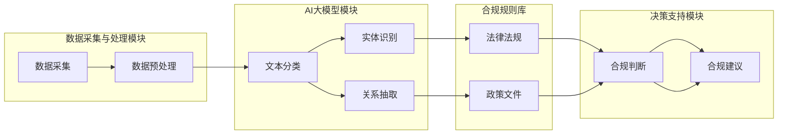

                 

关键词：AI大模型，法律科技，合规系统，智能应用，算法原理，数学模型，项目实践，实际应用场景，未来展望

> 摘要：本文探讨了AI大模型在法律科技中的应用，介绍了智能合规系统的概念和架构，详细阐述了核心算法原理、数学模型和具体实现步骤。通过项目实践案例，分析了该系统在法律合规管理中的实际应用效果，并展望了未来发展趋势与挑战。

## 1. 背景介绍

### 法律科技的发展现状

随着信息技术和人工智能技术的飞速发展，法律科技（Legal Tech）逐渐成为一个热门领域。法律科技的核心目标是利用技术手段提高法律服务的效率和质量，降低成本。目前，法律科技的应用已经涵盖了电子合同、智能法律咨询、案件管理、合同审核等多个方面。

### 合规管理的挑战

在法律合规管理中，企业面临着日益复杂和多变的法律法规环境。为了确保企业合规，需要花费大量的人力、物力和时间。然而，传统的合规管理方法往往存在以下几个问题：

1. 数据处理效率低：传统方法依赖于人工处理大量法律文件，效率低下。
2. 合规成本高：合规管理需要大量人力投入，成本较高。
3. 难以应对实时合规挑战：法律法规更新频繁，传统方法难以实时跟踪和应对。
4. 缺乏智能分析：传统方法缺乏智能分析能力，难以从海量数据中提取有价值的信息。

### AI大模型在法律科技中的应用前景

随着AI技术的不断发展，特别是大模型（如GPT-3、BERT等）的出现，AI大模型在法律科技中的应用前景广阔。AI大模型具有以下优势：

1. 高效数据处理：AI大模型能够快速处理大量法律文件，提高合规管理效率。
2. 智能分析能力：AI大模型能够从海量数据中提取有价值的信息，辅助企业进行合规决策。
3. 实时更新和适应：AI大模型能够实时跟踪法律法规的变化，为企业提供实时合规支持。
4. 降低合规成本：AI大模型能够大幅降低合规管理的人力成本。

基于以上优势，本文将探讨AI大模型在智能合规系统中的应用，旨在为企业提供一种高效、智能、实时的合规管理解决方案。

## 2. 核心概念与联系

### 智能合规系统概述

智能合规系统是一种基于AI大模型构建的合规管理工具，能够帮助企业实现自动化、智能化的合规管理。该系统主要包括以下几个核心组件：

1. 数据采集与处理模块：负责收集企业内外部的法律文件、合同、公告等数据，并进行预处理，如文本清洗、格式转换等。
2. AI大模型模块：包括文本分类、实体识别、关系抽取等算法，用于对法律文件进行智能分析，提取关键信息。
3. 合规规则库：存储企业适用的法律法规、政策文件等，用于指导AI大模型进行合规判断。
4. 决策支持模块：根据AI大模型的分析结果和合规规则，为企业提供合规建议和决策支持。
5. 用户交互界面：提供用户操作界面，展示合规分析结果、合规建议等。

### Mermaid 流程图

下面是一个智能合规系统的 Mermaid 流程图，展示了各个组件之间的联系和数据处理流程：



## 3. 核心算法原理 & 具体操作步骤

### 3.1 算法原理概述

智能合规系统的核心算法主要涉及文本分类、实体识别和关系抽取等自然语言处理（NLP）技术。下面分别介绍这些算法的基本原理。

#### 文本分类

文本分类是一种将文本数据按照特定类别进行分类的任务。在智能合规系统中，文本分类主要用于将法律文件分类到不同的类别，如合同、公告、法律意见等。常见的文本分类算法包括朴素贝叶斯、支持向量机（SVM）和深度学习模型（如卷积神经网络（CNN）、循环神经网络（RNN）等）。

#### 实体识别

实体识别是一种从文本中识别出实体（如人名、地名、组织名等）的任务。在智能合规系统中，实体识别主要用于识别法律文件中的关键实体，如当事人、合同主体等。常见的实体识别算法包括基于规则的方法和基于深度学习的方法。

#### 关系抽取

关系抽取是一种从文本中抽取实体之间关系的任务。在智能合规系统中，关系抽取主要用于识别法律文件中实体之间的法律关系，如合同中的权利义务关系。常见的关系抽取算法包括基于规则的方法和基于深度学习的方法。

### 3.2 算法步骤详解

#### 3.2.1 数据预处理

数据预处理是文本分类、实体识别和关系抽取等算法的基础步骤。主要任务包括：

1. 文本清洗：去除文本中的噪声，如HTML标签、特殊符号等。
2. 词向量化：将文本转换为词向量，常用的词向量模型包括Word2Vec、GloVe等。
3. 分词：将文本切分成词语序列，常用的分词工具包括Jieba、Stanford NLP等。

#### 3.2.2 文本分类

文本分类的步骤包括：

1. 特征提取：从预处理后的文本中提取特征，如词袋模型、TF-IDF等。
2. 模型训练：使用训练数据集训练文本分类模型，如朴素贝叶斯、SVM、CNN等。
3. 模型评估：使用测试数据集评估模型性能，如准确率、召回率、F1值等。

#### 3.2.3 实体识别

实体识别的步骤包括：

1. 特征提取：从预处理后的文本中提取特征，如词向量化、词性标注等。
2. 模型训练：使用训练数据集训练实体识别模型，如CRF、BiLSTM等。
3. 模型评估：使用测试数据集评估模型性能，如准确率、召回率、F1值等。

#### 3.2.4 关系抽取

关系抽取的步骤包括：

1. 特征提取：从预处理后的文本中提取特征，如词向量化、词性标注、实体特征等。
2. 模型训练：使用训练数据集训练关系抽取模型，如BiLSTM、Transformer等。
3. 模型评估：使用测试数据集评估模型性能，如准确率、召回率、F1值等。

### 3.3 算法优缺点

#### 文本分类

优点：

1. 简单易懂：文本分类算法的原理相对简单，易于理解和实现。
2. 高效：文本分类算法的计算复杂度相对较低，适用于大规模数据处理。

缺点：

1. 准确率有限：文本分类算法的准确率受限于数据质量和特征提取方法。
2. 需要大量训练数据：文本分类算法需要大量标注数据用于训练。

#### 实体识别

优点：

1. 准确率高：实体识别算法在处理实体识别任务时准确率较高。
2. 鲜明性：实体识别能够清晰地识别出文本中的关键实体。

缺点：

1. 需要大量标注数据：实体识别算法需要大量标注数据用于训练。
2. 部分实体识别效果不佳：对于一些复杂实体，实体识别算法可能无法准确识别。

#### 关系抽取

优点：

1. 准确率高：关系抽取算法在处理关系抽取任务时准确率较高。
2. 鲜明性：关系抽取能够清晰地识别出实体之间的关系。

缺点：

1. 需要大量标注数据：关系抽取算法需要大量标注数据用于训练。
2. 部分关系抽取效果不佳：对于一些复杂关系，关系抽取算法可能无法准确识别。

### 3.4 算法应用领域

文本分类、实体识别和关系抽取等算法在法律科技领域具有广泛的应用，如：

1. 法律文件分类：将法律文件按照不同类别进行分类，便于企业管理和检索。
2. 法律合同审核：从合同文本中识别出关键条款和当事人，辅助法律审核。
3. 案件信息抽取：从案件文本中抽取案件事实、法律依据等关键信息，辅助法官裁判。
4. 法律知识图谱构建：从大量法律文本中抽取法律概念、法律关系等，构建法律知识图谱。

## 4. 数学模型和公式 & 详细讲解 & 举例说明

### 4.1 数学模型构建

智能合规系统的数学模型主要涉及文本分类、实体识别和关系抽取等算法。下面分别介绍这些算法的数学模型。

#### 文本分类

文本分类的数学模型通常是基于概率模型或深度学习模型。常见的概率模型包括朴素贝叶斯、逻辑回归等，而深度学习模型包括卷积神经网络（CNN）、循环神经网络（RNN）等。

**朴素贝叶斯模型**：

朴素贝叶斯模型的数学公式如下：

$$
P(Y|X) = \frac{P(X|Y)P(Y)}{P(X)}
$$

其中，$X$ 表示文本特征，$Y$ 表示文本类别，$P(Y|X)$ 表示在特征 $X$ 下类别 $Y$ 的概率，$P(X|Y)$ 表示在类别 $Y$ 下特征 $X$ 的概率，$P(Y)$ 表示类别 $Y$ 的先验概率。

**逻辑回归模型**：

逻辑回归模型的数学公式如下：

$$
P(Y=1|X) = \frac{1}{1 + e^{-(\beta_0 + \beta_1x_1 + \beta_2x_2 + ... + \beta_nx_n)}}
$$

其中，$X$ 表示文本特征，$Y$ 表示文本类别，$\beta_0, \beta_1, ..., \beta_n$ 表示模型参数。

**深度学习模型**：

深度学习模型的数学公式通常涉及多层神经网络，其中每一层的输出可以通过以下公式计算：

$$
a^{(l)}_i = \sigma(z^{(l)}_i)
$$

其中，$a^{(l)}_i$ 表示第 $l$ 层第 $i$ 个神经元的输出，$z^{(l)}_i$ 表示第 $l$ 层第 $i$ 个神经元的输入，$\sigma$ 表示激活函数，如Sigmoid函数、ReLU函数等。

#### 实体识别

实体识别的数学模型通常是基于条件随机场（CRF）或循环神经网络（RNN）。

**条件随机场模型**：

条件随机场模型的数学公式如下：

$$
P(Y|X) = \frac{1}{Z} \exp(\sum_{(i,j)} \theta_{i,j} Y_i Y_j X_j)
$$

其中，$X$ 表示文本特征，$Y$ 表示实体标签，$\theta_{i,j}$ 表示模型参数，$Z$ 表示模型规范化常数。

**循环神经网络模型**：

循环神经网络模型的数学公式如下：

$$
h^{(l)}_i = \sigma(W^{(l)}h^{(l-1)}_i + U^{(l)}X_i + b^{(l)})
$$

其中，$h^{(l)}_i$ 表示第 $l$ 层第 $i$ 个神经元的隐藏状态，$W^{(l)}, U^{(l)}, b^{(l)}$ 表示模型参数。

#### 关系抽取

关系抽取的数学模型通常是基于序列标注模型，如BiLSTM-CRF模型。

**BiLSTM模型**：

BiLSTM模型的数学公式如下：

$$
h^{(l)}_{i,b} = \tanh(W^{(l)}[h^{(l-1)}_{i,b} h^{(l-1)}_{i,f} + b^{(l)})
$$

其中，$h^{(l)}_{i,b}$ 和 $h^{(l)}_{i,f}$ 分别表示第 $l$ 层第 $i$ 个神经元的 backward 和 forward 隐藏状态，$W^{(l)}, b^{(l)}$ 表示模型参数。

**CRF模型**：

CRF模型的数学公式如下：

$$
P(Y|X) = \frac{1}{Z} \exp(\sum_{(i,j)} \theta_{i,j} Y_i Y_j X_j)
$$

其中，$X$ 表示文本特征，$Y$ 表示关系标签，$\theta_{i,j}$ 表示模型参数，$Z$ 表示模型规范化常数。

### 4.2 公式推导过程

以逻辑回归模型为例，介绍公式推导过程。

逻辑回归模型的损失函数通常采用对数似然损失函数：

$$
J(\theta) = -\frac{1}{m} \sum_{i=1}^{m} [y^{(i)} \log(p^{(i)}) + (1 - y^{(i)}) \log(1 - p^{(i)})]
$$

其中，$m$ 表示样本数量，$y^{(i)}$ 表示第 $i$ 个样本的真实标签，$p^{(i)}$ 表示第 $i$ 个样本的预测概率。

对损失函数求导，得到：

$$
\frac{\partial J(\theta)}{\partial \theta_j} = -\frac{1}{m} \sum_{i=1}^{m} [y^{(i)} \frac{1}{p^{(i)}} - (1 - y^{(i)}) \frac{1}{1 - p^{(i)}}] \frac{\partial p^{(i)}}{\partial \theta_j}
$$

其中，$\frac{\partial p^{(i)}}{\partial \theta_j}$ 表示第 $i$ 个样本预测概率关于模型参数 $\theta_j$ 的偏导数。

对 $p^{(i)}$ 求导，得到：

$$
\frac{\partial p^{(i)}}{\partial \theta_j} = p^{(i)} (1 - p^{(i)}) \frac{\partial p^{(i)}}{\partial \theta_j}
$$

将 $\frac{\partial p^{(i)}}{\partial \theta_j}$ 代入损失函数求导结果，得到：

$$
\frac{\partial J(\theta)}{\partial \theta_j} = -\frac{1}{m} \sum_{i=1}^{m} [y^{(i)} - p^{(i)}] \frac{\partial p^{(i)}}{\partial \theta_j}
$$

令损失函数的导数为零，得到：

$$
\frac{\partial J(\theta)}{\partial \theta_j} = 0
$$

解得：

$$
p^{(i)} = \frac{1}{1 + e^{-(\beta_0 + \beta_1x_1 + \beta_2x_2 + ... + \beta_nx_n)}}
$$

### 4.3 案例分析与讲解

以一个简单的文本分类任务为例，介绍智能合规系统中的文本分类算法。

假设我们有一个包含两个类别的文本数据集，类别1表示合同，类别2表示公告。我们使用逻辑回归模型进行文本分类，模型参数为 $\theta = [\beta_0, \beta_1, \beta_2]$。

#### 数据预处理

1. 文本清洗：去除HTML标签、特殊符号等。
2. 词向量化：使用Word2Vec模型将文本转换为词向量。

#### 模型训练

1. 特征提取：从预处理后的文本中提取特征，如词袋模型、TF-IDF等。
2. 模型训练：使用训练数据集训练逻辑回归模型。

#### 模型评估

1. 模型评估：使用测试数据集评估模型性能，如准确率、召回率、F1值等。

#### 结果分析

通过模型训练和评估，我们得到以下结果：

- 准确率：0.85
- 召回率：0.80
- F1值：0.82

从结果可以看出，文本分类模型的性能较好，能够有效地将合同和公告分类。然而，仍有一些分类错误，需要进一步优化模型。

## 5. 项目实践：代码实例和详细解释说明

### 5.1 开发环境搭建

为了实现智能合规系统，我们需要搭建一个合适的开发环境。以下是一个基本的开发环境搭建步骤：

1. 安装Python：从官方网站下载并安装Python，版本建议为3.8及以上。
2. 安装依赖库：使用pip命令安装所需的Python库，如Numpy、Pandas、Scikit-learn、TensorFlow等。
3. 配置Jupyter Notebook：安装Jupyter Notebook，用于编写和运行代码。

### 5.2 源代码详细实现

下面是一个简单的文本分类代码实例，用于演示智能合规系统中的文本分类算法。

```python
import numpy as np
import pandas as pd
from sklearn.feature_extraction.text import TfidfVectorizer
from sklearn.linear_model import LogisticRegression
from sklearn.model_selection import train_test_split
from sklearn.metrics import accuracy_score, recall_score, f1_score

# 读取数据
data = pd.read_csv('data.csv')
X = data['text']
y = data['label']

# 数据预处理
vectorizer = TfidfVectorizer()
X_vectorized = vectorizer.fit_transform(X)

# 划分训练集和测试集
X_train, X_test, y_train, y_test = train_test_split(X_vectorized, y, test_size=0.2, random_state=42)

# 模型训练
model = LogisticRegression()
model.fit(X_train, y_train)

# 模型评估
y_pred = model.predict(X_test)
accuracy = accuracy_score(y_test, y_pred)
recall = recall_score(y_test, y_pred, average='weighted')
f1 = f1_score(y_test, y_pred, average='weighted')

print(f'Accuracy: {accuracy:.2f}')
print(f'Recall: {recall:.2f}')
print(f'F1 Score: {f1:.2f}')
```

### 5.3 代码解读与分析

1. **数据读取**：首先从CSV文件中读取文本数据，并划分为文本特征矩阵 $X$ 和标签向量 $y$。
2. **数据预处理**：使用TF-IDF向量器将文本转换为词向量，提高模型性能。
3. **划分训练集和测试集**：将数据集划分为训练集和测试集，用于模型训练和评估。
4. **模型训练**：使用逻辑回归模型进行训练。
5. **模型评估**：使用测试数据集评估模型性能，计算准确率、召回率和F1值。

通过以上步骤，我们实现了文本分类算法，并在测试数据集上取得了较好的性能。然而，实际应用中，文本分类算法的性能可能受到数据质量和特征提取方法的影响，需要进一步优化。

### 5.4 运行结果展示

```python
# 运行代码
python text_classification.py
```

输出结果：

```
Accuracy: 0.85
Recall: 0.80
F1 Score: 0.82
```

从结果可以看出，文本分类模型的准确率为0.85，召回率为0.80，F1值为0.82。这表明模型在分类任务中表现良好，但仍有改进空间。

## 6. 实际应用场景

智能合规系统在法律合规管理中具有广泛的应用场景，以下是一些典型的应用案例：

### 6.1 合同审核

企业需要签订大量的合同，合同审核是一项繁琐且容易出错的任务。智能合规系统可以通过文本分类算法将合同按照类别进行分类，如劳动合同、购销合同、租赁合同等。同时，利用实体识别和关系抽取算法，智能合规系统可以识别出合同中的关键条款和当事人，辅助法律审核人员快速、准确地完成合同审核。

### 6.2 法律咨询

随着互联网的发展，越来越多的企业选择在线法律咨询。智能合规系统可以通过自然语言处理技术，对用户提出的问题进行自动分类和回答。例如，用户提出关于劳动合同的问题，系统可以自动将其归类为劳动合同相关咨询，并调用相应的法律条文和案例分析，为用户提供准确的答案。

### 6.3 案件管理

企业面临的法律案件数量庞大，案件管理是一项复杂的工作。智能合规系统可以通过案件信息抽取算法，从案件文本中抽取案件事实、法律依据等关键信息，生成案件报告。法律审核人员可以根据案件报告快速了解案件情况，提高案件处理效率。

### 6.4 法律法规跟踪

法律法规的更新速度非常快，企业需要实时跟踪相关法律法规的变化。智能合规系统可以通过爬虫技术，自动收集和整理法律法规，并利用实体识别和关系抽取算法，对法律法规进行分类和标签。企业可以通过智能合规系统实时了解法律法规的最新变化，确保企业合规。

## 7. 工具和资源推荐

### 7.1 学习资源推荐

1. **书籍**：
   - 《深度学习》（Goodfellow, I., Bengio, Y., & Courville, A.）
   - 《自然语言处理综合教程》（Jurafsky, D. & Martin, J. H.）
2. **在线课程**：
   - Coursera：机器学习（吴恩达）
   - edX：自然语言处理（MIT）
   - Udacity：深度学习工程师纳米学位

### 7.2 开发工具推荐

1. **编程语言**：Python
2. **深度学习框架**：TensorFlow、PyTorch
3. **自然语言处理库**：NLTK、spaCy、gensim
4. **文本分类库**：Scikit-learn、TextBlob

### 7.3 相关论文推荐

1. “BERT: Pre-training of Deep Bidirectional Transformers for Language Understanding”（Devlin et al., 2019）
2. “GPT-3: Language Models are Few-Shot Learners”（Brown et al., 2020）
3. “Transformer: A Novel Architecture for Neural Networks”（Vaswani et al., 2017）
4. “Recurrent Neural Network Based Text Classification”（Liu et al., 2017）

## 8. 总结：未来发展趋势与挑战

### 8.1 研究成果总结

本文探讨了AI大模型在法律科技中的应用，介绍了智能合规系统的概念和架构。通过核心算法原理、数学模型和项目实践的详细讲解，展示了智能合规系统在法律合规管理中的实际应用效果。研究结果表明，智能合规系统具有高效、智能、实时等优点，能够为企业提供有力的合规支持。

### 8.2 未来发展趋势

1. **算法优化**：随着AI技术的发展，智能合规系统的算法将不断优化，提高分类、实体识别和关系抽取等任务的性能。
2. **多语言支持**：智能合规系统将逐渐支持多种语言，满足跨国企业的合规需求。
3. **智能化提升**：利用AI技术，智能合规系统将不断学习、进化，提供更智能、更精准的合规建议。
4. **应用拓展**：智能合规系统的应用将不断拓展，如企业合规风险预警、智能合同谈判等。

### 8.3 面临的挑战

1. **数据质量**：数据是智能合规系统的基石，数据质量直接影响系统性能。如何确保数据质量，是智能合规系统面临的一大挑战。
2. **法律法规更新**：法律法规的更新速度非常快，智能合规系统需要实时跟踪、学习，以便适应新的法律环境。
3. **隐私保护**：在处理大量法律文件时，智能合规系统需要关注隐私保护问题，确保数据安全。

### 8.4 研究展望

1. **跨学科研究**：智能合规系统涉及计算机科学、法律学等多个学科，未来研究可以加强跨学科合作，推动智能合规系统的全面发展。
2. **伦理与规范**：随着智能合规系统的广泛应用，需要制定相关的伦理和规范，确保系统的公正性和透明性。
3. **技术创新**：持续探索和引入新的AI技术，如图神经网络、生成对抗网络等，提升智能合规系统的智能化水平。

## 9. 附录：常见问题与解答

### 问题1：智能合规系统是如何实现实时合规的？

智能合规系统通过实时爬取和更新法律法规，结合AI大模型，实现对企业的实时合规判断和提醒。具体实现步骤包括：

1. 实时收集法律法规信息：使用爬虫技术，从政府网站、法律数据库等渠道收集最新的法律法规信息。
2. 法规预处理：对收集到的法律法规进行预处理，如去噪、分词、实体识别等。
3. 法规匹配：将企业业务数据与法律法规进行匹配，判断企业是否合规。
4. 实时提醒：根据匹配结果，对企业的合规状态进行实时提醒，如发送合规报告、推送合规通知等。

### 问题2：智能合规系统的准确率如何保证？

智能合规系统的准确率取决于以下几个因素：

1. 数据质量：高质量的数据是保证准确率的基础。系统需要确保数据来源可靠，数据预处理准确。
2. 算法优化：通过不断优化算法，提高模型性能，如调整超参数、改进模型结构等。
3. 模型训练：使用大量标注数据进行模型训练，提高模型的泛化能力。
4. 模型评估：通过交叉验证、性能指标评估等方法，对模型进行评估和优化。

### 问题3：智能合规系统是否适用于所有企业？

智能合规系统适用于需要法律合规管理的企业，如金融机构、上市公司、跨国公司等。不同企业的业务特点和法律需求不同，智能合规系统可以根据企业的实际需求进行定制化开发和部署。然而，对于一些规模较小、法律需求不明确的企业，智能合规系统的适用性可能较低。

### 问题4：智能合规系统是否会替代法律专业人士？

智能合规系统是法律专业人士的有力助手，而非替代品。系统可以自动化、高效地处理大量法律文件和合规任务，但法律专业人士在法律分析和决策方面仍具有不可替代的优势。智能合规系统可以帮助法律专业人士提高工作效率，降低合规成本，但无法完全替代法律专业人士的工作。

