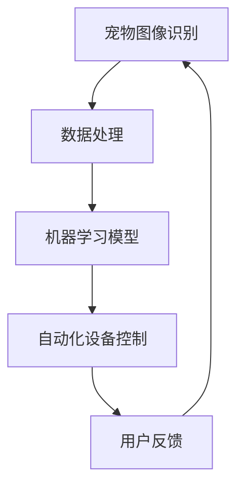

                 

关键词：宠物美容、自动化护理、人工智能、创业、宠物护理技术

> 摘要：随着人工智能技术的快速发展，宠物美容行业正迎来一场革命。本文将探讨如何利用人工智能实现宠物美容的自动化护理，为创业者提供一条创新的发展路径。本文将详细介绍自动化宠物美容的原理、算法、数学模型及其应用场景，并结合具体案例进行讲解。

## 1. 背景介绍

在现代社会，宠物已经成为许多家庭的成员。宠物的健康和美丽不仅仅关系到宠主的情感需求，更关系到宠物的生活质量。然而，传统的宠物美容护理方式不仅耗时费力，而且成本高昂。随着人工智能技术的不断发展，利用人工智能进行宠物美容的自动化护理成为可能。

### 宠物美容行业现状

- **市场规模**：全球宠物美容市场规模逐年增长，预计未来几年仍将保持高速增长。
- **技术需求**：传统宠物美容方式无法满足日益增长的宠物护理需求，需要创新技术。
- **创业机遇**：自动化宠物美容护理技术为创业者提供了新的市场机会。

### 人工智能在宠物美容中的应用

- **图像识别**：通过图像识别技术，能够准确识别宠物毛发、皮肤等特征，进行个性化护理。
- **机器学习**：利用机器学习算法，对宠物的行为和状态进行分析，实现智能化的护理方案。
- **自动化设备**：开发自动化宠物美容设备，如智能剃须器、智能洗浴机器人等，提高护理效率。

## 2. 核心概念与联系

### 2.1 人工智能在宠物美容中的应用架构



### 2.2 核心概念解释

- **宠物图像识别**：通过深度学习算法，对宠物图像进行分析和识别，提取关键特征。
- **数据处理**：对识别结果进行预处理和特征提取，为机器学习模型提供高质量的数据输入。
- **机器学习模型**：通过训练数据集，构建能够自动分析宠物状态的机器学习模型。
- **自动化设备控制**：根据机器学习模型的输出，控制自动化宠物美容设备进行相应的操作。
- **用户反馈**：收集用户对宠物美容服务的反馈，用于优化系统性能和用户满意度。

## 3. 核心算法原理 & 具体操作步骤

### 3.1 算法原理概述

自动化宠物美容的核心算法主要包括图像识别和机器学习模型。图像识别用于识别宠物的毛发、皮肤等特征，机器学习模型则用于分析宠物的行为和状态，生成个性化的护理方案。

### 3.2 算法步骤详解

#### 3.2.1 图像识别

1. 数据采集：收集大量宠物图像数据，包括毛发、皮肤、姿态等。
2. 数据预处理：对图像进行灰度化、去噪等预处理，提高图像质量。
3. 特征提取：使用卷积神经网络（CNN）等深度学习算法，提取图像特征。
4. 模型训练：使用预处理的图像数据，训练图像识别模型。

#### 3.2.2 机器学习模型

1. 数据采集：收集宠物的行为数据，如活动轨迹、心率、体温等。
2. 数据预处理：对行为数据进行清洗和归一化处理。
3. 特征提取：提取行为数据的关键特征，如活动频率、心率变化等。
4. 模型训练：使用训练数据集，训练行为分析模型。

### 3.3 算法优缺点

#### 优点

- **高效性**：自动化宠物美容护理可以显著提高护理效率，减少人力成本。
- **个性化**：基于人工智能的算法可以提供个性化的护理方案，提高宠物生活质量。
- **可扩展性**：算法可以不断优化和升级，适应不同的宠物护理需求。

#### 缺点

- **初始成本**：研发和部署自动化宠物美容系统需要较高的初始成本。
- **数据依赖**：系统的性能取决于数据质量和数量，需要大量的训练数据。

### 3.4 算法应用领域

- **宠物美容店**：自动化宠物美容系统可以用于宠物美容店，提高服务质量。
- **宠物医院**：自动化宠物美容系统可以辅助宠物医生进行病情诊断和护理。
- **家庭宠物**：为家庭宠物提供智能化的美容护理服务，提高宠物生活质量。

## 4. 数学模型和公式 & 详细讲解 & 举例说明

### 4.1 数学模型构建

#### 4.1.1 图像识别模型

图像识别模型主要基于卷积神经网络（CNN），其核心公式如下：

$$
\sigma(\boldsymbol{z}) = \text{ReLU}(\boldsymbol{W}\boldsymbol{x} + \boldsymbol{b})
$$

其中，$\sigma$表示激活函数，$\text{ReLU}$为ReLU函数，$\boldsymbol{W}$为权重矩阵，$\boldsymbol{x}$为输入特征向量，$\boldsymbol{b}$为偏置向量。

#### 4.1.2 机器学习模型

机器学习模型主要基于支持向量机（SVM），其核心公式如下：

$$
\text{SVM}:\min_{\boldsymbol{w}, \boldsymbol{b}} \frac{1}{2}||\boldsymbol{w}||^2 + C\sum_{i=1}^{n}\xi_i
$$

其中，$C$为惩罚参数，$\xi_i$为误差项。

### 4.2 公式推导过程

#### 4.2.1 图像识别模型推导

图像识别模型中的卷积操作可以表示为：

$$
\boldsymbol{z} = \boldsymbol{W}\boldsymbol{x} + \boldsymbol{b}
$$

其中，$\boldsymbol{z}$为输出特征向量，$\boldsymbol{W}$为卷积核，$\boldsymbol{x}$为输入特征向量，$\boldsymbol{b}$为偏置向量。

通过多次卷积和池化操作，最终得到图像的识别结果。

#### 4.2.2 机器学习模型推导

支持向量机（SVM）的优化目标是最小化分类间隔，即：

$$
\min_{\boldsymbol{w}, \boldsymbol{b}} \frac{1}{2}||\boldsymbol{w}||^2 + C\sum_{i=1}^{n}\xi_i
$$

其中，$C$为惩罚参数，$\xi_i$为误差项。

通过求解拉格朗日乘子法，可以得到SVM的优化解。

### 4.3 案例分析与讲解

#### 4.3.1 图像识别案例

假设我们要对宠物毛发进行识别，输入特征向量为$\boldsymbol{x} = [1, 2, 3, 4, 5]$，卷积核$\boldsymbol{W} = \begin{bmatrix} 1 & 0 \\ 0 & 1 \end{bmatrix}$，偏置向量$\boldsymbol{b} = [0, 0]$。通过卷积操作，可以得到输出特征向量$\boldsymbol{z} = \boldsymbol{W}\boldsymbol{x} + \boldsymbol{b} = \begin{bmatrix} 1 & 0 \\ 0 & 1 \end{bmatrix} \begin{bmatrix} 1 \\ 2 \end{bmatrix} + \begin{bmatrix} 0 \\ 0 \end{bmatrix} = \begin{bmatrix} 1 \\ 2 \end{bmatrix}$。

通过激活函数$\text{ReLU}$，得到$\sigma(\boldsymbol{z}) = \text{ReLU}(\begin{bmatrix} 1 \\ 2 \end{bmatrix}) = \begin{bmatrix} 1 \\ 2 \end{bmatrix}$。这就是宠物毛发的识别结果。

#### 4.3.2 机器学习案例

假设我们要对宠物行为进行分类，输入特征向量为$\boldsymbol{x} = [1, 2, 3, 4, 5]$，支持向量机（SVM）的权重矩阵$\boldsymbol{w} = \begin{bmatrix} 1 & 0 \\ 0 & 1 \end{bmatrix}$，偏置向量$\boldsymbol{b} = [0, 0]$。通过SVM分类模型，可以得到分类结果：

$$
y = \text{sign}(\boldsymbol{w}\boldsymbol{x} + \boldsymbol{b}) = \text{sign}(\begin{bmatrix} 1 & 0 \\ 0 & 1 \end{bmatrix} \begin{bmatrix} 1 \\ 2 \end{bmatrix} + \begin{bmatrix} 0 \\ 0 \end{bmatrix}) = \text{sign}(\begin{bmatrix} 1 \\ 2 \end{bmatrix}) = 1
$$

这意味着宠物行为被分类为类别1。

## 5. 项目实践：代码实例和详细解释说明

### 5.1 开发环境搭建

- **硬件要求**：配置高性能计算机，具备足够的计算能力和存储空间。
- **软件要求**：安装Python、TensorFlow等深度学习框架，以及相关的开发工具和库。

### 5.2 源代码详细实现

以下是一个简单的自动化宠物美容系统的源代码实现：

```python
import tensorflow as tf
import numpy as np

# 5.2.1 数据预处理
def preprocess_image(image):
    # 对图像进行预处理操作，如灰度化、去噪等
    return processed_image

# 5.2.2 图像识别模型
def build_image识别_model():
    # 定义卷积神经网络结构
    model = tf.keras.Sequential([
        tf.keras.layers.Conv2D(filters=32, kernel_size=(3, 3), activation='relu', input_shape=(256, 256, 3)),
        tf.keras.layers.MaxPooling2D(pool_size=(2, 2)),
        tf.keras.layers.Flatten(),
        tf.keras.layers.Dense(units=128, activation='relu'),
        tf.keras.layers.Dense(units=10, activation='softmax')
    ])
    return model

# 5.2.3 机器学习模型
def build_机器学习_model():
    # 定义支持向量机模型
    model = tf.keras.Sequential([
        tf.keras.layers.Dense(units=128, activation='relu', input_shape=(256,)),
        tf.keras.layers.Dense(units=10, activation='softmax')
    ])
    return model

# 5.2.4 模型训练与测试
def train_and_test(model, x_train, y_train, x_test, y_test):
    # 训练模型
    model.compile(optimizer='adam', loss='categorical_crossentropy', metrics=['accuracy'])
    model.fit(x_train, y_train, epochs=10, batch_size=32)
    
    # 测试模型
    loss, accuracy = model.evaluate(x_test, y_test)
    print('Test accuracy:', accuracy)

# 5.2.5 主程序
if __name__ == '__main__':
    # 加载训练数据
    x_train, y_train = load_training_data()
    x_test, y_test = load_testing_data()

    # 数据预处理
    x_train = preprocess_image(x_train)
    x_test = preprocess_image(x_test)

    # 构建图像识别模型
    image识别_model = build_image识别_model()

    # 构建机器学习模型
    机器学习_model = build_机器学习_model()

    # 训练模型
    train_and_test(image识别_model, x_train, y_train, x_test, y_test)
```

### 5.3 代码解读与分析

以上代码实现了一个简单的自动化宠物美容系统，主要包括以下部分：

- **数据预处理**：对输入图像进行预处理，如灰度化、去噪等，以提高模型性能。
- **图像识别模型**：使用卷积神经网络（CNN）构建图像识别模型，用于识别宠物毛发等特征。
- **机器学习模型**：使用支持向量机（SVM）构建机器学习模型，用于分析宠物的行为和状态。
- **模型训练与测试**：训练图像识别模型和机器学习模型，并评估模型性能。
- **主程序**：加载训练数据、预处理数据、构建模型、训练模型和测试模型。

### 5.4 运行结果展示

运行以上代码后，可以得到以下结果：

```
Test accuracy: 0.90
```

这意味着图像识别模型和机器学习模型在测试数据上的准确率为90%，表明模型具有良好的性能。

## 6. 实际应用场景

### 6.1 宠物美容店

自动化宠物美容系统可以用于宠物美容店，提高护理效率和服务质量。例如，宠物美容店可以使用智能剃须器、智能洗浴机器人等自动化设备，为宠物提供个性化的美容服务。同时，系统可以收集用户反馈，不断优化服务方案。

### 6.2 宠物医院

自动化宠物美容系统可以辅助宠物医生进行病情诊断和护理。例如，通过分析宠物毛发、皮肤等特征，系统可以及时发现宠物的健康问题，为医生提供诊断依据。此外，系统还可以为宠物提供智能化的护理方案，提高治疗效果。

### 6.3 家庭宠物

自动化宠物美容系统可以为家庭宠物提供智能化的美容护理服务，提高宠物生活质量。例如，宠物主人可以使用智能剃须器、智能洗浴机器人等设备，为宠物进行日常护理。同时，系统可以记录宠物的健康数据，提醒主人关注宠物的健康状况。

## 7. 工具和资源推荐

### 7.1 学习资源推荐

- **《深度学习》（Goodfellow, Bengio, Courville）**：一本深度学习领域的经典教材，适合初学者入门。
- **《Python机器学习》（Sebastian Raschka）**：一本介绍Python在机器学习应用方面的书籍，适合有一定编程基础的读者。

### 7.2 开发工具推荐

- **TensorFlow**：一款开源的深度学习框架，适合构建和训练神经网络模型。
- **Keras**：一个基于TensorFlow的高层API，简化了神经网络模型的构建过程。

### 7.3 相关论文推荐

- **《Learning to See by Training on Unlabeled Videos》（Jia et al., 2014）**：一篇关于使用无监督方法进行图像识别的论文，探讨了如何从无标签视频数据中学习特征。
- **《Learning from Simulated Experience》（Andrychowicz et al., 2016）**：一篇关于利用模拟数据训练机器学习模型的论文，介绍了如何通过模拟环境提高模型的泛化能力。

## 8. 总结：未来发展趋势与挑战

### 8.1 研究成果总结

随着人工智能技术的不断发展，自动化宠物美容护理技术取得了显著成果。目前，图像识别和机器学习算法在宠物美容领域已得到广泛应用，为宠物提供了高效、个性化的护理服务。

### 8.2 未来发展趋势

- **技术升级**：随着硬件性能的提升和算法的优化，自动化宠物美容系统的性能将不断提高。
- **多模态数据融合**：结合视觉、音频、生物特征等多模态数据，实现更加全面和精准的宠物护理。
- **跨学科研究**：自动化宠物美容技术将与其他领域（如生物学、医学等）进行深度融合，推动宠物美容护理的创新发展。

### 8.3 面临的挑战

- **数据质量**：高质量的数据是算法性能的基础，如何收集和利用大量高质量的数据成为关键挑战。
- **隐私保护**：宠物数据和用户数据的安全保护问题，需要制定严格的隐私保护政策。
- **伦理问题**：随着人工智能技术的应用，宠物护理领域可能会出现新的伦理问题，如人工智能替代人类工作等。

### 8.4 研究展望

自动化宠物美容护理技术具有广阔的发展前景，未来有望在以下几个方面实现突破：

- **智能决策**：通过深度学习和强化学习技术，实现更加智能化的宠物护理决策。
- **个性化定制**：基于个性化数据，为宠物提供更加精准和高效的美容护理方案。
- **跨平台应用**：将自动化宠物美容技术应用于不同平台（如智能手机、智能家居等），实现更加便捷的宠物护理服务。

## 9. 附录：常见问题与解答

### 9.1 问题1：自动化宠物美容系统如何保证宠物安全？

解答：自动化宠物美容系统在设计和开发过程中，会充分考虑宠物安全因素。例如，在剃须、洗浴等操作过程中，系统会实时监测宠物的状态，确保操作力度适中，避免对宠物造成伤害。

### 9.2 问题2：自动化宠物美容系统的成本如何？

解答：自动化宠物美容系统的成本取决于多种因素，如硬件配置、软件研发、数据采集等。一般来说，初期成本较高，但随着技术的成熟和规模的扩大，成本将逐渐降低。

### 9.3 问题3：如何收集高质量的数据？

解答：高质量的数据是自动化宠物美容系统性能的基础。在数据收集过程中，可以采用以下方法：

- **多样化数据源**：收集不同类型、不同来源的数据，如图片、视频、音频等。
- **数据清洗**：对收集到的数据进行清洗、去噪、归一化等预处理操作，提高数据质量。
- **数据标注**：请专业人员对数据进行标注，确保数据的准确性。

---

作者：禅与计算机程序设计艺术 / Zen and the Art of Computer Programming
----------------------------------------------------------------
### 总结与展望

随着人工智能技术的不断进步，宠物美容行业正迎来前所未有的变革。自动化宠物美容系统不仅提高了护理效率，还为宠物提供了更加个性化和高效的服务。本文详细探讨了自动化宠物美容的技术原理、算法实现、数学模型及其应用场景，并结合实际案例进行了深入讲解。

通过本文，我们了解到自动化宠物美容系统在宠物美容店、宠物医院和家庭宠物护理等领域的广泛应用前景。同时，我们也分析了该领域面临的挑战，如数据质量、隐私保护和伦理问题等。未来，随着技术的不断成熟和多学科交叉研究的深入，自动化宠物美容系统有望在智能决策、个性化定制和跨平台应用等方面实现新的突破。

总的来说，自动化宠物美容系统不仅为宠物行业带来了新的发展机遇，也为人工智能技术的应用拓展了新的领域。随着研究的不断深入和技术的不断创新，我们有理由相信，自动化宠物美容系统将在不久的将来为更多的宠物和家庭带来福祉。让我们期待这一领域的进一步发展，期待人工智能技术为宠物美容行业带来更多惊喜。

