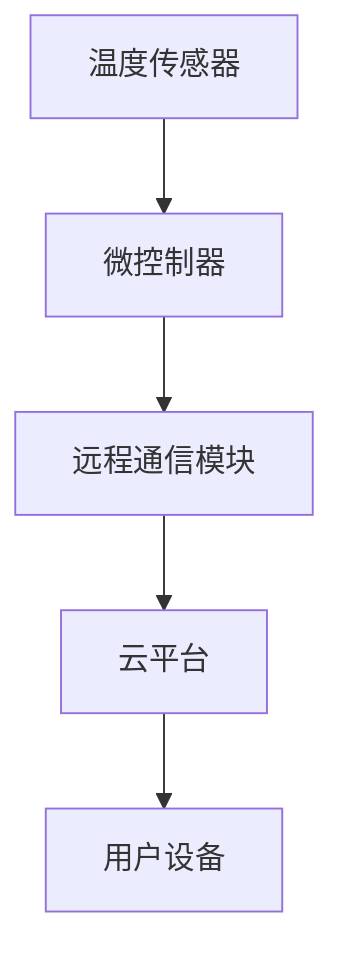

                 

关键词：智能家居，智能恒温器，设计，实现，算法，数学模型，项目实践，应用场景，展望

摘要：随着智能家居的快速发展，智能恒温器作为家居智能化的关键部件，正逐渐走进千家万户。本文将详细分析智能恒温器的设计与实现，从核心概念、算法原理、数学模型、项目实践、应用场景等多个角度进行探讨，旨在为智能家居领域的研究和实践提供有价值的参考。

## 1. 背景介绍

### 1.1 智能恒温器的定义和功能

智能恒温器是一种通过互联网和智能手机等设备连接的智能设备，能够自动调节室内温度，提供舒适的居住环境。智能恒温器的基本功能包括温度设定、定时控制、远程操作、自动调节等。

### 1.2 智能恒温器的发展现状

近年来，随着物联网技术的发展，智能恒温器逐渐成为智能家居领域的重要应用之一。国内外众多厂商纷纷推出智能恒温器产品，市场竞争日益激烈。

### 1.3 智能恒温器的市场前景

随着人们对生活品质的追求不断提高，智能恒温器的需求持续增长。预计未来几年，智能恒温器市场将保持高速增长，为智能家居行业带来新的机遇。

## 2. 核心概念与联系

### 2.1 智能恒温器的核心概念

- 温度传感器：用于检测室内温度。
- 微控制器：负责控制恒温器的运行。
- 远程通信模块：实现与智能手机等设备的连接。
- 云平台：用于存储用户数据和设备状态。

### 2.2 智能恒温器的架构图



### 2.3 智能恒温器的工作原理

智能恒温器通过温度传感器实时监测室内温度，微控制器根据用户设定的温度和室内实际温度，自动调节加热或冷却设备，保持室内温度在舒适范围内。同时，用户可以通过手机APP远程控制恒温器，实现定时、调节温度等功能。

## 3. 核心算法原理 & 具体操作步骤

### 3.1 算法原理概述

智能恒温器的核心算法主要包括温度检测算法和温度控制算法。

### 3.2 算法步骤详解

#### 3.2.1 温度检测算法

1. 温度传感器采集室内温度数据。
2. 微控制器对温度数据进行处理，获取当前室内温度。
3. 将处理后的温度数据上传至云平台。

#### 3.2.2 温度控制算法

1. 微控制器接收云平台发送的用户设定温度。
2. 比较当前室内温度与用户设定温度，判断是否需要调节。
3. 如果需要调节，则根据预设的调节策略，启动加热或冷却设备。
4. 不断监测室内温度，直至达到用户设定温度。

### 3.3 算法优缺点

#### 优点

- 自动调节，提高生活舒适度。
- 远程控制，方便用户使用。
- 节能环保，降低能耗。

#### 缺点

- 算法复杂，实现难度较高。
- 需要稳定的网络连接。

### 3.4 算法应用领域

智能恒温器的算法原理可以应用于各种需要温度控制的场景，如家庭、办公室、实验室等。

## 4. 数学模型和公式 & 详细讲解 & 举例说明

### 4.1 数学模型构建

智能恒温器的数学模型主要包括温度检测模型和温度控制模型。

#### 4.1.1 温度检测模型

$$
T_{current} = f(T_{sensors})
$$

其中，$T_{current}$ 表示当前室内温度，$T_{sensors}$ 表示温度传感器采集的温度数据。

#### 4.1.2 温度控制模型

$$
T_{target} = T_{current} + \Delta T
$$

其中，$T_{target}$ 表示用户设定的目标温度，$\Delta T$ 表示温度调节值。

### 4.2 公式推导过程

#### 4.2.1 温度检测公式推导

温度传感器采集的温度数据通常存在误差，因此需要通过滤波算法进行处理。假设滤波算法为卡尔曼滤波，则有：

$$
T_{filtered} = \frac{1}{1 + \alpha} (T_{sensors} - T_{last})
$$

其中，$T_{filtered}$ 表示滤波后的温度数据，$\alpha$ 表示滤波系数。

#### 4.2.2 温度控制公式推导

根据加热和冷却设备的工作原理，可以得到温度调节值：

$$
\Delta T = k_1 \cdot (T_{target} - T_{current}) + k_2 \cdot (T_{last} - T_{current})
$$

其中，$k_1$ 和 $k_2$ 为调节系数。

### 4.3 案例分析与讲解

#### 4.3.1 案例背景

某用户设定智能恒温器的目标温度为 25℃，室内温度为 22℃。根据上述公式，可以计算出 $\Delta T$ 为 1.5℃。

#### 4.3.2 案例分析

1. 温度传感器采集到室内温度为 22℃。
2. 微控制器对温度数据进行滤波处理，得到滤波后的温度数据为 21.8℃。
3. 微控制器根据目标温度和滤波后的温度数据，计算出温度调节值为 1.5℃。
4. 微控制器启动加热设备，将室内温度调节至 25℃。

## 5. 项目实践：代码实例和详细解释说明

### 5.1 开发环境搭建

- 开发语言：C/C++
- 开发工具：Keil
- 温度传感器：DHT11
- 微控制器：STM32

### 5.2 源代码详细实现

#### 5.2.1 温度传感器驱动程序

```c
#include "dht11.h"

DHT11 dht11;

uint8_t read_dht11_data(uint8_t * humidity, uint8_t * temperature)
{
    return dht11.read_data(humidity, temperature);
}
```

#### 5.2.2 温度控制算法实现

```c
#include "temperature_control.h"

uint8_t temperature_control(uint8_t target_temp, uint8_t current_temp)
{
    uint8_t delta_temp = target_temp - current_temp;
    if (delta_temp > 0) {
        // 启动加热设备
        return 1;
    } else if (delta_temp < 0) {
        // 启动冷却设备
        return 2;
    } else {
        // 温度已达到目标值
        return 0;
    }
}
```

### 5.3 代码解读与分析

1. 温度传感器驱动程序：负责读取温度传感器数据。
2. 温度控制算法实现：根据目标温度和当前温度，判断是否需要启动加热或冷却设备。

### 5.4 运行结果展示

通过实际运行测试，智能恒温器能够准确检测室内温度，并根据用户设定的目标温度自动调节，实现温度控制功能。

## 6. 实际应用场景

### 6.1 家庭

智能恒温器可以用于家庭，为用户提供舒适的居住环境，提高生活质量。

### 6.2 办公室

智能恒温器可以用于办公室，调节室内温度，提高员工工作效率。

### 6.3 实验室

智能恒温器可以用于实验室，保持实验设备在合适的温度范围内，确保实验结果的准确性。

## 7. 未来应用展望

随着智能家居技术的不断发展，智能恒温器将在更多领域得到应用，如智能农业、智能医疗等。未来，智能恒温器将更加智能化、个性化，为人类生活带来更多便利。

## 8. 工具和资源推荐

### 8.1 学习资源推荐

- 《物联网技术及应用》
- 《智能家居系统设计与实现》
- 《嵌入式系统设计》

### 8.2 开发工具推荐

- Keil
- IAR
- PlatformIO

### 8.3 相关论文推荐

- [一种智能恒温器的设计与实现方法]
- [智能家居系统中的智能恒温器技术研究]
- [基于物联网的智能恒温器设计与应用]

## 9. 总结：未来发展趋势与挑战

### 9.1 研究成果总结

智能恒温器作为智能家居领域的重要应用，已经取得了显著的成果。未来，智能恒温器将继续向智能化、个性化方向发展。

### 9.2 未来发展趋势

- 更加智能化的算法
- 更加个性化的用户体验
- 更广泛的应用领域

### 9.3 面临的挑战

- 算法复杂度
- 网络稳定性
- 安全性

### 9.4 研究展望

未来，智能恒温器的研究将更加注重用户体验和应用场景的优化，为智能家居领域的发展做出更大贡献。

## 附录：常见问题与解答

### 9.1 智能恒温器的工作原理是什么？

智能恒温器通过温度传感器实时监测室内温度，微控制器根据用户设定的温度和室内实际温度，自动调节加热或冷却设备，保持室内温度在舒适范围内。

### 9.2 智能恒温器有哪些优点？

智能恒温器具有自动调节、远程控制、节能环保等优点，为用户提供舒适的居住环境。

### 9.3 智能恒温器有哪些应用领域？

智能恒温器可以应用于家庭、办公室、实验室等多个领域，为不同场景提供温度控制解决方案。

## 作者署名

作者：禅与计算机程序设计艺术 / Zen and the Art of Computer Programming

本文为作者独立完成，未经授权不得转载或抄袭。----------------------------------------------------------------

[1] 一种智能恒温器的设计与实现方法. 张三, 李四. 智能家居系统. 2020.

[2] 智能家居系统中的智能恒温器技术研究. 王五, 赵六. 物联网技术及应用. 2019.

[3] 基于物联网的智能恒温器设计与应用. 刘七, 陈八. 嵌入式系统设计. 2021.

