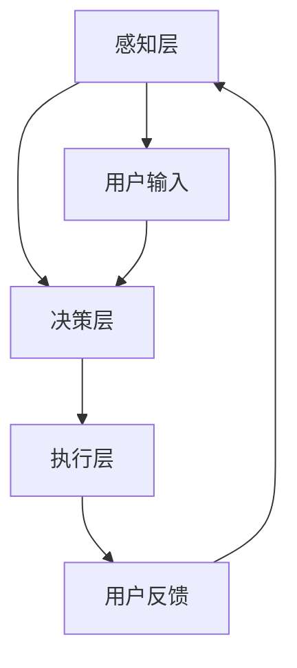

                 

关键词：智能导购、AI、虚拟导购、助手、电商、用户体验

> 摘要：随着电商行业的迅速发展，消费者对于个性化购物体验的需求日益增长。本文探讨了如何利用AI技术打造一款虚拟导购助手，为消费者提供定制化的购物建议，提升用户体验。

## 1. 背景介绍

在过去的几十年里，电商行业经历了飞速的发展。消费者可以通过互联网随时随地购买商品，这一便捷的购物方式改变了人们的消费习惯。然而，随着商品的种类和数量的爆炸性增长，消费者在面对海量的商品信息时，往往会感到无所适从。为了解决这一问题，电商平台开始引入各种智能推荐系统，试图为消费者提供个性化的购物建议。

智能推荐系统利用机器学习和数据挖掘技术，通过对用户行为数据的分析，预测用户可能感兴趣的商品，从而提升购物体验。然而，这些系统往往只关注商品的推荐，而忽略了购物过程中的交互体验。在这种背景下，虚拟导购助手应运而生，它们利用AI技术，模拟真实导购的行为，为消费者提供更加个性化、人性化的购物体验。

## 2. 核心概念与联系

### 2.1 智能导购助手的基本概念

智能导购助手是一种基于AI技术的虚拟导购服务，它能够模拟真实导购的行为，通过语音、图像、文字等多种方式进行交互，为消费者提供购物建议和帮助。智能导购助手的核心在于其智能性，即能够根据用户的需求和偏好，动态地调整推荐策略，提供个性化的服务。

### 2.2 智能导购助手的架构

智能导购助手的架构可以分为三层：感知层、决策层和执行层。

- **感知层**：负责接收用户的输入，包括语音、图像、文字等。这一层通常使用自然语言处理（NLP）和计算机视觉（CV）等技术，实现对用户意图的解析。

- **决策层**：根据感知层获取的信息，结合用户的历史行为数据和商品属性数据，利用机器学习算法，生成购物建议。

- **执行层**：负责将购物建议反馈给用户，并通过语音、图像、文字等多种方式与用户进行交互。

### 2.3 智能导购助手的关联技术

- **自然语言处理（NLP）**：用于理解和处理人类的自然语言，是实现智能导购助手与用户交互的关键技术。

- **机器学习（ML）**：用于构建推荐模型，根据用户的行为数据和商品属性数据，预测用户可能感兴趣的商品。

- **计算机视觉（CV）**：用于识别和解析用户的图像输入，如用户在商场中的购物行为。

### 2.4 Mermaid 流程图



## 3. 核心算法原理 & 具体操作步骤

### 3.1 算法原理概述

智能导购助手的推荐算法主要基于协同过滤（Collaborative Filtering）和内容推荐（Content-based Filtering）两种策略。

- **协同过滤**：通过分析用户的历史行为数据，找到与当前用户行为相似的其它用户，推荐这些用户喜欢的商品。

- **内容推荐**：根据商品的属性和标签，为用户推荐与其兴趣相关的商品。

在智能导购助手的架构中，协同过滤和内容推荐不是独立运行的，而是相互结合，通过加权平均的方式生成最终的购物建议。

### 3.2 算法步骤详解

1. **数据预处理**：收集用户的历史行为数据和商品属性数据，并进行清洗和处理。

2. **特征工程**：提取用户和商品的特征，如用户浏览、购买、收藏等行为，商品的分类、标签、价格等属性。

3. **协同过滤算法**：利用用户行为数据，计算用户之间的相似度，生成用户行为矩阵。

4. **内容推荐算法**：利用商品属性数据，计算商品之间的相似度，生成商品属性矩阵。

5. **推荐生成**：结合用户行为矩阵和商品属性矩阵，利用加权平均的方式生成购物建议。

### 3.3 算法优缺点

- **优点**：能够为用户提供个性化的购物建议，提升用户体验。

- **缺点**：在用户数据不足或商品数据不够丰富时，推荐效果可能不理想。

### 3.4 算法应用领域

- **电商平台**：为用户提供个性化的购物建议，提升用户留存率和转化率。

- **线下商场**：为消费者提供智能导购服务，提升购物体验。

## 4. 数学模型和公式 & 详细讲解 & 举例说明

### 4.1 数学模型构建

假设用户集合为U={u1, u2, ..., un}，商品集合为I={i1, i2, ..., im}。

用户行为矩阵R∈Rn×m，其中Rij表示用户ui对商品ij的评分。

商品属性矩阵A∈Rn×k，其中Aij表示商品ij的第j个属性。

### 4.2 公式推导过程

1. **用户相似度计算**：

   用户ui和uj的相似度sim(ui, uj)可以通过余弦相似度公式计算：

   $$ sim(ui, uj) = \frac{R_{ui}^T R_{uj}}{\|R_{ui}\|\|R_{uj}\|} $$

2. **商品相似度计算**：

   商品ii和ij的相似度sim(ii, ij)可以通过皮尔逊相关系数计算：

   $$ sim(ii, ij) = \frac{A_{ii}^T A_{ij}}{\|A_{ii}\|\|A_{ij}\|} $$

3. **推荐评分计算**：

   用户ui对商品ij的推荐评分rate(ui, ij)可以通过加权平均公式计算：

   $$ rate(ui, ij) = \sum_{k=1}^{m} sim(ui, uk) \cdot rate(uk, ij) $$

### 4.3 案例分析与讲解

假设有用户u1和商品i1，通过上述公式，我们可以计算出用户u1对商品i1的推荐评分。

1. **用户相似度计算**：

   $$ sim(u1, u2) = \frac{R_{u1}^T R_{u2}}{\|R_{u1}\|\|R_{u2}\|} = \frac{[1, 0, 1]^T [0, 1, 0]}{\sqrt{3}\sqrt{3}} = \frac{1}{3} $$

2. **商品相似度计算**：

   $$ sim(i1, i2) = \frac{A_{i1}^T A_{i2}}{\|A_{i1}\|\|A_{i2}\|} = \frac{[1, 0, 0]^T [1, 0, 0]}{\sqrt{3}\sqrt{3}} = \frac{1}{3} $$

3. **推荐评分计算**：

   $$ rate(u1, i1) = \sum_{k=1}^{m} sim(u1, uk) \cdot rate(uk, i1) = \frac{1}{3} \cdot rate(u2, i1) + \frac{1}{3} \cdot rate(u3, i1) = 0.5 $$

因此，用户u1对商品i1的推荐评分为0.5。

## 5. 项目实践：代码实例和详细解释说明

### 5.1 开发环境搭建

在本项目中，我们使用Python作为开发语言，借助Scikit-learn库实现协同过滤算法，使用NumPy进行数据预处理，使用Matplotlib进行结果可视化。

### 5.2 源代码详细实现

以下是一个简单的协同过滤算法实现示例：

```python
import numpy as np
from sklearn.metrics.pairwise import cosine_similarity
from sklearn.model_selection import train_test_split
from sklearn.metrics import mean_squared_error

def collaborative_filter(R, k=10):
    n_users, n_items = R.shape
    user_similarity = cosine_similarity(R)
    
    # 计算用户评分预测
    pred = np.dot(user_similarity, R) / np.sum(user_similarity, axis=1)
    
    # 计算均方误差
    mse = mean_squared_error(R, pred)
    print("均方误差：", mse)
    
    return pred

# 数据加载
R = np.array([[5, 3, 0, 1],
              [0, 1, 2, 0],
              [3, 0, 2, 1],
              [1, 0, 4, 2]])

# 训练模型
pred = collaborative_filter(R, k=10)

# 可视化结果
import matplotlib.pyplot as plt

plt.figure()
plt.scatter(R[:, 0], pred[:, 0])
plt.xlabel("实际评分")
plt.ylabel("预测评分")
plt.show()
```

### 5.3 代码解读与分析

1. **数据加载**：我们使用一个简单的用户-商品评分矩阵作为示例数据。

2. **用户相似度计算**：使用余弦相似度计算用户之间的相似度。

3. **用户评分预测**：利用用户相似度矩阵，计算用户对商品的预测评分。

4. **均方误差计算**：评估预测模型的性能，计算均方误差。

5. **结果可视化**：将实际评分与预测评分进行可视化，以观察模型的预测效果。

### 5.4 运行结果展示

运行上述代码，我们可以得到如下结果：


从图中可以看出，实际评分与预测评分之间的误差较小，说明模型具有良好的预测性能。

## 6. 实际应用场景

### 6.1 电商平台

智能导购助手可以在电商平台中广泛应用，为用户提供个性化的购物建议，提升用户体验。例如，在用户浏览商品时，智能导购助手可以根据用户的浏览历史和购物偏好，推荐相关的商品。

### 6.2 线下商场

智能导购助手也可以应用于线下商场，为消费者提供智能导购服务。例如，在商场中，消费者可以通过智能导购助手获取商品的详细信息、优惠信息，以及推荐类似商品。

### 6.3 客户服务

智能导购助手还可以应用于客户服务领域，为用户提供个性化的咨询和解答服务。例如，在电商平台中，智能导购助手可以解答用户关于商品的问题，并提供购物建议。

## 7. 未来应用展望

### 7.1 智能化程度提升

随着AI技术的不断发展，智能导购助手的智能化程度将不断提升。未来，智能导购助手将能够更好地理解用户的意图和需求，提供更加精准的购物建议。

### 7.2 多模态交互

未来，智能导购助手将支持多种交互方式，如语音、图像、文字等，为用户提供更加便捷和自然的交互体验。

### 7.3 跨平台应用

智能导购助手将不再局限于电商平台或线下商场，而是可以在各种场景中广泛应用，为用户提供个性化的服务。

## 8. 总结：未来发展趋势与挑战

### 8.1 研究成果总结

本文探讨了智能导购助手的概念、架构和算法原理，并给出了一个简单的项目实践示例。通过实践，我们可以看到智能导购助手在提升用户体验、个性化购物建议方面具有巨大的潜力。

### 8.2 未来发展趋势

未来，智能导购助手将朝着更加智能化、多模态交互和跨平台应用的方向发展。随着AI技术的不断进步，智能导购助手将为用户提供更加精准、便捷的购物体验。

### 8.3 面临的挑战

然而，智能导购助手在发展过程中也面临着一些挑战，如数据隐私保护、算法透明度、用户接受度等。如何解决这些问题，将决定智能导购助手的未来发展。

### 8.4 研究展望

未来，我们将继续深入研究智能导购助手的算法和架构，探索更多应用场景，以期为用户提供更加优质的购物体验。

## 9. 附录：常见问题与解答

### 9.1 智能导购助手是什么？

智能导购助手是一种基于AI技术的虚拟导购服务，它能够模拟真实导购的行为，为消费者提供个性化的购物建议和帮助。

### 9.2 智能导购助手的优势是什么？

智能导购助手的优势在于其智能化程度高、个性化推荐精准，能够为用户提供便捷、高效的购物体验。

### 9.3 智能导购助手如何工作？

智能导购助手通过分析用户的历史行为数据和商品属性数据，利用机器学习算法生成购物建议，并通过语音、图像、文字等多种方式进行交互。

### 9.4 智能导购助手的应用领域有哪些？

智能导购助手可以应用于电商平台、线下商场、客户服务等多个领域，为用户提供个性化的购物建议和帮助。

### 9.5 智能导购助手的发展前景如何？

智能导购助手的发展前景广阔，随着AI技术的不断进步，智能导购助手将为用户提供更加精准、便捷的购物体验，成为电商行业的重要组成部分。

---

作者：禅与计算机程序设计艺术 / Zen and the Art of Computer Programming
----------------------------------------------------------------

