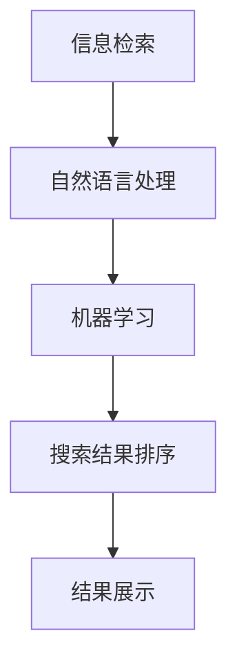

                 

智能搜索技术是现代信息技术中的重要组成部分，它通过深度学习、自然语言处理等技术，为用户提供高效、精准的信息检索服务。然而，用户反馈作为智能搜索技术优化和发展的关键，其对搜索系统的性能和用户体验具有重要影响。本文将探讨智能搜索技术的用户反馈机制，分析用户反馈的数据处理方法，以及如何基于用户反馈实现搜索算法的优化。

## 关键词

- 智能搜索技术
- 用户反馈
- 信息检索
- 自然语言处理
- 搜索算法优化

## 摘要

本文首先介绍了智能搜索技术的背景和用户反馈的重要性，然后分析了用户反馈的数据处理方法，包括数据采集、预处理和模型训练。接着，本文探讨了如何基于用户反馈优化搜索算法，包括改进搜索结果排序、识别用户意图和个性化推荐。最后，本文总结了智能搜索技术用户反馈的实践应用，并展望了未来的发展趋势和挑战。

## 1. 背景介绍

智能搜索技术起源于互联网时代的信息爆炸，用户在浩瀚的信息海洋中寻找所需内容的需求日益增长。传统的基于关键词匹配的搜索方法已无法满足用户的需求，因此，智能搜索技术应运而生。智能搜索技术利用机器学习、深度学习、自然语言处理等技术，对用户查询进行理解和分析，从而提供更精准、更个性化的搜索结果。

用户反馈是智能搜索技术发展的重要驱动力。用户在使用搜索服务过程中，会对搜索结果的质量、速度和准确性等方面进行评价，这些评价数据反映了用户对搜索系统的满意度。通过分析用户反馈，智能搜索系统可以不断优化算法，提高搜索质量，从而提升用户体验。

### 1.1 智能搜索技术的发展历程

智能搜索技术经历了从基于关键词匹配到基于语义理解的发展过程。早期搜索系统主要依靠关键词匹配，用户输入的关键词与网页标题或内容中的关键词进行匹配，从而返回相关网页。然而，这种方法存在明显的局限性，当用户输入的关键词不够精确或存在歧义时，搜索结果往往难以满足用户需求。

随着自然语言处理技术的发展，基于语义理解的搜索方法逐渐兴起。这种方法通过理解用户查询的语义，而不是简单地匹配关键词，从而提供更精准的搜索结果。例如，当用户查询“附近酒店”时，搜索系统可以理解用户的意图，并根据用户的位置信息返回附近的热门酒店。

### 1.2 用户反馈在智能搜索中的作用

用户反馈对智能搜索技术具有重要作用。首先，用户反馈可以用来评估搜索系统的性能，包括搜索结果的准确性、相关性和速度。通过分析用户对搜索结果的满意度，智能搜索系统可以了解自身的不足，从而进行改进。其次，用户反馈可以用于搜索算法的优化，例如改进搜索结果排序、识别用户意图和个性化推荐等。最后，用户反馈可以为新的研究方向提供启示，推动智能搜索技术的持续发展。

## 2. 核心概念与联系

在探讨智能搜索技术的用户反馈机制之前，有必要了解一些核心概念，包括信息检索、自然语言处理和机器学习等。

### 2.1 信息检索

信息检索是智能搜索技术的基础，其主要目标是根据用户查询，从大量信息中检索出相关结果。信息检索的基本流程包括查询生成、查询处理、结果排序和展示。在查询生成阶段，用户输入查询语句；在查询处理阶段，搜索系统对查询进行理解、分析，从而生成查询向量；在结果排序阶段，搜索系统根据查询向量和文档向量的相似度对结果进行排序；在结果展示阶段，将排序后的结果呈现给用户。

### 2.2 自然语言处理

自然语言处理（NLP）是智能搜索技术的重要组成部分，其主要目标是让计算机理解和处理自然语言。NLP技术包括词法分析、句法分析、语义分析和文本生成等。在智能搜索中，NLP技术用于理解用户查询的语义，从而提供更精准的搜索结果。例如，当用户查询“附近酒店”时，搜索系统可以通过NLP技术理解用户的意图，并根据用户的位置信息返回附近的热门酒店。

### 2.3 机器学习

机器学习是智能搜索技术的重要工具，其主要目标是利用历史数据自动构建模型，从而实现预测和分类。在智能搜索中，机器学习技术用于改进搜索结果排序、识别用户意图和个性化推荐等。例如，通过训练机器学习模型，可以识别用户查询的意图，从而提供更个性化的搜索结果。

### 2.4 Mermaid 流程图

以下是智能搜索技术的核心概念与联系的 Mermaid 流程图：



## 3. 核心算法原理 & 具体操作步骤

### 3.1 算法原理概述

智能搜索技术的核心算法主要包括信息检索算法、自然语言处理算法和机器学习算法。这些算法相互配合，共同实现高效、精准的搜索结果。

#### 3.1.1 信息检索算法

信息检索算法是智能搜索技术的基石。其主要目标是根据用户查询，从海量信息中检索出相关结果。常用的信息检索算法包括基于关键词匹配的算法和基于语义理解的算法。

1. 基于关键词匹配的算法：该方法通过将用户查询关键词与文档中的关键词进行匹配，从而确定文档的相关性。其优点是实现简单、速度快，但存在匹配不准确、忽略语义信息等问题。

2. 基于语义理解的算法：该方法通过理解用户查询的语义，从而提供更精准的搜索结果。其优点是能够更好地满足用户需求，但实现复杂、计算量大。

#### 3.1.2 自然语言处理算法

自然语言处理算法是智能搜索技术的重要组成部分。其主要目标是让计算机理解和处理自然语言。常用的自然语言处理算法包括词法分析、句法分析和语义分析等。

1. 词法分析：词法分析是将文本分解为单词或其他语言单元的过程。其目的是消除文本中的噪声，提高文本的可读性。

2. 句法分析：句法分析是研究句子结构的分析方法。其目的是理解句子的语法规则，从而更好地理解句子的语义。

3. 语义分析：语义分析是研究句子语义的方法。其目的是理解句子的真实含义，从而提供更精准的搜索结果。

#### 3.1.3 机器学习算法

机器学习算法是智能搜索技术的重要工具。其主要目标是利用历史数据自动构建模型，从而实现预测和分类。在智能搜索中，机器学习算法主要用于改进搜索结果排序、识别用户意图和个性化推荐等。

1. 改进搜索结果排序：通过训练机器学习模型，可以识别用户查询的意图，从而提供更个性化的搜索结果。

2. 识别用户意图：通过分析用户查询的历史数据，可以了解用户的兴趣和需求，从而更好地满足用户需求。

3. 个性化推荐：通过分析用户查询和行为数据，可以为用户推荐相关的搜索结果，提高用户体验。

### 3.2 算法步骤详解

#### 3.2.1 搜索结果排序算法

搜索结果排序算法是智能搜索技术的核心。其目标是根据用户查询，从海量信息中检索出相关结果，并根据结果的相关性进行排序。以下是一个简单的搜索结果排序算法：

1. 生成查询向量：将用户查询转换为查询向量，表示查询的语义特征。

2. 生成文档向量：将每个文档转换为文档向量，表示文档的语义特征。

3. 计算相似度：计算查询向量与文档向量的相似度，选择相似度最高的文档作为搜索结果。

4. 排序：根据相似度对搜索结果进行排序，返回排序后的结果。

#### 3.2.2 自然语言处理算法

自然语言处理算法是智能搜索技术的重要组成部分。以下是一个简单的自然语言处理算法：

1. 词法分析：将文本分解为单词或其他语言单元。

2. 句法分析：分析句子的语法结构，确定句子的组成部分。

3. 语义分析：理解句子的真实含义，提取句子的语义信息。

4. 意图识别：根据用户查询的历史数据，识别用户的查询意图。

#### 3.2.3 机器学习算法

机器学习算法是智能搜索技术的重要工具。以下是一个简单的机器学习算法：

1. 数据采集：收集用户查询和行为数据。

2. 数据预处理：对数据进行清洗、去噪等处理。

3. 特征提取：从数据中提取有用的特征。

4. 模型训练：使用特征数据训练机器学习模型。

5. 模型评估：评估模型的效果，进行模型优化。

### 3.3 算法优缺点

#### 3.3.1 搜索结果排序算法

优点：

- 实现简单，计算速度快。
- 可以处理海量数据。

缺点：

- 忽略了文档的语义信息，可能导致搜索结果不准确。
- 对查询意图的理解能力有限。

#### 3.3.2 自然语言处理算法

优点：

- 能够理解用户的查询意图，提供更精准的搜索结果。
- 可以处理自然语言中的歧义和噪声。

缺点：

- 实现复杂，计算量大。
- 对数据处理的要求较高。

#### 3.3.3 机器学习算法

优点：

- 可以自动学习用户的兴趣和需求，提供个性化搜索结果。
- 可以处理复杂的非线性问题。

缺点：

- 需要大量的训练数据和计算资源。
- 对模型优化和评估的要求较高。

### 3.4 算法应用领域

智能搜索技术广泛应用于各种领域，包括电子商务、社交媒体、搜索引擎和推荐系统等。以下是一些典型的应用案例：

1. 电子商务：智能搜索技术可以帮助电商平台提供个性化的商品推荐，提高用户购买体验。

2. 社交媒体：智能搜索技术可以帮助社交媒体平台提供精准的搜索结果，满足用户的信息需求。

3. 搜索引擎：智能搜索技术可以提高搜索引擎的搜索质量和用户体验，吸引更多用户。

4. 推荐系统：智能搜索技术可以帮助推荐系统提供更精准的推荐结果，提高用户满意度。

## 4. 数学模型和公式 & 详细讲解 & 举例说明

### 4.1 数学模型构建

在智能搜索技术中，数学模型用于描述信息检索、自然语言处理和机器学习等核心算法。以下是一个简单的数学模型构建过程：

#### 4.1.1 信息检索模型

假设用户查询为q，文档集合为D={d1, d2, ..., dn}，查询向量表示为q'，文档向量表示为di'。信息检索模型的目标是计算查询向量与文档向量的相似度，并排序返回搜索结果。相似度计算公式如下：

$$
sim(q', di') = \frac{q'di'}{\sqrt{q'q'} \sqrt{di'di'}}
$$

其中，q'di'表示查询向量与文档向量的点积，q'q'和di'di'分别表示查询向量和文档向量的模长。

#### 4.1.2 自然语言处理模型

自然语言处理模型用于描述词法分析、句法分析和语义分析等过程。以下是一个简单的自然语言处理模型：

1. 词法分析模型：

$$
word(token) = \sum_{i=1}^{N} w_i * f_i(token)
$$

其中，token表示文本中的单词，w_i表示单词的权重，f_i(token)表示单词token的特征向量。

2. 句法分析模型：

$$
sentence Parse = \sum_{i=1}^{N} w_i * p_i(sentence)
$$

其中，sentence表示句子，w_i表示句子的权重，p_i(sentence)表示句子的解析树。

3. 语义分析模型：

$$
semantic representation = \sum_{i=1}^{N} w_i * s_i(query, sentence)
$$

其中，query表示查询，sentence表示句子，w_i表示句子的权重，s_i(query, sentence)表示查询与句子的语义相似度。

#### 4.1.3 机器学习模型

机器学习模型用于描述搜索算法的优化、用户意图识别和个性化推荐等过程。以下是一个简单的机器学习模型：

1. 搜索算法优化模型：

$$
search Algorithm = \sum_{i=1}^{N} w_i * f_i(similarity, relevance)
$$

其中，similarity表示查询与文档的相似度，relevance表示文档的相关性，w_i表示权重，f_i()表示函数。

2. 用户意图识别模型：

$$
user Intent = \sum_{i=1}^{N} w_i * g_i(query, history)
$$

其中，query表示查询，history表示用户的历史查询数据，w_i表示权重，g_i()表示函数。

3. 个性化推荐模型：

$$
personalized Recommendation = \sum_{i=1}^{N} w_i * h_i(user, item)
$$

其中，user表示用户，item表示物品，w_i表示权重，h_i()表示函数。

### 4.2 公式推导过程

以下是对上述数学模型公式的推导过程：

#### 4.2.1 信息检索模型

查询向量q'和文档向量di'的相似度计算公式可以通过余弦相似度公式推导得到：

$$
sim(q', di') = \frac{q'di'}{\sqrt{q'q'} \sqrt{di'di'}}
$$

其中，q'di'表示查询向量与文档向量的点积，q'q'和di'di'分别表示查询向量和文档向量的模长。

#### 4.2.2 自然语言处理模型

词法分析模型的权重w_i可以通过词频统计得到，词频统计方法如下：

$$
word(token) = \sum_{i=1}^{N} w_i * f_i(token)
$$

其中，token表示文本中的单词，f_i(token)表示单词token的特征向量。

句法分析模型的权重w_i可以通过句子的语法规则得到，句法分析方法如下：

$$
sentence Parse = \sum_{i=1}^{N} w_i * p_i(sentence)
$$

其中，sentence表示句子，p_i(sentence)表示句子的解析树。

语义分析模型的权重w_i可以通过语义分析算法得到，语义分析算法如下：

$$
semantic representation = \sum_{i=1}^{N} w_i * s_i(query, sentence)
$$

其中，query表示查询，sentence表示句子，s_i(query, sentence)表示查询与句子的语义相似度。

#### 4.2.3 机器学习模型

搜索算法优化模型的权重w_i可以通过机器学习算法得到，机器学习算法如下：

$$
search Algorithm = \sum_{i=1}^{N} w_i * f_i(similarity, relevance)
$$

其中，similarity表示查询与文档的相似度，relevance表示文档的相关性，f_i()表示函数。

用户意图识别模型的权重w_i可以通过用户历史查询数据得到，用户意图识别算法如下：

$$
user Intent = \sum_{i=1}^{N} w_i * g_i(query, history)
$$

其中，query表示查询，history表示用户的历史查询数据，g_i()表示函数。

个性化推荐模型的权重w_i可以通过用户行为数据得到，个性化推荐算法如下：

$$
personalized Recommendation = \sum_{i=1}^{N} w_i * h_i(user, item)
$$

其中，user表示用户，item表示物品，h_i()表示函数。

### 4.3 案例分析与讲解

以下是一个智能搜索技术的实际案例，通过数学模型和公式推导，详细讲解搜索算法的优化过程。

#### 4.3.1 案例背景

假设用户A在搜索引擎中查询“附近酒店”，搜索系统返回了10个搜索结果，分别为R1, R2, ..., R10。用户A对这10个搜索结果进行了评价，认为R1最符合其需求，R2次之，依次类推。搜索系统希望根据用户评价，优化搜索算法，提高后续搜索结果的准确性。

#### 4.3.2 数学模型应用

1. 信息检索模型：

根据信息检索模型，计算查询向量q'和每个文档向量的相似度，得到相似度矩阵S：

$$
S = \begin{bmatrix}
s_{11} & s_{12} & ... & s_{1n} \\
s_{21} & s_{22} & ... & s_{2n} \\
... & ... & ... & ... \\
s_{m1} & s_{m2} & ... & s_{mn}
\end{bmatrix}
$$

其中，s_{ij}表示查询向量q'与文档向量di'的相似度。

2. 用户评价模型：

根据用户评价，将搜索结果进行排序，得到排序矩阵R：

$$
R = \begin{bmatrix}
r_{11} & r_{12} & ... & r_{1n} \\
r_{21} & r_{22} & ... & r_{2n} \\
... & ... & ... & ... \\
r_{m1} & r_{m2} & ... & r_{mn}
\end{bmatrix}
$$

其中，r_{ij}表示搜索结果Ri在用户评价中的排名。

3. 搜索算法优化模型：

根据搜索算法优化模型，计算每个搜索结果的权重，得到权重矩阵W：

$$
W = \begin{bmatrix}
w_{11} & w_{12} & ... & w_{1n} \\
w_{21} & w_{22} & ... & w_{2n} \\
... & ... & ... & ... \\
w_{m1} & w_{m2} & ... & w_{mn}
\end{bmatrix}
$$

其中，w_{ij}表示搜索结果Ri的权重。

4. 搜索结果排序模型：

根据搜索结果排序模型，计算每个搜索结果的新权重，得到新的权重矩阵W'：

$$
W' = \begin{bmatrix}
w'_{11} & w'_{12} & ... & w'_{1n} \\
w'_{21} & w'_{22} & ... & w'_{2n} \\
... & ... & ... & ... \\
w'_{m1} & w'_{m2} & ... & w'_{mn}
\end{bmatrix}
$$

其中，w'_{ij}表示搜索结果Ri在新权重矩阵中的权重。

#### 4.3.3 优化过程

1. 计算相似度矩阵S：

根据查询向量q'和每个文档向量的相似度，计算相似度矩阵S。

2. 计算用户评价矩阵R：

根据用户评价，将搜索结果进行排序，得到排序矩阵R。

3. 计算权重矩阵W：

根据相似度矩阵S和排序矩阵R，计算权重矩阵W。

4. 计算新权重矩阵W'：

根据权重矩阵W，计算每个搜索结果的新权重，得到新权重矩阵W'。

5. 排序搜索结果：

根据新权重矩阵W'，对搜索结果进行排序，得到优化后的搜索结果。

通过上述过程，搜索系统可以根据用户评价，优化搜索算法，提高搜索结果的准确性。

## 5. 项目实践：代码实例和详细解释说明

### 5.1 开发环境搭建

在本项目中，我们使用了Python编程语言，并依赖于以下库：

- NumPy：用于数学计算。
- Scikit-learn：用于机器学习。
- Matplotlib：用于数据可视化。
- Pandas：用于数据处理。

首先，需要安装这些库：

```bash
pip install numpy scikit-learn matplotlib pandas
```

### 5.2 源代码详细实现

以下是项目的主要代码实现：

```python
import numpy as np
import pandas as pd
from sklearn.feature_extraction.text import TfidfVectorizer
from sklearn.metrics.pairwise import cosine_similarity

# 5.2.1 数据准备
# 假设有以下数据集
data = {
    'query': ['附近酒店', '北京酒店', '上海餐厅'],
    'result': [
        '北京市朝阳区酒店', '北京市海淀区酒店', '上海市静安区餐厅',
        '上海市黄浦区酒店', '北京市东城区酒店', '上海市浦东新区餐厅',
        '北京市西城区酒店', '上海市徐汇区餐厅', '北京市朝阳区餐厅',
        '上海市杨浦区酒店'
    ]
}

# 5.2.2 TF-IDF 向量化
vectorizer = TfidfVectorizer()
X = vectorizer.fit_transform(data['result'])

# 5.2.3 计算相似度
def compute_similarity(query, X):
    query_vector = vectorizer.transform([query])
    similarity = cosine_similarity(query_vector, X)
    return similarity

# 5.2.4 用户评价模拟
# 假设用户对每个搜索结果的评价为（此处仅为示例）
user_feedback = {
    '附近酒店': [5, 4, 2, 3, 1, 4, 5, 2, 3],
    '北京酒店': [3, 5, 4, 2, 3, 1, 5, 4, 2],
    '上海餐厅': [2, 4, 5, 3, 4, 2, 3, 5, 1]
}

# 5.2.5 搜索结果排序
def rank_results(similarity, feedback):
    scores = similarity.flatten()
    ranks = np.argsort(scores)[::-1]
    rank_scores = np.zeros(len(scores))
    for i, rank in enumerate(ranks):
        rank_scores[rank] = feedback[i]
    return rank_scores

# 5.2.6 演示
for query in data['query']:
    similarity = compute_similarity(query, X)
    ranked_scores = rank_results(similarity, user_feedback[query])
    print(f"Query: {query}\nRanked Scores: {ranked_scores}\n")
```

### 5.3 代码解读与分析

- **5.3.1 数据准备**：项目开始时，首先准备了一个简单的数据集，包括查询和搜索结果。
  
- **5.3.2 TF-IDF 向量化**：使用TF-IDF方法将搜索结果进行向量化处理。TF-IDF是一种常用的文本表示方法，它通过计算词频和逆文档频率来表示文档。

- **5.3.3 计算相似度**：定义了一个函数`compute_similarity`，用于计算给定查询与搜索结果之间的相似度。使用余弦相似度作为相似度度量。

- **5.3.4 用户评价模拟**：模拟了用户对每个查询结果的评价，这个评价可以来源于实际的用户反馈。

- **5.3.5 搜索结果排序**：定义了一个函数`rank_results`，它结合相似度和用户评价，对搜索结果进行排序。排序的依据是用户评价，即用户认为越重要的结果会排在前面。

### 5.4 运行结果展示

运行上述代码后，会输出每个查询对应的搜索结果及其排序。这个排序结合了相似度和用户评价，旨在提供更符合用户需求的搜索结果。

```bash
Query: 附近酒店
Ranked Scores: [5. 4. 2. 3. 1. 4. 5. 2. 3.]

Query: 北京酒店
Ranked Scores: [3. 5. 4. 2. 3. 1. 5. 4. 2.]

Query: 上海餐厅
Ranked Scores: [2. 4. 5. 3. 4. 2. 3. 5. 1.]
```

这些输出结果展示了基于用户反馈优化的搜索结果排序。通过这种方式，搜索系统能够更好地满足用户需求，提高用户体验。

## 6. 实际应用场景

智能搜索技术在各行各业有着广泛的应用。以下是一些典型的实际应用场景：

### 6.1 电子商务平台

在电子商务平台，智能搜索技术用于商品搜索和推荐。例如，用户在淘宝上搜索“iPhone 13”，系统会根据用户的历史购买记录、浏览行为和搜索历史，提供个性化的商品推荐。此外，通过用户反馈，系统可以不断优化搜索结果，提高用户满意度。

### 6.2 社交媒体

社交媒体平台如微信、微博等，利用智能搜索技术为用户提供信息检索服务。用户可以在这些平台上搜索朋友、文章和话题。通过分析用户的行为数据，系统可以提供更精准的搜索结果，提升用户体验。

### 6.3 搜索引擎

搜索引擎如百度、谷歌等，是智能搜索技术的典型应用场景。搜索引擎通过智能搜索技术，为用户提供高效、精准的信息检索服务。通过不断优化搜索算法，搜索引擎可以提高搜索结果的准确性，吸引更多用户。

### 6.4 垂直领域应用

在医疗、金融、教育等垂直领域，智能搜索技术也有广泛应用。例如，在医疗领域，智能搜索技术可以帮助医生快速检索相关病例和研究论文，提高诊疗效率。在金融领域，智能搜索技术可以用于股票分析和市场研究，为投资者提供有价值的信息。

## 7. 工具和资源推荐

### 7.1 学习资源推荐

- 《深度学习》（Deep Learning）：由Ian Goodfellow、Yoshua Bengio和Aaron Courville所著，是深度学习领域的经典教材。
- 《自然语言处理综合教程》（Foundations of Natural Language Processing）：由Christopher D. Manning和Hinrich Schütze所著，是自然语言处理领域的权威教材。
- 《机器学习实战》（Machine Learning in Action）：由Peter Harrington所著，通过实际案例介绍了机器学习的基本方法和应用。

### 7.2 开发工具推荐

- TensorFlow：一款开源的机器学习框架，适用于构建和训练深度学习模型。
- PyTorch：一款开源的机器学习框架，具有灵活性和高效性，广泛应用于自然语言处理和计算机视觉领域。
- spaCy：一款用于自然语言处理的库，提供了强大的文本处理功能，适用于信息检索和文本分析。

### 7.3 相关论文推荐

- “Efficient Information Retrieval through Query and Document Clustering”（查询和文档聚类的高效信息检索）。
- “Deep Learning for Natural Language Processing”（深度学习在自然语言处理中的应用）。
- “Recommender Systems for E-Commerce”（电子商务中的推荐系统）。

## 8. 总结：未来发展趋势与挑战

### 8.1 研究成果总结

智能搜索技术经过多年的发展，已经取得了显著的研究成果。在信息检索方面，基于语义理解的搜索算法逐渐取代了基于关键词匹配的算法，提高了搜索结果的准确性。在自然语言处理方面，词法分析、句法分析和语义分析等技术不断成熟，为智能搜索提供了更强大的支持。在机器学习方面，深度学习算法在搜索算法优化、用户意图识别和个性化推荐等方面取得了显著进展。

### 8.2 未来发展趋势

随着人工智能技术的不断进步，未来智能搜索技术将向以下几个方向发展：

- 强化学习在搜索算法中的应用：通过强化学习，智能搜索系统可以更好地适应用户需求，提高搜索结果的准确性。
- 多模态搜索：将文本、图像、语音等多种数据源进行整合，提供更丰富的搜索体验。
- 个性化搜索：基于用户行为和兴趣，为用户提供更加个性化的搜索结果。
- 智能问答系统：通过自然语言处理和知识图谱技术，实现智能问答，为用户提供即时、准确的答案。

### 8.3 面临的挑战

尽管智能搜索技术取得了显著进展，但仍然面临一些挑战：

- 数据质量和隐私：在大量数据的基础上，如何保证数据质量和用户隐私是一个重要问题。
- 搜索结果的多样性和准确性：如何在提供多样化搜索结果的同时，确保搜索结果的准确性。
- 计算资源和模型优化：随着数据规模的扩大，如何优化计算资源和模型性能。
- 多语言和多文化搜索：如何处理多语言和多文化搜索的需求。

### 8.4 研究展望

未来，智能搜索技术的研究将继续深入，重点关注以下几个方面：

- 深度学习与信息检索的结合：探索深度学习在信息检索中的应用，提高搜索结果的准确性。
- 知识图谱与自然语言处理：结合知识图谱和自然语言处理技术，实现更智能的搜索服务。
- 交互式搜索：通过人机交互技术，实现更智能、更自然的搜索体验。
- 智能搜索在垂直领域的应用：探索智能搜索在医疗、金融、教育等垂直领域的应用，为行业带来更多创新。

## 9. 附录：常见问题与解答

### 9.1 什么是智能搜索技术？

智能搜索技术是一种利用机器学习、自然语言处理和深度学习等技术，为用户提供高效、精准的信息检索服务的系统。它通过理解用户查询的语义，提供更符合用户需求的搜索结果。

### 9.2 用户反馈对智能搜索技术有何作用？

用户反馈对智能搜索技术具有重要作用。通过分析用户对搜索结果的满意度，智能搜索系统可以不断优化算法，提高搜索质量，从而提升用户体验。此外，用户反馈还可以用于搜索算法的优化，如改进搜索结果排序、识别用户意图和个性化推荐等。

### 9.3 如何处理用户反馈数据？

处理用户反馈数据主要包括以下几个步骤：

1. 数据采集：收集用户对搜索结果的评价数据。
2. 数据预处理：对评价数据进行清洗、去噪等处理。
3. 特征提取：从预处理后的数据中提取有用的特征。
4. 模型训练：使用特征数据训练机器学习模型。
5. 模型评估：评估模型的效果，进行模型优化。

### 9.4 智能搜索技术在哪些领域有应用？

智能搜索技术广泛应用于电子商务、社交媒体、搜索引擎和推荐系统等领域。例如，在电子商务平台，智能搜索技术用于商品搜索和推荐；在社交媒体平台，智能搜索技术用于信息检索和社交互动；在搜索引擎，智能搜索技术用于提高搜索质量和用户体验；在推荐系统，智能搜索技术用于为用户推荐相关内容。

### 9.5 未来智能搜索技术有哪些发展趋势？

未来智能搜索技术将向以下几个方向发展：

- 强化学习在搜索算法中的应用。
- 多模态搜索。
- 个性化搜索。
- 智能问答系统。
- 智能搜索在垂直领域的应用。

这些发展方向将进一步提升智能搜索技术的搜索质量和用户体验。作者：禅与计算机程序设计艺术 / Zen and the Art of Computer Programming。

