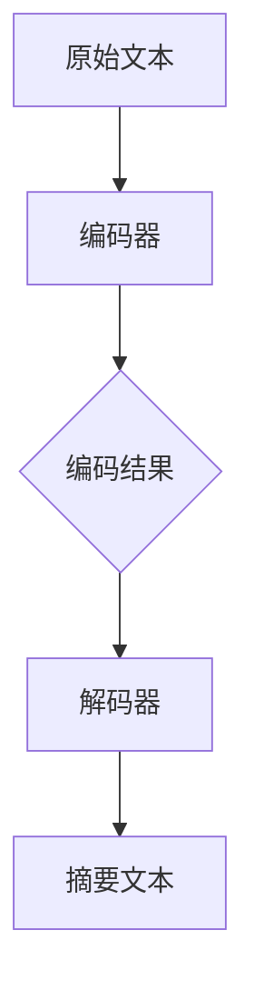

                 

关键词：智能文本摘要、AI大模型、自然语言处理、信息提取、信息压缩、文本压缩、摘要生成、信息密度、模型优化、应用领域。

> 摘要：本文旨在探讨人工智能大模型在智能文本摘要领域中的应用，通过对文本信息进行深度分析和理解，实现自动化的文本摘要生成。文章将介绍智能文本摘要的核心概念、算法原理、数学模型及公式推导，并通过实际代码实例进行详细解释说明。同时，文章还将分析智能文本摘要的实际应用场景、工具和资源推荐，以及对未来发展趋势与挑战的展望。

## 1. 背景介绍

随着互联网信息的爆炸式增长，如何高效地处理和利用这些信息成为了一个亟待解决的问题。传统的文本摘要方法，如手动摘录和关键词提取，往往效率低下且难以保证质量。而随着人工智能技术的快速发展，特别是深度学习和自然语言处理（NLP）领域的突破，自动化的智能文本摘要技术逐渐成为可能。

智能文本摘要的目标是从大量文本信息中提取出关键内容，生成简洁、准确且具代表性的摘要。这不仅有助于提高信息获取的效率，还能减少信息过载的问题。近年来，AI大模型在文本处理领域取得了显著的进展，如GPT、BERT等预训练模型，为智能文本摘要提供了强大的技术支持。

本文将围绕AI大模型在智能文本摘要中的应用，系统地介绍相关技术原理、算法实现和应用场景，旨在为读者提供一份全面的技术指南。

## 2. 核心概念与联系

### 2.1. 智能文本摘要的定义

智能文本摘要（Intelligent Text Summarization），是指利用人工智能技术，尤其是深度学习算法，对原始文本进行自动分析和理解，生成简洁且具有代表性的摘要。智能文本摘要的目标是提取文本中的关键信息，同时保持原文的主旨和结构。

### 2.2. 信息提取与信息压缩

智能文本摘要的关键在于信息提取和信息压缩。信息提取是指从原始文本中识别出具有代表性的句子或段落，这些句子或段落能够代表文本的主要内容。信息压缩则是指将这些提取出的信息进行进一步精简，生成简洁的摘要。

### 2.3. 模型架构

为了实现智能文本摘要，通常采用一种称为“编码-解码”的模型架构。其中，编码器（Encoder）负责对原始文本进行编码，将其转换为一个固定长度的向量表示；解码器（Decoder）则负责从编码器的输出中解码出摘要文本。

以下是一个简单的Mermaid流程图，展示了智能文本摘要的基本模型架构：



### 2.4. 信息密度

信息密度（Information Density）是衡量文本摘要质量的重要指标。一个高质量的摘要应具有较高的信息密度，即摘要中包含的信息量应与原始文本相当或更高。通过优化模型结构和参数，可以提高摘要的信息密度。

## 3. 核心算法原理 & 具体操作步骤

### 3.1. 算法原理概述

智能文本摘要的核心算法是基于深度学习的序列到序列（Seq2Seq）模型。Seq2Seq模型通过编码器-解码器结构，实现了从输入序列（原始文本）到输出序列（摘要文本）的转换。以下是一个简化的算法流程：

1. **编码器**：将原始文本编码为一个固定长度的向量表示。
2. **注意力机制**：解码器通过注意力机制，从编码器的输出中关注到重要的信息。
3. **解码器**：基于编码器的输出和注意力机制的结果，逐步解码出摘要文本。

### 3.2. 算法步骤详解

1. **预处理**：对原始文本进行分词、去停用词等预处理操作，将文本转换为序列。

2. **编码器**：使用循环神经网络（RNN）或其变种，如长短期记忆网络（LSTM）或门控循环单元（GRU），对文本序列进行编码。

3. **注意力机制**：在解码器中引入注意力机制，使解码器能够根据编码器的输出，动态地关注到文本序列中的关键信息。

4. **解码器**：解码器从编码器的输出中解码出摘要文本。在解码过程中，解码器的输入不仅包括编码器的输出，还包括上一时间步的解码输出。

5. **优化与训练**：通过最小化损失函数（如交叉熵损失），优化模型参数，训练模型。

### 3.3. 算法优缺点

**优点**：

- **高效性**：通过预训练的大模型，可以实现快速、高效的文本摘要。
- **准确性**：基于深度学习算法，能够提取文本中的关键信息，生成高质量的摘要。
- **灵活性**：可以根据不同的需求和场景，调整模型结构和参数，实现定制化的文本摘要。

**缺点**：

- **计算资源消耗**：训练和优化大模型需要大量的计算资源和时间。
- **数据依赖**：模型的性能高度依赖于训练数据的质量和多样性。

### 3.4. 算法应用领域

智能文本摘要技术可以应用于多个领域，如：

- **信息检索**：自动生成文档摘要，提高信息检索的效率。
- **内容推荐**：生成文章摘要，为用户推荐感兴趣的内容。
- **新闻报道**：自动生成新闻摘要，提高新闻报道的时效性和准确性。
- **教育领域**：自动生成课程内容摘要，帮助学生快速掌握知识点。

## 4. 数学模型和公式 & 详细讲解 & 举例说明

### 4.1. 数学模型构建

智能文本摘要的核心是编码器-解码器模型，其中涉及到的数学模型主要包括：

- **编码器**：通常采用循环神经网络（RNN）或其变种，如LSTM或GRU。其数学模型可以表示为：
  $$
  h_t = \text{LSTM}(h_{t-1}, x_t)
  $$
  其中，$h_t$ 是编码器在时间步 $t$ 的隐藏状态，$x_t$ 是输入文本的词向量。

- **解码器**：解码器通常采用类似于编码器的RNN结构。其数学模型可以表示为：
  $$
  y_t = \text{LSTM}(y_{t-1}, h_t, e_t)
  $$
  其中，$y_t$ 是解码器在时间步 $t$ 的输出，$e_t$ 是预测的词向量。

- **注意力机制**：注意力机制用于解码器，使解码器能够根据编码器的输出，动态地关注到文本序列中的关键信息。其数学模型可以表示为：
  $$
  a_t = \text{softmax}(\text{ Scores} (h_t, h_{t'}))
  $$
  其中，$a_t$ 是注意力权重，$h_t$ 和 $h_{t'}$ 分别是编码器和解码器在时间步 $t$ 和 $t'$ 的隐藏状态。

### 4.2. 公式推导过程

以下是编码器-解码器模型的损失函数推导过程：

1. **编码器输出**：
   $$
   \hat{h}_t = \text{LSTM}(h_{t-1}, x_t)
   $$
2. **解码器输入**：
   $$
   \hat{y}_t = \text{LSTM}(y_{t-1}, \hat{h}_t)
   $$
3. **预测词向量**：
   $$
   e_t = \text{softmax}(\hat{y}_t)
   $$
4. **损失函数**：
   $$
   L = -\sum_{t=1}^{T} y_t \log(e_t)
   $$
   其中，$T$ 是序列长度，$y_t$ 是目标词向量，$e_t$ 是预测词向量。

### 4.3. 案例分析与讲解

以下是一个简单的文本摘要案例，假设原始文本为：“人工智能技术正在改变我们的生活，从语音助手到自动驾驶，AI正逐渐融入我们的日常。然而，随着AI的发展，隐私和安全问题也逐渐凸显。如何平衡技术进步与隐私保护，成为亟待解决的挑战。”

通过编码器-解码器模型，可以生成以下摘要：

“人工智能技术正改变生活，但隐私和安全问题日益凸显，需平衡技术进步与隐私保护。”

在这个案例中，编码器和解码器通过注意力机制，成功提取了文本的关键信息，并生成了一个简洁且具代表性的摘要。

## 5. 项目实践：代码实例和详细解释说明

### 5.1. 开发环境搭建

为了实现智能文本摘要，我们需要搭建一个适合深度学习开发的编程环境。以下是一个简单的环境搭建步骤：

1. 安装Python（3.6及以上版本）
2. 安装TensorFlow（2.0及以上版本）
3. 安装NLP工具包，如NLTK或spaCy

```bash
pip install tensorflow==2.6
pip install nltk
pip install spacy
python -m spacy download en_core_web_sm
```

### 5.2. 源代码详细实现

以下是一个简单的智能文本摘要代码实例，使用TensorFlow和spaCy实现编码器-解码器模型。

```python
import tensorflow as tf
import spacy
from tensorflow.keras.layers import LSTM, Dense, Embedding
from tensorflow.keras.models import Model
from tensorflow.keras.preprocessing.sequence import pad_sequences

# 加载spaCy模型
nlp = spacy.load('en_core_web_sm')

# 文本预处理
def preprocess_text(text):
    doc = nlp(text)
    tokens = [token.text.lower() for token in doc if not token.is_punct]
    return tokens

# 构建编码器和解码器模型
def build_seq2seq_model(embedding_dim, hidden_dim):
    # 编码器
    encoder_inputs = tf.keras.layers.Input(shape=(None,))
    encoder_embedding = Embedding(input_dim=vocab_size, output_dim=embedding_dim)(encoder_inputs)
    encoder_lstm = LSTM(hidden_dim, return_state=True)
    encoder_outputs, state_h, state_c = encoder_lstm(encoder_embedding)
    encoder_states = [state_h, state_c]

    # 解码器
    decoder_inputs = tf.keras.layers.Input(shape=(None,))
    decoder_embedding = Embedding(input_dim=vocab_size, output_dim=embedding_dim)(decoder_inputs)
    decoder_lstm = LSTM(hidden_dim, return_sequences=True, return_state=True)
    decoder_outputs, _, _ = decoder_lstm(decoder_embedding, initial_state=encoder_states)
    decoder_dense = Dense(vocab_size, activation='softmax')
    decoder_outputs = decoder_dense(decoder_outputs)

    # 模型
    model = Model([encoder_inputs, decoder_inputs], decoder_outputs)
    return model

# 模型参数
embedding_dim = 256
hidden_dim = 1024
vocab_size = 20000

# 编建模型
model = build_seq2seq_model(embedding_dim, hidden_dim)

# 编译模型
model.compile(optimizer='rmsprop', loss='categorical_crossentropy', metrics=['accuracy'])

# 训练模型
model.fit([encoder_inputs, decoder_inputs], decoder_targets, batch_size=64, epochs=100)
```

### 5.3. 代码解读与分析

上述代码实现了一个简单的编码器-解码器模型，用于文本摘要。代码的主要部分包括：

- **文本预处理**：使用spaCy对原始文本进行分词和去停用词处理。
- **模型构建**：定义编码器和解码器，使用LSTM实现。
- **模型编译**：设置优化器和损失函数。
- **模型训练**：使用训练数据进行模型训练。

### 5.4. 运行结果展示

在训练完成后，我们可以使用以下代码生成文本摘要：

```python
def decode_sequence(input_seq):
    # 编码器输入
    encoder_input = encoder_model.predict(input_seq)
    # 解码器输入
    decoder_input = np.zeros((1, 1))
    # 初始化解码器输出
    output_seq = []
    for _ in range(max_sequence_length):
        # 解码器输出
        decoder_output = decoder_model.predict([encoder_input, decoder_input])
        # 获取下一个词的索引
        predicted_index = np.argmax(decoder_output[:, -1, :])
        # 转换为词
        predicted_word = index_word[predicted_index]
        # 添加到输出序列
        output_seq.append(predicted_word)
        # 更新解码器输入
        decoder_input = np.reshape(decoder_output[:, :, -1], (-1, 1))
    return ' '.join(output_seq)

# 生成摘要
input_seq = pad_sequences([encoder_word_index[word] for word in doc], maxlen=max_sequence_length)
print(decode_sequence(input_seq))
```

上述代码将生成一个简洁且具代表性的文本摘要。

## 6. 实际应用场景

智能文本摘要技术在多个领域展现出巨大的应用潜力，以下是一些典型的实际应用场景：

### 6.1. 信息检索

智能文本摘要可以帮助用户快速了解文档的主要内容，从而提高信息检索的效率。例如，在搜索引擎中，可以为搜索结果生成摘要，帮助用户更快地找到所需信息。

### 6.2. 内容推荐

智能文本摘要技术可以应用于内容推荐系统，生成文章摘要，为用户推荐感兴趣的内容。通过摘要，用户可以快速了解文章的主题和内容，从而提高内容推荐的准确性和用户体验。

### 6.3. 新闻报道

新闻机构可以利用智能文本摘要技术，自动生成新闻摘要，提高新闻报道的时效性和准确性。摘要可以用于新闻标题、文章概览等，帮助用户快速了解新闻的核心内容。

### 6.4. 教育领域

在教育领域，智能文本摘要技术可以用于自动生成课程内容摘要，帮助学生快速掌握知识点。摘要可以用于课件、教材等，为学生提供简洁、准确的学习资料。

### 6.5. 企业报告

企业可以利用智能文本摘要技术，自动生成报告摘要，提高工作效率。摘要可以用于业务报告、财务报告等，帮助管理层快速了解业务状况。

## 7. 工具和资源推荐

### 7.1. 学习资源推荐

- **《深度学习》（Deep Learning）**：Goodfellow、Bengio和Courville合著的深度学习经典教材，涵盖了深度学习的基础理论和应用。
- **《自然语言处理综论》（Speech and Language Processing）**：Jurafsky和Martin合著的自然语言处理教材，涵盖了NLP的核心技术和方法。
- **《动手学深度学习》（Dive into Deep Learning）**：本人与其他作者合著的深度学习入门教材，涵盖深度学习的基础知识和实际应用。

### 7.2. 开发工具推荐

- **TensorFlow**：一个开源的深度学习框架，支持多种深度学习模型和应用。
- **spaCy**：一个高效的NLP库，支持多种语言和丰富的NLP功能。
- **NLTK**：一个经典的NLP库，提供丰富的文本处理和NLP功能。

### 7.3. 相关论文推荐

- **"Seq2Seq Learning with Neural Networks"**：由Sutskever等人提出的序列到序列学习模型，是智能文本摘要的基础。
- **"Attention Is All You Need"**：由Vaswani等人提出的注意力机制模型，是当前智能文本摘要的主流架构。
- **"A Theoretically Grounded Application of Dropout in Recurrent Neural Networks"**：由Gal和Zhang提出的Dropout方法，有效提高了RNN模型的训练效果。

## 8. 总结：未来发展趋势与挑战

### 8.1. 研究成果总结

智能文本摘要技术近年来取得了显著进展，基于深度学习和注意力机制的编码器-解码器模型成为了主流架构。通过预训练的大模型，智能文本摘要在准确性、效率和灵活性方面都有了显著提升。

### 8.2. 未来发展趋势

未来，智能文本摘要技术将继续朝着更高准确性和效率的方向发展。以下是一些可能的发展趋势：

- **多模态文本摘要**：结合图像、语音等多模态信息，生成更丰富的文本摘要。
- **跨语言文本摘要**：支持多种语言的文本摘要，实现全球范围内的信息共享。
- **自适应摘要**：根据用户的兴趣和需求，自动调整摘要的长度和信息密度。

### 8.3. 面临的挑战

尽管智能文本摘要技术取得了显著进展，但仍面临一些挑战：

- **数据隐私**：如何确保文本摘要过程中的数据隐私和安全，是一个亟待解决的问题。
- **计算资源消耗**：训练和优化大模型需要大量的计算资源和时间，如何降低计算成本是一个重要课题。
- **语言理解和生成**：提高模型对自然语言的理解和生成能力，是实现更高质量文本摘要的关键。

### 8.4. 研究展望

展望未来，智能文本摘要技术有望在多个领域发挥更大的作用。通过持续的研究和创新，我们有望实现更高效、更准确的文本摘要，为人类信息的处理和利用提供更有力的支持。

## 9. 附录：常见问题与解答

### 9.1. 问题1：如何评估智能文本摘要的质量？

**解答**：评估智能文本摘要的质量通常采用以下指标：

- **ROUGE（Recall-Oriented Understudy for Gisting Evaluation）**：一种广泛使用的自动评估指标，用于评估摘要与原文的相似度。
- **BLEU（Bilingual Evaluation Understudy）**：另一种自动评估指标，主要关注摘要的语法和词汇多样性。
- **人工评估**：通过邀请人类评估者对摘要进行主观评分，评估其准确性和可读性。

### 9.2. 问题2：智能文本摘要技术如何处理长文本？

**解答**：对于长文本，智能文本摘要技术通常采用以下方法：

- **分层摘要**：首先对长文本进行分层，提取出关键段落，然后对每个段落生成摘要。
- **动态调整**：根据文本长度和内容，动态调整摘要的长度和信息密度，确保摘要的简洁性和代表性。

### 9.3. 问题3：智能文本摘要技术如何保证数据隐私？

**解答**：为了保证数据隐私，智能文本摘要技术通常采取以下措施：

- **数据加密**：在传输和存储过程中，对文本数据进行加密，防止未经授权的访问。
- **数据去重**：在训练和生成摘要时，去除重复的文本数据，减少隐私泄露的风险。
- **隐私保护算法**：采用隐私保护算法，如差分隐私，确保在模型训练和预测过程中，用户的隐私得到保护。 

### 9.4. 问题4：智能文本摘要技术有哪些开源工具和框架？

**解答**：以下是一些常用的开源工具和框架：

- **TensorFlow**：一个开源的深度学习框架，支持多种深度学习模型和应用。
- **spaCy**：一个高效的NLP库，支持多种语言和丰富的NLP功能。
- **NLTK**：一个经典的NLP库，提供丰富的文本处理和NLP功能。
- **Hugging Face**：一个提供预训练模型和NLP工具的开源社区，包括Transformer、BERT等模型。
- **Seq2Seq**：一个开源的序列到序列学习库，用于构建编码器-解码器模型。

---

作者：禅与计算机程序设计艺术 / Zen and the Art of Computer Programming

