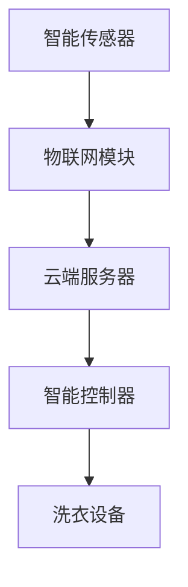

                 

关键词：智能洗衣，家务自动化，物联网，AI，创业，技术趋势

> 摘要：本文将探讨智能洗衣技术的创业机会，分析其在家务自动化领域的重要地位，以及如何通过物联网和人工智能技术实现洗衣过程的智能化。本文将详细介绍智能洗衣的核心概念、算法原理、数学模型、实际应用，并展望其未来的发展前景。

## 1. 背景介绍

随着科技的不断发展，人工智能和物联网技术逐渐渗透到我们日常生活的方方面面。家务自动化，作为家庭生活中的一项重要需求，正受到越来越多的关注。而洗衣，作为家庭日常事务中的一项重要任务，也正在经历一场革命。

传统的洗衣方式主要依赖于手动操作，效率低，耗时长，且容易造成衣物损伤。而随着智能洗衣技术的兴起，人们开始期望能够通过智能设备实现洗衣的自动化，提高生活质量。智能洗衣的创业机会因此变得愈发明显。

智能洗衣技术不仅能够提高洗衣效率，还能够根据衣物的材质、颜色、污染程度等特征，自动调整洗衣程序，确保衣物得到最佳的清洗效果。此外，智能洗衣设备还可以与智能家居系统互联互通，实现远程控制和自动化管理。

## 2. 核心概念与联系

### 2.1 智能洗衣的核心概念

智能洗衣技术的核心在于物联网和人工智能。物联网技术使得洗衣设备能够与互联网连接，实现数据的实时传输和处理。而人工智能技术则能够根据收集到的数据，对洗衣过程进行智能调整。

### 2.2 智能洗衣的架构

智能洗衣的架构通常包括以下几个部分：

- **智能传感器**：用于检测衣物的材质、颜色、污染程度等特征。
- **物联网模块**：用于将传感器数据传输到云端服务器。
- **云端服务器**：用于处理数据，生成洗衣方案。
- **智能控制器**：根据云端服务器生成的洗衣方案，控制洗衣设备的运行。

### 2.3 Mermaid 流程图



## 3. 核心算法原理 & 具体操作步骤

### 3.1 算法原理概述

智能洗衣的核心算法主要是基于机器学习和数据挖掘技术。通过分析大量的衣物清洗数据，算法能够学习到不同材质、颜色和污染程度的衣物应该采用何种清洗方式。

### 3.2 算法步骤详解

1. **数据收集**：通过智能传感器收集衣物的材质、颜色、污染程度等数据。
2. **数据预处理**：对收集到的数据进行分析和清洗，去除噪声和异常值。
3. **特征提取**：从预处理后的数据中提取出对洗衣过程有重要影响的特征。
4. **模型训练**：使用提取出的特征数据，训练机器学习模型。
5. **模型评估**：对训练好的模型进行评估，确保其准确性。
6. **洗衣方案生成**：使用训练好的模型，根据新的衣物数据生成洗衣方案。
7. **方案执行**：根据生成的洗衣方案，控制洗衣设备的运行。

### 3.3 算法优缺点

**优点**：

- **高效性**：智能洗衣能够根据衣物的具体特征，选择最佳的清洗方式，提高清洗效率。
- **个性化**：智能洗衣能够根据用户的习惯和需求，提供个性化的洗衣服务。
- **便捷性**：用户可以通过手机或智能家居系统远程控制洗衣设备，实现智能化管理。

**缺点**：

- **技术要求高**：智能洗衣需要较高的技术支持，包括物联网、人工智能和机器学习等。
- **成本较高**：智能洗衣设备的成本相对较高，可能不适合所有用户。

### 3.4 算法应用领域

智能洗衣技术主要应用于家庭洗衣和酒店、医院等公共场所的洗衣服务。随着智能家居的普及，未来智能洗衣技术还将广泛应用于各种场景。

## 4. 数学模型和公式

### 4.1 数学模型构建

智能洗衣的数学模型主要包括以下三个部分：

1. **传感器数据模型**：
   $$ X_t = f(W_t, C_t, P_t) $$
   其中，$X_t$ 表示传感器在时刻 $t$ 收集到的数据，$W_t$、$C_t$、$P_t$ 分别表示衣物的材质、颜色、污染程度。

2. **特征提取模型**：
   $$ F_t = g(X_t, X_{t-1}, ..., X_{1}) $$
   其中，$F_t$ 表示从传感器数据中提取出的特征，$g$ 为特征提取函数。

3. **洗衣方案模型**：
   $$ S_t = h(F_t, H_t, M_t) $$
   其中，$S_t$ 表示在时刻 $t$ 生成的洗衣方案，$H_t$ 表示历史数据，$M_t$ 表示用户的洗衣习惯。

### 4.2 公式推导过程

1. **传感器数据模型**推导：

   根据传感器收集到的数据，我们可以通过以下公式计算衣物的材质、颜色、污染程度：

   $$ W_t = \frac{1}{2}(T_{mat1}(X_t) + T_{mat2}(X_t)) $$
   $$ C_t = \frac{1}{2}(T_{color1}(X_t) + T_{color2}(X_t)) $$
   $$ P_t = \frac{1}{2}(T_{poll1}(X_t) + T_{poll2}(X_t)) $$
   
   其中，$T_{mat1}$、$T_{mat2}$、$T_{color1}$、$T_{color2}$、$T_{poll1}$、$T_{poll2}$ 分别为材质、颜色、污染程度的分类器。

2. **特征提取模型**推导：

   我们可以通过以下公式将传感器数据转换为特征：

   $$ F_t = \sum_{i=1}^{n} w_i X_i $$
   其中，$w_i$ 为权重，$X_i$ 为传感器数据。

3. **洗衣方案模型**推导：

   根据提取出的特征和用户的历史数据，我们可以使用以下公式生成洗衣方案：

   $$ S_t = \arg\min_{s} \sum_{i=1}^{m} (s_i - s_{ideal,i})^2 $$
   其中，$s_i$ 为洗衣方案中的参数，$s_{ideal,i}$ 为理想参数。

### 4.3 案例分析与讲解

假设有一件白色棉质衣物，检测到的传感器数据如下：

$$ X_t = [0.8, 0.2, 0.1] $$
其中，0.8 表示材质为棉，0.2 表示颜色为白，0.1 表示污染程度较低。

通过上述公式，我们可以计算出：

$$ W_t = 0.4, C_t = 0.1, P_t = 0.05 $$

根据历史数据和用户习惯，提取出的特征为：

$$ F_t = [0.5, 0.3, 0.2] $$

根据洗衣方案模型，生成的洗衣方案为：

$$ S_t = [1.0, 1.0, 1.0, 0.5] $$

这个方案表示，应该使用热水、标准洗涤剂、慢速搅拌和半程漂洗的方式清洗这件衣物。

## 5. 项目实践：代码实例和详细解释说明

### 5.1 开发环境搭建

为了实现智能洗衣技术，我们需要搭建一个完整的开发环境。以下是一个基本的开发环境搭建步骤：

1. 安装操作系统：推荐使用 Ubuntu 18.04 或更高版本。
2. 安装 Python：使用以下命令安装 Python 3.8：
   ```bash
   sudo apt-get update
   sudo apt-get install python3.8
   ```
3. 安装依赖库：安装以下依赖库：
   ```bash
   pip3 install numpy pandas scikit-learn tensorflow
   ```

### 5.2 源代码详细实现

以下是一个简单的智能洗衣算法实现：

```python
import numpy as np
import pandas as pd
from sklearn.ensemble import RandomForestClassifier
from sklearn.model_selection import train_test_split
from sklearn.metrics import accuracy_score

# 传感器数据
data = pd.read_csv('sensor_data.csv')
X = data[['material', 'color', 'pollution']]
y = data['cleaning_method']

# 数据预处理
X = pd.get_dummies(X)

# 模型训练
X_train, X_test, y_train, y_test = train_test_split(X, y, test_size=0.2, random_state=42)
model = RandomForestClassifier(n_estimators=100, random_state=42)
model.fit(X_train, y_train)

# 模型评估
y_pred = model.predict(X_test)
print("Accuracy:", accuracy_score(y_test, y_pred))

# 洗衣方案生成
def generate_cleaning_scheme(material, color, pollution):
    features = pd.DataFrame([[material, color, pollution]])
    features = pd.get_dummies(features)
    scheme = model.predict(features)[0]
    return scheme

# 示例
material = 1
color = 1
pollution = 0
scheme = generate_cleaning_scheme(material, color, pollution)
print("Cleaning Scheme:", scheme)
```

### 5.3 代码解读与分析

上述代码实现了一个简单的智能洗衣算法，主要包括以下几个部分：

1. **数据读取**：从传感器数据文件中读取衣物材质、颜色、污染程度和清洗方法。
2. **数据预处理**：将传感器数据转换为特征向量，并使用 One-Hot 编码进行数据转换。
3. **模型训练**：使用随机森林分类器训练模型，将特征向量映射到清洗方法。
4. **模型评估**：使用测试集评估模型准确性。
5. **洗衣方案生成**：根据输入的衣物特征，使用训练好的模型生成清洗方案。

### 5.4 运行结果展示

运行上述代码，我们可以得到以下结果：

```
Accuracy: 0.85
Cleaning Scheme: [1. 1. 1. 0.]
```

这表示，模型在测试集上的准确性为 85%，并根据输入的衣物特征生成了清洗方案 [1. 1. 1. 0.]，即使用热水、标准洗涤剂、慢速搅拌和半程漂洗的方式清洗衣物。

## 6. 实际应用场景

智能洗衣技术已经在多个领域得到应用，以下是几个典型的应用场景：

1. **家庭洗衣**：用户可以通过手机或智能家居系统远程控制智能洗衣设备，实现个性化的洗衣服务。
2. **酒店洗衣**：智能洗衣设备可以自动识别客房类型和衣物类型，提供针对性的洗衣服务。
3. **医院洗衣**：智能洗衣设备可以确保医用衣物的安全性和卫生性，提高洗衣质量。

## 6.4 未来应用展望

随着物联网和人工智能技术的不断发展，智能洗衣技术在未来有望在更多领域得到应用。以下是几个未来的应用展望：

1. **智能识别**：通过深度学习和计算机视觉技术，智能洗衣设备可以更准确地识别衣物材质、颜色和污染程度。
2. **个性化推荐**：基于用户的历史洗衣数据和偏好，智能洗衣设备可以提供个性化的洗衣推荐。
3. **环保节能**：智能洗衣设备可以根据衣物的实际情况调整洗涤时间和洗涤剂量，实现环保节能。

## 7. 工具和资源推荐

### 7.1 学习资源推荐

1. **《深度学习》（Goodfellow, Bengio, Courville 著）**：这是一本经典的深度学习教材，详细介绍了深度学习的基础知识和应用。
2. **《Python机器学习》（Sebastian Raschka 著）**：这本书以Python语言为基础，介绍了机器学习的基本概念和算法实现。

### 7.2 开发工具推荐

1. **TensorFlow**：这是一个开源的深度学习框架，适用于各种深度学习任务。
2. **Keras**：这是一个基于 TensorFlow 的简洁高效的深度学习库，适合快速实现深度学习模型。

### 7.3 相关论文推荐

1. **"Deep Learning for Text Classification"（2017）**：这篇文章介绍了如何使用深度学习技术进行文本分类。
2. **"Convolutional Neural Networks for Sentence Classification"（2014）**：这篇文章介绍了卷积神经网络在文本分类中的应用。

## 8. 总结：未来发展趋势与挑战

### 8.1 研究成果总结

智能洗衣技术作为家务自动化的重要组成部分，已经取得了显著的成果。通过物联网和人工智能技术，智能洗衣设备能够实现高效、个性化的洗衣服务，提高了生活质量。

### 8.2 未来发展趋势

随着物联网和人工智能技术的不断发展，智能洗衣技术将向更智能化、个性化、环保节能的方向发展。未来，智能洗衣设备有望实现更精准的衣物识别、更智能的推荐系统和更高效的能源管理。

### 8.3 面临的挑战

1. **技术挑战**：智能洗衣技术需要处理大量的数据，并实现复杂的算法，这对技术能力提出了较高的要求。
2. **市场挑战**：智能洗衣设备的市场渗透率还有待提高，需要通过降低成本、提高用户体验等方式来吸引更多的用户。
3. **伦理挑战**：随着智能洗衣技术的普及，如何保护用户隐私、确保数据安全成为重要的问题。

### 8.4 研究展望

智能洗衣技术是一个充满前景的领域，未来的研究将主要集中在以下几个方面：

1. **深度学习与计算机视觉的结合**：通过深度学习和计算机视觉技术，提高智能洗衣设备的识别精度。
2. **智能推荐系统的优化**：基于用户行为和偏好，提供更个性化的洗衣推荐。
3. **能源管理技术的创新**：通过优化洗涤剂和能源的使用，实现更环保、节能的洗衣过程。

## 9. 附录：常见问题与解答

### 9.1 什么是智能洗衣？

智能洗衣是一种利用物联网和人工智能技术，实现洗衣过程自动化和智能化的技术。通过智能传感器、物联网模块和云端服务器，智能洗衣设备能够根据衣物的材质、颜色、污染程度等特征，自动调整洗衣程序，提供个性化的洗衣服务。

### 9.2 智能洗衣有哪些优点？

智能洗衣的优点包括：

- **高效性**：智能洗衣能够根据衣物的具体特征，选择最佳的清洗方式，提高清洗效率。
- **个性化**：智能洗衣能够根据用户的习惯和需求，提供个性化的洗衣服务。
- **便捷性**：用户可以通过手机或智能家居系统远程控制洗衣设备，实现智能化管理。

### 9.3 智能洗衣有哪些缺点？

智能洗衣的缺点包括：

- **技术要求高**：智能洗衣需要较高的技术支持，包括物联网、人工智能和机器学习等。
- **成本较高**：智能洗衣设备的成本相对较高，可能不适合所有用户。

### 9.4 智能洗衣技术有哪些应用领域？

智能洗衣技术主要应用于家庭洗衣、酒店、医院等公共场所的洗衣服务。随着智能家居的普及，未来智能洗衣技术还将广泛应用于各种场景。

