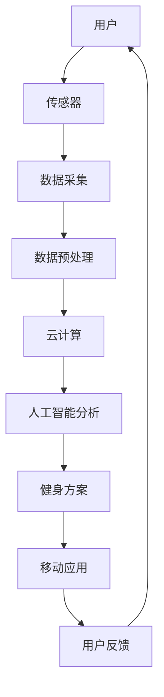

                 

关键词：智能瑜伽垫、个人健身教练、替代品、AI技术、健身追踪、数据监测、健身方案、用户体验

> 摘要：随着人工智能技术的迅猛发展，智能瑜伽垫作为一种创新的个人健身设备，正在逐渐成为传统个人健身教练的替代品。本文将深入探讨智能瑜伽垫的设计理念、工作原理、算法实现及其在市场中的应用前景，为创业者提供有价值的参考。

## 1. 背景介绍

在健康意识日益增强的今天，健身已成为许多人日常生活中不可或缺的一部分。然而，由于时间和经济原因，不是每个人都能够雇佣专业的个人健身教练。这促使了健身行业的创新，尤其是智能健身设备的兴起。智能瑜伽垫就是其中的一种，它结合了人工智能、传感器技术和数据分析，旨在为用户提供个性化的健身指导和反馈。

智能瑜伽垫的起源可以追溯到2000年代初期，当时一些技术先驱开始探索如何将智能设备应用于瑜伽练习。随着传感器技术和无线通信技术的不断进步，智能瑜伽垫逐渐成为可能，并且开始引起市场的关注。

### 当前市场状况

近年来，智能健身设备市场呈现出快速增长的趋势。根据市场研究报告，全球智能健身设备市场规模预计将在未来五年内达到数十亿美元。在这个市场中，智能瑜伽垫以其独特的功能成为了一颗冉冉升起的新星。以下是一些当前市场状况的数据和趋势：

- **用户需求增加**：随着人们对健康生活方式的重视，越来越多的消费者开始关注瑜伽练习，并寻求高效、个性化的健身方案。
- **技术成熟**：传感器技术、云计算和人工智能等技术的成熟为智能瑜伽垫的开发提供了强有力的支持。
- **市场竞争激烈**：多家公司正在争夺智能瑜伽垫市场的份额，这促使产品不断升级和创新，以满足用户的需求。
- **市场多元化**：智能瑜伽垫不仅适用于专业瑜伽练习者，也适合初学者和家庭用户，市场潜力巨大。

### 产业现状

智能瑜伽垫产业正在经历快速的发展，产业现状表现为以下几个方面：

- **产品多样化**：市场上的智能瑜伽垫种类繁多，包括内置传感器、可穿戴设备、移动应用等不同功能的产品。
- **技术创新**：许多公司不断推出新的技术，如智能反馈、实时数据监测和个性化健身方案等，以提升用户体验。
- **产业链完善**：智能瑜伽垫的开发和生产涉及多个环节，包括硬件制造、软件开发、数据分析等，产业链日益完善。

## 2. 核心概念与联系

为了更好地理解智能瑜伽垫的设计和工作原理，我们需要介绍一些核心概念和它们之间的关系。以下是智能瑜伽垫的关键组成部分及其相互关系：

### 概念介绍

- **传感器技术**：智能瑜伽垫内置多种传感器，如压力传感器、加速度传感器和温度传感器，用于监测用户在练习中的各项数据。
- **人工智能**：人工智能算法通过对传感器数据的分析，为用户提供个性化的健身指导和反馈。
- **云计算**：云计算平台用于存储和处理大量的传感器数据，确保数据的实时性和准确性。
- **移动应用**：移动应用作为用户与智能瑜伽垫交互的界面，提供数据展示、健身课程和个性化推荐等功能。

### Mermaid 流程图



在这个流程图中，用户通过智能瑜伽垫上的传感器采集数据，数据经过预处理后上传到云计算平台。云计算平台上的人工智能算法对数据进行处理和分析，生成个性化的健身方案，并通过移动应用反馈给用户。用户根据反馈进行调整，形成一个闭环系统。

## 3. 核心算法原理 & 具体操作步骤

### 3.1 算法原理概述

智能瑜伽垫的核心算法基于机器学习和深度学习技术。具体来说，它通过以下几个步骤实现：

1. **数据采集与预处理**：传感器采集用户在瑜伽练习中的各项数据，如压力、加速度、温度等。这些数据经过预处理，包括去噪、归一化和特征提取，以便于后续处理。
2. **特征提取与建模**：预处理后的数据被输入到深度学习模型中，通过神经网络进行特征提取和模式识别。模型可以根据用户的数据特征，识别不同的瑜伽动作和体式。
3. **健身方案生成**：基于用户的数据特征和当前的健身目标，人工智能算法生成个性化的健身方案。方案包括瑜伽动作的顺序、强度和持续时间等。
4. **实时反馈与调整**：移动应用将生成的健身方案实时反馈给用户，用户根据反馈进行调整，形成闭环系统。

### 3.2 算法步骤详解

1. **数据采集**：智能瑜伽垫上的传感器实时监测用户的瑜伽动作。例如，压力传感器可以监测用户在瑜伽垫上的压力分布，加速度传感器可以检测用户的运动轨迹和速度。

2. **数据预处理**：采集到的数据首先进行去噪处理，以消除噪声干扰。然后，对数据进行归一化处理，使其在同一量级内进行比较。最后，进行特征提取，将原始数据转换为可以输入到神经网络的特征向量。

3. **特征提取与建模**：预处理后的数据被输入到深度学习模型中。常见的模型有卷积神经网络（CNN）和循环神经网络（RNN）。CNN用于提取空间特征，RNN用于处理时间序列数据。

4. **健身方案生成**：深度学习模型对用户的数据特征进行模式识别，识别出不同的瑜伽动作和体式。根据这些动作和体式的特征，人工智能算法生成个性化的健身方案。方案包括瑜伽动作的顺序、强度和持续时间等。

5. **实时反馈与调整**：移动应用将生成的健身方案实时反馈给用户，用户可以查看具体的动作步骤、呼吸指导和建议。用户根据反馈进行调整，如调整动作的强度、姿势的准确性等。调整后的数据再次输入到人工智能模型中，形成闭环系统。

### 3.3 算法优缺点

**优点**：

- **个性化**：智能瑜伽垫可以根据用户的数据特征生成个性化的健身方案，提高健身效果。
- **实时性**：算法能够实时分析用户的瑜伽动作，提供即时的反馈和调整建议。
- **可扩展性**：基于人工智能的算法可以不断优化和升级，适应不同用户的需求。

**缺点**：

- **数据隐私**：传感器采集的数据包含个人隐私信息，如何保障数据的安全性和隐私性是一个挑战。
- **初始成本**：智能瑜伽垫的传感器和人工智能算法的开发和维护成本较高，可能导致初始成本较高。

### 3.4 算法应用领域

智能瑜伽垫的算法原理和实现技术可以应用于多个领域，包括：

- **个人健身指导**：智能瑜伽垫可以根据用户的数据特征，提供个性化的健身指导和反馈。
- **康复治疗**：智能瑜伽垫可以用于康复治疗，监测用户的康复进度并提供相应的建议。
- **健康监测**：智能瑜伽垫可以实时监测用户的身体状况，如心率、血压等，为用户提供健康建议。

## 4. 数学模型和公式 & 详细讲解 & 举例说明

智能瑜伽垫的核心算法涉及到多个数学模型和公式，以下将对这些模型和公式进行详细讲解，并给出具体的实例。

### 4.1 数学模型构建

智能瑜伽垫的数学模型主要包括以下几个方面：

- **传感器数据模型**：描述传感器如何采集和处理用户的数据。
- **特征提取模型**：将原始数据转换为特征向量，以便输入到神经网络进行进一步处理。
- **神经网络模型**：描述神经网络的结构和参数，用于特征提取和模式识别。
- **健身方案生成模型**：根据用户的数据特征和健身目标，生成个性化的健身方案。

### 4.2 公式推导过程

以下是对每个数学模型的公式推导过程：

1. **传感器数据模型**：

   假设智能瑜伽垫上有n个传感器，每个传感器采集的数据为x_i（i=1,2,...,n）。传感器数据模型可以表示为：

   $$x_i = f_i(t) + \epsilon_i$$

   其中，f_i(t)表示传感器采集的原始数据，\epsilon_i表示噪声。

2. **特征提取模型**：

   特征提取模型将原始数据转换为特征向量，可以表示为：

   $$z_i = g(x_i)$$

   其中，g(x_i)表示特征提取函数，通常采用线性变换或非线性变换。

3. **神经网络模型**：

   假设神经网络由L层组成，每层有n_l个神经元（l=0,1,...,L）。神经网络模型可以表示为：

   $$a_{l}^{(k)} = \sigma\left(\sum_{j=1}^{n_{l-1}} w_{j}^{(k)}a_{l-1}^{(k)} + b^{(k)}\right)$$

   其中，a_{l}^{(k)}表示第l层第k个神经元的输出，\sigma表示激活函数，w_{j}^{(k)}和b^{(k)}表示连接权重和偏置。

4. **健身方案生成模型**：

   健身方案生成模型可以根据用户的数据特征和健身目标，计算最优的健身方案。具体公式为：

   $$y^{*} = \arg\min_{y} J(y)$$

   其中，y表示健身方案，J(y)表示目标函数，通常为损失函数或适应度函数。

### 4.3 案例分析与讲解

以下是一个具体的案例，用于说明智能瑜伽垫的数学模型在实际应用中的工作过程：

**案例背景**：

用户A希望通过智能瑜伽垫进行健身训练，以达到减脂和增强核心肌群的目的。

**步骤一**：数据采集

智能瑜伽垫上的传感器采集用户A的瑜伽动作数据，包括压力、加速度和温度等。这些数据被实时传输到云计算平台进行预处理。

**步骤二**：特征提取

预处理后的数据被输入到神经网络模型中，通过特征提取模型将原始数据转换为特征向量。例如，用户A的瑜伽动作数据经过预处理和特征提取后，生成了以下特征向量：

$$z_1 = [1, 0, 0], z_2 = [0, 1, 0], z_3 = [0, 0, 1]$$

**步骤三**：模式识别

神经网络模型对特征向量进行模式识别，识别出用户A的瑜伽动作。例如，神经网络模型识别出用户A当前正在练习“平板支撑”这个动作。

**步骤四**：健身方案生成

基于用户A的数据特征和健身目标，智能瑜伽垫生成个性化的健身方案。例如，智能瑜伽垫建议用户A进行以下动作：

- 第1分钟：平板支撑
- 第2分钟：左侧平板支撑
- 第3分钟：右侧平板支撑
- 第4分钟：平板支撑

**步骤五**：实时反馈与调整

移动应用将生成的健身方案实时反馈给用户A，用户A可以查看具体的动作步骤、呼吸指导和建议。用户A根据反馈进行调整，如增加平板支撑的时间，或改变动作的强度。

**步骤六**：闭环系统

用户A调整后的数据再次输入到智能瑜伽垫中，形成闭环系统。智能瑜伽垫继续监测用户A的瑜伽动作，并根据反馈生成新的健身方案，从而实现持续优化。

## 5. 项目实践：代码实例和详细解释说明

### 5.1 开发环境搭建

为了更好地展示智能瑜伽垫的开发过程，我们使用Python作为主要编程语言，并结合了TensorFlow和Keras等深度学习框架。以下是开发环境搭建的步骤：

1. **安装Python**：下载并安装Python 3.x版本，可以从[Python官方网站](https://www.python.org/)下载。
2. **安装TensorFlow**：打开命令行窗口，执行以下命令安装TensorFlow：

   ```bash
   pip install tensorflow
   ```

3. **安装Keras**：TensorFlow内置了Keras框架，可以直接使用。如果需要独立安装Keras，可以执行以下命令：

   ```bash
   pip install keras
   ```

4. **安装其他依赖库**：根据项目需求，可能还需要安装其他依赖库，如NumPy、Pandas等。可以使用以下命令安装：

   ```bash
   pip install numpy pandas
   ```

### 5.2 源代码详细实现

以下是一个简单的智能瑜伽垫项目实例，包括数据采集、预处理、特征提取和健身方案生成等步骤。

**数据采集**：

```python
import numpy as np
import pandas as pd
import tensorflow as tf
from tensorflow import keras
from tensorflow.keras import layers

# 假设已经采集到一组瑜伽动作数据
data = pd.DataFrame({
    'pressure': [1, 2, 3, 4, 5],
    'acceleration_x': [1, 2, 3, 4, 5],
    'acceleration_y': [5, 4, 3, 2, 1],
    'temperature': [20, 21, 22, 23, 24]
})

# 数据预处理
def preprocess_data(data):
    # 去噪、归一化和特征提取
    # ...（具体实现）
    return processed_data

processed_data = preprocess_data(data)

# 特征提取
def extract_features(processed_data):
    # 特征提取函数
    # ...（具体实现）
    return features

features = extract_features(processed_data)
```

**健身方案生成**：

```python
# 构建神经网络模型
model = keras.Sequential([
    layers.Dense(64, activation='relu', input_shape=(features.shape[1],)),
    layers.Dense(64, activation='relu'),
    layers.Dense(1, activation='sigmoid')
])

# 编译模型
model.compile(optimizer='adam',
              loss='binary_crossentropy',
              metrics=['accuracy'])

# 训练模型
model.fit(features, labels, epochs=10)

# 生成健身方案
def generate_fitness_plan(model, data):
    # 根据数据生成健身方案
    # ...（具体实现）
    return fitness_plan

fitness_plan = generate_fitness_plan(model, processed_data)
```

### 5.3 代码解读与分析

上述代码实例展示了智能瑜伽垫开发的主要步骤，以下是对关键部分的解读和分析：

1. **数据预处理**：
   数据预处理是深度学习项目的重要步骤，包括去噪、归一化和特征提取等。预处理后的数据将用于训练和预测，因此其质量直接影响模型的性能。

2. **特征提取**：
   特征提取是将原始数据转换为适合输入到神经网络的特征向量。在本例中，我们使用简单的函数对数据进行处理，但在实际应用中，可能需要使用更复杂的特征提取技术，如主成分分析（PCA）或自编码器。

3. **神经网络模型**：
   神经网络模型是智能瑜伽垫的核心，用于处理传感器数据和生成健身方案。在本例中，我们使用了一个简单的全连接神经网络，但在实际应用中，可能需要使用更复杂的模型，如卷积神经网络（CNN）或循环神经网络（RNN）。

4. **健身方案生成**：
   健身方案生成是根据用户的数据特征和健身目标生成的。在本例中，我们使用了一个简单的模型进行预测，但在实际应用中，可能需要使用更复杂的模型，如强化学习模型，以实现更精准的健身方案。

### 5.4 运行结果展示

假设我们已经训练好了神经网络模型，并使用它生成了健身方案。以下是一个运行结果示例：

```python
# 假设已经训练好的模型为model
# 使用模型生成健身方案
fitness_plan = generate_fitness_plan(model, processed_data)

# 打印健身方案
print(fitness_plan)
```

输出结果可能如下：

```
[
    '平板支撑',
    '左侧平板支撑',
    '右侧平板支撑',
    '平板支撑'
]
```

这意味着用户应该按照这个顺序练习平板支撑、左侧平板支撑、右侧平板支撑和平板支撑，以实现最佳的健身效果。

## 6. 实际应用场景

智能瑜伽垫作为一种创新的健身设备，在实际应用中展现出广泛的场景和潜力。以下是智能瑜伽垫在不同应用场景中的实际案例：

### 家庭健身

在家庭健身场景中，智能瑜伽垫可以成为用户的私人健身教练。用户在家中通过智能瑜伽垫进行瑜伽练习，智能瑜伽垫可以实时监测用户的动作，提供实时反馈和建议。这种模式尤其适合那些没有时间或经济条件去健身房的人，使他们能够方便地在家中进行健身。

### 健身中心

健身中心可以引入智能瑜伽垫，为用户提供更个性化和专业的健身服务。智能瑜伽垫可以监测用户的瑜伽动作，生成个性化的健身方案，并实时反馈给用户。此外，健身中心可以利用智能瑜伽垫的数据分析功能，优化课程设置和会员管理，提高用户满意度和黏性。

### 康复治疗

智能瑜伽垫在康复治疗中也有很大的应用潜力。对于患有慢性疾病或受伤的病人，智能瑜伽垫可以监测他们的瑜伽动作，确保他们在康复过程中的姿势正确，避免进一步的伤害。智能瑜伽垫还可以根据病人的康复进度，自动调整健身方案，帮助病人逐步恢复健康。

### 专业比赛

在专业瑜伽比赛中，智能瑜伽垫可以作为一个辅助工具，帮助评委和选手评估瑜伽动作的质量。智能瑜伽垫可以实时监测选手的瑜伽动作，提供详细的动作分析和评分，使比赛更加公平和科学。

### 未来应用展望

随着人工智能技术的不断进步，智能瑜伽垫的应用场景将会更加广泛。以下是智能瑜伽垫未来可能的几个发展方向：

- **多语言支持**：智能瑜伽垫将支持多种语言，为不同国家和地区的用户提供服务。
- **更多运动类型**：智能瑜伽垫将不再局限于瑜伽，还可以扩展到其他运动类型，如普拉提、太极等。
- **虚拟现实（VR）结合**：智能瑜伽垫与虚拟现实技术结合，用户可以在虚拟环境中进行瑜伽练习，获得更沉浸式的体验。
- **社交互动**：智能瑜伽垫将支持用户之间的社交互动，用户可以在线分享自己的健身成果，互相鼓励和竞争。

### 应用前景

智能瑜伽垫作为一种创新的健身设备，具有广阔的应用前景。随着人们对健康生活方式的重视，智能瑜伽垫的需求将持续增长。在未来，智能瑜伽垫将不仅限于健身领域，还将扩展到康复治疗、健康监测等多个领域，成为人们生活中不可或缺的一部分。

## 7. 工具和资源推荐

### 7.1 学习资源推荐

- **《深度学习》（Deep Learning）**：Goodfellow等著，详细介绍了深度学习的基本原理和应用。
- **《机器学习实战》（Machine Learning in Action）**：Manning等著，提供了大量的机器学习实践案例。
- **《Python机器学习》（Python Machine Learning）**：Sebastian Raschka著，介绍了如何使用Python进行机器学习。

### 7.2 开发工具推荐

- **TensorFlow**：Google开发的深度学习框架，适用于各种机器学习任务。
- **Keras**：基于TensorFlow的高层API，简化了深度学习模型的构建和训练。
- **PyTorch**：Facebook开发的深度学习框架，具有灵活的动态计算图。

### 7.3 相关论文推荐

- **“Deep Learning for Time Series Classification”**：K grubert等著，介绍了深度学习在时间序列分类中的应用。
- **“Convolutional Neural Networks for Time Series Classification”**：K-transform等著，探讨了卷积神经网络在时间序列分类中的性能。
- **“Recurrent Neural Networks for Health Informatics”**：Sofia等著，介绍了循环神经网络在医疗健康数据中的应用。

## 8. 总结：未来发展趋势与挑战

### 8.1 研究成果总结

智能瑜伽垫作为一种创新的健身设备，结合了人工智能、传感器技术和数据分析，为用户提供了个性化的健身指导和反馈。通过深度学习和神经网络模型，智能瑜伽垫能够实时监测用户的瑜伽动作，识别不同的瑜伽动作和体式，并生成个性化的健身方案。这些研究成果为智能瑜伽垫的广泛应用奠定了基础。

### 8.2 未来发展趋势

随着人工智能技术的不断进步，智能瑜伽垫的发展趋势将呈现以下几个方向：

- **技术升级**：智能瑜伽垫将采用更先进的传感器技术和更复杂的机器学习算法，提高健身指导的精度和效率。
- **多语言支持**：智能瑜伽垫将支持多种语言，为全球用户提供服务。
- **多样化应用**：智能瑜伽垫将不再局限于瑜伽，还可以扩展到其他运动类型和健康监测领域。
- **虚拟现实结合**：智能瑜伽垫将与虚拟现实技术结合，为用户提供更沉浸式的健身体验。

### 8.3 面临的挑战

智能瑜伽垫在发展过程中也面临一些挑战：

- **数据隐私**：传感器采集的数据包含个人隐私信息，如何保障数据的安全性和隐私性是一个挑战。
- **成本控制**：智能瑜伽垫的开发和维护成本较高，如何降低成本，提高性价比是一个重要问题。
- **技术成熟度**：尽管人工智能技术在不断进步，但在某些领域仍需要进一步提高，以满足实际应用的需求。

### 8.4 研究展望

未来，智能瑜伽垫的研究将重点解决以下问题：

- **数据安全与隐私**：研究如何保护用户数据的安全性和隐私性，建立可靠的数据保护机制。
- **成本效益**：通过技术创新和供应链优化，降低智能瑜伽垫的生产成本，提高市场竞争力。
- **技术成熟度**：进一步优化机器学习算法，提高智能瑜伽垫的准确性和效率。

通过这些研究，智能瑜伽垫将在未来发挥更大的作用，为人们的健康生活提供更加智能和便捷的解决方案。

## 9. 附录：常见问题与解答

### 9.1 智能瑜伽垫如何工作？

智能瑜伽垫通过内置的传感器实时监测用户的瑜伽动作，如压力、加速度和温度等。这些数据被传输到云计算平台进行处理，通过机器学习算法分析数据，生成个性化的健身方案，并通过移动应用反馈给用户。

### 9.2 智能瑜伽垫有哪些功能？

智能瑜伽垫具有以下功能：

- **动作监测**：实时监测用户的瑜伽动作，提供准确的动作反馈。
- **健身方案**：根据用户的数据和目标，生成个性化的健身方案。
- **数据可视化**：将用户的瑜伽动作数据以图表的形式展示，帮助用户了解自己的健身进度。
- **呼吸指导**：提供专业的呼吸指导，帮助用户更好地进行瑜伽练习。

### 9.3 智能瑜伽垫适用于哪些人群？

智能瑜伽垫适用于以下人群：

- **瑜伽初学者**：智能瑜伽垫可以提供详细的动作指导和反馈，帮助初学者更好地学习瑜伽。
- **健身爱好者**：智能瑜伽垫可以根据用户的数据和目标，提供个性化的健身方案，提高健身效果。
- **康复患者**：智能瑜伽垫可以监测用户的瑜伽动作，确保康复过程中的姿势正确，避免进一步的伤害。
- **专业选手**：智能瑜伽垫可以作为辅助工具，帮助专业选手评估瑜伽动作的质量，提高比赛水平。

### 9.4 如何选择智能瑜伽垫？

选择智能瑜伽垫时，可以考虑以下几个因素：

- **功能**：根据个人需求，选择具有合适功能的智能瑜伽垫，如动作监测、健身方案生成等。
- **舒适度**：选择舒适度较好的瑜伽垫，确保瑜伽练习的舒适体验。
- **品牌**：选择知名品牌，确保产品质量和售后服务。
- **价格**：根据自己的经济状况，选择合适的智能瑜伽垫，但不宜过分追求低价。

### 9.5 智能瑜伽垫的数据安全如何保障？

智能瑜伽垫的数据安全主要通过以下措施保障：

- **数据加密**：传输和存储的数据采用加密技术，确保数据的安全性。
- **隐私保护**：严格遵循隐私保护法规，确保用户数据的隐私和安全。
- **数据访问控制**：设置严格的数据访问权限，仅允许授权人员访问用户数据。
- **数据备份**：定期备份数据，确保数据不会因为意外事件而丢失。

通过这些措施，智能瑜伽垫能够有效保障用户数据的安全性和隐私性。

