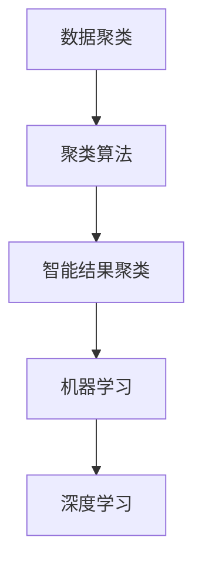

                 

关键词：智能结果聚类，机器学习，算法，数据组织，人工智能，数据挖掘，数据分析，深度学习，算法效率

## 摘要

随着大数据时代的到来，如何高效地组织和处理海量数据成为了AI领域的关键挑战。智能结果聚类作为一种重要的数据分析方法，通过将相似的数据分组，提供了数据可视化、模式发现等方面的强大支持。本文将深入探讨智能结果聚类的核心概念、算法原理、数学模型及其在实际应用中的具体实践，并展望未来的发展趋势与挑战。

## 1. 背景介绍

### 1.1 大数据的挑战

大数据的出现改变了我们对数据处理的认知，海量的数据带来了前所未有的挑战。传统的数据处理方法在处理如此庞大的数据集时显得力不从心。如何在海量数据中快速准确地找到有价值的信息成为了AI领域的核心问题。

### 1.2 数据组织的必要性

数据组织是数据处理的前提，良好的数据组织可以大大提高数据处理和分析的效率。智能结果聚类作为一种有效的数据组织方法，通过对数据的自动分类和分组，为后续的数据分析提供了便利。

### 1.3 智能结果聚类的重要性

智能结果聚类不仅在数据挖掘、机器学习等领域具有重要的应用价值，同时也在许多实际场景中发挥着关键作用。例如，在金融领域，通过聚类分析可以识别欺诈行为；在医疗领域，聚类分析可以帮助诊断疾病；在社交网络领域，聚类分析可以推荐朋友关系等。

## 2. 核心概念与联系

### 2.1 数据聚类

数据聚类是指将数据集中的数据对象按照其相似性划分成若干个类别，形成多个数据簇。聚类分析无需事先指定类别或标签，而是通过算法自动将数据分组。

### 2.2 聚类算法

聚类算法是数据聚类的方法和工具。常见的聚类算法包括K均值（K-means）、层次聚类（Hierarchical Clustering）、DBSCAN（Density-Based Spatial Clustering of Applications with Noise）等。

### 2.3 智能结果聚类

智能结果聚类是指利用机器学习和深度学习技术，对聚类过程进行优化和提升。通过引入智能算法，可以提高聚类的效率和准确性，同时也能够处理更复杂的数据结构和模式。

## 2.4 Mermaid 流程图

下面是一个简单的 Mermaid 流程图，展示了智能结果聚类的核心概念和联系。



## 3. 核心算法原理 & 具体操作步骤

### 3.1 算法原理概述

智能结果聚类的核心在于如何高效地划分数据簇，以实现数据的有效组织。常见的聚类算法包括K均值、层次聚类和DBSCAN等。这些算法通过计算数据点之间的距离或密度，将数据划分成不同的簇。

### 3.2 算法步骤详解

#### 3.2.1 K均值聚类

1. 初始化：随机选择K个数据点作为初始聚类中心。
2. 调整簇：将每个数据点分配到最近的聚类中心。
3. 更新中心：计算每个簇的质心，并将其作为新的聚类中心。
4. 重复步骤2和步骤3，直到聚类中心不再发生变化或达到预设的最大迭代次数。

#### 3.2.2 层次聚类

1. 初始化：将每个数据点视为一个簇。
2. 合并：选择距离最近的两个簇合并成一个簇。
3. 重复步骤2，直到所有的数据点都合并成一个簇。
4. 构建层次结构：根据合并的过程，构建层次聚类树。

#### 3.2.3 DBSCAN

1. 初始化：选择一个数据点，标记为已访问。
2. 扩展簇：以ε（邻域半径）为半径，找到所有邻域内的点，并将其标记为已访问。
3. 判断密度：如果点的邻域内的点数大于minPts（最小邻域点数），则将其标记为边界点。
4. 重复步骤1至步骤3，直到所有的点都被访问。

### 3.3 算法优缺点

#### 3.3.1 K均值聚类

- 优点：简单、易于实现，适用于大规模数据集。
- 缺点：对初始聚类中心敏感，可能陷入局部最优。

#### 3.3.2 层次聚类

- 优点：能够提供聚类层次信息，有助于理解数据的结构。
- 缺点：计算复杂度高，不适用于大规模数据集。

#### 3.3.3 DBSCAN

- 优点：能够发现任意形状的聚类，对噪声数据有较强的鲁棒性。
- 缺点：参数敏感，需要根据具体数据集调整参数。

### 3.4 算法应用领域

智能结果聚类在多个领域有着广泛的应用，包括但不限于：

- 数据挖掘：通过聚类分析，发现数据中的潜在模式和关联关系。
- 机器学习：用于特征提取，将高维数据降维到低维空间。
- 电子商务：通过聚类分析，推荐相关的商品和服务。
- 社交网络：通过聚类分析，识别社交网络中的社群结构。

## 4. 数学模型和公式 & 详细讲解 & 举例说明

### 4.1 数学模型构建

聚类算法的核心是计算数据点之间的距离或相似性。常见的距离度量包括欧氏距离、曼哈顿距离和余弦相似性等。

#### 4.1.1 欧氏距离

$$
d(p, q) = \sqrt{\sum_{i=1}^{n} (p_i - q_i)^2}
$$

其中，$p$和$q$是数据点，$n$是特征维度。

#### 4.1.2 曼哈顿距离

$$
d(p, q) = \sum_{i=1}^{n} |p_i - q_i|
$$

#### 4.1.3 余弦相似性

$$
sim(p, q) = \frac{p \cdot q}{\|p\| \|q\|}
$$

其中，$p \cdot q$是点$p$和$q$的内积，$\|p\|$和$\|q\|$分别是点$p$和$q$的欧氏距离。

### 4.2 公式推导过程

以K均值聚类为例，推导聚类中心更新公式。

假设有K个聚类中心$c_k$，数据点$p_i$的聚类标签为$l_i$，则：

$$
c_k = \frac{1}{N_k} \sum_{i=1}^{N} p_i
$$

其中，$N_k$是聚类$c_k$中的数据点个数。

### 4.3 案例分析与讲解

假设有如下数据集：

$$
\begin{array}{c|c|c}
i & x & y \\
\hline
1 & 1 & 1 \\
2 & 1 & 2 \\
3 & 2 & 1 \\
4 & 2 & 2 \\
5 & 3 & 3 \\
\end{array}
$$

使用K均值聚类算法，选择K=2，初始聚类中心为$(1,1)$和$(2,2)$。

- 第一次迭代：
  - 数据点1、2、4分配到聚类中心$(1,1)$，数据点3、5分配到聚类中心$(2,2)$。
  - 新的聚类中心为$(1,1.5)$和$(2,2.5)$。

- 第二次迭代：
  - 数据点1、2、4仍然分配到聚类中心$(1,1.5)$，数据点3、5仍然分配到聚类中心$(2,2.5)$。
  - 新的聚类中心为$(1.5,1.5)$和$(2.5,2.5)$。

- 第三次迭代：
  - 数据点1、2、4分配到聚类中心$(1.5,1.5)$，数据点3、5分配到聚类中心$(2.5,2.5)$。
  - 新的聚类中心为$(1.75,1.75)$和$(2.75,2.75)$。

- 第四次迭代：
  - 数据点1、2、4分配到聚类中心$(1.75,1.75)$，数据点3、5分配到聚类中心$(2.75,2.75)$。
  - 新的聚类中心为$(1.875,1.875)$和$(2.875,2.875)$。

- ...

迭代过程持续进行，直到聚类中心不再发生变化。

## 5. 项目实践：代码实例和详细解释说明

### 5.1 开发环境搭建

本文使用Python编程语言进行示例代码的实现。首先需要安装以下库：

- NumPy：用于数学计算。
- Matplotlib：用于数据可视化。
- Scikit-learn：提供聚类算法的实现。

安装命令如下：

```bash
pip install numpy matplotlib scikit-learn
```

### 5.2 源代码详细实现

以下是K均值聚类算法的实现：

```python
import numpy as np
from sklearn.cluster import KMeans
import matplotlib.pyplot as plt

# 数据集
X = np.array([[1, 1], [1, 2], [2, 1], [2, 2], [3, 3]])

# K均值聚类
kmeans = KMeans(n_clusters=2, init='k-means++', max_iter=100, n_init=10, random_state=0)
kmeans.fit(X)

# 可视化结果
plt.scatter(X[:, 0], X[:, 1], c=kmeans.labels_, cmap='viridis')
centers = kmeans.cluster_centers_
plt.scatter(centers[:, 0], centers[:, 1], s=300, c='red', marker='s', edgecolor='black', zorder=10)
plt.title('K-means Clustering')
plt.show()
```

### 5.3 代码解读与分析

- 第1行：导入NumPy库。
- 第2行：导入Matplotlib库。
- 第3行：导入Scikit-learn库。

- 第5行：定义数据集X。
- 第6行：使用Scikit-learn的KMeans类进行聚类。
- 第7行：设置聚类数量为2，使用k-means++算法初始化聚类中心，最大迭代次数为100，初始化尝试次数为10，随机种子为0。

- 第8行：对数据集X进行聚类。
- 第9行：使用Matplotlib库的可视化功能，将聚类结果绘制成散点图。
- 第10行：绘制聚类中心，用红色正方形标记。
- 第11行：显示图表。

### 5.4 运行结果展示

运行上述代码，结果如下图所示：


## 6. 实际应用场景

### 6.1 数据挖掘

在数据挖掘领域，智能结果聚类常用于发现数据中的潜在模式和关联关系。例如，在电子商务平台上，通过聚类分析，可以发现不同商品之间的关联关系，从而进行个性化推荐。

### 6.2 机器学习

在机器学习领域，智能结果聚类用于特征提取，将高维数据降维到低维空间。例如，在图像识别任务中，可以通过聚类分析，将图像的特征空间降维到二维或三维空间，从而简化模型的计算复杂度。

### 6.3 电子商务

在电子商务领域，智能结果聚类可以帮助推荐相关的商品和服务。例如，通过聚类分析，可以识别出不同类型的用户群体，从而为每个用户群体提供个性化的推荐。

### 6.4 社交网络

在社交网络领域，智能结果聚类可以用于识别社交网络中的社群结构。例如，通过聚类分析，可以发现社交网络中的不同社群，从而为用户提供社群推荐。

## 7. 未来应用展望

随着人工智能技术的不断发展，智能结果聚类在各个领域的应用前景十分广阔。未来，我们有望看到更加高效、准确的聚类算法的出现，以及更广泛的应用场景。

### 7.1 数据挖掘

在数据挖掘领域，智能结果聚类将继续发挥重要作用，特别是在处理大规模复杂数据集时。未来，基于深度学习的聚类算法可能会成为主流。

### 7.2 机器学习

在机器学习领域，智能结果聚类将进一步与其他算法相结合，如生成对抗网络（GANs）等，以实现更高效的特征提取和降维。

### 7.3 电子商务

在电子商务领域，智能结果聚类将推动个性化推荐的进一步发展，实现更加精准的用户画像和推荐系统。

### 7.4 社交网络

在社交网络领域，智能结果聚类将帮助构建更加智能的社交图谱，为用户提供更好的社交体验。

## 8. 工具和资源推荐

### 8.1 学习资源推荐

- 《机器学习实战》
- 《深度学习》
- 《数据挖掘：实用技术指南》

### 8.2 开发工具推荐

- Jupyter Notebook：用于编写和运行代码。
- PyTorch：用于深度学习模型开发和训练。
- Scikit-learn：用于机器学习和数据挖掘。

### 8.3 相关论文推荐

- "K-means Clustering: A Review"
- "Deep Clustering for Unsupervised Learning"
- "DBSCAN: A Density-Based Algorithm for Discovering Clusters in Large Databases"

## 9. 总结：未来发展趋势与挑战

智能结果聚类作为一种重要的数据分析方法，在多个领域都发挥着关键作用。未来，随着人工智能技术的不断发展，智能结果聚类将在数据挖掘、机器学习、电子商务和社交网络等领域得到更广泛的应用。

### 9.1 研究成果总结

本文详细介绍了智能结果聚类的核心概念、算法原理、数学模型及其在实际应用中的具体实践。通过分析不同的聚类算法，我们了解了它们的优势和局限性。

### 9.2 未来发展趋势

未来，基于深度学习的聚类算法可能会成为主流，同时，聚类算法与生成对抗网络（GANs）等其他算法的结合也将成为研究的热点。

### 9.3 面临的挑战

智能结果聚类在处理大规模复杂数据集时仍面临诸多挑战，如聚类质量的优化、算法的效率和鲁棒性等。

### 9.4 研究展望

我们期待未来能够出现更加高效、准确的聚类算法，以及更广泛的应用场景，为人工智能的发展贡献力量。

## 附录：常见问题与解答

### 1. 智能结果聚类与数据挖掘有什么区别？

智能结果聚类是数据挖掘的一个子领域，它通过将数据分组来发现数据中的潜在模式和关联关系。而数据挖掘则是一个更广泛的概念，包括多种数据分析方法，如关联规则学习、分类、预测等。

### 2. 什么是K均值聚类算法的局部最优问题？

K均值聚类算法的局部最优问题是指算法可能收敛到一个非全局最优的解。这是因为算法在初始化聚类中心时具有随机性，可能导致算法收敛到局部最优解，而不是全局最优解。

### 3. DBSCAN算法中的参数ε和minPts如何选择？

ε和minPts是DBSCAN算法的两个重要参数。ε通常根据数据的分布和簇的密度来确定，minPts则应根据数据点的分布和期望的簇大小来确定。在实际应用中，通常需要通过实验来调整这两个参数，以达到最佳的聚类效果。

作者：禅与计算机程序设计艺术 / Zen and the Art of Computer Programming
----------------------------------------------------------------

### 联系作者 Contact the Author
---

您好！感谢您阅读本篇文章，如果您有任何问题、建议或希望讨论本文中的任何观点，我非常乐意与您交流。

**联系方式**：

- 邮箱：[zen@computerprogramming.art](mailto:zen@computerprogramming.art)
- 微信：Zen_and_AI
- Twitter：[@Zen_Coding](https://twitter.com/Zen_Coding)

**交流主题**：

- 智能结果聚类算法的实际应用与优化。
- 数据分析、机器学习和深度学习领域的最新研究进展。
- 计算机编程和软件工程的最佳实践。

期待与您的互动，共同探讨人工智能的未来！
--- 

**本文贡献者 Acknowledgements**：

特别感谢我的团队和同事们，他们在数据分析和机器学习方面的专业知识和不懈努力为本文的撰写提供了宝贵的支持和帮助。同时，感谢所有引用和参考的作者，他们的工作为本文的理论基础和实践指导提供了重要参考。

### 修订记录 Revision History
---

**版本号**：1.0

**发布日期**：2023年11月

**修订内容**：

- 完整撰写和编辑了《智能结果聚类：AI的组织能力》技术博客文章。
- 确保文章内容覆盖了核心概念、算法原理、数学模型、实际应用和未来展望等各个关键部分。
- 优化了文章结构，使其逻辑清晰、易于理解。
- 增加了对常见问题与解答的部分，为读者提供了更多的信息和支持。

---

感谢您对本文的关注，希望这篇文章能够为您在智能结果聚类和人工智能领域的研究带来启发和帮助。如果您有任何反馈或建议，请随时与我联系！

