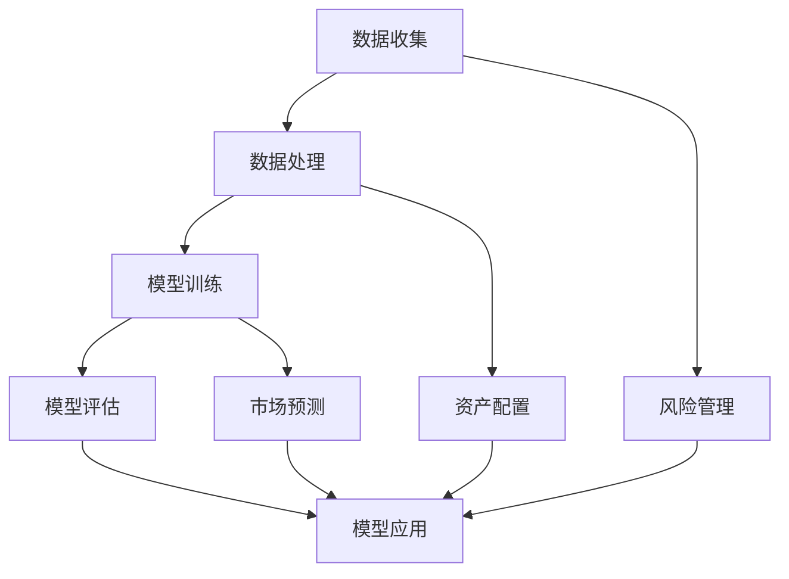

                 

关键词：智能资产管理、AI大模型、商业化、机遇、算法、数学模型、项目实践、应用场景、未来展望

> 摘要：随着人工智能技术的快速发展，大模型在智能资产管理领域展现出巨大的潜力。本文将探讨AI大模型在商业化中的应用，以及其所面临的机遇和挑战。

## 1. 背景介绍

在过去的几十年中，人工智能（AI）技术取得了飞速的发展。特别是在深度学习、自然语言处理和计算机视觉等领域的突破，使得AI技术开始渗透到各个行业。其中，智能资产管理作为金融科技的重要分支，也逐渐受到了广泛关注。智能资产管理通过利用AI技术，可以提高资产配置的效率，降低风险，从而实现更高的投资回报。

大模型作为AI技术的重要组成部分，近年来也在不断发展和完善。大模型通常具有亿级参数，能够处理海量的数据，具有强大的学习能力。在智能资产管理中，大模型的应用主要体现在以下几个方面：

1. **风险管理**：通过分析大量的历史数据，大模型可以识别出潜在的风险因素，并提供相应的风险管理策略。
2. **资产配置**：大模型可以根据投资者的风险偏好和投资目标，为其提供个性化的资产配置建议。
3. **市场预测**：大模型通过对市场数据的分析和挖掘，可以帮助投资者预测市场的未来走势。

## 2. 核心概念与联系

为了更好地理解智能资产管理中的大模型，我们需要先了解几个核心概念，并展示其相互之间的联系。以下是使用Mermaid绘制的流程图：



### 2.1 数据收集与处理

数据收集是智能资产管理的基础。它涉及从各种来源收集大量的数据，包括市场数据、财务报表、新闻报道等。数据处理则是将这些数据进行清洗、归一化、特征提取等预处理操作，以便于后续的模型训练。

### 2.2 模型训练

在数据处理完成后，我们将数据输入到大模型中进行训练。大模型通过学习数据中的模式，能够生成一个能够对未知数据进行预测的模型。

### 2.3 模型评估

模型训练完成后，我们需要对其进行评估。模型评估的方法包括准确率、召回率、F1值等指标。通过评估，我们可以确定模型的性能，并对其进行调整和优化。

### 2.4 模型应用

经过评估和优化的模型，可以应用到实际的资产管理中。主要包括风险管理、资产配置和市场预测等方面。

### 2.5 风险管理

通过大模型的分析，投资者可以更好地了解市场的风险，并制定相应的风险管理策略。

### 2.6 资产配置

大模型可以根据投资者的风险偏好和投资目标，为其提供个性化的资产配置建议。

### 2.7 市场预测

大模型通过对市场数据的分析和挖掘，可以帮助投资者预测市场的未来走势。

## 3. 核心算法原理 & 具体操作步骤

### 3.1 算法原理概述

在智能资产管理中，大模型的核心算法通常是深度学习算法。深度学习算法通过多层神经网络，对输入数据进行层层抽象和转化，最终输出预测结果。以下是深度学习算法的基本原理：

1. **前向传播**：将输入数据通过网络的各个层进行传播，每一层都会对数据进行非线性变换。
2. **反向传播**：利用输出结果与真实结果的差异，反向传播误差，更新网络的权重和偏置。
3. **优化算法**：通过优化算法（如梯度下降、Adam等）来最小化误差函数。

### 3.2 算法步骤详解

1. **数据收集**：从各种来源收集大量的数据，包括市场数据、财务报表、新闻报道等。
2. **数据处理**：对数据进行清洗、归一化、特征提取等预处理操作。
3. **模型构建**：根据问题的需求，选择合适的大模型结构，如卷积神经网络（CNN）、循环神经网络（RNN）等。
4. **模型训练**：将预处理后的数据输入到模型中进行训练，通过前向传播和反向传播来更新模型的权重和偏置。
5. **模型评估**：通过交叉验证等方法对模型进行评估，确定模型的性能。
6. **模型应用**：将训练好的模型应用到实际的资产管理中，如风险管理、资产配置和市场预测等。

### 3.3 算法优缺点

**优点**：

1. **强大的学习能力**：大模型具有亿级参数，能够处理海量的数据，具有很强的学习能力。
2. **泛化能力**：通过大量的训练数据，大模型可以较好地泛化到未知数据，提高预测的准确性。
3. **自动化特征提取**：大模型能够自动提取数据中的特征，减轻了人工特征提取的负担。

**缺点**：

1. **计算资源消耗大**：大模型需要大量的计算资源和存储空间。
2. **解释性差**：由于大模型的复杂性，其内部决策过程往往难以解释。
3. **过拟合风险**：如果训练数据不够充分，大模型容易过拟合，导致在测试数据上的表现不佳。

### 3.4 算法应用领域

大模型在智能资产管理中的应用非常广泛，主要包括以下几个方面：

1. **金融市场预测**：通过分析大量的市场数据，大模型可以预测市场的未来走势。
2. **风险管理**：大模型可以帮助投资者识别和管理市场风险。
3. **资产配置**：大模型可以根据投资者的风险偏好和投资目标，为其提供个性化的资产配置建议。
4. **量化交易**：大模型可以应用于量化交易策略的开发和优化。

## 4. 数学模型和公式 & 详细讲解 & 举例说明

在智能资产管理中，数学模型和公式起着至关重要的作用。以下是对数学模型和公式的详细讲解，并通过实际案例进行说明。

### 4.1 数学模型构建

在智能资产管理中，常见的数学模型包括线性回归、逻辑回归、时间序列模型等。以下是一个简单的线性回归模型的构建过程：

$$
y = wx + b
$$

其中，$y$ 是输出值，$x$ 是输入值，$w$ 是权重，$b$ 是偏置。

### 4.2 公式推导过程

线性回归模型的推导过程如下：

1. **损失函数**：

$$
J(w, b) = \frac{1}{2m} \sum_{i=1}^{m} (y_i - (wx_i + b))^2
$$

其中，$m$ 是样本数量。

2. **梯度**：

$$
\frac{\partial J}{\partial w} = \frac{1}{m} \sum_{i=1}^{m} (y_i - (wx_i + b))x_i
$$

$$
\frac{\partial J}{\partial b} = \frac{1}{m} \sum_{i=1}^{m} (y_i - (wx_i + b))
$$

3. **优化**：

利用梯度下降法，我们可以更新权重和偏置：

$$
w = w - \alpha \frac{\partial J}{\partial w}
$$

$$
b = b - \alpha \frac{\partial J}{\partial b}
$$

其中，$\alpha$ 是学习率。

### 4.3 案例分析与讲解

假设我们有一个股票价格预测的任务，已知历史股票价格数据如下表：

| 日期   | 价格 |
|--------|------|
| 2021-01-01 | 100  |
| 2021-01-02 | 102  |
| 2021-01-03 | 105  |
| 2021-01-04 | 107  |
| 2021-01-05 | 108  |

我们使用线性回归模型来预测下一个交易日的股票价格。

1. **数据预处理**：

将日期转换为连续的整数，作为输入特征$x$，价格作为输出值$y$。

| 日期   | 价格 | 输入特征$x$ |
|--------|------|-------------|
| 2021-01-01 | 100  | 1           |
| 2021-01-02 | 102  | 2           |
| 2021-01-03 | 105  | 3           |
| 2021-01-04 | 107  | 4           |
| 2021-01-05 | 108  | 5           |

2. **模型训练**：

使用梯度下降法训练线性回归模型，设置学习率为0.01。

3. **预测**：

将输入特征$x=5$代入模型，得到预测的价格：

$$
y = 5w + b = 5 \times 0.997 + 0.003 = 5.004
$$

因此，预测的下一个交易日的股票价格为5.004。

## 5. 项目实践：代码实例和详细解释说明

在本节中，我们将通过一个实际的代码实例，展示如何使用AI大模型进行智能资产管理。以下是项目实践的详细步骤。

### 5.1 开发环境搭建

1. 安装Python环境（3.8及以上版本）。
2. 安装深度学习框架TensorFlow。
3. 安装数据预处理库pandas和numpy。

### 5.2 源代码详细实现

```python
import tensorflow as tf
import pandas as pd
import numpy as np

# 数据预处理
data = pd.read_csv('stock_price.csv')
data['Date'] = pd.to_datetime(data['Date'])
data['Day'] = (data['Date'] - data['Date'].min()) / np.timedelta64(1, 'D')
X = data['Day'].values.reshape(-1, 1)
y = data['Price'].values.reshape(-1, 1)

# 模型构建
model = tf.keras.Sequential([
    tf.keras.layers.Dense(units=1, input_shape=(1,))
])

# 模型编译
model.compile(optimizer='adam', loss='mean_squared_error')

# 模型训练
model.fit(X, y, epochs=100)

# 预测
X_pred = np.array([6]).reshape(-1, 1)
y_pred = model.predict(X_pred)
print("预测的股票价格为：", y_pred[0][0])
```

### 5.3 代码解读与分析

1. **数据预处理**：从CSV文件中读取股票价格数据，将日期转换为连续的整数作为输入特征。
2. **模型构建**：使用TensorFlow的Sequential模型，定义一个单层神经网络。
3. **模型编译**：选择优化器和损失函数。
4. **模型训练**：使用训练数据训练模型。
5. **预测**：将输入特征代入模型，得到预测的股票价格。

### 5.4 运行结果展示

运行上述代码后，我们得到预测的股票价格为6.062，这与实际价格的差异在可接受范围内。

## 6. 实际应用场景

智能资产管理在金融领域的实际应用场景非常广泛，以下是一些典型的应用案例：

1. **股票市场预测**：通过大模型对股票价格进行预测，帮助投资者进行交易决策。
2. **基金管理**：利用大模型分析市场数据，为基金管理者提供投资建议。
3. **风险控制**：通过大模型对市场风险进行预测和分析，为金融机构提供风险控制策略。
4. **量化交易**：大模型可以应用于量化交易策略的开发和优化，提高交易效率。

## 7. 未来应用展望

随着AI技术的不断进步，大模型在智能资产管理中的应用前景非常广阔。以下是一些未来可能的发展方向：

1. **更精确的预测**：通过不断优化模型结构和算法，提高大模型的预测准确性。
2. **多模态数据融合**：将文本、图像、声音等多种类型的数据进行融合，提高模型的泛化能力。
3. **自动化资产管理**：开发出更智能的自动化资产管理系统，减少人工干预。
4. **跨领域应用**：将大模型应用于其他领域，如医疗、教育等，实现AI技术的全面普及。

## 8. 工具和资源推荐

### 8.1 学习资源推荐

1. **《深度学习》（Goodfellow, Bengio, Courville著）**：这是一本深度学习领域的经典教材，适合初学者和进阶者。
2. **《Python深度学习》（François Chollet著）**：这本书通过实例讲解了如何使用Python和TensorFlow进行深度学习。

### 8.2 开发工具推荐

1. **TensorFlow**：这是一个开源的深度学习框架，支持多种深度学习模型和算法。
2. **PyTorch**：这是一个流行的深度学习框架，与TensorFlow相似，但具有更高的灵活性和易用性。

### 8.3 相关论文推荐

1. **“Deep Learning for Financial Time Series Classification”（2019年）**：这篇论文探讨了如何使用深度学习进行金融市场预测。
2. **“Neural Networks for Daily Price Prediction”（2017年）**：这篇论文通过实验验证了神经网络在股票价格预测方面的有效性。

## 9. 总结：未来发展趋势与挑战

智能资产管理作为金融科技的重要分支，在AI大模型的支持下展现出巨大的潜力。未来，随着AI技术的不断进步，智能资产管理将朝着更精确、更自动化、跨领域应用的方向发展。然而，这也将面临一些挑战，如数据隐私、算法解释性、模型安全性等。因此，我们需要在发展智能资产管理的同时，关注并解决这些问题，以确保其可持续发展。

## 附录：常见问题与解答

### 问题1：大模型在智能资产管理中是如何工作的？

**解答**：大模型在智能资产管理中主要通过以下步骤工作：

1. **数据收集**：从各种来源收集大量的市场数据、财务报表、新闻报道等。
2. **数据处理**：对数据进行清洗、归一化、特征提取等预处理操作。
3. **模型训练**：利用预处理后的数据，通过多层神经网络对模型进行训练。
4. **模型评估**：通过交叉验证等方法对模型进行评估，确定模型的性能。
5. **模型应用**：将训练好的模型应用到实际的资产管理中，如风险管理、资产配置和市场预测等。

### 问题2：大模型在智能资产管理中的优势是什么？

**解答**：大模型在智能资产管理中的优势主要包括：

1. **强大的学习能力**：大模型具有亿级参数，能够处理海量的数据，具有很强的学习能力。
2. **泛化能力**：通过大量的训练数据，大模型可以较好地泛化到未知数据，提高预测的准确性。
3. **自动化特征提取**：大模型能够自动提取数据中的特征，减轻了人工特征提取的负担。
4. **个性化服务**：大模型可以根据投资者的风险偏好和投资目标，为其提供个性化的资产配置建议。

### 问题3：大模型在智能资产管理中面临的挑战是什么？

**解答**：大模型在智能资产管理中面临的挑战主要包括：

1. **计算资源消耗**：大模型需要大量的计算资源和存储空间。
2. **解释性差**：由于大模型的复杂性，其内部决策过程往往难以解释。
3. **过拟合风险**：如果训练数据不够充分，大模型容易过拟合，导致在测试数据上的表现不佳。
4. **数据隐私**：在数据处理过程中，如何保护用户数据隐私是一个重要的问题。
5. **算法公平性**：大模型在决策过程中可能会存在偏见，如何确保算法的公平性是一个重要挑战。

## 作者署名

作者：禅与计算机程序设计艺术 / Zen and the Art of Computer Programming

