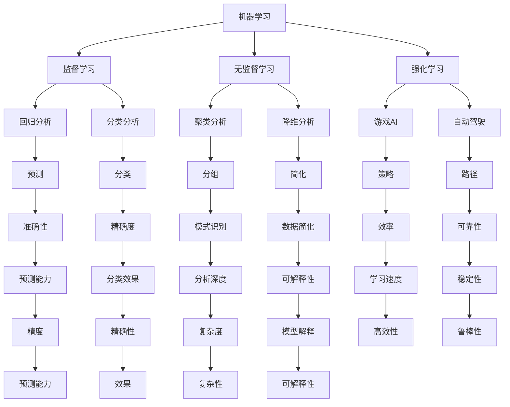

                 

 关键词：人工智能，AI发展，新驱动力，机器学习，深度学习，自然语言处理，计算机视觉，神经网络，强化学习，量子计算，边缘计算，人机交互，数据隐私，自动化，行业应用

> 摘要：本文将深入探讨未来AI发展的新驱动力，包括机器学习、深度学习、自然语言处理、计算机视觉、强化学习等领域的关键技术进展和未来趋势，以及量子计算、边缘计算等新兴技术的应用前景。同时，文章还将分析AI技术在行业应用中的潜力和挑战，为读者提供对AI未来发展方向的全面理解。

## 1. 背景介绍

人工智能（Artificial Intelligence，AI）作为计算机科学的一个分支，其核心目标是使计算机能够执行通常需要人类智能的任务，如视觉识别、语言理解、决策制定等。随着计算能力的提升、算法的进步以及海量数据的积累，AI技术在过去几十年里取得了显著的进展。从早期的规则系统到基于统计模型的机器学习，再到近年来的深度学习和神经网络，AI技术的应用领域越来越广泛。

当前，AI技术已经在多个领域展现出巨大的潜力，如自动驾驶、医疗诊断、金融分析、智能客服、智能家居等。同时，随着技术的不断成熟，AI的发展也面临着新的挑战，包括数据隐私、伦理问题、计算资源需求等。为了应对这些挑战，研究人员和开发者正在探索新的技术和方法，推动AI向更高层次发展。

## 2. 核心概念与联系

### 2.1. 机器学习

机器学习（Machine Learning，ML）是AI的核心技术之一，它通过构建数学模型来分析数据，从而让计算机从数据中学习并做出预测或决策。机器学习的主要类型包括监督学习、无监督学习和强化学习。

**监督学习**：有标签数据训练模型，如回归分析和分类任务。

**无监督学习**：无标签数据，如聚类分析和降维。

**强化学习**：通过与环境的交互来学习策略，如游戏AI和自动驾驶。

### 2.2. 深度学习

深度学习（Deep Learning，DL）是机器学习的一个子领域，它利用多层神经网络（如卷积神经网络（CNN）、循环神经网络（RNN）等）来提取特征并进行复杂的数据分析。深度学习在图像识别、语音识别和自然语言处理等领域取得了显著成果。

### 2.3. 自然语言处理

自然语言处理（Natural Language Processing，NLP）是AI的一个重要分支，旨在使计算机能够理解和生成人类语言。NLP技术包括语言模型、词性标注、情感分析、机器翻译等。

### 2.4. 计算机视觉

计算机视觉（Computer Vision，CV）是AI的另一个关键领域，它让计算机能够从图像或视频中提取信息。计算机视觉技术应用于人脸识别、图像分类、目标检测等任务。

### 2.5. 强化学习

强化学习（Reinforcement Learning，RL）是一种机器学习方法，它通过奖励机制来训练模型，使其能够从环境中学习策略。强化学习在游戏AI、机器人控制等领域有广泛应用。

### 2.6. Mermaid 流程图



## 3. 核心算法原理 & 具体操作步骤

### 3.1. 算法原理概述

机器学习算法的核心在于构建一个可以自我改进的模型。模型通过学习输入和输出之间的映射关系，来预测新的输入值。这个过程包括数据预处理、模型选择、训练和评估等步骤。

**数据预处理**：将数据清洗、归一化和特征提取，以便模型可以更好地学习。

**模型选择**：选择适合任务的模型，如线性回归、决策树、支持向量机等。

**训练**：使用训练数据来调整模型的参数，使其能够准确预测。

**评估**：使用测试数据来评估模型的性能，如准确率、召回率等。

### 3.2. 算法步骤详解

1. **数据收集**：收集用于训练和测试的数据集。
2. **数据预处理**：清洗数据，处理缺失值，进行特征提取。
3. **模型选择**：根据任务特点选择合适的模型。
4. **模型训练**：使用训练数据调整模型参数。
5. **模型评估**：使用测试数据评估模型性能。
6. **模型优化**：根据评估结果调整模型参数。
7. **模型部署**：将模型部署到实际应用环境中。

### 3.3. 算法优缺点

**优点**：
- **自动化**：机器学习可以自动化数据处理和模式识别。
- **泛化能力**：模型可以适用于不同的任务和数据集。
- **高性能**：机器学习算法在处理大规模数据时表现出高效性。

**缺点**：
- **数据依赖**：需要大量高质量的数据。
- **可解释性**：深度学习模型往往缺乏透明度和可解释性。
- **计算资源需求**：训练大型模型需要大量的计算资源。

### 3.4. 算法应用领域

- **图像识别**：用于人脸识别、自动驾驶等。
- **自然语言处理**：用于机器翻译、情感分析等。
- **金融分析**：用于风险评估、投资组合优化等。
- **医疗诊断**：用于疾病预测、辅助诊断等。

## 4. 数学模型和公式 & 详细讲解 & 举例说明

### 4.1. 数学模型构建

在机器学习中，常用的数学模型包括线性回归、逻辑回归、支持向量机等。以下是这些模型的简要介绍：

**线性回归**：

- 公式：\( y = \beta_0 + \beta_1 x \)
- 目标：预测连续值输出。

**逻辑回归**：

- 公式：\( P(y=1) = \frac{1}{1 + e^{-(\beta_0 + \beta_1 x)}} \)
- 目标：预测概率。

**支持向量机**：

- 公式：\( w \cdot x - b = 0 \)
- 目标：分类问题。

### 4.2. 公式推导过程

**线性回归**：

1. **最小二乘法**：通过最小化残差平方和来求解模型参数。
2. **偏导数法**：对目标函数求偏导数，并令其为零。

**逻辑回归**：

1. **极大似然估计**：最大化似然函数来求解模型参数。
2. **迭代优化**：使用梯度上升法或牛顿法来优化模型参数。

**支持向量机**：

1. **拉格朗日乘子法**：通过构建拉格朗日函数来求解模型参数。
2. **对偶问题**：将原始问题转换为对偶问题，并使用SVM分类器。

### 4.3. 案例分析与讲解

**案例**：使用线性回归模型预测房价。

1. **数据收集**：收集房价和特征数据。
2. **数据预处理**：进行归一化处理。
3. **模型训练**：使用训练数据训练线性回归模型。
4. **模型评估**：使用测试数据评估模型性能。
5. **模型优化**：根据评估结果调整模型参数。
6. **模型部署**：将模型部署到实际应用环境中。

## 5. 项目实践：代码实例和详细解释说明

### 5.1. 开发环境搭建

- Python 3.8 或以上版本
- Jupyter Notebook 或 PyCharm
- TensorFlow 或 Scikit-learn 库

### 5.2. 源代码详细实现

```python
# 导入所需库
import numpy as np
import tensorflow as tf
from sklearn.model_selection import train_test_split
from sklearn.preprocessing import StandardScaler

# 数据收集
# 这里使用 sklearn 中的 Boston 数据集
from sklearn.datasets import load_boston
boston = load_boston()
X = boston.data
y = boston.target

# 数据预处理
X_train, X_test, y_train, y_test = train_test_split(X, y, test_size=0.2, random_state=42)
scaler = StandardScaler()
X_train = scaler.fit_transform(X_train)
X_test = scaler.transform(X_test)

# 模型训练
model = tf.keras.Sequential([
    tf.keras.layers.Dense(units=1, input_shape=(X_train.shape[1],))
])
model.compile(optimizer='sgd', loss='mean_squared_error')
model.fit(X_train, y_train, epochs=100)

# 模型评估
mse = model.evaluate(X_test, y_test)
print(f'MSE: {mse}')

# 模型预测
predictions = model.predict(X_test)
```

### 5.3. 代码解读与分析

这段代码首先导入了必要的库，然后使用了 sklearn 中的 Boston 数据集进行数据收集。数据预处理步骤包括数据拆分和特征标准化。在模型训练部分，我们使用 TensorFlow 构建了一个简单的线性回归模型，并使用随机梯度下降（SGD）进行优化。模型评估部分计算了均方误差（MSE），用于评估模型性能。最后，代码展示了如何使用训练好的模型进行预测。

## 6. 实际应用场景

AI技术在各个行业中的应用日益广泛，下面列举一些典型的应用场景：

- **医疗**：AI技术在医疗诊断、药物研发、患者管理等方面有广泛应用。例如，使用深度学习进行医学图像分析，可以提高诊断准确率。
- **金融**：AI技术在风险评估、投资策略、欺诈检测等方面具有显著优势。例如，使用强化学习算法优化投资组合，提高投资回报。
- **制造业**：AI技术在智能制造、故障预测、供应链优化等方面发挥着重要作用。例如，通过计算机视觉技术实现自动化生产线，提高生产效率和产品质量。
- **零售**：AI技术在客户分析、个性化推荐、库存管理等方面具有潜力。例如，使用机器学习算法分析客户行为，实现精准营销。

### 6.4. 未来应用展望

随着AI技术的不断进步，未来的应用场景将更加广泛和深入。以下是一些可能的未来应用方向：

- **智能家居**：AI技术将使智能家居更加智能化和便捷化，实现真正的智能家居生活。
- **自动驾驶**：自动驾驶技术将得到广泛应用，减少交通事故，提高交通效率。
- **教育**：AI技术在教育领域的应用将变得更加普及，实现个性化教学和自适应学习。
- **环境保护**：AI技术可以用于环境保护，如智能监测水质和空气质量，及时预警和应对环境问题。

## 7. 工具和资源推荐

### 7.1. 学习资源推荐

- **书籍**：《深度学习》、《机器学习实战》、《Python机器学习》等。
- **在线课程**：Coursera、edX、Udacity等平台上的AI相关课程。
- **开源项目**：GitHub、GitLab等平台上丰富的AI开源项目。

### 7.2. 开发工具推荐

- **编程环境**：Jupyter Notebook、PyCharm、Visual Studio Code等。
- **机器学习框架**：TensorFlow、PyTorch、Scikit-learn等。
- **数据可视化工具**：Matplotlib、Seaborn、Plotly等。

### 7.3. 相关论文推荐

- **《Deep Learning》**：Ian Goodfellow, Yoshua Bengio, Aaron Courville。
- **《Reinforcement Learning: An Introduction》**：Richard S. Sutton, Andrew G. Barto。
- **《Natural Language Processing with Python》**：Steven Bird, Ewan Klein, Edward Loper。

## 8. 总结：未来发展趋势与挑战

### 8.1. 研究成果总结

- 机器学习、深度学习等AI技术在多个领域取得了显著成果。
- 自然语言处理、计算机视觉等AI应用日益成熟。
- 量子计算、边缘计算等新兴技术为AI发展提供了新的机遇。

### 8.2. 未来发展趋势

- AI将更加智能化和个性化。
- AI技术将在更多行业得到应用，推动产业升级。
- 新兴技术如量子计算、边缘计算等将加速AI发展。

### 8.3. 面临的挑战

- 数据隐私和伦理问题。
- 计算资源需求。
- AI的可解释性和透明度。

### 8.4. 研究展望

- 继续探索AI与其他领域的交叉应用。
- 加强AI算法的优化和可解释性。
- 推动AI技术向更广泛的应用场景发展。

## 9. 附录：常见问题与解答

### 问题 1：什么是机器学习？

**回答**：机器学习是一种通过数据驱动的方式进行学习和预测的技术，它让计算机从数据中学习规律，并利用这些规律进行预测或决策。

### 问题 2：什么是深度学习？

**回答**：深度学习是一种利用多层神经网络进行数据分析和预测的机器学习技术，它在图像识别、语音识别等领域取得了显著成果。

### 问题 3：什么是自然语言处理？

**回答**：自然语言处理是AI的一个分支，旨在使计算机能够理解和生成人类语言，它包括语言模型、词性标注、情感分析、机器翻译等任务。

### 问题 4：什么是量子计算？

**回答**：量子计算是一种利用量子力学原理进行计算的新兴技术，它具有传统计算机无法比拟的计算能力，有望在未来解决一些复杂的问题。

### 问题 5：什么是边缘计算？

**回答**：边缘计算是一种将计算、存储和网络功能分布到网络边缘的技术，它可以在靠近数据源的地方进行数据处理，减少延迟，提高响应速度。

----------------------------------------------------------------

作者：禅与计算机程序设计艺术 / Zen and the Art of Computer Programming

