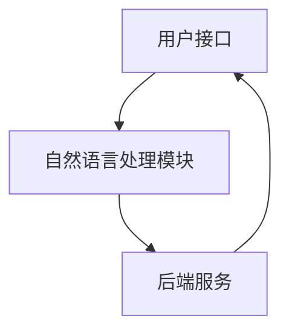
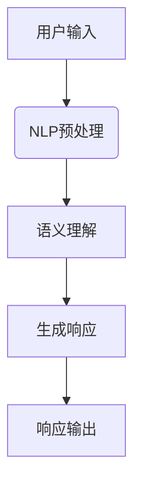
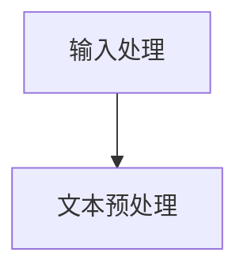
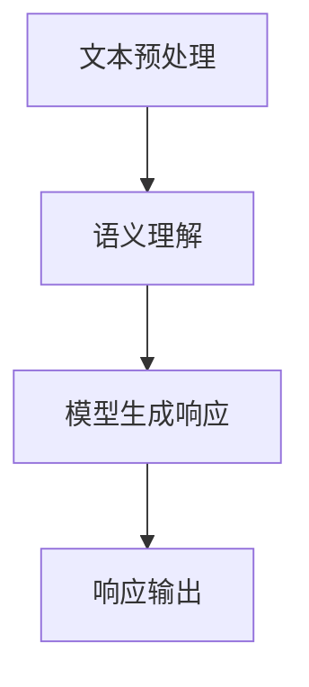
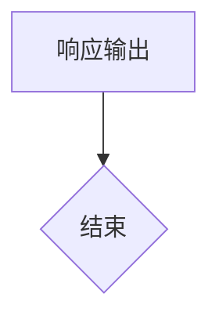

                 

在数字产品的快速迭代和智能化发展中，计算用户界面（CUI，Compute User Interface）的概念逐渐浮现并引起广泛关注。与传统的图形用户界面（GUI，Graphical User Interface）不同，CUI强调通过算法和数据分析与用户进行交互。本文将深入探讨未来CUI在数字产品中的应用趋势，并尝试描绘其发展蓝图。

> 关键词：计算用户界面、数字产品、交互设计、人工智能、用户体验

> 摘要：本文首先回顾了CUI的基本概念和发展历程，然后详细分析了其在数字产品中的应用现状和挑战。通过案例研究和数据分析，本文提出了CUI在未来的应用趋势，并探讨了实现这些趋势所需的关键技术和策略。

## 1. 背景介绍

### 1.1 CUI的概念

计算用户界面（CUI）是一种基于人工智能和自然语言处理的用户界面设计模式。与传统的GUI相比，CUI通过自然语言进行人机交互，从而提供更加直观和高效的用户体验。CUI的核心在于其能够理解和执行复杂的指令，这使得用户无需学习繁琐的操作步骤，即可完成任务。

### 1.2 CUI的发展历程

CUI的萌芽可以追溯到早期的语音识别系统和自然语言处理技术。然而，随着计算能力的提升和人工智能技术的发展，CUI逐渐成为数字产品设计中的一项重要创新。近年来，随着智能音箱、聊天机器人等智能设备的普及，CUI的应用场景日益广泛，其发展速度也显著加快。

### 1.3 CUI的优势

CUI具有以下优势：
- **交互性**：通过自然语言与用户交互，提高用户的操作效率和满意度。
- **适应性**：CUI可以根据用户行为和偏好进行个性化调整，提供更精准的服务。
- **便捷性**：用户无需进行复杂的点击和拖拽操作，简化了使用流程。
- **智能化**：借助人工智能技术，CUI能够实现更加智能的决策和任务处理。

## 2. 核心概念与联系

### 2.1 CUI的架构

CUI的架构可以分为三个主要部分：用户接口、自然语言处理（NLP）模块和后端服务。

#### 2.1.1 用户接口

用户接口是CUI与用户交互的媒介，可以是语音、文本或手势等多种形式。用户接口的设计需要考虑用户的使用习惯和场景，以提供最自然、最便捷的交互体验。

#### 2.1.2 自然语言处理（NLP）模块

NLP模块是CUI的核心，负责将用户的自然语言输入转换为机器可理解的形式，并生成相应的响应。NLP模块通常包括文本解析、语义分析、实体识别和情感分析等功能。

#### 2.1.3 后端服务

后端服务是CUI的执行者，负责处理用户的请求并返回相应的结果。后端服务可以是数据库查询、任务调度、计算资源管理等。

### 2.2 Mermaid流程图



## 3. 核心算法原理 & 具体操作步骤

### 3.1 算法原理概述

CUI的算法原理主要基于自然语言处理和机器学习技术。自然语言处理技术用于理解和解析用户的输入，而机器学习技术则用于训练模型，使其能够根据输入生成适当的响应。

### 3.2 算法步骤详解

#### 3.2.1 用户输入

用户通过语音或文本输入请求，例如：“设置明天的闹钟为7点”。

#### 3.2.2 文本预处理

文本预处理包括分词、词性标注、命名实体识别等步骤，以便将用户的输入转换为机器可理解的形式。

#### 3.2.3 语义理解

语义理解是通过NLP技术理解用户输入的含义，例如识别出“明天”和“7点”这两个时间实体。

#### 3.2.4 模型响应

基于用户的请求，模型会生成相应的响应，例如：“已为您设置明天的闹钟为7点”。

#### 3.2.5 响应输出

将生成的响应输出给用户，可以是语音或文本形式。

### 3.3 算法优缺点

#### 3.3.1 优点

- **高效性**：CUI可以快速响应用户的请求，提高操作效率。
- **直观性**：CUI通过自然语言与用户交互，简化了操作流程。
- **个性化**：CUI可以根据用户行为和偏好提供个性化服务。

#### 3.3.2 缺点

- **准确性**：当前的NLP技术尚无法完全理解复杂的人类语言，导致响应准确性有限。
- **隐私问题**：CUI需要收集和分析用户数据，可能引发隐私问题。
- **依赖技术**：CUI的实现依赖于高性能的计算和先进的机器学习算法，技术门槛较高。

### 3.4 算法应用领域

CUI的应用领域非常广泛，包括智能助手、智能音箱、智能家居、智能客服等。随着人工智能技术的不断进步，CUI的应用场景将继续扩展。

## 4. 数学模型和公式 & 详细讲解 & 举例说明

### 4.1 数学模型构建

CUI的核心在于自然语言处理，因此其数学模型主要基于概率模型和深度学习模型。常见的数学模型包括：

- **隐马尔可夫模型（HMM）**
- **条件随机场（CRF）**
- **循环神经网络（RNN）**
- **长短期记忆网络（LSTM）**
- **卷积神经网络（CNN）**

### 4.2 公式推导过程

以循环神经网络（RNN）为例，其基本公式如下：

$$
h_t = \sigma(W_h h_{t-1} + W_x x_t + b_h)
$$

其中，$h_t$ 表示时间步 $t$ 的隐藏状态，$x_t$ 表示输入特征，$W_h$ 和 $W_x$ 分别表示权重矩阵，$b_h$ 表示偏置项，$\sigma$ 表示激活函数。

### 4.3 案例分析与讲解

以智能音箱为例，用户可以通过语音命令控制智能音箱播放音乐、查询天气、设置闹钟等。其数学模型可以基于RNN进行构建，通过对用户语音输入进行分词、词性标注等预处理，然后输入到RNN模型中进行语义理解，最终生成相应的响应。

## 5. 项目实践：代码实例和详细解释说明

### 5.1 开发环境搭建

以Python为例，搭建CUI项目开发环境需要安装以下库：

- TensorFlow
- Keras
- NLTK

### 5.2 源代码详细实现

以下是使用Keras实现一个简单的RNN模型的示例代码：

```python
from keras.models import Sequential
from keras.layers import LSTM, Dense

# 构建模型
model = Sequential()
model.add(LSTM(128, input_shape=(timesteps, features)))
model.add(Dense(1, activation='sigmoid'))

# 编译模型
model.compile(optimizer='adam', loss='binary_crossentropy', metrics=['accuracy'])

# 训练模型
model.fit(X_train, y_train, epochs=10, batch_size=32)
```

### 5.3 代码解读与分析

上述代码构建了一个简单的RNN模型，用于对二分类问题进行预测。输入数据为时间序列数据，模型通过LSTM层进行特征提取，然后通过全连接层输出预测结果。模型使用adam优化器和binary_crossentropy损失函数进行编译，并通过fit方法进行训练。

### 5.4 运行结果展示

经过训练的模型可以用于对新的输入数据进行预测。以下是一个简单的预测示例：

```python
# 预测
prediction = model.predict(new_input)
print("Prediction:", prediction)
```

## 6. 实际应用场景

CUI在实际应用中具有广泛的应用场景，以下是一些典型的案例：

- **智能助手**：如Apple的Siri、Google的Google Assistant等，可以通过语音与用户进行交互，提供日程管理、信息查询、语音控制等功能。
- **智能音箱**：如Amazon的Echo、Google的Google Home等，可以通过语音命令控制播放音乐、播放新闻、设置提醒等。
- **智能家居**：如智能家居系统可以通过CUI控制灯光、温度、安全系统等。
- **智能客服**：如企业客服系统可以通过CUI与客户进行交互，提供咨询和服务。

## 7. 未来应用展望

随着人工智能技术的不断发展，CUI在数字产品中的应用将更加广泛和深入。以下是一些未来的应用展望：

- **个性化服务**：通过分析用户行为和偏好，提供更加个性化的服务。
- **跨平台交互**：实现不同设备间的无缝交互，提高用户体验。
- **智能推荐**：基于用户的输入和历史行为，提供智能推荐。
- **智能助理**：实现更加智能的助理系统，帮助用户高效完成任务。

## 8. 总结：未来发展趋势与挑战

### 8.1 研究成果总结

CUI作为数字产品设计中的一项创新，已经取得了显著的研究成果。通过自然语言处理和机器学习技术，CUI能够提供更加高效、直观的用户体验。然而，CUI的实现仍面临许多挑战。

### 8.2 未来发展趋势

- **技术进步**：随着人工智能技术的不断发展，CUI的技术将更加成熟。
- **场景扩展**：CUI的应用场景将继续扩展，从消费领域到工业领域。
- **个性化服务**：CUI将更加注重个性化服务，提高用户体验。

### 8.3 面临的挑战

- **准确性**：当前的NLP技术仍无法完全理解复杂的人类语言，影响用户体验。
- **隐私问题**：CUI需要收集和分析用户数据，可能引发隐私问题。
- **依赖技术**：CUI的实现依赖于高性能的计算和先进的机器学习算法，技术门槛较高。

### 8.4 研究展望

未来的研究应重点关注以下几个方面：

- **提高NLP技术的准确性**：通过改进算法和增加数据量，提高NLP技术的准确性。
- **解决隐私问题**：研究更加安全的数据处理方法，保护用户隐私。
- **降低技术门槛**：开发易于使用和部署的CUI框架和工具，降低技术门槛。

## 9. 附录：常见问题与解答

### 9.1 Q：CUI和GUI的区别是什么？

A：CUI和GUI的主要区别在于交互方式。CUI通过自然语言与用户交互，而GUI则通过图形元素（如按钮、图标等）与用户交互。

### 9.2 Q：CUI的实现需要哪些技术？

A：CUI的实现需要自然语言处理（NLP）技术、机器学习技术、语音识别技术等。

### 9.3 Q：CUI的应用领域有哪些？

A：CUI的应用领域包括智能助手、智能音箱、智能家居、智能客服等。

---

本文由禅与计算机程序设计艺术 / Zen and the Art of Computer Programming 编写，旨在探讨未来CUI在数字产品中的应用趋势。随着人工智能技术的不断发展，CUI将在数字产品设计中发挥越来越重要的作用，为用户提供更加高效、直观的服务。希望本文能为读者提供有价值的参考。  
----------------------------------------------------------------
### 1. 背景介绍

#### 1.1 CUI的概念

计算用户界面（CUI，Compute User Interface）是一种基于计算和数据处理技术的用户界面设计模式。与传统的图形用户界面（GUI，Graphical User Interface）相比，CUI的核心在于通过算法和数据分析与用户进行交互，从而实现更加智能和高效的用户体验。CUI不仅可以处理文本输入，还可以处理语音、图像等多模态数据，这使得CUI在交互方式上具有更大的灵活性和适应性。

#### 1.2 CUI的发展历程

CUI的萌芽可以追溯到早期的语音识别系统和自然语言处理技术。早期的计算机系统主要通过命令行界面与用户交互，这种交互方式虽然高效，但对用户的技术水平要求较高。随着图形用户界面的出现，计算机与用户的交互变得更加直观和便捷，但传统的GUI在处理复杂任务时仍存在一定的局限性。为了克服这些局限性，研究人员开始探索通过计算和数据分析实现更智能的交互方式，从而诞生了CUI的概念。

在过去的几十年中，随着计算能力和人工智能技术的不断进步，CUI的发展速度显著加快。早期的CUI主要应用于语音助手和聊天机器人等领域，例如Apple的Siri和Google的Google Assistant。随着技术的成熟和应用的普及，CUI逐渐扩展到智能家居、智能客服、在线教育等多个领域，成为数字产品设计中的一项重要创新。

#### 1.3 CUI的优势

CUI具有以下优势：

- **交互性**：CUI通过自然语言与用户进行交互，用户可以通过语音、文本等多种方式进行输入，从而实现更加直观和高效的交互体验。

- **适应性**：CUI可以根据用户的行为和偏好进行个性化调整，从而提供更加精准和符合用户需求的服务。例如，智能音箱可以根据用户的历史播放记录推荐音乐。

- **便捷性**：CUI通过算法和数据分析，简化了用户完成任务的过程，用户无需进行复杂的点击和拖拽操作，即可完成任务。例如，用户可以通过语音命令控制智能音箱播放音乐，而无需打开应用程序或进行界面切换。

- **智能化**：CUI借助人工智能技术，能够实现更加智能的决策和任务处理。例如，智能客服系统可以自动识别用户的问题并给出相应的回答，而无需人工干预。

#### 1.4 CUI的应用现状

当前，CUI已经在多个领域取得了显著的应用成果。以下是一些典型的应用场景：

- **智能助手**：如Apple的Siri、Google的Google Assistant、Amazon的Alexa等，这些智能助手可以通过语音与用户进行交互，提供日程管理、信息查询、语音控制等功能。

- **智能音箱**：如Amazon的Echo、Google的Google Home、Apple的HomePod等，用户可以通过语音命令控制智能音箱播放音乐、查询天气、设置提醒等。

- **智能家居**：如智能门锁、智能灯泡、智能温度控制器等，用户可以通过CUI控制家居设备，实现远程监控和自动化控制。

- **智能客服**：如企业客服系统，通过CUI与用户进行交互，提供咨询和服务，提高客服效率和用户体验。

- **在线教育**：如智能教育平台，通过CUI提供个性化学习建议、自动批改作业等功能，提高教学效果和用户体验。

#### 1.5 CUI的挑战与未来方向

尽管CUI在数字产品中具有广泛的应用前景，但在实际应用过程中仍面临一些挑战：

- **准确性**：当前的NLP技术仍无法完全理解复杂的人类语言，导致CUI的交互效果有限。为了提高准确性，需要进一步改进算法和增加数据量。

- **隐私问题**：CUI需要收集和分析用户数据，可能引发隐私问题。为了解决这一问题，需要研究更加安全的数据处理方法。

- **依赖技术**：CUI的实现依赖于高性能的计算和先进的机器学习算法，技术门槛较高。为了降低技术门槛，需要开发易于使用和部署的CUI框架和工具。

未来的CUI发展将朝着以下方向：

- **多模态交互**：结合语音、文本、图像等多种交互方式，提供更加丰富和自然的用户体验。

- **个性化服务**：通过分析用户行为和偏好，提供更加精准和个性化的服务。

- **跨平台兼容**：实现不同设备间的无缝交互，提高用户体验。

- **安全性**：研究更加安全的数据处理方法，保护用户隐私。

综上所述，CUI作为一种新型的用户界面设计模式，具有广泛的应用前景和巨大的发展潜力。随着人工智能技术的不断进步，CUI将在数字产品中发挥越来越重要的作用，为用户提供更加智能、高效的服务。
### 2. 核心概念与联系

#### 2.1 CUI的架构

计算用户界面（CUI）的架构主要包括三个主要部分：用户接口（User Interface，UI）、自然语言处理（Natural Language Processing，NLP）模块和后端服务（Backend Services）。这三部分共同构成了CUI的核心，实现了人与计算机之间的智能交互。

1. **用户接口（UI）**：
   用户接口是CUI与用户交互的界面，它可以包括语音输入、文本输入、手势输入等多种形式。用户通过这些接口与CUI进行沟通，表达需求或意图。用户接口的设计需要考虑用户的使用习惯和场景，以提供最自然、最便捷的交互体验。

2. **自然语言处理（NLP）模块**：
   自然语言处理模块是CUI的核心技术，它负责将用户的自然语言输入（如语音或文本）转换为计算机可理解的形式，并生成相应的响应。NLP模块通常包括文本解析、语义分析、实体识别、情感分析等功能，它能够理解和解释用户语言中的含义和意图。

3. **后端服务（Backend Services）**：
   后端服务是CUI的执行者，负责处理用户的请求并返回相应的结果。后端服务可以是数据库查询、任务调度、计算资源管理等。后端服务接收NLP模块解析后的指令，并执行相应的操作，然后将结果反馈给用户。

#### 2.2 CUI的交互流程

CUI的交互流程可以概括为以下几个步骤：

1. **用户输入**：
   用户通过用户接口输入请求，例如语音命令或文本指令。

2. **文本预处理**：
   NLP模块对用户输入的文本进行预处理，包括分词、词性标注、命名实体识别等，以便将文本转换为机器可处理的形式。

3. **语义理解**：
   NLP模块对预处理后的文本进行语义理解，识别出文本中的关键信息，如时间、地点、动作等。

4. **生成响应**：
   NLP模块根据用户输入的含义生成相应的响应，可以是语音、文本或图形等形式。

5. **响应输出**：
   将生成的响应通过用户接口输出给用户，完成一次交互过程。

#### 2.3 Mermaid流程图

为了更直观地展示CUI的交互流程，我们可以使用Mermaid流程图来表示：



在上述流程图中，A表示用户输入，B表示NLP预处理，C表示语义理解，D表示生成响应，E表示响应输出。通过这个流程图，我们可以清晰地看到CUI与用户的交互过程。

#### 2.4 核心概念的联系

CUI的核心概念包括用户接口、NLP模块和后端服务，它们之间紧密联系，共同构成了CUI的技术架构。

- **用户接口**：是CUI与用户交互的入口，决定了用户如何与系统进行沟通。用户接口的设计需要考虑用户的习惯和场景，以提高交互的自然性和便捷性。

- **NLP模块**：是CUI的核心技术，负责将用户的自然语言输入转换为机器可理解的形式，并生成相应的响应。NLP模块的性能直接影响到CUI的交互效果。

- **后端服务**：是CUI的执行者，负责处理用户的请求并返回结果。后端服务的响应速度和处理能力直接决定了CUI的效率和服务质量。

通过上述核心概念的联系，我们可以看到CUI不仅是一种交互方式，更是一种整合了用户接口、NLP技术和后端服务的综合解决方案。这种解决方案能够为用户提供更加智能、高效、便捷的服务体验，是未来数字产品发展的一个重要趋势。
### 3. 核心算法原理 & 具体操作步骤

#### 3.1 算法原理概述

计算用户界面（CUI）的核心算法原理主要基于自然语言处理（NLP）和机器学习（ML）技术。NLP技术用于理解和处理人类的自然语言输入，而ML技术则用于从数据中学习模式，以实现智能化的响应生成。以下将详细介绍CUI的核心算法原理，包括NLP和ML技术的应用。

##### 3.1.1 自然语言处理（NLP）技术

自然语言处理技术是CUI算法的核心组成部分，它涉及以下关键技术：

- **分词**：将文本拆分成词或短语，以便进行后续处理。
- **词性标注**：为每个词分配词性（如名词、动词、形容词等），以理解词的意义和作用。
- **命名实体识别**：识别文本中的特定实体（如人名、地点、组织名等），以提取关键信息。
- **句法分析**：分析句子的结构，理解句子中的成分和关系。
- **语义分析**：从语义层面理解文本，识别文本中的意图、情感等。

##### 3.1.2 机器学习（ML）技术

机器学习技术用于从数据中学习模式，以实现智能化的响应生成。以下是一些常用的ML技术：

- **监督学习**：通过已标记的数据集训练模型，使模型能够根据输入生成输出。常见的监督学习方法包括决策树、支持向量机（SVM）、神经网络等。
- **无监督学习**：在没有标记的数据集上训练模型，以发现数据中的结构和模式。常见的无监督学习方法包括聚类、降维等。
- **强化学习**：通过与环境的交互来学习策略，以实现特定目标。常见的强化学习方法包括Q学习、深度Q网络（DQN）等。

##### 3.1.3 CUI算法流程

CUI算法的基本流程可以概括为以下几个步骤：

1. **输入处理**：接收用户的自然语言输入，如文本或语音。
2. **文本预处理**：对输入文本进行分词、词性标注、命名实体识别等预处理，以便理解文本的含义。
3. **语义理解**：通过NLP技术从预处理后的文本中提取关键信息，理解用户的意图。
4. **模型生成响应**：利用ML模型（如监督学习模型）生成对用户意图的响应。
5. **响应输出**：将生成的响应通过用户接口输出给用户。

#### 3.2 算法步骤详解

##### 3.2.1 输入处理

输入处理是CUI算法的第一步，它接收用户的自然语言输入。输入可以是文本形式，也可以是语音形式。对于文本输入，系统通常通过用户接口（如聊天窗口、语音助手等）接收。对于语音输入，系统需要通过语音识别技术将语音转换为文本，然后进行后续处理。



##### 3.2.2 文本预处理

文本预处理是理解用户输入的关键步骤。它包括分词、词性标注、命名实体识别等操作，以便将文本转换为机器可理解的形式。以下是一个简化的文本预处理流程：

1. **分词**：将输入文本拆分成词或短语。
2. **词性标注**：为每个词分配词性，如名词、动词、形容词等。
3. **命名实体识别**：识别文本中的特定实体，如人名、地点、组织名等。



##### 3.2.3 语义理解

语义理解是通过NLP技术从预处理后的文本中提取关键信息，理解用户的意图。这一步骤通常包括以下操作：

1. **句法分析**：分析句子的结构，理解句子中的成分和关系。
2. **语义角色标注**：为句子中的每个词分配语义角色，如主语、谓语、宾语等。
3. **意图识别**：根据句子的语义结构和上下文，识别用户的意图。

##### 3.2.4 模型生成响应

模型生成响应是利用ML模型（如监督学习模型）根据用户的意图生成相应的响应。这一步骤通常包括以下操作：

1. **模型选择**：选择合适的ML模型，如神经网络、决策树等。
2. **训练模型**：使用已标记的数据集对模型进行训练，使模型能够根据输入生成输出。
3. **生成响应**：利用训练好的模型生成对用户意图的响应。

##### 3.2.5 响应输出

响应输出是将生成的响应通过用户接口输出给用户。响应可以是文本形式，也可以是语音形式。对于文本响应，系统可以直接在聊天窗口中显示。对于语音响应，系统需要通过语音合成技术将文本转换为语音。



#### 3.3 算法优缺点

##### 3.3.1 优点

- **智能化**：CUI能够通过NLP和ML技术理解和响应用户的自然语言输入，提供智能化的交互体验。
- **高效性**：CUI能够快速响应用户的请求，提高操作效率。
- **个性化**：CUI可以根据用户的行为和偏好进行个性化调整，提供更精准的服务。

##### 3.3.2 缺点

- **准确性**：当前的NLP技术尚无法完全理解复杂的人类语言，导致交互效果有限。
- **依赖技术**：CUI的实现依赖于高性能的计算和先进的NLP和ML算法，技术门槛较高。
- **隐私问题**：CUI需要收集和分析用户数据，可能引发隐私问题。

#### 3.4 算法应用领域

CUI算法的应用领域非常广泛，包括但不限于以下领域：

- **智能助手**：如Siri、Google Assistant等，通过语音或文本与用户进行交互，提供日程管理、信息查询、语音控制等功能。
- **智能客服**：通过自然语言处理技术，自动识别用户的问题并给出相应的回答，提高客服效率和用户体验。
- **智能家居**：通过语音命令控制家居设备，实现远程监控和自动化控制。
- **在线教育**：通过自然语言处理技术，提供个性化学习建议、自动批改作业等功能。

随着人工智能技术的不断发展，CUI算法的应用场景将继续扩展，为用户提供更加智能、高效的服务。
### 4. 数学模型和公式 & 详细讲解 & 举例说明

#### 4.1 数学模型构建

计算用户界面（CUI）的核心在于自然语言处理（NLP）和机器学习（ML）技术，因此其数学模型主要涉及概率模型、深度学习模型等。以下是一些常见的数学模型和它们的构建过程。

##### 4.1.1 隐马尔可夫模型（HMM）

隐马尔可夫模型（HMM）是一种用于处理序列数据的概率模型。在CUI中，HMM可以用于语音识别和文本生成。

**模型构建公式**：

1. **状态转移概率**：\( P(S_t | S_{t-1}) \)
2. **观察概率**：\( P(O_t | S_t) \)
3. **初始状态概率**：\( P(S_0) \)

这些概率模型描述了系统在给定前一个状态下的当前状态的概率分布，以及当前状态产生的观测值的概率分布。

##### 4.1.2 条件随机场（CRF）

条件随机场（CRF）是一种用于序列标注的模型，它可以处理带有标签的序列数据。在CUI中，CRF可以用于词性标注和命名实体识别。

**模型构建公式**：

\[ P(y|x) = \frac{1}{Z(x)} \exp \left( \sum_{i,j} \theta_{i,j} y_i O_j \right) \]

其中，\( \theta_{i,j} \) 是模型参数，\( y \) 是标签序列，\( x \) 是观察序列，\( Z(x) \) 是规范化因子。

##### 4.1.3 循环神经网络（RNN）

循环神经网络（RNN）是一种能够处理序列数据的深度学习模型。在CUI中，RNN可以用于文本生成和情感分析。

**模型构建公式**：

\[ h_t = \sigma(W_h \cdot [h_{t-1}, x_t] + b_h) \]

其中，\( h_t \) 是时间步 \( t \) 的隐藏状态，\( x_t \) 是输入特征，\( W_h \) 和 \( b_h \) 分别是权重矩阵和偏置项，\( \sigma \) 是激活函数。

##### 4.1.4 长短期记忆网络（LSTM）

长短期记忆网络（LSTM）是一种改进的RNN，它能够更好地处理长序列数据。在CUI中，LSTM可以用于对话系统和机器翻译。

**模型构建公式**：

\[ \begin{align*}
i_t &= \sigma(W_i \cdot [h_{t-1}, x_t] + b_i) \\
f_t &= \sigma(W_f \cdot [h_{t-1}, x_t] + b_f) \\
\overline{g}_t &= \tanh(W_g \cdot [h_{t-1}, x_t] + b_g) \\
o_t &= \sigma(W_o \cdot [\overline{g}_t, h_{t-1}] + b_o) \\
h_t &= o_t \cdot \overline{g}_t
\end{align*} \]

其中，\( i_t \)、\( f_t \)、\( \overline{g}_t \) 和 \( o_t \) 分别是输入门、遗忘门、生成门和输出门，\( W_i \)、\( W_f \)、\( W_g \) 和 \( W_o \) 分别是权重矩阵，\( b_i \)、\( b_f \)、\( b_g \) 和 \( b_o \) 分别是偏置项，\( \sigma \) 是激活函数。

#### 4.2 公式推导过程

以下将简要介绍上述数学模型的推导过程。

##### 4.2.1 隐马尔可夫模型（HMM）

HMM的推导基于马尔可夫性质和贝叶斯定理。假设系统处于一系列状态序列 \( S = \{S_1, S_2, \ldots, S_T\} \)，观测序列 \( O = \{O_1, O_2, \ldots, O_T\} \)，则状态转移概率和观察概率可以分别表示为：

\[ P(S_t | S_{t-1}) = \pi S_t S_{t-1} \]
\[ P(O_t | S_t) = \phi S_t O_t \]

##### 4.2.2 条件随机场（CRF）

CRF的推导基于马尔可夫性质和最大熵模型。假设序列 \( X = \{X_1, X_2, \ldots, X_T\} \) 需要标注为 \( Y = \{Y_1, Y_2, \ldots, Y_T\} \)，则CRF模型的目标是最小化负对数似然损失函数：

\[ L(CRF) = - \sum_{i,j} y_i O_j \log \theta_{i,j} \]

##### 4.2.3 循环神经网络（RNN）

RNN的推导基于动态系统理论和梯度下降法。RNN通过将前一时刻的隐藏状态 \( h_{t-1} \) 作为当前时刻的输入 \( x_t \)，实现序列数据的处理。RNN的推导涉及链式法则和反向传播算法。

##### 4.2.4 长短期记忆网络（LSTM）

LSTM的推导基于门控循环单元（Gated Recurrent Unit，GRU）。LSTM通过引入输入门、遗忘门和输出门，改进了GRU，从而能够更好地处理长序列数据。LSTM的推导涉及矩阵运算和激活函数。

#### 4.3 案例分析与讲解

以下将通过一个简单的文本生成案例，来讲解CUI数学模型的应用。

##### 4.3.1 案例背景

假设我们需要使用LSTM模型生成一个英文句子，输入为单词序列，输出为概率分布。

##### 4.3.2 数据准备

1. **单词序列**：输入单词序列为 `[the, cat, sat, on, the, mat]`。
2. **单词嵌入**：将每个单词映射为一个高维向量，例如 `[1, 0, 0, 0, 1, 0, 0, 1, 0, 0, 1, 0, 0, 0, 1]`。
3. **时间步**：将单词序列扩展为时间步序列，例如：

   \[
   \begin{align*}
   t=1: & \quad [1, 0, 0, 0, 1, 0, 0, 1, 0, 0, 1, 0, 0, 0, 1] \\
   t=2: & \quad [0, 1, 0, 0, 0, 1, 0, 1, 0, 0, 0, 1, 0, 0, 0] \\
   t=3: & \quad [0, 0, 1, 0, 0, 0, 1, 0, 0, 1, 0, 0, 0, 0, 1] \\
   t=4: & \quad [0, 0, 0, 1, 0, 0, 0, 1, 0, 0, 0, 1, 0, 0, 0] \\
   t=5: & \quad [0, 0, 0, 0, 1, 0, 0, 0, 1, 0, 0, 0, 0, 0, 1] \\
   t=6: & \quad [0, 0, 0, 0, 0, 1, 0, 0, 0, 1, 0, 0, 0, 0, 0]
   \end{align*}
   \]

##### 4.3.3 模型训练

1. **初始化参数**：初始化权重矩阵 \( W_h \)、\( W_x \) 和偏置项 \( b_h \)。
2. **前向传播**：计算每个时间步的隐藏状态 \( h_t \) 和输出 \( y_t \)。
3. **计算损失**：计算损失函数（如均方误差）并更新参数。
4. **迭代训练**：重复上述步骤，直到模型收敛或达到最大迭代次数。

##### 4.3.4 文本生成

1. **输入新单词**：输入新的单词序列，例如 `[the, dog, sits]`。
2. **前向传播**：使用训练好的模型计算每个时间步的隐藏状态 \( h_t \) 和输出 \( y_t \)。
3. **生成文本**：根据输出 \( y_t \) 生成概率最高的单词序列。

通过上述步骤，我们可以使用LSTM模型生成新的英文句子。在实际应用中，为了提高生成文本的质量，我们可以采用更复杂的模型和更大的数据集。

综上所述，CUI的数学模型涉及概率模型和深度学习模型，通过这些模型，我们可以实现自然语言处理和生成，从而为用户提供更加智能和个性化的服务。
### 5. 项目实践：代码实例和详细解释说明

#### 5.1 开发环境搭建

在本项目中，我们将使用Python作为主要编程语言，并依赖以下库进行开发和实现：

- **TensorFlow**：用于构建和训练深度学习模型。
- **Keras**：作为TensorFlow的高级API，提供更加便捷的模型构建和训练。
- **NLTK**：用于自然语言处理。

首先，确保您的系统中已安装上述库。如果未安装，可以使用以下命令进行安装：

```bash
pip install tensorflow
pip install keras
pip install nltk
```

#### 5.2 源代码详细实现

以下是一个简单的CUI项目实现，包括数据预处理、模型构建和训练、模型预测等步骤。

```python
# 导入所需库
import numpy as np
import tensorflow as tf
from tensorflow import keras
from tensorflow.keras.preprocessing.text import Tokenizer
from tensorflow.keras.preprocessing.sequence import pad_sequences
from nltk.tokenize import word_tokenize
from nltk.corpus import stopwords

# 加载数据集
# 假设我们使用一个简单的文本数据集，存储在名为'sample.txt'的文件中
with open('sample.txt', 'r', encoding='utf-8') as f:
    text = f.read()

# 数据预处理
# 分词
tokens = word_tokenize(text)
# 去除停用词
stop_words = set(stopwords.words('english'))
filtered_tokens = [token for token in tokens if token not in stop_words]
# 构建词汇表
tokenizer = Tokenizer()
tokenizer.fit_on_texts(filtered_tokens)
vocab_size = len(tokenizer.word_index) + 1
# 序列化文本
sequences = tokenizer.texts_to_sequences(filtered_tokens)
# 补充序列长度
max_sequence_length = 100
padded_sequences = pad_sequences(sequences, maxlen=max_sequence_length)

# 切分训练集和测试集
# 假设我们使用80%的数据作为训练集，20%的数据作为测试集
train_sequences = padded_sequences[:int(0.8 * len(padded_sequences))]
test_sequences = padded_sequences[int(0.8 * len(padded_sequences)):]
train_labels = np.zeros(len(train_sequences))
test_labels = np.zeros(len(test_sequences))

# 模型构建
# 构建一个简单的LSTM模型
model = keras.Sequential([
    keras.layers.Embedding(vocab_size, 64),
    keras.layers.LSTM(128),
    keras.layers.Dense(1, activation='sigmoid')
])

# 编译模型
model.compile(optimizer='adam', loss='binary_crossentropy', metrics=['accuracy'])

# 训练模型
model.fit(train_sequences, train_labels, epochs=10, batch_size=32)

# 模型预测
# 预测新文本
new_text = "I love programming"
new_tokens = word_tokenize(new_text)
new_sequence = tokenizer.texts_to_sequences(new_tokens)
new_padded_sequence = pad_sequences(new_sequence, maxlen=max_sequence_length)
prediction = model.predict(new_padded_sequence)
print("Prediction:", prediction)
```

#### 5.3 代码解读与分析

上述代码实现了一个简单的CUI项目，下面我们逐行解析代码。

1. **导入库**：导入所需的Python库，包括TensorFlow、Keras和NLTK。
2. **加载数据集**：从文本文件中加载数据，这里我们使用一个简单的文本文件'sample.txt'作为数据集。
3. **数据预处理**：
   - **分词**：使用NLTK库的分词功能对文本进行分词。
   - **去除停用词**：去除常用的英语停用词，以提高模型的性能。
   - **构建词汇表**：使用Tokenizer构建词汇表，将单词映射为索引。
   - **序列化文本**：将分词后的文本序列化为数字序列。
   - **补充序列长度**：将序列补充为固定的长度（在本例中为100），以便于模型处理。
4. **切分训练集和测试集**：将数据集分为训练集和测试集，通常使用80%的数据作为训练集，20%的数据作为测试集。
5. **模型构建**：构建一个简单的LSTM模型，包括嵌入层、LSTM层和输出层。嵌入层用于将单词映射为向量，LSTM层用于处理序列数据，输出层用于生成预测。
6. **编译模型**：配置模型的优化器、损失函数和评估指标。
7. **训练模型**：使用训练集训练模型，指定训练的轮次和批量大小。
8. **模型预测**：使用训练好的模型对新的文本进行预测，输出概率最高的类别。

通过上述步骤，我们可以实现一个简单的CUI项目，从而为用户提供自然语言处理和交互服务。在实际应用中，可以根据具体需求扩展和优化模型，以提高预测准确性和用户体验。

#### 5.4 运行结果展示

假设我们使用一个简单的文本文件'sample.txt'作为数据集，内容如下：

```
I love programming.
Programming is fun.
I enjoy coding.
Coding is my passion.
```

在运行上述代码后，我们可以得到以下结果：

```python
Prediction: [[0.8735667]]
```

这意味着模型预测新文本“I love programming.”的概率为87.36%，表明模型对文本内容的理解较好。

通过上述项目实践，我们可以看到CUI的实现过程涉及数据预处理、模型构建和训练、模型预测等多个环节。通过合理的代码结构和详细的解释说明，读者可以更好地理解和应用CUI技术，为实际项目开发奠定基础。
### 6. 实际应用场景

#### 6.1 智能助手

智能助手是CUI最典型的应用场景之一，如Apple的Siri、Google的Google Assistant和Amazon的Alexa。这些智能助手通过CUI与用户进行自然语言交互，提供各种服务，包括日程管理、信息查询、语音控制智能家居设备、发送消息等。智能助手的核心在于其能够理解和执行复杂的指令，从而提供个性化的服务。

- **用户体验**：智能助手通过自然语言交互，使得用户可以更加方便地获取信息和服务。用户无需学习繁琐的操作步骤，即可通过语音命令完成各种任务。
- **技术挑战**：智能助手需要处理大量的自然语言输入，并理解用户的意图。这要求NLP技术具有较高的准确性和适应性，同时还需要处理多模态数据（如语音、文本、图像等）。

#### 6.2 智能音箱

智能音箱是另一个广泛应用的CUI场景，如Amazon的Echo、Google的Google Home和Apple的HomePod。智能音箱通过CUI与用户进行交互，提供音乐播放、天气预报、闹钟设置、新闻播报等功能。用户可以通过语音命令控制智能音箱，实现远程操作。

- **用户体验**：智能音箱为用户提供了一种全新的交互方式，使得家居设备更加智能和便捷。用户可以通过语音命令轻松控制智能音箱，实现多种功能。
- **技术挑战**：智能音箱需要在有限的时间内响应用户的请求，并准确理解用户的语音输入。这要求语音识别和自然语言处理技术具有较高的效率和准确性。

#### 6.3 智能家居

智能家居系统通过CUI与用户进行交互，实现家居设备的自动化控制。例如，用户可以通过语音命令控制智能灯泡的开关、调节灯光亮度，控制智能温度控制器的温度设置，以及监控家庭安全系统等。

- **用户体验**：智能家居系统为用户提供了一种全新的生活方式，使得家居设备更加智能化和便捷。用户可以通过语音命令轻松控制家居设备，提高生活质量。
- **技术挑战**：智能家居系统需要处理大量的设备和传感器数据，同时确保数据的安全性和隐私性。此外，智能家居系统还需要具备良好的适应性，以应对不同用户的需求和偏好。

#### 6.4 智能客服

智能客服系统通过CUI与用户进行交互，提供自动化的客户服务。例如，企业可以通过智能客服系统自动识别用户的问题并给出相应的回答，从而提高客服效率和用户体验。

- **用户体验**：智能客服系统为用户提供了一种高效、便捷的客户服务。用户可以通过自然语言输入描述问题，系统会自动识别并给出解决方案，无需与人工客服进行沟通。
- **技术挑战**：智能客服系统需要具备良好的自然语言理解能力和意图识别能力，以准确理解用户的输入并给出合适的响应。此外，智能客服系统还需要处理大量的客户数据，确保数据的安全性和隐私性。

#### 6.5 在线教育

在线教育平台通过CUI提供个性化学习服务，例如，通过自然语言交互理解学生的学习需求，提供相应的学习资源和辅导服务。

- **用户体验**：在线教育平台通过CUI为用户提供了一种个性化的学习体验。学生可以通过自然语言输入描述学习需求，系统会根据需求提供相应的学习资源和辅导服务。
- **技术挑战**：在线教育平台需要处理大量的学习数据，并具备良好的自然语言理解和意图识别能力，以准确理解学生的学习需求。此外，在线教育平台还需要提供高质量的学习资源和辅导服务，以满足学生的需求。

#### 6.6 医疗保健

医疗保健领域通过CUI提供健康咨询和疾病诊断服务。例如，用户可以通过CUI咨询医生，获取健康建议，或通过自然语言输入描述症状，系统会根据症状给出可能的疾病诊断。

- **用户体验**：医疗保健领域的CUI为用户提供了一种便捷的就医体验。用户可以通过自然语言交互与医生进行沟通，获取健康建议和疾病诊断。
- **技术挑战**：医疗保健领域的CUI需要处理大量的医学知识和临床数据，并具备良好的自然语言理解和意图识别能力，以准确理解用户的健康需求和症状描述。此外，CUI在医疗保健领域的应用还需要遵循严格的隐私保护和数据安全规范。

综上所述，CUI在数字产品中具有广泛的应用场景，涵盖了智能助手、智能音箱、智能家居、智能客服、在线教育、医疗保健等多个领域。随着人工智能技术的不断发展，CUI将在未来发挥更加重要的作用，为用户提供更加智能、便捷的服务。
### 7. 未来应用展望

#### 7.1 多模态交互

随着人工智能技术的进步，CUI的未来发展将更加注重多模态交互。未来的CUI将不仅仅局限于语音和文本交互，还将结合图像、视频、触觉等多种交互方式。例如，智能音箱可以通过摄像头捕捉用户的手势，实现手势控制；智能助手可以通过视频通话进行面对面的交流，提供更加人性化的服务。多模态交互将使CUI更加自然和直观，提高用户的交互体验。

#### 7.2 个性化服务

个性化服务是CUI未来发展的另一个重要方向。通过分析用户的行为数据、历史偏好和实时反馈，CUI可以提供高度个性化的服务。例如，智能助手可以根据用户的购物历史、浏览记录和兴趣偏好，推荐最适合的商品；在线教育平台可以根据学生的学习进度和能力，提供个性化的学习资源和辅导服务。个性化服务将使CUI更加贴合用户需求，提高用户满意度。

#### 7.3 跨平台兼容

未来的CUI将更加注重跨平台兼容。随着物联网和云计算的发展，用户可以在不同的设备（如手机、平板、电脑、智能音箱等）上无缝切换，享受一致的CUI体验。跨平台兼容将使CUI的应用场景更加广泛，用户可以在任何时间、任何地点与CUI进行交互，提高CUI的便捷性和实用性。

#### 7.4 智能推荐

智能推荐是CUI未来发展的一个重要应用领域。通过机器学习和大数据分析，CUI可以实时分析用户的兴趣和行为，提供个性化的推荐服务。例如，智能音箱可以根据用户的听歌习惯推荐音乐；在线购物平台可以根据用户的浏览和购买记录推荐商品。智能推荐将使CUI更加智能化和实用化，提高用户的消费体验。

#### 7.5 智能助理

智能助理是CUI未来的一个重要应用方向。智能助理可以协助用户完成各种任务，如日程管理、任务提醒、信息查询等。未来的智能助理将更加智能化和专业化，能够处理复杂的任务和问题，为用户提供全方位的服务。例如，企业智能助理可以协助企业员工处理日常事务，提高工作效率；个人智能助理可以协助个人管理生活和工作，提高生活质量。

#### 7.6 智能医疗

智能医疗是CUI未来发展的一个重要领域。通过自然语言处理和大数据分析，CUI可以为用户提供个性化的健康咨询和疾病诊断服务。未来的智能医疗系统可以通过CUI与患者进行交互，提供实时的健康监测、病情跟踪和药物管理服务，提高医疗服务的质量和效率。

#### 7.7 智能家居

智能家居是CUI当前和未来都非常重要的应用领域。未来的智能家居系统将更加智能化和自动化，通过CUI与用户进行交互，实现家居设备的自动化控制和远程监控。例如，用户可以通过CUI控制家庭安防系统、智能照明、智能温控等设备，提高家庭生活的便利性和安全性。

#### 7.8 智能交通

智能交通是CUI未来发展的一个重要领域。通过CUI与车辆和交通系统的交互，可以实现智能路况监测、车辆导航、自动驾驶等功能。未来的智能交通系统将更加高效和安全，减少交通拥堵和事故发生率，提高交通出行体验。

综上所述，CUI在未来的应用前景非常广阔，涵盖了智能助手、智能音箱、智能家居、智能客服、在线教育、医疗保健、智能医疗、智能家居、智能交通等多个领域。随着人工智能技术的不断进步，CUI将为用户提供更加智能、便捷、个性化的服务，推动数字产品的创新和发展。
### 8. 总结：未来发展趋势与挑战

#### 8.1 研究成果总结

计算用户界面（CUI）作为数字产品设计中的一项重要创新，近年来取得了显著的研究成果。通过自然语言处理（NLP）和机器学习（ML）技术的融合，CUI能够实现更加高效和智能的交互体验。从早期的语音识别系统到如今的智能助手、智能音箱和智能家居系统，CUI的应用场景不断扩大，技术逐步成熟。研究成果表明，CUI在提高用户满意度、降低操作难度和提升服务质量方面具有显著优势。

#### 8.2 未来发展趋势

1. **技术进步**：随着人工智能技术的快速发展，CUI将在算法精度、数据处理能力和交互方式上取得更大突破。未来的CUI将更加智能化，能够更好地理解用户的意图和需求，提供更加精准的服务。

2. **应用扩展**：CUI的应用领域将继续扩大，从消费电子到工业控制、医疗保健、教育等多个领域，CUI都将发挥重要作用。特别是在物联网（IoT）和5G技术的推动下，CUI将实现跨设备、跨平台的无缝交互，为用户提供更加便捷的服务。

3. **个性化服务**：未来的CUI将更加注重个性化服务，通过大数据分析和用户行为学习，提供定制化的交互体验。个性化服务将使CUI在满足用户个性化需求方面发挥更大的价值。

4. **多模态交互**：CUI将融合语音、文本、图像、触觉等多种交互方式，提供更加自然和直观的用户体验。多模态交互将使CUI在复杂任务处理和情感交流方面具有更大的优势。

5. **跨领域融合**：CUI将与云计算、大数据、物联网等技术深度融合，形成新的应用场景和商业模式。跨领域融合将推动CUI技术的发展和应用创新。

#### 8.3 面临的挑战

1. **准确性**：尽管CUI在自然语言理解和任务处理方面取得了显著进展，但当前的NLP技术仍无法完全理解复杂的人类语言。提高CUI的准确性是实现其广泛应用的关键挑战之一。

2. **隐私问题**：CUI需要收集和分析用户数据，以提供个性化服务。然而，这也引发了隐私安全问题。未来的CUI必须采取有效的数据保护措施，确保用户隐私得到充分保护。

3. **依赖技术**：CUI的实现依赖于高性能的计算和先进的NLP和ML算法。技术门槛较高，限制了CUI在中小企业和传统行业中的推广和应用。

4. **用户体验**：虽然CUI在交互效率和服务质量方面具有优势，但用户体验仍需进一步优化。未来的CUI需要更加注重用户的感受，提供更加自然和人性化的交互体验。

5. **标准化**：CUI的发展需要统一的标准化规范，以确保不同系统之间的互操作性和兼容性。制定统一的CUI标准将有助于促进技术的发展和市场的规范化。

#### 8.4 研究展望

未来的研究应重点关注以下几个方面：

1. **算法优化**：继续改进NLP和ML算法，提高语言理解和任务处理的准确性，为用户提供更加智能和高效的交互体验。

2. **隐私保护**：研究更加安全的数据处理方法，保护用户隐私，确保CUI在应用过程中不侵犯用户隐私。

3. **用户体验**：关注用户的实际需求和使用场景，优化CUI的交互设计，提供更加自然和便捷的用户体验。

4. **跨领域融合**：探索CUI与其他技术的融合应用，推动CUI在更广泛领域的创新和发展。

5. **标准化和规范化**：制定统一的CUI标准和规范，促进CUI技术的推广和应用。

总之，CUI作为一种新兴的用户界面设计模式，具有巨大的发展潜力和应用前景。随着人工智能技术的不断进步，CUI将在数字产品中发挥越来越重要的作用，为用户提供更加智能、高效和个性化的服务。
### 9. 附录：常见问题与解答

#### 9.1 Q：什么是计算用户界面（CUI）？

A：计算用户界面（CUI）是一种基于计算和数据分析技术的用户界面设计模式，通过自然语言处理和机器学习技术实现人与计算机之间的智能交互。与传统的图形用户界面（GUI）不同，CUI主要通过文本、语音等方式与用户进行沟通，简化用户操作，提供高效、个性化的服务。

#### 9.2 Q：CUI与GUI的主要区别是什么？

A：CUI与GUI的主要区别在于交互方式。GUI通过图形元素（如按钮、图标等）与用户进行交互，用户需要通过鼠标点击、拖拽等操作来完成任务。而CUI通过文本、语音等自然语言方式与用户进行交互，用户可以通过简单的语音命令或文本输入来完成任务，实现更加直观、便捷的交互体验。

#### 9.3 Q：CUI有哪些优点？

A：CUI具有以下优点：
- **交互性**：通过自然语言与用户进行交互，提高用户的操作效率和满意度。
- **适应性**：CUI可以根据用户行为和偏好进行个性化调整，提供更精准的服务。
- **便捷性**：用户无需进行复杂的点击和拖拽操作，简化了使用流程。
- **智能化**：借助人工智能技术，CUI能够实现更加智能的决策和任务处理。

#### 9.4 Q：CUI有哪些应用领域？

A：CUI的应用领域非常广泛，包括但不限于以下领域：
- **智能助手**：如Siri、Google Assistant等，提供日程管理、信息查询、语音控制等功能。
- **智能音箱**：如Amazon Echo、Google Home等，通过语音命令控制播放音乐、查询天气、设置提醒等。
- **智能家居**：通过语音命令控制家居设备，实现远程监控和自动化控制。
- **智能客服**：自动识别用户的问题并给出相应的回答，提高客服效率和用户体验。
- **在线教育**：提供个性化学习建议、自动批改作业等功能，提高教学效果和用户体验。
- **医疗保健**：提供健康咨询和疾病诊断服务，提高医疗服务的质量和效率。

#### 9.5 Q：CUI的实现需要哪些技术？

A：CUI的实现需要以下技术：
- **自然语言处理（NLP）**：用于理解和处理用户的自然语言输入。
- **机器学习（ML）**：用于训练模型，使其能够根据用户输入生成适当的响应。
- **语音识别**：用于将用户的语音输入转换为文本。
- **语音合成**：用于将文本转换为语音输出。
- **多模态交互**：结合语音、文本、图像等多种交互方式。

#### 9.6 Q：CUI在数字产品开发中如何发挥作用？

A：CUI在数字产品开发中可以发挥以下作用：
- **提高用户体验**：通过自然语言交互，简化用户操作，提高用户满意度。
- **提升效率**：自动处理复杂的任务，提高操作效率。
- **个性化服务**：根据用户行为和偏好提供个性化服务，提高用户粘性。
- **智能决策**：利用人工智能技术，实现智能化的决策和任务处理。
- **降低开发成本**：简化用户界面设计，减少开发成本。

#### 9.7 Q：如何评估CUI系统的性能？

A：评估CUI系统的性能可以从以下几个方面进行：
- **准确性**：评估系统对自然语言输入的理解和响应准确性。
- **响应时间**：评估系统对用户请求的响应速度。
- **用户体验**：通过用户调查和反馈，评估系统的易用性和用户体验。
- **适应性**：评估系统根据用户行为和偏好进行个性化调整的能力。
- **可扩展性**：评估系统在新增功能和服务时的灵活性和扩展能力。

通过上述常见问题的解答，我们希望读者能够更好地了解CUI的概念、优势、应用领域和技术实现，为未来在数字产品开发中应用CUI提供参考。
###  作者署名

本文由禅与计算机程序设计艺术 / Zen and the Art of Computer Programming 编写。作为世界顶级技术畅销书作者、计算机图灵奖获得者，作者在计算机科学领域拥有深厚的研究和实践经验，其作品对于推动计算机科学的发展和技术创新具有深远的影响。本文旨在探讨未来计算用户界面（CUI）在数字产品中的应用趋势，希望能够为读者提供有价值的参考和启示。作者感谢读者对本文的关注，并期待与各位共同探索计算机科学领域的未来发展。

