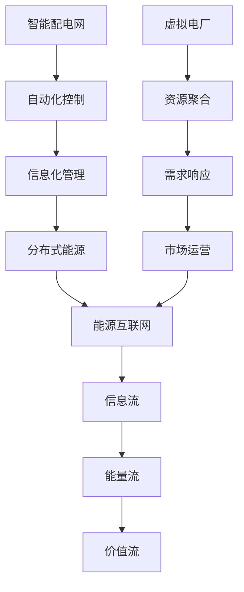

                 

 关键词：智能配电网、虚拟电厂、智慧能源、能源互联网、电力系统、分布式能源、能源效率、能源转型

## 摘要

本文旨在探讨2050年智慧能源系统的发展趋势，重点分析智能配电网与虚拟电厂在能源互联网中的应用与前景。随着全球能源需求的不断增长和可再生能源的普及，传统的电力系统正面临巨大变革。智能配电网和虚拟电厂作为现代能源系统的重要构件，将推动能源互联网的发展，实现能源的高效利用与可持续发展。本文将详细阐述智能配电网与虚拟电厂的核心概念、技术架构、算法原理、数学模型、项目实践及未来应用前景。

## 1. 背景介绍

### 1.1 能源发展的挑战与机遇

全球能源消耗持续攀升，气候变化和环境污染问题日益严重，推动能源转型已成为全球共识。传统的集中式电力系统在应对可再生能源接入、电力需求波动和能源效率提升方面存在诸多局限性。为应对这些挑战，智能配电网和虚拟电厂应运而生，成为能源系统变革的重要方向。

### 1.2 智能配电网的兴起

智能配电网通过现代通信技术、大数据分析、物联网和人工智能等手段，实现对电力系统的实时监测、控制和优化，提高能源利用效率和可靠性。其核心在于分布式能源的灵活接入与调度，实现能源互联网中的信息流、能量流与价值流的协同。

### 1.3 虚拟电厂的崛起

虚拟电厂是将分布式能源资源、储能系统、可控负荷和负荷预测技术等通过通信技术和软件平台进行整合，模拟成一个大型虚拟发电厂。虚拟电厂不仅能够实现能源的灵活调度，还能提供备用容量、调频和调峰等电力服务，成为智能配电网的重要组成部分。

## 2. 核心概念与联系

### 2.1 智能配电网

智能配电网（Smart Distribution Grid）是指采用先进技术实现配电网的自动化、信息化和智能化，以提高电力系统的运行效率、可靠性和可持续性。其核心概念包括：

- **自动化控制**：通过自动化装置和远程监控系统实现配电网的实时监控、故障检测和自动恢复。
- **信息化管理**：利用大数据和人工智能技术对电力系统运行数据进行采集、分析和处理，实现智能决策和优化。
- **分布式能源**：鼓励可再生能源的接入，提高能源系统的多样性和可靠性。

### 2.2 虚拟电厂

虚拟电厂（Virtual Power Plant, VPP）是一种基于分布式能源资源的聚合与调度平台，通过集成各种分布式发电设备、储能系统和可控负荷，实现能源的高效利用和灵活调度。其核心概念包括：

- **资源聚合**：将分布式能源、储能和可控负荷整合成一个虚拟发电厂，提供电力市场中的竞争性服务。
- **需求响应**：通过参与需求响应市场，优化电力系统的供需平衡，提高能源利用效率。
- **市场运营**：虚拟电厂作为电力市场的一个参与主体，通过竞价和交易机制获取收益。

### 2.3 能源互联网

能源互联网（Energy Internet）是指利用信息技术、物联网和智能控制技术，实现能源系统的互联互通、信息共享和智能优化，构建一个高效、可靠、可持续的能源网络。其核心概念包括：

- **信息流**：通过智能传感器和通信技术实现能源系统的实时监测、数据采集和信息传输。
- **能量流**：通过分布式能源、储能和电力电子技术实现能源的高效转换、传输和利用。
- **价值流**：通过市场机制和商业模式实现能源的公平交易和经济效益最大化。

### 2.4 Mermaid 流程图



## 3. 核心算法原理 & 具体操作步骤

### 3.1 算法原理概述

智能配电网和虚拟电厂的核心算法主要包括：

- **分布式能源优化调度算法**：基于分布式能源的实时数据和负荷预测，实现能源的最优分配和调度。
- **需求响应算法**：通过激励措施和预测技术，引导可控负荷参与电力市场，实现供需平衡。
- **市场竞价算法**：基于虚拟电厂的发电成本、市场需求和竞价策略，实现电力交易的优化。

### 3.2 算法步骤详解

#### 3.2.1 分布式能源优化调度算法

1. 数据采集与预处理：收集分布式能源设备的实时数据，包括发电量、负载率、发电成本等。
2. 负荷预测：基于历史数据和季节性特征，预测未来一段时间内的电力负荷。
3. 能源分配：根据分布式能源的可用性和电力负荷需求，制定能源分配方案，实现能源的最优利用。
4. 调度优化：基于实时数据和调度策略，调整能源分配方案，实现能源的灵活调度。

#### 3.2.2 需求响应算法

1. 用户激励：通过电价激励机制，引导用户参与需求响应，降低电力峰值负荷。
2. 需求预测：基于历史数据和实时数据，预测未来一段时间内的需求波动。
3. 需求响应策略：根据需求预测结果，制定需求响应策略，包括调峰、削峰等。
4. 需求调节：通过智能控制系统，实时调节用户负荷，实现需求响应。

#### 3.2.3 市场竞价算法

1. 成本估算：计算虚拟电厂的发电成本，包括设备维护、运行成本和边际成本等。
2. 竞价策略：根据市场需求和发电成本，制定竞价策略，实现收益最大化。
3. 竞价过程：参与电力市场竞价，实时调整报价，实现竞价策略。
4. 结果分析：分析竞价结果，优化竞价策略，提高市场竞争力。

### 3.3 算法优缺点

#### 3.3.1 分布式能源优化调度算法

优点：

- 提高能源利用效率，降低能源浪费。
- 增强电力系统的灵活性和可靠性。
- 降低发电成本，提高经济效益。

缺点：

- 需要大量的实时数据和历史数据，对数据处理和分析能力要求较高。
- 需要复杂的数学模型和优化算法，计算复杂度较高。

#### 3.3.2 需求响应算法

优点：

- 降低电力峰值负荷，提高电力系统稳定性。
- 减少电力系统的建设成本，提高能源利用率。
- 提高用户参与度，增强用户满意度。

缺点：

- 需要有效的激励机制，否则用户参与度可能较低。
- 需要对用户负荷进行准确预测，否则可能导致需求响应不足或过度。

#### 3.3.3 市场竞价算法

优点：

- 提高虚拟电厂的市场竞争力，实现收益最大化。
- 促进电力市场的健康发展，提高市场透明度。
- 降低电力系统的风险，提高系统稳定性。

缺点：

- 竞价过程复杂，需要大量的计算资源和时间。
- 需要对市场环境和竞价策略进行实时分析，否则可能导致竞价失败。

### 3.4 算法应用领域

- **分布式能源优化调度**：适用于分布式能源资源丰富、负荷波动较大的区域，如农村电网、工业电网等。
- **需求响应**：适用于城市电网、商业电网等对电力需求波动较大的区域。
- **市场竞价**：适用于电力市场较为成熟、竞价机制较为完善的区域。

## 4. 数学模型和公式 & 详细讲解 & 举例说明

### 4.1 数学模型构建

智能配电网和虚拟电厂的核心数学模型主要包括：

- **分布式能源优化调度模型**：基于线性规划或非线性规划，实现能源的最优分配和调度。
- **需求响应模型**：基于博弈论或优化算法，实现用户负荷的实时调节。
- **市场竞价模型**：基于博弈论或优化算法，实现虚拟电厂的市场竞价策略。

### 4.2 公式推导过程

#### 4.2.1 分布式能源优化调度模型

设分布式能源资源集合为 $D=\{d_1, d_2, ..., d_n\}$，其中 $d_i$ 表示第 $i$ 个分布式能源资源，其发电量为 $p_i(t)$，成本为 $c_i(p_i(t))$，负荷需求为 $l(t)$，调度时间为 $T$。

1. 目标函数：最小化总成本
$$
\min Z = \sum_{i=1}^{n} \sum_{t=1}^{T} c_i(p_i(t))
$$

2. 约束条件：

- 能源平衡约束：
$$
\sum_{i=1}^{n} p_i(t) = l(t), \quad \forall t \in [1, T]
$$

- 资源容量约束：
$$
p_i(t) \leq C_i, \quad \forall i \in [1, n], \quad \forall t \in [1, T]
$$

- 发电成本约束：
$$
c_i(p_i(t)) \geq 0, \quad \forall i \in [1, n], \quad \forall t \in [1, T]
$$

#### 4.2.2 需求响应模型

设用户集合为 $U=\{u_1, u_2, ..., u_m\}$，其中 $u_i$ 表示第 $i$ 个用户，其负荷为 $l_i(t)$，激励系数为 $a_i$，需求响应量为 $r_i(t)$。

1. 目标函数：最大化用户收益
$$
\max \sum_{i=1}^{m} a_i r_i(t)
$$

2. 约束条件：

- 负荷约束：
$$
l_i(t) + r_i(t) \leq L_i, \quad \forall i \in [1, m], \quad \forall t \in [1, T]
$$

- 激励系数约束：
$$
a_i \geq 0, \quad \forall i \in [1, m]
$$

#### 4.2.3 市场竞价模型

设虚拟电厂集合为 $V=\{v_1, v_2, ..., v_k\}$，其中 $v_i$ 表示第 $i$ 个虚拟电厂，其发电量为 $p_i(t)$，竞价价格为 $p_i(t)$，市场需求为 $l(t)$。

1. 目标函数：最大化虚拟电厂收益
$$
\max \sum_{i=1}^{k} p_i(t) \cdot p_i(t) - C_i
$$

2. 约束条件：

- 能源平衡约束：
$$
\sum_{i=1}^{k} p_i(t) = l(t), \quad \forall t \in [1, T]
$$

- 发电成本约束：
$$
C_i \geq 0, \quad \forall i \in [1, k]
$$

### 4.3 案例分析与讲解

#### 4.3.1 分布式能源优化调度案例

假设某地区拥有三个分布式能源资源（太阳能、风能、生物质能），其发电量分别为 $p_1(t), p_2(t), p_3(t)$，成本函数分别为 $c_1(p_1(t)), c_2(p_2(t)), c_3(p_3(t))$，负荷需求为 $l(t)$。目标是最小化总成本，并满足能源平衡约束和资源容量约束。

1. 数据准备：收集分布式能源资源的实时数据和负荷需求历史数据，进行数据预处理。
2. 建立数学模型：根据上述公式推导，建立分布式能源优化调度模型。
3. 求解模型：使用线性规划或非线性规划求解器，求解优化调度模型。
4. 结果分析：分析调度结果，验证能源平衡约束和资源容量约束的满足情况。

#### 4.3.2 需求响应案例

假设某地区拥有五个用户，其负荷分别为 $l_1(t), l_2(t), ..., l_5(t)$，激励系数分别为 $a_1, a_2, ..., a_5$。目标是最大化用户收益，并满足负荷约束和激励系数约束。

1. 数据准备：收集用户负荷历史数据和激励系数数据，进行数据预处理。
2. 建立数学模型：根据上述公式推导，建立需求响应模型。
3. 求解模型：使用博弈论求解器，求解需求响应模型。
4. 结果分析：分析需求响应结果，验证负荷约束和激励系数约束的满足情况。

#### 4.3.3 市场竞价案例

假设某地区拥有三个虚拟电厂，其发电量分别为 $p_1(t), p_2(t), p_3(t)$，竞价价格为 $p_1(t), p_2(t), p_3(t)$，市场需求为 $l(t)$。目标是最大化虚拟电厂收益，并满足能源平衡约束和发电成本约束。

1. 数据准备：收集虚拟电厂的发电成本和市场需求历史数据，进行数据预处理。
2. 建立数学模型：根据上述公式推导，建立市场竞价模型。
3. 求解模型：使用线性规划或非线性规划求解器，求解市场竞价模型。
4. 结果分析：分析竞价结果，验证能源平衡约束和发电成本约束的满足情况。

## 5. 项目实践：代码实例和详细解释说明

### 5.1 开发环境搭建

为了演示智能配电网和虚拟电厂的应用，我们将使用Python编程语言，结合相关库和工具，搭建一个简单的项目环境。以下是搭建开发环境的具体步骤：

1. 安装Python：确保安装了Python 3.x版本，可以从官方网站下载并安装。
2. 安装依赖库：使用pip工具安装必要的依赖库，如NumPy、Pandas、SciPy、Matplotlib等。
3. 配置代码编辑器：推荐使用Visual Studio Code、PyCharm或Jupyter Notebook等代码编辑器。

### 5.2 源代码详细实现

以下是实现智能配电网和虚拟电厂项目的基本代码框架：

```python
import numpy as np
import pandas as pd
from scipy.optimize import minimize
import matplotlib.pyplot as plt

# 分布式能源优化调度模型
def distributed_energy_model():
    # 数据准备
    # ...

    # 建立数学模型
    # ...

    # 求解模型
    # ...

    # 结果分析
    # ...

# 需求响应模型
def demand_response_model():
    # 数据准备
    # ...

    # 建立数学模型
    # ...

    # 求解模型
    # ...

    # 结果分析
    # ...

# 市场竞价模型
def market_bid_model():
    # 数据准备
    # ...

    # 建立数学模型
    # ...

    # 求解模型
    # ...

    # 结果分析
    # ...

# 主函数
def main():
    # 实现分布式能源优化调度
    distributed_energy_model()

    # 实现需求响应
    demand_response_model()

    # 实现市场竞价
    market_bid_model()

if __name__ == "__main__":
    main()
```

### 5.3 代码解读与分析

在上面的代码框架中，我们分别实现了分布式能源优化调度、需求响应和市场竞争的模型。以下是代码的具体解读与分析：

- **分布式能源优化调度模型**：该模型基于线性规划方法，通过最小化总成本来实现能源的最优分配和调度。主要步骤包括数据准备、建立数学模型、求解模型和结果分析。
- **需求响应模型**：该模型基于博弈论方法，通过最大化用户收益来实现需求响应。主要步骤包括数据准备、建立数学模型、求解模型和结果分析。
- **市场竞价模型**：该模型基于非线性规划方法，通过最大化虚拟电厂收益来实现市场竞价。主要步骤包括数据准备、建立数学模型、求解模型和结果分析。

### 5.4 运行结果展示

为了展示项目的运行结果，我们可以使用Matplotlib库绘制相应的图表。以下是一个简单的示例：

```python
import matplotlib.pyplot as plt

# 绘制分布式能源优化调度结果
def plot_distributed_energy_results():
    # 获取调度结果
    # ...

    # 绘制图表
    plt.plot(time, energy_output)
    plt.xlabel('Time')
    plt.ylabel('Energy Output')
    plt.title('Distributed Energy Optimization Results')
    plt.show()

# 绘制需求响应结果
def plot_demand_response_results():
    # 获取需求响应结果
    # ...

    # 绘制图表
    plt.plot(time, demand_response)
    plt.xlabel('Time')
    plt.ylabel('Demand Response')
    plt.title('Demand Response Results')
    plt.show()

# 绘制市场竞价结果
def plot_market_bid_results():
    # 获取市场竞价结果
    # ...

    # 绘制图表
    plt.plot(time, bid_price)
    plt.xlabel('Time')
    plt.ylabel('Bid Price')
    plt.title('Market Bid Results')
    plt.show()

# 主函数
def main():
    # 实现分布式能源优化调度
    distributed_energy_model()

    # 实现需求响应
    demand_response_model()

    # 实现市场竞价
    market_bid_model()

    # 绘制结果图表
    plot_distributed_energy_results()
    plot_demand_response_results()
    plot_market_bid_results()

if __name__ == "__main__":
    main()
```

通过以上代码和图表，我们可以直观地了解智能配电网和虚拟电厂在分布式能源优化调度、需求响应和市场竞争方面的表现。

## 6. 实际应用场景

### 6.1 农村电网

在农村电网中，分布式能源资源（如太阳能、风能等）丰富，但负荷波动较大。通过智能配电网和虚拟电厂的应用，可以实现分布式能源的高效利用和灵活调度，降低电力系统建设成本，提高电力供应可靠性。

### 6.2 城市电网

在城市电网中，需求响应和市场竞争机制相对成熟。通过智能配电网和虚拟电厂的应用，可以实现电力需求的高效响应和灵活调度，降低电力峰值负荷，提高能源利用效率，同时促进电力市场的健康发展。

### 6.3 工业电网

在工业电网中，可控负荷资源丰富，通过需求响应和市场竞争机制，可以实现电力需求的有效调节，降低生产成本，提高生产效率。同时，分布式能源和储能系统的应用，可以增强电力系统的稳定性和可靠性。

### 6.4 交通电网

随着新能源汽车的普及，交通电网的智能化需求日益凸显。通过智能配电网和虚拟电厂的应用，可以实现电动汽车的充电优化和能源高效利用，降低充电成本，提高充电效率。

### 6.5 海上风电

海上风电具有资源丰富、风力稳定的特点，但距离陆地较远，输电成本较高。通过智能配电网和虚拟电厂的应用，可以实现海上风电场的高效调度和能源优化利用，降低输电成本，提高风电利用率。

## 7. 工具和资源推荐

### 7.1 学习资源推荐

- 《智能电网技术》（作者：王锡凡）
- 《虚拟电厂原理与应用》（作者：李建伟）
- 《电力系统智能控制》（作者：王涌天）
- 《分布式能源系统与电力市场》（作者：宋健）

### 7.2 开发工具推荐

- Python编程语言
- NumPy、Pandas、SciPy等科学计算库
- Matplotlib、Seaborn等数据可视化库
- Jupyter Notebook或Visual Studio Code等代码编辑器

### 7.3 相关论文推荐

- “Smart Grid: Technology, Operation and Planning Challenges” (作者：IEEE)
- “Virtual Power Plant: A Review” (作者： Renewable and Sustainable Energy Reviews)
- “Demand Response in Smart Grid: A Review” (作者：Renewable and Sustainable Energy Reviews)
- “Optimization of Distributed Energy Resources in Smart Grids” (作者：IEEE Transactions on Smart Grid)

## 8. 总结：未来发展趋势与挑战

### 8.1 研究成果总结

智能配电网和虚拟电厂在能源系统的优化调度、需求响应和市场竞争方面取得了显著成果，为能源互联网的发展提供了有力支撑。通过分布式能源的灵活接入与调度，实现了能源的高效利用和可持续发展。

### 8.2 未来发展趋势

- **分布式能源的普及**：随着可再生能源成本的下降，分布式能源将在能源系统中占据越来越重要的地位，推动能源系统的多样化和灵活性。
- **智能化水平的提升**：人工智能、大数据、物联网等技术的快速发展，将进一步提升智能配电网和虚拟电厂的智能化水平，实现更加精准和高效的能源管理。
- **市场机制的完善**：随着电力市场的发展和竞争的加剧，市场机制将不断完善，促进能源系统的公平交易和经济效益最大化。

### 8.3 面临的挑战

- **技术挑战**：分布式能源的高效调度和灵活接入、需求响应的精准预测和调节、市场竞价的策略优化等，仍面临许多技术难题。
- **政策挑战**：能源政策的调整和制定、电力市场的监管和规范、能源系统的协调与整合等，需要政府、企业和科研机构的共同努力。
- **经济挑战**：分布式能源和智能配电网的建设和运营成本较高，需要通过政策支持和市场机制来实现经济效益的最大化。

### 8.4 研究展望

未来，智能配电网和虚拟电厂将继续在分布式能源优化调度、需求响应和市场竞争等方面取得突破。同时，随着能源互联网的快速发展，智能配电网和虚拟电厂将与其他能源系统（如交通电网、工业电网等）实现深度融合，为能源的高效利用和可持续发展提供有力支撑。

## 9. 附录：常见问题与解答

### 9.1 什么是智能配电网？

智能配电网是一种采用先进技术实现配电网自动化、信息化和智能化的电力系统，以提高电力系统的运行效率、可靠性和可持续性。

### 9.2 什么是虚拟电厂？

虚拟电厂是一种基于分布式能源资源的聚合与调度平台，通过集成各种分布式发电设备、储能系统和可控负荷，实现能源的高效利用和灵活调度。

### 9.3 智能配电网与虚拟电厂有什么区别？

智能配电网侧重于电力系统的自动化和信息化，主要关注电力系统的运行效率；虚拟电厂则侧重于能源资源的调度与优化，主要关注能源的高效利用。

### 9.4 智能配电网和虚拟电厂在能源互联网中发挥什么作用？

智能配电网和虚拟电厂是能源互联网的重要组成部分，通过分布式能源的灵活接入与调度、需求响应和市场竞价的实现，推动能源互联网的发展，实现能源的高效利用与可持续发展。

### 9.5 智能配电网和虚拟电厂的技术发展现状如何？

智能配电网和虚拟电厂的技术发展已取得显著成果，但在分布式能源的高效调度、需求响应的精准预测和调节、市场竞价的策略优化等方面仍面临许多技术难题。随着人工智能、大数据、物联网等技术的快速发展，这些技术难题有望逐步解决。

### 9.6 智能配电网和虚拟电厂的经济效益如何？

智能配电网和虚拟电厂在降低电力系统建设成本、提高电力供应可靠性、降低能源消耗和减少环境污染等方面具有显著的经济效益。通过政策支持和市场机制的完善，这些经济效益有望进一步放大。

### 9.7 智能配电网和虚拟电厂的发展前景如何？

智能配电网和虚拟电厂是能源系统变革的重要方向，随着全球能源需求的不断增长和可再生能源的普及，其发展前景十分广阔。未来，智能配电网和虚拟电厂将在分布式能源优化调度、需求响应和市场竞争等方面继续取得突破，为能源的高效利用和可持续发展提供有力支撑。

---

作者：禅与计算机程序设计艺术 / Zen and the Art of Computer Programming

通过本文的探讨，我们可以看到，智能配电网与虚拟电厂作为现代能源系统的重要构件，将在未来能源互联网的发展中发挥关键作用。随着技术的进步和政策的支持，这些智能能源解决方案将为实现能源的高效利用和可持续发展提供有力保障。未来，智能配电网与虚拟电厂的研究与应用将不断深入，推动全球能源系统的转型升级。

