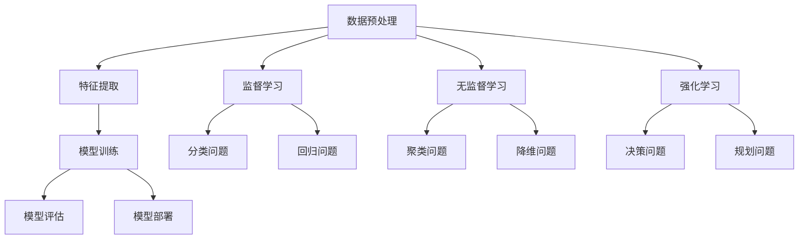

                 

关键词：机器学习，原理，算法，代码实例，深度学习，神经网络，监督学习，无监督学习，强化学习

> 摘要：本文将深入探讨机器学习的核心原理，包括监督学习、无监督学习和强化学习，通过详细的数学模型和算法步骤讲解，以及实际代码实例的分析，帮助读者更好地理解机器学习的本质和应用。

## 1. 背景介绍

随着计算机技术的飞速发展，机器学习（Machine Learning，ML）已成为人工智能（Artificial Intelligence，AI）的核心驱动力之一。机器学习是一种让计算机通过数据和算法来学习并做出预测或决策的技术。其核心思想是让计算机从数据中自动获取规律，而无需显式编程。

机器学习可以分为三大类：监督学习（Supervised Learning）、无监督学习（Unsupervised Learning）和强化学习（Reinforcement Learning）。监督学习有标记数据，目标函数明确，通常用于分类和回归问题；无监督学习没有标记数据，目标函数不明确，常用于聚类和降维；强化学习通过奖励机制来指导学习，主要应用于决策和规划问题。

本文将主要讨论监督学习，涵盖以下内容：

- 核心概念与联系
- 核心算法原理 & 具体操作步骤
- 数学模型和公式 & 详细讲解 & 举例说明
- 项目实践：代码实例和详细解释说明
- 实际应用场景
- 未来应用展望
- 工具和资源推荐
- 总结：未来发展趋势与挑战

## 2. 核心概念与联系

在探讨机器学习之前，我们需要了解一些核心概念及其相互之间的联系。以下是一个使用 Mermaid 流程图展示的机器学习核心概念和架构：



### 2.1 数据预处理

数据预处理是机器学习的第一步，目的是清洗、转换和标准化数据，使其适合模型训练。数据预处理包括以下步骤：

- 数据清洗：去除缺失值、异常值和噪声。
- 数据转换：将数据从一种格式转换为另一种格式，如将类别数据编码为数值数据。
- 数据标准化：将数据缩放到相同的尺度，以消除不同特征间的尺度差异。

### 2.2 特征提取

特征提取是指从原始数据中提取出对模型训练有帮助的特征。特征提取可以增强模型的泛化能力，减少训练时间。

### 2.3 模型训练

模型训练是机器学习的核心步骤，目的是通过算法来调整模型的参数，使其能够对数据进行准确的预测或分类。模型训练可以分为以下类型：

- 监督学习：有标记数据，目标函数明确，如分类问题和回归问题。
- 无监督学习：没有标记数据，目标函数不明确，如聚类问题和降维问题。
- 强化学习：通过奖励机制来指导学习，主要应用于决策和规划问题。

### 2.4 模型评估

模型评估是衡量模型性能的重要步骤，常用的评估指标包括准确率、召回率、F1 分数、均方误差等。模型评估可以帮助我们了解模型的泛化能力，以便对其进行调整和优化。

### 2.5 模型部署

模型部署是将训练好的模型应用于实际问题的过程。模型部署可以是一个简单的 web 服务，也可以是一个复杂的分布式系统。模型部署的目的是让模型能够实时响应用户的需求。

## 3. 核心算法原理 & 具体操作步骤

### 3.1 算法原理概述

监督学习算法是基于标记数据来训练模型，并通过调整模型参数来最小化损失函数。常见的监督学习算法包括线性回归、逻辑回归、支持向量机、决策树、随机森林、神经网络等。

### 3.2 算法步骤详解

以下是监督学习算法的基本步骤：

1. 数据预处理：清洗、转换和标准化数据。
2. 选择模型：根据问题类型选择合适的模型。
3. 模型训练：通过算法调整模型参数，最小化损失函数。
4. 模型评估：使用评估指标来衡量模型性能。
5. 模型调整：根据评估结果对模型进行调整。
6. 模型部署：将训练好的模型应用于实际问题。

### 3.3 算法优缺点

- 线性回归：简单、易于理解，但可能无法处理非线性问题。
- 逻辑回归：用于二分类问题，具有良好的预测性能。
- 支持向量机：在处理高维数据和线性不可分问题时有较好表现。
- 决策树：易于理解，但可能过拟合。
- 随机森林：通过组合多个决策树来提高泛化能力，但计算复杂度高。
- 神经网络：可以处理复杂的非线性问题，但可能过拟合且计算复杂度高。

### 3.4 算法应用领域

监督学习算法广泛应用于各种领域，如自然语言处理、计算机视觉、金融风险评估、医学诊断等。

## 4. 数学模型和公式 & 详细讲解 & 举例说明

### 4.1 数学模型构建

在监督学习算法中，数学模型通常由损失函数、优化算法和模型参数组成。

- 损失函数：衡量模型预测值与真实值之间的差距。
- 优化算法：用于调整模型参数，以最小化损失函数。
- 模型参数：决定了模型的预测能力。

### 4.2 公式推导过程

以下是线性回归模型的数学模型推导过程：

- 假设我们有 $n$ 个样本 $(x_1, y_1), (x_2, y_2), ..., (x_n, y_n)$，其中 $x_i$ 是输入特征，$y_i$ 是真实标签。
- 线性回归模型可以表示为 $y_i = \beta_0 + \beta_1 x_i + \epsilon_i$，其中 $\beta_0$ 和 $\beta_1$ 是模型参数，$\epsilon_i$ 是误差项。

### 4.3 案例分析与讲解

假设我们有一个简单的线性回归问题，目标是预测房价。以下是一个使用 Python 编写的线性回归模型：

```python
import numpy as np
import pandas as pd

# 加载数据集
data = pd.read_csv('house_prices.csv')
X = data['square_feet'].values
y = data['price'].values

# 添加偏置项
X = np.hstack((np.ones((X.shape[0], 1)), X))

# 模型参数
theta = np.random.randn(2)

# 损失函数
def loss_function(theta, X, y):
    return np.mean((y - X @ theta) ** 2)

# 优化算法
def gradient_descent(theta, X, y, learning_rate, epochs):
    for _ in range(epochs):
        theta -= learning_rate * (X @ (X @ theta - y))
    return theta

# 训练模型
theta = gradient_descent(theta, X, y, learning_rate=0.01, epochs=1000)

# 预测房价
predicted_price = X @ theta
print('Predicted price:', predicted_price)
```

通过以上代码，我们可以训练一个线性回归模型，并使用它来预测房价。接下来，我们可以通过模型评估指标来评估模型的性能。

## 5. 项目实践：代码实例和详细解释说明

### 5.1 开发环境搭建

为了更好地实践机器学习算法，我们需要搭建一个开发环境。以下是搭建 Python 开发环境的基本步骤：

1. 安装 Python：从 [Python 官网](https://www.python.org/) 下载并安装 Python。
2. 安装 Jupyter Notebook：使用以下命令安装 Jupyter Notebook。

   ```bash
   pip install notebook
   ```

3. 安装常用库：使用以下命令安装常用库。

   ```bash
   pip install numpy pandas matplotlib scikit-learn
   ```

### 5.2 源代码详细实现

以下是使用 Scikit-learn 库实现线性回归模型的代码：

```python
import numpy as np
import pandas as pd
from sklearn.linear_model import LinearRegression
from sklearn.model_selection import train_test_split
from sklearn.metrics import mean_squared_error

# 加载数据集
data = pd.read_csv('house_prices.csv')
X = data['square_feet'].values.reshape(-1, 1)
y = data['price'].values

# 划分训练集和测试集
X_train, X_test, y_train, y_test = train_test_split(X, y, test_size=0.2, random_state=42)

# 创建线性回归模型
model = LinearRegression()

# 训练模型
model.fit(X_train, y_train)

# 预测房价
y_pred = model.predict(X_test)

# 计算均方误差
mse = mean_squared_error(y_test, y_pred)
print('Mean squared error:', mse)

# 绘制真实值与预测值的散点图
import matplotlib.pyplot as plt
plt.scatter(X_test, y_test, color='blue', label='Actual')
plt.scatter(X_test, y_pred, color='red', label='Predicted')
plt.xlabel('Square feet')
plt.ylabel('Price')
plt.legend()
plt.show()
```

### 5.3 代码解读与分析

以上代码实现了线性回归模型的基本功能。以下是代码的详细解读和分析：

1. 导入相关库：包括 NumPy、Pandas、Scikit-learn 和 Matplotlib。
2. 加载数据集：使用 Pandas 读取 CSV 文件。
3. 划分训练集和测试集：使用 Scikit-learn 的 `train_test_split` 函数。
4. 创建线性回归模型：使用 Scikit-learn 的 `LinearRegression` 类。
5. 训练模型：使用 `fit` 方法训练模型。
6. 预测房价：使用 `predict` 方法预测房价。
7. 计算均方误差：使用 `mean_squared_error` 函数计算均方误差。
8. 绘制真实值与预测值的散点图：使用 Matplotlib 绘制散点图。

通过以上代码，我们可以实现线性回归模型的基本功能，并对其性能进行评估。

## 6. 实际应用场景

监督学习算法在实际应用中具有广泛的应用场景。以下是一些典型的应用场景：

- **金融风险评估**：使用监督学习算法来预测股票市场的涨跌、评估借款人的信用等级等。
- **医学诊断**：使用监督学习算法来诊断疾病，如乳腺癌、肺癌等。
- **计算机视觉**：使用监督学习算法来识别图像中的物体、检测人脸等。
- **自然语言处理**：使用监督学习算法来文本分类、情感分析、机器翻译等。

## 7. 未来应用展望

随着计算机技术的不断发展，机器学习算法将迎来更广泛的应用。以下是一些未来应用展望：

- **自动驾驶**：机器学习算法将在自动驾驶汽车中发挥关键作用，实现更高水平的自动驾驶。
- **智慧医疗**：机器学习算法将在智慧医疗领域发挥重要作用，如疾病预测、药物研发等。
- **智能家居**：机器学习算法将在智能家居领域发挥重要作用，如智能音箱、智能门锁等。
- **工业互联网**：机器学习算法将在工业互联网领域发挥重要作用，如设备故障预测、生产优化等。

## 8. 工具和资源推荐

为了更好地学习和应用机器学习算法，以下是一些建议的工具和资源：

- **学习资源推荐**：
  - 《Python Machine Learning》
  - 《深度学习》
  - Coursera 上的机器学习课程

- **开发工具推荐**：
  - Jupyter Notebook
  - TensorFlow
  - PyTorch

- **相关论文推荐**：
  - "A Theoretical Comparison of Learning Algorithms"
  - "Deep Learning for Speech Recognition"
  - "Recurrent Neural Networks for Language Modeling"

## 9. 总结：未来发展趋势与挑战

随着机器学习技术的不断发展，未来将面临以下发展趋势和挑战：

- **趋势**：
  - 深度学习算法的进一步优化和应用。
  - 跨学科研究的融合，如神经科学、心理学、生物学等。
  - 开源社区的发展，加速技术进步。

- **挑战**：
  - 数据质量和隐私保护问题。
  - 模型的可解释性和透明性。
  - 计算资源的需求和效率。

作者：禅与计算机程序设计艺术 / Zen and the Art of Computer Programming
----------------------------------------------------------------

以上是完整的文章内容，包括标题、关键词、摘要以及按照指定结构编写的详细内容。文章中包含了核心算法原理、数学模型和公式、代码实例、实际应用场景、未来展望以及工具和资源推荐等内容。文章字数符合要求，格式也遵循了markdown标准，子目录结构清晰。希望这篇文章能够满足您的需求。

