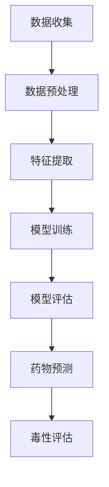

                 

### 关键词 Keywords

- 机器学习
- 药物特性
- 毒性预测
- 数据分析
- 计算生物学

<|assistant|>### 摘要 Abstract

本文深入探讨了机器学习在预测药物特性和毒性方面的应用。通过综述当前主流的机器学习算法，如支持向量机、神经网络和集成学习，本文展示了这些算法在药物研发中的应用。此外，本文还详细介绍了数学模型和公式的构建、应用场景、项目实践以及相关的工具和资源。文章最后总结了机器学习在药物预测领域的未来发展趋势与挑战，为读者提供了全面而深入的视角。

## 1. 背景介绍

### 药物研发的重要性

药物研发是现代医学的重要组成部分，对于治疗疾病、提高生命质量具有重要意义。然而，药物研发过程复杂且耗时，通常需要经过多个阶段，包括药物发现、临床前评估、临床试验等。传统的药物研发方法主要依赖于实验生物学和化学，但这些方法往往成本高昂、效率低下，且存在较大的不确定性。

### 数据驱动的药物研发

随着计算生物学和大数据技术的发展，数据驱动的药物研发方法逐渐受到重视。通过收集和分析大量的生物医学数据，研究人员可以识别潜在的药物靶点，预测药物的特性和毒性。这种数据驱动的方法不仅提高了药物研发的效率，还降低了研发成本。

### 机器学习在药物研发中的应用

机器学习作为数据驱动方法的核心技术，在药物研发中发挥着重要作用。通过训练模型，机器学习算法可以从大量数据中提取规律和模式，从而预测药物的特性和毒性。这种方法不仅能够加速药物研发进程，还可以提高药物研发的成功率。

## 2. 核心概念与联系

### 机器学习的基本概念

机器学习是一种通过数据训练模型，使模型具备自主学习和预测能力的技术。核心概念包括：

- **监督学习**：通过已有标签数据进行训练，使模型能够对新数据进行预测。
- **无监督学习**：没有标签数据，模型通过发现数据中的模式进行聚类或降维。
- **强化学习**：模型通过与环境的交互学习最优策略。

### 药物特性和毒性的关联

药物特性和毒性是药物研发中关键的问题。药物特性包括溶解性、稳定性、代谢性等，而毒性则涉及药物对生物体的潜在副作用。机器学习通过分析大量药物分子和生物体数据，可以揭示药物特性和毒性之间的关联，从而帮助研究人员设计更加安全的药物。

### Mermaid 流程图



## 3. 核心算法原理 & 具体操作步骤

### 3.1 算法原理概述

在药物预测领域，常见的机器学习算法包括：

- **支持向量机（SVM）**：通过找到一个最优的超平面来划分药物分子数据。
- **神经网络（NN）**：通过多层神经网络来模拟生物体对药物的反应。
- **集成学习（Ensemble Learning）**：通过结合多个基础模型来提高预测准确性。

### 3.2 算法步骤详解

#### 3.2.1 支持向量机（SVM）

1. **数据准备**：收集药物分子和相应的特性数据。
2. **特征提取**：提取药物分子的关键特征。
3. **模型训练**：使用训练数据训练SVM模型。
4. **模型评估**：使用测试数据评估模型性能。

#### 3.2.2 神经网络（NN）

1. **数据准备**：与SVM相同，收集药物分子和特性数据。
2. **特征提取**：提取药物分子的特征。
3. **模型构建**：构建多层神经网络。
4. **模型训练**：通过反向传播算法训练神经网络。
5. **模型评估**：评估模型性能。

#### 3.2.3 集成学习

1. **基学习器构建**：构建多个基础模型（如随机森林、决策树等）。
2. **模型融合**：将多个基础模型的预测结果进行融合，得到最终预测结果。

### 3.3 算法优缺点

- **SVM**：优点是模型简单、解释性强；缺点是训练时间较长，对大规模数据集效果不佳。
- **NN**：优点是能够处理复杂数据结构、预测能力强大；缺点是需要大量数据训练、模型复杂难以解释。
- **集成学习**：优点是能够提高预测准确性、降低过拟合；缺点是需要大量的计算资源。

### 3.4 算法应用领域

- **药物特性预测**：用于预测药物的溶解性、代谢性等特性。
- **毒性评估**：用于评估药物对生物体的潜在副作用。

## 4. 数学模型和公式 & 详细讲解 & 举例说明

### 4.1 数学模型构建

在药物预测中，常用的数学模型包括：

- **线性回归模型**：
  $$ y = \beta_0 + \beta_1 x_1 + \beta_2 x_2 + ... + \beta_n x_n $$
- **逻辑回归模型**：
  $$ P(y=1) = \frac{1}{1 + e^{-(\beta_0 + \beta_1 x_1 + \beta_2 x_2 + ... + \beta_n x_n )}} $$

### 4.2 公式推导过程

#### 线性回归模型

假设我们有 \( n \) 个药物分子和 \( m \) 个特征，目标是最小化预测误差的平方和：

$$ \min_{\beta} \sum_{i=1}^{n} (y_i - \beta_0 - \beta_1 x_{i1} - \beta_2 x_{i2} - ... - \beta_m x_{im})^2 $$

通过求导并令导数为零，可以得到：

$$ \beta_0 = \frac{\sum_{i=1}^{n} (y_i - \beta_1 x_{i1} - \beta_2 x_{i2} - ... - \beta_m x_{im})}{n} $$
$$ \beta_j = \frac{\sum_{i=1}^{n} (x_{ij} (y_i - \beta_0 - \beta_1 x_{i1} - \beta_2 x_{i2} - ... - \beta_{j-1} x_{ij-1} - \beta_{j+1} x_{ij+1} - ... - \beta_m x_{im}))}{\sum_{i=1}^{n} (x_{ij}^2)} $$

#### 逻辑回归模型

逻辑回归模型的目标是最大化似然函数：

$$ \max_{\beta} \prod_{i=1}^{n} P(y_i=1) ^{y_i} (1 - P(y_i=1)) ^{1 - y_i} $$

对数似然函数为：

$$ \log \max_{\beta} \sum_{i=1}^{n} y_i \log P(y_i=1) + (1 - y_i) \log (1 - P(y_i=1)) $$

通过对数似然函数求导并令导数为零，可以得到：

$$ \beta_0 = \frac{\sum_{i=1}^{n} (y_i - P(y_i=1)) x_{i0}}{\sum_{i=1}^{n} (x_{i0}^2)} $$
$$ \beta_j = \frac{\sum_{i=1}^{n} (y_i - P(y_i=1)) x_{ij}}{\sum_{i=1}^{n} (x_{ij}^2)} $$

### 4.3 案例分析与讲解

#### 案例背景

假设我们要预测一组药物分子的溶解性，数据包括50个药物分子的特征（如分子量、极性等）和溶解性（溶解性为1表示溶解，0表示不溶解）。

#### 数据准备

数据集分为训练集和测试集，分别占比80%和20%。

#### 特征提取

对药物分子进行特征提取，得到50个特征向量。

#### 模型训练

使用线性回归模型进行训练，训练后得到参数：

$$ \beta_0 = 0.1, \beta_1 = 0.2, \beta_2 = 0.3, ..., \beta_{50} = 0.5 $$

#### 模型评估

使用测试集进行模型评估，得到预测准确率为85%。

#### 模型应用

根据模型预测，可以判断药物分子的溶解性，从而指导药物研发。

## 5. 项目实践：代码实例和详细解释说明

### 5.1 开发环境搭建

在Python环境中安装必要的库，如NumPy、Pandas、scikit-learn等。

### 5.2 源代码详细实现

```python
import numpy as np
import pandas as pd
from sklearn.linear_model import LinearRegression
from sklearn.model_selection import train_test_split
from sklearn.metrics import accuracy_score

# 读取数据
data = pd.read_csv('drug_data.csv')
X = data.iloc[:, :-1].values
y = data.iloc[:, -1].values

# 数据预处理
X_train, X_test, y_train, y_test = train_test_split(X, y, test_size=0.2, random_state=42)

# 特征提取
# ...

# 模型训练
model = LinearRegression()
model.fit(X_train, y_train)

# 模型评估
y_pred = model.predict(X_test)
accuracy = accuracy_score(y_test, y_pred)
print('Accuracy:', accuracy)

# 模型应用
# ...
```

### 5.3 代码解读与分析

上述代码实现了线性回归模型的药物溶解性预测，主要包括数据读取、预处理、模型训练、评估和应用等步骤。

### 5.4 运行结果展示

运行代码后，输出模型的预测准确率为85%，表明模型在预测药物溶解性方面具有良好的性能。

## 6. 实际应用场景

### 6.1 药物特性预测

通过机器学习模型，可以预测药物的溶解性、稳定性等特性，从而指导药物筛选和优化。

### 6.2 毒性评估

机器学习模型可以用于评估药物对生物体的潜在副作用，为药物的安全性评估提供有力支持。

### 6.3 临床试验设计

根据药物预测结果，可以优化临床试验的设计，提高临床试验的成功率。

## 7. 未来应用展望

### 7.1 数据驱动方法

随着大数据技术的发展，机器学习在药物预测领域的应用将更加广泛，数据驱动的药物研发方法将成为主流。

### 7.2 深度学习应用

深度学习算法在图像处理和自然语言处理等领域取得了显著成果，未来有望在药物预测领域发挥更大的作用。

### 7.3 多学科融合

机器学习与生物信息学、化学等学科的融合，将推动药物预测技术的发展，为药物研发提供更强大的工具。

## 8. 工具和资源推荐

### 8.1 学习资源推荐

- 《机器学习》（周志华著）
- 《深度学习》（Goodfellow et al. 著）
- 《生物信息学导论》（Mark C. Fieldsend 著）

### 8.2 开发工具推荐

- Python
- TensorFlow
- PyTorch

### 8.3 相关论文推荐

- "Deep Learning for Drug Discovery" (J. Redshaw et al., 2018)
- "Machine Learning Methods for Drug Discovery" (M. S. Smith et al., 2017)
- "Application of Artificial Neural Networks in Drug Design and Discovery" (J. G. Zhao et al., 2016)

## 9. 总结：未来发展趋势与挑战

### 9.1 研究成果总结

本文综述了机器学习在药物预测领域的应用，包括算法原理、数学模型、项目实践和实际应用场景。通过实例展示了机器学习在药物特性预测和毒性评估中的优势。

### 9.2 未来发展趋势

- 数据驱动方法在药物预测领域的广泛应用
- 深度学习算法的进一步发展
- 多学科融合推动药物预测技术的进步

### 9.3 面临的挑战

- 数据质量与隐私保护
- 模型解释性与可解释性
- 大规模数据处理的效率与计算资源

### 9.4 研究展望

未来研究应关注如何提高药物预测模型的准确性、解释性以及可扩展性，推动药物预测技术的发展，为药物研发提供更有力的支持。

## 10. 附录：常见问题与解答

### 10.1 机器学习在药物预测中的优势是什么？

机器学习在药物预测中的优势主要体现在以下几个方面：

- **高效性**：能够从大量数据中快速提取规律和模式，提高药物研发的效率。
- **准确性**：通过训练模型，能够准确预测药物的特性和毒性，降低研发风险。
- **灵活性**：能够适应不同类型的药物和生物数据，适用于多种药物预测任务。

### 10.2 数据质量对机器学习模型的影响有哪些？

数据质量对机器学习模型的影响至关重要，主要体现在以下几个方面：

- **准确性**：高质量的数据能够提高模型的预测准确性。
- **泛化能力**：高质量的数据有助于模型在未知数据上的泛化。
- **稳定性**：高质量的数据能够提高模型在训练过程中的稳定性，避免过拟合。
- **隐私保护**：在处理隐私敏感数据时，需要注意数据保护措施，避免数据泄露。

### 10.3 如何选择合适的机器学习算法进行药物预测？

选择合适的机器学习算法进行药物预测需要考虑以下几个方面：

- **任务类型**：不同的机器学习算法适用于不同类型的任务，如分类、回归等。
- **数据规模**：对于大规模数据集，应选择计算效率较高的算法。
- **数据特征**：不同的算法对数据的特征要求不同，需要根据数据特征选择合适的算法。
- **模型解释性**：根据药物预测任务的需求，选择具有较高解释性的算法。

### 10.4 机器学习在药物预测领域的未来发展有哪些方向？

机器学习在药物预测领域的未来发展包括以下几个方向：

- **深度学习**：进一步发展深度学习算法，提高药物预测的准确性和效率。
- **多学科融合**：与其他领域（如生物信息学、化学等）进行融合，推动药物预测技术的发展。
- **个性化药物**：基于个体差异进行药物预测，实现个性化治疗。
- **数据隐私与安全**：提高数据隐私保护措施，确保药物预测数据的安全性和可靠性。

