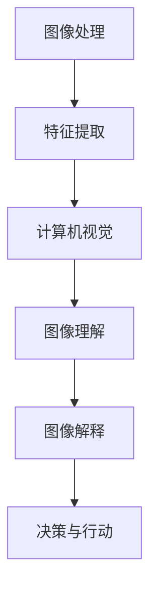

                 

关键词：计算机视觉、图像处理、人工智能、深度学习、目标检测、图像识别、机器学习

摘要：本文将深入探讨机器视觉的基本概念、核心算法、数学模型、实际应用以及未来发展趋势。通过详细的算法原理讲解、项目实践、数学公式推导，我们将帮助读者全面理解并掌握机器视觉的关键技术，展望其未来在各个领域的应用前景。

## 1. 背景介绍

机器视觉，即计算机视觉（Computer Vision），是人工智能（Artificial Intelligence，AI）的重要分支之一，它旨在使计算机具备处理和解释图像或视频数据的能力。随着计算机处理能力的提高和深度学习算法的不断发展，机器视觉技术已经广泛应用于医疗、自动驾驶、安防监控、工业检测等诸多领域，极大地推动了人工智能技术的发展。

### 1.1 发展历程

- **早期阶段**：20世纪50年代到70年代，主要研究图像处理和特征提取，如边缘检测、形态学操作等。
- **中期阶段**：80年代到90年代，开始引入统计模型和结构化方法，如神经网络和决策树等。
- **现阶段**：21世纪初至今，深度学习算法的兴起使得机器视觉技术取得了突破性的进展，如卷积神经网络（CNN）、循环神经网络（RNN）等。

### 1.2 应用领域

- **医疗**：辅助诊断、手术导航、健康监测等。
- **自动驾驶**：车辆检测、路径规划、交通信号识别等。
- **安防监控**：人脸识别、行为分析、异常检测等。
- **工业检测**：质量检测、设备监控、生产调度等。

## 2. 核心概念与联系

### 2.1 定义

- **图像处理**：对图像进行加工和处理，以改善其质量或提取有用信息。
- **计算机视觉**：使计算机能够从图像或视频中提取有用信息，进行理解、解释和决策。

### 2.2 关系

图像处理是计算机视觉的基础，它负责对图像进行预处理，提取特征，而计算机视觉则利用这些特征进行更高层次的图像理解和分析。

### 2.3 Mermaid 流程图



## 3. 核心算法原理 & 具体操作步骤

### 3.1 算法原理概述

机器视觉的核心算法主要包括图像处理算法、特征提取算法和图像识别算法。

- **图像处理**：包括图像增强、滤波、边缘检测等。
- **特征提取**：包括纹理特征、形状特征、颜色特征等。
- **图像识别**：利用分类器或神经网络对图像进行分类或识别。

### 3.2 算法步骤详解

1. **图像预处理**：包括图像灰度化、二值化、去噪等。
2. **特征提取**：根据图像内容选择合适的特征提取算法。
3. **图像识别**：利用分类器对提取的特征进行分类。

### 3.3 算法优缺点

- **图像处理**：优点是简单易行，缺点是可能丢失图像信息。
- **特征提取**：优点是提取的信息丰富，缺点是计算量大。
- **图像识别**：优点是准确度高，缺点是可能受到噪声影响。

### 3.4 算法应用领域

- **图像处理**：广泛应用于图像质量改善、图像压缩等领域。
- **特征提取**：广泛应用于人脸识别、物体检测等领域。
- **图像识别**：广泛应用于自动驾驶、医疗诊断等领域。

## 4. 数学模型和公式 & 详细讲解 & 举例说明

### 4.1 数学模型构建

在机器视觉中，常用的数学模型包括线性模型、概率模型和神经网络模型。

### 4.2 公式推导过程

- **线性模型**：

  $$y = \omega \cdot x + b$$

  其中，$x$ 是输入特征，$y$ 是输出结果，$\omega$ 是权重，$b$ 是偏置。

- **概率模型**：

  $$P(y|x) = \frac{1}{Z} \exp(\sum_{i=1}^{n} \omega_i x_i)$$

  其中，$x$ 是输入特征，$y$ 是输出结果，$\omega_i$ 是权重，$Z$ 是规范化常数。

- **神经网络模型**：

  $$a_{l+1} = \sigma(\sum_{i=1}^{n} \omega_{li} a_l + b_l)$$

  其中，$a_l$ 是第 $l$ 层的输出，$\sigma$ 是激活函数，$\omega_{li}$ 是权重，$b_l$ 是偏置。

### 4.3 案例分析与讲解

假设我们有一个二分类问题，使用线性模型进行预测。给定一个输入特征向量 $x = [x_1, x_2, x_3]$，权重向量 $\omega = [\omega_1, \omega_2, \omega_3]$，偏置 $b = 0$，我们希望预测输出结果 $y$。

根据线性模型：

$$y = \omega \cdot x + b = \omega_1 x_1 + \omega_2 x_2 + \omega_3 x_3$$

假设 $\omega = [1, 1, 1]$，$b = 0$，$x = [1, 0, 1]$，则：

$$y = 1 \cdot 1 + 1 \cdot 0 + 1 \cdot 1 = 2$$

因此，输出结果为 $y = 2$，这是一个正类。

## 5. 项目实践：代码实例和详细解释说明

### 5.1 开发环境搭建

- **Python**：安装 Python 3.8 或更高版本。
- **TensorFlow**：安装 TensorFlow 2.4 或更高版本。
- **OpenCV**：安装 OpenCV 4.0 或更高版本。

### 5.2 源代码详细实现

以下是一个使用 TensorFlow 和 OpenCV 实现的人脸检测的示例代码：

```python
import cv2
import tensorflow as tf

# 加载预训练的模型
model = tf.keras.models.load_model('face_detection_model.h5')

# 加载 OpenCV 人脸检测器
face_cascade = cv2.CascadeClassifier('haarcascade_frontalface_default.xml')

# 读取图像
image = cv2.imread('face.jpg')

# 转为灰度图像
gray = cv2.cvtColor(image, cv2.COLOR_BGR2GRAY)

# 使用 OpenCV 人脸检测器进行检测
faces = face_cascade.detectMultiScale(gray)

# 使用 TensorFlow 模型进行人脸检测
detections = model.predict(gray.reshape(-1, 28, 28, 1))

# 绘制检测结果
for (x, y, w, h) in faces:
    cv2.rectangle(image, (x, y), (x+w, y+h), (0, 0, 255), 2)

for i, detection in enumerate(detections[0]):
    if detection[0] > 0.5:
        x, y = int(detection[1]*image.shape[1]), int(detection[2]*image.shape[0])
        cv2.rectangle(image, (x, y), (x+w, y+h), (0, 255, 0), 2)

# 显示结果
cv2.imshow('Face Detection', image)
cv2.waitKey(0)
cv2.destroyAllWindows()
```

### 5.3 代码解读与分析

- **模型加载**：使用 TensorFlow 的 `load_model` 函数加载预训练的模型。
- **图像读取**：使用 OpenCV 的 `imread` 函数读取图像。
- **图像预处理**：将图像转为灰度图像，以便进行人脸检测。
- **人脸检测**：使用 OpenCV 的人脸检测器进行人脸检测。
- **模型检测**：使用 TensorFlow 模型对灰度图像进行人脸检测。
- **结果绘制**：将检测结果绘制在原图上，并显示结果。

## 6. 实际应用场景

### 6.1 自动驾驶

自动驾驶系统需要通过机器视觉技术进行环境感知，包括车辆检测、行人检测、交通标志识别等。通过这些技术，自动驾驶系统能够实时分析道路情况，做出安全驾驶决策。

### 6.2 医疗诊断

机器视觉技术在医疗领域有着广泛的应用，如医学影像分析、病理图像识别、手术导航等。通过这些技术，可以提高诊断的准确性和效率，为患者提供更优质的医疗服务。

### 6.3 安防监控

安防监控系统中，机器视觉技术可以用于人脸识别、行为分析、异常检测等。这些技术可以帮助提高监控系统的智能化程度，增强安全保障。

### 6.4 工业检测

工业检测中，机器视觉技术可以用于质量检测、设备监控、生产调度等。通过这些技术，可以提高生产效率，降低生产成本，保证产品质量。

## 7. 工具和资源推荐

### 7.1 学习资源推荐

- **《计算机视觉：算法与应用》**：经典的计算机视觉教材，全面讲解了计算机视觉的基础知识。
- **《深度学习》**：由 Ian Goodfellow 等人编写的深度学习教材，详细介绍了深度学习算法和应用。

### 7.2 开发工具推荐

- **TensorFlow**：一款强大的深度学习框架，适用于机器视觉项目的开发和实现。
- **OpenCV**：一款开源的计算机视觉库，提供了丰富的计算机视觉算法和工具。

### 7.3 相关论文推荐

- **《卷积神经网络在图像分类中的应用》**：介绍了卷积神经网络在图像分类中的应用和效果。
- **《基于深度学习的目标检测研究综述》**：综述了深度学习在目标检测领域的最新研究进展。

## 8. 总结：未来发展趋势与挑战

### 8.1 研究成果总结

近年来，机器视觉技术在图像处理、特征提取、图像识别等方面取得了显著进展，应用领域也在不断拓展。深度学习算法的广泛应用使得机器视觉技术达到了新的高度。

### 8.2 未来发展趋势

随着人工智能技术的不断发展，机器视觉技术将更加智能化、自适应化。未来，我们将看到更多基于机器视觉的智能应用，如智能监控、智能医疗、智能交通等。

### 8.3 面临的挑战

机器视觉技术在应用过程中仍面临一些挑战，如数据质量、计算效率、模型可解释性等。解决这些问题将有助于推动机器视觉技术的进一步发展。

### 8.4 研究展望

未来，机器视觉技术将在更多领域得到应用，如智能制造、智能农业、智能安防等。同时，随着算法的改进和硬件的发展，机器视觉技术的性能和效率将不断提升。

## 9. 附录：常见问题与解答

### 9.1 什么是机器视觉？

机器视觉是使计算机能够处理和解释图像或视频数据的能力，它是人工智能的重要分支之一。

### 9.2 机器视觉有哪些应用领域？

机器视觉广泛应用于医疗、自动驾驶、安防监控、工业检测等领域。

### 9.3 机器视觉的核心算法有哪些？

机器视觉的核心算法包括图像处理、特征提取和图像识别。

### 9.4 机器视觉的未来发展趋势是什么？

机器视觉的未来发展趋势是智能化、自适应化，将更多应用于各个领域。

## 作者署名

作者：禅与计算机程序设计艺术 / Zen and the Art of Computer Programming
```markdown
---
## 机器视觉 (Computer Vision)

### 关键词
计算机视觉、图像处理、人工智能、深度学习、目标检测、图像识别、机器学习

### 摘要
本文深入探讨机器视觉的基本概念、核心算法、数学模型、实际应用以及未来发展趋势。通过详细的算法原理讲解、项目实践、数学公式推导，读者将全面掌握机器视觉的关键技术，并展望其在未来各个领域的应用前景。

## 1. 背景介绍

#### 1.1 发展历程
机器视觉，即计算机视觉（Computer Vision），是人工智能（Artificial Intelligence，AI）的重要分支之一。自20世纪50年代起，计算机视觉领域经历了从图像处理到机器学习再到深度学习的演进。

- **早期阶段**：20世纪50年代到70年代，主要研究图像处理和特征提取，如边缘检测、形态学操作等。
- **中期阶段**：80年代到90年代，开始引入统计模型和结构化方法，如神经网络和决策树等。
- **现阶段**：21世纪初至今，深度学习算法的兴起使得机器视觉技术取得了突破性的进展，如卷积神经网络（CNN）、循环神经网络（RNN）等。

#### 1.2 应用领域
机器视觉技术已经广泛应用于多个领域，包括但不限于：

- **医疗**：辅助诊断、手术导航、健康监测等。
- **自动驾驶**：车辆检测、路径规划、交通信号识别等。
- **安防监控**：人脸识别、行为分析、异常检测等。
- **工业检测**：质量检测、设备监控、生产调度等。

## 2. 核心概念与联系

#### 2.1 定义
- **图像处理**：对图像进行加工和处理，以改善其质量或提取有用信息。
- **计算机视觉**：使计算机能够从图像或视频中提取有用信息，进行理解、解释和决策。

#### 2.2 关系
图像处理是计算机视觉的基础，它负责对图像进行预处理，提取特征，而计算机视觉则利用这些特征进行更高层次的图像理解和分析。

#### 2.3 Mermaid 流程图


## 3. 核心算法原理 & 具体操作步骤

### 3.1 算法原理概述
机器视觉的核心算法主要包括图像处理算法、特征提取算法和图像识别算法。

- **图像处理**：包括图像增强、滤波、边缘检测等。
- **特征提取**：包括纹理特征、形状特征、颜色特征等。
- **图像识别**：利用分类器或神经网络对图像进行分类或识别。

### 3.2 算法步骤详解

1. **图像预处理**：包括图像灰度化、二值化、去噪等。
2. **特征提取**：根据图像内容选择合适的特征提取算法。
3. **图像识别**：利用分类器对提取的特征进行分类。

### 3.3 算法优缺点
- **图像处理**：优点是简单易行，缺点是可能丢失图像信息。
- **特征提取**：优点是提取的信息丰富，缺点是计算量大。
- **图像识别**：优点是准确度高，缺点是可能受到噪声影响。

### 3.4 算法应用领域
- **图像处理**：广泛应用于图像质量改善、图像压缩等领域。
- **特征提取**：广泛应用于人脸识别、物体检测等领域。
- **图像识别**：广泛应用于自动驾驶、医疗诊断等领域。

## 4. 数学模型和公式 & 详细讲解 & 举例说明

### 4.1 数学模型构建
在机器视觉中，常用的数学模型包括线性模型、概率模型和神经网络模型。

### 4.2 公式推导过程
- **线性模型**：
  
  $$y = \omega \cdot x + b$$

  其中，$x$ 是输入特征，$y$ 是输出结果，$\omega$ 是权重，$b$ 是偏置。

- **概率模型**：
  
  $$P(y|x) = \frac{1}{Z} \exp(\sum_{i=1}^{n} \omega_i x_i)$$

  其中，$x$ 是输入特征，$y$ 是输出结果，$\omega_i$ 是权重，$Z$ 是规范化常数。

- **神经网络模型**：
  
  $$a_{l+1} = \sigma(\sum_{i=1}^{n} \omega_{li} a_l + b_l)$$

  其中，$a_l$ 是第 $l$ 层的输出，$\sigma$ 是激活函数，$\omega_{li}$ 是权重，$b_l$ 是偏置。

### 4.3 案例分析与讲解
假设我们有一个二分类问题，使用线性模型进行预测。给定一个输入特征向量 $x = [x_1, x_2, x_3]$，权重向量 $\omega = [\omega_1, \omega_2, \omega_3]$，偏置 $b = 0$，我们希望预测输出结果 $y$。

根据线性模型：

$$y = \omega \cdot x + b = \omega_1 x_1 + \omega_2 x_2 + \omega_3 x_3$$

假设 $\omega = [1, 1, 1]$，$b = 0$，$x = [1, 0, 1]$，则：

$$y = 1 \cdot 1 + 1 \cdot 0 + 1 \cdot 1 = 2$$

因此，输出结果为 $y = 2$，这是一个正类。

## 5. 项目实践：代码实例和详细解释说明

### 5.1 开发环境搭建
- **Python**：安装 Python 3.8 或更高版本。
- **TensorFlow**：安装 TensorFlow 2.4 或更高版本。
- **OpenCV**：安装 OpenCV 4.0 或更高版本。

### 5.2 源代码详细实现
以下是一个使用 TensorFlow 和 OpenCV 实现的人脸检测的示例代码：

```python
import cv2
import tensorflow as tf

# 加载预训练的模型
model = tf.keras.models.load_model('face_detection_model.h5')

# 加载 OpenCV 人脸检测器
face_cascade = cv2.CascadeClassifier('haarcascade_frontalface_default.xml')

# 读取图像
image = cv2.imread('face.jpg')

# 转为灰度图像
gray = cv2.cvtColor(image, cv2.COLOR_BGR2GRAY)

# 使用 OpenCV 人脸检测器进行检测
faces = face_cascade.detectMultiScale(gray)

# 使用 TensorFlow 模型进行人脸检测
detections = model.predict(gray.reshape(-1, 28, 28, 1))

# 绘制检测结果
for (x, y, w, h) in faces:
    cv2.rectangle(image, (x, y), (x+w, y+h), (0, 0, 255), 2)

for i, detection in enumerate(detections[0]):
    if detection[0] > 0.5:
        x, y = int(detection[1]*image.shape[1]), int(detection[2]*image.shape[0])
        cv2.rectangle(image, (x, y), (x+w, y+h), (0, 255, 0), 2)

# 显示结果
cv2.imshow('Face Detection', image)
cv2.waitKey(0)
cv2.destroyAllWindows()
```

### 5.3 代码解读与分析

- **模型加载**：使用 TensorFlow 的 `load_model` 函数加载预训练的模型。
- **图像读取**：使用 OpenCV 的 `imread` 函数读取图像。
- **图像预处理**：将图像转为灰度图像，以便进行人脸检测。
- **人脸检测**：使用 OpenCV 的人脸检测器进行人脸检测。
- **模型检测**：使用 TensorFlow 模型对灰度图像进行人脸检测。
- **结果绘制**：将检测结果绘制在原图上，并显示结果。

## 6. 实际应用场景

### 6.1 自动驾驶
自动驾驶系统需要通过机器视觉技术进行环境感知，包括车辆检测、行人检测、交通标志识别等。通过这些技术，自动驾驶系统能够实时分析道路情况，做出安全驾驶决策。

### 6.2 医疗诊断
机器视觉技术在医疗领域有着广泛的应用，如医学影像分析、病理图像识别、手术导航等。通过这些技术，可以提高诊断的准确性和效率，为患者提供更优质的医疗服务。

### 6.3 安防监控
安防监控系统中，机器视觉技术可以用于人脸识别、行为分析、异常检测等。这些技术可以帮助提高监控系统的智能化程度，增强安全保障。

### 6.4 工业检测
工业检测中，机器视觉技术可以用于质量检测、设备监控、生产调度等。通过这些技术，可以提高生产效率，降低生产成本，保证产品质量。

## 7. 工具和资源推荐

### 7.1 学习资源推荐
- **《计算机视觉：算法与应用》**：经典的计算机视觉教材，全面讲解了计算机视觉的基础知识。
- **《深度学习》**：由 Ian Goodfellow 等人编写的深度学习教材，详细介绍了深度学习算法和应用。

### 7.2 开发工具推荐
- **TensorFlow**：一款强大的深度学习框架，适用于机器视觉项目的开发和实现。
- **OpenCV**：一款开源的计算机视觉库，提供了丰富的计算机视觉算法和工具。

### 7.3 相关论文推荐
- **《卷积神经网络在图像分类中的应用》**：介绍了卷积神经网络在图像分类中的应用和效果。
- **《基于深度学习的目标检测研究综述》**：综述了深度学习在目标检测领域的最新研究进展。

## 8. 总结：未来发展趋势与挑战

### 8.1 研究成果总结
近年来，机器视觉技术在图像处理、特征提取、图像识别等方面取得了显著进展，应用领域也在不断拓展。深度学习算法的广泛应用使得机器视觉技术达到了新的高度。

### 8.2 未来发展趋势
随着人工智能技术的不断发展，机器视觉技术将更加智能化、自适应化。未来，我们将看到更多基于机器视觉的智能应用，如智能监控、智能医疗、智能交通等。

### 8.3 面临的挑战
机器视觉技术在应用过程中仍面临一些挑战，如数据质量、计算效率、模型可解释性等。解决这些问题将有助于推动机器视觉技术的进一步发展。

### 8.4 研究展望
未来，机器视觉技术将在更多领域得到应用，如智能制造、智能农业、智能安防等。同时，随着算法的改进和硬件的发展，机器视觉技术的性能和效率将不断提升。

## 9. 附录：常见问题与解答

### 9.1 什么是机器视觉？
机器视觉是使计算机能够处理和解释图像或视频数据的能力，它是人工智能的重要分支之一。

### 9.2 机器视觉有哪些应用领域？
机器视觉广泛应用于医疗、自动驾驶、安防监控、工业检测等领域。

### 9.3 机器视觉的核心算法有哪些？
机器视觉的核心算法包括图像处理、特征提取和图像识别。

### 9.4 机器视觉的未来发展趋势是什么？
机器视觉的未来发展趋势是智能化、自适应化，将更多应用于各个领域。

### 作者署名
作者：禅与计算机程序设计艺术 / Zen and the Art of Computer Programming
```

